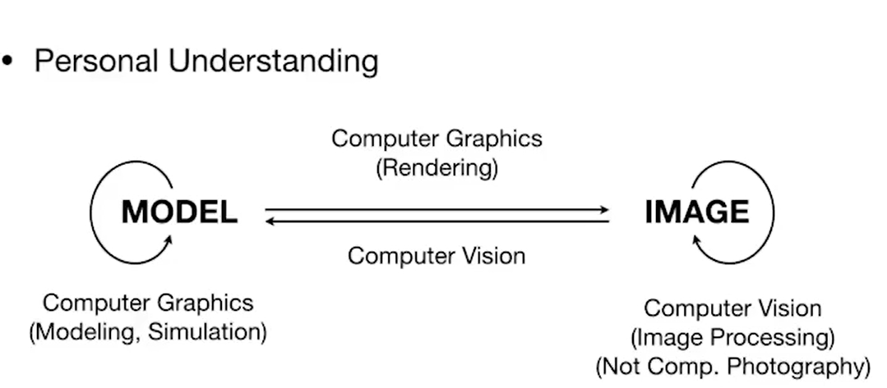
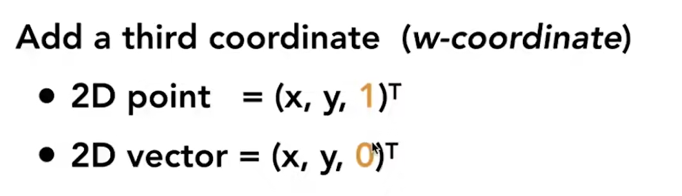
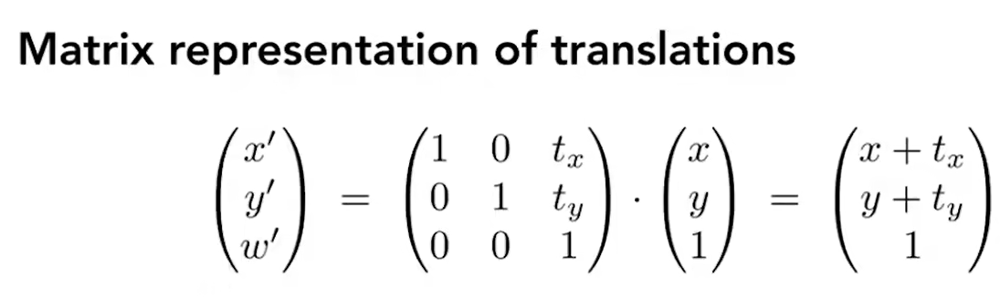
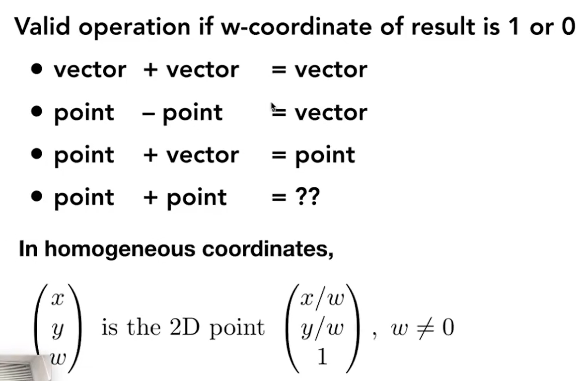

[TOC]

# 1、CV-CG Relation

# 2、Transformation

## 2.1、Homogeneous Coordinate

> - **纳尼**？
>
>   - 在本来的坐标上加上了第三个坐标
>
>     其中1表明是点，0表明是vector
>
>   - 
>
>   
>
> - **为什么我要add third dimension**?
>
>   因为如果我在do image translation时，等式只能写成
>   $$
>   M_1=AM+B\\
>   \text{但是，尝龟操作是}M_1=AM\text{，我们只想unify天下}\\
>   \text{并且有一说一，平移其实是point的变化，而不是vector的移动}\\
>   \text{何不采取above operation，设置一个mark位}\\
>   \text{而且这个mark位置设计的很好，下面会说为什么}
>   $$
>   
>
> - **它这么搞merits在哪**？
>
>   - 首先`解决了unit的问题`
>
>     
>
>   - 并且不违背咱们的基本原理，你把0和1带进去计算一下就完事了
>
>     *点加点的话，同时除以w，依然能让mark为1，并且坐标为其平均值*，两个点就是其中位点
>   
>   

