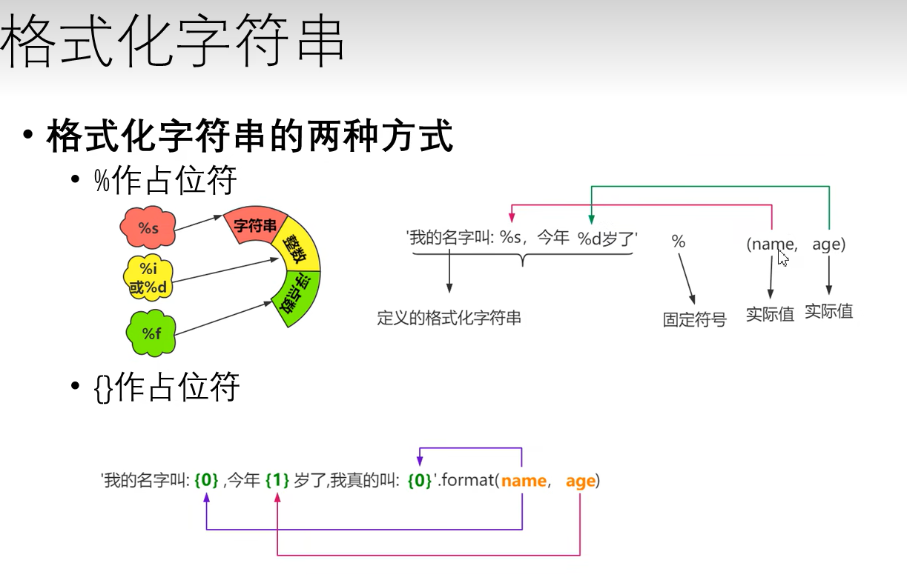
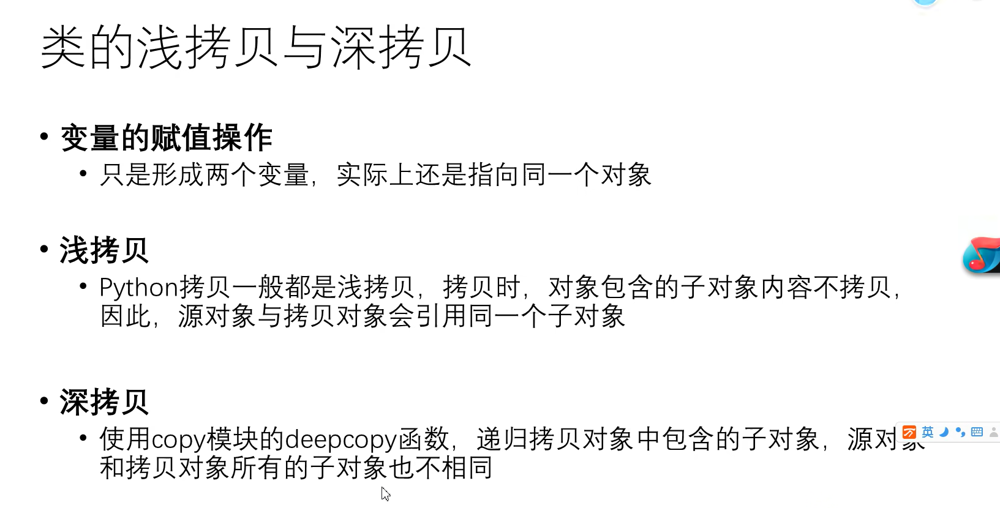

[TOC]


# 一、简介

> 一切皆对象

 


# 二、语法

## 1、print

> Python解释器，我滴超人
>
> - 就注意以下`字符串带引号`就完事了

 


### 1.1、输出到文件

```python
if __name__ == '__main__':
    print(11)
    print("11")
    # 左边参数文件路径不存在则创建文件	右边是覆盖方式
    fp=open('C:/Users/Lzo/Desktop/aa.txt', 'a')
    # 要有个file=fp
    print('niubi', file=fp)
    fp.close()
```


## 2、转义字符

> - \b：退格，33\b44 ——> 344
> - `不希望转移字符起作用`
>   - 在字符串的引号前加上r或者R，print(r"11\t22\n33\b44)

```python
print("11\t22\n33\b44")
print(r"11\t22\n33\b44")
print(R"11\t22\n33\b44")

# 输出:
11	22
344
11\t22\n33\b44
11\t22\n33\b44
```


## 3、保留字和标识符

> - 以下为保留字，我import keyword，然后打印keyword.kwlist找到的，蛮骚的
>   - ['False', 'None', 'True', 'and', 'as', 'assert', 'async', 'await', 'break', 'class', 'continue', 'def', 'del', 'elif', 'else', 'except', 'finally', 'for', 'from', 'global', 'if', 'import', 'in', 'is', 'lambda', 'nonlocal', 'not', 'or', 'pass', 'raise', 'return', 'try', 'while', 'with', 'yield']


### 3.1、变量

> - 变量 = 对象的地址 = 引用
> - 变量三个组成部分：标识(内存地址，盲猜逻辑地址(bushi...))、类型、值
> - 变量名赋值其实是`地址赋值`

 

 

> 下图，方便理解
>
>  


## 4、数据类型

 


### 4.1、整数类型

 

```python
    print(type(-1))
    print('十进制', 118)
    print('二进制', 0b1010111)
    print('八进制', 0o176)
    print('十六进制', 0x1EAF)
    
# 输出
<class 'int'>
十进制 118
二进制 87
八进制 126
十六进制 7855
```


### 4.2、浮点类型

> - 使用`浮点数进行计算`的时候，可能会出现`小数位数不确定`的情况
>   - 解决办法：`导入模块decimal`

 


```python
    from decimal import Decimal
	print(type(3.14159))
    print('普通加法：1,1+' + '2.2=')
    print(1.1+2.2)
    print('导入模块Decimal后：1,1+' + '2.2=')
    print(Decimal('1.1') + Decimal('2.2'))
    
# 输出
<class 'float'>
普通加法：1,1+2.2=
3.3000000000000003
导入模块Decimal后：1,1+2.2=
3.3
```


### 4.3、布尔类型

> - 数据类型为`bool`
> - TRUE可以当成整形1用；FALSE可以当成0用

 

> **对象的布尔值**

  


### 4.4、字符串类型

> - 三引号定义的字符串可以分布在连续的多行

 


### 4.5、类型转换

> - str()
> - int()
>   - 小数字符串无法转换为int
> - float()

 


## 5、注释

```python
    # 注释可以这样写
    '''也可以
        这样写'''
```

 


## 6、输入函数input()

```python
abc = input('你想要什么礼物呢？')
print(abc)
ccc = int(input('输入一个整数: '))
print(ccc)
    
# 输出
你想要什么礼物呢？你
你
1
1
```

 


## 7、运算符

### 7.1、算术运算符

> //（整除运算）:
>  10 // 3 = 3
>
> 
>
> **（幂运算）：
>
> 2**3 = 2^3 = 8
>
> 
>
> - 注意正负数运算的特别之处
>   - 取整运算时，一正一负向下取整
>   - 求余时，余数 = 被除数 - 除数*商（商为整除的值）

 


### 7.2、赋值运算符

> - 注意//= 和 **=
> - 链式赋值：a=b=c=20时，abc的id都是一样的（同一个对象）
> - 系列解包赋值：对应位置赋值和赋引用
>   - 因此交换值就有个骚操作，a,b=b,a（交换ab的值）

 


### 7.3、比较运算符

> - ==：对象的value的比较
> - is，is not：变量id的比较，是否指向同一对象

  


### 7.4、布尔运算符

> - in和not in
>   -  

 


### 7.5、位运算符

> - 移位相当于乘除2
> - 注意&只有两元都是1(不能是其他数)，最终结果才为1

```python
    print(1&2)
    print(0|2)
    print(4>>1)
    print(4<<1)
    
# output
0
2
2
8
```

  


###  运算符优先级

  


## 8、分支结构

```python
    if 1<=1:
        print(1)
    elif 2>=2:
        print(2)
    else:
        print(3)
```

 


## 9、条件表达式的语法糖

```python
    num_a = input("输入第一个整数")
    num_b = input("输入第二个整数")
	# 贼骚的语法糖
    print('num_a > numb' if num_a > num_b else 'num_a <= num_b')

# output
输入第一个整数20
输入第二个整数10
num_a > numb

输入第一个整数10
输入第二个整数10
num_a <= num_b
```


**pass语句**

> - 整不会了什么玩意

 这玩意写在这里跟个空气一样，语法不会报错


## 10、循环分支

### 10.1、range函数

> - 注意`右开`
> - application
>   - 用这个作为for循环遍历对象

```python
r=range(10)
# 用以check range对象的整数sequence
print(list(r))

print(10 in r)
print(10 not in r)

print(range(1,20,2))

# output
[0, 1, 2, 3, 4, 5, 6, 7, 8, 9]
False
True
range(1, 20, 2)
```

 


### 10.2、while

```python
a=1
while a<1:
	print(a)
	a+=1
```

 


### 10.3、for-in循环

> - 如果我只是用循环，不需要迭代内容呢
>   -   

```python
# 将i作为可迭代对象
for item in 'Python':
	print(item)

# 输出
python
```

 


### 10.4、break/continue

没啥区别


### 10.5、while/for else搭配

> - 循环正常执行完就会执行else
>
>   也就是遇到了break就不执行了
>
> - application
>
>   -  

  


## 总结

 


# 三、container

## 1、列表

```py
    lst = ['1', 21, '3']
    print(id(lst))
    print(type(lst))
    print(lst)
    
# output
2803259905792
<class 'list'>
['1', 21, '3']
```

 


### 1.1、创建

```python
    # 创建列表的第一种方式，直接使用[]
    lst1 = ['1', 21, '3']
    # 第二种方式，使用内置函数list()
    lst2 = list(['1', 21, '3'])
```


### 1.2、访问元素

> - 可以访问负的索引
> - 动态分配和回收内存的，不必在意底层的列表结构、扩容等

```python
    lst1 = ['1', 21, '3']
    print(lst1[1])
    print(lst1[-1])
    
# output
21
3
```

 具体**负数坐标如左图**


### 1.3、索引相关

```python
    lst1 = ['1', 21, '3', '1']
    # 若有重复的元素，获取最近的元素的下标
    print(lst1.index('1'))
    # 在指定区间查找元素
    # note that 左闭右开
    print(lst1.index('1', 1, 4))
    
# output
0
3
```

 


### 1.4、对列表进行切片

> - 切出来的列表对象，是新的拷贝的对象，即id变了
>
> - 有个可以实现逆序输出的骚操作
>
>   ```python
>   print(lst[::-1])
>   ```
>
>   

```python
    lst1 = ['1', 21, '3', '1']
    print('former: ', lst1)
    # 同样左闭右开
    # 三种写法都是默认step为1
    lst11 = lst1[1:3:1]
    lst11 = lst1[1:3]
    lst11 = lst1[1:3:]
    print('later: ', lst11)
    lst11 = lst1[4::-1]
    print('later(minus step): ', lst11)
    # 左闭右开，死性不改
    lst11 = lst1[4:0:-1]
    print('later(minus step): ', lst11)
    
# output
former:  ['1', 21, '3', '1']
later:  [21, '3']
later(minus step):  ['1', '3', 21, '1']
later(minus step):  ['1', '3', 21]
```

 


### 1.5、判断元素存在否/遍历列表

 


### 1.6、列表添加元素

```python
    lst1 = ['1', 21, '3', '1']
    lst2 = list(['1', 21, '3'])
    # 添加元素
    print('追加到列表的末尾')
    lst1.append(123)
    print('add one element', lst1)
    lst1.append(lst2)
    print('add one list(as an element)', lst1)
    print()

    print('一次在末尾追加多个元素')
    lst1.extend(lst2)
    print('add many elements', lst1)
    print()

    print('在指定位置插入元素')
    lst1.insert(2, '新插入的元素')
    print(lst1)
    print()

    print('切片添加元素')
    # 此处相当于把下标>1的元素全部切走了
    lst1[1:] = lst2
    print(lst1)
    
# output
追加到列表的末尾
add one element ['1', 21, '3', '1', 123]
add one list(as an element) ['1', 21, '3', '1', 123, ['1', 21, '3']]

一次在末尾追加多个元素
add many elements ['1', 21, '3', '1', 123, ['1', 21, '3'], '1', 21, '3']

在指定位置插入元素
['1', 21, '新插入的元素', '3', '1', 123, ['1', 21, '3'], '1', 21, '3']

切片添加元素
['1', '1', 21, '3']
```

 


### 1.7、删除元素

```python
    print('原列表: ', lstdel)
    print('----remove方法----')
    # 移除第一个找到的元素
    lstdel.remove(10)
    print('移除了10: ', lstdel)
    print('----pop方法----')
    # pop根据索引移除元素
    lstdel.pop(1)
    print('移除了下标为1的元素: ', lstdel)
    # 不指定下标，将会删除最后一个元素
    lstdel.pop()
    print('默认移除最后一个下标的元素: ', lstdel)
    print('----补充元素50,60,70----')
    lstdel.extend([50, 60, 70])
    print(lstdel)
    print('----切片删除----')
    # 其实就是用空列表替代某个区间的元素
    lstdel[1:3] = []
    print('对[1,3)切片后: ', lstdel)

    print('----clear和del----')
    lstdel.clear()
    print('经过clear元素后的列表: ', lstdel)

    del lstdel
    print('当列表被del删除了对象，再进行访问时')
    print(lstdel)


# output
原列表:  [10, 20, 10, 30]
----remove方法----
移除了10:  [20, 10, 30]
----pop方法----
移除了下标为1的元素:  [20, 30]
默认移除最后一个下标的元素:  [20]
----补充元素50,60,70----
[20, 50, 60, 70]
----切片删除----
对[1,3)切片后:  [20, 70]
----clear和del----
经过clear元素后的列表:  []
当列表被del删除了对象，再进行访问时
Traceback (most recent call last):
  File "C:\xxxx", line 112, in <module>
    print(lstdel)
          ^^^^^^
NameError: name 'lstdel' is not defined
```

 


### 1.8、修改

> - 切片这个挺骚的

```python
	lst = [10, 20, 30]
	lst[1:2] = [40, 50, 60]
	print(lst)

#output
[10, 40, 50, 60]
```

  


### 1.9、排序

> - sort是在原列表基础上排序的，sorted是在拷贝的列表上排序的

```python
    lstint = [1, 4, 2, 3]
    print('---使用sort排序，不会产生新对象---')
    # 默认reverse=FALSE
    lstint.sort()
    # lstint.sort(reverse=True)
    print('顺序', lstint)
    lstint.sort(reverse=True)
    print('逆序', lstint)
	
    print('---使用内置函数sorted()排序，会产生一个新的列表对象---')
    new_list = sorted(lstint)
    print('listint: ', lstint)
    print('new_list(顺序): ', new_list)

    new_list = sorted(lstint, reverse=True)
    print('listint: ', lstint)
    print('new_list(逆序): ', new_list)
    
# output
---使用sort排序，不会产生新对象---
顺序 [1, 2, 3, 4]
逆序 [4, 3, 2, 1]

---使用内置函数sorted()排序，会产生一个新的列表对象---
listint:  [4, 3, 2, 1]
new_list(顺序):  [1, 2, 3, 4]
listint:  [4, 3, 2, 1]
new_list(逆序):  [4, 3, 2, 1]
```

 


### 1.10、列表生成式

> - 说白了就是把每个列表元素 用表达式变化后 放入列表

```python
    lst = [i*i for i in range(1, 10)]
    print(lst)

    lst2 = [i*2 for i in range(1, 10)]
    print(lst2)

# output
[1, 4, 9, 16, 25, 36, 49, 64, 81]
[2, 4, 6, 8, 10, 12, 14, 16, 18]
```

 


## 2、字典

### 2.1、什么是字典

> - 说白了就是键值对

  

  


### 2.2、字典创建

```python
    # 1.使用{}创建字典
    score = {'啊': 1, '这': '666'}
    print(score)

    # 2.使用dict()创建
    student = dict(name='ak', no=11)
    print(student)

    # 3.创建空字典
    d = {}
    print(d)
    
# output
{'啊': 1, '这': '666'}
{'name': 'ak', 'no': 11}
{}
```

 


### 2.3、元素获取

> - 两者区别
>   - 如果[]查找失败，就会抛出error
>   - 如果.get查找失败，就会返回一个None
> - .get可以设置不存在时默认返回的值

```python
    score = {'啊': 1, '这': '666'}
    print(score['啊'])
    print(score.get('这'))
    # 查找不存在时则会返回默认值
    print(score.get('不存在的值', '默认值'))
    
# output
1
666
默认值
```

 


### 2.4、增删改

```python
    score = {'啊': 1, '这': '666'}
    print('啊' in score)
    print('啊' not in score)
    del score['啊']
    print('删除\'啊\'后的字典: ', score)
    score.clear()
    print('clear后的字典: ', score)
    score['newKey'] = 'value'
    print('新增key-value之后的dictionary: ', score)
    
# output
True
False
删除'啊'后的字典:  {'这': '666'}
clear后的字典:  {}
新增key-value之后的dictionary:  {'newKey': 'value'}
```

 


### 2.5、视图

```python
    score = {'啊': 1, '这': '666'}
    # 获取所有的key
    keys = score.keys()
    print('类型为', type(keys), ': ', keys)
    print('转型为列表输出: ', list(keys), '\n')

    # 获取所有的value
    values = score.values()
    print('类型为', type(values), ': ', values)
    print('转型为列表输出: ', list(values), '\n')

    # 获取所有的键值对
    items = score.items()
    print('类型为', type(items), ': ', items)
    print('转型为列表输出: ', list(items), '\n')
    
# output
类型为 <class 'dict_keys'> :  dict_keys(['啊', '这'])
转型为列表输出:  ['啊', '这'] 

类型为 <class 'dict_values'> :  dict_values([1, '666'])
转型为列表输出:  [1, '666'] 

类型为 <class 'dict_items'> :  dict_items([('啊', 1), ('这', '666')])
转型为列表输出:  [('啊', 1), ('这', '666')] 
```

 


### 2.6、遍历

```python
    score = {'啊': 1, '这': '666'}
    # 字典元素的遍历
    for item in score:
        print(item, ': ', score.get(item))
        
# output
啊 :  1
这 :  666
```

 


### 2.7、特点

> - key只能是不可变对象(指的是地址值不变)
>   - 如lst这种就是可变对象，不能经过哈希函数后放入hash表中

 


### 2.8、字典生成式

> - 长度不一样，以最短为准

```python
    items = ['Moeny', 'People']
    data1 = [111, 'none']
    data2 = [111, 'none', 'More']
    # upper是指大写的意思
    d = {item.upper(): data for item, data in zip(items, data1)}
    print(d)
    # 对于不等长的列表，以最短的为准
    d = {item: data for item, data in zip(items, data2)}
    print(d)
    
# output
{'MOENY': 111, 'PEOPLE': 'none'}
{'Moeny': 111, 'People': 'none'}
```

 

 


## 总结

 


## 3、元组

  


### 3.1、创建

> - 只创建一个元素时。需要加上逗号

```python
    # 第一种，创建元组的方式
    t = ('python', 'world', 98)
    t = 'python', 'world', 98  # 省略括号
    print(t)
    print(type(t))
    print()

    # 第二种，使用内置函数tuple()
    t1 = tuple(('python', 'world', 98))
    print(t1)
    print(type(t1))
    print()

    # 只用一个元素，必须加上逗号
    t2 = ('matlab', )
    print(t2)

    # 空元组
    t3 = ()
    t3 = tuple()
    print(t3)
    
# output
('python', 'world', 98)
<class 'tuple'>

('python', 'world', 98)
<class 'tuple'>

('matlab',)
()
```

 


### 3.2、为什么要为不可变序列

> - 其实所谓“不可变”。可以理解为`引用不可变`
>
>   因为你给元组元素赋值
>
>   t = (1, '12', '3')
>
>   t[0] = 2 # 其实是把‘2’的引用放到t[0]去

 


### 3.3、遍历

```python
   t = 'python', 'world', 98  # 省略括号
   for item in t:
        print(item)
        
# output
python
world
98
```


## 4、集合

> - 没有value的字典

 


### 4.1、创建

```python
    # 第一种创建方式，会自动把重复的删除
    s = {1, 2, '3', '3'}
    print(s, type(s))

    # 第二种方式使用set()
    s1 = set([1, '2', 3, 1])
    print(s1, type(s1))

    s2 = set('12345')
    print('输出为乱序: ', s2)

    # 空集合
    s3 = {} # 此种创建方法为字典，故只能使用set()
    s3 = set()
    print(s3)
    
# output
{1, 2, '3'} <class 'set'>
{1, '2', 3} <class 'set'>
输出为乱序:  {'2', '1', '3', '4', '5'}
set()
```

 


### 4.2、判/增/删

```python
    ss = {1, 2, 3, '11'}
    # 集合元素的判断操作
    print(1 in ss)
    print(1 not in ss)

    # 集合元素的新增操作
    ss.add('new')
    print(ss)
    ss.update({100, 200})  # 插入元组
    ss.update([300, 400])  # 插入列表
    print(ss)

    # 集合元素的删除操作

    # 删除失败抛异常
    ss.remove(100)
    # 删除失败不抛异常
    ss.discard(1)
    # pop随机元素，不能指定参数
    ss.pop()
    print(ss)

    # clear清空集合的元素
    ss.clear()
    print(ss)
    
# output
True
False
{1, 2, 3, 'new', '11'}
{1, 2, 3, 100, 'new', 200, 300, 400, '11'}
{3, 'new', 200, 300, 400, '11'}
set()
```

 


### 4.3、集合间的关系

```python
    s = {10, 20}
    s1 = {20, 10}
    # 尽管顺序不一，但是仍然是一个集合
    print(s == s1)

    s2 = {10, 20, 30, 40}
    s3 = {30, 40}
    # s3是否是s2的子集
    print(s3.issubset(s2))
    # s2是否是s3的超集
    print(s2.issuperset(s3))
    # s3和s是否不具有有交集
    print(s.isdisjoint(s3))
    
# output
True
True
True
True
```

 


### 4.4、集合的数学操作

> - 注意使用符号操作的时候`注意先后顺序`

```python
    t1 = {10, 20, 30, 40}
    t2 = {20, 30, 40, 50, 60}
    # （1） 取交集
    print(t1.intersection(s2))
    # 等同于取交集操作
    print(t1 & t2)

    # （2） 取并集
    print(t1.union(t2))
    # 等同于取并集
    print(t1 | t2)

    # （3）差集操作
    print(t1.difference(t2))
    # 等同于取对称差集
    print(t1 - t2)

    # （4）对称差集
    print(t1.symmetric_difference(t2))
    # 等同于取对称差集
    print(t1 ^ t2)
    
# output
{40, 10, 20, 30}
{40, 20, 30}
{40, 10, 50, 20, 60, 30}
{40, 10, 50, 20, 60, 30}
{10}
{10}
```

 


### 4.5、列表生成式

```python
    # 集合生成式
    s = {i*i for i in range(1, 5)}
    print(s)
    
# output
{16, 1, 4, 9}
```

 


# 总结

 

 


# 四、字符串

 


## 1、字符串的创建与驻留机制

> - 字符串常量池

 


> - **什么叫符号标识符的字符串**？
>
>   数字、字母、下划线
>
>   - a = 'abc%'
>
>     b = 'abc%'
>
>     a is not b
>
>     但是如果a='abc' b='abc' a is b
>
>     区别在于这个%
>
> - `但是pycharm优化了上面的驻留机制`
>
> - **什么叫做只在编译时进行驻留，而非运行时**？
>
>   - ```python
>         a = 'abc'
>         # 加号在编译时就默认进行了，相当于编译后b = 'abc'
>         b = 'ab' + 'c'
>         # 在运行时，才会执行内置函数join，故编译后c=''
>         c = ''.join('abc')
>         print(a is b)
>         print(a is c)
>                                     
>     # output
>     True
>     False
>     ```
>
>     

 


> - 建议在字符串拼接的时候使用：join方法

 


## 2、常用操作

### 2.1、查找

 

```python
    s = 'hello,hello'
    print('子串第一次出现的位置(异常版):', s.index('lo'))
    print('子串最后一次出现的位置(异常版):', s.rindex('lo'))
    print('子串第一次出现的位置(无异常版):', s.find('lo'))
    print('子串最后一次出现的位置(无异常版):', s.rfind('lo'))
    
# output
子串第一次出现的位置(异常版): 3
子串最后一次出现的位置(异常版): 9
子串第一次出现的位置(无异常版): 3
子串最后一次出现的位置(无异常版): 9
```


### 2.2、大小写转换

> - 大小写转换后的字符串`会创建新的对象(id)`

 

```python
    s = 'love you'
    a = s.upper()
    print(a)
    print(id(s))
    print(id(a))
    
    s1 = a.lower()
    print(s1)
    print(id(s1))

# output
LOVE YOU
1921951173552
1921951173360
love you
1921951173488
```


### 2.3、对齐

 


```python
    # 居中对齐
    s = 'halo ll'
    print(s.center(11, '*'))

    # 左对齐
    # 用*号填充
    print(s.ljust(10, '*'))
    # 默认空格填充
    print(s.ljust(10))
    # 返回原字符串
    print(s.ljust(5))

    # 右对齐
    # 用*号填充
    print(s.rjust(10, '*'))
    # 默认空格填充
    print(s.rjust(10))
    # 返回原字符串
    print(s.rjust(5))

    # 右对齐，使用0进行填充
    print(s.zfill(10))
    # 返回原字符串
    print(s.zfill(5))
    # 给带有符号的数填充 会填充在符号的后面
    print('+1'.zfill(5))
    
# output
**halo ll**
halo ll***
halo ll   
halo ll
***halo ll
   halo ll
halo ll
000halo ll
halo ll
+0001
```


### 2.4、分割

> - 返回值是`一个列表`
> - `默认按照空格分割`

 

```python
    s = 'hello world Python'
    lst = s.split()
    print(lst)

    s1 = 'hello|world|python'
    lst = s1.split(sep='|')
    print(lst)
    lst = s1.split(sep='|', maxsplit=1)
    print(lst)
    
    # 从右侧开始切分
    lst = s1.rsplit(sep='|', maxsplit=1)
    print(lst)
    
# output
['hello', 'world', 'Python']
['hello', 'world', 'python']
['hello', 'world|python']
['hello|world', 'python']
```


### 2.5、判断

 

```python
    # 是否是合法标识符
    print('$'.isidentifier())
    # 判断是否全为空格组成
    print('\t'.isspace())
    # 判断字符串是否全有字母组成
    print('ab1'.isalpha())
    # 判断是否全由十进制的阿拉伯数字组成
    print('111'.isdecimal())
    # 判断是否由数字组成，包括：汉字的数字、罗马数字
    print('1四Ⅱ'.isnumeric())
    # 是否全由字母和数字组成
    print('1a!'.isalnum())
    
# output
False
True
False
True
True
False
```


### 2.6、替换

  

```python
    s = 'hello python python'
    print(s.replace('python', 'java'))
    # 只替换一次
    print(s.replace('python', 'java', 1))

    # 列表
    lst = ['1', '2']
    print('|'.join(lst))
    print(''.join(lst))

    # 元组
    t = ('111', '222')
    print(''.join(t))

    # 字符串
    print(' '.join('666'))
    
# output
hello java java
hello java python
1|2
12
111222
6 6 6
```


### 2.7、比较

 

```python
    # 得到字符的ASCII码
    print(ord('a'), ord('b'))

    # 得到ASCII码得到字符
    print(chr(97))

    '''
        == 和 is的区别
        == 比较的是value
        is 比较的是id
    '''
    a = b = 'Pq'
    print(a == b)
    print(a is b)
    
# output
97 98
a
True
True
```


### 2.8、切片

```python
    '''
        == 和 is的区别
        == 比较的是value
        is 比较的是id
    '''
    a = b = 'Pq'
    print(a == b)
    print(a is b)

    tt = '123,456'
    # 切割区间，左闭右开
    t = tt[:3]
    print(t)
    # 切割区间，左闭右开
    t = tt[4:]
    print(t)

    # 从[0,4)，步长为2
    t = tt[0:4:2]
    print(t)
    # 从0开始，默认到末尾，步长为2
    t = tt[::2]
    print(t)
    # 从末尾开始，到0为止，步长为1
    t = tt[::-1]
    print(t)
    
# output
True
True
123
456
13
1346
654,321
```


### 2.9、格式化字符串

 


 

```python
    name = '111'
    age = 2
    # %
    print('我是%s, 我年龄为%d' % (name, age))
    # {}
    print('我叫{}，今年{}'.format(name, age))
    # .2f: 保留两位小数，.3:一共3位数
    print('{:.2f}, {:.3}'.format(3.123, 1.1111))
    # f'{}'
    print(f'我叫{name}, 今年{age}')
    
# output
我是111, 我年龄为2
我叫111，今年2
3.12, 1.11
我叫111, 今年2
```


### 2.10、字符串的编码转换

​	 

```python
    s = '花终于开了'
    # 编码
    byte = s.encode(encoding="GBK")
    # 解码
    print(byte.decode(encoding='GBK'))

# output
花终于开了
```


# 五、函数

## 1、基本语法

> - 有个关键字传参挺骚的
>
>   ```python
>       reslut = calc(b=1, a=2)
>       print(reslut)
>   ```

```python
    def calc(a, b):
        c = a + b
        return c

    # 位置传参
    reslut = calc(10, 20)
    print(reslut)

    reslut = calc(b=1, a=2)
    print(reslut)
    
# output
30
3
```


> - 可以返回多个元素，以元组结构返回

```python
    def calc(a, b):
        c = a + b
        return c, 1

    reslut = calc(10, 20)
    print(reslut)
    
# output
(30, 1)
```


## 2、函数参数定义

> - 当没有参数的时候，我可以给函数的形参设置默认值
> - *有默认值的参数一定要放在无默认值的参数后*

```python
    # 有默认值的参数一定要放在无默认值的参数后
    def azhe(a, b = 10):
        print(a, '', b)

    azhe(20)
    azhe(20, 20)
    
# output
20  10
20  20
```


> - 个数可变的位置参数
>
> - 个数可变的关键字参数
>
> - 参数只能有一个
>
>   - 除非
>
>     ```python
>     def fun(*args, *args):
>     	pass
>     ```

```python
    def bian(*args):
    print(args)

    # 打印结果是元组
    bian(1, 2, 3)
    bian(1)
    
# output
(1, 2, 3)
(1,)
    
    
    def fun(**kwargs):
        print(kwargs)

    fun(a=10)
    fun(b=20, c=30, a=10)
    
# output
{'a': 10}
{'b': 20, 'c': 30, 'a': 10}
```


> - 展示一下`可变长度的位置形参`和`可变长度的关键字形参`的作用

```python
    # 直接传递一个列表
    def funn(a, b, c):
        print(a, '', b, '', c)
    list = [1, 2, 3]
    funn(*list)

    # 传递一个字典
    # 如果key没有完全对应参数名字就不能输出
    dict = {'a':3, 'b':2, 'c':1}
    funn(**dict)

    # 从*之后的参数，调用只能使用关键字
    def fnn(a, b, *, c):
        print(a, '', b, '', c)
    fnn(1, 2, c=3)
    
# output
1  2  3
3  2  1
1  2  3
```


# 总结

 


# 六、异常

## 1、try-execpt-else/-finally


 	   

```python
try:
    print('1')
except BaseException as e:
    traceback.print_exc()
else:
    print('啊对对对')
finally:
    print('无所吊谓，我会出手')
```


## 2、常见bug类型

​	    


## 3、手动异常

​	     

```python
    try:
        print('1')
    except BaseException as e:
        traceback.print_exc()
    else:
        print('啊对对对')
    finally:
        print('无所吊谓，我会出手')
```


# 三、大的要来了

## 1、类

### 1.1、创建

 


### 1.2、对象的创建


 


### 1.3、类属性、类方法、静态方法

 


```python
class NewBee:
    nive_you = "newBee"

    def __int__(self, you):
        self.you = you

    # 实例方法
    def fk(self):
        print("fk you  ", self)

    # 静态方法
    @staticmethod
    def staticMe():
        print("这都啥啥啥啊")

    # 类方法
    @classmethod
    def cM(cls):
        print("事学生")


nb = NewBee()
print(NewBee)
print(id(nb))
print(type(nb))
print(nb)

print("\n-----调用类属性-----")
print(nb.nive_you)
# 修改了类属性
NewBee.nive_you = "azhe"
print(nb.nive_you)

print("\n-----调用实例方法-----")
# 调用实例方法
nb.fk()
# 通过类调用实例方法，传入的self为实例对象本身
NewBee.fk(nb)

print("\n-----类方法的使用-----")
NewBee.cM()

print("\n-----静态方法的使用-----")
NewBee.staticMe()


# output
<class '__main__.NewBee'>
2556617051088
<class '__main__.NewBee'>
<__main__.NewBee object at 0x0000025342404BD0>

-----调用类属性-----
newBee
azhe

-----调用实例方法-----
fk you   <__main__.NewBee object at 0x0000025342404BD0>
fk you   <__main__.NewBee object at 0x0000025342404BD0>

-----类方法的使用-----
事学生

-----静态方法的使用-----
这都啥啥啥啊
```


### 1.4、动态绑定属性和方法

 

```python
class WoCao:
    def __init__(self, name, age):
        self.name = name
        self.age = age
    def fk(self):
        print(self.name, "是个傻宝")

man1 = WoCao("n", 11)
man2 = WoCao("aw", 22)

print("-----为man1动态绑定一个gg属性-----")
man1.gg = "GG BOND"
print(man1.gg)

def newB():
    print("大的要来了")
print("-----为man2动态绑定一个WoCao类之外的函数-----")
man2.nm = newB()
man2.nm

# output
这都啥啥啥啊
-----为man1动态绑定一个gg属性-----
GG BOND
-----为man2动态绑定一个WoCao类之外的函数-----
大的要来了
```


## 2、封装/继承/多态

 

```python
class S:
    def __init__(self, name, age):
        self.name = name
        # 相当于一个private
        self.__age = age
    def getAge(self):
        print(self.__age)


s = S("wc", 20)
s.getAge()
# 也可以暴力访问
print("暴力访问：", s._S__age)

# output
20
暴力访问： 20
```


## 3、方法重写

 


## 4、object类

> - 重写自定义类的_ _ str _ _

 

```python
class Stu:
    def __init__(self, name, age):
        self.name = name
        self.age = age

    def __str__(self):
        return "我{1}是你爹{0}".format(self.name, self.age)


s = Stu("那边", 121)
print(s)

# output
我121是你爹那边
```


## 5、多态

 

 

```python
class Animal:
    def eat(self):
        print("大哥先吃")


class Dog(Animal):
    def eat(self):
        print("狗恰")


class Cat(Animal):
    def eat(self):
        print("猫恰")


class Person:
    def eat(self):
        print("人恰")


# 定义函数
def fun(obj):
    obj.eat()


# 调用函数
fun(Cat())
fun(Dog())
fun(Animal())
fun(Person())

# output
猫恰
狗恰
大哥先吃
人恰
```


## 6、特殊方法/属性

 

```python
class A:
    pass


class B:
    pass


class C(A, B):
    def __init__(self, name, age):
        self.name = name
        self.age = age


x = C("名字", "34")
print(x.__dict__) # 实例对象的属性字典
print(C.__dict__) # 类的属性字典
print("-------------")
print(x.__class__) # <class '__main__.C'> 输出了对象所属的类
print(C.__bases__) # C继承的全部的父类类型元素
print(C.__base__) # C继承的第一个父类
print(C.__mro__) # 类的层次结构
print(A.__subclasses__()) # 子类的列表

# output
{'name': '名字', 'age': '34'}
{'__module__': '__main__', '__init__': <function C.__init__ at 0x0000015C6CB8E660>, '__doc__': None}
-------------
<class '__main__.C'>
(<class '__main__.A'>, <class '__main__.B'>)
<class '__main__.A'>
(<class '__main__.C'>, <class '__main__.A'>, <class '__main__.B'>, <class 'object'>)
[<class '__main__.C'>]
```


```python
class C(object):
    def __init__(self, name, age):
        print("init被调用了，self的id值为: {0}".format(id(self)))
        self.name = name
        self.age = age

    def __new__(cls, *args, **kwargs):
        print("new被调用了，cls: {0}".format(id(cls)))
        obj = super().__new__(cls)
        print("创建的对象的id: {0}".format(id(obj)))
        return obj

print("object类id: {0}".format(id(object)))
print("C类id: {0}".format(id(C)))
a = C("mz", 10)
print("a实例对象id: {0}".format(id(a)))


# output
object类id: 140704729619248
C类id: 1941955553848
new被调用了，cls: 1941955553848
创建的对象的id: 1941955112072
init被调用了，self的id值为: 1941955112072
a实例对象id: 1941955112072
```


## 7、深拷贝和浅拷贝

 


> - 变量赋值操作
>   - 赋值的地址

> - 浅拷贝
>   - 源对象和拷贝对象的子对象都是相同的

> - 深拷贝
>   - 源对象和拷贝对象的子对象不相同

```python
class CPU:
    pass


class Disk:
    pass


class Computer:
    def __init__(self, cpu, disk):
        self.cpu = cpu
        self.disk = disk


# （1）变量赋值
cpu1 = CPU()
cpu2 = cpu1
print("变量赋值：\ncpu1地址为：{0}\ncpu2地址为：{1}\n".format(cpu1, cpu2))

# （2）类的浅拷贝
disk = Disk()  # 硬盘类的对象
computer1 = Computer(cpu1, disk)  # 计算机类的对象


import copy
computer2 = copy.copy(computer1)
print("浅拷贝：")
print("----computer1----\ncomputer1地址:{0}\ncpu地址：{1}\ndisk地址：{2}\n".format(computer1, computer1.cpu, computer1.disk))
print("----computer2----\ncomputer2地址:{0}\ncpu地址：{1}\ndisk地址：{2}\n".format(computer2, computer2.cpu, computer2.disk))
computer3 = copy.deepcopy(computer1)
print("深拷贝：")
print("----computer1----\ncomputer1地址:{0}\ncpu地址：{1}\ndisk地址：{2}\n".format(computer1, computer1.cpu, computer1.disk))
print("----computer3----\ncomputer3地址:{0}\ncpu地址：{1}\ndisk地址：{2}\n".format(computer3, computer3.cpu, computer3.disk))

# output
变量赋值：
cpu1地址为：<__main__.CPU object at 0x0000027179397548>
cpu2地址为：<__main__.CPU object at 0x0000027179397548>

浅拷贝：
----computer1----
computer1地址:<__main__.Computer object at 0x0000027179397588>
cpu地址：<__main__.CPU object at 0x0000027179397548>
disk地址：<__main__.Disk object at 0x00000271793975C8>

----computer2----
computer2地址:<__main__.Computer object at 0x0000027179397608>
cpu地址：<__main__.CPU object at 0x0000027179397548>
disk地址：<__main__.Disk object at 0x00000271793975C8>

深拷贝：
----computer1----
computer1地址:<__main__.Computer object at 0x0000027179397588>
cpu地址：<__main__.CPU object at 0x0000027179397548>
disk地址：<__main__.Disk object at 0x00000271793975C8>

----computer3----
computer3地址:<__main__.Computer object at 0x0000027179397648>
cpu地址：<__main__.CPU object at 0x0000027179397808>
disk地址：<__main__.Disk object at 0x0000027179397F88>
```


## 8、模块

 


> - 内置模块

  


## 9、主程序

> - 当本module导包到A模块时，runA模块，而放在本modlue的`if __name__ == '__main__':`的代码不会被执行


## 10、包

 


## 11、文件

### 1、编码格式

> - python文件默认的就是UTF-8

 


### 2、读写原理


 

```python
file = open("a.txt", 'r')
print(file.readlines())
file.close()

# output
['wo草']
```


### 3、相关方法

 

 

```python
file = open("a.txt", 'r')
print(file.readlines())
file.close()
```


### 4、with语句

 


> - 上下文表达式：open("logo,png", "rb")，结果为上下文管理器-》一个类对象实现了enter和exit方法，表明遵守上下文协议，
>
>   它的实例对象即为上下文管理器，然后创建一个运行时上下文，自动调用enter方法，并将返回值赋给src_file -- 相当于一个赋值操作
>
> - 且当with语句块执行后，它会自动执行上下文管理器的exit()方法，就不用我们手动关闭了


### 5、OS模块

```python
import os
# 相当于cmd窗口，打开记事本，计算器
os.system('notepad.exe')
os.system('calc.exe')

# 直接执行可执行文件
os.startfile(".exe")


```

> - 下面的就是操作目录相关的了

 

 


# trail


`

`

`

`

`

`
