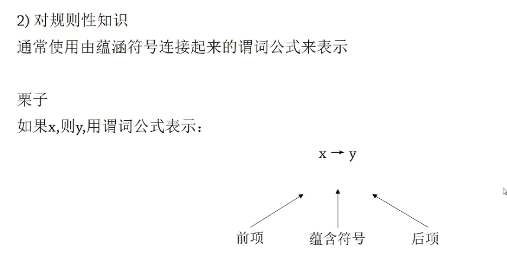
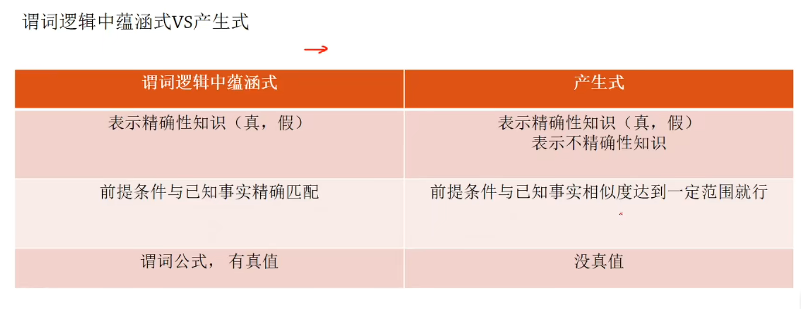

[TOC]

# 一、第一章：人工智能

## 1.1、智能定义

 

 

## 1.2、人工智能定义

 

### 1.2.1、类人行为系统/类人思维系统

 

 

### 1.2.2、图灵测试

 

### 1.2.3、理性思维系统/理性行为系统

 

 

## 1.3、研究方法

### 1.3.1、符号主义

### 1.3.2、连接主义

 

 

 

### 1.3.3、行为主义

 

## 1.4、应用领域

 

 

 

 

 

 

 

 

 

 

# 第二章：知识表示

## 2.1、知识和知识表示

### 2.1.1、知识

> - 描述性知识：回答“是什么”
> - 判断性知识：与领域有关的问题求解知识
> - 过程性知识：问题求解的控制策略，用判断性知识进行推理的知识

 

### 2.1.2、知识表示

> - 把人类知识“翻译”为计算机所能理解的形式，翻译 = 符号化

 

 

## 2.2、命题/谓词逻辑

### 2.2.1、命题逻辑

> - 命题逻辑强调“是什么”，即给一个物体命题

 

  

### 2.2.2、谓词逻辑

> - 强调一个事物的行为(状态)和个体间的关系，同时包含命题逻辑中对一个物体性质的定义功能

 

 

 

> - 说实话，我不是很明白

 

 

 

 

  

 

 

 

 

 

## 2.3、产生式表示法

### 2.3.1、概述

 

 

 

> - 确定性事实性知识 = 一个断言

 

> - 不确定性事实性知识

 

 

> - 比其谓词逻辑中的蕴含式，产生式只需要已知事实与前提条件达到相似度范围就可以了

 

### 2.3.2、产生式系统的组成

> - 

 

 

> - 实例
>
>   - 不难理解，其实就是在规则库中有n条规则，n个蕴含式，我现在有一个已知的条件，跟每条规则库进行匹配，找到匹配度最大的
>
>     然后得出结论。
>
>     当条件引起结论出现矛盾的时候就会根据可能性进行抉择

 

### 2.3.3、推理方式

> - 正向推理
>   - 挺好，反复正向推理，得到的事实B放入综合数据库，以B为前件继续推理...推理到需要的后件即可

 

> - 反向推理
>   - 不清楚怎么把冲突解决的，而且效率为啥子高啊

 

> - 优势

 

## 2.4、语义网络

> - NLP中的神

 

### 2.4.1、概述

> - 框架图罢了

 

 

 

### 2.4.2、基本语义联系

 

> - 事物的一部分，不会继承属性

 

> - 一个事物有另一个事物，有一种归属的关系，I have a car
> - 一个事物拥有什么属性

 

 

 

 

 

### 2.4.3、事实性知识的表示

> - 一些使用实例，下面为事实性知识的表示

 

> - 情况的表示
>   - 如果有不及物动词和没有简介宾语的及物动词，且该动作与句子的一切情况有关

 

> - 动作的表示
>   - 一个动作，既有主体，也有客体，所以给它设置一个动作节点

 

> - 事件的表示
>   - 把事件表示为事件节点

 

 

 

### 2.4.4、语义网络表示知识方法及步骤

 

 

> - 示例1

 

 

> - 示例2

 

 

### 2.4.5、推理过程

> - 第一个继承推理是，通过继承的手段找到它的所有子结点，并且归纳出属性值，即为第一个节点的属性值
>
> - 匹配推理：一般通行手段，就是你根据一个问题的要求去构造了网络片段，但是有些结点你不晓得，于是拿着这个网络片段去与知识库的语义网络
>
>   ​		的片段进行匹配，找到相匹配的片段时，就把找的的弧放到待求的弧

 

 

### 2.4.6、语义网络表示法的特点

 

## 2.5、框架表示法

### 2.5.1、概述

> - 槽是框架的直接属性，侧面是槽的直接属性

 

 

 

> - 示例：

 

 

 

 

> - 例题

 

 

### 2.5.2、推理方法

 

 

### 2.5.3、特点

  

 

# 三、第三章

# 四、第四章

## 4.1、模糊计算

 

### 4.1.1、模糊集合/推理/运算

 

 

 

#### (1)运算

> - 或特么当然去隶属度大的啦，它现在是隶属于一个新的A 或 B的集合了
> - 与当然去隶属度小的啦

 

### 4.1.2、模糊推理

#### (1)贴近度

 

> - 计算贴近度

 

> - 贴近度就是算接近程度，当已知事实与前件的接近程度达到一个值，就可以得到后件的模糊结论
>
> - 合取就是取得到的最小值序列的最大值。最大就是最吼啊
>
> - 析取就是取得到的最大值序列的最小值。管他呢最小就是好哦
>
> - 这个公式就是求得贴近度
>
>    

 

#### (2)简单模糊推理

扎德方法

> - 条件命题的极大极小规则和条件命题的算术规则得到的模糊关系分别记为Rm和Ra

    

> - 例题

 

 

 

# 五、第六章

## 5.1、归纳学习

### 5.1.1、概述

 

  

 

> - 单概念和多概念

 

### 5.1.2、变形空间

 

 

 

 

 

## 5.2、基于实例的学习

### 5.2.1、K近邻算法

> - 近朱者赤，近墨者黑

### 5.2.1、基于范例的学习

> - si

 

> - 一般过程

 

 

> - 用到框架了

 

 

 

## 5.3、决策树

### 5.3.1、概述和实例

> - 决策树  ×
>
>   filter √

  

> - 分析一下

 

### 5.3.2、单/多变量树

  

 

### 5.3.3、CLS算法

 

> - CLS的算法关于节点的选取是`随意`的，8太好

 

### 5.3.4、ID3算法

 

 

 

> - 具体算法

 

> - 结合实例分析

 

# 六、第七章

## 6.1、状态空间图

### 6.1.1、概述

 

> - 示例

 

 

 

### 6.1.2、问题的状态空间表示

 

 

 

> - 示例

  	

 

## 6.2、任务规划

 

> - 示例1
>   - 结合了一阶谓词的概念

 

> - 三个状态，初始-目标-三个动作

 

 

> - 示例2，积木世界

 

 

# 一、机器学习

## 1、分类

> - 四大分类方法
>
>   - 按`不同维度`可以进行不同分类，比如搜索排序中的LambdaMart模型，它既是判别式模型，又是监督学习模型，又是排序模型(learning2rank)
>
>   - 按`学习目标`：可以分为 生成式模型、判别式模型
>
>   - 按`学习方法`：监督学习模型，非监督学习模型，半监督学习模型，增强学习模型，对抗学习模型
>
>   - 按`应用方向`：分类，聚类，回归，排序，序列标注

## 2、学习方法

### 2.1、变型空间学习

> - 有监督学习方法

 

 

`

`

`

`

`

