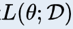
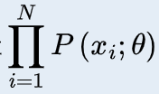
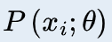
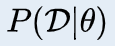
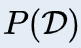
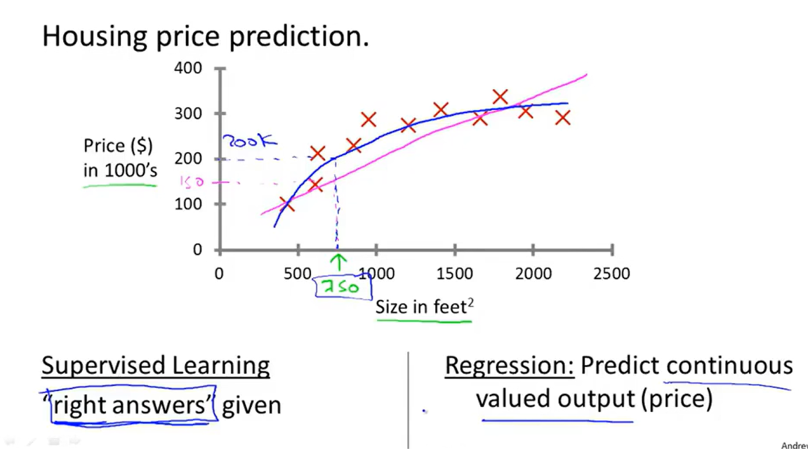
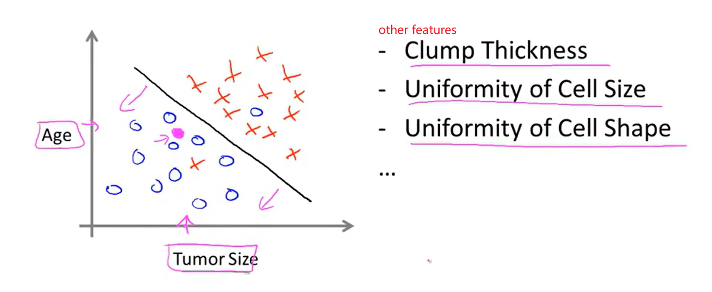
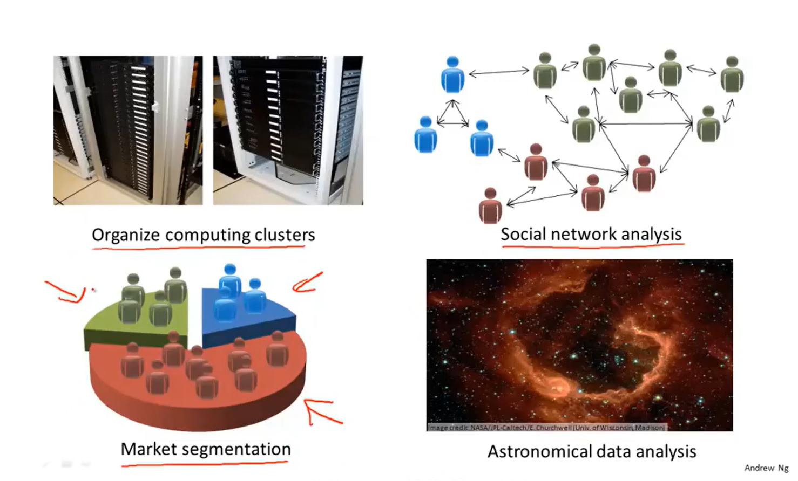

[TOC]

# Ⅰ.频率派和高斯派

## 1、频率派

> - 两哥们都是在干嘛的
>
>   - 首先你要知道推断统计是在干嘛
>
>     - 就是根据一部分样本来推测总体的特征或者参数
>
>       好比我们假设总体满足normal distribution
>
>       那么样本也需要满足normal distribution，sample的均值和方差好求，即让其代表整体的

> - 频率派
>
>   - 依靠样本的频率来估计参数
>
>   - 极大似然估计估计嘛
>     $$
>     \theta _{MLE}=arg\mathrm{max}\log P\left( x|\theta \right)
>     $$
>   
>   - 怎么理解`极大似然估计`？
>     - 已知表达式P(X|θ)，当X已知时，求使P(X|θ)最大的θ	
>

**极大似然估计**

> - Maximum Likelihood Estimation，MLE

> - **干嘛的**？
>   - 在`已知总体样本的分布`时，求出该分布的一些parameter
>
> - **core concept**
>
>   - 概率越大的事越容易发生，概率越小的事越不容易发生
>
> - **定义**
>
>   - 就是指似然函数
>
>      取得最大值的θ值即为最优的θ值
>     $$
>     \hat{\theta}_{M L}=\underset{\theta}{\arg \max } L(\theta ; \mathcal{D})=\underset{\theta}{\arg \max } \prod_{i=1}^{N} P\left(x_{i} ; \theta\right)
>     $$
>
> - **优化**
>
>   - 但由于这家伙连乘得到的值太小了，计算机进度hold不住，因此我们常常`对数化`，当然*乘法拆加法*也确实好算多了
>     $$
>     \ell(\theta ; \mathcal{D})=\log L(\theta ; \mathcal{D})
>     $$
>
> - **连续性变量**
>
>   - 能给出说明是离散型变量，而我们需要连续性变量怎么办呢？
>
>     其实我们知道
>     $$
>     P(X=x ; \theta) \propto f(X=x ; \theta)
>     $$
>     因此直接：`f替代p`

## 2、贝叶斯派

> - 贝叶斯学派套路
>   - **贝叶斯估计**
>   - 依据`先验信息`，通过当前的`样本信息`，推断`总体信息`

> - 贝叶斯派
>
>   - 认为θ不是一个常量，而是一个概率分布
>
>   - 怎么理解`贝叶斯估计`？
>
>     - $$
>       基于贝叶斯定理求出P(\theta|\mathcal{D})，
>       并且把这个值作为我们需要的P(\theta)\\
>       即P(\theta|\mathcal{D}) \rightarrow P(\theta)
>       $$
>
> 
>
>   - 怎么理解`贝叶斯定理(formula)`？
>
>     - 注：P`(θ)为先验概率
>
>     $$
>     P(\theta|\mathcal{D})
>     =\frac{P(\mathcal{D}|\theta) P'(\theta)}{P(\mathcal{D})}\\
>     ||\\
>     P(\text{因}|\text{果}) = \frac{P(\text{因})P(\text{果}|\text{因}) }{P(\text{果})}
>     $$
>
>      一个感性的认知：我们通常知道果是什么，但是我们不知道因是什么
>
>     因此就需要用贝叶斯公式去`由果即因`
>
>     - 关于 连乘看着唬人，其实就是这些individuals同时出现的概率嘛
>       $$
>       \begin{align}\begin{aligned}P(\mathcal{D}|\theta) &= P(\{x^{(1)},\ldots,x^{(N)}\}|\theta)\\&= \prod_{i=1}^{N} P(x^{(i)}|\theta)\end{aligned}\end{align}
>       $$
>
>     - 关于分母它是“果”，就是观测样本集的概率
>
>       归一化因子，就是分子所有有可能的和，目的就是`保证除式属于[0,1]`
>
>       *求和对分子积分就*OK了
>       $$
>       P(\mathcal{D}) = \int P(\mathcal{D}|\theta) P'(\theta) d\theta
>       $$

## 1 what

enheng

### 1.1 Supervised Learning

> - There is an `"Regression Problem"` for understanding
>
>   - `Supervised Learing`:
>
>     we gave the algorithm a `datas set` which contains "right answers"(here is a house price
>
>     data set).
>
>     The task of the algorithm `is to give more "right answers",` in other words, we give the 
>
>     coordinate x, and then we get coordinate y.
>
>   - `what is regression?`
>
>     we try to predict a sort of `continuous values attribute`.

 

> - An `”Classification problem“` contains `more than one feature, more than one attribute`.
>   - The result was determined by `Age and Tumore Size`.
> - What is Classificaiton problem?
>   - The outcome is yes or no.

 

### 2.2 Unsuperviesd Learing

> - `Clustering Algorithm`
>   - Let computer `automatically extract features` for `classificaiton`.

Application

 

`

`

`

`

`