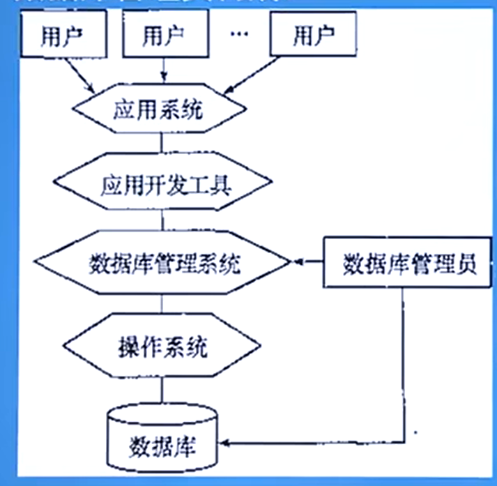
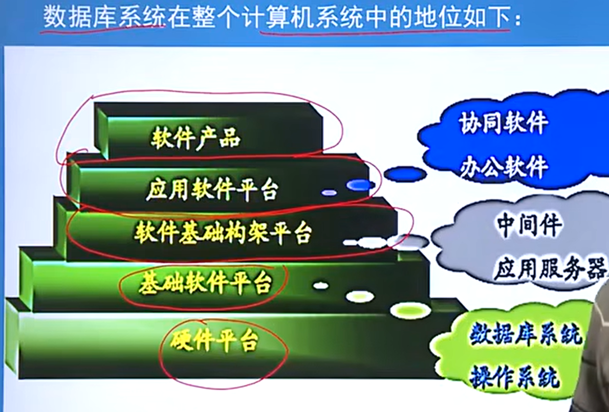

[TOC]

# 一、绪论

## 1、OUTLINE

> - 数据
>   - 描述事物的各种类型符号都是数据

> - 数据库
>   - 大量数据集合
>   - 数据库的数据具有永久性、组织性和共享性

> - 数据库管理系统DBMS
>   - **数据定义功能**
>     - DBMS提供数据定义语言DDL，用户通过它可以对数据库中的数据对象进行`定义`
>   - **数据组织、存储和管理**
>     - 组织：怎么存放数据高效，类似于搞个字典这种
>     - 存储：管理在哪存放，保留存放的路径
>     - 管理：数据的调度问题
>   - **操纵功能**
>     - 用户可以使用DML(Data Manipulation Language)操纵数据，完成CRUD
>   - **数据库的事务管理和运行管理**
>     - 主要是为了保证安全性和完整性
>       - 安全性：记录必要的日志，给不同qualified用户不同的authority
>       - 完整性：保证不仅要有数据，数据的类型也必须符合字段；迁移的时候，数据的类型和数据的值也不会变化。
>   - **数据库的建立和维护功能**
>     - 数据库初始数据的输入、转换功能、数据库的转储、恢复备份功能，还有一些什么性能监视、分析功能

> - 数据库系统的概念

> - 数据库系统的地位

## 2、数据管理技术

> - 经历过三个phase：人工管理、文件系统、数据库系统

> 1. **人工管理stage**
>    1. 数据不保存，表现为纸带使用完了就报废了
>    2. 应用程序管理数据，数据和program不分家，毕竟data用完就废了
>    3. 数据不共享，只能在一个executable program执行，不能跨机器
>    4. 数据不具有独立性，如上用了就报废了，当然不独立
>    5. 缺点：program的物理或者逻辑architecture发生变化，都需要换子带
> 2. 文件系统阶段
>    1. 数据可以长期保存
>    2. 文件系统可以管理，把其独立出来了
>    3. 缺点：文件不共享，冗余度大，好比A和B明明内容大差不差，但是仍然要分为两个大板块，说白了，还是不够细分，站在整体的角度；独立性差，`其他程序不能共享`
> 3. 数据库系统阶段
>    1. 数据结构化
>    2. 共享性高，冗余度低(这个后面细索)
>    3. 独立性高
>    4. 有DBMS统一管理

# 二、关系数据库

