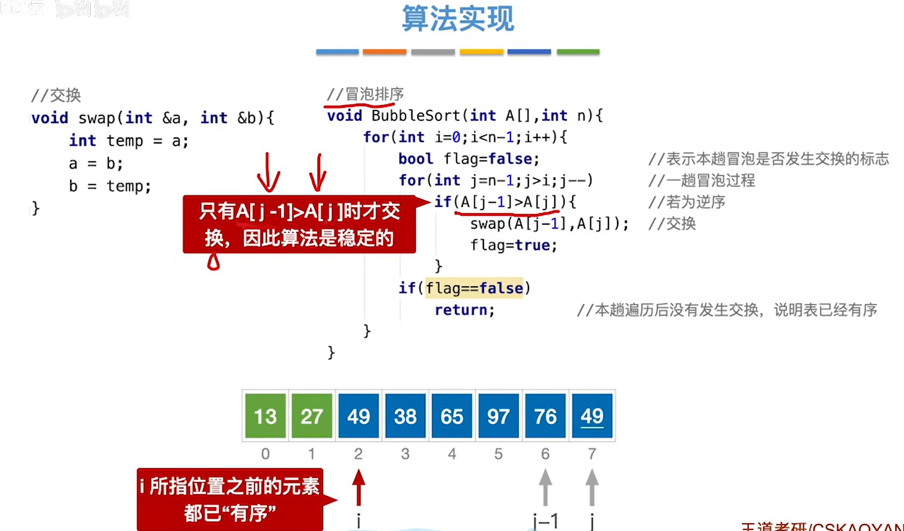
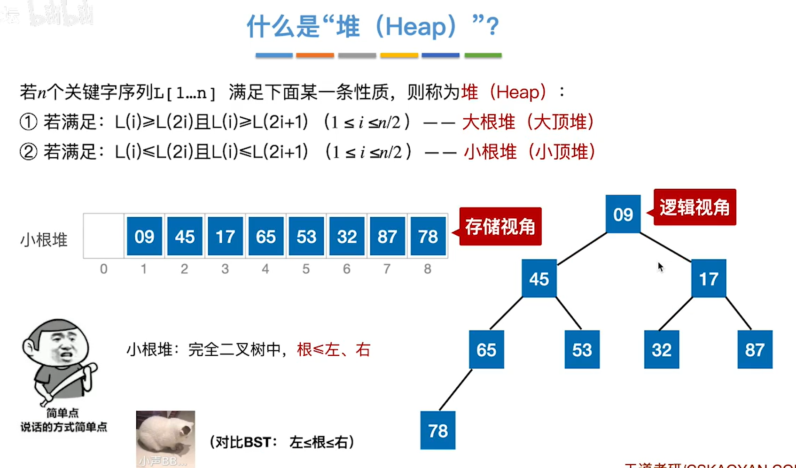

[TOC]

# 五、查找

## 1、基本概念

 

 

### 1.1、性能评价指标

.assets/image-20221115112714581.png)

> 例如：
>
>  

### 1.2、总结

.assets/image-20221115112844811.png)

## 2、顺序表的查找

> 遍历不讲，*但是讲讲如何优化*
>
> 
>
> 单独讲两个点，`哨兵`和`利用查找判定树分析ASL`
>
> **哨兵**：把某个查找元素放到下标为0的位置，从顺序表的末尾往前遍历比较，如果最后比较结果相等时的下标i为0的话，就查找失败
>
> ​	 好处：**不必判断数组下标是否越界**

> **利用查找判定树分析ASL**
>
> 在递增或递减区间有效

 

> 当被查的概率不相等的时候，**可以把被查概率大的放到靠前位置**

 

**总结**

.assets/image-20221115114434136.png)

## 3、折半查找

### 3.1、代码实现

> mid = (low + high)/2
>
> 并且仅用于升序或者降序的序列

  

### 3.2、效率分析

> 

 

### 3.3、查找判定树的构造

> 奇数个元素的出走

 

> 偶数和奇数结合构造查找判定树

 

> 

 

> 树高 利用之前判满二叉树树高的方式得到

 

> 失败结点：n+1个(等于成功结点的空链域数量)
>
> 结合下图，度为0的结点 = 度为2的结点(n) + 1

 

> 折半查找的时间复杂度量级在 = O(log2(n))

  

### 3.4、总结

.assets/image-20221115124139327.png)

## 4、B树

### 4.1、构造思路

 

> 为了降低树的高度，提高效率，做出如下规定
>
>  
>
>  
>
> 于是，**B树便诞生了**

 

 

### 4.2、定义

 

> **核心特性**

  

### 4.3、高度

> **求最小高度**

 

> **求最大高度**
>
> 第一个方法：
>
> `关于n个关键字的B树必有n+1个叶子结点`
>
> 因为n个关键字把负无穷到正无穷分割为了：负无穷-1,1-3,3-5...56-正无穷，这n+1个区间

 

> 另一个办法求最大高度

 

### 4.4、插入

> 讲一下关键的几个点：
>
> (1)在插入key之后，若导致`原结点关键字数超过上限`，则从`中间位置(m/2向上取整)将关键部分分为两个部分`
>
>    左部分在原结点中，右部分放到新的结点中。中间位置的结点插入到原结点的父节点
>
> (2)当`父节点的关键字个数也超出上限`的时候，就`继续进行这种分裂操作`，`直到这个过程传到根节点为止`，使得B树高度增1
>
> (3)注意插入时需注意左子树的值 < 根节点 < 右子树的值
>
> (4)`新插入的元素一定要插入到最底层“终端结点”`
>
> 
>
> **妙处**：结点上限为4，如果插入超过上限会为6，而m/2向上取整是3(m为指针数，5/2)，此时前两个关键字会留在原结点，后两个关键字会前往下一个新的结点，中间的关键字会到父结点的位置去，此时依然满足，`除父结点外，其他结点的关键字至少是+[m/2]-1`

 

 

### 4.5、删除

> **直接前驱**：当前关键字左侧指针所指子树中“最右下”的元素
>
> **直接后继**：当前关键字右侧指针所指子树中“最左下”的元素

  

> (1)**当兄弟够借的时候**
>
> 就需要调节该结点、右或左兄弟结点及其双亲结点
>
> 时刻保持左 < 根 <右

 

> (2)当兄弟不够借的时候，好比下面接了70到25,72那个结点就只剩一个了
>
>    此时需要将关键字与左或右兄弟结点及双亲结点中的关键字进行合并

 

> 合并之后如下图所示

 

#### 总结

 

## 5、散列表

### 5.1、定义

Hash Table 哈希表

`哈希表不是一张表`

 

### 5.2、处理冲突

#### 5.2.1、链地址法

.assets/image-20221115200400559.png)

 

> **查找成功的ASL**

 

> **查找失败的ASL**
>
> 装填因子越大，证明装的越多，那么查找失败的话需要花更多时间，效率更低

 

#### 5.2.2、开放地址法

 

##### ①线性探测法

> 线性探测法：所那么复杂，本质上就是依次往后移，没有位置了再从头开始移动，类似于循环队列，直到找到能插入的位置
>
>  

  

> **查找**
>
> 从H(key)=key%13的起始位往后开始遍历，如果第一个位置没有，`肯定是因为冲突了放到后面`，然后依次往后比较，直到与空位置做了一次比较(最后一位的后一位是空位置)，才发现查找失败
>
> 其实只要是比较到了空位置还没有找到就是不存在，因为删除操作可能存在中间空了几个位置的情况
>
> 但是既然这里为空，为什么不把我要查找的元素放这里呢？说明根本没这个元素，要么一开始就没，要么删除了

 

> **删除**
>
> 就很简单的删除了，但是有一个问题，查找的时候我们遇到空了就直接结束了，但是删除了一个中间元素，导致中间空了出来
>
> 这个时候，无法遍历全部序列，只好在被删除的元素做一个标记，标记它是被删除才为空，使得可以完成全部的遍历

 

> **查找性能分析(ASL)**

> `查找成功の情况`

 

> `查找失败の情况`

 

> **缺点**
>
> 很容易堆积起来，毕竟就是依次往后面塞东西

 

##### ②平方探测法

> 说那么牛，实际上就是如下，-1^2 = -(1)^2
>
>   

 

> 有一个**小坑**：当散列表长度m必须是一个可以表示为4j+3的素数，才能探测到所有位置
>
> 下面的表长m=7的时候就能刚好塞满，m=8的时候就会出现矛盾H3 = H4 = 1
>
> 

##### ③伪随机序列法

> 根据开放地址法的公式，随机给di一个序列，根据这个序列来处理冲突

 

##### ④再散列法

> 说白了就是发现一个哈希函数使用会发生冲突，就再准备几个哈希函数来搞，直到不发生冲突了

 

#### 5.2.3、总结

 

 

### 5.3、常见散列函数

#### 5.3.1、除留余数法

> H(key) = key % p
>
> 散列表表长为m，取一个不大于m但最接近或等于m的`质数p`

 

#### 5.3.2、直接定址法

> 这个址就是连续分布关键字起始的地址

.assets/image-20221115202617869.png)

#### 5.3.3、数字分析法

> 说白了就是`把数码分布较为均匀的若干位作为散列地址，防止其发生冲突`
>
> 比如说，电话号码，大火开头可能都是138xxxx，此时开头的几位数字如果用来作为散列地址的话，发生冲突的可能性就太大了
>
> 而如果选用尾号后四位作为散列地址的话，冲突的可能性就小一点

 

#### 5.3.4、平方取中法

> 尽可能地使得散列地址与关键字的每一位数码位都有关系，越多的因素构成一个结果就越不容易重复，使得散列地址分布比较均匀

 

# 六、排序

## 1、概念

 

 

 

## 2、插入排序

### 2.1、实现

 

 

> 带哨兵的写法
>
>  不必判断j的范围

 

### 2.2、效率分析

 

> **最好情况**
>
>  

> **最好情况**
>
>  

 

### 2.3、折半插入排序

> 我测！折！
>
> 说白了就是把插入排序的依次往前比较，换成了**折半查找到哨兵可以存放的位置**
>
> *值得注意的是*：为了保证算法的稳定性，遇到相等的元素时，哨兵应该放在该元素的后面

 

### 2.4、总结

 

## 3、希尔排序	

 

> 经过某增量选取某一个序列的元素，把他们直接(或折半)插入排序
>
> 再换一个增量...知道增量为1

 

### 3.1、实现

​	 

### 3.2、性能分析

 

> 不稳定的排序是也！
>
> 且只能用于顺序表的捞仔

 

### 3.3、总结

 

## 4、冒泡排序

 

### 4.1、实现

> 这个flag其实还是优化过的
>
> 因为内层循环**一次交换都不发生**的话不发生的话说明前面的序列已经有序了

 

### 4.2、性能分析

 

### 4.3、总结

 

## 5、快速排序

> **不稳定的算法**

 

### 5.1、实现

 

### 5.2、效率分析

 

   

 

### 5.3、总结

 

​	

## 6、简单选择排序

> 不稳定的算法

 

### 6.1、实现

 

### 6.2、性能

 

### 6.3、总结

 

## 7、堆排序

> 堆

 

 

### 7.1、实现

 

### 7.2、效率分析

.assets/image-20221121110522272.png)

.assets/image-20221121110747494.png)

 

### 7.3、堆的插入删除

 

 

### 7.4、总结

 

 

## 8、归并排序

> 就是对两个或者多个有序的序列进行归并
>
> 利用i，j指针和k指针
>
> (1)a[i] < b[j]，c[k] = a[i]
>
> (2)同时i++;k++;
>
> (3)然后依次重复(1)(2)，直到存完最长序列的所有的元素

 

> “2路”归并就是把两个有序的序列合成一个

 

> “4路”归并就是把4个有序的序列合成一个
>
> 需要对比关键字3次
>
> **结论**：m个有序序列进行归并，每选出一个关键字需要对比m-1次

  

> **核心操作**：能够把数组内的两个有序序列归并为一个

 

### 8.1、实现

> 这个递归就很秀，左半归并，右半归并
>
> 就不担心无序序列，毕竟到一个元素，变成有序了，这都拿不下你？？？
>
> `先拆再合`
>
> 递归到只有一个元素(相当于有序状态)，左半只有一个元素相当于有序了，右半只有一个元素相当于有序了
>
> 再合并为有序序列，此时这个有序的序列作为一个排好序的左半部分，再去和另一个右半序列合并...

 

### 8.2、性能分析

> 其他自己想，只讲一个
>
> 每趟归并复杂度为O(n)，因为两个序列互相依次从头对比，每次选出最小的元素，情况最差的是对比了n-1次，只剩一个最大元素
>
> 所以次数 <= n-1
>
> 注意**第一趟归并**，看图不难得出对比次数 <= n/2，也是n的数量级，所以最后复杂度为O(n)

  

### 8.3、总结

 

## 9、基数排序

### 9.1、定义

> **利用了“稳定性”的算法**
>
> *本来十位的权重大于个位了，我们进行了十位排序后为什么还要进行个位排序呢？*
>
> 只是为了处理十位相同的情况，个位大的在最靠右边的队列(如Q8)，从左到右出队，个位大的也是在第一趟排序的靠右
>
>  
>
>  
>
> 
>
> 第二次从左至右入队，发现个位大的先入队，因此，即便十位相同，也会是个位大的先出队
>
>  
>
>  
>
> 
>
> 以此类推...
>
> 

 

 

> 代码考的少，跟快速转置矩阵的算法异曲同工

 

### 9.2、算法效率分析

> 这里的r指的是多少个队列，如Q9是一个队列，Q8是一个队列...

 

### 9.3、应用

> 其实基数排序能处理不同规模的数据，只要队列用的好

 

> 思考

 

### 9.4、总结

 

`

`

`

`

`

