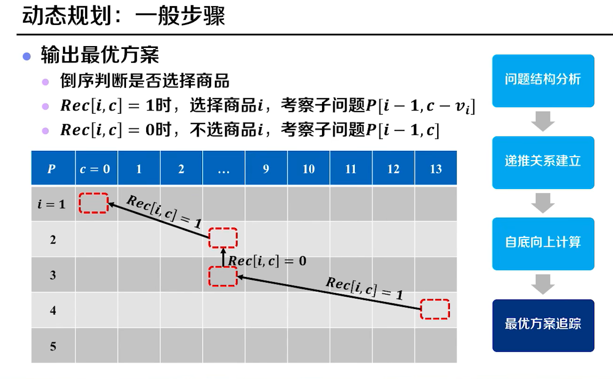

[TOC]

# 一、分而治之法

## 1、归并排序

 

> 复杂度的由来：分层了logn层(忽略一些玩意)，然后每层要处理n个元素。每层个数乘以层数就是复杂度
>
> 

  

 

## 2、递归式求解

### 2.1、递归树法

> nlogn是它的渐进上界
>
>  已知T(n)的最大值就是深度*n，因为分母小于1，g(n)整体大于nlog2n(但还是相当于nlogn级别)，所以g(n)=nlogn是T(n)的上界

 

### 2.2、代入法

 

 

 

### 2.3、主定理法

> T(n)的时间成本，分为 分到最底层的1的成本 和 合并到上一层逐渐累计的成本(其实就是上一层的个数)
>
> 递归出口设置在T(n)中的n为1就结束了，完美符合公式

 

> 太南了~

 

 

  

**主定理的扩展形式	**

 

> **利用简化形式主定理法的例题**
>
>  
>
>  
>
>  
>
>  
>
> 
>
> **通常情况下的例题**
>
>  
>
> 
>
> 主定理也是有缺点的啊魂淡！
>
>  

 

## 3、最大子数组问题

 

 	

### 3.1、蛮力枚举法

> 蛮力枚举法

 

 

> **优化一**
>
> 将算法中重复求和的部分为下一次求和所用

 

### 3.2、分而治之

  

> **示例如何求取跨越中间的最大值S3**

 

 

> **时间复杂度**

 

**----------全过程的图解**

**分**

 

**治和合**

 

**--------伪代码**

确实还是有点喵难喵难的

 

 

## 4、逆序对计数问题

 

 

### 4.1、蛮力枚举法

 

 

### 4.2、分治法

 

> 第一个办法，**直接求解**，复杂度跟蛮力一样都是平方

 

> **排序求解**，先排序，再利用二分，不就知道多少元素比它大了？具体来说，排序前后两个数组，找寻后面数组的元素在前面元素的位置，就知道逆序了多少对了

 

 

> 降低！降低！降低！
>
> 革命尚未成功！
>
> ​	我们发现，在合并的时候貌似有优化空间。。在后面的有序数组，跟前面的有序数组合并时，不是要比较i、j吗，那么j如果小于i，表明它们就是逆序
>
> ​	此时把那么i包括它后面的元素都跟此时的j组成了逆序对

 

 

> **归并求解**，将归并排序在合并利用起来，即删去了二分查找，在合并的时候求出逆序对数目

 

> 图解

  

> 代码

 

 

## 5、快速排序

### 5.1、数组划分

 

 

> **分解的详细过程**

 

> **合并的过程**

 

  

> 代码

 

  

### 5.2、复杂度分析

> 最好情况，每次主元都在中间

 

> 最坏情况

 

### 5.3、随机化快速排序

> 为了避免主元在固定位置，而最终遇到了最差的情况，不得不采取随机选取主元的办法（防止数组逆序，partition在数组开头，最后时间复杂度为O(n^2)的情况）

 

 

 

> 代码

 

## 6、次序选择问题

 

 

### 6.1、数组排序

> 数组排好序虽然不错，但是嗷，你过程其实相当于多求了其他的元素的位序，这样其实做了不少无用功

 

 	

### 6.2、固定位置划分

> 可以利用`快排，求解主元的位序`来找寻第k小的元素
>
> 此处需要考虑k的三种情况
>
> (1)假设k刚好就是pivot的位置，那么它就是第k小元素了
>
> (2)假设k比主元的位置小，那么第k个元素就是在A[`p,q-1`]里面`第k小的元素`了
>
> (3)假设k比pivot的位置大，那么第k个元素就是在A[`q+1,r`]里面`第k-(q-p+1)小`的元素，因为数组划分之后，k的大小也应做出改变，所以减去包括主元前面的元素个数(q-p+1)

 

> 算法实例

 

> **伪代码**

 

 

> **复杂度**

 

# 总结

 

 

# 二、动态规划

## 1、背包问题

 

### 1.1、蛮力枚举

 

 

 

> 代码

 

> **复杂度**

 

### 1.2、带备忘递归

 

### 1.3、递推

自底向上，边构造p[i,c]边求得最优解

 

 

 

 

 

> 代码

 

 

 

## 2、动态规划四部曲

 

 

 

 

 

 

 

## 3、最大子数组问题

 

 

 

  

> **示例**

 

> 代码

  

 

# 三、贪心策略

## 1、部分背包问题

 

## 2、哈夫曼编码

 

 

 

 

  

 

# I Love You

`

`

`

`

`

`

`