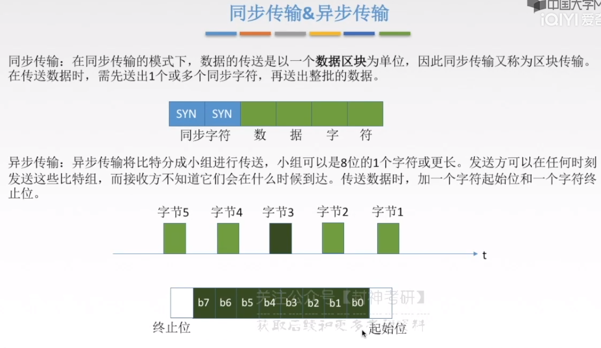
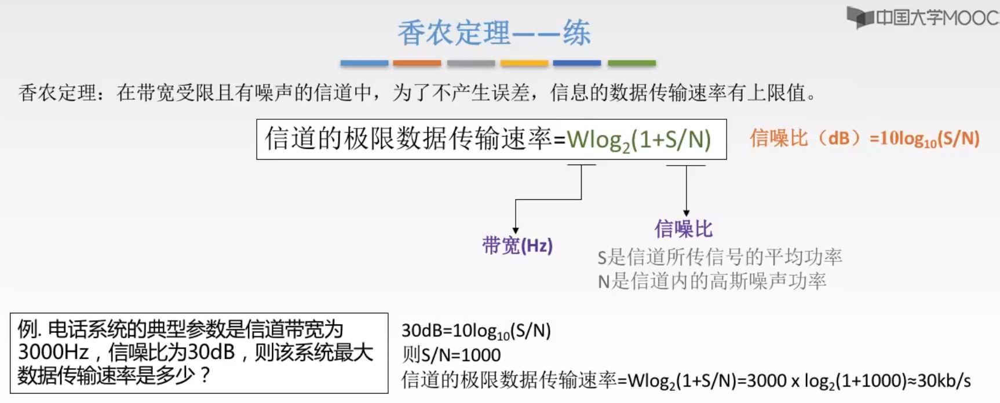
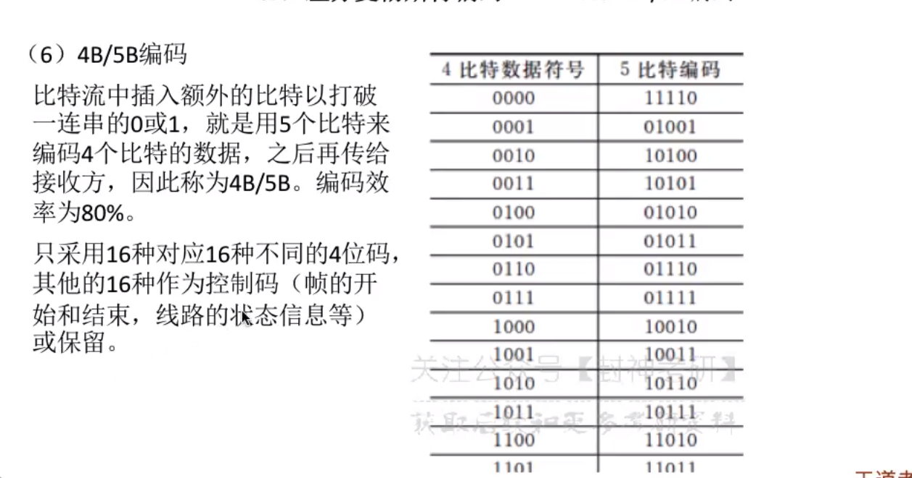

[TOC]

 

# 一、物理层接口特性

 

# 二、数据通信基础知识

## 1、数据通信模型

## 2、数据通信相关术语

> - 信道是什么？
>   - 理解为一个箭头(具有方向性)就完事了

## 3、三种通信方式

 

## 4、传输模式

### 4.1、串并传输

### 4.2、同步异步传输

> - 先解释一个易误会的点：同步传输和异步传输`都是为了解决接收方和发送方交流同步的问题`，就好像打电话两方都能同时交流
>
> - 同步字符和起始位的作用？
>
>   - 同步字符：先发送给接受方，告诉接收方我要以同步的形式发送数据了
>
>   - 起始位：告诉接受方，我要以异步的形式发送数据了
>
> - 同步和异步的在传送模式上的区别？
>
>   - 同步传输利用同步字符实现同步，异步传输利用起始位
>   - 同步传输一次发送一整批的数据，异步传输一段一段的发送（表现在时间上断断续续的发送）
>
> - 异步传输常见例子？
>
>   - 键盘输入就是

## 总结

## 5、码元

> - 什么是码元？
>   - 高电平或者低电平那一横线
> - 码元宽度是什么？
>   - 可不要被宽度骗了，这个宽度指的是时间
> - 什么是16进制码元？
>   - 码元的离散状态有16个-》16中高低不同的信号波形-》0000...1111刚好满足16种状态
>   - 所以一个码元携带4个bit的信息

 

## 6、数据传输速率的两种表示方法

低电平-》低电平也是有变化的

> - 码元传输速率是什么？
>   - 单位时间传输的码元的个数
>   -   解释：1s内有多少码元宽度 = 1s内的码元数，所以此速率只与码元的宽度T有关
> - 码元传输速率和数据传输速率的区别？
>   - 数据传输速率是指单位时间传输的bit数目
>   - 具体区别可以结合下面的图示看
>     -  

## 7、带宽

 

​	

# 三、奈氏准则和香农定理

## 1、失真

 

### 1.1、码间串扰/奈氏准则

> - 什么是码间串扰
>   - 就是信号传输的频率太高了，接受端无法清晰分辨此时接受到`信号的波形是0 or 1`

> - 奈氏准则和香农定理有什么区别？
>   - 奈氏是限制了码元传输速率，香农定理是限制了信息传输速率
>
> - 什么是极限数据传输率？
>
>   - 其实很好理解，2W是码元极限传输速率，一个码元带几个bit是由它有几种状态决定的
>
>   - 所以会有
>     $$
>     极限数据传输率=2W\log_2V（b/s）
>     $$
>     
>
>   - 

 

> 例题
>
> 

## 2、香农定理

> - 什么是信噪比？
>   - 信号的平均功率/噪声的平均功率
> - 信噪比和S/N的关系是什么？
>   - 两者都是表示信噪比，前者是dB单位(换种视角)，而后者是更加直观的S/N的比值表示
> - 为什么要用dB表示信噪比？
>   - 因为S/N太大的话，可能不好表示(假设商为100个0不得写死我)，但是取其对数后，他们的值就会变小，更便于表示

> - 为什么只要不达到极限速率，一定能找到某种方法来实现`无差错的传输`？
>   - 根据公式可得，没到极限的话，要不提高带宽，要不提高信噪比咯
>   - 注意“无差错”这三字代表的就是，香农定理是在不会产生误差的情况下的极限速率

> 例题
>
> 

## 3、两者的区别

> - 面对问题时，我该选择哪个理论？
>
>   - 俺也晓不得，看下面的例题，它好像把两个理论都用了一遍，然后找较小的那个传输素率为最大数据速率
>
>   - 我觉得应该是奈氏准则是为了`避免码间串扰`而生，香农定理是为了`避免误差`才生的
>
>     所以，为了把两者结合，我取他们的交集
>
> - 它们存在的意义是啥子哦？
>
>   - 奈氏准则，解决“内忧”
>   - 香农定理，解决“外患”

# 四、编码和调制

## 1、基带信号和宽带信号

> - 什么是基带信号？
>   - 其实就是来自于信源，没有被加工过的信号
> - 怎么区别基带传输和宽带传输？
>   - 基带信号放到`数字信道`去传输——`基带传输`
>   - 宽带信号(被调制过的基带信号)放到`模拟信道`——`宽带传输`
> - 基带传输和宽带传输的作用？
>   - 基带传输适合于近距离的传输
>   - 宽带传输适合于远距离的传输，因为它调制过的基带信号，波长小，在远距离的衰减程度小

## 2、编码与调制

> - 数据也有模拟数据和数字数据之分。
>
>   - 模拟数据是随时间连续变化的函数,在一定的范围内连续的无数个值。模拟数据的物理信号容易实现,但不精确且容易受干扰。
>
>   - 数字数据是随时间离散变化的函数,在一定的范围内取值是有限的。计算机中使用的就是数字数据。数字数据具有精确以及受扰动后可以恢复的特性。

 

## 3、数字数据

### 3.1、编码为数字信号

> | 编码               | 具体实现                                                     | 优缺点                                                       |
> | ------------------ | ------------------------------------------------------------ | ------------------------------------------------------------ |
> | 非归零编码         | 说白了就是高电平为1，低电平为0                               | 优：易于实现 缺点：①没有检错功能 ②而且无法判断一个码元的开始和结束，因为你输入一连串连续的1的时候，接收方无法判断接受到几个1 |
> | 归零编码           | 信号电平在一个码元之内都要恢复到低电平                       | 希腊奶                                                       |
> | 反向不归零编码     | 电平如果翻转就为0，如果不翻转就为1； 判断当前0/1方法：当前状态是上一个状态的翻转就为0，不变就是1 | 麻烦麻烦                                                     |
> | `曼切斯特编码`     |  | ①这个编码妙处就在于它把跳变也当做一个信号而利用起来； 具体怎么实现呢，当我接收方接受到一个跳变的时候，我就知道了哦，来了一个bit的数据， 此时我再判断这个跳变两侧是先高后低还是先低后高，就知道这个bit是1/0了 ②频带宽度是原始基带宽度的两倍：因为每个bit都分成了一半， 这个周期就减少了一半，频率就上升了一半，所以频宽当然也变为了两倍啊 ③信息传输率是调制速率的1/2：因为码元可以由信号变化量表示， 而一个bit有两个跳变(从上一个状态进入此状态时和跳变时)，所以一个bit有两个码元，速率自然是一半 |
> | `差分曼切斯特编码` |  | ①判断规则换了，方式没变；②抗干扰性会更强                     |
> | 4B/5B编码          |  | 放大看喵~                                                    |

 

 

### 3.2、调制为模拟信号

 

## 4、模拟数据

### 4.1、编码为数字信号

> 抽象理解公式
>
> - 大于等于两倍大才能在一个周期中，把前一个周期和后一个周期都读取啊
> - 大于最高频率，其实就是能把最小的模拟数据周期也能进行前半后半周期采样采样
>
> $$
> f_采 >= 2f_高
> $$
>
> 

 

### 4.2、调制为模拟信号

 

## 总结

# 五、数据交换

   

## 1、数据交换方式

### 1.1、电路交换

 

> 优缺点

 

### 1.2、报文交换

> - 什么是路由信息？
>   - 每个交换设备都存有一张存放路由信息的表，当它接受到报文的时候就可以根据路由信息找到距离最短的结点
> - 在两个用户通信的其他线路端，可以传输其他用户的报文
> - 什么是存储转发？
>   - 当线路繁忙的时候，交换设备暂存报文，等线路空闲再转发到下一个节点

> 优缺点

### 1.3、分组交换

> 优缺点

#### 1.3.1、数据报方式

 

 

#### 1.3.2、虚电路方式

> - “呼叫请求”和“呼叫应答”都以分组的形式发送了，并且它们包含了源地址和目的地址的信息
> - 什么是虚电路号？
>   - 就是当前分组所在的虚电路是哪一条，当主机B连接到多条虚电路的时候，方便区分

 

 

#### 1.3.3、两者对比

 

## 2、选择数据交换方式

好图，谁发明的啊

# 六、物理层传输介质

听个乐呵✍

## 1、传输介质和分类

 

> 双绞线、同轴电缆、光纤（前面两者是电脉冲，电在走，光脉冲，光在走）

  

## 2.非导向性传输介质

## 总结

# 七、物理层设备

## 1、中继器

## 2、集线器(多口中继器)

> - 什么叫做不能分割冲突域？
>   - 就是A和B都往C发送信息，但是集线器一个时钟周期只能发一个信息，所以它们传输的bit就会冲突
>   - 此时就不得不暂停，等待另一个时钟周期，还冲突就继续
> - 怎么让主机同时通信呢？
>   - 平分带宽咯，集线器有10bit/s的带宽，5台主机每个用2bit/s，就不会冲突了，寝室晾衣服分区域的那种
>   - 平均带宽小，传输数据少，效率低，达咩

 

# 八、信道复用技术

 

## 1、基本原理

 

## 2、频分复用FDM

 

## 3、时分复用TDM

 

## 4、波分复用WDM

 

## 5、码分复用CDM

 

 

 

 

> **应用示例**
>
> 挺吊的
>
> 用自己的`码片向量`和收到的`叠加后的码片向量`做`规格化内积运算`
>
> 会把不是自己的变为0，是自己的根据与或结果得到比特
>
> 
>
> 
>
> **示例2**
>
> 
>
>  
>
>  
>
>  
>
>  
>
> **例题3**
>
>  

## trail

`

`

`

`

`

`

