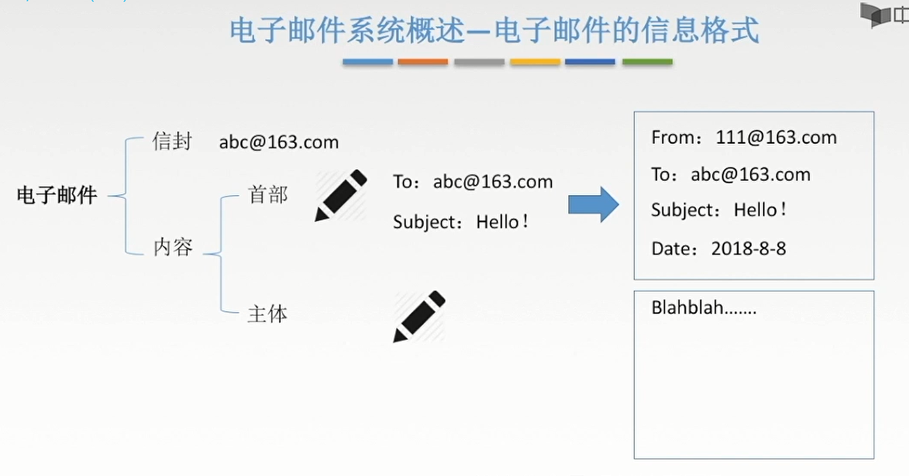
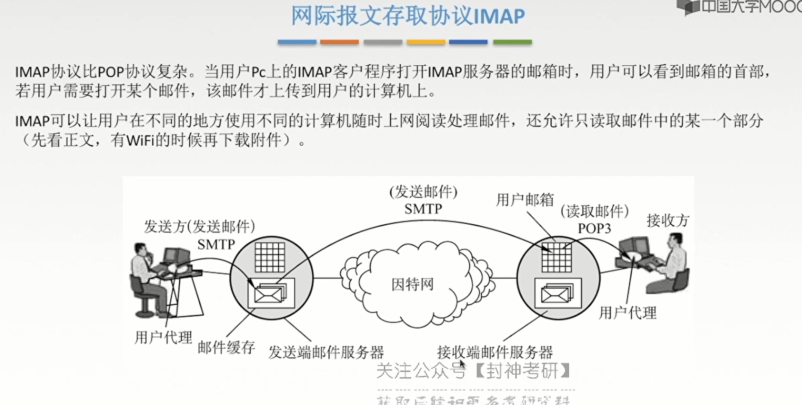

[TOC]

# 一、概述

 

## 1、总览

 

## 2、C/S模型和P2P模型

 

 

## 3、DNS-域名系统

> - DNS：网址-IP地址

 

 

 

### 3.1、域名服务器

 

### 3.2、域名解析过程

 

## 4、FTP-TFTP

> - Trivial File Transfer Protocol

 

 

### 4.1、原理

 

 

 

## 5、电子邮件

 

 

 

### 5.1、SMTP

> - 简单邮件传输协议 （Simple Message Transfer Protocol）

 

> - 连接建立-邮件发送-连接释放

 

> - 弱点
> - MIME把data-ASCII

 

### 5.2、POP3

 

### 5.3、IMAP

 

 

## 6、万维网

 

## 7、HTTP协议

 

> - 结合流水线将无敌

 

> - 报文结构

 

 

`

`

`

`

