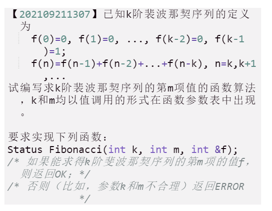

**前言**：我知道你很难过，写的那么多代码居然误删了。

但是你也必须清楚，你之前写的那些算法只是很基础的，帮助你熟络语言的，而你之后接触的代码才是真正体现出思考和智慧的。

所以，不要可惜，不要难过，前面是一片新天地！

（PS:不过你把那个五个读取文件到链表/数组的算法删了，我想给你邦邦两拳_(:з」∠)_，那可是我熬夜搞的啊(=_=)）

------

[TOC]


## 1、continue用处

当用户输入不对的格式的时候就可以利用continue刷新循环，就不需要利用goto了


## 2、k阶斐波拉契序列

 

```c
#include "allinclude.h" // 学校自带的
int qiuHe(int m, int);
Status Fibonacci(int k, int m, int &f){ 
    // 处理一下边界值
    // 结合题目看一下咯
    if(k == m || 1 == k - m)f = 1;
    else if(k > m)f = 0;
    if(m < 0)return ERROR;
    if(k <= 1)return ERROR;
    
    //下面才是重头戏
    if(k < m){
        f = qiuHe(m, k);
    }
    return OK;
}

/*
	这个k阶的含义，你举几个2阶、3阶的就看的出来，是指，第n个数是它的前k个数之和
	
*/
int qiuHe(int m, int k){
  	int flag = 0;
  	int sum = 0; // 总的和的值
    
    // 遍历k遍，其实也就是求n = n-1 +... + n-k的和
    // 而n-1 = n-2 + ... + n-1-k
    // 以此类推...
    // 最后，到达了最小值的时候就可以收网了
    // 因为其实这条序列的值是固定的，但是却是模糊的，我们的办法就是回到起始位置，把已知的值利用起来
    // 推理到我们需要知道的那个位置
  	for(int i = 1; i <= k; i++){
	// 这个好像是到了k-1之前，那些值都为0，这地方应该可以优化一下，算了，(‘-ωก̀ )好困，下次吧
      if(k - 1 > m){
  	    return 0;
  	  }
    // 这地方就是收网的起始位置
  	  if(k == m || k - 1 == m){
  	    return 1;
  	  }
  	  sum += qiuHe(m - i, k);
  	}
    
  	return sum;
  	//如果m到了k+1的话,就赋值其为2
  	
    
	// 理解这个代码的逻辑，可以先利用2阶斐波拉契来理解
    // 下面的代码就是底层的逻辑
    // 如果m到了1或2，那么就返回1，令其往回走
    // 如果不是，那么第n个数，就是第n-1和第n-2的和
    // 而n-1又是n-2和n-3的和，n-2又是n-3和n-4的和，依次类推，直到到达了最小值的情况，再收网
  	if(m == 1 || 2 == m)return 1;
  	return qiuHe(m - 1, k) + qiuHe(m - 2, k);
  	//如果m到了k+1的话,就赋值其为2
}
```

