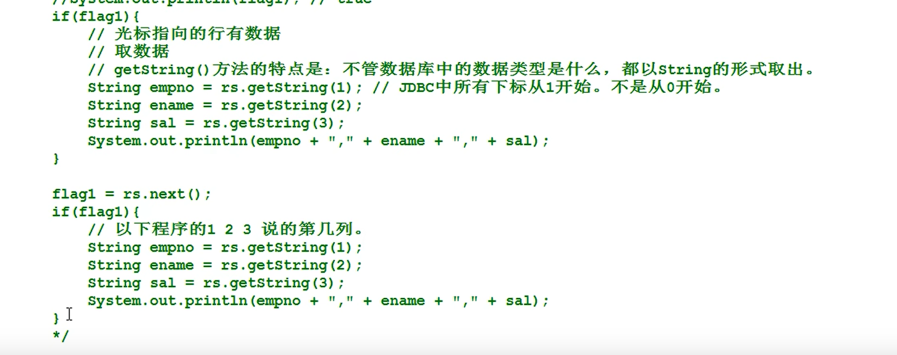

[TOC]


## 1.	基本概述


贼多个class文件放在一个目录下就叫jar包，JDBC接口的实现类叫驱动


## 2、JDBC编程六步


下面就是修改，上面是存入，其实差不多


下面是删除


**注册驱动的常用方式**


## 3、理解数据库的信息到配置文件中

 

## 4、查询结果集

这个是以获取的那一行数据库数据行的第几列获取的




这个是以数据库数据行的每列的名词获取的


*注意*：你给每个类名重命名后就需要使用重命名的名字
举个例子：sql = "select abc as a";
那么就需要rs.getString("a");


## 5、用户登录

```java
package com.JDBC.test;

import java.sql.*;
import java.util.HashMap;
import java.util.Map;
import java.util.Scanner;

public class JdbcTest {
    public static void main(String[] args) {
        //界面的初始化initial
        Map<String, String> userLoginInfo = initUI();//返回一个Map集合来比较数据库和输入的匹配

        //验证账号密码的正确性
        boolean loginResult = loginVerify(userLoginInfo);//验证登录成功了没
        System.out.println(loginResult? "登录成功！" : "登录失败！");


    }

    private static boolean loginVerify(Map<String, String> userLoginInfo) {
        //JDBC相关的代码
        boolean loginResult = false;//做一个mark
        String loginUsername = userLoginInfo.get("loginUsername");
        String loginPassword = userLoginInfo.get("loginPassword");
        Connection conn = null;
        Statement stmt = null;
        ResultSet rs = null;

        try {
            //1、2步靠
            conn = DBUtil.getConnection();
            //3、获取数据库操作对象
           stmt = conn.createStatement();
            //4、执行sql语句

            String sql = "select * from t_user where loginUsername = '" + loginUsername + "' and loginPassword = '" + loginPassword + "'";//编写sql语句
               //  "select * from t_user where loginUsername = 'a' and loginPassword =  'a' or 'ab'='ab'"
            rs = stmt.executeQuery(sql);//类似于迭代器的玩意
            //5、有DQL语句处理结果集
            if(rs.next()){//只需要一个if就行了，因为上面的sql执行出来最多一个记录，迭代器走一步发现什么都没有为false，发现有数据必然有这个账号
                loginResult = true;
            }

        } catch (ClassNotFoundException e) {
            e.printStackTrace();

        } catch (SQLException throwables) {
            throwables.printStackTrace();
        }finally{
            DBUtil.close(conn, ps, rs);//封装了的操作
        }

        return loginResult;//返回结果
    }


    /**
     * 初始化界面
     * @return 用户输入的用户名和密码
     */
    private static Map<String, String> initUI() {
        Scanner s = new Scanner(System.in);

        System.out.println("请输入用户名：");
        String loginUsername = s.nextLine();

        System.out.println("请输入密码：");‘
        String loginPassword = s.nextLine();

        //把数据存储到Map集合中
        Map<String, String> userLoginInfo = new HashMap<String, String>();
        userLoginInfo.put("loginUsername", loginUsername);
        userLoginInfo.put("loginPassword", loginPassword);

        return userLoginInfo;//返回一个集合用以对数据库的进行比较
    }


}//a' or 'ab'='ab
```


## 6、sql语句的注入现象


如何解决呢？


```java
package com.JDBC.test;

import java.sql.*;
import java.util.HashMap;
import java.util.Map;
import java.util.Scanner;

public class JdbcTest {
    public static void main(String[] args) {
        //界面的初始化initial
        Map<String, String> userLoginInfo = initUI();//返回一个Map集合来比较数据库和输入的匹配

        //验证账号密码的正确性
        boolean loginResult = loginVerify(userLoginInfo);//验证登录成功了没
        System.out.println(loginResult? "登录成功！" : "登录失败！");


    }

    private static boolean loginVerify(Map<String, String> userLoginInfo) {
        //JDBC相关的代码
        boolean loginResult = false;//做一个mark
        String loginUsername = userLoginInfo.get("loginUsername");
        String loginPassword = userLoginInfo.get("loginPassword");
        Connection conn = null;
        PreparedStatement ps = null;//搞一个预编译的数据库操作对象
        ResultSet rs = null;

        try {
            //1、2步靠工具类完成了
            conn = DBUtil.getConnection();

            //3、获取预编译的数据库操作对象
            //sql语句的框框，其中的?，表示一个占位符，一个坑用来接收一个“值”，注意，?不能使用''括起来
            String sql = "select * from t_user where loginUsername = ? and loginPassword = ?";//编写sql语句
           
            //程序执行到此处，会发送sql语句框架给DBMS，然后DBMS进行sql语句的编译
            ps = conn.prepareStatement(sql);

            //给占位符?传值，第一个?的下标是1，第二个?的下标是2，JDBC中所有下标从1开始
            ps.setString(1, loginUsername);//不用担心你的输入会影响最终sql语句的编译，因为上面的sql语句已经编译了
            ps.setString(2, loginPassword);

            //4、执行sql语句
            rs = ps.executeQuery();//类似于迭代器的玩意，这里不能写sql了，因为上面已经传过去了

            //5、有DQL语句处理结果集
            if(rs.next()){//只需要一个if就行了，因为上面的sql执行出来最多一个记录，迭代器走一步发现什么都没有为false，发现有数据必然有这个账号
                loginResult = true;
            }

        } catch (Exception e) {
            e.printStackTrace();
        }finally{
            DBUtil.close(conn, ps, rs);//工具类
        }

        return loginResult;//返回结果
    }


    /**
     * 初始化界面
     * @return 用户输入的用户名和密码
     */
    private static Map<String, String> initUI() {
        Scanner s = new Scanner(System.in);

        System.out.println("请输入用户名：");
        String loginUsername = s.nextLine();

        System.out.println("请输入密码：");
        String loginPassword = s.nextLine();

        //把数据存储到Map集合中
        Map<String, String> userLoginInfo = new HashMap<String, String>();
        userLoginInfo.put("loginUsername", loginUsername);
        userLoginInfo.put("loginPassword", loginPassword);

        return userLoginInfo;//返回一个集合用以对数据库的进行比较
    }


}
```


## 7、利用了注入现象的排序

```java
package com.JDBC.test;

import java.sql.*;
import java.util.HashMap;
import java.util.Map;
import java.util.Scanner;

public class JdbcTest {
    public static void main(String[] args) {
        sortInfo();//排序操作

    }

    private static void sortInfo() {
        //JDBC相关的代码
        //输入desc就是降序，输入asc就是升序
        Scanner s = new Scanner(System.in);
        System.out.println("请输入desc或asc，输入desc为降序，输入asc为升序");
        System.out.println("请输入：");
        String keyWords = s.nextLine();


        Connection conn = null;
        Statement stmt = null;
        ResultSet rs = null;

        try {
            //1、注册驱动
            Class.forName("com.mysql.jdbc.Driver");//连接jar包
            // 2、获取连接
            conn = DriverManager.getConnection("jdbc:mysql://localhost:3306/userInfo", "root", "123456");
            //3、获取数据库操作对象
            stmt = conn.createStatement();
            //4、执行sql语句

            String sql = "select ename from emp order by ename " + keyWords;//我透，这里的ename后面记得接个空格，因为sql语句需要空格啊
            rs = stmt.executeQuery(sql);//类似于迭代器的玩意
            //5、有DQL语句处理结果集
            while(rs.next()){//遍历结果集
                System.out.println(rs.getString("ename"));
            }
        } catch (Exception e) {
            e.printStackTrace();
        }finally{
            //6、释放资源，放到finally语句，必须执行
            /*都得单独关闭，并且由小到大关闭，就是跟上面打开的顺序反着关*/
            if(rs != null){//不为null才关闭
                try {
                    rs.close();
                } catch (SQLException throwables) {
                    throwables.printStackTrace();
                }
            }
            if(stmt != null){
                try {
                    stmt.close();
                } catch (SQLException throwables) {
                    throwables.printStackTrace();
                }
            }
            if(conn != null){
                try {
                    conn.close();
                } catch (SQLException throwables) {
                    throwables.printStackTrace();
                }
            }
        }

    }
}
```

## 8、防止了注入现象的增删改	

```java
package com.JDBC.test;

import java.sql.*;
import java.util.HashMap;
import java.util.Map;
import java.util.Scanner;

public class JdbcTest {
    public static void main(String[] args) {
        changeInfo();//改变操作

    }

    private static void changeInfo() {
        //JDBC相关的代码

        Connection conn = null;
        PreparedStatement ps = null;
        ResultSet rs = null;

        try {
            //1、注册驱动
            Class.forName("com.mysql.jdbc.Driver");//连接jar包

            // 2、获取连接
            conn = DriverManager.getConnection("jdbc:mysql://localhost:3306/userinfo", "root", "123456");

            //将自动提交机制改为手动提交
            conn.setAutoCommit(false);//开启事物

            //3、获取数据库操作对象

            //增加
/*            String sql = "insert into dept(deptno, dname, loc) values(?, ?, ?)";
            ps = conn.prepareStatement(sql);
            //下面是修改的内容
            ps.setInt(1, 90);//注意这里的号码数是不能与原有数据库的重复的
            ps.setString(2, "好");
            ps.setString(3, "一");*/

            //修改
/*            String sql = "update dept set dname = ?, loc = ? where deptno = ?";
            ps = conn.prepareStatement(sql);
            ps.setString(1, "测试");
            ps.setString(2, "测试");
            ps.setInt(3, 60);*/

            //删除
/*            String sql = "delete from dept where deptno = ?";
            ps = conn.prepareStatement(sql);
            ps.setInt(1, 90);*/


            //count用于判断操作影响了几行，相当于判断操作成功没有
            int count = ps.executeUpdate();
            System.out.println(count);

            //程序执行到此处说明没有发生异常，那么事务结束，手动提交数据
            conn.commit();//提交事务

        } catch (Exception e) {
            //回滚事物，相当于出现异常把改变了的数据搞回来，雀氏牛批
            if(conn != null){
                try {
                    conn.rollback();
                } catch (SQLException throwables) {
                    throwables.printStackTrace();
                }
            }
            e.printStackTrace();
        } finally{
            //6、释放资源，放到finally语句，必须执行
            /*都得单独关闭，并且由小到大关闭，就是跟上面打开的顺序反着关*/
            if(rs != null){//不为null才关闭
                try {
                    rs.close();
                } catch (SQLException throwables) {
                    throwables.printStackTrace();
                }
            }
            if(ps != null){
                try {
                    ps.close();
                } catch (SQLException throwables) {
                    throwables.printStackTrace();
                }
            }
            if(conn != null){
                try {
                    conn.close();
                } catch (SQLException throwables) {
                    throwables.printStackTrace();
                }
            }
        }

    }
}
```


## 9、手动提交事务


## 10、模糊查询

```java
package com.JDBC.test;

import com.git.tset.DBUtil;

import java.sql.*;

public class JdbcTest {
    public static void main(String[] args) {
        Connection conn = null;
        PreparedStatement ps = null;
        ResultSet rs = null;

        try {
            //获取连接
            conn = DBUtil.getConnection();

            //获取预编译的数据库操作对象
            String sql = "select ename from emp where ename like ?";
            ps = conn.prepareStatement(sql);
            ps.setString(1, "%A%");
            rs = ps.executeQuery();
            while(rs.next()){
                System.out.println(rs.getString("ename"));
            }
        } catch (Exception e) {
            e.printStackTrace();
        }finally{
            DBUtil.close(conn, ps, rs);
        }


    }
}
```

## 11、工具类的封装

```java
package com.git.tset;

import java.sql.*;

public class DBUtil {

    /**
     * 工具类的方法都是私有的
     * 因为工具类当中的方法都是静态的，不需要new对象，直接采用类名即可调用
     *
     */
    private DBUtil(){

    }

    //静态代码块，实现了只注册一个驱动
    static {
        try {
            Class.forName("com.mysql.jdbc.Driver");
        } catch (ClassNotFoundException e) {
            e.printStackTrace();
        }
    }

    public static Connection getConnection() throws SQLException {
        return DriverManager.getConnection("jdbc:mysql://localhost:3306/userinfo", "root", "123456");
    }


    /**
     * 关闭资源
     * @param conn 连接对象
     * @param ps 数据库操作对象
     * @param rs 结果集
     */
    public static void close(Connection conn, Statement ps, ResultSet rs){//这里的参数是Statement，不用担心，因为PS那个也是这玩意的子类，会向上转型的
        if(rs != null){
            try {
                rs.close();
            } catch (SQLException throwables) {
                throwables.printStackTrace();
            }
        }
        if(ps != null){
            try {
                ps.close();
            } catch (SQLException throwables) {
                throwables.printStackTrace();
            }
        }
        if(conn != null){
            try {
                conn.close();
            } catch (SQLException throwables) {
                throwables.printStackTrace();
            }
        }

    }

}
```

## 12、悲观锁乐观锁

这个就是把一个数据锁住了，知道它执行完毕，才到下一个数据执行


## 13、where查询中文字段的方法

```sql
String myTribe = "\"" + user.getTribe() + "\"";/*这句话无敌好吧*/
/*只有通过上面的操作才能实现where = '中文'*/
String sql = "select * from user where tribe = " + myTribe + " order by id " + keyWords;//我透，这里的like后面记得接个空格，因为sql语句需要空格啊
```


## 14.数据库连接池


