[TOC]


# 1、基础概述

## 1.1、简介

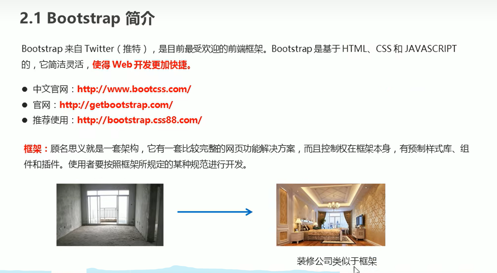

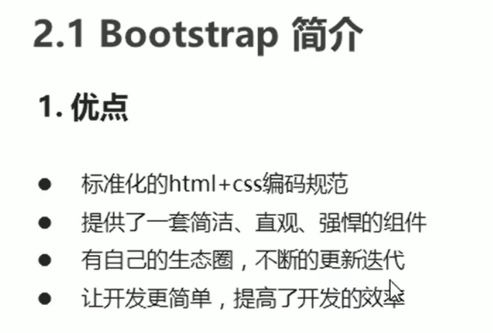 框架嘿嘿❥我的框架❥嘿嘿...


## 1.2、bootstrap的使用


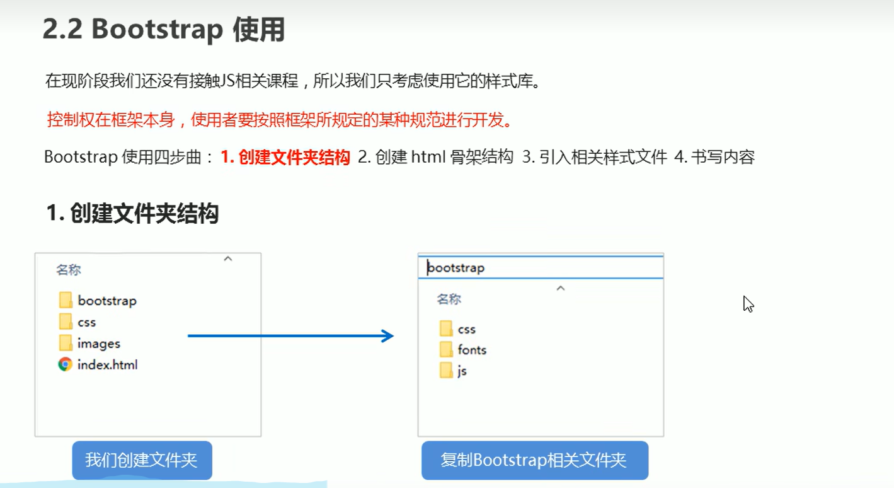

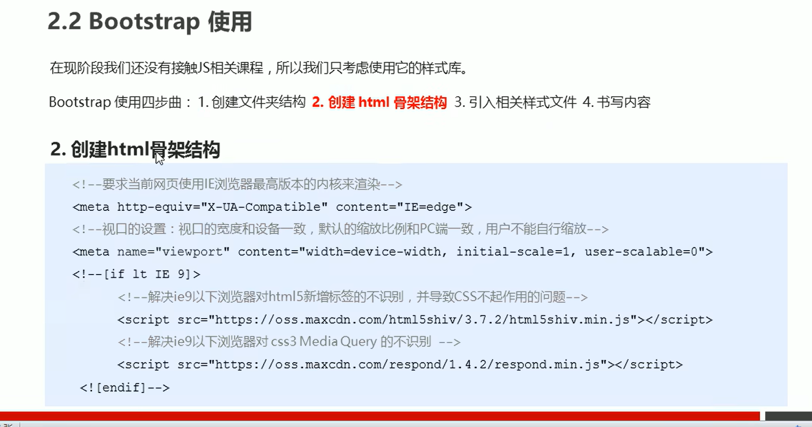

> **代码**
>
> ```html
>     <meta charset="UTF-8">
>     <meta http-equiv="X-UA-Compatible" content="IE=edge">
>     <meta name="viewport" content="width=device-width, initial-scale=1.0">
>     <title>Document</title>
>     <link rel="stylesheet" href="css/bootstrap.min.css">
>     <meta charset="UTF-8">
>     <!-- 要求当前网页使用IE浏览器最高版本的内核来渲染 -->
>     <meta http-equiv="X-UA-Compatible" content="IE=egde">
>     <!-- 视口的设置:视口的宽度和设备一致，默认的缩放比例和PC端一致，用户不能自行缩放 -->
>     <!-- [if lt IE 9] -->
>         <meta name="viewport" content="width=device-width, initial-scale=1.0, user-scalable=0">
>         <!-- 解决了IE9以下浏览器对HTML5新增标签不识别，并导致CSS不起作用的问题 -->
>         <script src="https://oss.maxcdn.com/html5shiv/3.7.2/html5shiv.min.js"></script>
>         <script src="https://oss.maxcdn.com/respond/1.4.2/respond.min.js"></script>
>     <!-- [endif] -->
> ```


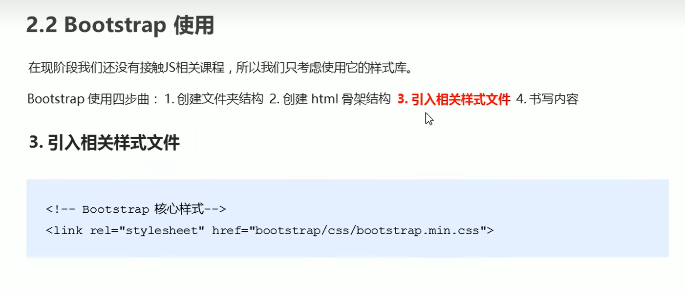

有时候我们想在基础上修改样式

你可以多起一个类名或者id啥的

然后调用选择器对其进行修改

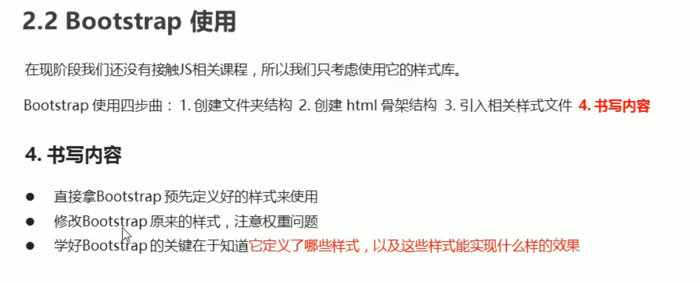


## 1.3、布局容器

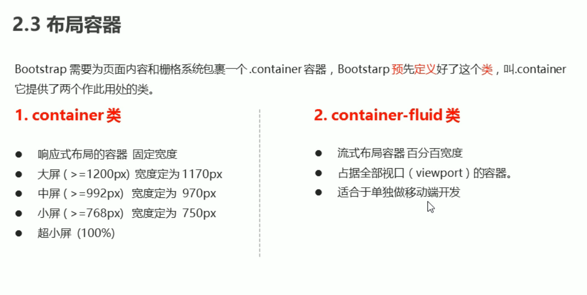

## 1.4、栅格系统

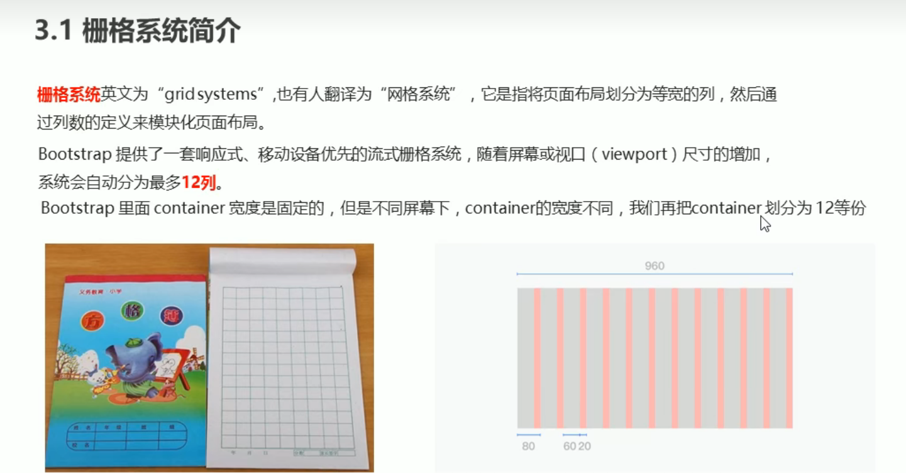


### 1.4.1、栅格系统的使用

注意这些列，里面自带padding值

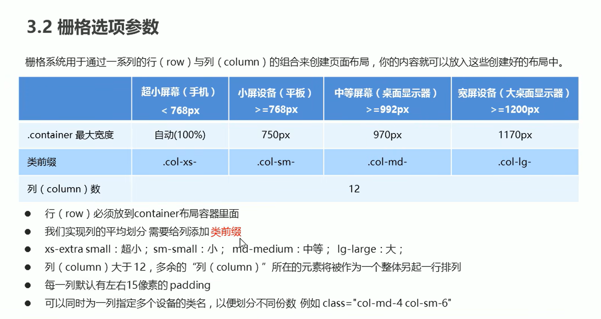


### 1.4.2、列嵌套

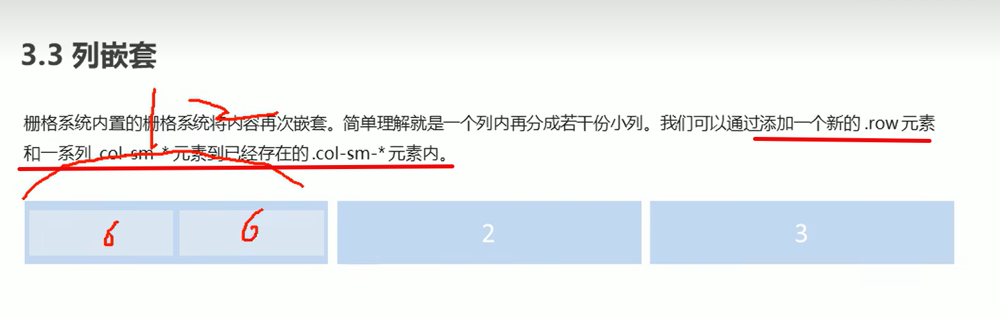

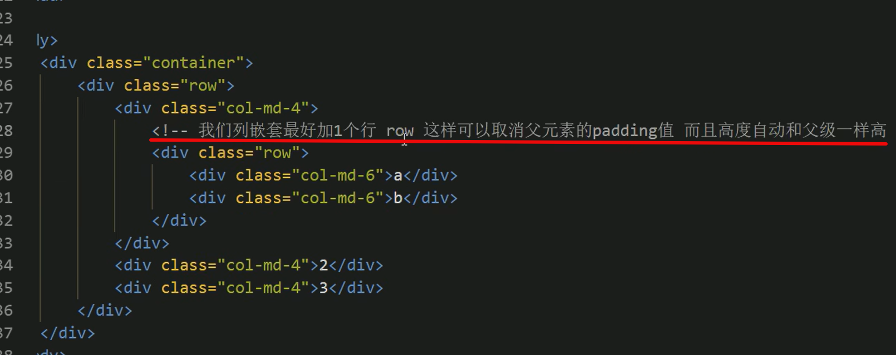

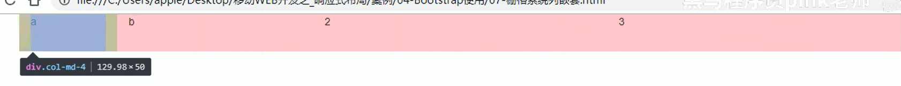


### 1.4.3、列偏移

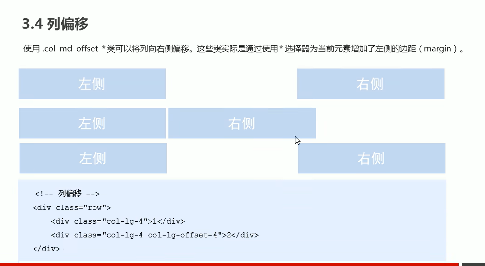

> 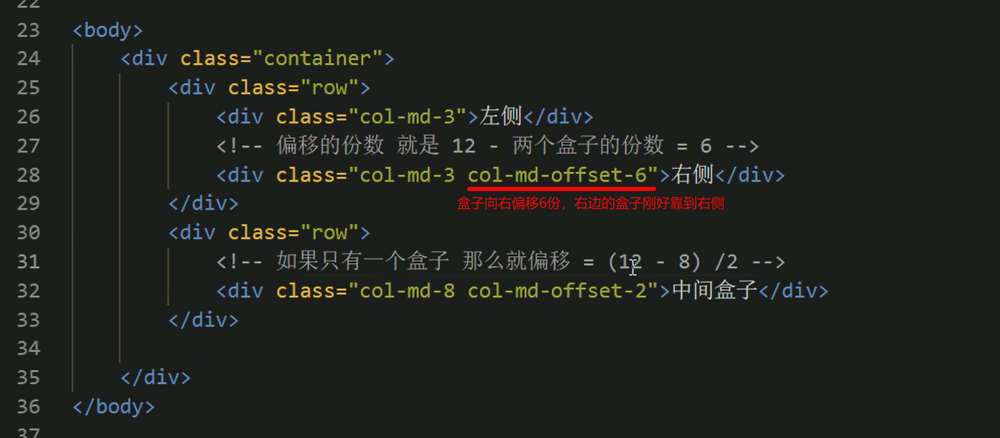
>
> 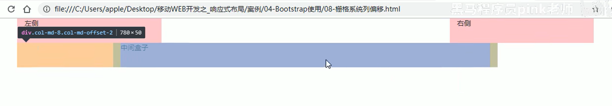


### 1.4.5、列排序

左侧-右侧

变化

右侧-左侧

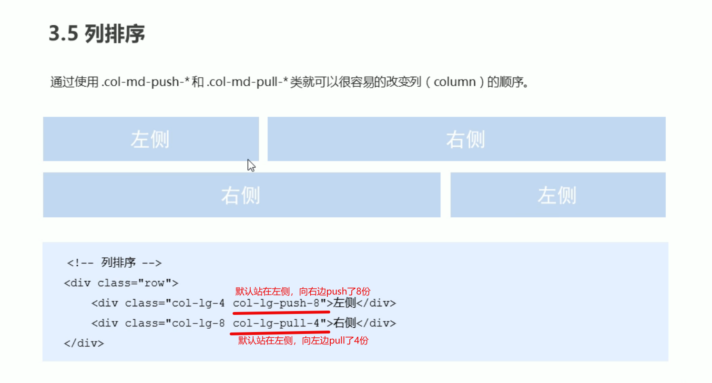


### 1.4.6、响应式工具

很简单，自己去试(╯>д<)╯⁽˙³˙⁾

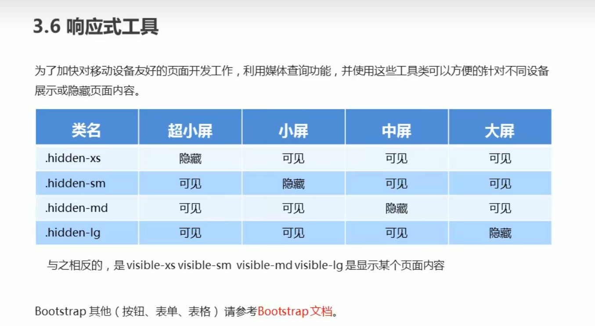


