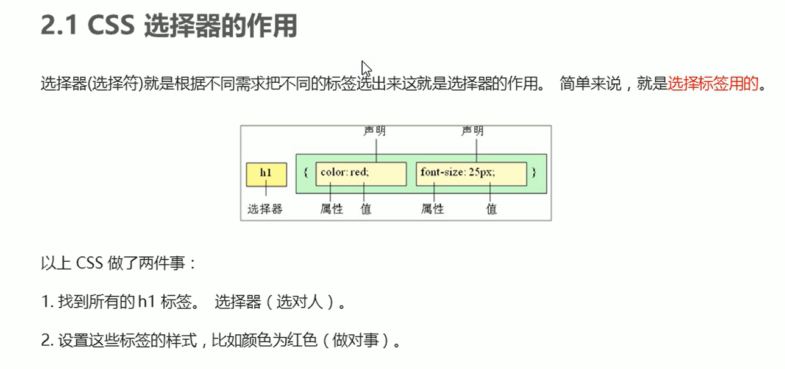
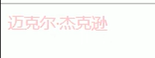

[TOC]

# 一、基础概念

## 1、CSS简介

## 2、CSS语法规范

**示例：**

 

**效果：**

 

## 3、CSS代码风格

# 二、基础语法

## 1、CSS选择器

### 1.1、CSS选择器的作用

### 1.2、选择器分类

### 1.3、标签选择器

**示例：**

 

**效果：**

 

### 1.4、类选择器

#### ①基础使用

**示例：**

 

**效果：**

 

#### ②多类名

好处很明显，结合实例分析，可以降低耦合度，提高复用性

 

**示例：**

.box可以统一设置指定类box的大小
.red或者.green可以用来分别设置box的背景颜色

 

**效果：**

 

### 1.5、id选择器

#### ①基础使用

**示例：**

 

**效果：**

 

#### ②id和类的区别

### 1.6、通配符选择器

### 1.7、基础选择器总结

## 2、CSS字体属性

### 2.1、字体系列

三点注意的点：

第一个，遇到了有空格的字体要用“''”包裹其来，例，'Microsofr Yahei'
第二个，多个字体之间必须使用”,“隔开
第三个，多个字体时，浏览器会从第一个依次往后面看，如果哪个字体浏览器带有的话就启用哪个字体，如果都没有的话，就使用系统自带的默认字体

**示例：**

字体可以写英文或者中文，建议写英文，兼容性好

 

**效果：**

 

### 2.2、字体大小

	

**示例：**

特殊的地方就是***标题标签**要单独指定文字的大小*

 

**效果：**

 

### 2.3、字体粗细

**示例：**

实际开发中我们最常用的是数字表示，字母表示的偏少

  

**效果：**

 

### 2.4、字体样式

**示例：**

**效果：**

 

### 2.5、复合属性写法

*也可以使用下面的简写方法*

可以少写，不写的直接忽略就行了，但是最后两个一定要写

### 2.6、总结

## 3、文本属性

### 3.1、文本颜色

**示例：**

 

**效果：**

 

### 3.2、对齐文本

本质上是设置文本在标签盒子里面的水平对齐方式
不是设置在浏览器的位置
结合下面的例子分析

**示例：**

看效果为什么会在浏览器中间呢？是因为h1标签其实占了浏览器的一行（红框），居中的话就是浏览器的中间咯

**效果：**

### 3.3、装饰文本

**示例：**

可以实现取消a标签自带的下划线

**效果：**

 第二行就是取消了下划线的链接元素

### 3.4、文本缩进

只会缩进第一行，也就会说你的元素字体溢出到了第二行也不会受到缩进影响，本质是只会缩进元素开头的部分

这里点名表扬一下em单位，你可以设置缩进为text-indent: 2em;
em是相对单位，大小为一个元素字体size的大小，你设置为2，那就是indent两个字咯（建议结合示例分析）

也可以指定text-indent为**负值**。淦，好怪哦！

**示例：**

**效果：**

### 3.5、行间距

注意行间距是*控制两行之间的距离的，并非指行与行的间距*
下面才是行间距的正确图示

### 3.6、总结

## 4、CSS的引入属性

### 4.1、内部样式表

写在了html的代码里面

### 4.2、行内样式表

将style用作一个属性，放在了标签里面style="color: red; font-size: 12px;"
双引号，;隔开

### 4.3、外部样式表

**下面是引入了外部样式表的操作示例**

rel="stylesheet"表明引入的数据是外部样式表
href是路径

注意CSS文件里面**只有样式，没有标签**，不用写

 

### 4.4、总结

## 5、chrone浏览器调试工具的使用

**示例：**

**效果：**

**示例：**

**效果：**

**示例：**

**效果：**

**示例：**

**效果：**

**示例：**

**效果：**

**示例：**

**效果：**

**示例：**

**效果：**

**示例：**

**效果：**

**示例：**

**效果：**

**示例：**

**效果：**

**示例：**

**效果：**

**示例：**

**效果：**

