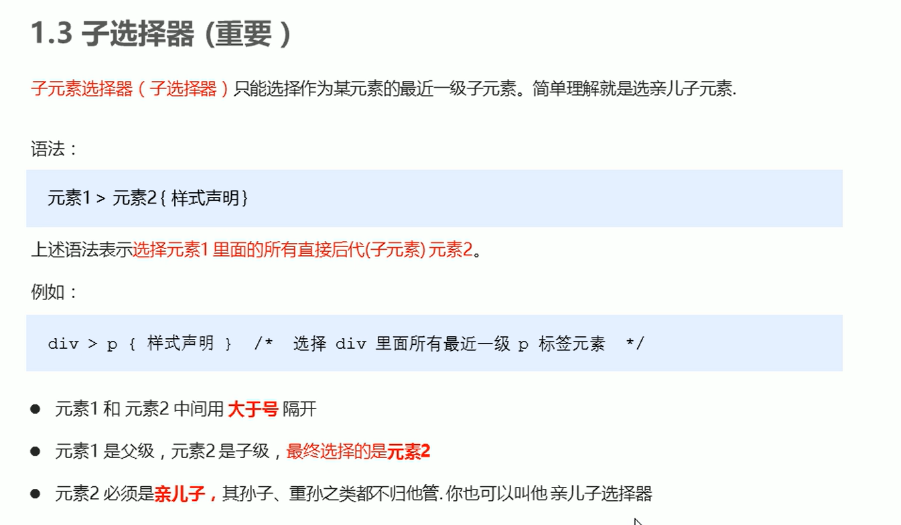
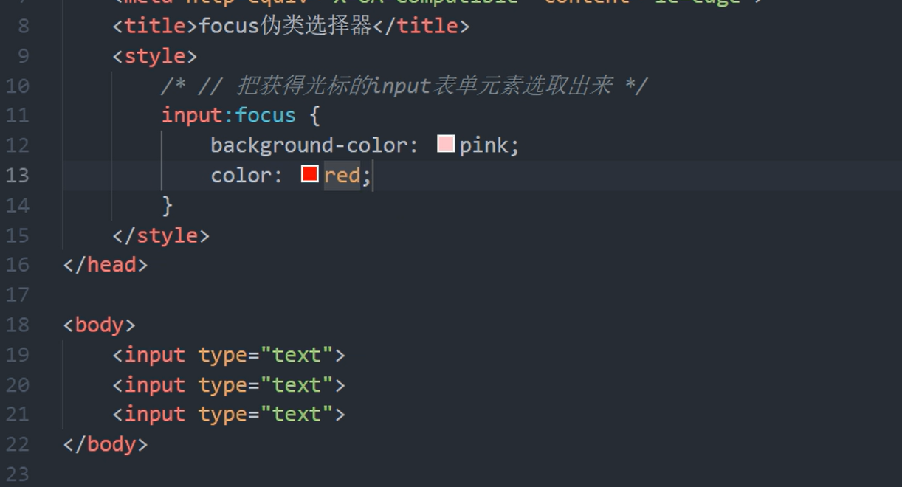

[TOC]

# 一、基础概念

## 1、CSS简介

## 2、CSS语法规范

**示例：**

 

**效果：**

 

## 3、CSS代码风格

# 二、基础语法

## 1、CSS基础选择器

### 1.1、CSS选择器的作用

### 1.2、选择器分类

### 1.3、标签选择器

**示例：**

 

**效果：**

 

### 1.4、类选择器

#### 1.4.1、基础使用

**示例：**

 

**效果：**

 

#### 1.4.2、多类名

好处很明显，结合实例分析，可以降低耦合度，提高复用性

 

**示例：**

.box可以统一设置指定类box的大小
.red或者.green可以用来分别设置box的背景颜色

 

**效果：**

 

### 1.5、id选择器

#### 1.5.1、基础使用

id好像不能是纯数字

**示例：**

 

**效果：**

 

#### 1.5.2、id和类的区别

### 1.6、通配符选择器

### 1.7、基础选择器总结

## 2、CSS字体属性

### 2.1、字体系列

三点注意的点：

第一个，遇到了有空格的字体要用“''”包裹其来，例，'Microsofr Yahei'
第二个，多个字体之间必须使用”,“隔开
第三个，多个字体时，浏览器会从第一个依次往后面看，如果哪个字体浏览器带有的话就启用哪个字体，如果都没有的话，就使用系统自带的默认字体

**示例：**

字体可以写英文或者中文，建议写英文，兼容性好

 

**效果：**

 

### 2.2、字体大小

	

**示例：**

特殊的地方就是***标题标签**要单独指定文字的大小*

 

**效果：**

 

### 2.3、字体粗细

**示例：**

实际开发中我们最常用的是数字表示，字母表示的偏少

  

**效果：**

 

### 2.4、字体样式

**示例：**

**效果：**

 

### 2.5、复合属性写法

*也可以使用下面的简写方法*

可以少写，不写的直接忽略就行了，但是最后两个一定要写

### 2.6、总结

## 3、文本属性

### 3.1、文本颜色

**示例：**

 

**效果：**

 

### 3.2、对齐文本

本质上是设置文本在标签盒子里面的水平对齐方式
不是设置在浏览器的位置
结合下面的例子分析

**示例：**

看效果为什么会在浏览器中间呢？是因为h1标签其实占了浏览器的一行（红框），居中的话就是浏览器的中间咯

**效果：**

### 3.3、装饰文本

**示例：**

可以实现取消a标签自带的下划线

**效果：**

 第二行就是取消了下划线的链接元素

### 3.4、文本缩进

只会缩进第一行，也就会说你的元素字体溢出到了第二行也不会受到缩进影响，本质是只会缩进元素开头的部分

这里点名表扬一下em单位，你可以设置缩进为text-indent: 2em;
em是相对单位，大小为一个元素字体size的大小，你设置为2，那就是indent两个字咯（建议结合示例分析）

也可以指定text-indent为**负值**。淦，好怪哦！

**示例：**

**效果：**

### 3.5、行间距

注意行间距是*控制两行之间的距离的，并非指行与行的间距*
下面才是行间距的正确图示

### 3.6、单行文字垂直居中

 

### 3.7、总结

## 4、CSS的引入属性

### 4.1、内部样式表

写在了html的代码里面

### 4.2、行内样式表

将style用作一个属性，放在了标签里面style="color: red; font-size: 12px;"
双引号，;隔开

### 4.3、外部样式表

**下面是引入了外部样式表的操作示例**

rel="stylesheet"表明引入的数据是外部样式表
href是路径

注意CSS文件里面**只有样式，没有标签**，不用写

 

### 4.4、总结

## 5、chrone浏览器调试工具的使用

## 6、Emmet

### 6.1、快速生成HTML结构语法

| 操作                                     | 快捷键                                                       |
| ---------------------------------------- | ------------------------------------------------------------ |
| 快速生成标签                             | 输入标签名，按下tab键                                        |
| 生成**多个相同的**标签                   | 标签名*n（不带空格）                                         |
| 快速生成**父子关系**的标签               | 使用>，例：ul>li                                             |
| 快速生成**兄弟关系**的标签               | 使用+，例：div+p                                             |
| 生成**带类名或者id名字**的               | 例：p.className或者p#className加上tab或者enter键就行了       |
| 生成的标签的**类名或者id名字是有顺序的** | 例子：p.demo$*5，或者p#demo$ *5，最后生成5个标签，类名或者id名字依次是demo1，demo2... |
| 在生成的标签**内部带有内容**             | 例：div{内容}，最终生成
内容
                       |

### 6.2、快速生成CSS样式语法

 

### 6.3、快速格式化代码

新版本在首选项-设置，搜索"format on save"并且打上勾就行了

## 7、CSS的复合选择器

### 7.1、后代选择器(重要)

**示例：**

**效果：**

 

> 后代可以是多重的

**示例：**

 

**效果：**

 

 

> 利用类名实现区分相同标签名的子代

**示例：**

 

**效果：**

 

### 7.2、子选择器(重要)

**示例：**

 

**效果：**

 

### 7.3、并集选择器(重要)

**示例：**

**效果：**

 

### 7.4、伪类选择器

#### 7.4.1、链接伪类选择器

**示例：**

  

**效果：**

 

#### 7.4.2、focus伪类选择器

哪个元素获取光标，哪个元素就会照着focus的样式变化，一般结合input表单元素使用

**示例：**

**效果：**

 

### 7.5、总结

## 8、CSS的元素选择模式

### 8.1、元素显示模式

### 8.2、块元素

### 8.3、行内元素

### 8.4、行内块元素

### 8.5、元素显示模式总结

### 8.6、元素显示模式转换

**示例：**

**效果：**

 aha链接元素被改成了蓝色块的大小，下面的div高度100px没起作用

## 9、CSS的背景

### 9.1、背景颜色

### 9.2、背景图片

跟color不同，你可以把背景设置为一些图片，或者插入一些图片元素到背景中

**示例：**

**效果：**

 

### 9.3、背景平铺

**示例：**

**效果：**

 

### 9.4、背景位置

#### 9.4.1、参数为方位名词

background-position: x y;
x、y坐标最好都得写

如果**忽略了一个不写**的话，那么默认第二个为center，即居中对齐

补充一下省略一个参数的，如果第一个是水平的(left-right)，那么第二个参数默认**垂直的居中对齐**
如果第一个参数是垂直的，第二个就是**水平的居中对齐**

**示例：**

**效果：**

 

#### 9.4.2、参数为精确单位

#### 9.4.3、混合单位

运用场景，保证一个坐标在图片的一个位置（不用担心图片的变化），另一个坐标可以调整。或者懒得去测量也可以方便使用

### 9.5、背景固定

### 9.6、背景属性复合写法

节约代码量，但是怕你看不懂，加油吧，实际开发就这么写的。

### 9.7、背景半透明(重要)

其实也不是说多重要，主要是真的帅啊

**示例：**

**效果：**

 

### 9.8、总结

## 10、CSS三大特性

### 10.1、层叠性

两个原则：哪个近就执行哪个；样式只对发生冲突的进行层叠

**示例：**

那个近就执行那个

**效果：**

div为pink色

### 10.2、继承性

之前利用body标签，设置font-family的时候就是利用了继承性的

> 行高的继承性

 

### 10.3、优先级

**示例：**

**效果：**

 

> **注意**

**示例：**

**效果：**

 

> 这里解释一下
>
> 为什么设置了body标签的字体样式为红色，链接a的字体仍为蓝色？
>
> 因为浏览器对a默认制定了一个blue样式，而继承权重为0000，所以浏览器对a的blue指定自动把body的层叠掉了
>
> 

### 10.4、CSS权重的叠加

注意，**第一点，权重叠加是不会有进位的问题的**

**第二点，继承的权重是0，所以有时候会出现**

普通示例：

**示例：**

**效果：**

 

> **帮助理解权重的两道例题**
>
> **示例：**
>
> 想一想为什么最后的颜色是pink呢？
>
> 那是因为继承的权重为0，尽管<li>标签继承了red，但是权重为0000，还是比li标签选择器0001低，所以最后会是标签选择器的pink
>
> 
>
> 想一想，当我想让第一个<li>的颜色为pink时，为什么当类选择器为单一的.pink会是red呢？
>
> 那是因为第一个.nav li的权重是0011，而第二个.pink的权重是0010，所以.pink设置无效，正确写法应该如下图
>
> **示例：**
>
> 
>

## 11、盒子模型

### 11.1、网页布局的本质

 

### 11.2、盒子模型组成

### 11.3、边框

**示例：**

**效果：**

 

> **边框的复合写法**
>
> 
>
> 

### 11.4、表格的细线边框

每个单元格也可以设置边框，这样就可以设置细线了，但是也要设置合并边框border-collapse（因为每个单元格的边框宽度会叠加，叠起来就不细啦）

**示例：**

**效果：**

### 11.5、边框会影响盒子实际大小

### 11.6、内边距

padding

当然*内边距的影响其实也是有妙用*的，请看font-end的码的笔记-平平无奇导航栏

**示例：**

> **padding属性复合属性（简写）**
>
> 

> **padding也有不会撑开盒子的时候**
>
>  
>
> **示例：**
>
> 没加width
>
>  
>
> 
>
> 加了width
>
>  
>
> 

### 11.7、外边距

margin

#### 11.7.1、块级盒子水平居中

**示例：**

**效果：**

#### 11.7.2、行内元素和行内块元素水平居中

**示例：**

**效果：**

#### 11.7.3、外边距合并(塌陷)

> **解决方案**
>
> 有三种，本质上都是让子元素和父元素分开，有一点距离而不至于黏在一起
>
> 第一种，为父元素套上边框
>
> 第二种，为父元素指定内边距
>
> 第三种，为父元素添加overflow:hidden
>
> **示例如下：**
>
> 
>
> **最终效果**
>
>  

#### 11.7.4、去除内外边距

为什么不建议设置行内元素的上下边距呢 因为有时候是不起作用的，浏览器上不会改变

### 11.8、结合PS工具的使用

### 11.9、圆角边框

因此不难得出，border-radius的**属性值越大圆角越大**

> **示例：**
>
> 
>
> **效果：**
>
>  
>

#### 11.9.1、如何让一个盒子变为圆型

> **示例：**
>
> 从正方形中裁剪，50%代表宽度和高度的一半
>
> 
>
> **效果：**
>
>  
>

#### 11.9.2、如何制作圆角矩形

> 把高度设置为盒子的一半，原理结合图形自己理解
>
> **示例：**
>
> 
>
> **效果：**
>
>  

#### 11.9.3、设置不同的圆角

> **示例：**
>
> 
>
> **效果：**
>
>  

### 11.10、盒子阴影(重点)

> **示例：**
>
> 
>
> **效果：**
>
>  

#### 11.10.1、文字阴影

> **示例：**
>
> 
>
> **效果：**
>
> 

## 12、浮动

### 12.1、传统网页布局的三种模式

### 12.2、标准流(普通流/文档流)

 

### 12.3、浮动的作用

### 12.4、浮动的定义

说下我的理解吧

如同冰块一般，如果我的盒子上面遇到了同样是浮动的盒子（冰块），就会排到它后面去(浮起来)

具体看视频

https://www.bilibili.com/video/BV14J4114768?p=172&spm_id_from=pageDriver&vd_source=fa6237a8a5bce00232e38ebaf2cd8745&t=0.9

### 12.5、浮动的特性(重难点)

#### 12.5.1、脱标

#### 12.5.2、一行显示

#### 12.5.3、行内块元素

> **示例：**
>
> 
>
> **效果：**
>
> p身为块级元素，宽度不是百分百了，而是字体内容的宽度
>
> 

#### 12.5.4、浮动结合标准流

### 12.6、浮动的注意点

看不懂结合视频看吧

https://www.bilibili.com/video/BV14J4114768?p=182&spm_id_from=333.1007.top_right_bar_window_history.content.click&vd_source=fa6237a8a5bce00232e38ebaf2cd8745&t=4.1

### 12.7、最常见的网页布局

*下面有示例：*

font-size的码里面有上面最后一个网页布局的代码实现

### 12.8、清除浮动

#### 12.8.1、原因

#### 12.8.2、本质/方法

##### ①额外标签法

在全部浮动元素的末尾添加一个标签，标签清除了浮动（标签需要是*块级标签*）

> **示例：**
>
> 
>
> **效果：**
>
> 

##### ②父级添加overflow

> **示例：**
>
> 
>
> **效果：**
>
> 

##### ③:after伪元素

固定代码，cv就完事了，具体使用看示例

> **示例：**
>
> 写死的一段代码
>
>  
>
>  
>
> **效果：**
>
> 

##### ④双伪元素清除浮动

堵住了盒子前面和后面

 

> **示例：**
>
> 
>
>  
>
> **效果：**
>
> 

> **示例：**
>
> 
>
> **效果：**
>
> 

> **示例：**
>
> 
>
> **效果：**
>
> 

> **示例：**
>
> 
>
> **效果：**
>
> 

> **示例：**
>
> 
>
> **效果：**
>
> 

> **示例：**
>
> 
>
> **效果：**
>
> 

> **示例：**
>
> 
>
> **效果：**
>
> 

> **示例：**
>
> 
>
> **效果：**
>
> 

> **示例：**
>
> 
>
> **效果：**
>
> 

> **示例：**
>
> 
>
> **效果：**
>
> 

> **示例：**
>
> 
>
> **效果：**
>
> 

> **示例：**
>
> 
>
> **效果：**
>
> 

> **示例：**
>
> 
>
> **效果：**
>
> 

> **示例：**
>
> 
>
> **效果：**
>
> 

> **示例：**
>
> 
>
> **效果：**
>
> 

> **示例：**
>
> 
>
> **效果：**
>
> 

> **示例：**
>
> 
>
> **效果：**
>
> 

> **示例：**
>
> 
>
> **效果：**
>
> 

