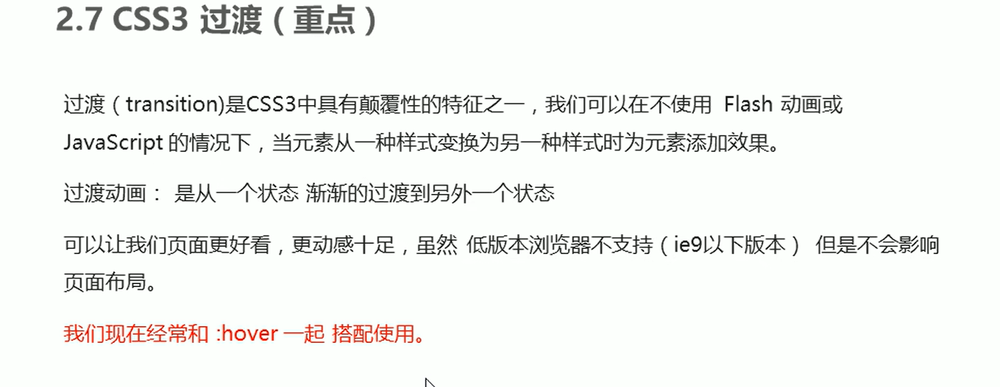

[TOC]


# 一、基础概念

## 1、CSS简介


## 2、CSS语法规范


**示例：**

 

**效果：**

 


## 3、CSS代码风格


# 二、基础语法

## 1、CSS基础选择器

### 1.1、CSS选择器的作用


### 1.2、选择器分类


### 1.3、标签选择器


**示例：**

 

**效果：**

 


### 1.4、类选择器

#### 1.4.1、基础使用


**示例：**

 

**效果：**

 


#### 1.4.2、多类名

好处很明显，结合实例分析，可以降低耦合度，提高复用性

 


**示例：**

.box可以统一设置指定类box的大小
.red或者.green可以用来分别设置box的背景颜色

 

**效果：**

 


### 1.5、id选择器

#### 1.5.1、基础使用

id好像不能是纯数字


**示例：**

 

**效果：**

 

#### 1.5.2、id和类的区别


### 1.6、通配符选择器


### 1.7、基础选择器总结


------


## 2、CSS字体属性

### 2.1、字体系列

三点注意的点：

第一个，遇到了有空格的字体要用“''”包裹其来，例，'Microsofr Yahei'
第二个，多个字体之间必须使用”,“隔开
第三个，多个字体时，浏览器会从第一个依次往后面看，如果哪个字体浏览器带有的话就启用哪个字体，如果都没有的话，就使用系统自带的默认字体


**示例：**

字体可以写英文或者中文，建议写英文，兼容性好

 

**效果：**

 


### 2.2、字体大小

	

**示例：**

特殊的地方就是***标题标签**要单独指定文字的大小*

 

**效果：**

 


### 2.3、字体粗细


**示例：**

实际开发中我们最常用的是数字表示，字母表示的偏少

  

**效果：**

 


### 2.4、字体样式


**示例：**


**效果：**

 

### 2.5、复合属性写法


*也可以使用下面的简写方法*


可以少写，不写的直接忽略就行了，但是最后两个一定要写


### 2.6、总结


------


## 3、文本属性

### 3.1、文本颜色


**示例：**

 

**效果：**

 


### 3.2、对齐文本

本质上是设置文本在标签盒子里面的水平对齐方式
不是设置在浏览器的位置
结合下面的例子分析


**示例：**

看效果为什么会在浏览器中间呢？是因为h1标签其实占了浏览器的一行（红框），居中的话就是浏览器的中间咯


**效果：**


### 3.3、装饰文本


**示例：**

可以实现取消a标签自带的下划线


**效果：**

 第二行就是取消了下划线的链接元素


### 3.4、文本缩进

只会缩进第一行，也就会说你的元素字体溢出到了第二行也不会受到缩进影响，本质是只会缩进元素开头的部分


这里点名表扬一下em单位，你可以设置缩进为text-indent: 2em;
em是相对单位，大小为一个元素字体size的大小，你设置为2，那就是indent两个字咯（建议结合示例分析）


也可以指定text-indent为**负值**。淦，好怪哦！


**示例：**


**效果：**


### 3.5、行间距

注意行间距是*控制两行之间的距离的，并非指行与行的间距*
下面才是行间距的正确图示


### 3.6、单行文字垂直居中

 


### 3.7、总结


------


## 4、CSS的引入属性


### 4.1、内部样式表

写在了html的代码里面


### 4.2、行内样式表

将style用作一个属性，放在了标签里面style="color: red; font-size: 12px;"
双引号，;隔开


### 4.3、外部样式表


**下面是引入了外部样式表的操作示例**

rel="stylesheet"表明引入的数据是外部样式表
href是路径


注意CSS文件里面**只有样式，没有标签**，不用写<style></style>

 


### 4.4、总结


------


## 5、chrone浏览器调试工具的使用


------


## 6、Emmet


### 6.1、快速生成HTML结构语法

| 操作                                     | 快捷键                                                       |
| ---------------------------------------- | ------------------------------------------------------------ |
| 快速生成标签                             | 输入标签名，按下tab键                                        |
| 生成**多个相同的**标签                   | 标签名*n（不带空格）                                         |
| 快速生成**父子关系**的标签               | 使用>，例：ul>li                                             |
| 快速生成**兄弟关系**的标签               | 使用+，例：div+p                                             |
| 生成**带类名或者id名字**的               | 例：p.className或者p#className加上tab或者enter键就行了       |
| 生成的标签的**类名或者id名字是有顺序的** | 例子：p.demo$*5，或者p#demo$ *5，最后生成5个标签，类名或者id名字依次是demo1，demo2... |
| 在生成的标签**内部带有内容**             | 例：div{内容}，最终生成<div>内容</div>                       |


### 6.2、快速生成CSS样式语法

 


### 6.3、快速格式化代码

新版本在首选项-设置，搜索"format on save"并且打上勾就行了


------


## 7、CSS的复合选择器

### 7.1、后代选择器(重要)


**示例：**


**效果：**

 


> 后代可以是多重的

**示例：**

 

**效果：**

 

 

> 利用类名实现区分相同标签名的子代

**示例：**

 


**效果：**

 


### 7.2、子选择器(重要)

选择的是**所有该子代元素**


**示例：**

 

**效果：**

 


### 7.3、并集选择器(重要)


**示例：**


**效果：**

 


### 7.4、伪类选择器

#### 7.4.1、链接伪类选择器


**示例：**

  

**效果：**

 


#### 7.4.2、focus伪类选择器

哪个元素获取光标，哪个元素就会照着focus的样式变化，一般结合input表单元素使用


**示例：**


**效果：**

 


### 7.5、总结


------


## 8、CSS的元素选择模式

### 8.1、元素显示模式


### 8.2、块元素


### 8.3、行内元素


### 8.4、行内块元素


### 8.5、元素显示模式总结


### 8.6、元素显示模式转换


**示例：**


**效果：**

 aha链接元素被改成了蓝色块的大小，下面的div高度100px没起作用


------


## 9、CSS的背景

### 9.1、背景颜色


### 9.2、背景图片

跟color不同，你可以把背景设置为一些图片，或者插入一些图片元素到背景中


**示例：**


**效果：**

 


### 9.3、背景平铺


**示例：**


**效果：**

 


### 9.4、背景位置

#### 9.4.1、参数为方位名词

background-position: x y;
x、y坐标最好都得写

如果**忽略了一个不写**的话，那么默认第二个为center，即居中对齐


补充一下省略一个参数的，如果第一个是水平的(left-right)，那么第二个参数默认**垂直的居中对齐**
如果第一个参数是垂直的，第二个就是**水平的居中对齐**


**示例：**


**效果：**

 


#### 9.4.2、参数为精确单位


#### 9.4.3、混合单位

运用场景，保证一个坐标在图片的一个位置（不用担心图片的变化），另一个坐标可以调整。或者懒得去测量也可以方便使用


### 9.5、背景固定


### 9.6、背景属性复合写法

节约代码量，但是怕你看不懂，加油吧，实际开发就这么写的。


### 9.7、背景半透明(重要)

其实也不是说多重要，主要是真的帅啊


**示例：**


**效果：**

 


### 9.8、总结


------


## 10、CSS三大特性

### 10.1、层叠性

两个原则：哪个近就执行哪个；样式只对发生冲突的进行层叠


**示例：**

那个近就执行那个


**效果：**

div为pink色


### 10.2、继承性

之前利用body标签，设置font-family的时候就是利用了继承性的


> 行高的继承性


 


### 10.3、优先级


**示例：**


**效果：**

 


> **注意**


**示例：**


**效果：**

 

> 这里解释一下
>
> 为什么设置了body标签的字体样式为红色，链接a的字体仍为蓝色？
>
> 因为浏览器对a默认制定了一个blue样式，而继承权重为0000，所以浏览器对a的blue指定自动把body的层叠掉了
>
> 


### 10.4、CSS权重的叠加

注意，**第一点，权重叠加是不会有进位的问题的**

**第二点，继承的权重是0，所以有时候会出现**


普通示例：

**示例：**


**效果：**

 

> **帮助理解权重的两道例题**
>
> **示例：**
>
> 想一想为什么最后的颜色是pink呢？
>
> 那是因为继承的权重为0，尽管<li>标签继承了red，但是权重为0000，还是比li标签选择器0001低，所以最后会是标签选择器的pink
>
> 
>
> 想一想，当我想让第一个<li>的颜色为pink时，为什么当类选择器为单一的.pink会是red呢？
>
> 那是因为第一个.nav li的权重是0011，而第二个.pink的权重是0010，所以.pink设置无效，正确写法应该如下图
>
> **示例：**
>
> 
>


------


## 11、盒子模型

### 11.1、网页布局的本质

 

### 11.2、盒子模型组成


### 11.3、边框


**示例：**


**效果：**

 

> **边框的复合写法**
>
> 
>
> 


### 11.4、表格的细线边框

每个单元格也可以设置边框，这样就可以设置细线了，但是也要设置合并边框border-collapse（因为每个单元格的边框宽度会叠加，叠起来就不细啦）


**示例：**


**效果：**


### 11.5、边框会影响盒子实际大小


### 11.6、内边距

padding


当然*内边距的影响其实也是有妙用*的，请看font-end的码的笔记-平平无奇导航栏


**示例：**


> **padding属性复合属性（简写）**
>
> 


> **padding也有不会撑开盒子的时候**
>
>  
>
> **示例：**
>
> 没加width
>
>  
>
> 
>
> 加了width
>
>  
>
> 


### 11.7、外边距

margin


#### 11.7.1、块级盒子水平居中


**示例：**


**效果：**


#### 11.7.2、行内元素和行内块元素水平居中


**示例：**


**效果：**


#### 11.7.3、外边距合并(塌陷)


> **解决方案**
>
> 有三种，本质上都是让子元素和父元素分开，有一点距离而不至于黏在一起
>
> 第一种，为父元素套上边框
>
> 第二种，为父元素指定内边距
>
> 第三种，为父元素添加overflow:hidden
>
> **示例如下：**
>
> 
>
> **最终效果**
>
>  


#### 11.7.4、去除内外边距

为什么不建议设置行内元素的上下边距呢 因为有时候是不起作用的，浏览器上不会改变


### 11.8、结合PS工具的使用


### 11.9、圆角边框

因此不难得出，border-radius的**属性值越大圆角越大**


> **示例：**
>
> 
>
> **效果：**
>
>  
>

#### 11.9.1、如何让一个盒子变为圆型


> **示例：**
>
> 从正方形中裁剪，50%代表宽度和高度的一半
>
> 
>
> **效果：**
>
>  
>


#### 11.9.2、如何制作圆角矩形

> 把高度设置为盒子的一半，原理结合图形自己理解
>
> **示例：**
>
> 
>
> **效果：**
>
>  


#### 11.9.3、设置不同的圆角

> **示例：**
>
> 
>
> **效果：**
>
>  


### 11.10、盒子阴影(重点)


> **示例：**
>
> 
>
> **效果：**
>
>  


#### 11.10.1、文字阴影


> **示例：**
>
> 
>
> **效果：**
>
> 


------


## 12、浮动

### 12.1、传统网页布局的三种模式


### 12.2、标准流(普通流/文档流)

 

### 12.3、浮动的作用


### 12.4、浮动的定义

说下我的理解吧

如同冰块一般，如果我的盒子上面遇到了同样是浮动的盒子（冰块），就会排到它后面去(浮起来)

具体看视频

https://www.bilibili.com/video/BV14J4114768?p=172&spm_id_from=pageDriver&vd_source=fa6237a8a5bce00232e38ebaf2cd8745&t=0.9


### 12.5、浮动的特性(重难点)

#### 12.5.1、脱标


#### 12.5.2、一行显示


#### 12.5.3、行内块元素


> **示例：**
>
> 
>
> **效果：**
>
> p身为块级元素，宽度不是百分百了，而是字体内容的宽度
>
> 


#### 12.5.4、浮动结合标准流


### 12.6、浮动的注意点

看不懂结合视频看吧

https://www.bilibili.com/video/BV14J4114768?p=182&spm_id_from=333.1007.top_right_bar_window_history.content.click&vd_source=fa6237a8a5bce00232e38ebaf2cd8745&t=4.1


### 12.7、清除浮动

#### 12.7.1、原因


#### 12.8.2、本质/方法


##### ①额外标签法

在全部浮动元素的末尾添加一个标签，标签清除了浮动（标签需要是*块级标签*）


> **示例：**
>
> 
>
> **效果：**
>
> 


##### ②父级添加overflow


> **示例：**
>
> 
>
> **效果：**
>
> 


##### ③:after伪元素

固定代码，cv就完事了，具体使用看示例


> **示例：**
>
> 写死的一段代码
>
>  
>
>  
>
> **效果：**
>
> 


##### ④双伪元素清除浮动

堵住了盒子前面和后面


 


> **示例：**
>
> 
>
>  
>
> **效果：**
>
> 


------


## 13、PS切图

### 13.1、常见的图片格式


### 13.2、图层切图

 


### 13.3、切片工具切图


### 13.4、Cutterman插件


------


## 14、规范

### 14.1、最常见的网页布局


*下面有示例：*

font-size的码里面有上面最后一个网页布局的代码实现


### 14.2、CSS属性书写顺序(重要)


### 14.3、页面布局整体思路


### 14.4、导航栏(a)制作的规范


------


## 15、定位

### 15.1、定位的作用


### 15.2、定位组成


 


### 15.3、定位模式

| 定位模式               |                             特点                             |
| ---------------------- | :----------------------------------------------------------: |
| 静态定位static(了解)   |            默认定位方式，按照标准流的特性摆放位置            |
| 相对定位relative(重要) | 1.相对于原来的位置移动，参照物是初始位置 2.**原来**在标准流的位置**继续占有**，并且后面的盒子也会以标准流的方式对待它 |
| 绝对定位absolute(重要) | 1.**没有**祖先元素，或者祖先元素**没有**定位，就以**浏览器作**为定位 2.如果祖先元素有定位，就以**最近一级有定位的祖先元素**作为参考点  3.**原来**在标准流的位置**不会占有** |
| 固定点位fixed(重要)    | 1.以浏览器的**可视窗口为参照点**移动元素(与父元素没关系，不随滚动条滚动) 2.固定定位**不占有原先位置**(脱标) |
| 粘性定位sticky(了解)   |                                                              |


#### 15.3.1、静态定位(了解)


#### 15.3.2、相对定位(重要)


#### 15.3.3、绝对定位(重要)


> **示例：**
>
> 
>
> **效果：**
>
> 


##### ①绝对定位盒子水平垂直居中

必须要使用50%，为了应对浏览器缩小放大的变化


> **示例：**
>
> 
>
> 
>
> **效果：**
>
> 


#### 15.3.4、子绝父相

也并非永远不变的，子绝父绝也有可能的。


#### 15.3.5、固定定位(重要)


##### ①tip:固定在版心右侧


> **示例：**
>
> 
>
> **效果：**
>
> 


#### 15.3.6、粘性定位

解释一下相对定位和固定点位混合的意思

相对定位就是它占用原来的位置，标题表现就是你把浏览器往下拖动，元素也会表现出上移

固定点位就是当它距离浏览器可视窗口的某个位置(top-bottom-right-left)距离为指定px时，就会变成固定定位，固定在浏览器可视窗口上

所以会出现你移动浏览器，元素会移动，达到与浏览器边框一定距离后又变为固定点位


 

> **示例：**
>
> 
>
> **效果：**
>
> <video src="../../../../Videos/Captures/12-粘性定位（了解）_哔哩哔哩_bilibili - Google Chrome 2022-08-19 16-40-02.mp4"></video>


### 15.4、定位叠放顺序


 


### 15.5、定位特殊性

有四个特性


 


> **示例：**
>
> 
>
> **效果：**
>
> 浮动压住了p标签，但还是特意把文字挤了出来hh
>
> 


------


## 16、元素显示/隐藏

应用场景很多，如叉掉广告

| 属性       | 使用                                    | 特性                                                         |
| ---------- | --------------------------------------- | ------------------------------------------------------------ |
| display    | display:none \| display:block           | none:隐藏对象，并且**不占有原来的位置** block:除了转换为跨级元素，还有显式元素的意思 |
| visibility | visibility:visible \| visibility:hidden | visible:元素可视 hidden:隐藏，隐藏元素后，**继续占有原来的位置** |
| overflow   | visible \| hidden \| auto \| scroll     | 处理溢出盒子边框的元素(不止文本哦)的几种方式                 |


### 16.1、display


### 16.2、visibility


### 16.3、overflow

visible：溢出也给你显示

hidden：溢出的隐藏

auto：溢出了加滚动条，不溢出就普普通通的边框

scroll：不管溢出与否，都加滚动条

 


------


# 三、进阶技巧


## 1、精灵图

### 1.1、作用


### 1.2、精灵图的使用


------


## 2、字体图标


### 2.1、字体图标的引入


> PS：font文件夹下面四个不同后缀的文件的意义


> 
>
> 
>
> **上面的操作不要背**
>
> 去目录下的style.CSS文件复制下面这一段扔到<style>标签下面
>
> 

然后去目录下的demo.html里面复制这个图标


> **示例：**
>
> 把font-family设置为引入的样式icommon
>
> 
>
> 
>
> **效果：**
>
>  


### 2.2、字体图标的添加

 	


### 2.2、字体图标的加载原理

也是从服务器那里加载了一次下面的四个文件，想用那个图标找对应的方框调用就行了

添加图标的原理，也是修改了下面的四个文件


------


## 3、CSS三角

transparent：透明

宽高必须为0，指定边框为透明的，那边要有三角形，就设置哈颜色就好了


> **示例：**
>
> 
>
> **效果：**
>
>  


------


## 4、用户界面样式

### 4.1、鼠标样式


### 4.2、轮廓线


 蓝色的就消失啦


4.3、拖拽文本


 拖不了了


------


## 5、vertical-align属性


### 5.1、解决图片空白缝隙

产生行内块元素(img)会和文字的基线对齐

 


------


## 6、溢出的文字使用省略号显示

 

> **1.单行溢出文本显示为省略号**
>
> 分为三步
>
> 第一步，强制一行显示文本
>
> 第二步，超出的部分隐藏
>
> 第三步，溢出的部分使用省略号代替


> **示例：**
>
> 
>
> **效果：**
>
>  强制一行显示，不换行，溢出的文字用省略号代替


> **2.多行文本溢出显示为省略号**
>
> 如下


> **示例：**
>
> 
>
> **效果：**
>
>  


------


## 7、常见布局技巧

### 7.1、解决边框相邻加粗的问题


 

> **示例：**
>
> 我有必要解释下此处代码的妙处
>
> 理论上大家都是margin-left为-1px，即往右走1px
>
> 所以第一个盒子会距离第二个盒子1px
>
> 但由于先执行float左浮动，所以两者是先贴合在一起(抹掉了第一个盒子右移动与第二个盒子的1px距离)
>
> 此时第二个盒子再往右走1px，边框反而重叠在一起
>
> 
>
> **效果：**
>
> **调整前**如下
>
> 
>
> **调整后如下**
>
> 


### 7.2、文字围绕元素


### 7.3、行内块妙用技巧

下面是具体效果，具体代码见font-end的码>下面的跳转栏

下面的操作text-align可以使行内或者行内块元素水平居中，于是下面这一堆蚂蚁就可以成功在浏览器居中

 这一步很妙

 


### 7.4、三角巧妙运用

制作下面的价格的梯形很容易

就是把一个三角形靠绝对定位覆盖在一侧，然后使得颜色为白色

 

#### 7.4.1、制作直角三角形

原来

```CSS
* {
    padding: 0;
    margin: 0;
}
/* .box1是一个空盒子div */
.box1 {
    width: 0;
    height: 0;
    /* 把上边框宽度调大 */
    border-top: 100px solid transparent;
    border-right: 50px solid skyblue;
    /* 左边和下边的边跨设置为0 */
    border-bottom: 0 solid blue;
    border-left: 0 solid green;

    /* 下面这种简写的方法也可以 */
    /* 1.只保留右边的边框有颜色 */
    border-color: transparent skyblue transparent transparent;
    /* 2.样式都是solid */
    border-style: solid;
    /* 3.上边框要大，右边框稍小，其他边框为0 */
    border-width: 100px 50px 0 0;
}
```


> **示例：**
>
> 
>
> **效果：**
>
>  


------


## 8、CSS初始化


下面即是一些初始化的例子

 

 

 


------


# 四、CSS3的新特性

## 4.1、CSS3的现状


------


## 4.2、属性选择器


> **示例：**
>
> ```html
> <!DOCTYPE html>
> <html lang="zh-CN">
> 
> <head>
>     <meta charset="UTF-8">
>     <meta http-equiv="X-UA-Compatible" content="IE=edge">
>     <meta name="viewport" content="width=device-width, initial-scale=1.0">
>     <title>Document</title>
>     <style>
>         * {
>             padding: 0;
>             margin: 0;
>         }
> 
>         /* 这个选择器选的是input元素，且该标签里面的属性有value */
>         input[value] {
>             color: #1588f5;
>         }
> 
>         /* 这个选择器选择的是input元素，且其type值等于password */
>         input[type="password"] {
>             color: #1588f5;
>         }
> 
>         /* 选择div元素且class属性值以icon开头，这样就可以不必使用四个类选择器进行相同修改了 */
>         div[class^="icon"] {
>             color: #1588f5;
>         }
> 
>         section[class$="data"] {
>             /* 选择section元素且class属性值以data开头，这样就可以不必使用三个类选择器进行相同修改了 */
>             color: #1588f5;
>         }
>         
>         /* 类选择器、权重选择器和属性选择器的权重都是10 */
>     </style>
> </head>
> 
> <body>
>     <!-- 1.利用属性选择器可以不借助类或者id选择器 -->
>     <input type="text" value="阿巴阿巴">
>     <input type="text">
>     <!-- 2.属性选择器还可以选择属性=值的某些元素   -->
>     <input type="text">
>     <input type="password">
>     <!-- 3.属性选择器还可以选择属性值开头的某些元素 -->
>     <div class="icon1">1</div>
>     <div class="icon2">2</div>
>     <div class="icon3">3</div>
>     <div class="icon4">4</div>
>     <!-- 4.属性选择器还可以选择属性值结尾的某些元素 -->
>     <section class="icon1-data">1</section>
>     <section class="icon2-data">2</section>
>     <section class="icon2-pro">3</section>
> </body>
> 
> </html>
> ```
>
> **效果：**
>
>  


------


## 4.3、结构伪类选择器

### 4.3.1、基础使用

关于下面的fist-child选择器你很可能产生误会，下面的选择器起效果，必须要满足下面两个条件
**第一个，li是ul的子元素**
**第二个，ul全部子元素中第一个子元素是li**
其他的结构伪类选择器也是如此，请务必注意


> **示例：**
>
> ```html
> <!DOCTYPE html>
> <html lang="zh-CN">
> 
> <head>
>     <meta charset="UTF-8">
>     <meta http-equiv="X-UA-Compatible" content="IE=edge">
>     <meta name="viewport" content="width=device-width, initial-scale=1.0">
>     <title>Document</title>
>     <style>
>         /* 关于下面的fist-child选择器你很可能产生误会，下面的选择器起效果，必须要满足下面两个条件
>         第一个，li是ul的子元素
>         第二个，ul全部子元素中第一个子元素是li
>         其他的结构伪类选择器也是如此，请务必注意
>         */
>         /* 选择ul里面的第一个li元素 */
>         ul li:first-child {
>             background-color: aquamarine;
>         }
> 
>         ul li:last-child {
>             background-color: bisque;
>         }
> 
>         /* 这个就是当ul的全部子元素的第二个为li，此时该被选中的小li才会起效果 */
>         ul li:nth-child(2) {
>             background-color: chartreuse;
>         }
>     </style>
> </head>
> 
> <body>
>     <ul>
>         <li>第1个child</li>
>         <li>第2个child</li>
>         <li>第3个child</li>
>         <li>第4个child</li>
>         <li>第5个child</li>
>         <li>第6个child</li>
>         <li>第7个child</li>
>         <li>第8个child</li>
>         <li>第9个child</li>
>     </ul>
> </body>
> 
> </html>
> ```
>
> **效果：**
>
> 


### 4.3.2、进阶使用


#### ①nth-child(n)

关于n+5的理解

n：  0 1 2 3 4 5

n+5: 5 6 7 8 9 10

其余自推


> **示例：**
>
> *关键字：even奇数，odd偶数*
>
> 牛，可以把表格隔行变色表现出来	
>
> 
>
> **效果：**
>
>  

> **示例：**
>
> *nth-child(n)的使用*
>
> 注意括号里面只有是n
>
> 
>
> **效果：**
>
>  
>
> 
>
> *关于n的其他使用*
>
> 


#### ②nth-of-type

这个跟上面的nth-child不同的地方就是它是找指定类型的第几个

> **示例：**
>
> 
>


> **总结**
>
> 


------


## 4.4、伪元素选择器


> **示例：**
>
> ```html
> <!DOCTYPE html>
> <html lang="zh-CN">
> 
> <head>
>     <meta charset="UTF-8">
>     <meta http-equiv="X-UA-Compatible" content="IE=edge">
>     <meta name="viewport" content="width=device-width, initial-scale=1.0">
>     <title>Document</title>
>     <style>
>         div {
>             width: 400px;
>             height: 400px;
>             background-color: aquamarine;
>         }
> 		
>         /* 权重为2，div的1 + ::before的1 = 2 */
>         div::before {
>             /* 转换为行内块元素才能设置宽高 */
>             display: inline-block;
>             /* content必须写，不然整个选择器废了 */
>             content: "before的content";
>             width: 60px;
>             height: 80px;
>             background-color: burlywood;
>         }
> 
>         div::after {
>             content: "after的content";
>         }
>     </style>
> </head>
> 
> <body>
>     <div>
>         |是|
>     </div>
> </body>
> 
> </html>
> ```
>
> **效果：**
>
>  


> **使用场景1**
>
> **示例：**
>
> ```html
> <!DOCTYPE html>
> <html lang="zh-CN">
> 
> <head>
>     <meta charset="UTF-8">
>     <meta http-equiv="X-UA-Compatible" content="IE=edge">
>     <meta name="viewport" content="width=device-width, initial-scale=1.0">
>     <title>Document</title>
>     <style>
>         * {
>             padding: 0;
>             margin: 0;
>         }
> 
>         div {
>             position: relative;
>             width: 200px;
>             height: 35px;
>             border: 2px solid skyblue;
>             margin: 20px auto;
>         }
> 
>         div::after {
>             position: absolute;
>             content: "|ू･ω･` )";
>             top: 5px;
>             right: 5px;
>         }
>     </style>
> </head>
> 
> <body>
>     <div></div>
> </body>
> 
> </html>
> ```
>
> **效果：**
>
>  

> **使用场景2**
>
> 以前那个tudo的鼠标放上去有播放键的其实就可以这么参考
>
> **删除那个mask的div，利用伪元素选择器插入一个元素**
>
> **示例：**
>
> 
>
> **效果：**

​	

> **使用场景3——清除浮动**
>
> 其实就是在最后插入了一个盒子，封闭法(额外标签法)的原理
>
> 
>
>  
>
> 下面也可以清除浮动
>
> 前后闭口，并且转换为能一行显示的块级元素table
>
> 
>
>  


------


## 4.5、盒子模型(重要)

其实哪个不重要呢...

这玩意好处很明显，border和padding不会撑大盒子了，因为content会自动缩小


------


## 4.6、滤镜filter


> **示例：**
>
> 模糊了图片 但是移动上去的时候又不模糊了
>
> 
>
> **效果：**
>
>  


------


## 4.7、calc函数


> **示例：**
>
> 
>
> **效果：**


------


## 4.8、过渡(重点)

cool啊爱了




​	

> **示例：**
>
> ```html
> <!DOCTYPE html>
> <html lang="zh-CN">
> 
> <head>
>     <meta charset="UTF-8">
>     <meta http-equiv="X-UA-Compatible" content="IE=edge">
>     <meta name="viewport" content="width=device-width, initial-scale=1.0">
>     <title>Document</title>
>     <style>
>         div {
>             width: 200px;
>             height: 100px;
>             background-color: aquamarine;
>             /* 变化的属性 花费时间 运动曲线 何时开始 */
>             /* 只有前两个属性值是必需的 */
>             transition: width .5s;
>             /* 下面是多个属的写法 */
>             transition: width .5s ease .3s, height .5s ease .3s;
>             /* 如果想修改全部属性值，写all就欧儿了 */
>             /* 哪个元素做过渡，哪个加这个属性值 */
>             transition: all .5s;
>         }
> 
>         div:hover {
>             width: 300px;
>             height: 200px;
>             background-color: chartreuse;
>         }
>     </style>
> </head>
> 
> <body>
>     <div></div>
> </body>
> 
> </html>
> ```
>
> **效果：**
>
>  放上去之后就会看到缓慢的变化了


------


## 4.9、2D转换


### 4.9.1、2D坐标


### 4.9.2、translate(移动)

#### ①语法

这玩意**不会脱标**，并且**对于行内元素无效**的


原点为元素本身的位置，感觉跟相对定位差不多，也是**占有自己原来的位置**，然后左移右移（但是好像有个offsetTop什么有区别）


参数用百分号呵呵o(*￣︶￣*)o


#### ②盒子水平居中

斯米马赛我错了o(╥﹏╥)o

> **示例：**
>
> 
>
> **效果：**


### 4.9.3、rotate(旋转)

可以考虑结合过渡transition，你懂得

并且在下面还可以设置元素转换中心点


> **示例：**
>
> 
>
> **效果：**
>
>  


> 整个小三角玩一哈
>
> **示例：**
>
> ```html
> <!DOCTYPE html>
> <html lang="zh-CN">
> 
> <head>
>     <meta charset="UTF-8">
>     <meta http-equiv="X-UA-Compatible" content="IE=edge">
>     <meta name="viewport" content="width=device-width, initial-scale=1.0">
>     <title>Document</title>
>     <style>
>         div {
>             position: relative;
>             width: 249px;
>             height: 35px;
>             border: 1px solid #000;
>         }
> 
>         div::after {
>             content: "";
>             position: absolute;
>             top: 8px;
>             right: 15px;
>             width: 10px;
>             height: 10px;
>             border-right: 1px solid #000;
>             border-bottom: 1px solid #000;
>             transform: rotate(45deg);
>             transition: transform 0.5s;
>         }
> 
>         /* 鼠标经过div给它的after盒子转换 */
>         div:hover::after {
>             transform: rotate(-135deg);
>         }
>     </style>
> </head>
> 
> <body>
>     <div></div>
> </body>
> 
> </html>
> ```
>
> **效果：**
>
>  


**设置转换的中心点**


### 4.9.4、scale(缩放)

优势之处：

1、可以设置缩放中心点

2、放大不会挤压导其他盒子，因为这玩意会覆盖上去


参数是倍数哦，别跟单位了


### 4.9.5、2D转换综合写法顺序

*注意有顺序问题*

类似于，如果你是先移动，再旋转，当你调换顺序之后，先旋转，再移动，旋转的时候，坐标轴的方向就会变化，可能不是朝着你知道的方向移动了


------


## 4.10、动画


### 4.10.1、动画使用


> **示例：**
>
> ```html
> <!DOCTYPE html>
> <html lang="en">
> 
> <head>
>     <meta charset="UTF-8">
>     <meta http-equiv="X-UA-Compatible" content="IE=edge">
>     <meta name="viewport" content="width=device-width, initial-scale=1.0">
>     <title>Document</title>
>     <style>
>         /* 实现效果，页面一打开，一个盒子就从左边走到右边 */
>         /* 1.定义动画 */
> 
>         @keyframes move {
> 
>             /* 开始状态 */
>             0% {
>                 transform: translateY(0px);
>             }
> 
>             /* 结束状态 */
>             100% {
>                 transform: translateY(500px);
>             }
>         }
> 
> 
>         div {
>             width: 200px;
>             height: 200px;
>             background-color: aquamarine;
>             /* 2.调用动画 */
>             animation-name: move;
>             /* 持续时间 */
>             animation-duration: 2s;
>         }
>     </style>
> </head>
> 
> <body>
>     <div></div>
> </body>
> 
> </html>
> ```
>
> **效果：**
>
> 打开浏览器，方块从上移动到下面


### 4.10.2、动画序列


> **示例：**
>
> ```html
> <!DOCTYPE html>
> <html lang="en">
> 
> <head>
>     <meta charset="UTF-8">
>     <meta http-equiv="X-UA-Compatible" content="IE=edge">
>     <meta name="viewport" content="width=device-width, initial-scale=1.0">
>     <title>Document</title>
>     <style>
>         /* 实现效果，页面一打开，一个盒子就从左边走到右边 */
>         /* 1.定义动画 */
>         /* 1、可以做多个状态的变化，keyframe 关键帧 */
>         /* 2、里面的百分要是整数比 */
>         /* 3、里面的百分比就是 总的持续时间(2s)的划分 */
>         @keyframes move {
> 
>             /* 开始状态 */
>             0% {
>                 transform: translate(0, 0);
>             }
> 
>             /* 走了25%状态 */
>             25% {
>                 transform: translate(500px, 0);
>             }
> 
>             /* 走了50%的状态 */
>             50% {
>                 transform: translate(500px, 500px);
>             }
> 
>             /* 走了75%的状态 */
>             75% {
>                 transform: translate(0, 500px);
>             }
> 
>             /* 走了100%的状态 */
>             100% {
>                 transform: translate(0, 0);
>             }
>         }
> 
> 
>         div {
>             width: 200px;
>             height: 200px;
>             background-color: aquamarine;
>             /* 2.调用动画 */
>             animation-name: move;
>             /* 持续时间 */
>             animation-duration: 2s;
>         }
>     </style>
> </head>
> 
> <body>
>     <div></div>
> </body>
> 
> </html>
> ```
>
> **效果：**
>
>  


 

### 4.10.3、动画属性


> **示例：**
>
> ```html
> <!DOCTYPE html>
> <html lang="zh-CN">
> 
> <head>
>     <meta charset="UTF-8">
>     <meta http-equiv="X-UA-Compatible" content="IE=edge">
>     <meta name="viewport" content="width=device-width, initial-scale=1.0">
>     <title>Document</title>
>     <style>
>         /* 实现效果，页面一打开，一个盒子就从左边走到右边 */
>         /* 1.定义动画 */
>         /* 1、可以做多个状态的变化，keyframe 关键帧 */
>         /* 2、里面的百分要是整数比 */
>         /* 3、里面的百分比就是 总的持续时间(2s)的划分 */
>         @keyframes move {
> 
>             /* 开始状态 */
>             0% {
>                 transform: translate(0, 0);
>             }
> 
>             /* 走了25%状态 */
>             25% {
>                 transform: translate(500px, 0);
>             }
> 
>             /* 走了50%的状态 */
>             50% {
>                 transform: translate(500px, 500px);
>             }
> 
>             /* 走了75%的状态 */
>             75% {
>                 transform: translate(0, 500px);
>             }
> 
>             /* 走了100%的状态 */
>             100% {
>                 transform: translate(0, 0);
>             }
>         }
> 
> 
>         div {
>             width: 200px;
>             height: 200px;
>             background-color: aquamarine;
>             /* 2.调用动画 */
>             animation-name: move;
>             /* 持续时间 */
>             animation-duration: 2s;
>             /* 何时开始，默认为0 */
>             animation-delay: .5s;
>             /* 规定动画播放的次数，默认为1，还有infinite */
>             animation-iteration-count: infinite;
>             /* 规定动画是否在下一周期逆向播放，默认normal，alternate逆播放 */
>             animation-direction: alternate;
>             /* 规定动画结束后，是否回到其实状态，回到起始backwards，保持forwards */
>             /* 但由于会跟逆向，播放次数矛盾，所以得想注释了 */
>             animation-fill-mode: forwards;
>         }
> 
>         div:hover {
>             /* 鼠标经过盒子，盒子的动画效果就会暂停 */
>             animation-play-state: paused;
>         }
>     </style>
> </head>
> 
> <body>
>     <div></div>
> </body>
> 
> </html>
> ```
>
> **效果：**
>
>  


**animation属性的简写**


### 4.10.4、速度曲线


> **steps**
>
> steps就是分几步完成了动画
>
> **示例：**
>
> 
>
> **效果：**
>
>  


------


## 4.11、3D转换


### 4.11.1、三维坐标系


### 4.11.2、translate3d


> **示例：**
>
> 
>
> **效果：**
>
> 


### 4.11.3、透视perspective

近大远小

记住几个点：

1、眼睛到Drawing Surface的距离为透视的距离

2、当translateZ为0(或者rotate为0)时，物体(虚线圆框就跟那个surface的实线圆框重合)，所以不论怎么移动perspective，大小看起来都不会变

3、假设translateZ为下面的第一种情况，不论透视距离再大，无穷大，物体(虚线圆框)的大小也不会小于那个实线圆框的大小，想一下嘛，无穷远不就平行了，还能怎么变小


> **示例：**
>
> 
>
> **效果：**
>
> 


### 4.11.4、rotate(旋转)


其他轴依次类推


### 4.11.5、transform-style(重要)

这是这篇博客里面的space环境

https://blog.csdn.net/a460550542/article/details/122123339?spm=1001.2101.3001.6650.2&utm_medium=distribute.pc_relevant.none-task-blog-2~default~CTRLIST~Rate-2-122123339-blog-93353246.pc_relevant_multi_platform_featuressortv2dupreplace&depth_1-utm_source=distribute.pc_relevant.none-task-blog-2~default~CTRLIST~Rate-2-122123339-blog-93353246.pc_relevant_multi_platform_featuressortv2dupreplace&utm_relevant_index=5


> **示例：**
>
> 我这里解释一哈怎么使用的，本来你加了透视和rotate，妥妥的3D了吧，但是你鼠标经过box:hover的时候，由于默认flat，就会把鼠标没经过的盒子全部打回2D的，所以会变成box平面旋转，此时就需要transform-style了
>
> 孩子已经有了立体的样式，当你其他操作的时候就会默认打回2D，但是你得通知它的父元素，保留孩子的3D样式。
>
> 
>
> **效果：**
>
> 


------


## 4.12、浏览器前缀


