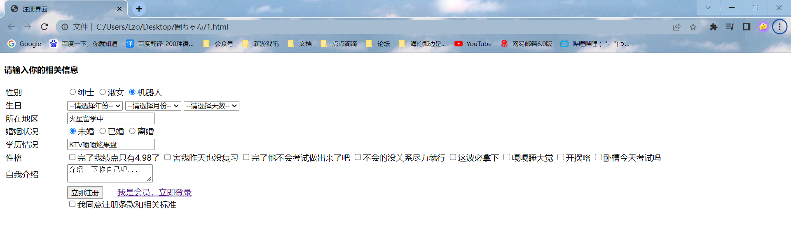
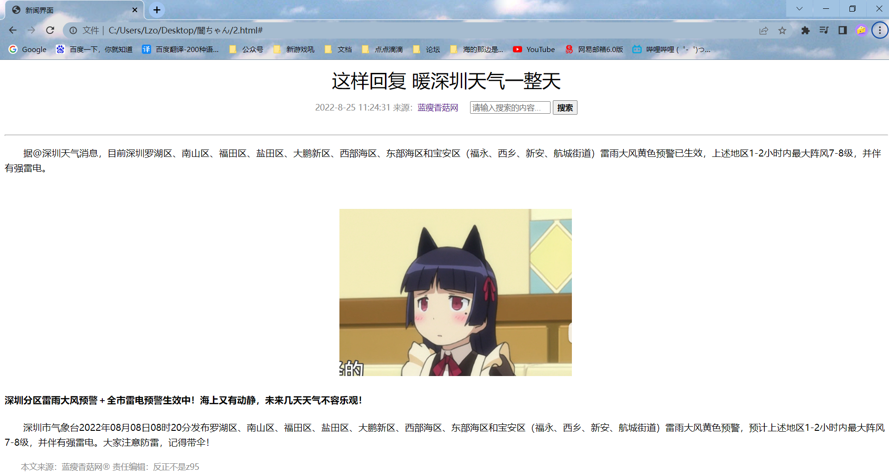

[TOC]


以下若有内部样式表的CSS代码，建议新建CSS文件，使用外部样式表

## 1、注册界面

<!DOCTYPE html>
<html lang="en">
<head>
    <meta charset="UTF-8">
    <meta http-equiv="X-UA-Compatible" content="IE=edge">
    <meta name="viewport" content="width=device-width, initial-scale=1.0">
    <title>注册界面</title>
</head>
<body>
    <h4>请输入你的相关信息</h4>
    <table>
        <tr>
            <td>性别&nbsp;&nbsp;&nbsp;&nbsp;&nbsp;&nbsp;&nbsp;&nbsp;&nbsp;&nbsp;&nbsp;&nbsp;&nbsp;</td>
            <td>
                <input type="radio" name="sex" id="Man"><label for="Man">绅士</label>
                <input type="radio" name="sex" id="Woman"><label for="Woman">淑女</label>
                <input type="radio" name="sex" id="Robert" checked="checked"><label for="Robert">机器人</label>
            </td>
        </tr>
        <tr>
            <td>生日</td>
            <td>
                <select>
                    <option selected="selected">--请选择年份--</option>
                    <option>去年</option>
                    <option>今年</option>
                </select>
                <select>
                    <option selected="selected">--请选择月份--</option>
                    <option>上个月</option>
                    <option>这个月</option>
                </select>
                <select>
                    <option selected="selected">--请选择天数--</option>
                    <option>昨天</option>
                    <option>今天</option>
                </select>
            </td>
        </tr>
        <tr>
            <td><label for="now-area">所在地区</label>&nbsp;&nbsp;&nbsp;&nbsp;&nbsp;&nbsp;&nbsp;&nbsp;&nbsp;&nbsp;&nbsp;</td>
            <td><input type="text" value="火星留学中..." id="now-area"></td>
        </tr>
        <tr>
            <td>婚姻状况</td>
            <td>
                <input type="radio" name="married-situation" id="not-married" checked="checked"><label for="not-married">未婚</label>
                <input type="radio" name="married-situation" id="already-married"><label for="already-married">已婚</label>
                <input type="radio" name="married-situation" id="divorce"><label for="divorce">离婚</label>
            </td>
        </tr>
        <tr>
            <td><label for="educational-background">学历情况</label></td>
            <td><input type="text" value="KTV嘎嘎炫果盘" id="educational-background"></td>
        </tr>
        <tr>
            <td>性格</td>
            <td>
                <input type="checkbox" name="character" id="juanwangzhidanxin"><label for="juanwangzhidanxin">完了我绩点只有4.98了</label>
                <input type="checkbox" name="character" id="zhuangnmne"><label for="zhuangnmne">害我昨天也没复习</label>
                <input type="checkbox" name="character" id="juangouzhidanxin"><label for="juangouzhidanxin">完了他不会考试做出来了吧</label>
                <input type="checkbox" name="character" id="good-boy"><label for="good-boy">不会的没关系尽力就行</label>
                <input type="checkbox" name="character" id="hape"><label for="hape">这波必拿下</label>
                <input type="checkbox" name="character" id="kuaileshuijiaowang"><label for="kuaileshuijiaowang">嘎嘎睡大觉</label>
                <input type="checkbox" name="character" id="jiwangzhidanding"><label for="jiwangzhidanding">开摆咯</label>
                <input type="checkbox" name="character" id="nb"><label for="nb">卧槽今天考试吗</label>
            </td>
        </tr>
        <tr>
            <td>自我介绍</td>
            <td><textarea id="self-introduce">介绍一下你自己吧...</textarea></td>
        </tr>
        <tr>
            <td></td>
            <td>
                <form>
                <input type="submit" value="立即注册">&nbsp;&nbsp;&nbsp;&nbsp;&nbsp;&nbsp;<a href="#">我是会员，立即登录</a><br />
                <input type="checkbox" id="register"><label for="register">我同意注册条款和相关标准</label>
                </form>
            </td>
        </tr>
    </table>
</body>
</html>
### 样例



### 源码

```html
<!DOCTYPE html>
<html lang="en">
<head>
    <meta charset="UTF-8">
    <meta http-equiv="X-UA-Compatible" content="IE=edge">
    <meta name="viewport" content="width=device-width, initial-scale=1.0">
    <title>注册界面</title>
</head>
<body>
    <h4>请输入你的相关信息</h4>
    <table>
        <tr>
            <td>性别&nbsp;&nbsp;&nbsp;&nbsp;&nbsp;&nbsp;&nbsp;&nbsp;&nbsp;&nbsp;&nbsp;&nbsp;&nbsp;</td>
            <td>
                <input type="radio" name="sex" id="Man"><label for="Man">绅士</label>
                <input type="radio" name="sex" id="Woman"><label for="Woman">淑女</label>
                <input type="radio" name="sex" id="Robert" checked="checked"><label for="Robert">机器人</label>
            </td>
        </tr>
        <tr>
            <td>生日</td>
            <td>
                <select>
                    <option selected="selected">--请选择年份--</option>
                    <option>去年</option>
                    <option>今年</option>
                </select>
                <select>
                    <option selected="selected">--请选择月份--</option>
                    <option>上个月</option>
                    <option>这个月</option>
                </select>
                <select>
                    <option selected="selected">--请选择天数--</option>
                    <option>昨天</option>
                    <option>今天</option>
                </select>
            </td>
        </tr>
        <tr>
            <td><label for="now-area">所在地区</label>&nbsp;&nbsp;&nbsp;&nbsp;&nbsp;&nbsp;&nbsp;&nbsp;&nbsp;&nbsp;&nbsp;</td>
            <td><input type="text" value="火星留学中..." id="now-area"></td>
        </tr>
        <tr>
            <td>婚姻状况</td>
            <td>
                <input type="radio" name="married-situation" id="not-married" checked="checked"><label for="not-married">未婚</label>
                <input type="radio" name="married-situation" id="already-married"><label for="already-married">已婚</label>
                <input type="radio" name="married-situation" id="divorce"><label for="divorce">离婚</label>
            </td>
        </tr>
        <tr>
            <td><label for="educational-background">学历情况</label></td>
            <td><input type="text" value="KTV嘎嘎炫果盘" id="educational-background"></td>
        </tr>
        <tr>
            <td>性格</td>
            <td>
                <input type="checkbox" name="character" id="juanwangzhidanxin"><label for="juanwangzhidanxin">完了我绩点只有4.98了</label>
                <input type="checkbox" name="character" id="zhuangnmne"><label for="zhuangnmne">害我昨天也没复习</label>
                <input type="checkbox" name="character" id="juangouzhidanxin"><label for="juangouzhidanxin">完了他不会考试做出来了吧</label>
                <input type="checkbox" name="character" id="good-boy"><label for="good-boy">不会的没关系尽力就行</label>
                <input type="checkbox" name="character" id="hape"><label for="hape">这波必拿下</label>
                <input type="checkbox" name="character" id="kuaileshuijiaowang"><label for="kuaileshuijiaowang">嘎嘎睡大觉</label>
                <input type="checkbox" name="character" id="jiwangzhidanding"><label for="jiwangzhidanding">开摆咯</label>
                <input type="checkbox" name="character" id="nb"><label for="nb">卧槽今天考试吗</label>
            </td>
        </tr>
        <tr>
            <td>自我介绍</td>
            <td><textarea id="self-introduce">介绍一下你自己吧...</textarea></td>
        </tr>
        <tr>
            <td></td>
            <td>
                <form>
                <input type="submit" value="立即注册">&nbsp;&nbsp;&nbsp;&nbsp;&nbsp;&nbsp;<a href="#">我是会员，立即登录</a><br />
                <input type="checkbox" id="register"><label for="register">我同意注册条款和相关标准</label>
                </form>
            </td>
        </tr>
    </table>
</body>
</html>
```


## 2、新闻界面

<!DOCTYPE html>
<html lang="en">
<head>
    <meta charset="UTF-8">
    <meta http-equiv="X-UA-Compatible" content="IE=edge">
    <meta name="viewport" content="width=device-width, initial-scale=1.0">
    <title>新闻界面</title>
    <link rel="stylesheet" href="news.css">
    <style>
        body {
            font: 16px/26px "Microsoft Yahei";
        }
        h1 {
            /* 修改标题文字的粗细 */
            font-weight: 500;
            text-align: center;
        }
        a {
            text-decoration: none;
        }
        .search {
            color: #666666;
            width: 130px;
        }
        .searchButton {
            color: black;
            font-weight: 550;
        }
        p {
            text-indent: 2em;
        }
        .nav {
            color: #888888;
            font-size: 14px;
            text-align: center;
        }
        .pic {
            /* 图片居中对齐 */
            text-align: center;
        }
        .footer {
            color: #888888;
            font-size: 14px;
        }
    </style>
</head>
<body>
    <h1>这样回复 暖深圳天气一整天</h1>

    <div class="nav">
        2022-8-25 11:24:31 来源：<a href="#">蓝瘦香菇网</a>
        &nbsp;&nbsp;&nbsp;&nbsp;<input type="text" value="请输入搜索的内容..." class="search"> <button class="searchButton">搜索</button>
    </div>
​    <!-- 水平线标签 -->
    <hr>

    <p>据@深圳天气消息，目前深圳罗湖区、南山区、福田区、盐田区、大鹏新区、西部海区、东部海区和宝安区（福永、西乡、新安、航城街道）雷雨大风黄色预警已生效，上述地区1-2小时内最大阵风7-8级，并伴有强雷电。</p>

​    <!-- 把图片放到p标签的作用：因为我们目前只能操作文本居中对齐，那么我们直接让img继承p，使得p居中对齐，依次让img也跟着居中对齐 -->
    <p class="pic">
        
    </p>

    <h4 class="msg"><strong>深圳分区雷雨大风预警＋全市雷电预警生效中！海上又有动静，未来几天天气不容乐观！</strong></h4>

    <p>深圳市气象台2022年08月08日08时20分发布罗湖区、南山区、福田区、盐田区、大鹏新区、西部海区、东部海区和宝安区（福永、西乡、新安、航城街道）雷雨大风黄色预警，预计上述地区1-2小时内最大阵风7-8级，并伴有强雷电。大家注意防雷，记得带伞！</p>

    <p class="footer">本文来源：蓝瘦香菇网&reg; 责任编辑：反正不是z95</p>
</body>
</html>

### 样例



### 源码

```html
<!DOCTYPE html>
<html lang="en">
<head>
    <meta charset="UTF-8">
    <meta http-equiv="X-UA-Compatible" content="IE=edge">
    <meta name="viewport" content="width=device-width, initial-scale=1.0">
    <title>新闻界面</title>
    <link rel="stylesheet" href="news.css">
    <style>
        body {
            font: 16px/26px "Microsoft Yahei";
        }
        h1 {
            /* 修改标题文字的粗细 */
            font-weight: 500;
            text-align: center;
        }
        a {
            text-decoration: none;
        }
        .search {
            color: #666666;
            width: 130px;
        }
        .searchButton {
            color: black;
            font-weight: 550;
        }
        p {
            text-indent: 2em;
        }
        .nav {
            color: #888888;
            font-size: 14px;
            text-align: center;
        }
        .pic {
            /* 图片居中对齐 */
            text-align: center;
        }
        .footer {
            color: #888888;
            font-size: 14px;
        }
    </style>
</head>
<body>
    <h1>这样回复 暖深圳天气一整天</h1>


    <div class="nav">
        2022-8-25 11:24:31 来源：<a href="#">蓝瘦香菇网</a>
        &nbsp;&nbsp;&nbsp;&nbsp;<input type="text" value="请输入搜索的内容..." class="search"> <button class="searchButton">搜索</button>
    </div>

    <!-- 水平线标签 -->

    <hr>


    <p>据@深圳天气消息，目前深圳罗湖区、南山区、福田区、盐田区、大鹏新区、西部海区、东部海区和宝安区（福永、西乡、新安、航城街道）雷雨大风黄色预警已生效，上述地区1-2小时内最大阵风7-8级，并伴有强雷电。</p>

    <!-- 把图片放到p标签的作用：因为我们目前只能操作文本居中对齐，那么我们直接让img继承p，使得p居中对齐，依次让img也跟着居中对齐 -->

    <p class="pic">
        
    </p>


    <h4 class="msg"><strong>深圳分区雷雨大风预警＋全市雷电预警生效中！海上又有动静，未来几天天气不容乐观！</strong></h4>

    <p>深圳市气象台2022年08月08日08时20分发布罗湖区、南山区、福田区、盐田区、大鹏新区、西部海区、东部海区和宝安区（福永、西乡、新安、航城街道）雷雨大风黄色预警，预计上述地区1-2小时内最大阵风7-8级，并伴有强雷电。大家注意防雷，记得带伞！</p>

    <p class="footer">本文来源：蓝瘦香菇网&reg; 责任编辑：反正不是z95</p>

</body>
</html>
```


