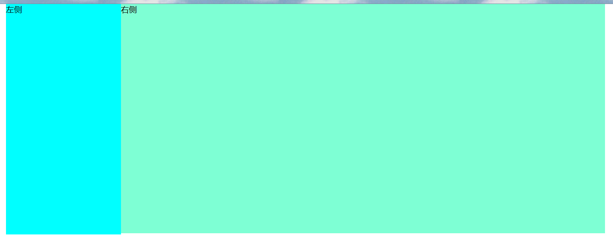
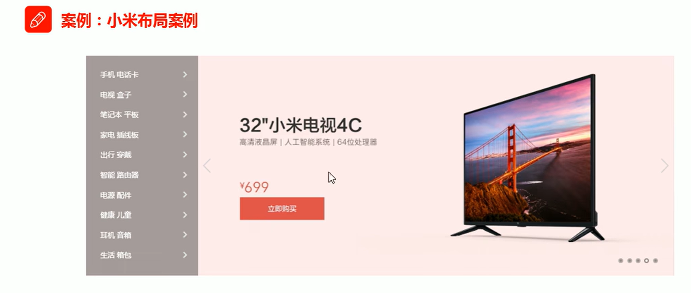
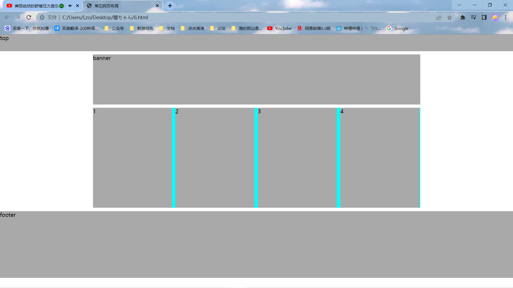

[TOC]


以下若有内部样式表的CSS代码，建议新建CSS文件，使用外部样式表

## 1、注册界面

<!DOCTYPE html>
<html lang="en">
<head>
    <meta charset="UTF-8">
    <meta http-equiv="X-UA-Compatible" content="IE=edge">
    <meta name="viewport" content="width=device-width, initial-scale=1.0">
    <title>注册界面</title>
</head>
<body>
    <h4>请输入你的相关信息</h4>
    <table>
        <tr>
            <td>性别&nbsp;&nbsp;&nbsp;&nbsp;&nbsp;&nbsp;&nbsp;&nbsp;&nbsp;&nbsp;&nbsp;&nbsp;&nbsp;</td>
            <td>
                <input type="radio" name="sex" id="Man"><label for="Man">绅士</label>
                <input type="radio" name="sex" id="Woman"><label for="Woman">淑女</label>
                <input type="radio" name="sex" id="Robert" checked="checked"><label for="Robert">机器人</label>
            </td>
        </tr>
        <tr>
            <td>生日</td>
            <td>
                <select>
                    <option selected="selected">--请选择年份--</option>
                    <option>去年</option>
                    <option>今年</option>
                </select>
                <select>
                    <option selected="selected">--请选择月份--</option>
                    <option>上个月</option>
                    <option>这个月</option>
                </select>
                <select>
                    <option selected="selected">--请选择天数--</option>
                    <option>昨天</option>
                    <option>今天</option>
                </select>
            </td>
        </tr>
        <tr>
            <td><label for="now-area">所在地区</label>&nbsp;&nbsp;&nbsp;&nbsp;&nbsp;&nbsp;&nbsp;&nbsp;&nbsp;&nbsp;&nbsp;</td>
            <td><input type="text" value="火星留学中..." id="now-area"></td>
        </tr>
        <tr>
            <td>婚姻状况</td>
            <td>
                <input type="radio" name="married-situation" id="not-married" checked="checked"><label for="not-married">未婚</label>
                <input type="radio" name="married-situation" id="already-married"><label for="already-married">已婚</label>
                <input type="radio" name="married-situation" id="divorce"><label for="divorce">离婚</label>
            </td>
        </tr>
        <tr>
            <td><label for="educational-background">学历情况</label></td>
            <td><input type="text" value="KTV嘎嘎炫果盘" id="educational-background"></td>
        </tr>
        <tr>
            <td>性格</td>
            <td>
                <input type="checkbox" name="character" id="juanwangzhidanxin"><label for="juanwangzhidanxin">完了我绩点只有4.98了</label>
                <input type="checkbox" name="character" id="zhuangnmne"><label for="zhuangnmne">害我昨天也没复习</label>
                <input type="checkbox" name="character" id="juangouzhidanxin"><label for="juangouzhidanxin">完了他不会考试做出来了吧</label>
                <input type="checkbox" name="character" id="good-boy"><label for="good-boy">不会的没关系尽力就行</label>
                <input type="checkbox" name="character" id="hape"><label for="hape">这波必拿下</label>
                <input type="checkbox" name="character" id="kuaileshuijiaowang"><label for="kuaileshuijiaowang">嘎嘎睡大觉</label>
                <input type="checkbox" name="character" id="jiwangzhidanding"><label for="jiwangzhidanding">开摆咯</label>
                <input type="checkbox" name="character" id="nb"><label for="nb">卧槽今天考试吗</label>
            </td>
        </tr>
        <tr>
            <td>自我介绍</td>
            <td><textarea id="self-introduce">介绍一下你自己吧...</textarea></td>
        </tr>
        <tr>
            <td></td>
            <td>
                <form>
                <input type="submit" value="立即注册">&nbsp;&nbsp;&nbsp;&nbsp;&nbsp;&nbsp;<a href="#">我是会员，立即登录</a><br />
                <input type="checkbox" id="register"><label for="register">我同意注册条款和相关标准</label>
                </form>
            </td>
        </tr>
    </table>
</body>
</html>
### 样例


### 源码

```html
<!DOCTYPE html>
<html lang="en">
<head>
    <meta charset="UTF-8">
    <meta http-equiv="X-UA-Compatible" content="IE=edge">
    <meta name="viewport" content="width=device-width, initial-scale=1.0">
    <title>注册界面</title>
</head>
<body>
    <h4>请输入你的相关信息</h4>
    <table>
        <tr>
            <td>性别&nbsp;&nbsp;&nbsp;&nbsp;&nbsp;&nbsp;&nbsp;&nbsp;&nbsp;&nbsp;&nbsp;&nbsp;&nbsp;</td>
            <td>
                <input type="radio" name="sex" id="Man"><label for="Man">绅士</label>
                <input type="radio" name="sex" id="Woman"><label for="Woman">淑女</label>
                <input type="radio" name="sex" id="Robert" checked="checked"><label for="Robert">机器人</label>
            </td>
        </tr>
        <tr>
            <td>生日</td>
            <td>
                <select>
                    <option selected="selected">--请选择年份--</option>
                    <option>去年</option>
                    <option>今年</option>
                </select>
                <select>
                    <option selected="selected">--请选择月份--</option>
                    <option>上个月</option>
                    <option>这个月</option>
                </select>
                <select>
                    <option selected="selected">--请选择天数--</option>
                    <option>昨天</option>
                    <option>今天</option>
                </select>
            </td>
        </tr>
        <tr>
            <td><label for="now-area">所在地区</label>&nbsp;&nbsp;&nbsp;&nbsp;&nbsp;&nbsp;&nbsp;&nbsp;&nbsp;&nbsp;&nbsp;</td>
            <td><input type="text" value="火星留学中..." id="now-area"></td>
        </tr>
        <tr>
            <td>婚姻状况</td>
            <td>
                <input type="radio" name="married-situation" id="not-married" checked="checked"><label for="not-married">未婚</label>
                <input type="radio" name="married-situation" id="already-married"><label for="already-married">已婚</label>
                <input type="radio" name="married-situation" id="divorce"><label for="divorce">离婚</label>
            </td>
        </tr>
        <tr>
            <td><label for="educational-background">学历情况</label></td>
            <td><input type="text" value="KTV嘎嘎炫果盘" id="educational-background"></td>
        </tr>
        <tr>
            <td>性格</td>
            <td>
                <input type="checkbox" name="character" id="juanwangzhidanxin"><label for="juanwangzhidanxin">完了我绩点只有4.98了</label>
                <input type="checkbox" name="character" id="zhuangnmne"><label for="zhuangnmne">害我昨天也没复习</label>
                <input type="checkbox" name="character" id="juangouzhidanxin"><label for="juangouzhidanxin">完了他不会考试做出来了吧</label>
                <input type="checkbox" name="character" id="good-boy"><label for="good-boy">不会的没关系尽力就行</label>
                <input type="checkbox" name="character" id="hape"><label for="hape">这波必拿下</label>
                <input type="checkbox" name="character" id="kuaileshuijiaowang"><label for="kuaileshuijiaowang">嘎嘎睡大觉</label>
                <input type="checkbox" name="character" id="jiwangzhidanding"><label for="jiwangzhidanding">开摆咯</label>
                <input type="checkbox" name="character" id="nb"><label for="nb">卧槽今天考试吗</label>
            </td>
        </tr>
        <tr>
            <td>自我介绍</td>
            <td><textarea id="self-introduce">介绍一下你自己吧...</textarea></td>
        </tr>
        <tr>
            <td></td>
            <td>
                <form>
                <input type="submit" value="立即注册">&nbsp;&nbsp;&nbsp;&nbsp;&nbsp;&nbsp;<a href="#">我是会员，立即登录</a><br />
                <input type="checkbox" id="register"><label for="register">我同意注册条款和相关标准</label>
                </form>
            </td>
        </tr>
    </table>
</body>
</html>
```


## 2、新闻界面

<!DOCTYPE html>
<html lang="en">
<head>
    <meta charset="UTF-8">
    <meta http-equiv="X-UA-Compatible" content="IE=edge">
    <meta name="viewport" content="width=device-width, initial-scale=1.0">
    <title>新闻界面</title>
    <link rel="stylesheet" href="news.css">
    <style>
        body {
            font: 16px/26px "Microsoft Yahei";
        }
        h1 {
            /* 修改标题文字的粗细 */
            font-weight: 500;
            text-align: center;
        }
        a {
            text-decoration: none;
        }
        .search {
            color: #666666;
            width: 130px;
        }
        .searchButton {
            color: black;
            font-weight: 550;
        }
        p {
            text-indent: 2em;
        }
        .nav {
            color: #888888;
            font-size: 14px;
            text-align: center;
        }
        .pic {
            /* 图片居中对齐 */
            text-align: center;
        }
        .footer {
            color: #888888;
            font-size: 14px;
        }
    </style>
</head>
<body>
    <h1>这样回复 暖深圳天气一整天</h1>

    <div class="nav">
        2022-8-25 11:24:31 来源：<a href="#">蓝瘦香菇网</a>
        &nbsp;&nbsp;&nbsp;&nbsp;<input type="text" value="请输入搜索的内容..." class="search"> <button class="searchButton">搜索</button>
    </div>
​    <!-- 水平线标签 -->
​    <hr>

    <p>据@深圳天气消息，目前深圳罗湖区、南山区、福田区、盐田区、大鹏新区、西部海区、东部海区和宝安区（福永、西乡、新安、航城街道）雷雨大风黄色预警已生效，上述地区1-2小时内最大阵风7-8级，并伴有强雷电。</p>

​    <!-- 把图片放到p标签的作用：因为我们目前只能操作文本居中对齐，那么我们直接让img继承p，使得p居中对齐，依次让img也跟着居中对齐 -->
​    <p class="pic">
​        
​    </p>

    <h4 class="msg"><strong>深圳分区雷雨大风预警＋全市雷电预警生效中！海上又有动静，未来几天天气不容乐观！</strong></h4>
    
    <p>深圳市气象台2022年08月08日08时20分发布罗湖区、南山区、福田区、盐田区、大鹏新区、西部海区、东部海区和宝安区（福永、西乡、新安、航城街道）雷雨大风黄色预警，预计上述地区1-2小时内最大阵风7-8级，并伴有强雷电。大家注意防雷，记得带伞！</p>
    
    <p class="footer">本文来源：蓝瘦香菇网&reg; 责任编辑：反正不是z95</p>
</body>
</html>

### 样例


### 源码

```html
<!DOCTYPE html>
<html lang="en">
<head>
    <meta charset="UTF-8">
    <meta http-equiv="X-UA-Compatible" content="IE=edge">
    <meta name="viewport" content="width=device-width, initial-scale=1.0">
    <title>新闻界面</title>
    <link rel="stylesheet" href="news.css">
    <style>
        body {
            font: 16px/26px "Microsoft Yahei";
        }
        h1 {
            /* 修改标题文字的粗细 */
            font-weight: 500;
            text-align: center;
        }
        a {
            text-decoration: none;
        }
        .search {
            color: #666666;
            width: 130px;
        }
        .searchButton {
            color: black;
            font-weight: 550;
        }
        p {
            text-indent: 2em;
        }
        .nav {
            color: #888888;
            font-size: 14px;
            text-align: center;
        }
        .pic {
            /* 图片居中对齐 */
            text-align: center;
        }
        .footer {
            color: #888888;
            font-size: 14px;
        }
    </style>
</head>
<body>
    <h1>这样回复 暖深圳天气一整天</h1>


    <div class="nav">
        2022-8-25 11:24:31 来源：<a href="#">蓝瘦香菇网</a>
        &nbsp;&nbsp;&nbsp;&nbsp;<input type="text" value="请输入搜索的内容..." class="search"> <button class="searchButton">搜索</button>
    </div>

    <!-- 水平线标签 -->

    <hr>


    <p>据@深圳天气消息，目前深圳罗湖区、南山区、福田区、盐田区、大鹏新区、西部海区、东部海区和宝安区（福永、西乡、新安、航城街道）雷雨大风黄色预警已生效，上述地区1-2小时内最大阵风7-8级，并伴有强雷电。</p>

    <!-- 把图片放到p标签的作用：因为我们目前只能操作文本居中对齐，那么我们直接让img继承p，使得p居中对齐，依次让img也跟着居中对齐 -->

    <p class="pic">
        
    </p>


    <h4 class="msg"><strong>深圳分区雷雨大风预警＋全市雷电预警生效中！海上又有动静，未来几天天气不容乐观！</strong></h4>

    <p>深圳市气象台2022年08月08日08时20分发布罗湖区、南山区、福田区、盐田区、大鹏新区、西部海区、东部海区和宝安区（福永、西乡、新安、航城街道）雷雨大风黄色预警，预计上述地区1-2小时内最大阵风7-8级，并伴有强雷电。大家注意防雷，记得带伞！</p>

    <p class="footer">本文来源：蓝瘦香菇网&reg; 责任编辑：反正不是z95</p>

</body>
</html>
```


## 3、花里胡哨导航栏

亮点就是，

链接的范围扩大了

放到不同的链接，背景图和颜色都会变

### 样例

 

 

 

 

### 源码

```html
<!DOCTYPE html>
<html lang="en">

<head>
    <meta charset="UTF-8">
    <meta http-equiv="X-UA-Compatible" content="IE=edge">
    <meta name="viewport" content="width=device-width, initial-scale=1.0">
    <title>导航</title>
    <style>
        .nav a {
            width: 200px;
            height: 80px;
            font-size: 17px;
            font-weight: 400;
            color: black;
            text-align: center;
            line-height: 80px;
            display: inline-block;
            text-decoration: none;
        }

        .nav .bg1 {
            background-image: url(img/bg1.jpg);
            background-repeat: repeat-x;
            background-position: 20px center;
        }

        .nav .bg2 {
            background-image: url(img/bg2.jpg);
            background-repeat: no-repeat;
            /* background-position: 20px center; */
        }

        .nav .bg3 {
            background-image: url(img/bg3.jpg);
            background-repeat: repeat-x;
            background-position: 20px center;
        }

        .nav .bg1:hover {
            color: aliceblue;
            background-image: url(img/bg1x.jpg);
            background-repeat: no-repeat;
            background-position: center;
        }

        .nav .bg2:hover {
            color: rgb(52, 169, 97);
            background-image: url(img/bg2x.png);
            background-repeat: no-repeat;
            background-position: center;
        }

        .nav .bg3:hover {
            color: deepskyblue;
            background-image: url(img/bg3x.png);
            background-repeat: no-repeat;
            background-position: center -250px;
        }
    </style>

</head>

<body>
    <div class="nav">
        <a href="#" class="bg1">导航</a>
        <a href="#" class="bg2">导航</a>
        <a href="#" class="bg3">导航</a>
    </div>
</body>

</html>
```


## 4、平平无奇导航栏

### 样例

亮点就是我放在了长的标签，背景变色也长一点，放在短的标签，背景变色也短一点

而实现这个效果就靠了**padding的设置会增大盒子的宽高的特性**，下面我设置了左右上下边距为固定的，里面的字体长度不一致，会使得盒子也被朝着左右撑开，所以鼠标放上去，变化的背景颜色也会大一点


 

 

### 源码

```html
<!DOCTYPE html>
<html lang="en">

<head>
    <meta charset="UTF-8">
    <meta http-equiv="X-UA-Compatible" content="IE=edge">
    <meta name="viewport" content="width=device-width, initial-scale=1.0">
    <title>新浪导航</title>
    <style>
        .nav {
            height: 41px;
            border-top: 3px solid #00aee8;
            border-bottom: 1px solid #edeef0;
            background-color: #fcfcfc;
            text-align: left;
            line-height: 41px;

        }

        .nav a {
            /* 需要转换为行内块元素才有高啊 */
            display: inline-block;
            height: 41px;
            text-decoration: none;
            color: #4c4c4c;
            font-size: 400;
            font-weight: 400;
            font-family: "Mcirofost Yahei";
            padding: 0px 20px;
        }

        .nav a:hover {
            color: #00aee8;
            background-color: #edeef0;
        }
    </style>
</head>

<body>
    <div class="nav">
        <a href="#">新浪导航</a>
        <a href="#">手机新浪网</a>
        <a href="#">移动客户端</a>
        <a href="#">微博</a>
        <a href="#">时事</a>
    </div>
</body>

</html>
```


## 5、好康的物品模块

### 样例


### 源码

```html
<!DOCTYPE html>
<html lang="zh-CN">

<head>
    <meta charset="UTF-8">
    <meta http-equiv="X-UA-Compatible" content="IE=edge">
    <meta name="viewport" content="width=device-width, initial-scale=1.0">
    <title>物品模块</title>
    <style>
        * {
            /* 设置了浏览器自带的边距为0 margin: 0; */
            padding: 0;
        }

        body {
            background-color: #f5f5f5;
        }

        .box {
            width: 298px;
            height: 490px;
            background-color: #fff;
            /* 块级盒子水平居中 */
            margin: 100px auto;
        }

        .box img {
            height: 300px;
            /* 宽度和父亲一样宽，就不会出现遗漏了 */
            width: 100%;
        }

        .review {
            font-size: 20px;
            height: 60px;
            /* 由于p没有width属性，所以不会撑开盒子，不需要修改盒子的宽度 */
            padding: 0 18px;
            /* 由于已经设置了高度，再用内边距设置高度，可能会撑开设置，所以这里使用了外边距 */
            margin-top: 20px;
        }

        .praise {
            font-size: 14px;
            color: #b0b0b0;
            padding: 0 5px 0 180px;
        }

        .info {
            font-size: 13.5px;
            font-family: "Microsoft Yahei";
            margin-top: 20px;
            padding: 0 20px;
        }

        .info a {
            text-decoration: none;
            color: #333;
        }

        .info span {
            color: #0c84f5;
        }

        .info em {
            font-style: normal;
            color: #ebe4e0;
            margin: 0 4px 0 45px;
        }

        .info a:hover {
            color: #00aee8;
        }
    </style>
</head>

<body>
    <div class="box">
        
        <p class="review" style="font-family: 楷体;">来自一场天空的旅行，我在太阳升起的那一端等你。</p>
        <div class="praise">—— 追风的小孩</div>
        <div class="info">
            <a href="#">欢迎订购云梦城一日游...</a>
            <em>|</em>
            <span>已售1张</span>
        </div>
    </div>
</body>

</html>
```


## 6、疯狂星期四商品快报

### 样例


### 源码

```html
<!DOCTYPE html>
<html lang="zh-CN">

<head>
    <meta charset="UTF-8">
    <meta http-equiv="X-UA-Compatible" content="IE=edge">
    <meta name="viewport" content="width=device-width, initial-scale=1.0">
    <title>商品快报</title>
    <style>
        * {
            margin: 0;
            padding: 0;
        }

        .box {
            width: 248px;
            height: 163px;
            border: 1px solid #ccc;
            margin: 100px auto;
            /* 小阴影，整挺好 */
            box-shadow: 4px 5px 4px -4px #b4b6b3;
        }

        .box h3 {
            height: 32px;
            border-bottom: 1px dotted #ccc;
            font-size: 14px;
            font-weight: 400;
            line-height: 32px;
            padding-left: 15px;
        }

        /* 统一写法，实际开发经常去掉列表的特殊标志 */
        li {
            list-style: none;
        }

        .box ul li {
            height: 23px;
            line-height: 23px;
            padding-left: 16px;
        }

        .box ul {
            margin-top: 5px;
        }

        .box ul li a {
            display: inline-block;
            width: 100%;
            height: auto;
            font-size: 12px;
            color: #303234;
            text-decoration: none;
        }

        .box ul li a:hover {
            color: #e80d27;
        }
    </style>
</head>

<body>
    <div class="box">
        <h3>疯狂星期四</h3>
        <ul>
            <li><a href="#">【特惠】七夕特刊 | 黄金小酥肉两份 9.9</a></li>
            <li><a href="#">【特惠】夏日上新!Kitty套餐39.9元起!</a></li>
            <li><a href="#">【特惠】外卖 | 天天1元八月回归啦!</a></li>
            <li><a href="#">【特惠】新品脆皮鸡加入19元OK三件套!</a></li>
            <li><a href="#">【特惠】油柑茶买1送1,标签栏七夕特惠!</a></li>
        </ul>
    </div>
</body>

</html>
```


## 7、商品栏目模块

利用了浮动点的模块

### 左导航右图片

> **效果：**
>
> 
>
> 
>
> 
>
> **示例：**
>
> ```html
> <!DOCTYPE html>
> <html lang="zh-CN">
> 
> <head>
>     <meta charset="UTF-8">
>     <meta http-equiv="X-UA-Compatible" content="IE=edge">
>     <meta name="viewport" content="width=device-width, initial-scale=1.0">
>     <title>Document</title>
>     <style>
>         * {
>             margin: 0;
>             padding: 0;
>         }
> 
>         .box {
>             width: 1200px;
>             height: 460px;
>             background-color: antiquewhite;
>             margin: 0 auto;
>         }
> 
>         .left {
>             width: 230px;
>             height: 462px;
>             background-color: aqua;
>             float: left;
>         }
> 
>         .right {
>             width: 970px;
>             height: 460px;
>             background-color: aquamarine;
>             float: left;
>         }
>     </style>
> </head>
> 
> <body>
>     <div class="box">
>         <div class="left">左侧</div>
>         <div class="right">右侧</div>
>     </div>
> </body>
> 
> </html>
> ```

### 横向排列

> **效果：**
>
> 
>
> 
>
> 
>
> **源码：**
>
> ```html
> <!DOCTYPE html>
> <html lang="zh-CN">
> 
> <head>
>     <meta charset="UTF-8">
>     <meta http-equiv="X-UA-Compatible" content="IE=edge">
>     <meta name="viewport" content="width=device-width, initial-scale=1.0">
>     <title>Document</title>
>     <style>
>         * {
>             margin: 0;
>             padding: 0;
>         }
> 
>         .box {
>             width: 1226px;
>             height: 285px;
>             background-color: skyblue;
>             margin: 0 auto;
>         }
> 
>         li {
>             list-style: none;
>         }
> 
>         .box li {
>             width: 296px;
>             height: 285px;
>             background-color: aqua;
>             margin-right: 14px;
>             float: left;
>         }
> 
>         /* 设置右外边距为0，元素就不会掉下来了 */
>         /* 并且注意权重的问题 */
>         .box .last {
>             margin-right: 0;
>         }
>     </style>
> </head>
> 
> <body>
>     <ul class="box">
>         <li>1</li>
>         <li>1</li>
>         <li>1</li>
>         <li class="last">1</li>
>     </ul>
> </body>
> 
> </html>
> ```


### 左大图右系列小图

> **效果：**
>
> 
>
> 
>
> 
>
> **源码：**
>
> ```html
> <!DOCTYPE html>
> <html lang="zh-CN">
> 
> <head>
>     <meta charset="UTF-8">
>     <meta http-equiv="X-UA-Compatible" content="IE=edge">
>     <meta name="viewport" content="width=device-width, initial-scale=1.0">
>     <title>Document</title>
>     <style>
>         * {
>             margin: 0;
>             padding: 0;
>         }
> 
>         .box {
>             width: 1226px;
>             height: 615px;
>             background-color: antiquewhite;
>             margin: 0 auto;
>         }
> 
>         .left {
>             float: left;
>             width: 234px;
>             height: 615px;
>             background-color: skyblue;
>         }
> 
>         .right {
>             float: left;
>             width: 992px;
>             height: 615px;
>             background-color: #519aba;
>         }
> 
>         /* 子代选择器，这么设置是为了防止影响到div盒子里面的div */
>         .right>div {
>             width: 234px;
>             height: 300px;
>             background-color: #b6e76fff;
>             float: left;
>             /* 这里的左外边距就是因为我盒子都往右边挤压，刚好可以填充右边多的部分 */
>             margin-left: 14px;
>             margin-bottom: 14px;
>         }
>     </style>
> </head>
> 
> <body>
>     <div class="box">
>         <div class="left">左</div>
>         <div class="right">
>             <div>1</div>
>             <div>2</div>
>             <div>3</div>
>             <div>4</div>
>             <div>5</div>
>             <div>6</div>
>             <div>7</div>
>             <div>8</div>
>         </div>
>     </div>
> </body>
> 
> </html>
> ```
>
> 


### 常用布局

> 效果：
>
> 
>
> 
>
> 
>
> **源码**
>
> ```html
> <!DOCTYPE html>
> <html lang="zh-CN">
> 
> <head>
>     <meta charset="UTF-8">
>     <meta http-equiv="X-UA-Compatible" content="IE=edge">
>     <meta name="viewport" content="width=device-width, initial-scale=1.0">
>     <title>常见网页布局</title>
>     <style>
>         * {
>             margin: 0;
>             padding: 0;
>         }
> 
>         .top {
>             height: 50px;
>             background-color: darkgray;
>         }
> 
>         .banner {
>             width: 980px;
>             height: 150px;
>             background-color: darkgray;
>             margin: 10px auto;
>         }
> 
>         li {
>             list-style: none;
>         }
> 
>         .box {
>             width: 980px;
>             margin: 0 auto;
>             height: 300px;
>             background-color: aqua;
>         }
> 
>         .box li {
>             float: left;
>             width: 237px;
>             height: 300px;
>             background-color: darkgrey;
>             margin-right: 10px;
>         }
> 
>         .box .last {
>             margin-right: 0;
>         }
> 
>         /* 和top一样，不需要指定宽度和浏览器一样宽就可以了 */
>         .footer {
>             height: 200px;
>             background-color: darkgray;
>             margin-top: 10px;
>         }
>     </style>
> </head>
> 
> <body>
>     <div class="top">top</div>
>     <div class="banner">banner</div>
>     <div class="box">
>         <ul>
>             <li>1</li>
>             <li>2</li>
>             <li>3</li>
>             <li class="last">4</li>
>         </ul>
>     </div>
>     <div class="footer">footer</div>
> </body>
> 
> </html>
> ```


