[TOC]


# 一、基础导读

## 1、编程语言

.assets/image-20220829162056815.png)	.assets/image-20220829162109974.png)

.assets/快乐前端.gif)

​	


## 2、计算机基础

.assets/image-20220829162434343.png)

.assets/image-20220829162541287.png)

.assets/image-20220829162616090.png)

​	.assets/image-20220829162730091.png)


## 3.初识JavaScript

*JavaScript是运行在客户端的脚本语言*

.assets/image-20220829162943811.png)

.assets/image-20220829163123493.png)

.assets/image-20220829163215551.png) 


这个挺有意思的，JS是高级语言，故需要进行解释，而正因为它的解释方式，所以才叫做脚本语言

它的解释方式，JS专属引擎(如Chrone的V8)是逐行进行翻译并去执行的，就像Java的事务一样，写一行执行一行

.assets/image-20220829163607396.png)


**JS组成**

.assets/image-20220829163847148.png)


ECMAScript规定了JS的基础语法和核心的知识，其他啥扩展玩意(JScript)最多扩展一下，但是还是得遵守规矩

.assets/image-20220829163935764.png)


DOM的操作是针对界面上的元素的

就像那个选择器，举个例子鼠标放到"手机"，出现"手机的下拉界面"，那么就需要你鼠标放上去，浏览器选择到"手机"元素，然后再下拉出其详细信息

.assets/image-20220829164141014.png)


BOM的操作是针对浏览器的

不知道那个alert算不算

.assets/image-20220829164403495.png)


书写方式：三种，行内式，嵌入式，外部式

> 行内式
>
> .assets/image-20220829164652408.png)

> .assets/image-20220829164711218.png) 嵌入式

> 外部式
>
> <script>这里什么都不能放哦</script>
>
> .assets/image-20220829164839754.png)


**输入输出语句**

.assets/image-20220829165324718.png)


## 4.解释性语言和编译型语言

编程语言——>翻译器——>机器语言

而翻译有两个方式（仅仅是翻译的时间点不同）：

第一个，编译，也就是编译器先把高级语言全部进行编译，再生成中间代码文件，先编译后运行

第二个，解释就是直接运行，遇到了代码就进行解释，解释了就立即运行（此时的编译器应该叫做解释器）

.assets/image-20220830171135998.png)

.assets/image-20220830171229267.png)


------


# 二、基础语法(ECMAScript)

## 1.变量

.assets/image-20220829165553430.png)

.assets/image-20220829165708955.png)

.assets/image-20220829180225219.png)


### 1.1、声明变量

.assets/image-20220829165741310.png)


### 1.2、接受变量值

.assets/image-20220829170021779.png) 


### 1.3、声明变量特殊情况

| 情况                    | 结果                         |
| ----------------------- | ---------------------------- |
| 声明不赋值              | 会出现 undefined，未定义(值) |
| 不声明不赋值            | console报错                  |
| 不必用var声明，使用变量 | JS是允许这种语法的，哈人     |


.assets/image-20220829170228364.png)


### 1.4、命名规范

.assets/image-20220829170712541.png)


## 2、数据类型

.assets/image-20220829230205801.png)

.assets/image-20220829230335554.png)


### 2.1、基本数据类型

.assets/image-20220829230515771.png)


#### 2.1.1、数字型 Number

.assets/image-20220829231139038.png)

.assets/image-20220829231105364.png)


> **得到某个Number的最大值**
>
> .assets/image-20220829231228210.png)


##### ①三个特殊值

.assets/image-20220829231403362.png)


##### ②isNaN()判断是否数字

.assets/image-20220829231534216.png)


#### 2.1.2、字符串 String


.assets/image-20220829231743139.png)

*补充一下 \b是一个空格(blank)的意思*

.assets/image-20220829231814609.png)


##### ①获取字符串长度

.assets/image-20220829232045257.png)

补充一下，字符串 + 任何数据类型(Boolean、Number)都会同化为字符类型

.assets/image-20220829232239207.png)


##### ②字符串常量池(不可变性)

也是因此，我们`不建议大量使用字符串拼接(+)`

.assets/image-20220905171255961.png)

> 示例：
>
> .assets/image-20220905171321232.png) str从andy变为red
>
> .assets/image-20220905171340431.png) 其实底层是str从指向andy到指向red了


#### 2.1.3、Boolean类型

Boolean类型是可以和Number类型加减的，true的值为1，false为0，看下面

.assets/image-20220829232626366.png)


#### 2.1.4、undefined/null

| undefined与null的一些区别 | 与字符串相加（例如：+ 'aha'） | 与数字相加（例如：+ 1） |
| ------------------------- | ----------------------------- | ----------------------- |
| undefined                 | 变为 undefinedaha             | 得到 NaN                |
| null                      | 变为 nullaha                  | 得到 1(怪哎)            |

.assets/image-20220829232919255.png)

.assets/image-20220829232940328.png)


### 2.2、获取数据类型typeof

.assets/image-20220829233429222.png)


### 2.3、控制台颜色区分数据类型

.assets/image-20220830164847238.png)


### 2.4、字面量

1，一眼Number型，所以它是数字字面量

以此类推

'九敏'，鉴定为String，所以它是字符串字面量

后面还有数组字面量

.assets/image-20220830165207113.png) 


### 2.5、数据类型转换

#### 2.5.1、转换为字符串型

单独解释一下第三个

Number a = 1;

String b = a + '';//漂亮啊加一个空就变为字符串了

.assets/image-20220830165537218.png)


#### 2.5.2、转化为数字型(重要)

强调一下

parseInt('3.99') -> 4

parseFloat('3.99') -> 3.99

parseInt('120px') -> 120

parseInt('abc') -> NaN


还有个隐式转换，挺好用的，对着其他数据类型(如'11') + - / 使得'11'强行变为(Number)11

.assets/image-20220830170156596.png)

.assets/image-20220830170145543.png)

.assets/image-20220830170402432.png) 


#### 2.5.3、转换为布尔型

特殊之处，除了''、0、NaN、null、undefined转换后都是false，其他的值强行转换后都是true

.assets/image-20220830170832014.png)


## 3、运算符


### 3.1、==和===

这里讲一下怪事

```javascript
//true，原因就是'1'会隐式自动转型，这玩意真，没意思
console.log(1 == '1');

//false，三个等号除了值相等，数据类型必须也相等
console.log(1 === '1');
```

.assets/image-20220830172223415.png)


### 3.2、短路与和短路或

**值**或者**表达式**参与逻辑运算


这玩意谁以后这么给我写，我能气死

```javascript
    //短路与，如果表达式1或值1为真，那么看第二个表达式或值2，如果也为真，继续往后看，直到看到出现了假，如果都是真值，那就把最后一个值送出去
    //如果表达式1或值1为假，那么就返回第一个表达式或者值
    //重点理解第一个和记住第三个
    //诀窍，怎么着都得返回一个假值，哪怕陷害别人
    console.log(111 && 222 && 333);// 333
    conosole.log(0 && 111); // 0
    //有几个特殊的假值 0、''、null、undefined、NaN
    console.lgo('' && 111); // ''

//短路或，如果表达式1或者值1为真，那么看第二个表达式或值2，如果也为假，继续往后看，直到看到出现了真，如果都是假值，那就把最后一个值送出去
//如果第一个表达式或者值1值为假，那么就返回第二个表达式或者值
//重点理解第三个
//怎么着都得返回一个真值，哪怕陷害别人
conosle.log(123 || 111); // 123
console.log(123 || 111 || 222)// 123
conosle.log(0 || 0 || 444); //444
```

.assets/image-20220830172832594.png)


### 3.3、运算符优先级

记！ 记！ 记！

.assets/image-20220830174706933.png)


## 4、调试

.assets/image-20220831191927623.png)


## 5、数组

特殊之处在于，这玩意数组不限制数据类型的，数值类型和字符串和布尔类型都可以存到里面去

.assets/image-20220831203539663.png)

.assets/image-20220831203551707.png)

### 5.1、修改数组长度

| 两个方法                                                     |
| ------------------------------------------------------------ |
| 第一个，简单粗暴，var arr = [1]; arr.length = 2; 没错直接设置length就扩容了，而且补充那个元素是undefined，即arr[2] = undefined |
| 第二个，哈人，var arr = [1]; arr[2] = 1; 数组就实现扩容了，arr[2]就代表1了 |

.assets/image-20220831204020619.png)

.assets/image-20220831204246192.png)


### 5.2、动态筛选数组(妙哉)

```javascript
var arr = [1, 2, 3, 4, 5];
var newArr = [];

for (let i; i < arr; i++) {
    if (arr[i] > 2) {
        //整挺好的，动态地扩展数组长度
        //以后使用这种方法实现存储目标数组筛选的值了
        newArr[newArr.length] = arr[i]
    }
}
```


### 5.3、翻转数组

```javascript
var arr = ['1', '2', '3', '4', '5', true];//true实际值为1
var length = arr.length;
var times = (length - 1) / 2;//这一步很妙，因为长度为4和5的数组经历的交换次数都是2,而6,7经历地交换次数都是3

//加法交换位置
for (let i = 0; i < times; i++) {
    arr[i] = arr[i] + arr[length - i - 1];
    arr[length - i - 1] = arr[i] - arr[length - i - 1];
    arr[i] = arr[i] - arr[length - i - 1];
}

//利用异或交换位置
//这玩意优势就是可以交换各种数据类型
for (let i = 0; i < times; i++) {
    arr[i] = arr[i] ^ arr[length - i - 1];
    arr[length - i - 1] = arr[i] ^ arr[length - i - 1];
    arr[i] = arr[i] ^ arr[length - i - 1];
}
console.log(arr);
```

> **冒泡排序**
>
> ```JavaScript
> var arr = [4, 6, 1, 17, 12, 0];
> var length = arr.length;
> 
> for (let i = 0; i < length - 1; i++) {
>     for (let j = 0; j < length - i - 1; j++) {
>         if (arr[j] > arr[j + 1]) {
>             arr[j] = arr[j] ^ arr[j + 1];
>             arr[j + 1] = arr[j] ^ arr[j + 1];
>             arr[j] = arr[j] ^ arr[j + 1];
>         }
>     }
> }
> console.log(arr);
> ```


## 6、函数

### 6.1、声明方式

```javascript
	函数使用分为两步，声明函数 和 调用函数
第一种，
    1.声明函数
	function 函数名() {
	    函数体
	}
	function haha(){
	    console.log(111);
	}
	(1) function 声明函数的关键字，开头小写，驼峰命名法
	2.调用函数
	haha();//千万记得加小括号啊集美      

第二种，
	 2.函数表达式(匿名函数)
     var 变量名 = function () { 函数体 };
     var fun = function () {
         console.log(111);
     }
     fun();//调用方法
     但是有两点需要---注意---
     1. fun是变量名，不是函数名，函数是匿名的
     2. 函数表达式声明方式跟声明变量差不多，只不过声明变量里面存的是 值， 但是函数表达式声明，里面存的是 函数
```


### 6.2、JS函数特殊之处

> **JS函数的特殊之处**
>
> ①**并未限制返回值的类型**
>
> 如下，甚至可以返回一个这样的数组
>
> .assets/image-20220901111324758.png)
>
> 
>
> ②**如果没有返回值，调用函数，返回值是undefined**
>
> JS的特殊之处在于函数一定是有返回值的，如果你不写return，它默认返回undefined
>
> .assets/image-20220901111658740.png)
>
> 
>
> ③**函数声明相关的问题**
>
> 出现下面两种差异的原因就是JS的预解析，下面的目录有
>
> ***调用函数可以在声明之前***
>
> 而在函数表达式声明时又不一样了
>
> .assets/image-20220901140515711.png) 
>
> ***匿名函数时不能先调用后声明***
>
> 下面就会报错
>
> .assets/image-20220901140851279.png) 


### 6.3、arguments的使用

arguments是个特殊的玩意，每个函数内置了这样一个玩意，但是只有函数有哦

以数组形式存储输入过来的参数，但是是伪数组哦，因为没有一些数组的方法，pop()、push()

.assets/image-20220901112353628.png)


> **argumens的妙用**
>
> 请看下面
>
> 求最大值
> 输入的参数可以不限制长度
> getMax(1, 2, 3);getMax(1, 5, 1, 7);getMax(7, 1, 51, 123, 424);
>
> 反正输入的参数都会按照先后存到arguments数组里面去
> 直接对着arguments数组求最大值，并且不需要限制形参的长度啊什么的，岂不妙哉
>
> .assets/image-20220901112904269.png) 


## 7、作用域

### 1.全局/局部

.assets/image-20220901115831459.png)


### 2、变量作用域

特别说明：

**①没有声明直接赋值**的变量也属于全局变量

②**局部作用域只针对函数来说**，for、while等是**没有**局部作用域(块级作用域)这个概念的，JS只有在ES6之后才有块级作用域

.assets/image-20220901135449848.png)


### 3、作用域链

函数套函数，里面的函数也是个局部作用域，不就形成了一个链

.assets/image-20220901140142357.png)


### 4、预解析

.assets/image-20220901141804556.png)


> 看看下面的预解析示例
>
> 1.存值的变量
>
> .assets/image-20220901141856398.png) 
>
> 
>
> 2.存函数的变量
>
> .assets/image-20220901141951371.png) 


> **预解析一个易错的地方**
>
> .assets/image-20220901142817045.png)


## 8、对象

### 8.1、啥子是对象喔

.assets/image-20220901204357169.png)


​	.assets/image-20220901204550954.png)


### 8.2、创建和使用

创建有三种方式

第一种，利用字面量创建

第二种，利用new Object创建

第三种，利用构造函数创建对象

```javascript
1.利用字面量创建对象 { }
var obj = {};// 创建了一个空的对象
var objj = {
    name: '小瘪三',
    age: 11,
    sex: '男',
    sayHi: function () {
        console.log(haihaihia);
    }
}
    (1)里面的属性或者方法我们采用键值对的方式   键 属性名: 值 属性值
	(2)多个属性或者方法用逗号隔开
    (3)方法冒号后面跟的是一个匿名函数
2.使用对象
    (1)调用对象的属性 我们采取 对象名.属性名 理解为的
	console.log(objj.name);

	(2)调用属性还有一种方法，对象名['属性名']，但是这种方法只能给普通属性用，不能给方法使用	
	console.log(objj['name']);//记住一定一定要加''哦！！！

	(3)调用对象的方法 对象名.方法名
	objj.sayHi();//注意加括号，你调用不输入参数怎么行嘛

3.new Object创建对象
	var obj = new Object();
	obj.name = '小瘪三';
	obj.age = 18;
	obj.sayHi = function () {
	    console.log(hhh);
	}
	(1)利用 = 赋值的方法，添加对象的属性和方法
	(2)每个属性直接用分号结束
	obj.name;
	obj.sayHi();
```


### 8.3、利用构造方法创建对象

.assets/image-20220901211011693.png)

```javascript
//new 构造对象名()
//跟java那个类似，实现了创建多个属性名和方法名一样的，值不同的对象
//一个模板，类似于身份证，但是每个人身份证又具体有所不同
function Star(name, age, sex) {
    this.name = name;
    this.age = age;
    this.sex = sex;
    this.sing = function (singer, song) {
        console.log(singer + '的' + song + '好好汀');
    }
}
var obj1 = new Star('小瘪三', 11, 'man');
var obj2 = new Star('大瘪四', 10, 'man');
obj1.sing(obj1['name'], '球球');

//下面有几个需要注意的点
1.构造函数名第一个字母需要 大写
2.构造函数不需要return就可以返回结果，new一个对象嘛，直接赋值就好了，return干啥喔
3.调用构造函数，必须使用new
4.属性和方法前面必须添加this
5.每行以;结尾
```


### 8.4、对象和构造函数的区别

.assets/image-20220901213309881.png)


.assets/image-20220901213402650.png)


### 8.5、new关键字的执行过程

四步

heap开启内存
在stack的this指向内存
执行构造方法的代码，对内存赋值
返回这个对象，其实应该是对象的地址吧

.assets/image-20220901213803421.png)


### 8.6、遍历对象

```javascript
var obj = {
    name: '111',
    age: 11,
    sex: 'man'
}
for (var k in obj) {
    //这个k当做属性的名字吧
    console.log(k);//遍历k得到的是属性的名字
    console.log(obj[k]);//得到的是属性的值，比较k都是属性名了
}
```


​	

## 9、内置对象/构造对象(重要)

自带的一些对象吧如Math、Date、Array、String等

.assets/image-20220902135741831.png)


### 9.1、Math(内置)

下面介绍一下常用的方法，更多的可以去MDN查

.assets/image-20220902140820488.png)

#### 9.1.1、求最值/取整/四舍五入/求绝对值

.assets/image-20220902140550824.png)

.assets/image-20220902141227050.png) 

> 特别注意以下，四舍五入的那个，负数的四舍五入，*-1.5四舍五入妥妥的-1不是-2哦*，因为-1等于-2啊

.assets/image-20220902141215082.png)


#### 9.2.2、随机数random()

Math.random()返回的小数很长的，例如0.6283767624743768

.assets/image-20220905150838084.png)

```javascript
/*
   随机数写法，输入上下限，闭区间
*/
function getRandom(max, min){
    return Math.floor(Math.random() * (max - min + 1)) + min;
}
console.log(getRandom(10, 20));

/*
	这里我讲一下这个公式的逻辑吧，只看上下区间，[0, 1)
	先看下限0， 0乘以那一坨等于0，再加上min，就是最小的闭区间了
	再看上限，1 * (max - min + 1) + min = max + 1 + min - min = max + 1;上限为max + 1
	而且，1那边还是开区间，想取到max的整数，必然要把上限变成max + 1啊
*/
```


### 9.2、Date(内置)

```javascript
1.如果没有参数，那么就会打印当前时间
	var date = new Date();
	console.log(date);
2.参数常用的写法，数字型 2003, 10, 01 或者是 字符串型 '2003-10-1 1:1:1'
	console.log(new Date(2003, 10, 01));
	console.log(new Date('2003-10-01 1:1:1'));
```


#### 9.2.1、日期格式化

.assets/image-20220905151822256.png)

.assets/image-20220905153016824.png)

.assets/image-20220905153709934.png)


#### 9.2.2、毫秒

.assets/image-20220905154015327.png) 

```javascript
获取Date总的毫秒数 不是当前的毫秒数，是距离1970年1月1日的毫秒数
1.通过valueOf() getTime()
var date = new Date();
//两者都是返回毫秒数
console.log(date.valueOf());
console.log(date.getTime());

2.简单的写法 经常用的写法
var date_easy = +new Date();//隐式转换，相当于new Date() + 0,最后得到的也是当前的毫秒数
console.log(date_easy);

3.H5 新增的 获得总的毫秒数 适用范围可能有限制
console.log(Date.now());
```


#### 9.2.3、倒计时

.assets/image-20220905155019357.png)

.assets/image-20220905161751610.png)


### 9.3、Array(内置)

#### 9.3.1、创建数组

```javascript
// 创建数组的两组方式
1. 利用字面量创建
var a = [1, 2, 3];
console.log(a[0]);

2.利用new Array()
var arr1 = new Array(); // 创建一个空的数组
var arr2 = new Array(2); //这个2 表示 数组的长度为2 里面有连个空的元素
var arr3 = new Array(2, 3); // 等价于创建了两个长度的数组，元素为[2, 3]
```


#### 9.3.2、检测数组

*两种办法*

arr `instanceof` Array

Array.isArray(obj); `H5新增` `ie9以上`才支持

.assets/image-20220905162640375.png)

.assets/image-20220905162541045.png) 


#### 9.3.3、ICRUDS

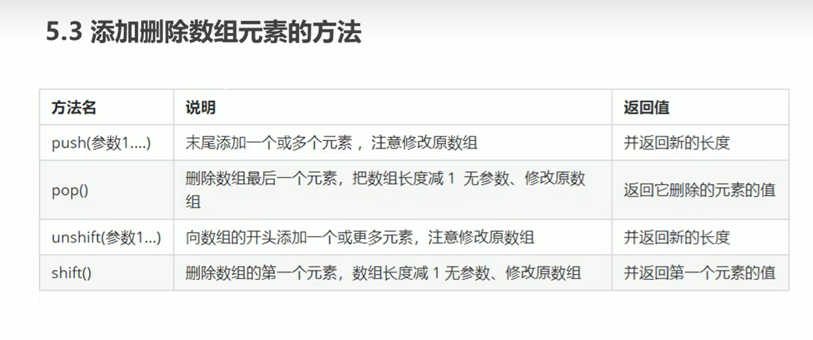 

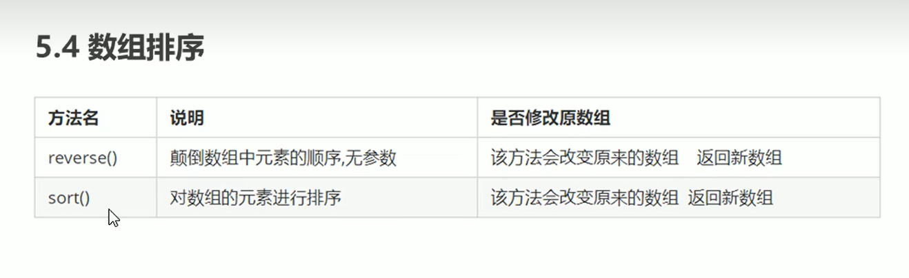 

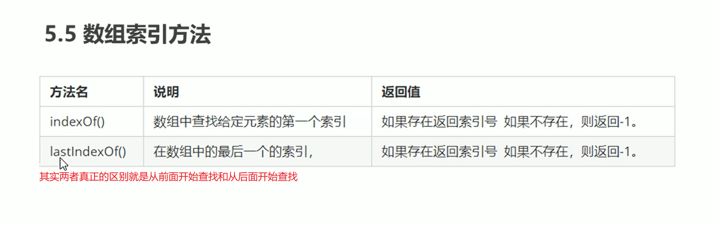 

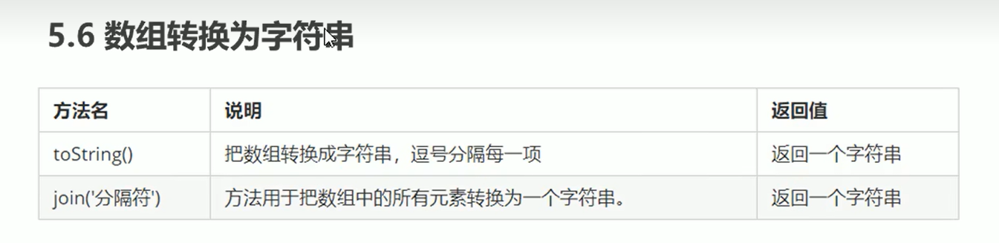 


**添加**

> push：在数组`后面`添加新元素，返回值是`新数组的长度`
>
> unshift：在数组`前面`添加新元素，返回值是`新数组的长度`

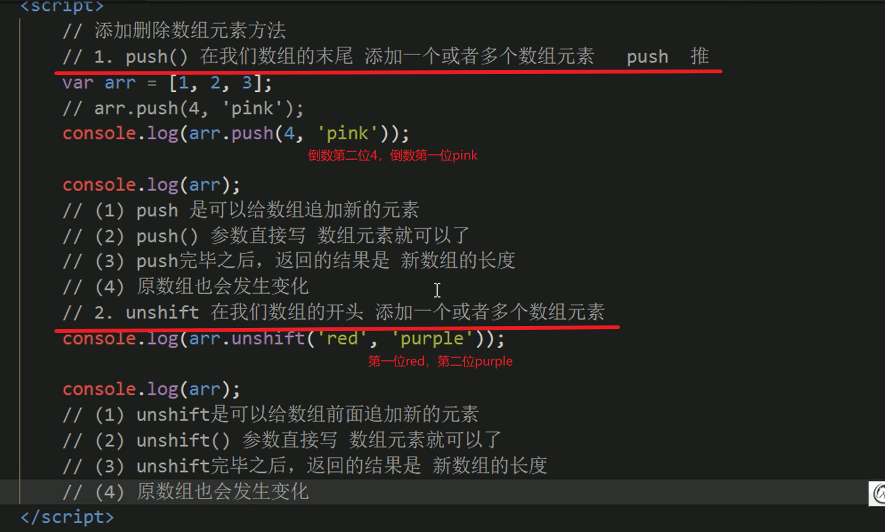 


**删除**

> pop：删除数组`最后一个`元素，返回值是`删除元素`
>
> shift：删除数组`第一个`元素，返回值是`删除元素`

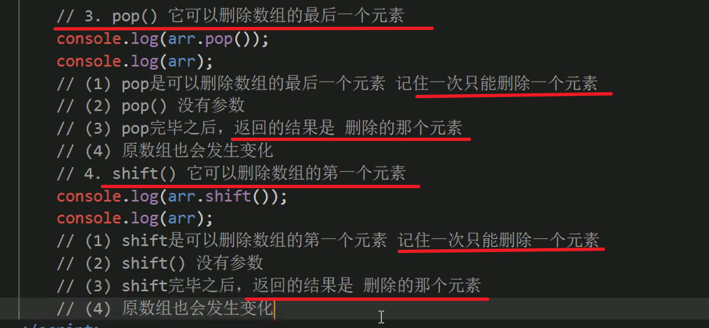 


**排序**

> reverse：`翻转数组`
>
> sort：实现`冒泡排序`，但是一般配合一个`辅助函数`来实现`不满足递增条件下`的冒泡排序，见下

 


**索引**

indexOf

.assets/image-20220905165118960.png)


#### 9.3.4、数组去重

```javascript
// 数组去重
function unique(arr) {
    var newArr = [];
    for (var i = 0; i < arr.length; i++) {
        // 遍历原数组，如果遍历的元素在newArr了就不放进去，如果不存在就push进去，保证相同的元素只能push一个
        if (newArr.indexOf(arr[i]) === -1) {
            newArr.push(arr[i]);
        }
    }
    return newArr;
}
```


#### 9.3.5、数组转字符串

join

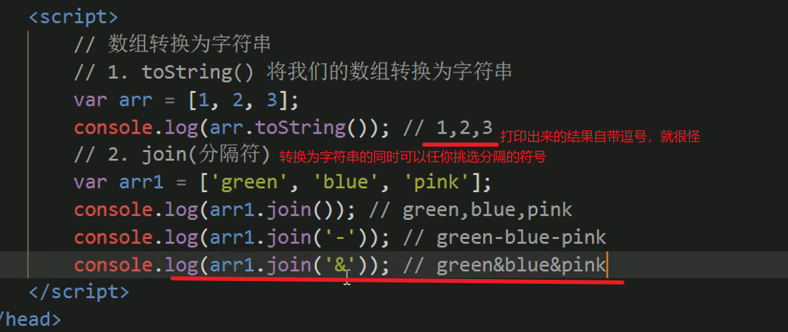 


### 9.4、包装对象

> `包装的过程：`
>
> 解析var str = 'a';
>
> 第一步，var temp = new String('a');//生成了临时变量，利用new String()把复杂数据类型包装成一个简单数据类型
>
> 第二步，str = temp;//把临时变量赋值给str
>
> 第三步，temp = null;//消灭的干干净净

.assets/image-20220905170752213.png)

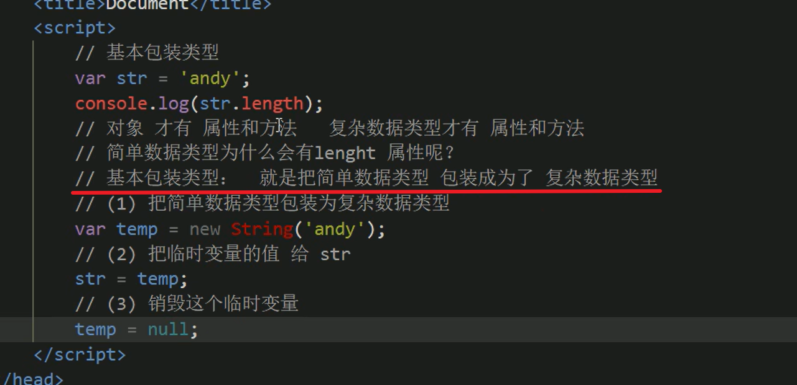 


#### 9.4.1、String

##### ①字符串常量池(不可变性)

也是因此，我们`不建议大量使用字符串拼接(+)`

.assets/image-20220905171255961.png)

> 示例：
>
> .assets/image-20220905171321232.png) str从andy变为red
>
> .assets/image-20220905171340431.png) 其实底层是str从指向andy到指向red了


##### ②根据‘字符’返回‘位置’

str.indexOf('要查找的字符', [起始的位置])

.assets/image-20220905171818319.png)


##### ③根据‘位置’返回‘字符’

charAt(index) // 返回字符

charCodeAt(index) // 返回字符的ASCII码

str[index] //返回字符，但是H5 IE8+才支持

.assets/image-20220905172121224.png)

.assets/image-20220905172301586.png)


##### ④拼接/截取

注意基本上都是索引号

concat(str1, str2...); // 拼接

substr(start, length); // 截取

slice(strat, end); // 截取

substring(start, end); // 截取

.assets/image-20220905172448034.png)

.assets/image-20220905172614468.png)


##### ⑤替换字符/转换为数组

replace('被替换的字符', '替换为的字符')

split('分隔符')

.assets/image-20220905172945159.png)

.assets/image-20220905173222082.png)


## 10、简单/复杂数据类型

> 补充一个小bug
>
> var a = null;
> console.log(typeof a); // 结果是 object
>
> 很怪，这的确是个bug，记住就行了，而且我们还可以利用它
>
> 如果我们需要一个变量为对象，但是暂时不知道赋什么值，我们就赋值为null，让其`等于空对象`
> 因为赋值为null的变量，`不会识别为null简单数据类型`，你大可以等需要了再给这个变量赋值一个对象

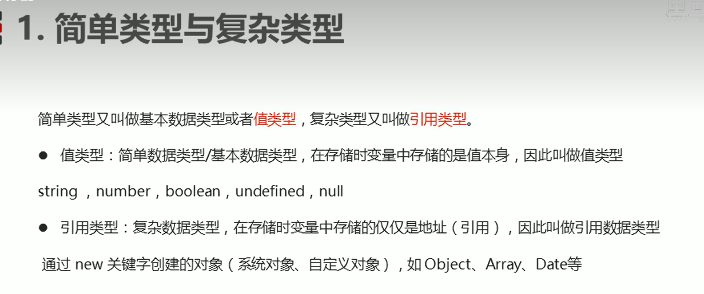 

### 10.1、内存分配

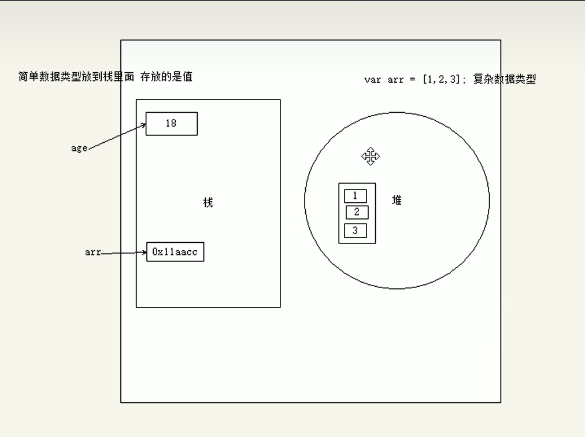 

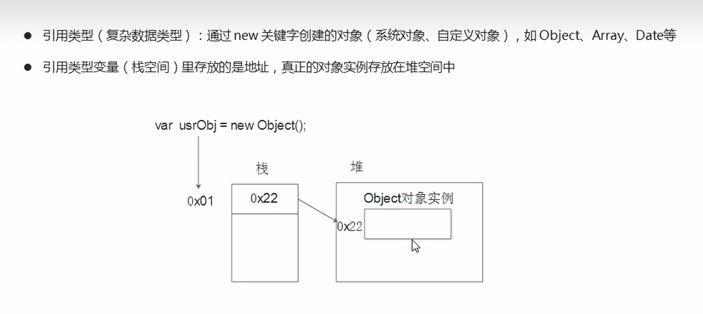 


.assets/image-20220906164114820.png)


# 三、Web APIs


# 1、API

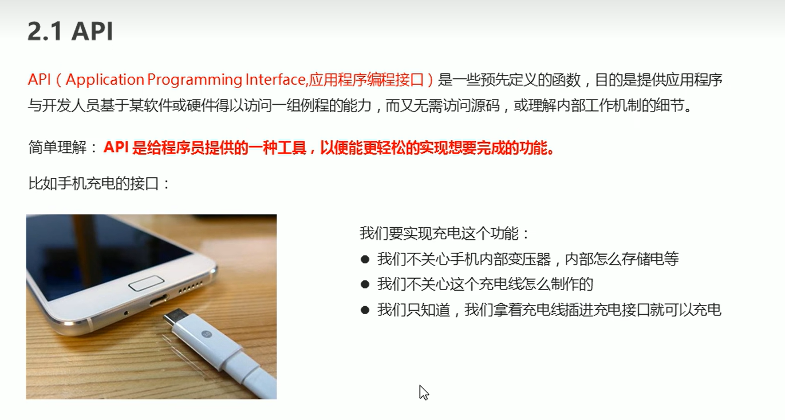 

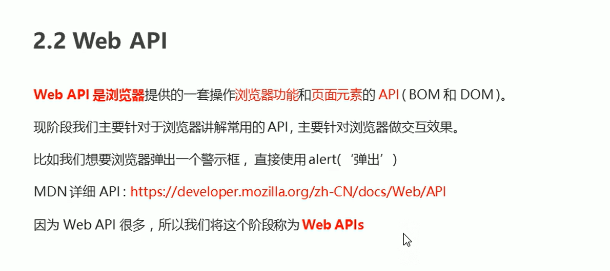 


# 2、DOM

Document Object Model 文档对象模型

### 2.1、简介

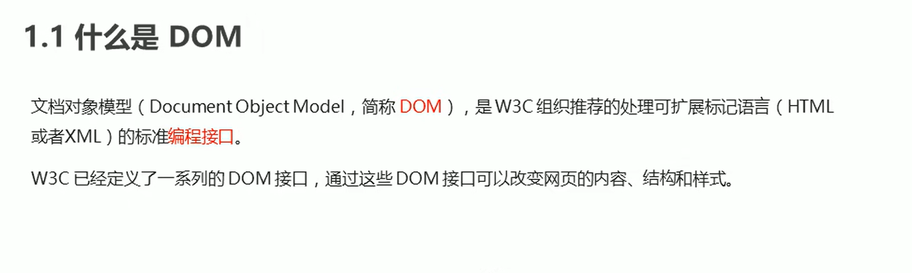 


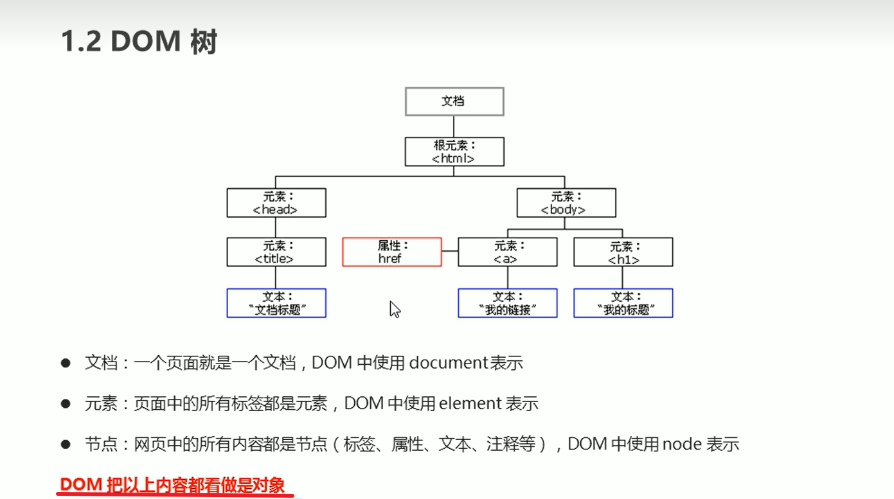  


### 2.2、获取元素

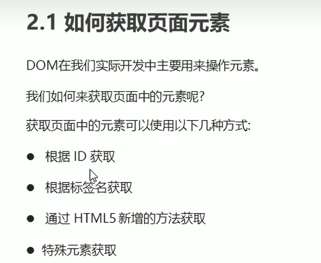 

#### 2.2.1、id

> 注意getElementById`返回的是对象`哦

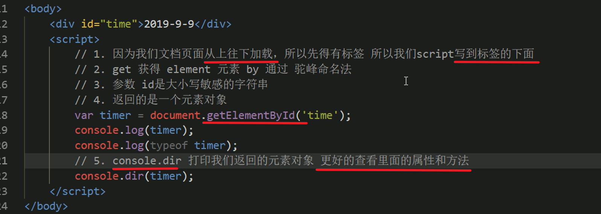 


#### 2.2.2、tag(标签)

> elemt.getElementsByTagName('标签名');
>
> 父元素必须是`一个具体的对象`，你给个伪数组啥的肯定不行

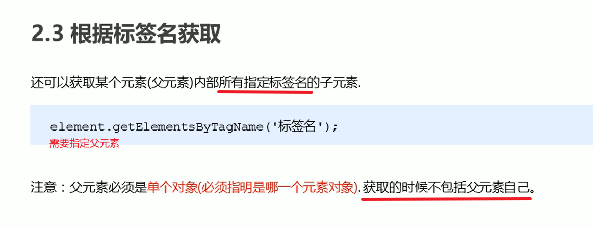 

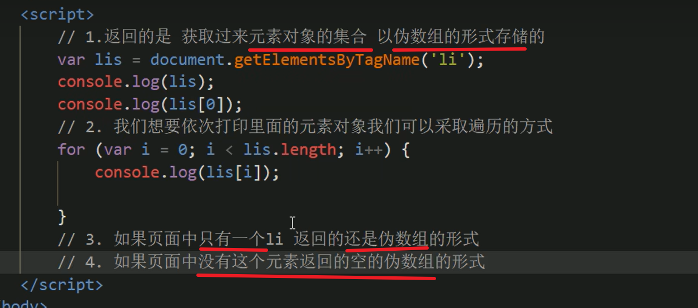 

 

#### 2.2.3、class/selector(H5新增)

| 获取方法               | 用处                                                         |
| ---------------------- | ------------------------------------------------------------ |
| getElementsByClassName | 获取某些元素集合                                             |
| querySelector          | 根据选择器获取`第一个元素对象` 切记 对应的选择器`加符号` document.querySlector('.box') |
| querySelectorAll       | 获取指定选择器的`所有元素对象集合`                           |

.assets/image-20220906170814207.png)


#### 2.2.4、body/html

| 方式                     | 用处              |
| ------------------------ | ----------------- |
| document.body            | 获取body标签      |
| document.documentElement | 获取html标签      |
| 起类名或者id             | 获取body/html标签 |

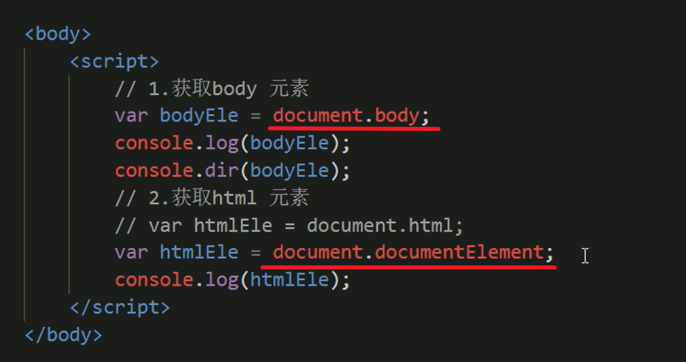 


### 2.3、事件

#### 2.3.1、概述

.assets/image-20220906171551596.png)


#### 2.3.2、三要素

`事件源`、 `事件类型`、 `事件处理程序`

.assets/image-20220906171954313.png)

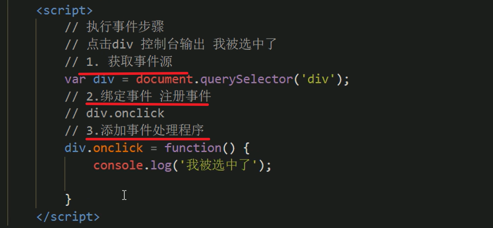 执行事件的步骤


### 2.4、操作元素

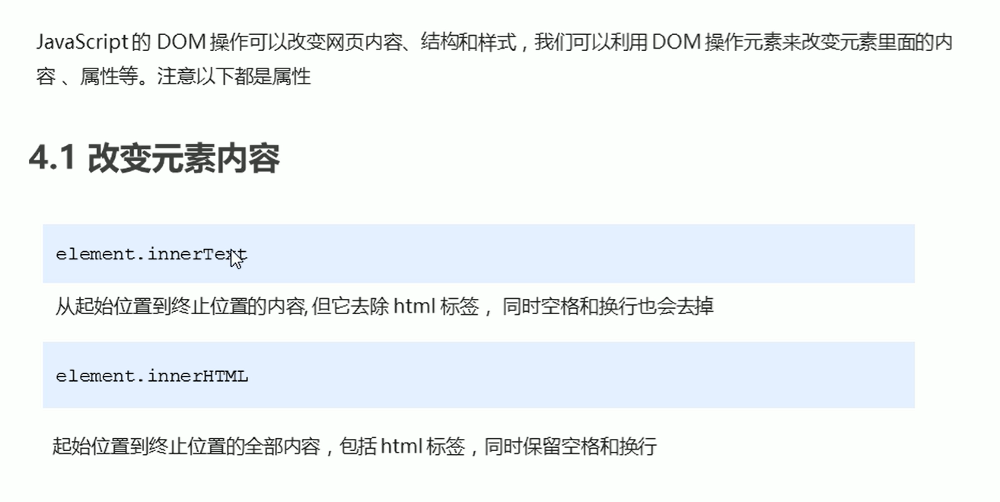 

> 示例：
>
> ```html
> <body>
>     <button><div>onclick nowTime</div></button>
>     <p></p>
> 
>     <script>
>         function getDate(){
>         //格式化日期 年月日
>         var date = new Date();
>         var year = date.getFullYear();
>         var month = date.getMonth() + 1;//加1，是因为返回的月份比实际小1
>         var dates = date.getDate();//返回的是号数
>         var arr = ['星期天', '星期一', '星期二', '星期三', '星期四', '星期五', '星期六'];
>         var day = date.getDay();//由于返回是数字，所以利用了上面的数组，返回的0代表星期天
>         //格式 01:01:01
>         var h = date.getHours();
>         var m = date.getMinutes();
>         var s = date.getSeconds();
>         //下面的操作就是避免出现 1:2:3 这种情况，也就是为了好看点，前面补个0
>         h = h < 10 ? '0' + h : h;
>         m = m < 10 ? '0' + m : m;
>         s = s < 10 ? '0' + s : s;
>         //获取当前的年月日，具体时间
>         return '今天是：' + year + '年' + month + '月' + dates + '日 ' + arr[day] + ' ' + h + ':' + m + ':' + s;
>     }        
>         //点击按钮，获取当前时间，即元素里面的内容发生变化
>         //1.获取元素
>         var btn = document.querySelector('button');
>         var div = document.querySelector('div');
>         //2.注册事件
>         btn.onclick = function(){
>             div.innerText = getDate();
>         }
> 
>         var p = document.querySelector('p');
>         p.innerText = getDate();
> 
>     </script>
> </body>
> ```
>
> 效果：
>
> .assets/1.gif) 


#### 2.4.1、innerText和innerHTML的区别

innerText：只会识别里面的文字，不会识别标签，并且会自动去除标签、空格和换行

innerHTML：识别元素里面的内容会把标签也给加载了

> 示例：
>
> 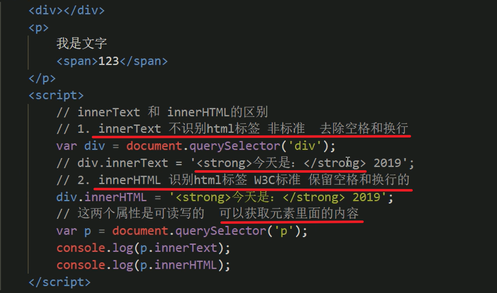 
>
> 效果：
>
> 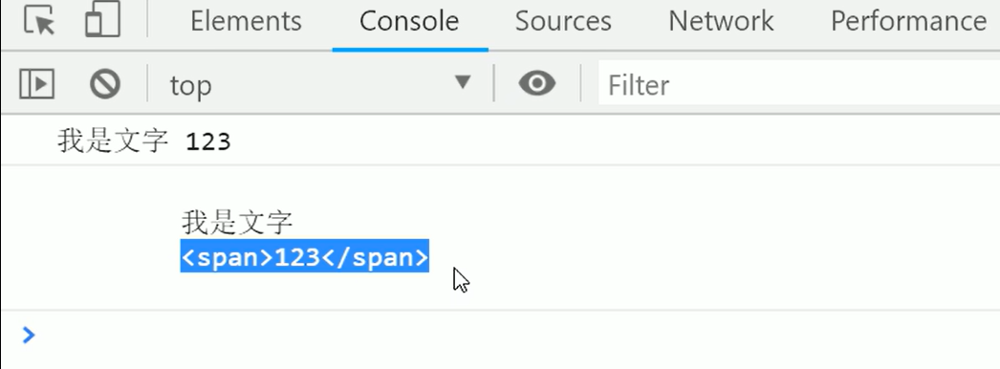 


#### 2.4.2、修改元素属性

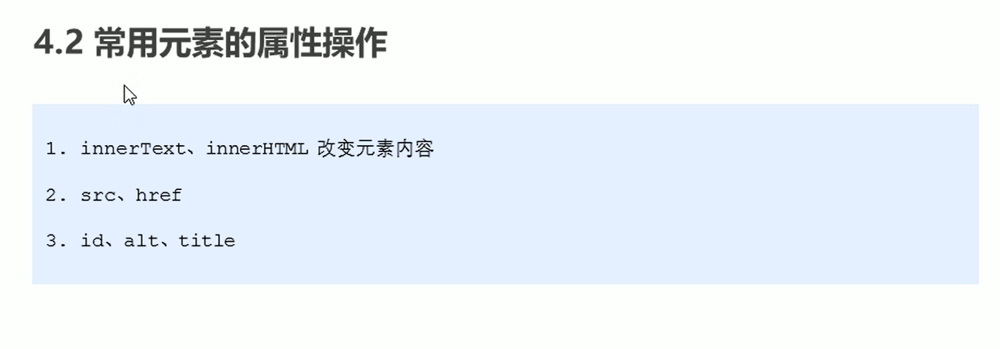 

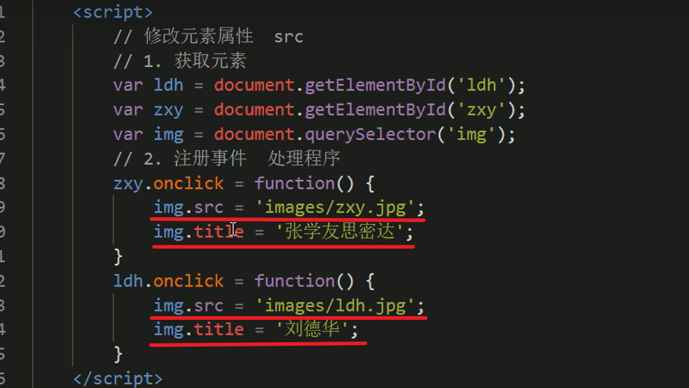 操作示例 利用 . 


#### 2.4.3、表单元素的属性操作

单独提一下那个点击一下之后禁用按钮的操作，挺好玩的

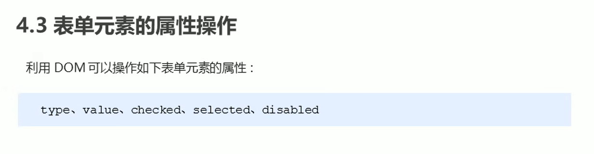 

 


#### 2.4.4、修改样式属性

JS的修改样式权重很高，产生的是`行内样式`

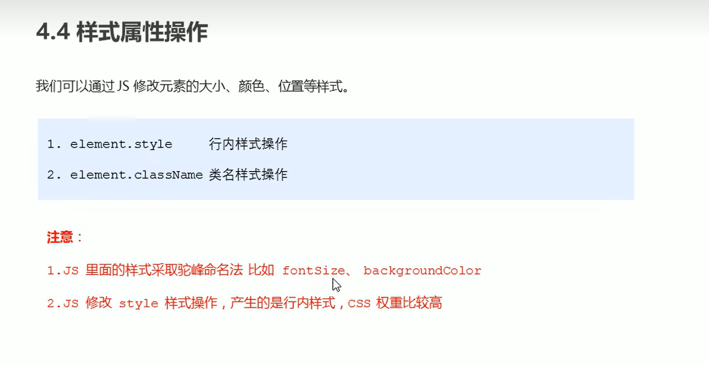 

.assets/image-20220906213816543.png)


#### 2.4.5、总结

.assets/image-20220906214058866.png)


### 2.5、排他思想

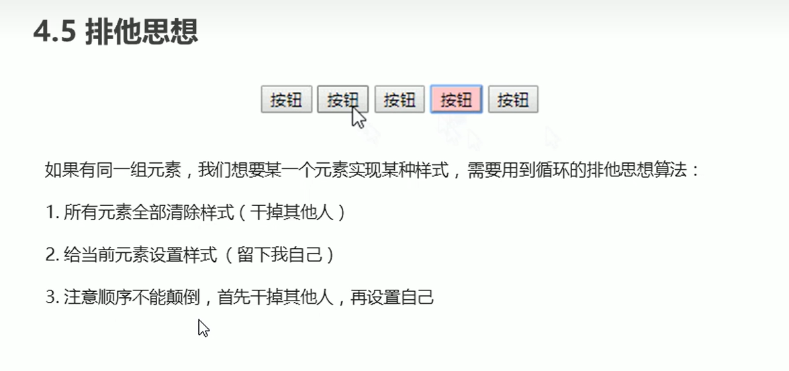 


​	

### 2.6、自定义属性

#### 2.6.1、获取值

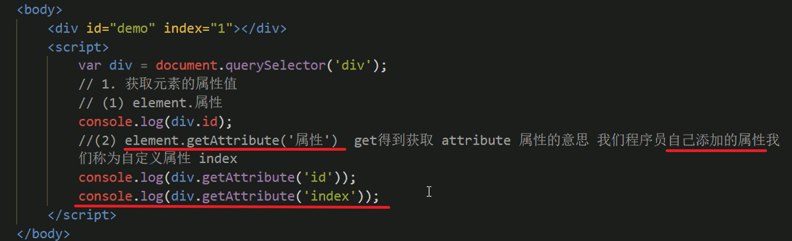

> H5新增的方法
>
> 获取data-开头的属性，存到一个数组里面去
>
> dataset.index
> dataset['index']
>
> 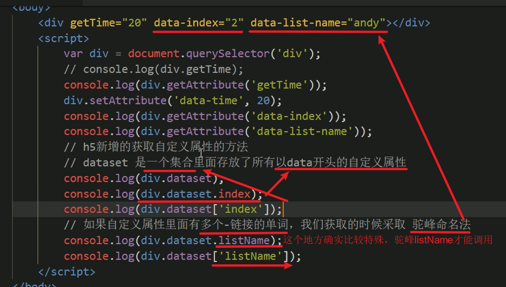 


#### 2.6.2、设置值

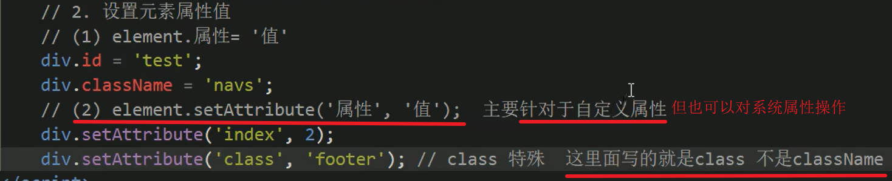 


#### 2.6.3、移除属性

直接就把这个属性移除了

.assets/image-20220911221635828.png) 


#### 2.6.4、使用规范

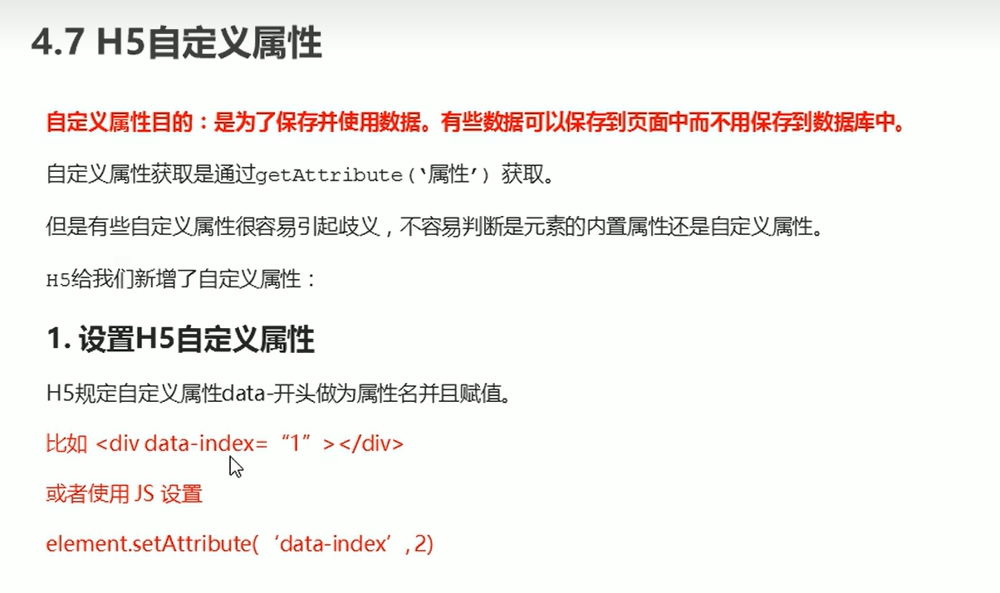 


### 2.7、节点操作

#### 2.7.1、优势

逻辑强，并且不繁琐

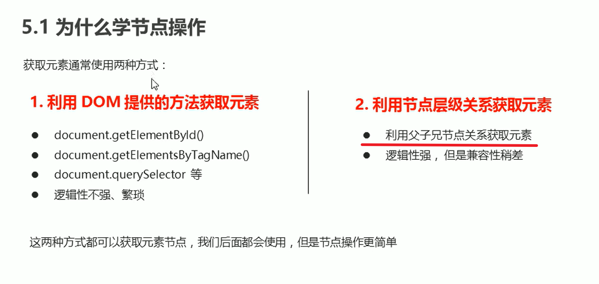 


#### 2.7.2、概述

`元素`、`属性`、`文本`都叫做节点

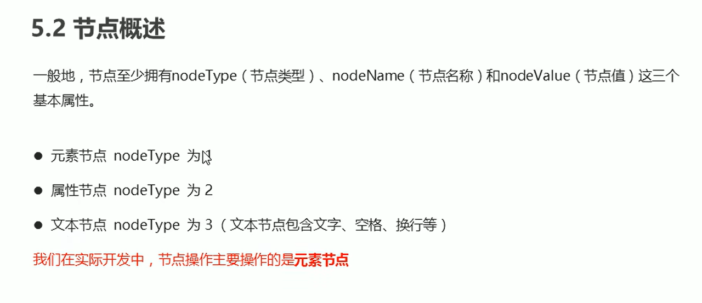 


#### 2.7.3、父/子节点

##### ①parentNode

.assets/image-20220911232459072.png)


##### ②childNodes

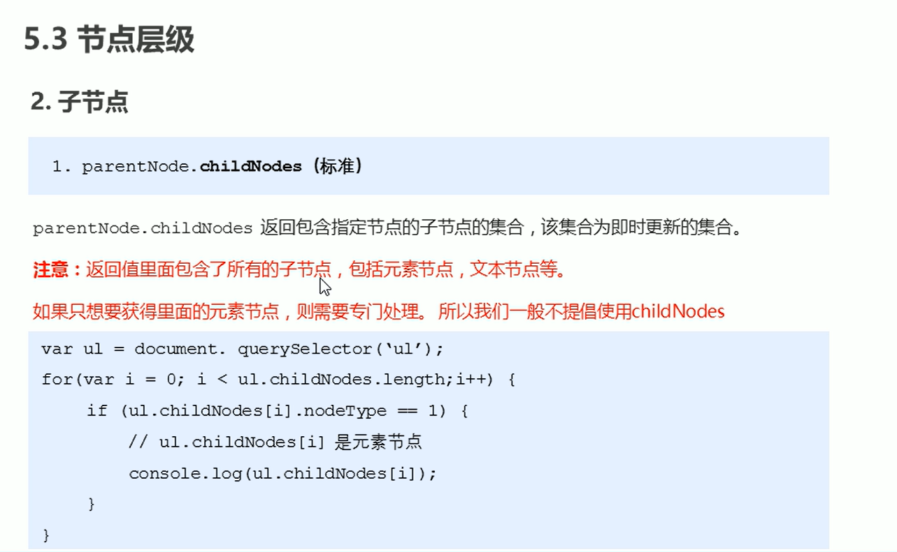 


##### ③children

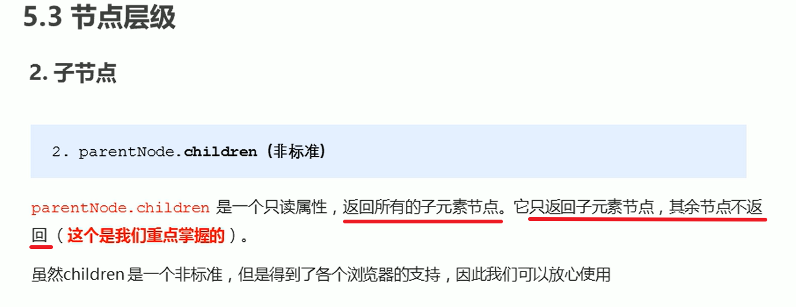 


##### ④获取头尾节点

```javascript
ol.children.length - 1; // 牛的
```

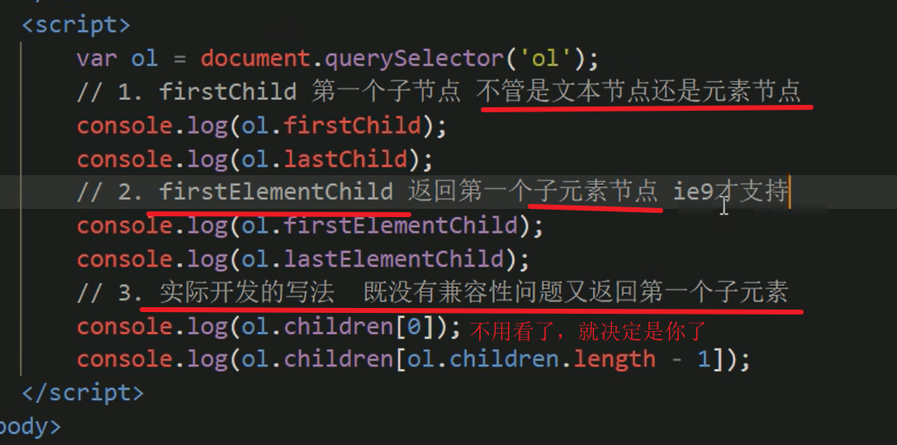 


#### 2.7.4、兄弟结点

##### ①previousSibling/nextSibling

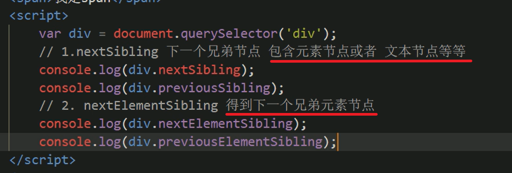 

为了解决兼容性问题，可以使用如下封装

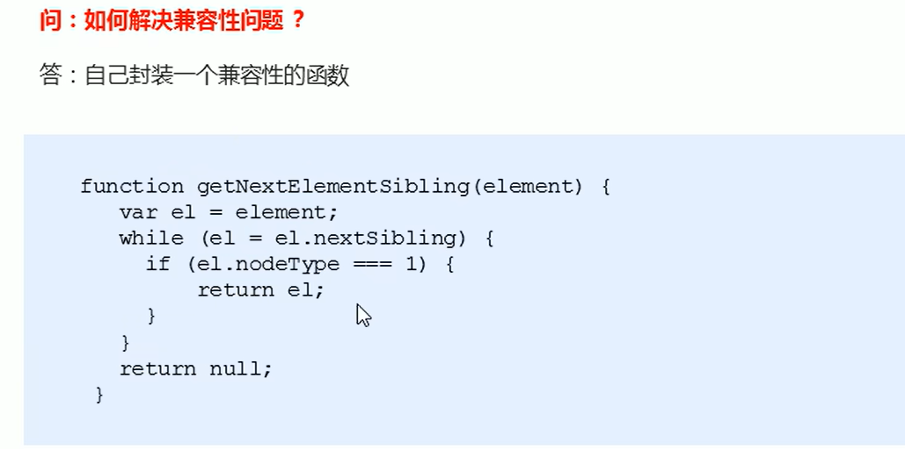 

```javascript
function getNextElementSibling(element){
    var el = element;
    while (el = el.nextSibling){
        if(1 === el.nodeType){
            return el;
        }
    }
    return null;
}
```


#### 2.7.5、创建节点和添加节点

##### ①createElement/appendChild

`添加新元素`的步骤

第一步，创建元素create，第二步，添加元素append/insert

.assets/image-20220913160535118.png)

.assets/image-20220913161028107.png)


#### 2.7.6、删除节点

##### ①removeChild

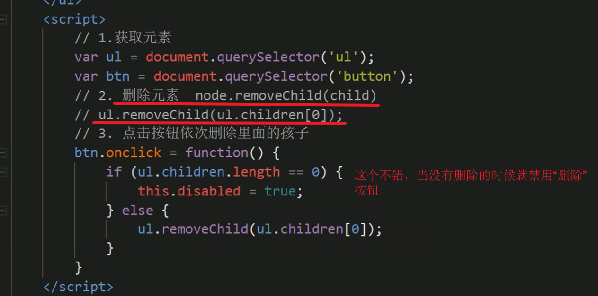 


#### 2.7.7、复制节点

##### ①cloneNode()

cloneNode()/cloneNode(true)

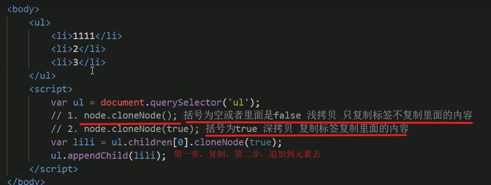 


#### 2.7.8、三种创建元素的区别

##### ①document.write()

这个document.write是废的，这玩意直接把页面清零了再插入，等会，也不定喔，假设我想报一个warning，直接清空页面再接个write，岂不帅哉

.assets/image-20220913220802789.png) 


##### ②创建元素の神

选它就选它---》innerHTML，但是`不要直接拼接字符串，那玩意太慢了`，还不如用createElement

但是当你采用数组形式拼接的时候就牛逼了

总结：innerHTML`创建元素效率高于`createElement，但是利用`数组`可以`提升前者的速度`

> 实现步骤
>
> (1)先把需要添加的新元素的形式`写成字符串`push到数组里面去
>
> (2)然后利用`join把数组转为字符串`，直接放到innerHTML里面去
>
> (3)但是`务必注意join('')`，这样把这一千个元素`直接紧挨在一起`，相当于<div></div><div></div> 当如果不写''的话就会出现问题，
> 变成<div></div>,<div></div> 
>
> （4）效率这么高确实厉害，可能是`不必拼接字符串，直接一波放进来`的原因吧
>
> 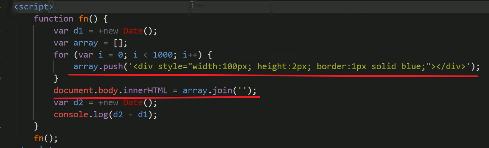


## 2.8、DOM重点核心

.assets/image-20220919000930275.png)


### 2.8.1、注册事件

> 传统注册事件的唯一性在于：`一次只能注册一个事件`，后注册的事件会把前面的`覆盖掉`

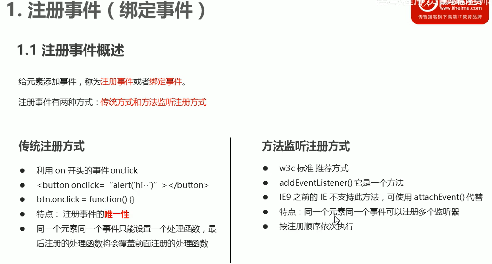  


#### ①事件监听注册

addEventListener

.assets/image-20220919001905514.png) 


#### ②兼容性方案

麻麻烦烦

.assets/image-20220919002541095.png)


### 2.8.2、删除(解绑)事件

#### ①三种方式

.assets/image-20220919003105769.png)


#### ②兼容性方案

.assets/image-20220919002907787.png)


### 2.8.3、DOM事件流

##### ①捕获/冒泡

> 事件流：从页面中接受事件的顺序
>
> 学这个就是控制一系列事件连续响应传播，好比捕获阶段你只是点了一下father，结果“一石激起千层浪”，它的son的点击事件也会跟着执行
>
> 而冒泡阶段，就是你点了一下son，son的father们，但凡监听注册了click事件的，都会跟着响应

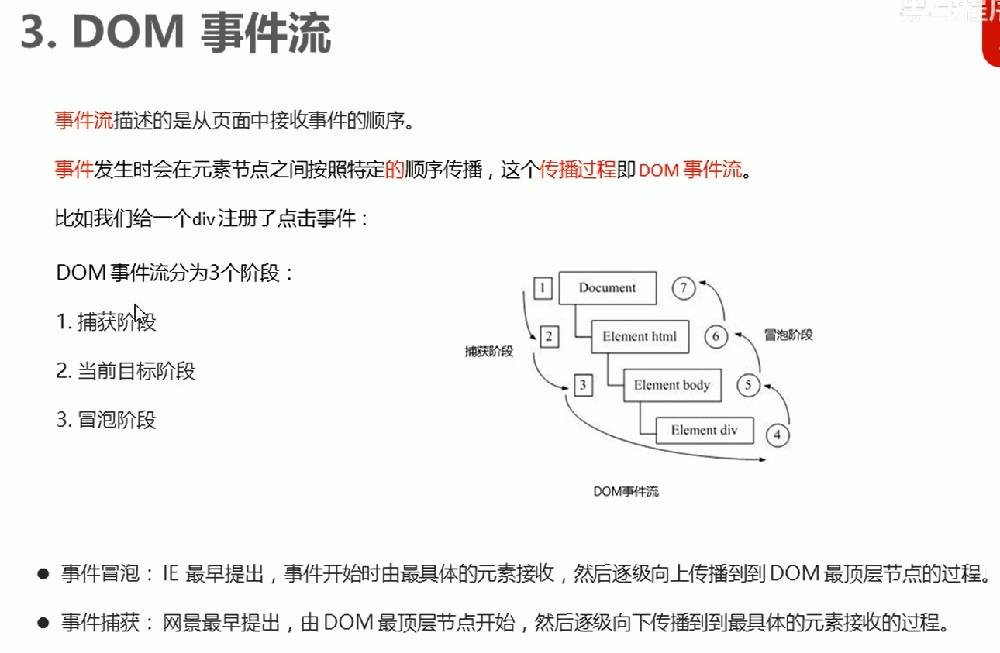 


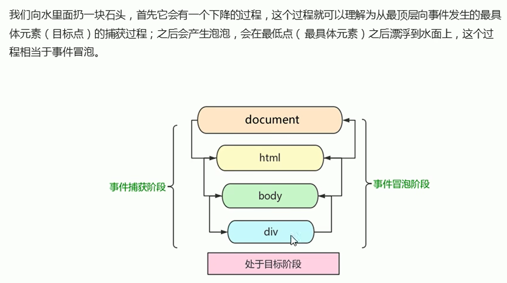 


> 示例：
>
> 这个捕获的意思很简单
>
> 就是你给son绑定了click事件
>
> 当你点击son的时候，它就会依次检查document -> html -> body -> father -> son 其中如果哪个元素绑定了click事件，它就先执行哪个点击事件
>
> 如下，先执行father的click 再执行son的click
>
> 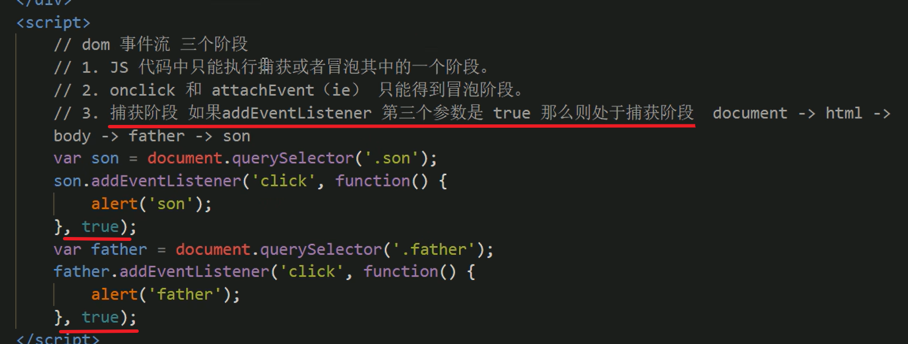 
>
> 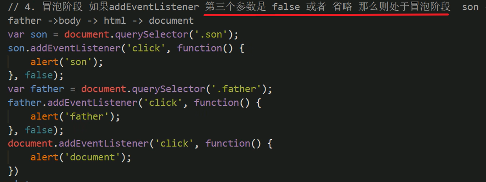  


##### ②事件对象 

> 概括一哈
> 就是你注册的事件是click
> 可能当你点击了那个元素的时候，或者按了下键盘哪个键的时候，浏览器会把你的操作信息(鼠标坐标、键盘输入...)存入一个集合
>
> 而事件对象就是这一系列数据的集合
>
> 当然你参数随机，你只要知道你在function(/* 这里面放一个标识符就可以接收系统自动创建的事件对象了 */)

.assets/image-20220920212025848.png)


##### ③常见事件对象的方法和属性

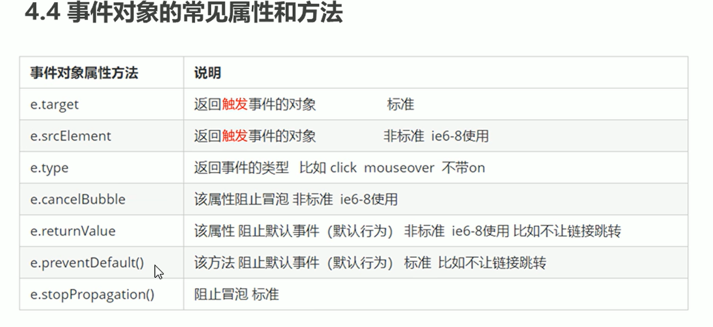

###### 返回触发/绑定事件对象 

> **e.target/this/currentTarget(左边这哥们就是this，只是有兼容性问题)**
>
> e.target 是`触发事件`的元素  this 是`绑定事件`的对象
>
> 这两者有什么区别呢？
>
> 绑定事件很好理解，下图你拿div绑定事件，那么div就是this，你拿ul绑定事件，ul就是this
>
> 而怎么理解触发事件呢？ul中不是包含着li吗，你点击li，事件会冒泡到ul上，ul有注册事件，就会触发事件监听器，但是触发这个事件的起始是li哦
>
> 1

.assets/image-20220920213809774.png)


###### 阻止默认行为

> **e.type/e.preventDefault()/return false**
>
> e.type：很好理解，获取当前事件的类型，click就是click，mouseout就是mouseout
>
> e.preventDefault()：阻止默认行为(事件)，比如，让点击链接和按钮的默认跳转和提交失效
>
> return false：也可以阻止默认行为
>
> 1

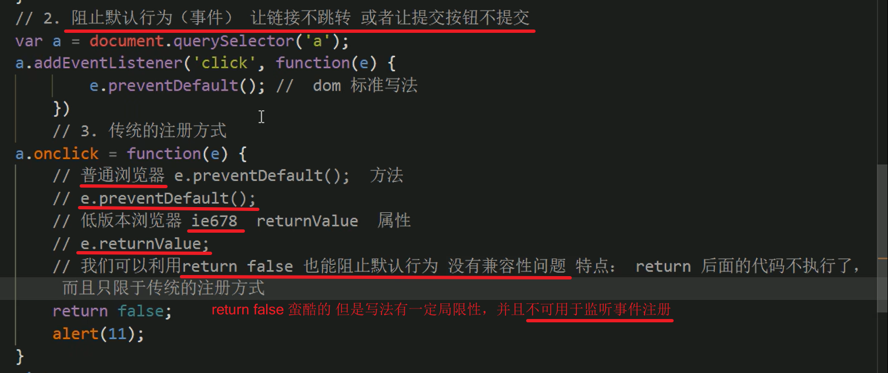  


###### 阻止冒泡	

 

 开启了false，所以开始阻止冒泡


###### 事件委托

> 利用冒泡的晓瘪三

 

> 示例：
>
> 想给小li全部添加click事件，一个for循环太麻烦了，DOM交互太多顶不住
>
> 此时利用事件冒泡，给ul添加监听器，这样每一个小li就会出现点击事件了，而且还可以利用e.target 获取当前点击的哪个小li
>
>  

 


### 2.8.4、鼠标相关事件

 

 


#### ①禁止选中文字和右键菜单

 酷的


#### ②鼠标事件对象

> client和page的区别很简单
>
> client是相当于`当前浏览器窗口可视区`的坐标
>
> page是相当于`全部文档页面`的坐标
>
> 
>
> screen了解一下，相当于`电脑屏幕`的坐标
>
> 可能变鼠标样式的可以利用这个操作吧

 

> 示例：
>
>  


### 2.8.5、键盘相关事件

 

> 示例：
>
>  


#### ①事件对象

##### 判断按下哪个键

> `keypress`获取的keyCode可以`判断大小写`
>
> `keyup`和`keydown`的keyCode`不能区分大小写`

 


 


# 3、BOM

## 3.1、何为BOM

Browser Object Model(浏览器对象模型)

 


## 3.2、BOM的组成

 

> 哥们跟浏览器打交道的

  


## 3.3、页面事件

### 3.3.1、加载事件

 

> 可以多使用下面一下这个

 


### 3.3.2、调整窗口大小事件

 

> 示例
>
> resize 当窗口发生像素变化，就会触发事件，结合window.innerWidth更牛
>
>  


### 3.3.3、定时器

#### ①setTimeout()

 

> 示例
>
>  


> **回调函数**

 

 **使用示例**


> **清除定时器**

 

 使用示例


#### ②setInterval

 

> 示例：
>
>  

 

> **取消定时器**

 

>  示例：
>
> 利用timer停止定时器
>
> .assets/image-20220923000338219.png) 


## 3.4、this的指向

> 有个需要注意的地方，请问下面代码打印的this是多少
>
> fn(); // 打印的this，应该是window，因为全局作用域下默认window调动

 

 


## 3.5、同步/异步

 


### 3.5.1、执行机制

  

> 当同步异步任务混一起时
>
> `先`执行`同步再`执行`异步`任务
>
> 按`次序`读取`任务队列`中的异步任务

 

> 事件循环蛮重要的
>
> `反复`地查看`任务队列`是否有异步任务，`找到->执行->推出->循环`

 


### 3.5.2、location对象

#### ①URL

> `统一资源定位符`：Uniform Resource Locator
>
> 互联网上的每个文件都有一个唯一的URL
>
> 它包含的信息除了`指出文件的位置`之外，还告诉了`浏览器怎么处理它`

 


#### ②相关属性

> hacker来咯

 


#### ③获取URL参数

> 参数从`一个界面传递到另一个界面`，神中神


> 示例：
>
> *在第一个页面*
>
>  
>
> 
>
> *在第二个页面*
>
>  


#### ④相关方法

> 单独讲一下replace，这玩意相当于`替换当前的界面，并非跳转`，所以没有后退的功能

 

> 示例：
>
>  


### 3.5.3、navigator对象

navigator

 


### 3.5.4、history

> 整个返回按钮啥的可以的

 

> 示例：
>
>  
>
> 好看哎 
>
>  又比如网易云


# 四、网页特效

## 1、元素相关

### 1.1、偏移量offset

#### 1.1.1、基础使用

> 为什么要强调距离带有`定位父元素`的位置呢？
>
> 如果没有father，或者father没有定位，则其father`默认body`

 

> 示例：
>
>  


#### 1.1.2、offset与style的区别

 


### 1.2、可视区client

client，客户端

.assets/image-20220923172637477.png)


### 1.3、立即执行函数

> 那么问题来了，介玩意有啥呢用：
>
> `独立创建了一个作用域`，封装的死死的
>
> 所以当你``引入其他JS文件的时候`，`你写的num`和`立即执行函数的num`就不会产生冲突了 好耶ヾ(✿ﾟ▽ﾟ)ノ

```javascript
普通的声明调用
function fn(){
    conosole.log(1);
}
fn(); // 此处调用

1、立即执行函数，是指不需要 如上面 一样调用，能够立即执行的函数
两种写法，(function() {})() 和 (function(){}())
(function(a, b){
	console.log(a + b);
})(1, 2);

(function sum(a, b){ // 此处可以写函数名sum，也可以不写
    console.log(a + b);
}(2, 3));
```


### 1.4、滚动scroll

 

> 结合下面理解

  


### 1.5、总结

 

 


## 2、动画

### 2.1、动画实现原理

 

> 示例：
>
>  


### 2.2、封装动画函数

#### 2.2.1、基础使用

 

 简简单单调用就好了


#### 2.2.2、给不同元素记录不同计时器

 

> 这样写的好处有两个
>
> **1、性能角度**
>
> 本来写的是var timer = setInterval(^);
>
> 每个元素调用的时候，timer都会开辟内存空间，一千个调用，就开辟一千个空间，达咩
>
> 而obj.timer，只是在已经开辟了空间的obj对象中添加了一个属性，没有开辟新的空间啊
>
> 
>
> **2、逻辑角度**
>
> 每个玩意都应该有自己的定时器啊，共用就很怪，反正解耦合嘛

```javascript
简单动画函数封装obj 目标对象，target 目标位置
function animate(obj, target){
    //下面这个写法的原因：当我们设置了点击事件的时候，如果不断地点击，元素的速度会越来越快，因为开启了太多的定时器
    // 解决方案就是如下，每次调用，都先清除一次定时器，使得只有一个定时器执行
    clearInterval(obj.timer);
    obj.timer = setInterval(function(){
    	if(obj.offsetLeft >= target){
            // 停止动画，本质去除定时器
            clearInterval(obj.timer);
        }
        // 看到下面的left就明白 输入的元素需要带有绝对定位/相对定位啊
        obj.style.left = obj.offsetLeft + 1 + 'px';
    }, 30);
}
var div = document.querySelector('div');
animate(div, 300);
```

 


### 2.3、缓慢动画原理

  

```javascript
    <div class="box" style="position:absolute;width: 300px;height:200pxs;background-color:aquamarine;">1</div>
    <script>
        var box = document.querySelector('.box');
        // 缓慢动画原理
        // 1.让盒子移动的距离依次减小，速度便慢慢落下来
        // 2.核心算法：(目标值 - 现在的位置) / 10 作为每次移动的距离 步长
        // 3.停止条件：当前盒子的距离等于目标的距离
        function animate(obj, target){
            clearInterval(obj.timer);
            obj.timer = setInterval(function(){
                obj.step = (target - obj.offsetLeft) / 10;
                // 注意取整，正数往大的取整，负数往小的取整
                obj.step = obj.step > 0? Math.ceil(obj.step) : Math.floor(obj.step);
    	        if(obj.offsetLeft == target){
                    // 停止动画，本质去除定时器
                    clearInterval(obj.timer);
                }
            // 看到下面的left就明白 输入的元素需要带有绝对定位/相对定位啊
            obj.style.left = obj.offsetLeft + obj.step + 'px';
        }, 15); // 15是个好东西
}   
    animate(box, 500);
	</script>
```

 


> **关于为何取整**
>
> 往大了取整，往大取整更快到达啊，不然定时器多运行几次多浪费鸭
>
>  


#### 2.3.1、多个目标值之间移动

尤其注意`从大的位置回到小的位置`

 

```javascript
obj.step = obj.step > 0? Math.ceil(obj.step) : Math.floor(obj.step);
```

> **关于为何往小取整**
>
> 当你的step为-8.1的时候肯定往小了走啊，即-9，运动的px越大越好，记住这个原则


#### 2.3.2、回调函数

> 应用场景，等你前面的动画执行完后，我在执行一个
>
> 喵的，这么玄乎，其实不就是加了个函数作为参数，等定时器结束再执行吗

 

> 示例：
>
>  
>
>   


### 2.4、封装函数到JS文件


# 五、存储

## 1、本地存储

.assets/image-20220925221951153.png)


## 2.sessionStorage

 


>  示例：
>
>  
>
>  


## 3、localStorage

 


> 示例：
>
>  
>
>  


`

`

`

`

`

`

`

