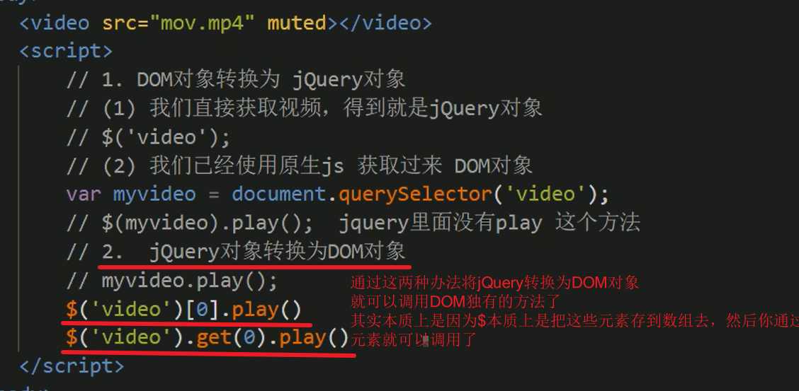
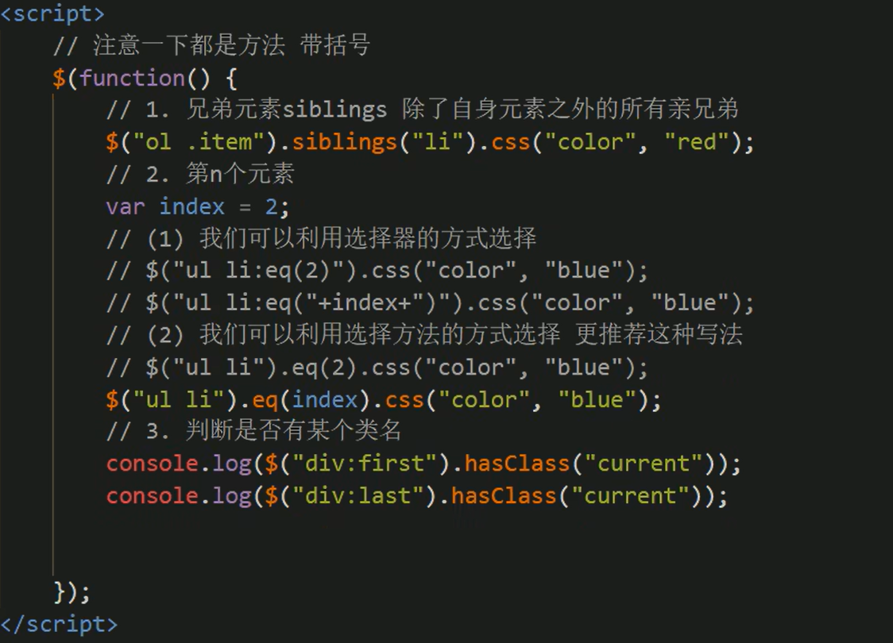
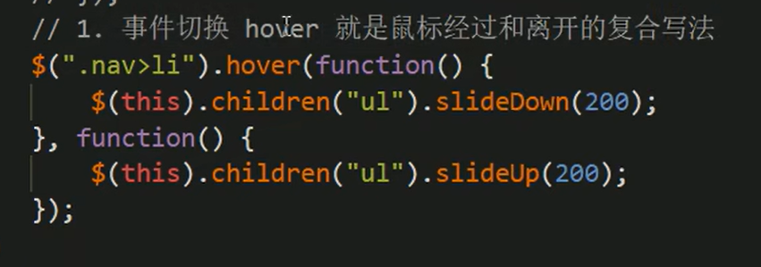
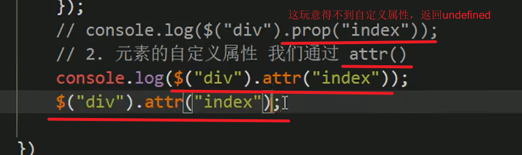

[TOC]


# 一、基础概述

## 1、JavaScript库

 

 


## 2、jQuery

 

 

 


# 二、基础使用

## 1、入口函数

 

> 示例：
>
>  


## 2、顶级对象——$

 

 


> **重要**
>
> `使用querySelector获取的是DOM对象`
>
> 而使用`$('div')，获取的是jQuery对象`，它`把DOM对象进行了包装`
>
> 所以可以写<u>$('div').hide() 因为这是jQuery的方法</u>
>
> 而如果是<u>DOM原生对象就得写，div.style.display = 'none'</u>; // 当然jQuery也无法使用原生DOM的方法
>
>  


## 3、jQuery对象和DOM对象的相互转换

 


## 4、常用API


### 4.1、隐式迭代

#### 4.1.1、概述

> 注意`隐式迭代`

 

.assets/image-20220929220154076.png)

 

#### 4.1.2、排他思想

> 利用隐式迭代的*排他思想*

 


#### 4.1.3、链式编程

 


### 4.2、选择器

#### 4.2.1、基础选择器——层级选择器——筛选选择器

 

 

 


#### 4.2.2、筛选方法

> 注意两点
>
> 第一，这些都是方法函数，`别忘了加小括号`
>
> 第二，查找的角度是`往父子兄的角度查找的`

 

> parent()/children()/find()

 

> siblings/eq/hasClass

 


### 4.3、样式

#### 4.3.1、操作CSS方法

```javascript
三种写法
$(this).css("color");
$(this).css("color", "red");
$(this).css({
	width: 400,
	hieght: 400,
	backgroundColor: "red"
});
```

 

> 示例
>
>  


#### 4.3.2、设置类样式法

> 1、添加类
>
> addClass("current");
>
> 2、移除类
>
> removeClass("current");
>
> 3、切换类
>
> toggleClass("current");
>
> *toggleClass*()用来判断元素是否拥有此类名,有的话就删除,无的话就添加,可以达到切换的效果

 

> **下面是原生JS的className和jQuery对类操作的区别**
>
> className只能是覆盖
>
> jQuery 添加、移除、切换都可以
>
>  
>
>  

 


### 4.4、动画

animate都是小case了

 

#### 4.4.1、show/hide/toggle

> 几个家伙都差不多

 


 

 

> 示例：
>
> 感觉toggle就是显示就隐藏，隐藏就显示
>
>  


#### 4.4.2、slideDown/slideUp/slideToggle

> 示例：
>
>  
>
> 
>
>  
>
> 
>
> 但是有更好的写法，**运用事件切换**
>
> 先on后out
>
>  
>
> 
>
> 还可以更简单
>
> 利用hover只写一个函数，鼠标经过和离开都会触发的特性，结合slideToggle
>
>  


#### 4.4.3、stop

> 由于动画一旦开始就只会执行到结束
>
> 所以可能会出现
>
>  
>
> 
>
> 这里利用**stop**，每次触发当前动画都会停止上一次动画，每次只保存当前的动画

 

> 示例：

 


#### 4.4.4、淡入淡出

fadeIn/fadeOut/fadeTo/fadeToggle

##### ①fadeIn/fadeOutfadeToggle

 

> 效果：
>
>  


##### ②fadeTo(半透明)

  

> 示例：
>
>  
>
>   


#### 4.4.5、自定义动画animate

 

> 示例：
>
>  
>
> ```html
> <body>
>     <button>点击</button>
>     <div>1</div>
>     <script>
>         $(function(){
>             $("button").click(function(){ 
>                 $("div").animate({
>                     left: 500,
>                     top: 100,
>                     opacity: .4,
>                     width: 300
>                 }, 500);
>             })
> 
>         })
> 
>     </script>
> </body>
> ```
>
> 


### 4.5、属性操作

#### 4.5.1、获取固有属性prop()

 

> 示例：
>
>  


#### 4.5.2、获取自定义属性attr()

 


> 示例：
>
>  
>
>  
>
>  这个data-index是H5自定义属性
>
> 


#### 4.5.3、数据缓存data()

> 什么意思呢？
>
> 这玩意其实是把元素当做一个变量，或者说容器，`把一些字面量存在元素的身上`，`放到元素的缓存里面`
>
> 因此就可以访问放到它缓存中的值
>
> 但是**一刷新就移除**是不是多少有点

 


> 示例：
>
>  


`

`

`

`

`

`

`

`


