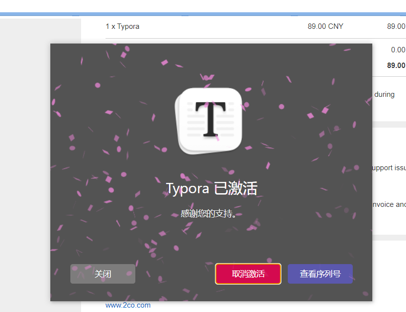

​	

[TOC]


记得把老杜的栈和酒店管理系统给写了 410p开始

记得把武器数组的作业给做了 开始499p

记得把用户注册给写了 498p

这几个肯定可以帮助我写考核

文件夹拷贝 588p


考核

第一步，分析有几个界面，要做什么样的视图，view

输入的时候要用nextLine，不要其他的


第二步，设置用户类

构造方法搞几个不同参数的，重写equals、hashcode、toString方法


第三步，在dao层搞一个接口，里面放全部增删改查啥啥啥的抽象方法

然后也在dao层里面搞实现方法


第四步，可以在网上看一下别人怎么处理很多个代码类似的JDBC代码





## 一、先审视题目

### 1、分析

第一步，先找到一堆类的关系

如果能写成A is B，那么说明AB存在继承关系，B是A的父类，A是B的子类

如果能写成A has a B，那么说明B这个引用数据类型是A类的属性，即A类中(B b)了一下

（1）A has a B的相关代码，可以去理解一下
下面是示范如何将两个对象连接起来


## 2、小细节

### 1、用字符串比较是否相等 建议这样写 (重要)

```java
"aaa".equals(username);/*这个写法是去调用"aaa"里面的equals方法，这里有两个点需要理解，第一个点就是，你这里写的"aaa"其实是String类型的对吧，这个属于字符串常量，但是它是String类型的字符串常量哦，所以它指向的是String这个类，只是没有直接new然后写个引用的名字而已， 所以它就会去找到String里面的equals方法，第二点就是，equals不是Object类的吗，但String继承了Object之后对equals方法进行了重写，本来的Object类的方法是比较的是两个地址是否相同，但是在String里面，变成了检查两个字符串是否完全相等，所以这个点你要注意，而且字符串常量肯定不会出现空指针异常啊*/
```


#### 2、初始化一个类的属性

其实初始化一个类的时候可以在构造方法里面就初始化了，但是要记得在类里面先搞一个无参构造方法，再搞一个有参构造方法用于对属性进行初始化

### 2、输入账户的时候可以调用trim删除字符串空格，也就是说可以实现别人不小心打空格依然能让他登录


#### 3、用户输入的细节

调用parseInt方法，把字符串转为数字


### 4、记得给类封装了

**封装的时候记得重写构造方法和toString和equals方法**


### 5、开关文件抓异常的时候千万记得finally嗷宝


### 6、看下输入有误这些能不能给它做成一个自定义异常类

可以看下我进阶笔记里面那个自定义异常，有时间多搞两个异常类，没时间也可以写几个，主要展现一下自己学会了自定义异常嘛


### 7、记得重写每个自定义类的toString、构造方法和equals方法

equals可以参考我进阶里重写的代码，可以实现避免用户名重复的操作的。当然看你是不是把用户名放到一个集合里面去


### 8、记得把用户类的每个对象放到集合里面去


### 9、注意，放到HashMap集合key部分的元素和HashSet集合中的元素，都需要重写equals方法和hashCode方法


### 10、想输出字符串到文件一定要先转为byte数组再输出，感觉读取也是这样，拿个数组去读字符串


### 11、文件IO的时候，记得要搞个类的绝对路径，不要只写个相对路径，在进阶的反射我有讲，如果是返回流的形式，是不同的，那里都有去看一下吧


### 12、if最好null==xx，避免写成=			