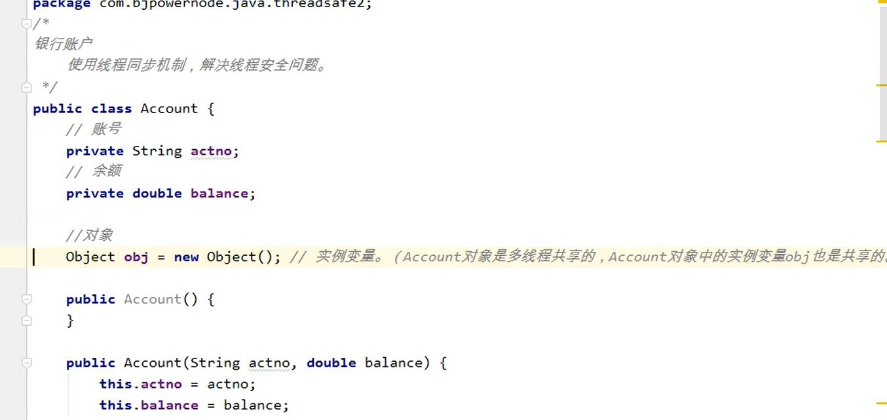

[TOC]


### 十、多线程

#### （1）基本概述


#### （2）实现线程的多种方式

建议使用第二种，你实现了接口还能继承其他的类，实现其他的接口，但是如果你继承了Thread类的方法，就不能继承了其他类，尽管实现其他接口

一句话，面向接口编程

##### ①第一种，继承java.lang.Thread类

记得重写Run方法

```java
package com.lzo.test;

public class xiancheng {
    public static void main(String[] args) {
        //此处是main方法，这里的代码属于主线程，在主栈中运行
        //第一，新建一个分支线程对象
        MyThread myThread = new MyThread();
        //启动线程
        myThread.run();//不会启动线程，不会分配新的分支栈。（这种方法就是单线程）
        //start()方法的作用是：启动一个分支线程，在JVM开辟一个新的栈空间，这段代码任务完成之后，瞬间就结束了
        //这行代码的任务只是为了开辟一个新的栈空间，只要新的栈空间开辟出来，start()方法就结束了。线程就启动成功了
        //启动成功的线程会自动调用run方法，并且run方法在分支栈的栈底部（压栈），自动调用run方法
        //run方法在分支栈的栈底部，main方法在主栈的栈底部，run和main是平级的
        myThread.start();
        //下面的代码还是运行在主线程之中
        for (int i = 0; i < 10; i++) {
            System.out.println("主线程执行了！");
        }
    }

}

class MyThread extends Thread{
    @Override
    public void run() {
        //这段程序是运行在分支线程中的（分支栈）
        for (int i = 0; i < 10; i++) {
            System.out.println("分支线程执行了！");
        }
    }
}
```

##### ②编写一个类实现java.lang.Runnable接口

实现抽象方法run方法

```java
package com.lzo.test;

public class xiancheng {
    public static void main(String[] args) {
        //第一，创建一个可运行的对象
        MyThread myThread = new MyThread();
        //第二，将可运行的对象封装成一个线程对象
        Thread t = new Thread(myThread);
        //也可以像下面这样写
        //Thread t = new Thread(new MyThread());
        //启动线程，同时创建新的栈，开启新线程
        t.start();

        for (int i = 0; i < 100; i++) {
            System.out.println("---主线程执行了！");
        }
    }

}

class MyThread implements Runnable{
    @Override
    public void run() {
        //这段程序是运行在分支线程中的（分支栈）
        for (int i = 0; i < 100; i++) {
            System.out.println("分支线程执行了！");
        }
    }
}
```

下面是个匿名内部类的装逼式写法

```java
package com.lzo.test;

public class xiancheng {
    public static void main(String[] args) {
        //采用匿名内部类的方式
        //这个地方比较奇葩，接口是不能实例化，就是new
        //但是匿名内部类的语法是你 new 接口(){...}
        //允许你这样写 new接口(){...}，然后在后面的大括号写方法实现这个接口
        //装逼式写法，其实不是很建议
        Thread t = new Thread(new Runnable(){
            @Override
            public void run() {
                //这段程序是运行在分支线程中的（分支栈）
                for (int i = 0; i < 1000; i++) {
                    System.out.println("分支线程执行了！");
                }
            }
        });
        //启动线程
        t.start();

        for (int i = 0; i < 1000; i++) {
            System.out.println("---主线程执行了！");
        }
    }

}
```

##### ③带有返回值得call()方法

这玩意有点就是有返回值
缺点就是执行效率太低了

```java
package com.lzo.test;

import java.util.concurrent.Callable;
import java.util.concurrent.FutureTask;

public class protectedThread {
    public static void main(String[] args) throws Exception {

        //第一步，创建一个 “未来任务类”对象，jar包的
        //参数非常重要，需要给一个Callable接口实现类对象
        FutureTask task = new FutureTask(new Callable() {
            public Object call() throws Exception{
                //call()方法就相当于run方法，只不过有返回值
                //线程执行一个任务，执行之后可能会有一个执行结果
                //模拟执行
                System.out.println("call method begins");
                Thread.sleep(1000 * 3);
                System.out.println("call method ends");
                int a = 100;
                return a;//自动装箱（100变成了Integer）
            }
        });

        //创建线程对象
        Thread t = new Thread(task);

        //启动线程
        t.start();

        //此处是main方法，执行的是主线程
        //在主线程中，怎么获取其他线程的运行的返回结果呢？
        //调用FutureTask类的get方法得到其callable接口的抽象方法call()
        Object obj = task.get();

        //main方法在这里的程序要想执行必须等待get()方法的结束
        //而get()方法可能需要很久结束，毕竟你要拿了结果才能到下一步嘛
        //而另一个线程的执行时需要时间的
        System.out.println("分支线程运行的结果是：" + obj);
    }
}
```

#### （3）线程的生命周期

关于运行状态到run结束那里，举个例子，我的run方法有100行sout，抢到的CPU时间片只够执行50行，那么用完之后，还剩50行没有执行，回到就绪状态，假设又抢到了，那么就会接着执行剩下的代码（五十行sout），直到run结束，进入死亡状态


#### （4)设置获取线程名字


#### （5）获取当前线程对象


#### （6）让线程进入睡眠


关于睡眠一个面试题

下面的题告诉我们，这个是个静态方法，尽管你new对象，然后拿引用去调用，不吊你的，sleep在哪里，那个线程睡觉完事了铁汁

确实感觉怪怪的，一个引用类型居然还可以调用类的静态方法


#### （7）干扰线程的睡眠


#### ====（3）~（7）代码汇总====

```java
package com.lzo.test;

public class xiancheng {
    public static void main(String[] args) {
        //第一，创建一个可运行的对象
        MyThread myThread = new MyThread();
        //第二，将可运行的对象封装成一个线程对象
        Thread t = new Thread(myThread);
        //设置线程的名字
        t.setName("主栈");
        //获取线程的名字
        String  tName = t.getName();
        System.out.println("线程的名字是：" + tName);

        //currentThread就是当前线程对象，注意是指当前的对象哦，并不是只包含名字，整体的赶脚
        //这个代码出现在main方法中，所以当前线程就主线程
        Thread currentThread = Thread.currentThread();
        System.out.println("当前执行的线程对象是" + currentThread.getName());

        //也可以像下面这样写
        //Thread t = new Thread(new MyThread());
        //启动线程
        t.start();

        //让线程进入睡眠，当前的线程是主线程
        try {
            System.out.println("----进入了5秒的睡眠----");
            Thread.sleep(1000 * 5);
        } catch (InterruptedException e) {
            e.printStackTrace();
        }

        //终断线程的t的睡眠（这种终断睡眠的方式依靠了Java的异常处理机制）
        t.interrupt();

        for (int i = 0; i < 2; i++) {
            System.out.println("打断睡眠，主线程执行末尾了！");
        }
    }

}

class MyThread implements Runnable{
    @Override
    public void run() {
        System.out.println(Thread.currentThread().getName() + "------>begin");

        //两个点，这里为什么我只能捕捉异常
        //因为它的父类里面的这个run方法都没抛出异常啊，而方法不能比之前的方法抛出更多的异常，所以只能捕捉
        //第二就是，我这里设置一年相当于让这玩意待机，等到我要用的时候，再开机，挺方便的嘛
        try {
            Thread.sleep(1000 * 60 * 60 * 24 * 365);
        } catch (InterruptedException e) {
            e.printStackTrace();
        }

        //这段程序是运行在分支线程中的（分支栈）
        for (int i = 0; i < 2; i++) {
            System.out.println("睡眠结束，分支线程执行末尾了！");
        }
    }
}
```

#### （8）合理的结束一个线程

还有个stop操作，但这玩意吧，突然给你刹车，我万一数据没保存，不是寄了啊宝

```java
package com.lzo.test;

import java.util.Scanner;

public class xiancheng {
    public static void main(String[] args) {
        boolean bol = true;
        MyThread m1 = new MyThread();
        Thread t = new Thread(m1);
        t.setName("分栈");
        t.start();

        //顿两秒
        try {
            Thread.sleep(2000);
        } catch (InterruptedException e) {
            e.printStackTrace();
        }

        Scanner s1 = new Scanner(System.in);
        System.out.println("是否需要结束线程：\n(Y/N)");
        String s = s1.next();
        if("Y".equals(s)){
            m1.run = false;
        }

    }
}

class MyThread implements Runnable{
    boolean run = true;

    @Override
    public void run() {
        for (int i = 0; i < 10; i++) {
            if(run){
                System.out.println(Thread.currentThread().getName() + "---->" + i);
                try {
                    Thread.sleep(1000);
                } catch (InterruptedException e) {
                    e.printStackTrace();
                }
            }else{
                System.out.println("线程结束");
                return;
            }
        }
    }
}
```

#### （9）线程调度

##### ①基本概述

抢占式调度模型、均分式调度模型


##### ②相关方法


#### ===（10）线程安全===

##### ①基本概述


线程同步机制

异步就是并发，同步就是排队


锁池(lockpool)：并非一种状态

我觉得共享对象的对象锁是这样理解的：
synchronized(一个对象xx){...}<-------参数只能是对象
当代码执行到此处后，某个线程就去找这个xx，然后就去看这个对象有没有被上锁（即有没有线程已经找到了这个共享对象的对象锁），如果没有上锁的话，就占用，上了锁的话，就进入等待。

延伸开来，你这一个共享对象Account里面写一个属性Object obj，其实这个obj也是共享的，也可以用synchronized进行上锁


##### ②synchronized代码实现


创建了两个线程，取同一个账户对象的钱

```java
package com.lzo.test.hello;


public class TestThread{
    public static void main(String[] args) {
        //创建一个账户对象
        Account act = new Account("林", 10000);
        //创建两个线程
        Thread t1 = new AccountThread(act);
        Thread t2 = new AccountThread(act);
        //设置name
        t1.setName("t1");
        t2.setName("t2");
        //启动线程取款
        t1.start();
        t2.start();
    }
}

class AccountThread extends Thread {
    //两个线程必须共享一个账户对象
    private Account act;

    public AccountThread() {

    }

    //通过构造方法传递过来账户对象
    public AccountThread(Account act) {
        this.act = act;
    }

    public void run() {
        //run方法的执行表示取款操作
        //假设取款5000
        double money = 5000;
        //取款
        //多线程并发执行这个方法
        act.withdraw(money);

        System.out.println(Thread.currentThread().getName() + "对" + act.getActno() + "取款" + money + "成功"
                + "余额" + act.getBalance());

    }

}

class Account{
    //账号
    private String actno;
    //余额
    private double balance;

    public Account() {
    }

    public Account(String actno, double balance) {
        this.actno = actno;
        this.balance = balance;
    }

    public String getActno() {
        return actno;
    }

    public void setActno(String actno) {
        this.actno = actno;
    }

    public double getBalance() {
        return balance;
    }

    public void setBalance(double balance) {
        this.balance = balance;
    }

    public void withdraw(double money){
        //以下几行代码必须是线程排队的，不能并发
        //一个线程把这里的代码全部执行结束之后，另一个线程才能进来
        /*
         线程同步机制的语法是：
         synchronized(){
            //线程同步代码块
         }
          synchronized后面的小括号传的这个“数据”是相当关键的
          这个数据必须是多线程共享的数据，才能达到多线程排队

          （）中写什么
            这个需要看你让那些线程同步
            假设t1、t2、t3、t4、t5有五个线程
            你只希望t1 t2 t3排队，t4，t5不需要排队
            那么此时你就需要在()里面写一个t1、t2、t3共享的对象
            而这个对象对于t4、t5来说不是共享的

            这里的共享对象是：账户对象
            账户对象是共享的，那么这个this就是指账户对象
            注意不一定要this，只要是那个多线程共享的对象就行
         */

        synchronized(this){
            double before = this.getBalance();
            double after = before - money;
            try {
                Thread.sleep(1000);//这玩意就是为了让你看的更明显一点，哪怕我睡了但是锁还是在我手上
            } catch (InterruptedException e) {
                e.printStackTrace();
            }
            this.setBalance(after);
        }
    }

}
```

也可以照下面写，但是扩大范围了，代码多，执行完一个才能执行一个效率肯定低啊

注意不能写this了，因为这里的this是AccountThread对象，这个对象首先new了两次，线程很能一个分别去执行一个对象


##### ③synchronized放不同参数的操作

看看下面一种情况，你觉得可以这么写吗



synchronized(obj)其实没有关系的，因为Account对象是共享的（实际上只有一个），其中的属性也应该是共享的（堆内存中有且仅有一个）


**还有第二种特殊情况**

这种写法完全就是错误的，因为这个obj2是一个withdraw方法的局部变量，你是两个线程都调用了这个withdraw方法，那么两个方法就在不同的栈中，而且他们在堆内存new的obj2对象是两个不同的对象，所以synchronized(obj2)并没有使这个对象同步


再讲解下synchronized放其他参数的操作


**第一个放字符串：**

会把字符串常量池的字符串synchronized，也就是每个线程遇到了这个synchronized都会去找字符串的对象锁

**第二个放null：**

什么鬼操作？


##### ④变量和线程安全的关系

常量不可变，线程无法对齐修改值的大小，所以不用担心线程安全，但是它的确是只有一个对象


##### ⑤synchronized使用在实例/静态方法上

**synchronized放在实例方法**的时候相当于this，即锁住了这个对象，但凡对这个实例对象的①实例方法操作，并且这个实例方法②带有让其进入lockpool的synchronized限制时，就必须考虑同步机制了

**synchronized放在静态方法上**(public synchronized static void doSome())时相当于锁住了这个类，你new了二个这个类的实例对象，第一个对象调用了这个类的静态方法doSome，第二个对象调用了这个类的静态方法doOther
分析：第一个对象调用了静态方法doSome，使得类被锁上了，第二个对象调用另一个静态方法doOther，此时遇到了①synchronized，进入了lockpool，发现②此类已经被锁住了，因此就会等待第一个对象的doSome方法结束，再执行第二个doOther


其实我这里补充一个对象，就是锁锁住Integer型变量的操作，这玩意比较诡异，怎么说呢，如果你是在整数型常量池之外的话，那么你对该变量自增运算，synchronized(i){i++;} 其实每次自加都是一个新的对象，所以每次会并发，而不会同步（排队）

但是如果这个i是-128~127之间的话，你每次进行自增，它又会自动装箱到同一个对象，即i和i++本来应该是两个对象，但是编译器给你自动装箱到同一个对象，所以最终其实还是指向的同一个对象，那么线程就会开启同步（排队）机制，而不是异步（并发）机制


##### ⑥synchronized的面试题

*doOther方法执行的时候需要等待doSome方法的结束吗？*

答：不需要，为什么呢？倒不如说为什么你觉得会等待呢。因为你知道synchronized锁实例方法的时候实际上锁的是，this对象，那么你觉得这个示例对象被锁住了，它的全部方法也需要同步执行
但是你忘了一点，doOther方法是没有synchronized的，所以它不需要进入lockpool去找寻所谓的共享对象的对象锁，所以是连前提都无法成立的，当然不需要等待啦
所以，与此同时，如果doOther方法加了synchronized的话就需要等待了，毕竟它要去lockpool找类的对象锁了


##### ⑦死锁

```java
package com.lzo.test.hello;


import sun.misc.PostVMInitHook;

public class TestThread {
    public static void main(String[] args) {
        Object o1 = new Object();
        Object o2 = new Object();
        //下面一个向上转型给我干懵了，看了半天才get到
        //之前不都是这么写的吗，太不仔细了吧你
        Thread t1 = new Thread1(o1, o2);
        Thread t2 = new Thread2(o1, o2);

        t1.start();
        t2.start();
    }

}

class Thread1 extends Thread{
    Object o1;
    Object o2;

    public Thread1() {
    }

    public Thread1(Object o1, Object o2) {
        this.o1 = o1;
        this.o2 = o2;
    }

    @Override
    public void run() {
        synchronized (o1){
            System.out.println("thread 1打开o1锁(第一把锁)");
            synchronized (o2){
                System.out.println("thread1 打开o2锁(第二把锁)");
            }
        }
    }
}

class Thread2 extends Thread{
    Object o1;
    Object o2;

    public Thread2() {
    }

    public Thread2(Object o1, Object o2) {
        this.o1 = o1;
        this.o2 = o2;
    }

    @Override
    public void run() {
        synchronized (o2){
            System.out.println("thread 2打开o2锁(第一把锁)");
            synchronized (o1){
                System.out.println("thread 2打开o2锁(第二把锁)");
            }
        }
    }
}
//之所以还出现死锁的原因很简单
//线程thread1如果碰到了synchronized，就放弃CPU时间片，然后去lockpool找共享对象锁，在它寻找o1的时候，thread2抢夺到CPU时间片
//往下走结果也遇到synchronized，然后放弃执行权，去锁池找到o2的对象锁，此时thread1拿到执行权，往下走，遇到了同步代码块，想去放弃执行权，去锁池找o2的对象锁，但是o2已经被thread2拿到了，而thread2拿到执行权往下走，遇到了同步代码块，去锁池拿o1的锁，可
//是锁在thread1身上，于是两者都僵持不下了，形成死锁局面。
```

##### ⑧如何解决线程安全的问题


#### （11）守护线程


```java
package com.lzo.test;

public class protectedThread {
    public static void main(String[] args) {
        Thread t = new BackDataThread();
        t.setName("备份线程");

        //启动线程之前，先把指定线程设置守护线程
        t.setDaemon(true);

        t.start();

        //主线程是用户线程
        for (int i = 1; i <= 5; i++) {
            System.out.println(Thread.currentThread().getName() + "--->" + i);
            try {
                Thread.sleep(1000);
            } catch (InterruptedException e) {
                e.printStackTrace();
            }

        }
    }

}


class BackDataThread extends Thread{
    @Override
    public void run() {
        int i = 0;
        while(true){
            //可以在这个死循环里面写一个隔好多秒备份当前资料的操作
            System.out.println(Thread.currentThread().getName() + "--->" + (++i));//获取当前的线程的对象
            try {
                Thread.sleep(1000);
            } catch (InterruptedException e) {
                e.printStackTrace();
            }
        }
    }
}
```

#### （12）定时器


```java
package com.lzo.test;

import java.text.ParseException;
import java.text.SimpleDateFormat;
import java.util.Date;
import java.util.Timer;
import java.util.TimerTask;

public class protectedThread {
    public static void main(String[] args) throws ParseException {

        //创建定时器对象
        Timer timer = new Timer();
        //Timer timer = new Timer(true);//守护线程的方式

        //指定定时任务
        //timer.schedule(定时任务，第一次执行时间，间隔多少毫秒执行)
        SimpleDateFormat sdf = new SimpleDateFormat("yyyy-MM-dd HH:mm:ss");
        Date firstTime = sdf.parse("2022-03-26 15:08:30");//这个转换爱了啊
        timer.schedule(new LogTimerTask(), firstTime, 1000);

    }
}

//编写一个定时任务类
//假设这是一个记录日志的定时任务
class LogTimerTask extends TimerTask {
    @Override
    public void run() {
        //编写需要执行的任务
        //好比我备份了一次，还可以记录备份的时间
        SimpleDateFormat sdf = new SimpleDateFormat("yyyy-MM-dd HH:mm:ss");
        String strTime = sdf.format(new Date());
        System.out.println(strTime + "：完成了一次备份");

    }
}
```

匿名内部类装逼写法

很怪的写法，别这样写吧

```java
package com.lzo.test;

import java.text.ParseException;
import java.text.SimpleDateFormat;
import java.util.Date;
import java.util.Timer;
import java.util.TimerTask;

public class protectedThread {
    public static void main(String[] args) throws ParseException {

        //创建定时器对象
        Timer timer = new Timer();
        //Timer timer = new Timer(true);//守护线程的方式

        //指定定时任务
        //timer.schedule(定时任务，第一次执行时间，间隔多少次执行)
        SimpleDateFormat sdf = new SimpleDateFormat("yyyy-MM-dd HH:mm:ss");
        Date firstTime = sdf.parse("2022-03-26 15:06:50");
        timer.schedule(new TimerTask(){
            //其实这个写法很厉害啊，匿名内部类的写法，可以用在抽象类上，但是你必须实现其中的抽象方法
            //原理在这里：匿名内部类是不是类嘛你说，它其实是一个存在的类，而这个类没有构造方法，但是我们默认它继承了
            //抽象类TimerTask，由于没有办法使用构造方法，只能“显式调用”父类(抽象类)的构造方法，并且重写其中的抽象方法
            //于是便有了这种写法，接口还不是这样的，抽象类、接口都不能new啊，但是我们可以使用匿名内部类来new他们
            public void run() {
            //编写需要执行的任务
            SimpleDateFormat sdf = new SimpleDateFormat("yyyy-MM-dd HH:mm:ss");
            String strTime = sdf.format(new Date());
            System.out.println(strTime + "：完成了一次备份");


        }}, firstTime, 1000);

    }
}
```

#### （13）生产者和消费者方式（wait和notify方法）


我这里讲哈妙处

第一个就是假设先看你的生产线程嘛，假设你现在仓库屁都没有，并且先锁柱了生产线

好，那么我先看一眼，屁都没有是吧，那么我给你new一个，好很精神，然后我唤醒，唤个屁，都没人睡呢

然后我离开同步代码块，好，解锁，开始抢锁

假设又自己抢到，好，让我康康，有了是吧，进入if，开启wait状态，好，消费线开抢，轻松抢到，开锁，发现有了是吧，那我直接恰了，然后又唤醒生产线程，开抢
假设又被自己抢到，那么进入if，好家伙，屁都没有，给爷wait去，然后此时另外的生产线程就会抢到，然后开启生产，然后又唤醒消费线程
假设又被自己抢到，好家伙，都有了，给爷wait去，开锁，然后，消费线程就会绑锁，开搞

上面都是假设唤醒了，或者离开同步代码块的时候，自己又绑锁了情况，因为有if所以完全不用担心，后面我补下流程图吧

```java
package com.lzo.test;

import java.util.ArrayList;
import java.util.List;

public class protectedThread {
    public static void main(String[] args){
        //创建一个仓库对象，共享的
        List list = new ArrayList();
        //创建两个线对象
        //生产者线程
        Thread t1 = new Thread(new Producer(list));
        t1.setName("生产了");
        //消费者线程
        Thread t2 = new Thread(new Consumer(list));
        t2.setName("消费了");

        t1.start();
        t2.start();
    }
}

//生产线程
class Producer implements Runnable{
    //共享的仓库
    private List list;

    //不断生产
    @Override
    public void run() {
        while(true){

            //放个睡眠看的清楚一点
            try {
                Thread.sleep(800);
            } catch (InterruptedException e) {
                e.printStackTrace();
            }

            synchronized (list) {
                if (list.size() > 0) {
                    //当前线程等于等待状态
                    try {
                        list.wait();
                    } catch (InterruptedException e) {
                        e.printStackTrace();
                    }
                }
                //程序能执行到这里说明仓库是空的，得加货了
                Object obj = new Object();
                list.add(obj);
                System.out.println(Thread.currentThread().getName() + "--->" + obj);
                //唤醒消费者进行消费
                list.notifyAll();
            }
        }
    }

    public Producer() {
    }

    public Producer(List list) {
        this.list = list;
    }
}

//消费线程
class Consumer implements Runnable{
    //共享的仓库
    private List list;

    //不断消费
    @Override
    public void run() {
        while(true){

            //放个睡眠看的清楚一点
            try {
                Thread.sleep(800);
            } catch (InterruptedException e) {
                e.printStackTrace();
            }
            synchronized (list) {
                if (list.size() == 0) {
                    //当前线程等于等待状态
                    try {
                        list.wait();
                    } catch (InterruptedException e) {
                        e.printStackTrace();
                    }
                }
                //程序能进行到此处说明仓库有数据，进行消费
                Object obj = list.remove(0);
                System.out.println(Thread.currentThread().getName() + "--->" + obj);
                //唤醒生产者生产
                list.notifyAll();
            }
        }
    }

    public Consumer() {
    }

    public Consumer(List list) {
        this.list = list;
    }
}
```


### 十一、反射

这玩意就是通过class文件去访问属性啊，对象啊什么的，就是通过.class反射到.java文件的感觉

#### （1）基本概述

java.lang包，核心包
java.util包，工具包
java.io包，IO流有关
java.lang.reflect包，反射有关


#### （2）获取class的三种方式


```java
package com.lzo;

import java.util.Date;

public class ReflectTest {
    public static void main(String[] args) {
        Class c1 = null;
        Class c2 = null;
        Class c3 = null;
        Class c4 = null;
        try {
            c1 = Class.forName("java.lang.String");//c1代表String.class文件，或者说c1代表String类型
            c2 = Class.forName("java.util.Date");//c2代表Date.class文件，或者说c2代表Date类型
            c3 = Class.forName("java.lang.Integer");//c3代表Integer.class文件，或者说c3代表Integer类型
            c4 = Class.forName("java.lang.System");//c4代表System.class文件，或者说c4代表System类型
        }catch(ClassNotFoundException e){
            e.printStackTrace();
        }

        //java中每个对象都有一个方法：getClass
        String s = "111";
        Class x = s.getClass();//x代表String.class字节码文件，x代表String类型
        System.out.println("c1跟x指向的是同一个字节码文件吗：" + (c1 == x));

        //第三种方式，java语言任何一种数据类型，包括基本数据类型，它都有.class属性
        Class z = String.class;//z代表String数据类型
        Class l = Date.class;//l代表Date数据类型
        Class y = int.class;//y代表int类型
        Class k = double.class;//k代表double类型

        System.out.println("x和z是代表同一数据类型的："  + (x == z));
    }
}
```

#### （3）通过反射实例化对象(newInstance)

默认返回Object类，但实际上可以向下转型的嗷


##### ①优势

我的理解就是对于框架，我们是不用改代码的，只需要改配置文件，这就说明了框架的牛逼

正如上面的一样，只改不动产文件，代码原封不动，实现生成了不同类的操作


```java
package com.lzo;


import com.lzo.test.User;

import java.io.FileReader;
import java.io.IOException;
import java.util.Properties;

public class ReflectTest {
    public static void main(String[] args) throws ClassNotFoundException, IOException, IllegalAccessException, InstantiationException {
        //这种代码就写死了，只能创建一个User类型的对象
        User user = new User();

        //以下代码是灵活的，代码不需要改动，可以修改配置文件，配置文件修改后，可以创建出不同的实例对象
        //通过IO流读取User.properties文件
        
        //下面是老写法，建议换成下下的新写法，因为绝对路径嘛，好像可以保证在Linux也可以找到我这个文件
        // FileReader reader = new FileReader("qwer\\src\\com\\lzo\\ClassName.properties");
        String path = Thread.currentThread().getContextClassLoader()
                .getResource("com/lzo/ClassName.properties").getPath();

        FileReader reader = new FileReader(path);
        //创建属性类对象Map
        Properties pro = new Properties();//key和value都String
        //加载
        pro.load(reader);
        //关闭流
        reader.close();

        //通过key获取value
        String className = pro.getProperty("className");
        System.out.println(className);

        //通过反射机制实例化对象
        Class c = Class.forName(className);
        Object obj = c.newInstance();
        System.out.println("className =" + (obj));//obj跟类有关，假设是Date对象，那么就会打印时间啦
    }
}
```

#### （4）只让一个类静态代码块执行的时候请用forName

确实好啊，Class.forName("");只是使得类加载到类加载器，而且只让类的静态代码块执行


```java
package com.lzo;

public class ReflectTest {
    public static void main(String[] args) {
        try {
            //为什么会这样咩
            //因为你调用这个方法，就会让类加载
            Class.forName("com.lzo.MyClass");
        } catch (ClassNotFoundException e) {
            e.printStackTrace();
        }
    }
}

class MyClass{
    //静态代码块在类加载时执行，并且只执行一次
    static{
        System.out.println("Myclass类的静态代码块执行");
    }
    
}
```

#### （5）获取类路径下文件的绝对路径

类路径：在src下的都是类路径下的（src是类的根路径）


```java
package com.lzo;

public class ReflectTest {
    public static void main(String[] args) {
        //首先，使用这个操作的前提，是必须在类路径下
        //说白了在src的都是在类路径下
        //src是类的根路径
        //这里的getResource括号里面的内容从src开始的
        String path = Thread.currentThread().getContextClassLoader()
                .getResource("com/lzo/ClassName.properties").getPath();

        System.out.println("该文件的绝对路径是" + path);
        //第一个的那个%是因为我上面写的\\，而非/，所以以后建议你写/
        ///C:/Users/Lzo/IdeaProjects/asd/out/production/qwer/com%5clzo%5cClassName.properties
        ///C:/Users/Lzo/IdeaProjects/asd/out/production/qwer/com/lzo/ClassName.properties
    }

}
```

#### （6）资源绑定器


```java
package com.lzo;

import java.util.ResourceBundle;

public class ReflectTest {
    public static void main(String[] args) {

        //两点，不能带properties扩展名
        //只能绑定properties，并且也是必须在类路径下
        ResourceBundle bundle = ResourceBundle.getBundle("com/lzo/ClassName");

        String className = bundle.getString("className");//这是键值对的key
        System.out.println("类名是" + className);
    }
}
```

#### （7）类加载器

启动类加载器：rt.jar

扩展类加载器：ext/*.jar

应用类加载器：classpath


#### （8）可变长度参数


#### （9）获取父类和实现的接口

```java
package com.lzo.test;

public class aaa {
    public static void main(String[] args) throws ClassNotFoundException {
        //String举例
        Class stringClass = Class.forName("java.lang.String");

        //获取String的父类
        Class superClass = stringClass .getSuperclass();
        System.out.println("String的父类有：" + superClass.getName());

        //获取String类实现的所有的接口(一个类可以实现多个接口)
        Class[] interfaces = stringClass.getInterfaces();
        for(Class cla: interfaces){
            System.out.println("String类实现的接口有：" + cla.getName());
        }
    }
}
```

#### Field

#### （1）访问类的Field

```java
package com.lzo;

import java.lang.reflect.Field;
import java.lang.reflect.Modifier;

public class ReflectTest {
    public static void main(String[] args) throws ClassNotFoundException {
        //获取整个类
        Class userClass = Class.forName("com.lzo.User");

        //获取完整类名
        String className = userClass.getName();
        System.out.println("完整类名" + className);

        //获取简类名
        String simpleName = userClass.getSimpleName();
        System.out.println("简类名" + simpleName);

        System.out.println("============");
        //获取类的所有field
        //类只能是public的
        Field[] fields = userClass.getFields();
        System.out.println("有" + fields.length + "个public公开的属性");

        //取出整个field
        Field f = fields[0];
        System.out.println("第一个public公开的名字是" + f.getName());

        System.out.println("============");
        //获取所有的field
        Field[] fs = userClass.getDeclaredFields();
        System.out.println("有" + fs.length + "个属性\n");

        int i = 0, j = 0;
        for(Field field: fs){
            //获取属性的修饰符列表
            int k = field.getModifiers();//返回的是一个数字，每个数字是修饰符的代号
            System.out.println(k);
            //可以将此数字转化为字符串
            String modifierString = Modifier.toString(k);
            if(k == 0){modifierString = "(默认)";}
            System.out.println(k + "对应的修饰符是" + modifierString);

            //获取属性的类型
            Class fieldType = field.getType();

            //获取属性的名字
            System.out.println("第" + ++i + "个属性是" + fieldType.getName() + " " + field.getName());
            System.out.println("====简化后是====");
            System.out.println("第" + ++j + "个属性是" + fieldType.getSimpleName() + " " + field.getName() + "\n");
        }

    }
}
```

#### （2）访问对象的field的值

```java
package com.lzo;


import java.lang.reflect.Field;

public class ReflectTest {
    public static void main(String[] args) throws ClassNotFoundException, IllegalAccessException, InstantiationException, NoSuchFieldException {
        //使用反射机制去访问一个对象的属性
        //还是三个点，对象，属性，赋的值
        Class userClass = Class.forName("com.lzo.User");
        Object obj = userClass.newInstance();//obj就是User对象（底层会调用无参构造方法）

        //获取属性名为no的属性，通过属性名来获取field
        Field noField = userClass.getDeclaredField("no");//获取指定名字的属性，这里获取field你要带有一个整体感，就是相当于获取了那一坨，
        // 然后你可以选择访问修饰符啊 类型啊 名字啊啥的？？？你都知道名字你访问个啥啊你 果咩纳塞是我冒饭了

        //给obj对象的no赋值
        //三要素
        //要素1：obj对象
        //要素2：no属性
        //要素3：赋的值
        //虽然看起来一个new个对象，然后=赋值就完事了的东西，却花了这么一大段代码
        //其实是让代码变得耦合度更低了，更灵活了，怎么说呢，我上面可以通过修改片段，选择访问什么类，创建什么对象，修改什么属性，而你原来new那一段代码只能针对User对象

        //访问对象属性
        //这里的noField变量其实就是指的no属性，所以你下面的get和set操作其实都是在对no属性操作
        System.out.println("初始的no属性：" + noField.get(obj));
        noField.set(obj, 1);
        System.out.println("通过反射访问属性赋值后的no属性：" + noField.get(obj));
        System.out.print("\n");

        //虽然私有变量只能在本类中访问，但我们可以打破封装_(:з」∠)_
        //首先需要使用下面的Declared获取到不是public的属性
        //再到下下面打破搞一个true才能对其赋值，打破封装
        Field nameField = userClass.getDeclaredField("name");

        //下面的代码就是打破封装，所以其实吧，反射也是有缺点的啦
        nameField.setAccessible(true);

        System.out.println("初始的name属性：" + nameField.get(obj));
        nameField.set(obj, "熊猫烧香");
        System.out.println("通过反射访问属性赋值后的name属性：" + nameField.get(obj));

    }
}
```

#### Method

#### （1）访问类的方法

```java
package com.lzo;

import java.lang.reflect.Method;

public class ReflectTest {
    public static void main(String[] args) throws ClassNotFoundException {
        //获取类
        Class usersServiceClass = Class.forName("com.lzo.UsersService");

        //获取所有的method（甚至包括私有的）
        Method[] methods = usersServiceClass.getDeclaredMethods();
        System.out.println(methods.length);

        //遍历Method
        for(Method method: methods){
            //获取修饰符列表
            System.out.println(method.getModifiers());

            //获取方法名
            System.out.println("方法名是：" + method.getName());

            //获取返回值
            System.out.println("返回值类型是：" + method.getReturnType());

            //获取参数列表（一个方法可能有多个参数，for遍历出来）
            Class[] parameterTypes = method.getParameterTypes();//这玩意好像是随机选一个参数，而不是从左往右哎，虽然可能会有override但是不影响吧
            //foreach，第一个parameter为集合的元素，第二个为集合本身
            for (Class parameterType: parameterTypes){
                //输出的是参数的类型，类似于String int之类的
                System.out.println("方法参数的数据类型是：" + parameterType.getSimpleName());
            }
            if(parameterTypes.length == 0){
                System.out.println("无参");
            }
            System.out.println();
        }


    }
}

class UsersService {
    /**
     * 登录方法
     * @param name 用户名
     * @param password 密码
     *@return true表示登录成功，false表示登录失败
     */
    public boolean login(String name, String password){
        if("admin".equals(name) && "123".equals(password)){
            return true;
        }
        return false;
    }

    /**
     * 退出系统的方法
     */
    public void logout(){
        System.out.println("系统已经安全退出！");
    }
}
```

#### （2）反射机制调用方法

```java
package com.lzo;

import java.lang.reflect.InvocationTargetException;
import java.lang.reflect.Method;

public class ReflectTest {
    public static void main(String[] args) throws ClassNotFoundException, IllegalAccessException, InstantiationException, NoSuchMethodException, InvocationTargetException {
        UsersService usersService = new UsersService();
        boolean loginSuccess = usersService.login("admin", "1213");
        System.out.println(loginSuccess? "登陆成功": "登录失败");

        //使用一个反射机制来调用一个对象方法怎么做
        Class userServiceClass = Class.forName("com.lzo.UsersService");
        //创建对象
        Object obj = userServiceClass.newInstance();
        //获取method
        Method loginMethod = userServiceClass.getDeclaredMethod("login", String.class, String.class);
        //左边是方法名，右边是参数名
        //专门为了跟方法重载overload对着干的
        //Method loginMethod = userServiceClass.getDeclaredMethod("login", int.class);
        
        //四个要素
        //方法名
        //对象
        //传过去的实参
        //返回值（在下面，通过输入参数得到返回值）
        //这个invoke的意思应该是对着指定的方法，指定的对象，输入实参
        //注意这个invoke（援用）的返回值是Object，不知道它是怎么操作的
        Object retValue = loginMethod.invoke(obj, "admin", "123");
        //应该是包装类型Boolean(大写B)
        System.out.println((Boolean) retValue? "登陆成功": "登录失败");
    }
}

class UsersService {
    /**
     * 登录方法
     * @param name 用户名
     * @param password 密码
     *@return true表示登录成功，false表示登录失败
     */
    public boolean login(String name, String password){
        if("admin".equals(name) && "123".equals(password)){
            return true;
        }
        return false;
    }

    /**
     * 退出系统的方法
     */
    public void logout(){
        System.out.println("系统已经安全退出！");
    }
}
```

#### Constructer

#### （1）反射机制调用构造方法

```java
package com.lzo;

import java.lang.reflect.Constructor;
import java.lang.reflect.InvocationTargetException;
import java.lang.reflect.Method;

public class ReflectTest {
    public static void main(String[] args) throws Exception {
        Vip v1 = new Vip();
        Vip v2 = new Vip(110, "xiaoming", "2003-9-1", true);

        //使用反射机制创建对象
        Class c = Class.forName("com.lzo.Vip");
        //调用无参构造方法
        Object obj = c.newInstance();
        System.out.println(obj);

        //调用有参数的构造方法怎么办
        //第一步，先获取这个有参数的构造方法
        Constructor con = c.getDeclaredConstructor(int.class, String.class, String.class, boolean.class);
        //调用构造方法new对象
        Object newObj = con.newInstance(110, "xiaoming", "2003-9-1", true);
        System.out.println(newObj);

        //调用无参构造方法
        Constructor con2 = c.getDeclaredConstructor();
        Object newObj2 = con2.newInstance();
        System.out.println(newObj2);
    }
}

class Vip {
    int no;
    String name;
    String birth;
    boolean sex;

    public Vip() {
    }

    public Vip(int no) {
        this.no = no;
    }

    public Vip(int no, String name) {
        this.no = no;
        this.name = name;
    }

    public Vip(int no, String name, String birth) {
        this.no = no;
        this.name = name;
        this.birth = birth;
    }

    public Vip(int no, String name, String birth, boolean sex) {
        this.no = no;
        this.name = name;
        this.birth = birth;
        this.sex = sex;
    }

    @Override
    public String toString() {
        return "Vip{" +
                "no=" + no +
                ", name='" + name + '\'' +
                ", birth='" + birth + '\'' +
                ", sex=" + sex +
                '}';
    }
}
```


### 十二、注解

#### （1）基本概述


#### （2）override注解


#### （3）元注解

（1）.SOURCE:在源文件中有效（即源文件保留）编译成class文件将舍弃该注解。

（2）.CLASS:在class文件中有效（即class保留） 编译成dex文件将舍弃该注解。

（3）.RUNTIME:在运行时有效（即运行时保留） 运行时可见。


只要注意构造方法和普通方法不是一类的就行了


#### （4）自定义注解

暂时不知道有什么用，这个自定义

java当中@Deprecated能够用来注解类、接口、成员方法和成员变量等,用于表示某个元素(类、方法等)已过时,在其他程序使用已过时的元素时,编译器将会给出警告。

```java
package com.lzo.test;

@Deprecated
class MyAnnotationTest{

    //报错的原因：如果一个注解当中有属性，那么必须给属性赋值
    @MyAnnotation(value = "value我啊可是不用属性名的，但是只有一个属性且叫value的时候才行",
            name = "xiaolin", color = "blue",//普通类型
            value1 = {1, 2}, value2 = "只写一个元素不用大括号",//整形数组和字符数组的操作
            value3 = Season.AUTUMN, value4 = {Season.AUTUMN, Season.SPRING},//这个是枚举类型的操作
            parameterType = String.class, parameterTypes = {int.class, String.class}//这个是对Class类型的操作
    )
    public void doSome(){

    }

}

@interface MyAnnotation{
    /**
     * 我们通常在注解当中定义属性，以下是这个MyAnnotation的name属性
     *看着像一个方法，但实际上我们称其为属性
     * @return
     */
    /*注解中属性的类型可以是
        byte, short, int, long, float, double, boolean, char, String, Class, 枚举类型
        以及以上所有的数组集合形式
        不能是Integer和Object
        */
    String value();//神奇的来了，没有报错，因为一个属性的属性名是value的时候，你可以直接赋值

    String name();

     String color();

     int age() default 17;//属性指定默认值，上面可以不赋值了

    int[] value1();//整形数组

    String[] value2();//字符数组

    Season value3();//枚举类型

    Season[] value4();//枚举数组

    Class parameterType();//Class类型

    Class[] parameterTypes();//Class数组
}

//枚举类型
enum Season{
    SPRING, SUMMER, AUTUMN, WINTER
}
```

#### （5）通过反射获取注解的内容

```java
package com.lzo;

import java.lang.reflect.Method;

public class ReflectionAnnotationTest {
    public static void main(String[] args) throws ClassNotFoundException, NoSuchMethodException {
        //获取这个类
        Class c = Class.forName("com.lzo.MyAnnotaion");
        //判断类上面是否有@MyAnnotation
        System.out.println("类上面是否有@MyAnnotation" + c.isAnnotationPresent(MyAnnotation.class));

        //判断String类上面是否有这个注解
        Class stringClass = Class.forName("java.lang.String");
        System.out.println("String类上面是否有这个注解：" + stringClass.isAnnotationPresent(MyAnnotation.class));

        if(c.isAnnotationPresent(MyAnnotation.class)){
            //如果有的话获取该注解对象
            MyAnnotation myAnnotation = (MyAnnotation)c.getAnnotation(MyAnnotation.class);
            System.out.println("类上面的注解对象是" + myAnnotation);
            //获取注解对象的属性，和调接口没区别
            System.out.println(myAnnotation.value());

        }

        //获取指定类的指定方法的上面的注解信息
        //思路，先获取类，再获取方法
        Class c1 = Class.forName("com.lzo.MyAnnotaion");
        //获取方法
        Method doSomeMethod = c1.getDeclaredMethod("doSome");
        //判断该方法上面是否存在这个注解
        if(doSomeMethod.isAnnotationPresent(MyAnnotation.class)){
            //下面这一步是返回方法上的注解对象
            MyAnnotation myAnnotation1 = doSomeMethod.getAnnotation(MyAnnotation.class);
            System.out.println("用户名是：" + myAnnotation1.userName());
            System.out.println("密码是：" + myAnnotation1.password());
        }
    }
}
```

#### （6）注解在开发中的作用	

我的理解就是你可以自定义一个注解，然后这个注解的要求由你直接来定义，类似于我想一旦有这个@Id注解标记的类，那么这个类里面必须出现一个int类型的id属性，如果没有就报错

然后报错你得自己抛个异常啊，然后我又得自己自定义个异常

结合下图就是，我给一个类上面写了一个自定义的注解，然后我就必须要实现检查这个有没有那个注解要求的属性啊，而且我还得报错

那么就是下图，我先检查，上面有没有该注解，有，好，然后我再找属性里面有没有我想要的，有，好，但是一旦没有，那么我就会让其报错，而且错误还是我自定义的异常。

总结，注解就是一个限制，你可以通过它限制这个类里面出现什么方法，但是你得自己检查这个类里面真的出现没有，没出现就报错，出现了就没事，以此来达到注解的限制作用


注意@Id改成了MustHasIdPropertyAnnotation放在了User类上

你可能疑惑为什么不是像IDEA一样写个注解，就自动检验，而不是我上面还要run一下，这个应该后面会学吧


