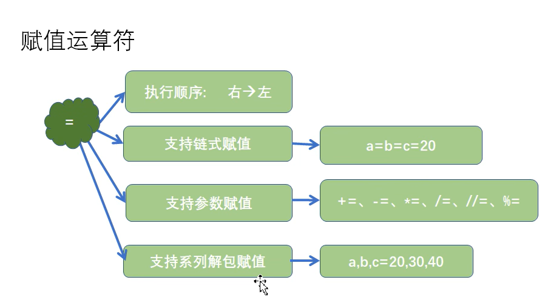

[TOC]


# 一、简介

> 一切皆对象

 


# 二、语法

## 1、print

> Python解释器，我滴超人
>
> - 就注意以下`字符串带引号`就完事了

 


### 1.1、输出到文件

```python
if __name__ == '__main__':
    print(11)
    print("11")
    # 左边参数文件路径不存在则创建文件	右边是覆盖方式
    fp=open('C:/Users/Lzo/Desktop/aa.txt', 'a')
    # 要有个file=fp
    print('niubi', file=fp)
    fp.close()
```


## 2、转义字符

> - \b：退格，33\b44 ——> 344
> - `不希望转移字符起作用`
>   - 在字符串的引号前加上r或者R，print(r"11\t22\n33\b44)

```python
print("11\t22\n33\b44")
print(r"11\t22\n33\b44")
print(R"11\t22\n33\b44")

# 输出:
11	22
344
11\t22\n33\b44
11\t22\n33\b44
```


## 3、保留字和标识符

> - 以下为保留字，我import keyword，然后打印keyword.kwlist找到的，蛮骚的
>   - ['False', 'None', 'True', 'and', 'as', 'assert', 'async', 'await', 'break', 'class', 'continue', 'def', 'del', 'elif', 'else', 'except', 'finally', 'for', 'from', 'global', 'if', 'import', 'in', 'is', 'lambda', 'nonlocal', 'not', 'or', 'pass', 'raise', 'return', 'try', 'while', 'with', 'yield']


### 3.1、变量

> - 变量 = 对象的地址 = 引用
> - 变量三个组成部分：标识(内存地址，盲猜逻辑地址(bushi...))、类型、值
> - 变量名赋值其实是`地址赋值`

 

 

> 下图，方便理解
>
>  


## 4、数据类型

 


### 4.1、整数类型

 

```python
    print(type(-1))
    print('十进制', 118)
    print('二进制', 0b1010111)
    print('八进制', 0o176)
    print('十六进制', 0x1EAF)
    
# 输出
<class 'int'>
十进制 118
二进制 87
八进制 126
十六进制 7855
```


### 4.2、浮点类型

> - 使用`浮点数进行计算`的时候，可能会出现`小数位数不确定`的情况
>   - 解决办法：`导入模块decimal`

 


```python
    from decimal import Decimal
	print(type(3.14159))
    print('普通加法：1,1+' + '2.2=')
    print(1.1+2.2)
    print('导入模块Decimal后：1,1+' + '2.2=')
    print(Decimal('1.1') + Decimal('2.2'))
    
# 输出
<class 'float'>
普通加法：1,1+2.2=
3.3000000000000003
导入模块Decimal后：1,1+2.2=
3.3
```


### 4.3、布尔类型

> - 数据类型为`bool`
> - TRUE可以当成整形1用；FALSE可以当成0用

 


### 4.4、字符串类型

> - 三引号定义的字符串可以分布在连续的多行

 


### 4.5、类型转换

> - str()
> - int()
>   - 小数字符串无法转换为int
> - float()

 


## 5、注释

```python
    # 注释可以这样写
    '''也可以
        这样写'''
```

 


## 6、输入函数input()

```python
abc = input('你想要什么礼物呢？')
print(abc)
ccc = int(input('输入一个整数: '))
print(ccc)
    
# 输出
你想要什么礼物呢？你
你
1
1
```

 


## 7、运算符

### 7.1、算术运算符

> //（整除运算）:
>  10 // 3 = 3
>
> 
>
> **（幂运算）：
>
> 2**3 = 2^3 = 8
>
> 
>
> - 注意正负数运算的特别之处
>   - 取整运算时，一正一负向下取整
>   - 求余时，余数 = 被除数 - 除数*商（商为整除的值）

 


### 7.2、赋值运算符

> - 注意//= 和 **=
> - 链式赋值：a=b=c=20时，abc的id都是一样的（同一个对象）
> - 系列解包赋值：对应位置赋值和赋引用
>   - 因此交换值就有个骚操作，a,b=b,a（交换ab的值）

 


### 7.3、比较运算符

> - ==：对象的value的比较
> - is，is not：变量id的比较，是否指向同一对象

  


### 7.4、布尔运算符

> - in和not in
>   -  

 


`

`

`

`

`

`
