[TOC]


## 1、翻转数组

学下新方法异或操作

```javascript
var arr = ['1', '2', '3', '4', '5', true];//true实际值为1
var length = arr.length;
var times = (length - 1) / 2;//这一步很妙，因为长度为4和5的数组经历的交换次数都是2,而6,7经历地交换次数都是3

//加法交换位置
for (let i = 0; i < times; i++) {
    arr[i] = arr[i] + arr[length - i - 1];
    arr[length - i - 1] = arr[i] - arr[length - i - 1];
    arr[i] = arr[i] - arr[length - i - 1];
}

//利用异或交换位置
//这玩意优势就是可以交换各种数据类型
for (let i = 0; i < times; i++) {
    arr[i] = arr[i] ^ arr[length - i - 1];
    arr[length - i - 1] = arr[i] ^ arr[length - i - 1];
    arr[i] = arr[i] ^ arr[length - i - 1];
}
console.log(arr);
```


## 2、打印当前具体日期时间

```javascript
//格式化日期 年月日
var date = new Date();
var year = date.getFullYear();
var month = date.getMonth() + 1;//加1，是因为返回的月份比实际小1
var dates = date.getDate();//返回的是号数
var arr = ['星期天', '星期一', '星期二', '星期三', '星期四', '星期五', '星期六'];
var day = date.getDay();//由于返回是数字，所以利用了上面的数组，返回的0代表星期天
console.log('今天是：' + year + '年' + month + '月' + dates + '日 ' + arr[day]);

//封装一个函数，返回当前的时分秒，格式 01:01:01
function getTime() {
    var time = new Date();
    var h = time.getHours();
    var m = time.getMinutes();
    var s = time.getSeconds();
    //下面的操作就是避免出现 1:2:3 这种情况，也就是为了好看点，前面补个0
    h = h < 10 ? '0' + h : h;
    m = m < 10 ? '0' + m : m;
    s = s < 10 ? '0' + s : s;
    
    return h + ':' + m + ':' + s;
}
console.log(getTime());

//获取当前的年月日，具体时间
console.log('今天是：' + year + '年' + month + '月' + dates + '日 ' + arr[day] + ' ' + getTime());
```


## 3、动态倒计时

> 这是个计算倒计时的封装函数，下面是动态的应用

```javascript
// 倒计时函数
// 参数为允许输入的时间(规定的时间)
function countDown(time) {
    var nowTime = +new Date(); // 返回当前时间毫秒数
    var inputTime = +new Date(time); // 返回的是允许用户输入的总的毫秒数
    var times = (inputTime - nowTime) / 1000; // 得到当前时间的秒数
    var d = parseInt(times / 60 / 60 / 24); // 天
    d = d < 10 ? '0' + d : d;
    // 算法强啊，先除以3600得到应该差多少个小时，然后余24，满了24的就算到一天里面去，不满的就是差的小时，补上了一天，不到一天的那几个小时
    var h = parseInt(times / 60 / 60 % 24); // 时
    h = h < 10 ? '0' + h : h;
    // 跟算小时差不多，求出差多少个分钟，满了60分钟的算到小时去，分钟只计算不满一个小时的那几个分钟
    var m = parseInt(times / 60 % 60); // 分
    m = m < 10 ? '0' + m : m;
    // 爱了，直接计算不满一分钟的秒数
    var s = parseInt(times % 60); // 当前秒数
    s = s < 10 ? '0' + s : s;
    return d + '天' + h + '时' + m + '分' + s + '秒';
}
// 特别注意下面这个写法，参数写字符串，只要按照这个格式，它就会依次读取你的年月日，时分秒
console.log(countDown('2022-9-5 16:16:49'));

```


示例：

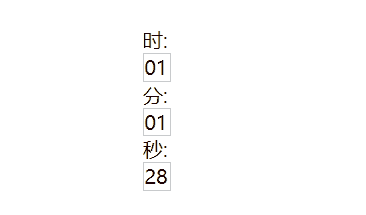 这玩意有时候对不上，多刷新几次吧


源码：

```html
<body>
    <div class="timeClock" style="margin-top: 100px;padding-left: 600px;">
    时:<div class="hour" style="border: 1px solid #ccc;width:20px;"></div>
    分:<div class="minute" style="border: 1px solid #ccc;width:20px;">2</div>
    秒:<div class="second" style="border: 1px solid #ccc;width:20px;">3</div>
    </div>
    <script>
        // 1.获取元素
        var hour = document.querySelector('.hour'); // 小时
        var minute = document.querySelector('.minute'); // 分钟
        var second = document.querySelector('.second'); // 秒数
        var inputTime = +new Date('2022-9-22 23:17:00'); // 返回的是允许用户输入的总的毫秒数
        countDown(); // 先调用一次，防止有空白，因为下面的定时器要等一秒才执行

        // 2.开启定时器，每隔一秒钟调用一次，刚好好像在倒计时一样
        setInterval(countDown, 1000)

        // 倒计时函数
        // 参数为允许输入的时间(规定的时间)
        function countDown() {
            var nowTime = +new Date(); // 返回当前时间毫秒数
            var times = (inputTime - nowTime) / 1000; // 得到当前时间的秒数
            var d = parseInt(times / 60 / 60 / 24); // 天
            d = d < 10 ? '0' + d : d;
            // 算法强啊，先除以3600得到应该差多少个小时，然后余24，满了24的就算到一天里面去，不满的就是差的小时，补上了一天，不到一天的那几个小时
            var h = parseInt(times / 60 / 60 % 24); // 时
            h = h < 10 ? '0' + h : h;
            // 跟算小时差不多，求出差多少个分钟，满了60分钟的算到小时去，分钟只计算不满一个小时的那几个分钟
            var m = parseInt(times / 60 % 60); // 分
            m = m < 10 ? '0' + m : m;
            // 爱了，直接计算不满一分钟的秒数
            var s = parseInt(times % 60); // 当前秒数
            s+=1; // 为了处理那一秒的误差 但是由于一定因素，偶尔还是会有误差，这玩意甚至跑的比现实时间快一秒
            if(60 == s)s=0;
            s = s < 10 ? '0' + s : s;

            hour.innerHTML = h;
            minute.innerHTML = m;
            second.innerHTML = s;
        }
    </script>
</body>
```


## 4、数组去重

```javascript
// 数组去重
function unique(arr) {
    var newArr = [];
    for (var i = 0; i < arr.length; i++) {
        // 遍历原数组，如果遍历的元素在newArr了就不放进去，如果不存在就push进去，保证相同的元素只能push一个
        if (newArr.indexOf(arr[i]) === -1) {
            newArr.push(arr[i]);
        }
    }
    return newArr;
}
```


## 5、求字符出现位置及次数

```javascript
// 查找某个字符出现的次数和位置
//str 目标字符串，c 查找的字符
function query(str, c) {
    var index = str.indexOf(c);
    var number = 0;
    while (-1 !== index) {
        number++;
        console.log('index:' + index);
        index = str.indexOf(c, index + 1);
    }
    console.log('number是' + number);
}
```


## 6、统计出现次数最多的字符

```javascript
// 判断字符串 'aassccaa' 中出现最多的字符，并统计其个数
//o.a = 4;
//o.s = 2;
//o.c = 2;
// 核心算法：利用charAt() 遍历这个数组
// 把每个字符都存储给对象，如果对象没有该属性，则为 1，如果有了则 加1
//遍历对象，得到最大值和字符
//@param str 遍历的字符串
function findMost(str) {
    //1.统计次数
    var obj = {};
    for (var i = 0; i < str.length; i++) {
        var chars = str.charAt(i); // chars 是字符串的每一个字符
        //判断对象obj是否有chars属性
        if (obj[chars]) { // 这里是判断是否存在属性chars
            obj[chars]++; // 这里则是给chars属性值++
        } else {
            obj[chars] = 1; // 这里是创建这个属性，属性名 chars 值 1
        }
    }
    console.log('统计结果如下');
    console.log(obj);

    //2.遍历对象
    var max = 0;
    var ch = ''
    for (var k in obj) {
        //k 得到的是属性名
        //o[k] 就是属性值
        if (obj[k] > max) {
            max = obj[k];
            ch = k;
        }
    }
    console.log('最多的字符：' + ch + '' + ' 次数为' + max);
}
findMost('dadwfafwafgafcaefxfrfwca');
```


## 7、不同时间段 不同问候语

好看喵~o( =∩ω∩= )m

```html
<body>
    <div><p>早上好呀</p></div>    

    <script>
        //1.获取元素
        var img = document.querySelector('img');
        var p = document.querySelector('div p');

        //2.得到当前小时数
        var date = new Date();
        var hour = date.getHours();
        //3.判断小时数改变图片文字信息
        if(hour < 10){
            img.src = 'images/morning.jpeg';
            p.innerHTML = 'buongiorno la mia principessa';
        }else if(hour < 18){
            img.src = 'images/noon.jpeg';
            p.innerHTML = '伸个懒腰，下午的太阳，暖暖的';
        }else {
            img.src = 'images/night.jpeg';
            p.innerHTML = '喵喵喵';
        }
    </script>
</body>
```


## 8、隐藏/显示密码

```html
    <style>
        @font-face {
        font-family: 'icomoon';
        src: url('../fonts/icomoon.eot?d0in8s');
        src: url('../fonts/icomoon.eot?d0in8s#iefix') format('embedded-opentype'),
             url('../fonts/icomoon.ttf?d0in8s') format('truetype'),
             url('../fonts/icomoon.woff?d0in8s') format('woff'),
             url('../fonts/icomoon.svg?d0in8s#icomoon') format('svg');
        font-weight: normal;
        font-style: normal;
        font-display: block;
        }

        .box {
            position: relative;
            width: 400px;
            border-bottom: 1px solid #ccc;
            margin: 100px auto;
        }

        .box input {
            width: 370px;
            height: 30px;
            border: 0;
            outline: none;
        }

        .box label {
            position: absolute;
            right: 10px;
            top: 10px;
        }
    </style>

<body>
    <div class="box">
        <input type="password" id="pwd">
        <label for="" ><a href='javascript:void(0)' id="eye" style="font-family: 'icomoon'; font-size: 18px; text-decoration: none ;color: #444444;"></a></label>
    </div>

    <script>
        // 1.获取元素
        var eye = document.getElementById('eye');
        var pwd = document.getElementById('pwd');
        // 2.注册事件
        var flag = 0;

        eye.onclick = function() {
            if(flag == 0){
                pwd.type = 'text';
                eye.innerHTML = '';
                flag = 1;
            } else {
                pwd.type = 'password';
                eye.innerHTML = '';
                flag = 0;
            }
        }


    </script>
</body>
```


## 9、点叉号元素消失

```html
    <style>
        i {
            font-style: normal;
        }

        .box {
            width: 300px;
            margin: 100px auto;
        }

        .box img {
            width: 300px;
        }
        .box i {
            display: block;
            background-color: #e3e5e7;
            width: 20px;
            padding-left: 5px;
        }
    </style>

<body>
    <div class="box">
        <i class="close-btn">×</i>
        
        
    </div>

    <script>
        // 1.获取元素
        var btn = document.querySelector('.close-btn');
        var box = document.querySelector('.box');
        
        // 2.注册事件 处理程序
        btn.onclick = function(){
            box.style.display = 'none';
        }

    </script>
</body>
```


## 10、点击隐藏文本内容

```html
 <!-- search模块 -->
 <div class="search">
     <input type="search" name="" id="" value="嘉然今天吃什么">
     <button></button>
 </div>        


<script>
      var input = document.querySelector('input');

      input.onfocus = function () {
          if (this.value === '嘉然今天吃什么')
              this.value = '';
          //获得焦点需要把文字框里面的颜色变黑
          this.style.color = '#333';
      }

      input.onblur = function () {
          if (this.value === '') {
              this.value = '嘉然今天吃什么';
          }
          this.style.color = '#62676e';
      }
</script>
```


## 11、密码框验证强度

```html
<li><label for="">登录密码：</label><input type="text" class="inp" placeholder="请保证6-14位，且包含大小写"id="pwd">
<span class="error" id='prompt'><i class="error_icon"></i> 密码不正确，请重新输入</span>
</li>

<script>
var inputAll = document.querySelectorAll('.inp');
var plhdArray = new Array(100);
var i = 0;
var inp = document.querySelector('#pwd');
var pmt = document.querySelector('#prompt');                

inputAll[i].onblur = function () {
    this.placeholder = '请保证6-14位，且包含大小写';
    //根据长度进行判断
    if (this.value.length < 6 || this.value.length > 14) {
        pmt.style.color = '#fa5a57';
        pmt.innerHTML = '&nbsp;&nbsp;&nbsp; 长度需保证在6-14位';
    } else {
        pmt.style.color = '#2ba833';
        pmt.innerHTML = '&nbsp;&nbsp;&nbsp; 密码输入正确';
    }
}
</script>
```


## 12、换肤效果

示例：

 


源码：

```html
    <style>
        * {
            padding: 0px;
            margin: 0px;
        }

        i {
            font-style: normal;
        }

        ul {
            list-style: none;
        }

        body {
            background: url(upload/star.png) no-repeat fixed left top;
            background-size: 300px;
        }

        .box {
            width: 400px;
            margin: 100px auto;
        }

        .box ul li img {
            width: 300px;
        }
        .box i {
            display: block;
            background-color: #e3e5e7;
            width: 20px;
            padding-left: 5px;
        }
    </style>

<body>
    <div class="box">
        <i class="close-btn">×</i>
        <ul class="bkgd">
            <li></li>
            <li></li>
            <li></li>
            <li></li>
            <li></li>
            <li></li>
        </ul>
        
    </div>

    <script>
        // 1.获取元素
        var btn = document.querySelector('.close-btn');
        var box = document.querySelector('.box');
        var imgs = document.querySelector('.bkgd').querySelectorAll('img');
        
        // 2.注册事件 处理程序
        btn.onclick = function(){
            box.style.display = 'none';
        }

        // 3.循环注册事件换肤
        alert(imgs.length)
        for(var i = 0; i < imgs.length; i++){
            console.log(i);
            imgs[i].onclick = function(){
                // this.src就是图片的路径
                //核心算法，还一个路径，就是换一张图片
                document.body.style.backgroundImage = 'url(' + this.src + ')';

            }
        }

    </script>
</body>
```


## 13、表单全选

样例：

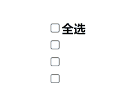 

源码： 

```html
<body>
<div class="wrap" style="margin: 100px 700px;">
        <table>
            <thead>
                <tr>
                    <th>
                        <input type="checkbox" id="j_cAll">
                    </th>
                    <th>全选</th>
                </tr>
            </thead>
            <tbody id="j_tb">
                <tr>
                    <td>
                        <input type="checkbox">
                    </td>
                </tr>
                <tr>
                    <td>
                        <input type="checkbox">
                    </td>
                </tr>
                <tr>
                    <td>
                        <input type="checkbox">
                    </td>
                </tr>

            </tbody>

        </table>

    </div>
    <script>
        // 1.全选和取消全选做法， 让下面的所有复选框的checked属性(选中状态)跟随 全选按钮就可以
        var j_cAll = document.getElementById('j_cAll');
        var j_tbs = document.getElementById('j_tb').getElementsByTagName('input');

        //注册事件
        j_cAll.onclick = function(){
            // this.checked就是当前复选框的选中状态， 选中就是true，未选中就是false
            for(var i = 0; i < j_tbs.length; i++){
                j_tbs[i].checked = this.checked;
            }
        }

        // 下面的复选框需要全部选中， 上面的全选就会选中，要是有一个不选中，其他就不会选中
        for(var i = 0; i < j_tbs.length; i++){
            j_tbs[i].onclick = function(){
                var flag = true;//控制是否被选中
                // 每次点击，检查去全部选中了吗
                for(var i = 0; i < j_tbs.length; i++){
                    // 但凡有一个没被选中，全选按钮就定为false
                    if(!j_tbs[i].checked){
                        flag = false;
                        break; // 退出循环 提高效率
                    }
                    j_cAll.checked = flag; 
                }
            }
        }

    </script>
</body>
```


## 14、tab栏切换

样例：

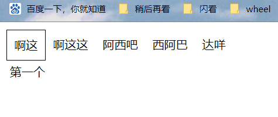 


源码：

```html
<head>
<style>
        * {
            padding: 0px;
            margin: 0px;
        }

        li {
            float: left;
            list-style: none;
            padding: 10px;
        }
        ul {
            margin-top: 10px;
            margin-left: 10px;
            overflow: hidden;
        }

        .tab_con {
            margin: 5px 15px;
        }

        .item{
            display: none;
        }

        .current {
            border: 1px solid #050505;
        }
    </style>
</head>

<body>
    <div class="tab">
        <div class="tab_list">
            <ul>
                <li class="current">啊这</li>
                <li>啊这这</li>
                <li>阿西吧</li>
                <li>西阿巴</li>
                <li>达咩</li>
            </ul>
        </div>
        <div class="tab_con">
            <div class="item" style="display: block;">第一个</div>
            <div class="item">第二个</div>
            <div class="item">第三个</div>
            <div class="item">第四个</div>
            <div class="item">第五个</div>
        </div>
    </div>

    <script>
        //但点击谁，谁就获取类名current，自带边框
        var tab_list = document.querySelector('.tab_list');
        var lis = tab_list.querySelectorAll('li');
        var items = document.querySelectorAll('.item');

        //绑定事件
        for(var i = 0; i < lis.length; i++){
            //给每个li设置自定义属性索引号，方便切换tab
            lis[i].setAttribute('data-index', i);//而你，我的自定义属性，你才是真正的英雄

            lis[i].onclick = function(){
                //排他思想，先去除所有的class再给点击的赋值为class
                for(var i = 0; i < lis.length; i++){
                    lis[i].className = ''; // 去除类名，有点东西
                }
                this.className = 'current';

                //下面显示的内容模块
                var index = this.getAttribute('data-index');
                //排他思想，先隐藏所有的display 再给需要的显示
                for(var i = 0; i < lis.length; i++){
                    items[i].style.display = 'none'; // 让其不显示了
                }
                items[index].style.display = 'block';
            }
        }
    </script>
</body>
```


## 15、用户发布/删除评论

样例：

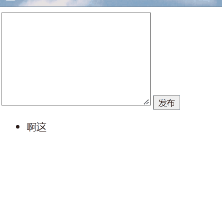 


源码：

```html
<body>
    <textarea name="" id="" cols="30" rows="10"></textarea>
    <button>发布</button>
    <ul>
        <li>啊这</li>
    </ul>

<script>
        // 1. 获取元素
        var btn = document.querySelector('button');
        var text = document.querySelector('textarea');
        var ul = document.querySelector('ul');

        // 2.注册事件
        btn.onclick = function(){
            if('' === text.value){
                alert('您当前没有输入内容');
                return false;
            }

            // (1) 创建元素
            var li = document.createElement('li');
            // 把值给li，再添加
            li.innerHTML = text.value + '&nbsp;&nbsp;&nbsp; <a href="javascript:void(0);">删除</a>';//添加删除按钮
            
            // (2) 添加元素
            //贴吧
            //ul.appendChild(li);
            //b站
            ul.insertBefore(li, ul.children[0]);

            // (3) 删除元素 删除的是父元素，li
            var as = document.querySelectorAll('a');//获取元素数组
            for(var i = 0; i < as.length; i++){
                as[i].onclick = function(){
                    // node.removeChild(child) child是指当前a所在的li，即this.parentNode
                    ul.removeChild(this.parentNode);
                }
            }
            //发布完，再删除value的内容
            text.value = '';
        }
    </script>
</body>
```


## 16、动态生成表格

样例：

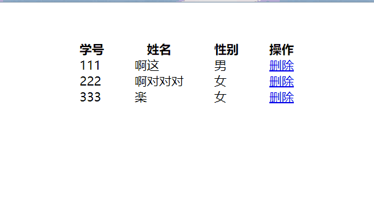 数据可以从后台读出来，并**按照指定格式输入表格**


源码：

```html
    <style>
        th,
        td {
            padding: 0 20px;
        }
    </style>

<body>
    <table cellspacing = "0" style="margin: 50px auto;">
        <thead>
            <tr>
                <th>学号</th>
                <th>姓名</th>
                <th>性别</th>
                <th>操作</th>
            </tr>
        </thead>
        <tbody>

        </tbody>
    </table>

    <script>
        // 1.先准备数据
        var datas = [{
            num: 111,
            name: '啊这',
            sex: '男'
        },{
            num: 222,
            name: '啊对对对',
            sex: '女'
        },{
            num: 333,
            name: '楽',
            sex: '女'
        }];

        // 2.往tbody里面创建行，有几个人，创建几行(数组的长度)
        var tbody = document.querySelector('tbody');
        for(var i = 0; i < datas.length; i++){
            //创建tr行
            var tr = document.createElement('tr');
            tbody.appendChild(tr);

            // 往行里面创建单元格 td 单元格的数量取决于每个对象属性的个数，for循环遍历对象
            for(var k in datas[i]){ // 里面的for循环管td
                // 创建单元格  
                var td = document.createElement('td');
                // 把对象的属性值赋值给 td
                // 访问对象的属性用k，访问对象属性的值用 obj[k]
                td.innerHTML = datas[i][k];
                tr.appendChild(td); 
            }

            // 3.创建带有删除功能的单元格
            var td = document.createElement('td');
            td.innerHTML = '<a href="javascript:void(0)" style="cursor:pointer; ">删除</a>';
            tr.appendChild(td);
        }

        // 4，删除操作开始
        var as = document.querySelectorAll('a');
        for(var i = 0; i < as.length; i++){
            as[i].onclick = function(){
                // node.removeChild(child) child是指当前a所在的li，即this.parentNode
                tbody.removeChild(this.parentNode.parentNode);
            }
        }


    </script>
</body>
```


## 17、跟随鼠标的Mickey

样例：

 牛逼plus


原码：

```html
<body>
    

    <script>
        // 1.这个思路是这样的：监听器注册的事件是鼠标移动
        // 当你鼠标移动了，获取它的坐标
        // 把图片移动到坐标那里去，并且启用绝对定位，美汁汁
        var img = document.querySelector('img');
        document.addEventListener('mousemove', function(e){
            // 2.获取坐标后 把坐标作为img的top left值
            var x = e.pageX;
            var y = e.pageY;
            // 3.千万不要忘记添加px了，因为获取的坐标只是数值，top需要的单位是px的
            img.style.left = x - 45 + 'px'; // 下面我之所以对获取的坐标进行加减 就是为了图片能在鼠标的中间，这个你自己看着就好
            img.style.top = y - 40 + 'px';
        });
    </script>
```


## 18、按下某个键，聚焦搜索框

样例：

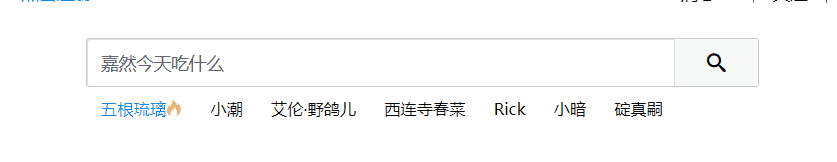 按了下s键，直接唤起搜索框


原码：

```javascript
// 核心思路：检测用户是否按下了 s 键，如果按下s键，就把光标定在搜索框里面
// 利用keyCode进行判断
// 搜索框获取焦点： 使用js 的focus()方法
// 此处建议keyup而不是keyon，因为后者会把s输入到搜索框里面
document.addEventListener('keyup', function (e) {
    if (e.keyCode == 83) {
        input.focus();
    }
});
```


## 19、京东快递单号查询

样例：

> 两个细节，输入框失去焦点时候，上面的也消失了，回来的时候，上面的内容还在

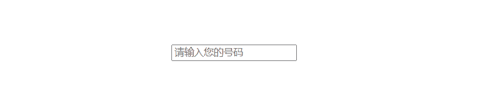 


源码：

```html
    <div class="search" style="position:relative;margin-top: 100px;margin-left: 600px">
        <div class="con" style="position:absolute;bottom:28px;border: 1px solid #626365;width: 165px;font-size: 18px;display: none;"></div>
        <input type="text" placeholder="请输入您的号码" class="num">
    </div>

    <script>
        // 快递单号输入内容时，给其添加键盘响应事件
        // 同时把input里面的value获取过来赋值给 上面的盒子作为内容
        // 如果快递号为空，就把上面的盒子隐藏起来
        var con = document.querySelector('.con');
        var num_input = document.querySelector('.num');

        // 此处不要使用keydown，因为keydown事件响应的时候是你按下一个键的时候
        // 按下键(keydown)->键盘内容输入到表格->键弹起(keyup)
        // keydown 响应了，但是内容还没输入进去呢，它读个屁
        num_input.addEventListener('keyup', function(){
            // 有内容显示，没内容none掉
            if('' == this.value){
                con.style.display = 'none';
            }else{
                con.style.display = 'block';
                con.innerHTML = this.value;
            }
        });

        // 失去焦点，隐藏盒子
        // 获得焦点，再显示
        num_input.addEventListener('blur', function(e){
            con.style.display = 'none';
        });
        num_input.addEventListener('focus', function(e){
            if('' !== this.value){
                con.style.display = 'block';
            }
        });
    </script>
</body>
```


## 20、发送短信

样例：

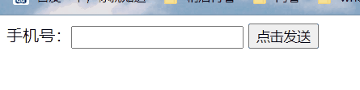 


源码：

```html
<body>
    手机号：<input type="number"> <button>点击发送</button>
    <script>
        // 按钮点击以后，就会把disabled 改为true
        // 同时按钮里面的内容会变化， 利用innerHTML修改
        // 里面秒数会变化，利用倒计时
        // 定义一个变量在定时器里面不断递减
        // 当递减到了0，停止计时器，恢复定时器的状态
        var btn = document.querySelector('button');
        var time = 60;
        btn.addEventListener('click', function(){
            btn.disabled = true;
            var timer = setInterval(function(){
                if(0 == time){
                    // 去除定时器
                    clearInterval(timer);
                    //复原按钮
                    btn.disabled = false;
                    btn.innerHTML = '点击发送';
                    time = 60; // 重新为60
                }else{
                    btn.innerHTML = '还剩'+ time +'秒';
                    time--;
                }
            }, 1000);
        });
    </script>
</body>
```


## 21、自动跳转界面

样例：

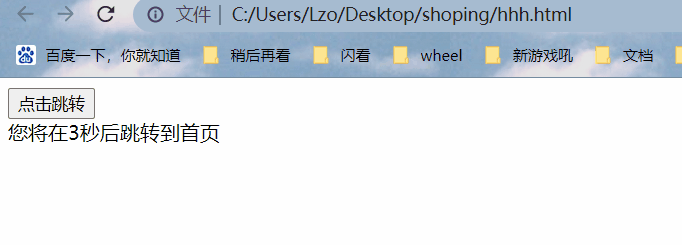 


源码：

```html
<body>
    <button>点击跳转</button>
    <div></div>
    <script>
        var btn = document.querySelector('button');
        var div = document.querySelector('div');
        var time = 5;
        move(); // 先调用一次，免得出现空档期

        btn.addEventListener('click', function(){
            location.href = 'https://www.baidu.com/?tn=02003390_75_hao_pg';
        })

        function move(){
            if(0 == time){
                location.href = 'https://www.baidu.com/?tn=02003390_75_hao_pg';
            }
            div.innerHTML = '您将在'+ time +'秒后跳转到首页';
            time--;
        }
        setInterval(move, 1000);

    </script>
</body>
```


## 22、拖动的模糊动态框

> 我觉着这个可以在登录界面用一下，以及在那个发弹幕和评论没登录的时候 duang出来
>

样例：

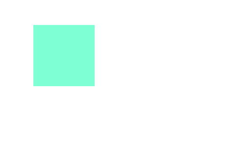 

源码：

```html
<body>
    <div class="box" style="position:absolute;top: 100px;left: 100px;background-color: aquamarine;width:100px;height: 100px;"></div>

    <script>
        // 第一，获取鼠标在页面中的坐标pageX/pageY
        // 第二，获取盒子在页面中的距离offsetLeft/offsetTop
        // 用鼠标的坐标距离减去盒子的坐标距离 就是鼠标在盒子中的距离
        var box = document.querySelector('.box');

        // (1) 获取鼠标在页面的坐标
        box.addEventListener('mousedown', function(e){
            var x = e.pageX - this.offsetLeft;
            var y = e.pageY - this.offsetTop;

            function move(e){
                box.style.cursor = 'move'; // 换个小手
                box.style.left = e.pageX - x + 'px';
                box.style.top = e.pageY - y + 'px';
            }

            // (2)鼠标移动的时候，把鼠标页面内的坐标减去 鼠标在盒子中的坐标就是模态框的top和left值了
            document.addEventListener('mousemove', move) // 细节，函数不能带括号，不能输入参数

            // (3)鼠标弹起，就移除鼠标事件
            document.addEventListener('mouseup', function(){
                document.removeEventListener('mousemove', move);
                box.style.cursor = 'default'; // 换个小手
            })
        })

    </script>
</body>
```


## 23、固定侧边栏

> mainTop也是如此
>

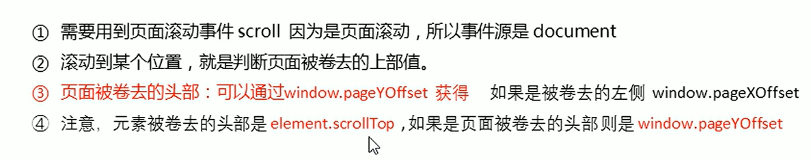  


样例：

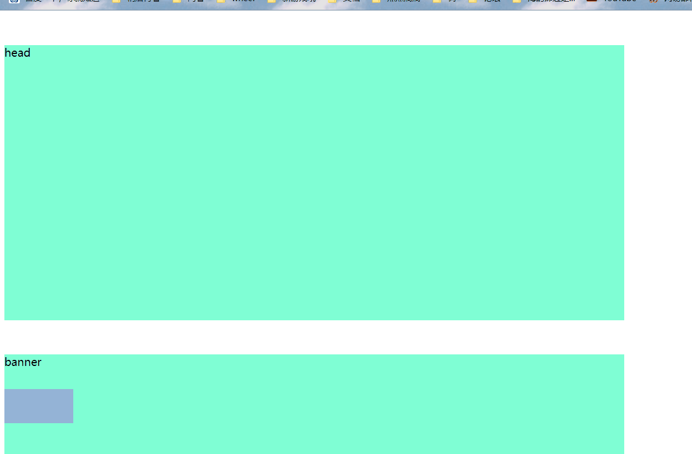 


源码：

```html
<body>
    <div class="slider_bar" style="width: 100px;height:50px;background-color: #95b3d6;position: absolute; top: 550px;">
        <span class="goBack" style="position: absolute;display:none;">返回顶部</span>
    </div>
    <div class='header' style="width: 900px;height: 400px;background-color:aquamarine;margin-top: 50px;">head</div>
    <div class='banner' style="width: 900px;height: 400px;background-color:aquamarine;margin-top: 50px;">banner</div>
    <div class='main' style="width: 900px;height: 800px;background-color:aquamarine;margin-top: 50px;">main</div>  
    <script>
        var sliderbar = document.querySelector('.slider_bar');
        var banner = document.querySelector('.banner'); 
        var bannerTop = banner.offsetTop; // 获取banner初始的offsetTop值，当划到bannerTop的时候就改定位
        var sliderbarTop = sliderbar.offsetTop - bannerTop; // 获取导航相对于banner的距离
        var main = document.querySelector('.main');
        var goBack = document.querySelector('.goBack');
        var mainTop = main.offsetTop;

        // 获取scroll事件
        document.addEventListener('scroll', function(){
            // 当页面的被卷去的头部大于等于bannerTop时，此事，侧边栏就要改为固定点位了
            if(window.pageYOffset >= bannerTop){
                sliderbar.style.position = 'fixed';
                sliderbar.style.top = sliderbarTop + 'px'; // 此处记得offset系列，获取的是数值不带单位
            }else{
                sliderbar.style.position = 'absolute';
                sliderbar.style.top = '550px';
            }

            if(window.pageYOffset >= mainTop){
                goBack.style.display = 'block';
            }else{  
                goBack.style.display = 'none';
            }
        })

    </script>
</body>
```


## 24、用户每次登录记录用户名

样例：

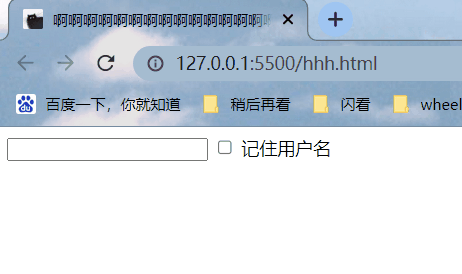 


源码：

```html
<body>
    <input type="text" id="username"> <input type="checkbox" name='' id="remember"> 记住用户名
    <script>
        var username = document.querySelector('#username');
        var remember  = document.querySelector('#remember');
        // 如果有本地存储的用户名，就直接放到input的value里面去
        if(localStorage.getItem('username')){
            username.value = localStorage.getItem('username');
            remember.checked = true;
        }

        // 点击记住用户名 存储到localStorage里面去
        remember.addEventListener('change', function(){
            // 如果是勾选(第一次点击)的话，就存储进去，如果取消(第二次点击)的话，就去除，反复
            if(this.checked){
                localStorage.setItem('username', username.value);
            }else {
                localStorage.removeItem('username');
            }
        })
    </script>
</body>
```


## 25、放大镜效果

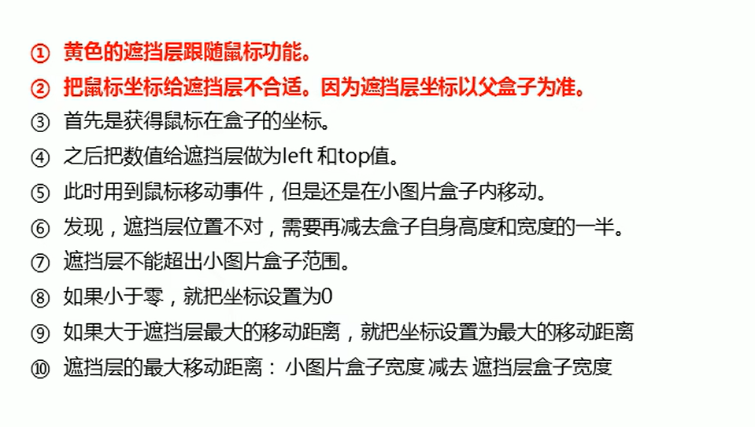 

> 记得是大图片在盒子里面移动，所以加上要记得*乘以-1*

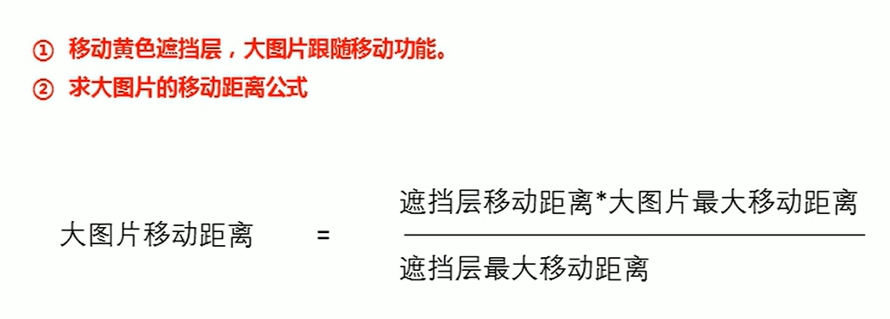 

样例：

 

> 记得引入JS文件
>
> style自己记得写到内部样式表去

**HTML：**

```html
<body>
    <div class="preview_img" style="position:relative;width: 231px;">
        
        <div class="mask" style="position:absolute;top:0;left:0;width: 150px;height: 150px;background-color:#8bb2d3;opacity: .4;border: 1px solid #ccc;cursor: move;"></div>
        <div class="big" style="position:absolute;top:0;left: 235px;width: 300px;height:300px;border:1px solid #ccc;overflow:hidden;z-index: 9999;">
            
        </div>

    </div>
</body>
```

**JS**

```javascript
window.addEventListener('load', function () {
    var preview_img = this.document.querySelector('.preview_img');
    var mask = this.document.querySelector('.mask');
    var big = this.document.querySelector('.big');
    var bigImg = this.document.querySelector('.bigImg');

    // 1.当鼠标经过preview_img的时候，隐藏 mask遮挡层 和 big大盒子
    preview_img.addEventListener('mouseover', function () {
        mask.style.display = 'block';
        big.style.display = 'block';
    });
    preview_img.addEventListener('mouseout', function () {
        mask.style.display = 'none';
        big.style.display = 'none';
    })
    // 盒子跟随鼠标移动
    preview_img.addEventListener('mousemove', function (e) {
        // 1、先计算出鼠标在盒子的坐标
        // 2、此处注意看盒子的父盒子是否有定位，因为offset需要看定位
        var x = e.pageX - this.offsetLeft;
        var y = e.pageY - this.offsetTop;
        var maskX = x - mask.offsetWidth / 2; // maskX/Y的坐标可以等价为mask左上角顶点的在父盒子的坐标(根据最后赋值的结果来看)
        var maskY = y - mask.offsetHeight / 2;
        var maskXMax = preview_img.offsetWidth - mask.offsetWidth; // mask水平最大移动距离
        var maskYMax = preview_img.offsetHeight - mask.offsetHeight; // mask竖直最大移动距离

        if (maskX <= 0) {
            maskX = 0; // 左边相贴的时候(即将移出去)，保持此坐标
        } else if (maskX >= maskXMax) {
            maskX = maskXMax; // 图片右侧相贴的时候，就保持这个距离了
        }
        if (maskY <= 0) {
            maskY = 0; // 上边相贴的时候(即将移出去)，保持此坐标
        } else if (maskY >= maskYMax) {
            maskY = maskYMax; // 图片下侧相贴的时候，就保持这个距离了
        }
        mask.style.left = maskX + 'px'; // -mask.offset / 2（盒子宽高的一半）为了居中效果
        mask.style.top = maskY + 'px';

        // 大图移动的距离 = 大图的最大移动距离 * 遮挡层移动距离 / 遮挡层最大移动距离
        var bigXMax = bigImg.offsetWidth - big.offsetWidth; // 大图片水平最大移动距离
        var bigX = bigXMax * maskX / maskXMax; // 大图片水平移动距离
        var bigYMax = bigImg.offsetHeight - big.offsetHeight; // 大图片竖直最大移动距离
        var bigY = bigYMax * maskY / maskYMax; // 大图片竖直移动距离

        bigImg.style.left = -1 * bigX + 'px';
        bigImg.style.top = -1 * bigY + 'px';
    })
})
```


## 26、侧边栏滑动动画

样例：

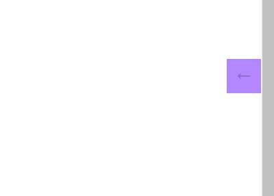 


源码：

**head**

```html
    <style>
        * {
            margin: 0;
            padding: 0;
        }

        body {
            height: 1000px;
        }
        .sliderbar{
            position: fixed;
            right: 0;
            margin-top: 200px;
            height: 40px;
            line-height: 40px;
            cursor: pointer;
        }

        span{
            display: block;
            background-color: #b388ff;
            width: 40px;
            text-align: center;
        }

        .con {
            /* 这个定位和top/left的值的设置相当于让这个盒子跟span的右侧完全对齐 */
            position: absolute;
            top: 0;
            left: 0;
            /* 设置好了宽度con的字体就不会竖直显示了 */
            width: 84px;
            background-color: #fad534;
            padding: 0 10px;
            z-index: -1;
        }
    </style>
    <!-- 引入js文件 -->
    <script src="js/animate.js"></script>
```

**body**

```html
<body>
    <div class="sliderbar">
        <span>←</span>
        <div class="con">联系客服</div>
    </div>

    <script>
        var sliderbar = document.querySelector('.sliderbar');
        var con = document.querySelector('.con');
        
        // 当鼠标经过 sliderbar 就会让 con这个盒子滑动到左侧
        // 当鼠标离开 sliderbar 就会让 con这个盒子滑动到右侧
        sliderbar.addEventListener('mouseenter', function(){
            animate(con, -84, function(){
                sliderbar.children[0].innerHTML = '→';
            });
        })
        sliderbar.addEventListener('mouseleave', function(){
            animate(con, 0, function(){
                sliderbar.children[0].innerHTML = '←';
            });
        })

    </script>
</body>
```

**JS**

```javascript
// 缓慢动画原理
// 1.让盒子移动的距离依次减小，速度便慢慢落下来
// 2.核心算法：(目标值 - 现在的位置) / 10 作为每次移动的距离 步长
// 3.停止条件：当前盒子的距离等于目标的距离
function animate(obj, target, callback) {
    clearInterval(obj.timer);
    obj.timer = setInterval(function () {
        obj.step = (target - obj.offsetLeft) / 10;
        // 注意取整，正数往大的取整，负数往小的取整
        obj.step = obj.step > 0 ? Math.ceil(obj.step) : Math.floor(obj.step);
        if (obj.offsetLeft == target) {
            // 停止动画，本质去除定时器
            clearInterval(obj.timer);

            //回调函数放到定时器结束里面
            if (callback) {
                callback();
            }
        }
        // 看到下面的left就明白 输入的元素需要带有绝对定位/相对定位啊
        obj.style.left = obj.offsetLeft + obj.step + 'px';
    }, 15); // 15是个好东西
}
```


## 27、轮播图

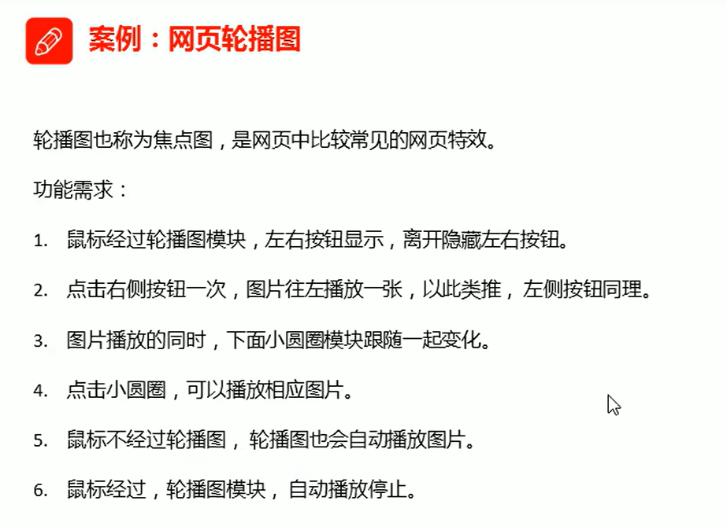 

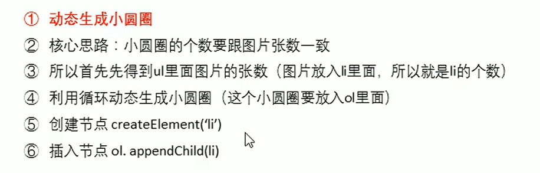 

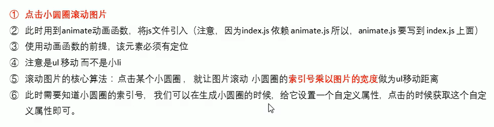 

 

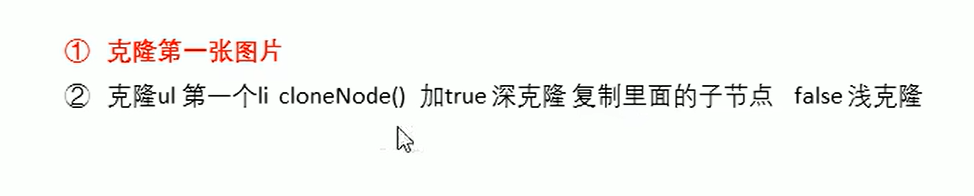 

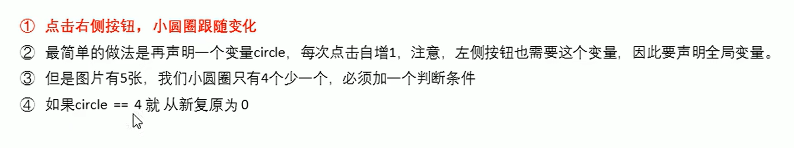 

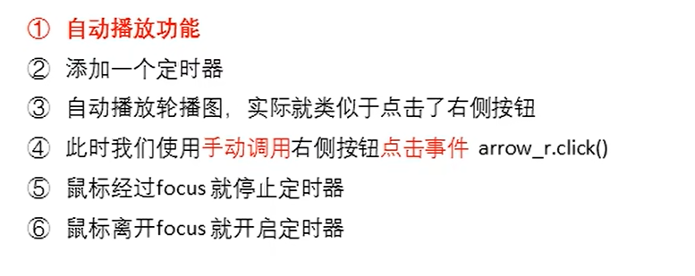 

样例：

 


## 28、手风琴案例

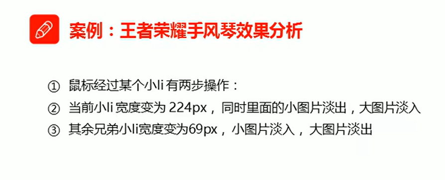 

示例：

 


源码：

```html
    <script src="js/jQuery.min.js"></script>
    <style>
        li {
            list-style: none;
        }
        
        a {
            text-decoration: none;
        }
        
        li {
            position: relative;
            float: left;
            margin-left: 20px;
            width: 145px;
            height: 155px;
        }
        
        .small {
            position: absolute;
            top: 0;
            left: 0;
        }
        
        .big {
            display: none;
        }
        
        .current {
            width: 317px;
        }
        
        .current .big {
            display: block;
        }
        
        .current .small {
            display: none;
        }
    </style>
    <script type="text/javascript">
        $(function() {
            // 鼠标经过小li，会发生两步操作
            $("li").mouseenter(function() {
                // 1.当前小li变为317px，同时，里面的小图片淡出，大图片淡入
                // 记得加上stop
                $(this).stop().animate({
                    width: 317
                }).find(".small").stop().fadeOut().siblings(".big").stop().fadeIn();
                // 2.其余图片的大小都是145px，小图片淡入，大图片淡出
                $(this).siblings("li").stop().animate({
                    width: 145
                }).find(".small").stop().fadeIn().siblings(".big").stop().fadeOut();
            })

        })
    </script>


<div class="shoufengqin">
        <ul>
            <li class="current">
                <a href="#">
                    
                    
                </a>
            </li>
            <li>
                <a href="#">
                    
                    
                </a>
            </li>
            <li>
                <a href="#">
                    
                    
                </a>
            </li>
            <li>
                <a href="#">
                    
                    
                </a>
            </li>
            <li>
                <a href="#">
                    
                    
                </a>
            </li>
        </ul>
    </div>
```


## 29、toDolist

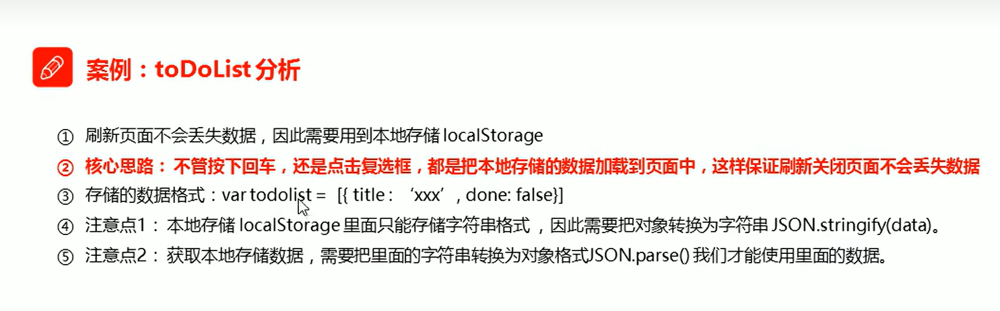 

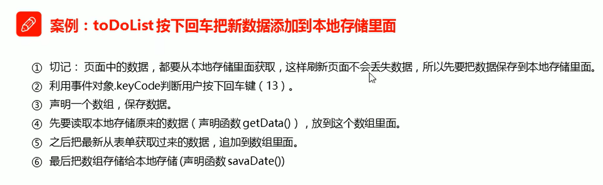 

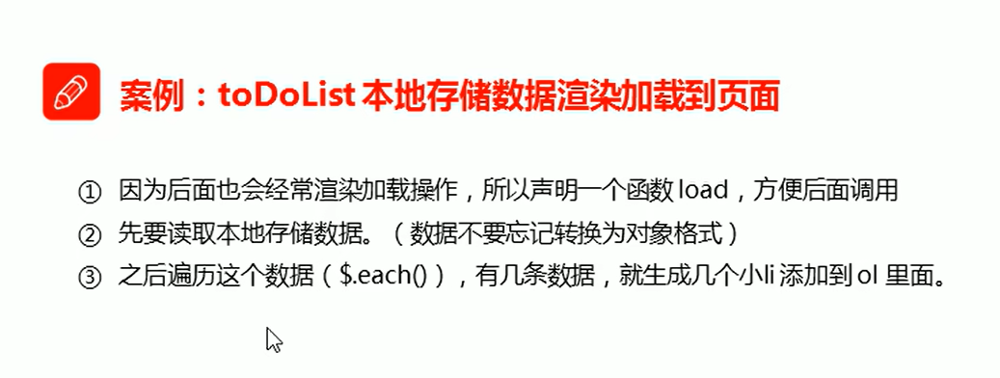 


