[TOC]


bootstrap的码

```html
 <meta charset="UTF-8">
 <!-- 要求当前网页使用IE浏览器最高版本的内核来渲染 -->
 <meta http-equiv="X-UA-Compatible" content="IE=egde">
 <!-- 视口的设置:视口的宽度和设备一致，默认的缩放比例和PC端一致，用户不能自行缩放 -->
 <!-- [if lt IE 9] -->
     <meta name="viewport" content="width=device-width, initial-scale=1.0, user-scalable=0">
     <!-- 解决了IE9以下浏览器对HTML5新增标签不识别，并导致CSS不起作用的问题 -->
     <script src="https://oss.maxcdn.com/html5shiv/3.7.2/html5shiv.min.js"></script>
     <script src="https://oss.maxcdn.com/respond/1.4.2/respond.min.js"></script>
 <!-- [endif] -->
```

初始化的码

```css
html,body,ul,li,ol,dl,dd,dt,p,h1,h2,h3,h4,h5,h6,form,fieldset,legend,img{margin:0;padding:0;}
```


以下若有内部样式表的CSS代码，建议新建CSS文件，使用外部样式表

## 1、注册界面

<!DOCTYPE html>
<html lang="en">
<head>
    <meta charset="UTF-8">
    <meta http-equiv="X-UA-Compatible" content="IE=edge">
    <meta name="viewport" content="width=device-width, initial-scale=1.0">
    <title>注册界面</title>
</head>
<body>
    <h4>请输入你的相关信息</h4>
    <table>
        <tr>
            <td>性别&nbsp;&nbsp;&nbsp;&nbsp;&nbsp;&nbsp;&nbsp;&nbsp;&nbsp;&nbsp;&nbsp;&nbsp;&nbsp;</td>
            <td>
                <input type="radio" name="sex" id="Man"><label for="Man">绅士</label>
                <input type="radio" name="sex" id="Woman"><label for="Woman">淑女</label>
                <input type="radio" name="sex" id="Robert" checked="checked"><label for="Robert">机器人</label>
            </td>
        </tr>
        <tr>
            <td>生日</td>
            <td>
                <select>
                    <option selected="selected">--请选择年份--</option>
                    <option>去年</option>
                    <option>今年</option>
                </select>
                <select>
                    <option selected="selected">--请选择月份--</option>
                    <option>上个月</option>
                    <option>这个月</option>
                </select>
                <select>
                    <option selected="selected">--请选择天数--</option>
                    <option>昨天</option>
                    <option>今天</option>
                </select>
            </td>
        </tr>
        <tr>
            <td><label for="now-area">所在地区</label>&nbsp;&nbsp;&nbsp;&nbsp;&nbsp;&nbsp;&nbsp;&nbsp;&nbsp;&nbsp;&nbsp;</td>
            <td><input type="text" value="火星留学中..." id="now-area"></td>
        </tr>
        <tr>
            <td>婚姻状况</td>
            <td>
                <input type="radio" name="married-situation" id="not-married" checked="checked"><label for="not-married">未婚</label>
                <input type="radio" name="married-situation" id="already-married"><label for="already-married">已婚</label>
                <input type="radio" name="married-situation" id="divorce"><label for="divorce">离婚</label>
            </td>
        </tr>
        <tr>
            <td><label for="educational-background">学历情况</label></td>
            <td><input type="text" value="KTV嘎嘎炫果盘" id="educational-background"></td>
        </tr>
        <tr>
            <td>性格</td>
            <td>
                <input type="checkbox" name="character" id="juanwangzhidanxin"><label for="juanwangzhidanxin">完了我绩点只有4.98了</label>
                <input type="checkbox" name="character" id="zhuangnmne"><label for="zhuangnmne">害我昨天也没复习</label>
                <input type="checkbox" name="character" id="juangouzhidanxin"><label for="juangouzhidanxin">完了他不会考试做出来了吧</label>
                <input type="checkbox" name="character" id="good-boy"><label for="good-boy">不会的没关系尽力就行</label>
                <input type="checkbox" name="character" id="hape"><label for="hape">这波必拿下</label>
                <input type="checkbox" name="character" id="kuaileshuijiaowang"><label for="kuaileshuijiaowang">嘎嘎睡大觉</label>
                <input type="checkbox" name="character" id="jiwangzhidanding"><label for="jiwangzhidanding">开摆咯</label>
                <input type="checkbox" name="character" id="nb"><label for="nb">卧槽今天考试吗</label>
            </td>
        </tr>
        <tr>
            <td>自我介绍</td>
            <td><textarea id="self-introduce">介绍一下你自己吧...</textarea></td>
        </tr>
        <tr>
            <td></td>
            <td>
                <form>
                <input type="submit" value="立即注册">&nbsp;&nbsp;&nbsp;&nbsp;&nbsp;&nbsp;<a href="#">我是会员，立即登录</a><br />
                <input type="checkbox" id="register"><label for="register">我同意注册条款和相关标准</label>
                </form>
            </td>
        </tr>
    </table>
</body>
</html>
### 样例


### 源码

```html
<!DOCTYPE html>
<html lang="en">
<head>
    <meta charset="UTF-8">
    <meta http-equiv="X-UA-Compatible" content="IE=edge">
    <meta name="viewport" content="width=device-width, initial-scale=1.0">
    <title>注册界面</title>
</head>
<body>
    <h4>请输入你的相关信息</h4>
    <table>
        <tr>
            <td>性别&nbsp;&nbsp;&nbsp;&nbsp;&nbsp;&nbsp;&nbsp;&nbsp;&nbsp;&nbsp;&nbsp;&nbsp;&nbsp;</td>
            <td>
                <input type="radio" name="sex" id="Man"><label for="Man">绅士</label>
                <input type="radio" name="sex" id="Woman"><label for="Woman">淑女</label>
                <input type="radio" name="sex" id="Robert" checked="checked"><label for="Robert">机器人</label>
            </td>
        </tr>
        <tr>
            <td>生日</td>
            <td>
                <select>
                    <option selected="selected">--请选择年份--</option>
                    <option>去年</option>
                    <option>今年</option>
                </select>
                <select>
                    <option selected="selected">--请选择月份--</option>
                    <option>上个月</option>
                    <option>这个月</option>
                </select>
                <select>
                    <option selected="selected">--请选择天数--</option>
                    <option>昨天</option>
                    <option>今天</option>
                </select>
            </td>
        </tr>
        <tr>
            <td><label for="now-area">所在地区</label>&nbsp;&nbsp;&nbsp;&nbsp;&nbsp;&nbsp;&nbsp;&nbsp;&nbsp;&nbsp;&nbsp;</td>
            <td><input type="text" value="火星留学中..." id="now-area"></td>
        </tr>
        <tr>
            <td>婚姻状况</td>
            <td>
                <input type="radio" name="married-situation" id="not-married" checked="checked"><label for="not-married">未婚</label>
                <input type="radio" name="married-situation" id="already-married"><label for="already-married">已婚</label>
                <input type="radio" name="married-situation" id="divorce"><label for="divorce">离婚</label>
            </td>
        </tr>
        <tr>
            <td><label for="educational-background">学历情况</label></td>
            <td><input type="text" value="KTV嘎嘎炫果盘" id="educational-background"></td>
        </tr>
        <tr>
            <td>性格</td>
            <td>
                <input type="checkbox" name="character" id="juanwangzhidanxin"><label for="juanwangzhidanxin">完了我绩点只有4.98了</label>
                <input type="checkbox" name="character" id="zhuangnmne"><label for="zhuangnmne">害我昨天也没复习</label>
                <input type="checkbox" name="character" id="juangouzhidanxin"><label for="juangouzhidanxin">完了他不会考试做出来了吧</label>
                <input type="checkbox" name="character" id="good-boy"><label for="good-boy">不会的没关系尽力就行</label>
                <input type="checkbox" name="character" id="hape"><label for="hape">这波必拿下</label>
                <input type="checkbox" name="character" id="kuaileshuijiaowang"><label for="kuaileshuijiaowang">嘎嘎睡大觉</label>
                <input type="checkbox" name="character" id="jiwangzhidanding"><label for="jiwangzhidanding">开摆咯</label>
                <input type="checkbox" name="character" id="nb"><label for="nb">卧槽今天考试吗</label>
            </td>
        </tr>
        <tr>
            <td>自我介绍</td>
            <td><textarea id="self-introduce">介绍一下你自己吧...</textarea></td>
        </tr>
        <tr>
            <td></td>
            <td>
                <form>
                <input type="submit" value="立即注册">&nbsp;&nbsp;&nbsp;&nbsp;&nbsp;&nbsp;<a href="#">我是会员，立即登录</a><br />
                <input type="checkbox" id="register"><label for="register">我同意注册条款和相关标准</label>
                </form>
            </td>
        </tr>
    </table>
</body>
</html>
```


## 2、新闻界面

<!DOCTYPE html>
<html lang="en">
<head>
    <meta charset="UTF-8">
    <meta http-equiv="X-UA-Compatible" content="IE=edge">
    <meta name="viewport" content="width=device-width, initial-scale=1.0">
    <title>新闻界面</title>
    <link rel="stylesheet" href="news.css">
    <style>
        body {
            font: 16px/26px "Microsoft Yahei";
        }
        h1 {
            /* 修改标题文字的粗细 */
            font-weight: 500;
            text-align: center;
        }
        a {
            text-decoration: none;
        }
        .search {
            color: #666666;
            width: 130px;
        }
        .searchButton {
            color: black;
            font-weight: 550;
        }
        p {
            text-indent: 2em;
        }
        .nav {
            color: #888888;
            font-size: 14px;
            text-align: center;
        }
        .pic {
            /* 图片居中对齐 */
            text-align: center;
        }
        .footer {
            color: #888888;
            font-size: 14px;
        }
    </style>
</head>
<body>
    <h1>这样回复 暖深圳天气一整天</h1>

    <div class="nav">
        2022-8-25 11:24:31 来源：<a href="#">蓝瘦香菇网</a>
        &nbsp;&nbsp;&nbsp;&nbsp;<input type="text" value="请输入搜索的内容..." class="search"> <button class="searchButton">搜索</button>
    </div>
​    <!-- 水平线标签 -->
​    <hr>

    <p>据@深圳天气消息，目前深圳罗湖区、南山区、福田区、盐田区、大鹏新区、西部海区、东部海区和宝安区（福永、西乡、新安、航城街道）雷雨大风黄色预警已生效，上述地区1-2小时内最大阵风7-8级，并伴有强雷电。</p>

​    <!-- 把图片放到p标签的作用：因为我们目前只能操作文本居中对齐，那么我们直接让img继承p，使得p居中对齐，依次让img也跟着居中对齐 -->
​    <p class="pic">
​        
​    </p>

    <h4 class="msg"><strong>深圳分区雷雨大风预警＋全市雷电预警生效中！海上又有动静，未来几天天气不容乐观！</strong></h4>
    
    <p>深圳市气象台2022年08月08日08时20分发布罗湖区、南山区、福田区、盐田区、大鹏新区、西部海区、东部海区和宝安区（福永、西乡、新安、航城街道）雷雨大风黄色预警，预计上述地区1-2小时内最大阵风7-8级，并伴有强雷电。大家注意防雷，记得带伞！</p>
    
    <p class="footer">本文来源：蓝瘦香菇网&reg; 责任编辑：反正不是z95</p>
</body>
</html>

### 样例


### 源码

```html
<!DOCTYPE html>
<html lang="en">
<head>
    <meta charset="UTF-8">
    <meta http-equiv="X-UA-Compatible" content="IE=edge">
    <meta name="viewport" content="width=device-width, initial-scale=1.0">
    <title>新闻界面</title>
    <link rel="stylesheet" href="news.css">
    <style>
        body {
            font: 16px/26px "Microsoft Yahei";
        }
        h1 {
            /* 修改标题文字的粗细 */
            font-weight: 500;
            text-align: center;
        }
        a {
            text-decoration: none;
        }
        .search {
            color: #666666;
            width: 130px;
        }
        .searchButton {
            color: black;
            font-weight: 550;
        }
        p {
            text-indent: 2em;
        }
        .nav {
            color: #888888;
            font-size: 14px;
            text-align: center;
        }
        .pic {
            /* 图片居中对齐 */
            text-align: center;
        }
        .footer {
            color: #888888;
            font-size: 14px;
        }
    </style>
</head>
<body>
    <h1>这样回复 暖深圳天气一整天</h1>


    <div class="nav">
        2022-8-25 11:24:31 来源：<a href="#">蓝瘦香菇网</a>
        &nbsp;&nbsp;&nbsp;&nbsp;<input type="text" value="请输入搜索的内容..." class="search"> <button class="searchButton">搜索</button>
    </div>

    <!-- 水平线标签 -->

    <hr>


    <p>据@深圳天气消息，目前深圳罗湖区、南山区、福田区、盐田区、大鹏新区、西部海区、东部海区和宝安区（福永、西乡、新安、航城街道）雷雨大风黄色预警已生效，上述地区1-2小时内最大阵风7-8级，并伴有强雷电。</p>

    <!-- 把图片放到p标签的作用：因为我们目前只能操作文本居中对齐，那么我们直接让img继承p，使得p居中对齐，依次让img也跟着居中对齐 -->

    <p class="pic">
        
    </p>


    <h4 class="msg"><strong>深圳分区雷雨大风预警＋全市雷电预警生效中！海上又有动静，未来几天天气不容乐观！</strong></h4>

    <p>深圳市气象台2022年08月08日08时20分发布罗湖区、南山区、福田区、盐田区、大鹏新区、西部海区、东部海区和宝安区（福永、西乡、新安、航城街道）雷雨大风黄色预警，预计上述地区1-2小时内最大阵风7-8级，并伴有强雷电。大家注意防雷，记得带伞！</p>

    <p class="footer">本文来源：蓝瘦香菇网&reg; 责任编辑：反正不是z95</p>

</body>
</html>
```


## 3、花里胡哨导航栏

亮点就是，

链接的范围扩大了

放到不同的链接，背景图和颜色都会变

### 样例

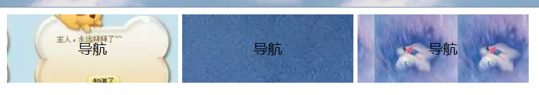 

 

 

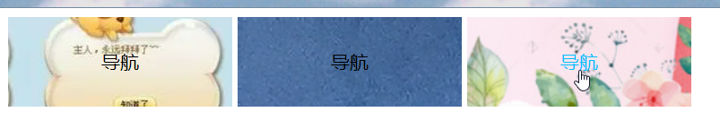 

### 源码

```html
<!DOCTYPE html>
<html lang="en">

<head>
    <meta charset="UTF-8">
    <meta http-equiv="X-UA-Compatible" content="IE=edge">
    <meta name="viewport" content="width=device-width, initial-scale=1.0">
    <title>导航</title>
    <style>
        .nav a {
            width: 200px;
            height: 80px;
            font-size: 17px;
            font-weight: 400;
            color: black;
            text-align: center;
            line-height: 80px;
            display: inline-block;
            text-decoration: none;
        }

        .nav .bg1 {
            background-image: url(img/bg1.jpg);
            background-repeat: repeat-x;
            background-position: 20px center;
        }

        .nav .bg2 {
            background-image: url(img/bg2.jpg);
            background-repeat: no-repeat;
            /* background-position: 20px center; */
        }

        .nav .bg3 {
            background-image: url(img/bg3.jpg);
            background-repeat: repeat-x;
            background-position: 20px center;
        }

        .nav .bg1:hover {
            color: aliceblue;
            background-image: url(img/bg1x.jpg);
            background-repeat: no-repeat;
            background-position: center;
        }

        .nav .bg2:hover {
            color: rgb(52, 169, 97);
            background-image: url(img/bg2x.png);
            background-repeat: no-repeat;
            background-position: center;
        }

        .nav .bg3:hover {
            color: deepskyblue;
            background-image: url(img/bg3x.png);
            background-repeat: no-repeat;
            background-position: center -250px;
        }
    </style>

</head>

<body>
    <div class="nav">
        <a href="#" class="bg1">导航</a>
        <a href="#" class="bg2">导航</a>
        <a href="#" class="bg3">导航</a>
    </div>
</body>

</html>
```


## 4、平平无奇导航栏

### 样例

亮点就是我放在了长的标签，背景变色也长一点，放在短的标签，背景变色也短一点

而实现这个效果就靠了**padding的设置会增大盒子的宽高的特性**，下面我设置了左右上下边距为固定的，里面的字体长度不一致，会使得盒子也被朝着左右撑开，所以鼠标放上去，变化的背景颜色也会大一点


 

 

### 源码

```html
<!DOCTYPE html>
<html lang="en">

<head>
    <meta charset="UTF-8">
    <meta http-equiv="X-UA-Compatible" content="IE=edge">
    <meta name="viewport" content="width=device-width, initial-scale=1.0">
    <title>新浪导航</title>
    <style>
        .nav {
            height: 41px;
            border-top: 3px solid #00aee8;
            border-bottom: 1px solid #edeef0;
            background-color: #fcfcfc;
            text-align: left;
            line-height: 41px;

        }

        .nav a {
            /* 需要转换为行内块元素才有高啊 */
            display: inline-block;
            height: 41px;
            text-decoration: none;
            color: #4c4c4c;
            font-size: 400;
            font-weight: 400;
            font-family: "Mcirofost Yahei";
            padding: 0px 20px;
        }

        .nav a:hover {
            color: #00aee8;
            background-color: #edeef0;
        }
    </style>
</head>

<body>
    <div class="nav">
        <a href="#">新浪导航</a>
        <a href="#">手机新浪网</a>
        <a href="#">移动客户端</a>
        <a href="#">微博</a>
        <a href="#">时事</a>
    </div>
</body>

</html>
```


## 5、好康的物品模块

### 样例


### 源码

```html
<!DOCTYPE html>
<html lang="zh-CN">

<head>
    <meta charset="UTF-8">
    <meta http-equiv="X-UA-Compatible" content="IE=edge">
    <meta name="viewport" content="width=device-width, initial-scale=1.0">
    <title>物品模块</title>
    <style>
        * {
            /* 设置了浏览器自带的边距为0 margin: 0; */
            padding: 0;
        }

        body {
            background-color: #f5f5f5;
        }

        .box {
            width: 298px;
            height: 490px;
            background-color: #fff;
            /* 块级盒子水平居中 */
            margin: 100px auto;
        }

        .box img {
            height: 300px;
            /* 宽度和父亲一样宽，就不会出现遗漏了 */
            width: 100%;
        }

        .review {
            font-size: 20px;
            height: 60px;
            /* 由于p没有width属性，所以不会撑开盒子，不需要修改盒子的宽度 */
            padding: 0 18px;
            /* 由于已经设置了高度，再用内边距设置高度，可能会撑开设置，所以这里使用了外边距 */
            margin-top: 20px;
        }

        .praise {
            font-size: 14px;
            color: #b0b0b0;
            padding: 0 5px 0 180px;
        }

        .info {
            font-size: 13.5px;
            font-family: "Microsoft Yahei";
            margin-top: 20px;
            padding: 0 20px;
        }

        .info a {
            text-decoration: none;
            color: #333;
        }

        .info span {
            color: #0c84f5;
        }

        .info em {
            font-style: normal;
            color: #ebe4e0;
            margin: 0 4px 0 45px;
        }

        .info a:hover {
            color: #00aee8;
        }
    </style>
</head>

<body>
    <div class="box">
        
        <p class="review" style="font-family: 楷体;">来自一场天空的旅行，我在太阳升起的那一端等你。</p>
        <div class="praise">—— 追风的小孩</div>
        <div class="info">
            <a href="#">欢迎订购云梦城一日游...</a>
            <em>|</em>
            <span>已售1张</span>
        </div>
    </div>
</body>

</html>
```


## 6、疯狂星期四商品快报

### 样例

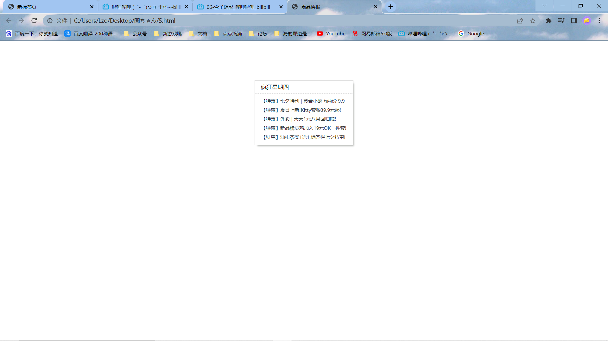

### 源码

```html
<!DOCTYPE html>
<html lang="zh-CN">

<head>
    <meta charset="UTF-8">
    <meta http-equiv="X-UA-Compatible" content="IE=edge">
    <meta name="viewport" content="width=device-width, initial-scale=1.0">
    <title>商品快报</title>
    <style>
        * {
            margin: 0;
            padding: 0;
        }

        .box {
            width: 248px;
            height: 163px;
            border: 1px solid #ccc;
            margin: 100px auto;
            /* 小阴影，整挺好 */
            box-shadow: 4px 5px 4px -4px #b4b6b3;
        }

        .box h3 {
            height: 32px;
            border-bottom: 1px dotted #ccc;
            font-size: 14px;
            font-weight: 400;
            line-height: 32px;
            padding-left: 15px;
        }

        /* 统一写法，实际开发经常去掉列表的特殊标志 */
        li {
            list-style: none;
        }

        .box ul li {
            height: 23px;
            line-height: 23px;
            padding-left: 16px;
        }

        .box ul {
            margin-top: 5px;
        }

        .box ul li a {
            display: inline-block;
            width: 100%;
            height: auto;
            font-size: 12px;
            color: #303234;
            text-decoration: none;
        }

        .box ul li a:hover {
            color: #e80d27;
        }
    </style>
</head>

<body>
    <div class="box">
        <h3>疯狂星期四</h3>
        <ul>
            <li><a href="#">【特惠】七夕特刊 | 黄金小酥肉两份 9.9</a></li>
            <li><a href="#">【特惠】夏日上新!Kitty套餐39.9元起!</a></li>
            <li><a href="#">【特惠】外卖 | 天天1元八月回归啦!</a></li>
            <li><a href="#">【特惠】新品脆皮鸡加入19元OK三件套!</a></li>
            <li><a href="#">【特惠】油柑茶买1送1,标签栏七夕特惠!</a></li>
        </ul>
    </div>
</body>

</html>
```


## 7、商品栏目模块

利用了浮动点的模块

### 左导航右图片

> **效果：**
>
> 
>
> 
>
> 
>
> **示例：**
>
> ```html
> <!DOCTYPE html>
> <html lang="zh-CN">
> 
> <head>
>     <meta charset="UTF-8">
>     <meta http-equiv="X-UA-Compatible" content="IE=edge">
>     <meta name="viewport" content="width=device-width, initial-scale=1.0">
>     <title>Document</title>
>     <style>
>         * {
>             margin: 0;
>             padding: 0;
>         }
> 
>         .box {
>             width: 1200px;
>             height: 460px;
>             background-color: antiquewhite;
>             margin: 0 auto;
>         }
> 
>         .left {
>             width: 230px;
>             height: 462px;
>             background-color: aqua;
>             float: left;
>         }
> 
>         .right {
>             width: 970px;
>             height: 460px;
>             background-color: aquamarine;
>             float: left;
>         }
>     </style>
> </head>
> 
> <body>
>     <div class="box">
>         <div class="left">左侧</div>
>         <div class="right">右侧</div>
>     </div>
> </body>
> 
> </html>
> ```

### 横向排列

> **效果：**
>
> 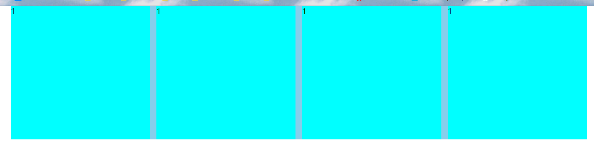
>
> 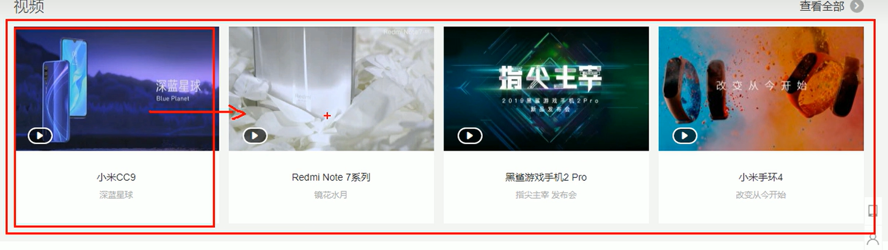
>
> 
>
> **源码：**
>
> ```html
> <!DOCTYPE html>
> <html lang="zh-CN">
> 
> <head>
>     <meta charset="UTF-8">
>     <meta http-equiv="X-UA-Compatible" content="IE=edge">
>     <meta name="viewport" content="width=device-width, initial-scale=1.0">
>     <title>Document</title>
>     <style>
>         * {
>             margin: 0;
>             padding: 0;
>         }
> 
>         .box {
>             width: 1226px;
>             height: 285px;
>             background-color: skyblue;
>             margin: 0 auto;
>         }
> 
>         li {
>             list-style: none;
>         }
> 
>         .box li {
>             width: 296px;
>             height: 285px;
>             background-color: aqua;
>             margin-right: 14px;
>             float: left;
>         }
> 
>         /* 设置右外边距为0，元素就不会掉下来了 */
>         /* 并且注意权重的问题 */
>         .box .last {
>             margin-right: 0;
>         }
>     </style>
> </head>
> 
> <body>
>     <ul class="box">
>         <li>1</li>
>         <li>1</li>
>         <li>1</li>
>         <li class="last">1</li>
>     </ul>
> </body>
> 
> </html>
> ```


### 左大图右系列小图

> **效果：**
>
> 
>
> 
>
> 
>
> **源码：**
>
> ```html
> <!DOCTYPE html>
> <html lang="zh-CN">
> 
> <head>
>     <meta charset="UTF-8">
>     <meta http-equiv="X-UA-Compatible" content="IE=edge">
>     <meta name="viewport" content="width=device-width, initial-scale=1.0">
>     <title>Document</title>
>     <style>
>         * {
>             margin: 0;
>             padding: 0;
>         }
> 
>         .box {
>             width: 1226px;
>             height: 615px;
>             background-color: antiquewhite;
>             margin: 0 auto;
>         }
> 
>         .left {
>             float: left;
>             width: 234px;
>             height: 615px;
>             background-color: skyblue;
>         }
> 
>         .right {
>             float: left;
>             width: 992px;
>             height: 615px;
>             background-color: #519aba;
>         }
> 
>         /* 子代选择器，这么设置是为了防止影响到div盒子里面的div */
>         .right>div {
>             width: 234px;
>             height: 300px;
>             background-color: #b6e76fff;
>             float: left;
>             /* 这里的左外边距就是因为我盒子都往右边挤压，刚好可以填充右边多的部分 */
>             margin-left: 14px;
>             margin-bottom: 14px;
>         }
>     </style>
> </head>
> 
> <body>
>     <div class="box">
>         <div class="left">左</div>
>         <div class="right">
>             <div>1</div>
>             <div>2</div>
>             <div>3</div>
>             <div>4</div>
>             <div>5</div>
>             <div>6</div>
>             <div>7</div>
>             <div>8</div>
>         </div>
>     </div>
> </body>
> 
> </html>
> ```
>
> 


### 常用布局

> 效果：
>
> 
>
> 
>
> 
>
> **源码**
>
> ```html
> <!DOCTYPE html>
> <html lang="zh-CN">
> 
> <head>
>     <meta charset="UTF-8">
>     <meta http-equiv="X-UA-Compatible" content="IE=edge">
>     <meta name="viewport" content="width=device-width, initial-scale=1.0">
>     <title>常见网页布局</title>
>     <style>
>         * {
>             margin: 0;
>             padding: 0;
>         }
> 
>         .top {
>             height: 50px;
>             background-color: darkgray;
>         }
> 
>         .banner {
>             width: 980px;
>             height: 150px;
>             background-color: darkgray;
>             margin: 10px auto;
>         }
> 
>         li {
>             list-style: none;
>         }
> 
>         .box {
>             width: 980px;
>             margin: 0 auto;
>             height: 300px;
>             background-color: aqua;
>         }
> 
>         .box li {
>             float: left;
>             width: 237px;
>             height: 300px;
>             background-color: darkgrey;
>             margin-right: 10px;
>         }
> 
>         .box .last {
>             margin-right: 0;
>         }
> 
>         /* 和top一样，不需要指定宽度和浏览器一样宽就可以了 */
>         .footer {
>             height: 200px;
>             background-color: darkgray;
>             margin-top: 10px;
>         }
>     </style>
> </head>
> 
> <body>
>     <div class="top">top</div>
>     <div class="banner">banner</div>
>     <div class="box">
>         <ul>
>             <li>1</li>
>             <li>2</li>
>             <li>3</li>
>             <li class="last">4</li>
>         </ul>
>     </div>
>     <div class="footer">footer</div>
> </body>
> 
> </html>
> ```


## 8、视频播放网站

### 样例

有些亮点自己找^_^


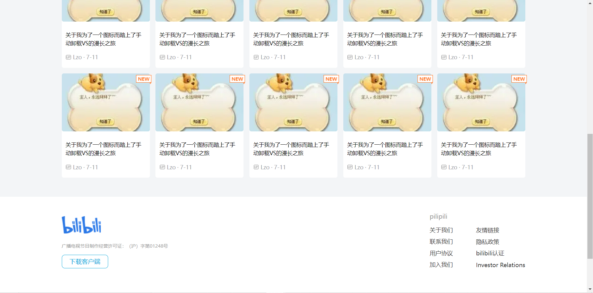


### 源码

#### HTML

> 先是HTML的
>
> ```html
> <!DOCTYPE html>
> <html lang="zh-CN">
> 
> <head>
>        <meta charset="UTF-8">
>        <meta http-equiv="X-UA-Compatible" content="IE=edge">
>        <meta name="viewport" content="width=device-width, initial-scale=1.0">
>        <title>pilipili干杯</title>
>        <link rel="stylesheet" href="7.css">
> </head>
> 
> <body>
>        <!-- 1.头部区域起始 -->
>        <div class="header w">
>            <!-- logo -->
>            <div class="logo">
>                <a href="#"></a>
>            </div>
>            <!-- nav -->
>            <div class="nav">
>                <ul>
>                    <li><a href="#">首页</a></li>
>                    <li><a href="#">叔叔我啊</a></li>
>                    <li><a href="#">达咩</a></li>
>                </ul>
>            </div>
>            <!-- 搜索框 -->
>            <div class="search">
>                <input type="text" placeholder="请输入搜索内容">
>                <button>
>                    <!-- 感谢噼里啪啦，居然通过这种方法送我图片 -->
>                    <svg width="18" height="48" viewBox="0 0 17 17" fill="none" xmlns="http://www.w3.org/2000/svg">
>                        <path fill-rule="evenodd" clip-rule="evenodd"
>                            d="M16.3451 15.2003C16.6377 15.4915 16.4752 15.772 16.1934 16.0632C16.15 16.1279 16.0958 16.1818 16.0525 16.2249C15.7707 16.473 15.4456 16.624 15.1854 16.3652L11.6848 12.8815C10.4709 13.8198 8.97529 14.3267 7.44714 14.3267C3.62134 14.3267 0.5 11.2314 0.5 7.41337C0.5 3.60616 3.6105 0.5 7.44714 0.5C11.2729 0.5 14.3943 3.59538 14.3943 7.41337C14.3943 8.98802 13.8524 10.5087 12.8661 11.7383L16.3451 15.2003ZM2.13647 7.4026C2.13647 10.3146 4.52083 12.6766 7.43624 12.6766C10.3517 12.6766 12.736 10.3146 12.736 7.4026C12.736 4.49058 10.3517 2.1286 7.43624 2.1286C4.50999 2.1286 2.13647 4.50136 2.13647 7.4026Z"
>                            fill="currentColor"></path>
>                    </svg>
>                </button>
>            </div>
>            <!-- 用户模块 -->
>            <div class="user">
>                
>                <a href="#">因为我是llllllzo!!!</a>
>            </div>
>        </div>
>        <!-- 清除浮动 -->
>        <div class="clear"></div>
>        <!-- 1.头部区域结束 -->
>        <!-- 2.banner部分开始 -->
>        <div class="banner">
>            <!-- 版心 -->
>            <div class="w">
>                <!-- 导航开始 -->
>                <div class="subnav">
>                    <ul>
>                        <li><a href="#">害隔这看二刺猿呢 <span> > </span></a></li>
>                        <li><a href="#">九敏真的会yue <span> > </span></a></li>
>                        <li><a href="#">点我高数及格 <span> > </span></a></li>
>                        <li><a href="#">前端杀我 <span> > </span></a></li>
>                        <li><a href="#">后端杀我 <span> > </span></a></li>
>                        <li><a href="#">好多要学啊 <span> > </span></a></li>
>                        <li><a href="#">数据结法与算构 <span> > </span></a></li>
>                        <li><a href="#">算法会谢论 <span> > </span></a></li>
>                        <li><a href="#">黑客入狱到入佛波勒 <span> > </span></a></li>
>                    </ul>
>                </div>
>                <!-- 导航结束 -->
> 
>                <!-- 历史记录开始 -->
>                <div class="record">
>                    <h2>历史记录</h2>
>                    <div class="bd">
>                        <ul>
>                            <li>
>                                <a href="#">继续观看 辣妹儿fucker</a>
>                                <p>观看进度:80%</p>
>                            </li>
>                            <li>
>                                <a href="#">继续观看 肚子好饿啊!</a>
>                                <p>观看进度:90%</p>
>                            </li>
>                            <li>
>                                <a href="#">继续观看 有无MM</a>
>                                <p>观看进度:72%</p>
>                            </li>
>                        </ul>
>                        <a href="#" class="allRecord">全部记录</a>
>                    </div>
>                </div>
>                <!-- 历史记录结束 -->
>            </div>
>        </div>
>        <!-- 清除浮动 -->
>        <div class="clear"></div>
>        <!-- 2.banner部分结束 -->
> 
>        <!-- 3.频道开始 -->
>        <div class="channel w">
>            <h3>频道推荐</h3>
>            <ul>
>                <li><a href="#">二刺猿</a></li>
>                <li><a href="#">鼠鼠来咯</a></li>
>                <li><a href="#">感觉不如..</a></li>
>                <li><a href="#">叫我靓仔</a></li>
>                <li><a href="#">让我康康！</a></li>
>            </ul>
>            <a href="#" class="allChannel">查看全部</a>
>        </div>
>        <!-- 清除浮动 -->
>        <div class="clear"></div>
>        <!-- 3.频道结束 -->
> 
>        <!-- 4.box核心区域开始 -->
>        <div class="box w">
>            <div class="box-hd">
>                <h3>推荐视频</h3>
>                <a href="#">查看更多</a>
>            </div>
>            <div class="box-bd">
>                <ul>
>                    <li>
>                        <a href="#" class="pictureLink">
>                            <div class="mask">
>                                <!-- 众所周知，码农的偷不叫偷 -->
>                                <svg width="228px" height="150px" fill="none" viewBox="0 -17 37 69">
>                                    <path
>                                        d="M10 10.693c0-1.7 0-2.549.354-3.013A1.729 1.729 0 0111.64 7c.582-.03 1.284.45 2.687 1.409l9.697 6.63c1.097.75 1.646 1.126 1.843 1.598.172.414.177.878.014 1.296-.187.476-.727.863-1.808 1.638l-9.697 6.945c-1.413 1.013-2.12 1.52-2.71 1.498a1.728 1.728 0 01-1.305-.67C10 26.877 10 26.007 10 24.268V10.693z"
>                                        fill="#f3f5f7"></path>
>                                </svg>
>                            </div>
>                            <em>
>                                
>                            </em>
>                            
>                        </a>
>                        <a href="#" class="title visit">
>                            关于我为了一个图标而踏上了手动卸载VS的漫长之旅
>                        </a>
>                        <div class="info">
>                            <a href="#" class="visit"> Lzo · 7-11</a>
>                        </div>
>                    </li>
>                    <li>
>                        <a href="#" class="pictureLink">
>                            <div class="mask">
>                                <!-- 众所周知，码农的偷不叫偷 -->
>                                <svg width="228px" height="150px" fill="none" viewBox="0 -17 37 69">
>                                    <path
>                                        d="M10 10.693c0-1.7 0-2.549.354-3.013A1.729 1.729 0 0111.64 7c.582-.03 1.284.45 2.687 1.409l9.697 6.63c1.097.75 1.646 1.126 1.843 1.598.172.414.177.878.014 1.296-.187.476-.727.863-1.808 1.638l-9.697 6.945c-1.413 1.013-2.12 1.52-2.71 1.498a1.728 1.728 0 01-1.305-.67C10 26.877 10 26.007 10 24.268V10.693z"
>                                        fill="#f3f5f7"></path>
>                                </svg>
>                            </div>
>                            <em>
>                                
>                            </em>
>                            
>                        </a>
>                        <a href="#" class="title visit">
>                            关于我为了一个图标而踏上了手动卸载VS的漫长之旅
>                        </a>
>                        <div class="info">
>                            <a href="#" class="visit"> Lzo · 7-11</a>
>                        </div>
>                    </li>
>                    <li>
>                        <a href="#" class="pictureLink">
>                            <div class="mask">
>                                <!-- 众所周知，码农的偷不叫偷 -->
>                                <svg width="228px" height="150px" fill="none" viewBox="0 -17 37 69">
>                                    <path
>                                        d="M10 10.693c0-1.7 0-2.549.354-3.013A1.729 1.729 0 0111.64 7c.582-.03 1.284.45 2.687 1.409l9.697 6.63c1.097.75 1.646 1.126 1.843 1.598.172.414.177.878.014 1.296-.187.476-.727.863-1.808 1.638l-9.697 6.945c-1.413 1.013-2.12 1.52-2.71 1.498a1.728 1.728 0 01-1.305-.67C10 26.877 10 26.007 10 24.268V10.693z"
>                                        fill="#f3f5f7"></path>
>                                </svg>
>                            </div>
>                            <em>
>                                
>                            </em>
>                            
>                        </a>
>                        <a href="#" class="title visit">
>                            关于我为了一个图标而踏上了手动卸载VS的漫长之旅
>                        </a>
>                        <div class="info">
>                            <a href="#" class="visit"> Lzo · 7-11</a>
>                        </div>
>                    </li>
>                    <li>
>                        <a href="#" class="pictureLink">
>                            <div class="mask">
>                                <!-- 众所周知，码农的偷不叫偷 -->
>                                <svg width="228px" height="150px" fill="none" viewBox="0 -17 37 69">
>                                    <path
>                                        d="M10 10.693c0-1.7 0-2.549.354-3.013A1.729 1.729 0 0111.64 7c.582-.03 1.284.45 2.687 1.409l9.697 6.63c1.097.75 1.646 1.126 1.843 1.598.172.414.177.878.014 1.296-.187.476-.727.863-1.808 1.638l-9.697 6.945c-1.413 1.013-2.12 1.52-2.71 1.498a1.728 1.728 0 01-1.305-.67C10 26.877 10 26.007 10 24.268V10.693z"
>                                        fill="#f3f5f7"></path>
>                                </svg>
>                            </div>
>                            <em>
>                                
>                            </em>
>                            
>                        </a>
>                        <a href="#" class="title visit">
>                            关于我为了一个图标而踏上了手动卸载VS的漫长之旅
>                        </a>
>                        <div class="info">
>                            <a href="#" class="visit"> Lzo · 7-11</a>
>                        </div>
>                    </li>
>                    <li>
>                        <a href="#" class="pictureLink">
>                            <div class="mask">
>                                <!-- 众所周知，码农的偷不叫偷 -->
>                                <svg width="228px" height="150px" fill="none" viewBox="0 -17 37 69">
>                                    <path
>                                        d="M10 10.693c0-1.7 0-2.549.354-3.013A1.729 1.729 0 0111.64 7c.582-.03 1.284.45 2.687 1.409l9.697 6.63c1.097.75 1.646 1.126 1.843 1.598.172.414.177.878.014 1.296-.187.476-.727.863-1.808 1.638l-9.697 6.945c-1.413 1.013-2.12 1.52-2.71 1.498a1.728 1.728 0 01-1.305-.67C10 26.877 10 26.007 10 24.268V10.693z"
>                                        fill="#f3f5f7"></path>
>                                </svg>
>                            </div>
>                            <em>
>                                
>                            </em>
>                            
>                        </a>
>                        <a href="#" class="title visit">
>                            关于我为了一个图标而踏上了手动卸载VS的漫长之旅
>                        </a>
>                        <div class="info">
>                            <a href="#" class="visit"> Lzo · 7-11</a>
>                        </div>
>                    </li>
>                    <li>
>                        <a href="#" class="pictureLink">
>                            <div class="mask">
>                                <!-- 众所周知，码农的偷不叫偷 -->
>                                <svg width="228px" height="150px" fill="none" viewBox="0 -17 37 69">
>                                    <path
>                                        d="M10 10.693c0-1.7 0-2.549.354-3.013A1.729 1.729 0 0111.64 7c.582-.03 1.284.45 2.687 1.409l9.697 6.63c1.097.75 1.646 1.126 1.843 1.598.172.414.177.878.014 1.296-.187.476-.727.863-1.808 1.638l-9.697 6.945c-1.413 1.013-2.12 1.52-2.71 1.498a1.728 1.728 0 01-1.305-.67C10 26.877 10 26.007 10 24.268V10.693z"
>                                        fill="#f3f5f7"></path>
>                                </svg>
>                            </div>
>                            <em>
>                                
>                            </em>
>                            
>                        </a>
>                        <a href="#" class="title visit">
>                            关于我为了一个图标而踏上了手动卸载VS的漫长之旅
>                        </a>
>                        <div class="info">
>                            <a href="#" class="visit"> Lzo · 7-11</a>
>                        </div>
>                    </li>
>                    <li>
>                        <a href="#" class="pictureLink">
>                            <div class="mask">
>                                <!-- 众所周知，码农的偷不叫偷 -->
>                                <svg width="228px" height="150px" fill="none" viewBox="0 -17 37 69">
>                                    <path
>                                        d="M10 10.693c0-1.7 0-2.549.354-3.013A1.729 1.729 0 0111.64 7c.582-.03 1.284.45 2.687 1.409l9.697 6.63c1.097.75 1.646 1.126 1.843 1.598.172.414.177.878.014 1.296-.187.476-.727.863-1.808 1.638l-9.697 6.945c-1.413 1.013-2.12 1.52-2.71 1.498a1.728 1.728 0 01-1.305-.67C10 26.877 10 26.007 10 24.268V10.693z"
>                                        fill="#f3f5f7"></path>
>                                </svg>
>                            </div>
>                            <em>
>                                
>                            </em>
>                            
>                        </a>
>                        <a href="#" class="title visit">
>                            关于我为了一个图标而踏上了手动卸载VS的漫长之旅
>                        </a>
>                        <div class="info">
>                            <a href="#" class="visit"> Lzo · 7-11</a>
>                        </div>
>                    </li>
>                    <li>
>                        <a href="#" class="pictureLink">
>                            <div class="mask">
>                                <!-- 众所周知，码农的偷不叫偷 -->
>                                <svg width="228px" height="150px" fill="none" viewBox="0 -17 37 69">
>                                    <path
>                                        d="M10 10.693c0-1.7 0-2.549.354-3.013A1.729 1.729 0 0111.64 7c.582-.03 1.284.45 2.687 1.409l9.697 6.63c1.097.75 1.646 1.126 1.843 1.598.172.414.177.878.014 1.296-.187.476-.727.863-1.808 1.638l-9.697 6.945c-1.413 1.013-2.12 1.52-2.71 1.498a1.728 1.728 0 01-1.305-.67C10 26.877 10 26.007 10 24.268V10.693z"
>                                        fill="#f3f5f7"></path>
>                                </svg>
>                            </div>
>                            <em>
>                                
>                            </em>
>                            
>                        </a>
>                        <a href="#" class="title visit">
>                            关于我为了一个图标而踏上了手动卸载VS的漫长之旅
>                        </a>
>                        <div class="info">
>                            <a href="#" class="visit"> Lzo · 7-11</a>
>                        </div>
>                    </li>
>                    <li>
>                        <a href="#" class="pictureLink">
>                            <div class="mask">
>                                <!-- 众所周知，码农的偷不叫偷 -->
>                                <svg width="228px" height="150px" fill="none" viewBox="0 -17 37 69">
>                                    <path
>                                        d="M10 10.693c0-1.7 0-2.549.354-3.013A1.729 1.729 0 0111.64 7c.582-.03 1.284.45 2.687 1.409l9.697 6.63c1.097.75 1.646 1.126 1.843 1.598.172.414.177.878.014 1.296-.187.476-.727.863-1.808 1.638l-9.697 6.945c-1.413 1.013-2.12 1.52-2.71 1.498a1.728 1.728 0 01-1.305-.67C10 26.877 10 26.007 10 24.268V10.693z"
>                                        fill="#f3f5f7"></path>
>                                </svg>
>                            </div>
>                            <em>
>                                
>                            </em>
>                            
>                        </a>
>                        <a href="#" class="title visit">
>                            关于我为了一个图标而踏上了手动卸载VS的漫长之旅
>                        </a>
>                        <div class="info">
>                            <a href="#" class="visit"> Lzo · 7-11</a>
>                        </div>
>                    </li>
>                    <li>
>                        <a href="#" class="pictureLink">
>                            <div class="mask">
>                                <!-- 众所周知，码农的偷不叫偷 -->
>                                <svg width="228px" height="150px" fill="none" viewBox="0 -17 37 69">
>                                    <path
>                                        d="M10 10.693c0-1.7 0-2.549.354-3.013A1.729 1.729 0 0111.64 7c.582-.03 1.284.45 2.687 1.409l9.697 6.63c1.097.75 1.646 1.126 1.843 1.598.172.414.177.878.014 1.296-.187.476-.727.863-1.808 1.638l-9.697 6.945c-1.413 1.013-2.12 1.52-2.71 1.498a1.728 1.728 0 01-1.305-.67C10 26.877 10 26.007 10 24.268V10.693z"
>                                        fill="#f3f5f7"></path>
>                                </svg>
>                            </div>
>                            <em>
>                                
>                            </em>
>                            
>                        </a>
>                        <a href="#" class="title visit">
>                            关于我为了一个图标而踏上了手动卸载VS的漫长之旅
>                        </a>
>                        <div class="info">
>                            <a href="#" class="visit"> Lzo · 7-11</a>
>                        </div>
>                    </li>
>                </ul>
>            </div>
>        </div>
>        <!-- 清除浮动 -->
>        <div class="clear"></div>
>        <!-- 4.box核心区域结束 -->
> 
>        <!-- 5.footer模块开始 -->
>        <div class="footer">
>            <div class="w">
>                <div class="footer_left">
>                    
>                    <p>广播电视节目制作经营许可证：（沪）字第01248号</p>
>                    <a href="#" class="app">下载客户端</a>
>                </div>
>                <div class="links">
>                    <dl>
>                        <dt>pilipili</dt>
>                        <dd><a href="#">关于我们</a></dd>
>                        <dd><a href="#">联系我们</a></dd>
>                        <dd><a href="#">用户协议</a></dd>
>                        <dd><a href="#">加入我们</a></dd>
>                    </dl>
>                    <dl>
>                        <dt id="link_title"></dt>
>                        <dd><a href="#">友情链接</a></dd>
>                        <dd><a href="#">隐私政策</a></dd>
>                        <dd><a href="#">bilibili认证</a></dd>
>                        <dd><a href="#">Investor Relations </a></dd>
>                    </dl>
>                </div>
>            </div>
>        </div>
>        <!-- 清除浮动 -->
>        <div class="clear"></div>
>        <!-- 5.footer模块结束 -->
> </body>
> 
> </html>
> ```

#### CSS

> 然后是CSS的
>
> ```CSS
> * {
>     margin: 0;
>     padding: 0;
> }
> 
> /* 这个类名使得指定的内容始终位于版心 */
> .w {
>     width: 1200px;
>     margin: auto;
> }
> 
> body {
>     background-color: #f3f5f7;
> }
> 
> /* 清除浮动 */
> .clear {
>     clear: both;
> }
> 
> /* .header区域起始 */
> .header {
>     height: 48px;
>     /* 这里必须设置左右margin为auto，是因为这里的margin离得更近会层叠上面的margin，
>     如果你仅仅设置30px，那么div盒子的左右也会变成30px，而不能居中对齐 */
>     margin: 30px auto;
> }
> 
> .logo {
>     /* logo不加浮动下面的nav也不能浮动 */
>     float: left;
>     width: 120px;
>     height: 48px;
>     margin-left: 10px;
> }
> 
> a {
>     text-decoration: none;
>     color: #050505;
> }
> 
> li {
>     list-style: none;
> }
> 
> .nav {
>     float: left;
>     margin-left: 40px;
> }
> 
> .nav ul li {
>     float: left;
>     margin: 0 15px;
> }
> 
> .nav ul li a {
>     /* 改为块级元素，能显示高度 */
>     display: block;
>     height: 48px;
>     padding: 0 10px;
>     /* 行高等于元素的高度，居中 */
>     line-height: 48px;
>     font-size: 18px;
> }
> 
> .nav ul li a:hover {
>     border-bottom: 2px solid #01a4da;
>     /* background-color: #01a4da; */
>     color: #01a4da;
> }
> 
> .search {
>     /* 一浮全浮 */
>     float: left;
>     width: 412px;
>     height: 48px;
>     margin-left: 90px;
> }
> 
> .search input {
>     /* 为了解决input和button行内块元素两者靠近时默认带间隙的问题添加浮动 */
>     float: left;
>     width: 343px;
>     height: 46px;
>     border: 1px solid #dcdedf;
>     border-right: 0;
>     font-size: 14px;
>     color: #62676e;
>     padding-left: 17px;
>     background-color: #eaebec;
>     border-radius: 12px 0 0 12px;
>     /* 去掉表单轮廓 */
>     outline: none;
> }
> 
> /* 修改input属性的placeholder的颜色 */
> .search input::placeholder {
>     color: #7f848a;
> }
> 
> .search button {
>     /* 为了解决input和button行内块元素两者靠近时默认带间隙的问题添加浮动 */
>     float: left;
>     width: 50px;
>     height: 48px;
>     font-size: 15px;
>     background-color: #eaebec;
>     /* 自带的边框需要我们手动去掉 */
>     border: 0;
>     background-repeat: no-repeat;
>     border-radius: 0 12px 12px 0;
> }
> 
> .search button:hover {
>     color: #01a4da;
>     background-color: #e3e5e7;
> }
> 
> .user {
>     float: right;
>     line-height: 48px;
>     margin-right: 30px;
>     font-size: 14px;
> }
> 
> .user img {
>     /* 这边可以调整promophoto和id的位置关系 */
>     vertical-align: baseline;
> }
> 
> .user a {
>     color: #666;
> }
> 
> .user a:hover {
>     color: #01a4da;
> }
> 
> /* header区域结束 */
> 
> /* banner区域开始 */
> .banner {
>     height: 420px;
>     background-color: #1a2f4a;
> }
> 
> .banner .w {
>     height: 420px;
>     background: url(img/background.png) no-repeat top center;
> }
> 
> /* .subnav开始 */
> .subnav {
>     /* 为了record能在right而设置了left */
>     float: left;
>     height: 421px;
>     width: 190px;
>     background-color: rgba(0, 0, 0, 0.3);
> }
> 
> .subnav ul li {
>     /* 这里高度的测量有东西，从第一行字的底部到第二行字体的底部，高度刚好是一个ul的高度 */
>     /* 为什么呢？一个ul分为字体和字体的上边距和下边距，上面的操作实际上就是相当于替代法，上面字的下边距加上下面字的上边距和字体大小 */
>     /* 刚好等于ul的高度 */
>     height: 46px;
>     line-height: 46px;
>     padding: 0 20px;
> }
> 
> .subnav ul li a {
>     font-size: 14px;
>     color: #ffffff;
> }
> 
> .subnav ul li a span {
>     float: right;
> }
> 
> .subnav ul li a:hover {
>     color: #01a4da;
> }
> 
> .subnav ul li:hover {
>     background-color: rgba(0, 0, 0, 0.4);
> }
> 
> /* record开始 */
> .record {
>     width: 230px;
>     height: 300px;
>     background-color: rgba(0, 0, 0, 0.3);
>     float: right;
>     /* 学到了，浮动的盒子是不会有外边距塌陷的，所以这里没出问题 */
>     margin-top: 50px;
>     border-radius: 12px;
> }
> 
> .record h2 {
>     color: #62676e;
>     height: 48px;
>     text-align: center;
>     line-height: 48px;
>     border-radius: 12px 12px 0 0;
> }
> 
> .bd {
>     padding: 0 20px;
> }
> 
> .bd ul li {
>     padding: 14px 0;
>     border-bottom: 1px solid #666;
> }
> 
> .bd ul li a {
>     font-size: 16px;
>     font-weight: 600;
>     color: #e3e5e7;
> }
> 
> 
> .bd ul li p {
>     font-size: 12px;
>     color: #62676e;
> }
> 
> .bd .allRecord {
>     /* 转换为块级才能有高度 */
>     display: block;
>     height: 38px;
>     border: 1px solid #ccc;
>     text-align: center;
>     line-height: 38px;
>     font-size: 18px;
>     color: #ccc;
> }
> 
> .bd a:hover {
>     color: #62676e;
> }
> 
> /* banner区域结束 */
> 
> /* channel区域开始 */
> .channel {
>     height: 60px;
>     box-shadow: 0 2px 4px 3px rgba(0, 0, 0, 0.1);
>     margin-top: 20px;
>     /* 三个子元素会继承行高，最终子元素里面的内容(字体)都会与父元素的height交互而受到影响 */
>     line-height: 60px;
> }
> 
> .channel h3 {
>     float: left;
>     margin-left: 30px;
>     font-size: 16px;
>     color: #050505;
> }
> 
> .channel ul {
>     float: left;
>     margin-left: 30px;
> }
> 
> .channel ul li {
>     float: left;
> }
> 
> .channel ul li a {
>     display: inline-block;
>     padding: 0 30px;
>     font-size: 14px;
>     color: #66666d;
>     /* border-left: 1px solid #ccc; */
>     transition: height 0.3s;
> }
> 
> .channel ul li a:hover {
>     /* 不知道为什么这个颜色就是被#050505舒服 */
>     color: #32191c;
>     transform: translateY(-2px);
> }
> 
> .allChannel {
>     float: right;
>     margin-right: 30px;
>     font-size: 14px;
>     color: #66666d;
> }
> 
> .allChannel:hover {
>     color: #32191c;
> }
> 
> /* channel区域结束 */
> 
> /* box区域开始 */
> .box {
>     margin-top: 30px;
> }
> 
> .box-hd {
>     height: 45px;
> }
> 
> .box-hd h3 {
>     float: left;
>     font-size: 20px;
>     color: #050505;
> }
> 
> .box-hd a {
>     float: right;
>     font-size: 14px;
>     color: #a5a5a5;
>     margin-top: 10px;
>     margin-right: 30px;
> }
> 
> .box-hd a:hover {
>     color: #32191c;
> }
> 
> /* 盒子溢出一排掉下去，解决方法就是扩大父盒子ul的宽度，反正也看不见 */
> .box-bd ul {
>     width: 1225px;
> }
> 
> .box-bd ul li {
>     /* 子绝父相 */
>     position: relative;
>     float: left;
>     width: 228px;
>     height: 270px;
>     margin-right: 15px;
>     margin-bottom: 15px;
>     border-radius: 5px;
>     background-color: #ffffff;
>     transition: height 0.3s;
> }
> 
> .box-bd ul li:hover {
>     /* 整个图片上移的效果 */
>     transform: translateY(-5px);
> }
> 
> .box-bd ul li .mask {
>     /* 隐藏遮罩层 */
>     display: none;
>     position: absolute;
>     top: 0;
>     left: 0;
>     width: 228px;
>     height: 150px;
>     background-color: rgba(0, 0, 0, .3);
>     border-radius: 5px 5px 0 0;
> }
> 
> .box-bd ul li .pictureLink:hover .mask {
>     display: block;
> }
> 
> /* 子元素选择器，不会影响到该img旁边的hot/new */
> .box-bd ul li .pictureLink>img {
>     width: 100%;
>     height: 150px;
>     border-radius: 5px 5px 0 0;
> }
> 
> .box-bd ul li .pictureLink em {
>     position: absolute;
>     top: 4px;
>     right: -4px;
> }
> 
> .box-bd .info {
>     margin: -5px 25px 0 10px;
>     font-size: 14px;
> }
> 
> .box-bd .info a {
>     color: #9ba1a6;
> }
> 
> .box-bd ul li .visit:hover {
>     color: #01a4da;
> }
> 
> .box-bd ul li .title {
>     display: block;
>     margin: 20px 20px 20px 10px;
>     font-size: 14px;
>     font-weight: 400;
>     color: #050505;
>     line-height: 22px;
> }
> 
> .box-bd ul li h4 {
>     margin: 20px 20px 20px 10px;
>     font-size: 14px;
>     font-weight: 400;
>     color: #050505;
>     line-height: 22px;
> }
> 
> .box-bd ul li .info img {
>     width: 15px;
>     height: 15px;
>     margin-bottom: -2px;
> }
> 
> /* box区域结束 */
> 
> /* footer开始 */
> .footer {
>     height: 415px;
>     background-color: #ffffff;
> }
> 
> .footer .w {
>     margin-top: 35px;
> }
> 
> .footer .footer_left {
>     float: left;
>     margin-top: 50px;
> }
> 
> .footer_left p {
>     font-size: 12px;
>     color: #999999;
>     margin: 20px 0 15px 0;
> }
> 
> .footer_left .app {
>     display: block;
>     width: 118px;
>     height: 33px;
>     text-align: center;
>     line-height: 33px;
>     font-size: 16px;
>     color: #01a4da;
>     border: 1px solid #01a4da;
>     border-radius: 8px;
> }
> 
> .links {
>     float: right;
>     margin-top: 40px;
> }
> 
> .links dl {
>     float: left;
>     margin-left: 60px;
> }
> 
> .links dl dd a:hover {
>     color: #01a4da;
> }
> 
> .links dl #link_title {
>     height: 21px;
> }
> 
> .links dl dt {
>     font-size: 16px;
>     color: #999999;
>     margin-bottom: 10px;
> }
> 
> .links dl dd a {
>     color: #333;
>     font-size: 15px;
>     line-height: 30px;
> }
> 
> /* footer结束 */
> ```


## 9、焦点图/轮播图

JS的码里面有能动的！！！

### 样例

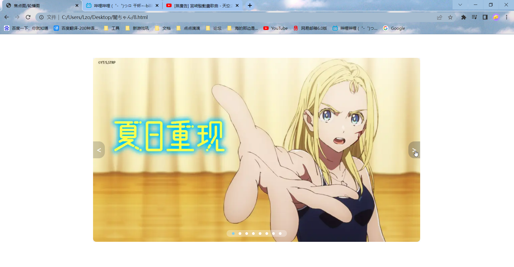

### 源码

```html
<!DOCTYPE html>
<html lang="zh-CN">

<head>
    <meta charset="UTF-8">
    <meta http-equiv="X-UA-Compatible" content="IE=edge">
    <meta name="viewport" content="width=device-width, initial-scale=1.0">
    <title>焦点图/轮播图</title>
    <style>
        * {
            padding: 0;
            margin: 0;
        }

        li {
            list-style: none;
        }

        .promo {
            /* 子绝父相 */
            position: relative;
            width: 976px;
            height: 550px;
            margin: 70px auto;
            background-color: #f3f5f7;
        }

        .promo img {
            border-radius: 10px;
        }

        /* 并集选择器可以集体声明相同的样式 */
        .prev,
        .next {
            position: absolute;
            /* 绝对定位的盒子垂直居中 */
            top: 50%;
            margin-top: -25px;
            /* 加了绝对定位的盒子可以直接设置高度和宽度 */
            width: 35px;
            height: 50px;
            background: rgba(37, 36, 37, .2);
            text-align: center;
            line-height: 50px;
            font-size: 23px;
            text-decoration: none;
            color: #ffffff;
        }

        .prev {
            left: 0;
            border-top-right-radius: 18px;
            border-bottom-right-radius: 18px;
        }

        .next {
            /* 如果一个盒子left和right属性都有，则会执行left属性 同理，top/bottom则是top*/
            right: 0;
            border-top-left-radius: 18px;
            border-bottom-left-radius: 18px;
        }

        .promo .btn:hover {
            background: rgba(61, 60, 61, .3);
        }

        .promo-nav {
            position: absolute;
            bottom: 15px;
            left: 50%;
            margin-left: -90px;
            width: 180px;
            height: 20px;
            background: rgba(255, 255, 255, .3);
            border-radius: 15px;
        }

        .promo-nav li {
            float: left;
            width: 8px;
            height: 8px;
            background-color: #ffffff;
            border-radius: 50%;
            margin: 6px;
        }

        .promo-nav .selected {
            background-color: skyblue;
        }
    </style>
</head>

<body>
    <div class="promo">
        
        <!-- 左侧按钮 -->
        <a href="#" class="prev btn"> &lt; </a>
        <!-- 右侧按钮 -->
        <a href="#" class="next btn"> &gt; </a>
        <!-- 小圆点 -->
        <ul class="promo-nav">
            <li class="selected" style="margin-left: 16px;"></li>
            <li></li>
            <li></li>
            <li></li>
            <li></li>
            <li></li>
            <li></li>
            <li></li>
        </ul>
    </div>

</body>

</html>
```


## 10、鼠标移上封面出现变化

### 样例

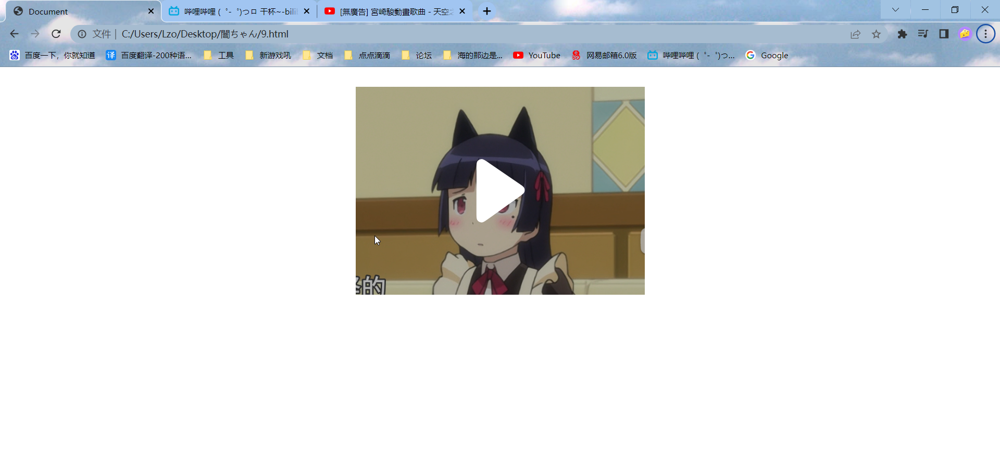


### 源码

```html
<!DOCTYPE html>
<html lang="zh-CN">

<head>
    <meta charset="UTF-8">
    <meta http-equiv="X-UA-Compatible" content="IE=edge">
    <meta name="viewport" content="width=device-width, initial-scale=1.0">
    <title>Document</title>
    <style>
        .shuai {
            /* 子绝父相 */
            position: relative;
            width: 444px;
            height: 320px;
            background-color: antiquewhite;
            margin: 30px auto;
        }

        .shuai img {
            width: 100%;
            height: 100%;
        }

        .mask {
            /* 隐藏遮罩层 */
            display: none;
            position: absolute;
            top: 0;
            left: 0;
            width: 100%;
            height: 100%;
            background-color: rgba(0, 0, 0, .3);
        }
        .shuai::before {
            content: "";
            /* 隐藏遮罩层 */
            display: none;
            position: absolute;
            top: 0;
            left: 0;
            width: 100%;
            height: 100%;
            background-color: rgba(0, 0, 0, .3);
        }

        /* 鼠标经过shuia就让里面的before显示出来 */
        .shuai:hover::before {
            /* 显示遮罩层 */
            display: block;
        }
        .shuai:hover .mask {
            /* 显示遮罩层 */
            display: block;
        }
        
        /* -------------------------------------- */
        /* 下面这种方法可以参考的，删除那个mask的div，利用伪元素选择器插入一个元素，尽管不适合这里，但是话说这种方法才是常用的吧*/
        .shuai::before {
            content: "";
            /* 隐藏遮罩层 */
            display: none;
            position: absolute;
            top: 0;
            left: 0;
            width: 100%;
            height: 100%;
            background-color: rgba(0, 0, 0, .3);
        }

        /* 鼠标经过shuia就让里面的before显示出来 */
        .shuai:hover::before {
            /* 显示遮罩层 */
            display: block;
        }
        /* ------------------------------------- */
    </style>
</head>

<body>
    <div class="shuai">
        <div class="mask">
            <!-- 众所周知，码农的偷不叫偷 -->
            <svg width="450px" height="320px" fill="none" class="xg-icon-play" viewBox="0 -17 37 69">
                <path
                    d="M10 10.693c0-1.7 0-2.549.354-3.013A1.729 1.729 0 0111.64 7c.582-.03 1.284.45 2.687 1.409l9.697 6.63c1.097.75 1.646 1.126 1.843 1.598.172.414.177.878.014 1.296-.187.476-.727.863-1.808 1.638l-9.697 6.945c-1.413 1.013-2.12 1.52-2.71 1.498a1.728 1.728 0 01-1.305-.67C10 26.877 10 26.007 10 24.268V10.693z"
                    fill="#fff"></path>
            </svg>
        </div>
        
    </div>

</body>

</html>
```


## 11、旁边的推荐视频

### 样例


### 源码

```html
<!DOCTYPE html>
<html lang="en">

<head>
    <meta charset="UTF-8">
    <meta http-equiv="X-UA-Compatible" content="IE=edge">
    <meta name="viewport" content="width=device-width, initial-scale=1.0">
    <title>Document</title>
    <style>
        * {
            padding: 0;
            margin: 0;
        }

        .box {
            width: 402px;
            height: 104px;
            background-color: #abb2bf;
            margin: 50px auto;
            padding: 5px;
            overflow: hidden;
            text-overflow: ellipsis;
            /* 可惜我的溢出显示在这里没啥用啊，毕竟文本都没溢出去 */
            /* 伸缩弹性盒子模型显示 */
            display: -webkit-box;
            /* 限制在一个块元素显示的文本的行数 */
            -webkit-line-clamp: 3;
            /* 设置或检索伸缩盒子对象的子元素的排列方式 */
            -webkit-box-orient: vertical;
        }

        .pic {
            float: left;
            width: 168px;
            height: 94px;
            margin-right: 8px;
        }

        .pic img {
            width: 100%;
        }
    </style>
</head>

<body>
    <div class="box">
        <div class="pic">
            
        </div>
        <p>宮崎駿動畫歌曲 - 超級精選, 天空之城, 龍貓, 哈爾移動城堡, 千與千尋, 風之谷, 貓之報恩, Kiki...</p>
    </div>
</body>

</html>
```


## 12、下面的跳转栏

### 样例

加了点放大渐变，圆角

好看呜呜呜

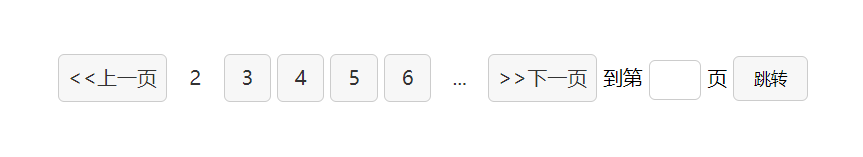 

### 源码

```html
<!DOCTYPE html>
<html lang="en">

<head>
    <meta charset="UTF-8">
    <meta http-equiv="X-UA-Compatible" content="IE=edge">
    <meta name="viewport" content="width=device-width, initial-scale=1.0">
    <title>Document</title>
    <style>
        * {
            padding: 0;
            margin: 0;
        }

        .box {
            /* text-align可以使行内或者行内块元素水平居中，于是下面这一堆蚂蚁就可以成功在浏览器居中 */
            text-align: center;
            margin: 100px 0;
        }

        .box a {
            display: inline-block;
            width: 36px;
            height: 36px;
            color: #333;
            background-color: #f7f7f7;
            border: 1px solid #ccc;
            text-align: center;
            line-height: 36px;
            text-decoration: none;
            transition: all .1s;
            border-radius: 5px;
        }

        .box a:hover {
            background-color: #e2e4e6;
            transform: scale(1.05);
        }

        .box .prev,
        .box .next {
            width: 85px;
        }

        .box .current,
        .box .elp {
            background-color: #fff;
            border: none;
        }

        .box input {
            height: 30px;
            width: 40px;
            border: 1px solid #ccc;
            outline: none;
            border-radius: 5px;

        }

        .box button {
            width: 60px;
            height: 36px;
            background-color: #f7f7f7;
            border: 1px solid #ccc;
            border-radius: 5px;

        }

        .box button:hover {
            background-color: #e2e4e6;
            /* 搞着玩玩 */
            cursor: pointer;
        }
    </style>
</head>

<body>
    <div class="box">
        <a href="#" class="prev">&lt;&lt;上一页</a>
        <a href="#" class="current">2</a>
        <a href="#">3</a>
        <a href="#">4</a>
        <a href="#">5</a>
        <a href="#">6</a>
        <a href="#" class="elp">...</a>
        <a href="#" class="next">&gt;&gt;下一页</a>
        到第
        <input type="text">
        页
        <button>跳转</button>
    </div>
</body>

</html>
```


## 13、物美价廉价格栏

### 样例

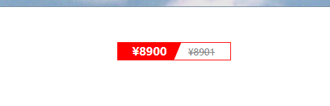 

### 源码

```html
<!DOCTYPE html>
<html lang="en">

<head>
    <meta charset="UTF-8">
    <meta http-equiv="X-UA-Compatible" content="IE=edge">
    <meta name="viewport" content="width=device-width, initial-scale=1.0">
    <title>Document</title>
    <style>
        * {
            padding: 0;
            margin: 0;
        }

        .price {
            width: 160px;
            height: 24px;
            border: 1px solid red;
            margin: 50px auto;
            line-height: 24px;
        }

        .chong {
            /* 右边的文字会自动围绕浮动 */
            float: left;
            position: relative;
            width: 90px;
            height: 100%;
            background-color: red;
            text-align: center;
            color: #fff;
            font-weight: 800;
            margin-right: 10px;
        }

        .chong i {
            position: absolute;
            right: 0;
            top: 0;
            width: 0;
            height: 0;
            /* 1.只保留右边的边框有颜色 */
            border-color: transparent #fff transparent transparent;
            /* 2.样式都是solid */
            border-style: solid;
            /* 3.上边框要大，右边框稍小，其他边框为0 */
            border-width: 24px 10px 0 0;
        }

        .price .origin {
            font-size: 13px;
            color: gray;
            text-decoration: line-through;
        }
    </style>
</head>

<body>
    <div class="price">
        <span class="chong">
            &yen;8900
            <i></i>
        </span>
        <span class="origin">&yen;8901</span>
    </div>
</body>

</html>
```


## 14、可可爱爱进度栏

### 样例

鼠标放上去就会缓慢加满

（憋骂了憋骂了，孩子知道很菜，但是它真的很可爱┭┮﹏┭┮）

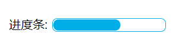 hover之前

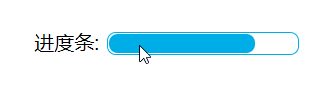 hover之后

### 源码

```html
<!DOCTYPE html>
<html lang="zh-CN">

<head>
    <meta charset="UTF-8">
    <meta http-equiv="X-UA-Compatible" content="IE=edge">
    <meta name="viewport" content="width=device-width, initial-scale=1.0">
    <title>Document</title>
    <style>
        .progress_bar {
            position: relative;
            width: 400px;
            height: 30px;
            margin: 50px auto;
            overflow: hidden;
            text-align: center;
        }

        .progress_bar .bar {
            width: 150px;
            height: 15px;
            border: 1px solid red;
            border-radius: 7px;
            margin: 5.5px auto 5.5px auto;
            padding: 0.5px;
        }

        .progress_bar .bar_in {
            width: 60%;
            height: 100%;
            background-color: red;
            border-radius: 7px;
            transition: width 0.5s;
        }

        .progress_bar .bar_in:hover {
            width: 100%;
        }

        .progress_bar span {
            position: absolute;
            left: 65px;
            top: 2.5px;
        }
    </style>
</head>

<body>
    <div class="progress_bar">
        <span>进度条:</span>
        <div class="bar">
            <div class="bar_in">
            </div>
        </div>
    </div>
</body>

</html>
```


## 15、鼠标放上图片实现放大镜效果

### 样例

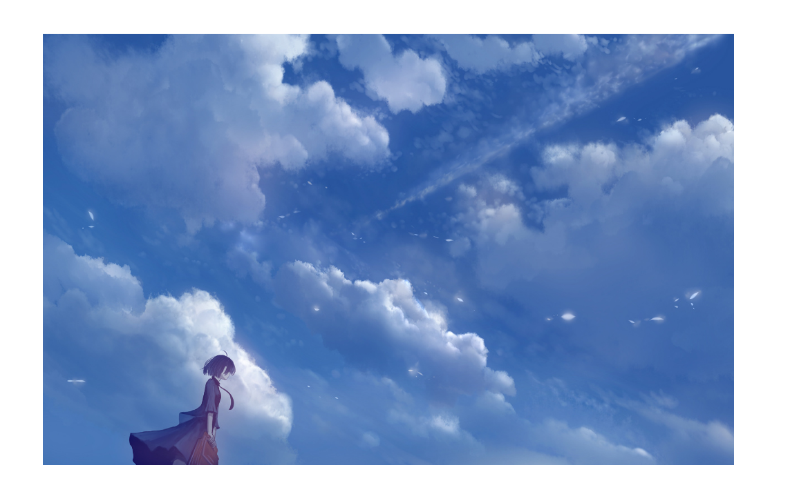

然后鼠标经过就会相应缓缓放大，类似于放大镜

 


### 源码

```html
<!DOCTYPE html>
<html lang="zh-CN">

<head>
    <meta charset="UTF-8">
    <meta http-equiv="X-UA-Compatible" content="IE=edge">
    <meta name="viewport" content="width=device-width, initial-scale=1.0">
    <title>Document</title>
    <style>
        div {
            height: 500px;
            margin: 50px;
            /* 一定要隐藏放大后溢出的，这样图片才不会整体增大 */
            /* 效果类似于，相当于边框堵死不动的那种 */
            overflow: hidden;
            width: 800px;
        }

        div a img {
            height: 100%;
            width: 100%;
            /* 和渐变更配哦 */
            transition: all .4s;
        }

        div a img:hover {
            transform: scale(1.1);
        }
    </style>
</head>

<body>
    <div><a href="#"></a></div>
</body>

</html>
```


## 16、波纹疾走(bushi

### 样例

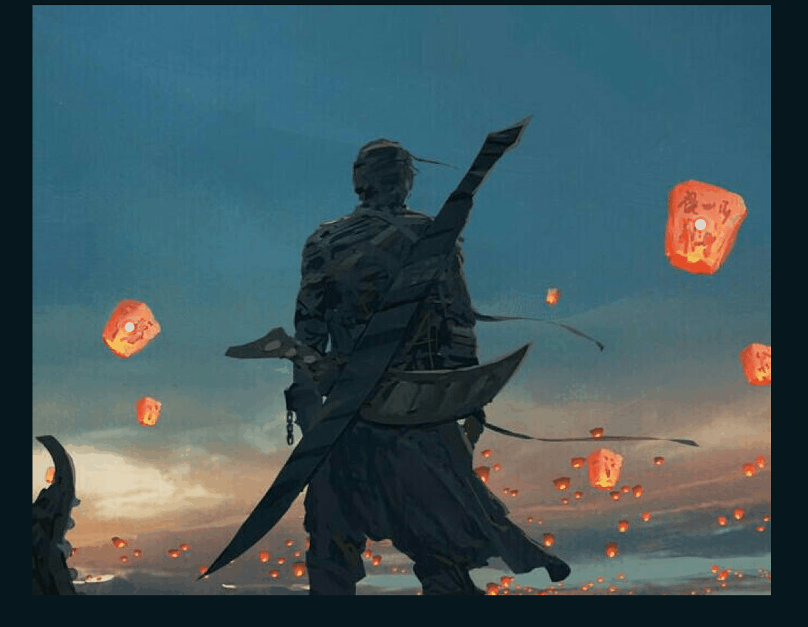


### 源码

```html
<!DOCTYPE html>
<html lang="zh-CN">

<head>
    <meta charset="UTF-8">
    <meta http-equiv="X-UA-Compatible" content="IE=edge">
    <meta name="viewport" content="width=device-width, initial-scale=1.0">
    <title>啊哈哈哈</title>
    <style>
        body {
            background-color: #06171e;
        }

        .kai {
            position: relative;
            width: 1000px;
            height: 800px;
            background: url(img/kai.jpg) no-repeat;
            margin: 0 auto;
        }

        .right {
            position: absolute;
            top: 290px;
            right: 88px;
        }

        .left {
            position: absolute;
            top: 430px;
            left: 125px;
        }

        .right .dotted {
            width: 15px;
            height: 15px;
            background-color: #d0daea;
            border-radius: 50%;
        }

        .left .dotted {
            width: 13px;
            height: 13px;
            background-color: #d0daea;
            border-radius: 50%;
        }

        .lantern div[class^="pulse"] {
            /* 下面这四步就是实现了绝对定位水平居中的操作 */
            position: absolute;
            top: 50%;
            left: 50%;
            transform: translate(-50%, -50%);
            width: 15px;
            height: 15px;
            /* 下面的阴影模糊很有意思 */
            box-shadow: 0 0 15px #d0daea;
            border-radius: 50%;
            /* linear是循环播放的意思 */
            animation: pluse 1.2s linear infinite;
        }

        /* 记住要先写.lantern选择器和div，要比上面的权重要高，免得被上面的animation的0秒delay覆盖了 */
        .lantern div.pulse2 {
            /* 动画延迟一会，实现波纹状 */
            animation-delay: .4s;
        }

        .lantern div.pulse3 {
            animation-delay: .4s;
        }

        @keyframes pluse {

            /* 这里不使用scale缩放，是因为会把阴影带大 */
            0% {}

            70% {
                width: 40px;
                height: 40px;
                /* 不透明度 */
                opacity: 1;
            }

            100% {
                width: 70px;
                height: 70px;
                opacity: 0;
            } 

        }
    </style>
</head>

<body>
    <div class="kai">
        <div class="lantern right">
            <div class="dotted"></div>
            <div class="pulse1"></div>
            <div class="pulse2"></div>
        </div>
        <div class="lantern left">
            <div class="dotted"></div>
            <div class="pulse1"></div>
            <div class="pulse2"></div>
        </div>
    </div>

</body>

</html>
```


## 17、打字机效果

### 样例

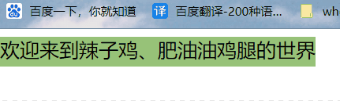 

### 源码

```html
<!DOCTYPE html>
<html lang="zh-CN">

<head>
    <meta charset="UTF-8">
    <meta http-equiv="X-UA-Compatible" content="IE=edge">
    <meta name="viewport" content="width=device-width, initial-scale=1.0">
    <title>12121</title>
    <style>
        div {
            overflow: hidden;
            font-size: 20px;
            width: 0;
            height: 30px;
            background-color: #98c379;
            /* 让文字强制在一行显示 */
            white-space: nowrap;
            /* steps就是分几步来完成动画 有了steps就不要写ease或者linear了 */
            animation: w 4s steps(16) forwards;
        }

        @keyframes w {
            0% {
                width: 0;
            }

            100% {
                width: 320px;
            }
        }
    </style>
</head>

<body>
    <div>欢迎来到辣子鸡、肥油油鸡腿的世界</div>
</body>

</html>
```


## 18、3D硬币翻转

### 样例

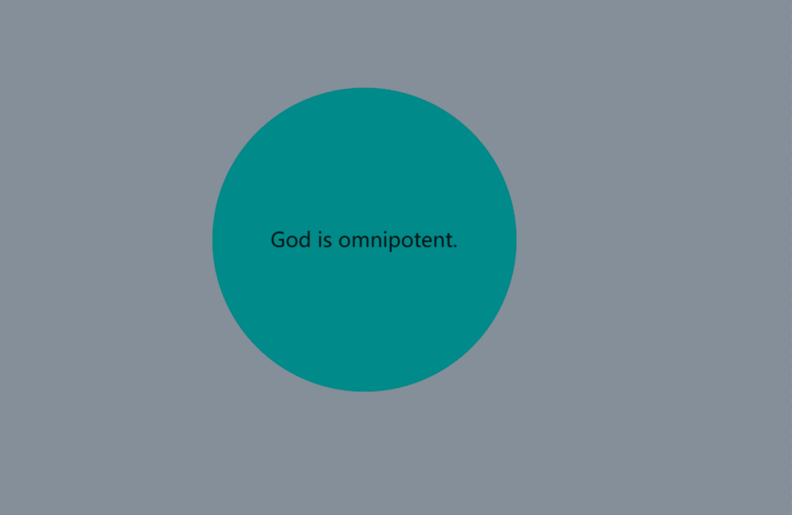 

### 源码

```html
<!DOCTYPE html>
<html lang="zh-CN">

<head>
    <meta charset="UTF-8">
    <meta http-equiv="X-UA-Compatible" content="IE=edge">
    <meta name="viewport" content="width=device-width, initial-scale=1.0">
    <title>12121</title>
    <style>
        body {
            perspective: 400px;
            background-color: #848f9a;
        }

        .box {
            position: relative;
            width: 300px;
            height: 300px;
            margin: 100px auto;
            transition: all .6s;
            transform-style: preserve-3d;
        }

        .box:hover {
            transform: rotateY(-180deg);
        }

        .front,
        .back {
            position: absolute;
            top: 0;
            left: 0;
            width: 100%;
            height: 100%;
            border-radius: 50%;
            text-align: center;
            line-height: 300px;
            font-size: 20px;
        }

        .front {
            background-color: darkcyan;
            /* 把front提到上面来，毕竟两者重叠了 */
            /* z-index: 1; */
            /* 但是现在有更好的选择，在父元素开启立体空间的时候，相当于进入3Dspace */
            /* 此时虽然front被压住，但是你可以设置它的z轴高度，让它升起来不被压住 */
            transform: translateZ(1px);
        }

        .back {
            background-color: darkslategray;
            /* 这个很重要，背面本来是被叠在了下面，正面朝上的，你一翻转box，不就看到的是back的背面了吗，字都镜像翻转了看个鬼啊 */
            /* 此时你让它旋转180度，刚好像贴纸贴在了硬币的背面，翻转过来看到的也是back的正面 */
            transform: rotateY(180deg);
        }
    </style>
</head>

<body>
    <!-- 必须有一个box包起来，因为旋转的是box -->
    <!-- 逻辑就是box是一个硬币，两个div贴纸一个贴着前面，一个贴着后面 -->
    <div class="box">
        <div class="front">
            God is omnipotent.
        </div>
        <div class="back">
            God is inomnipotent.
        </div>
    </div>
</body>

</html>
```


## 19.3D导航栏

### 样例

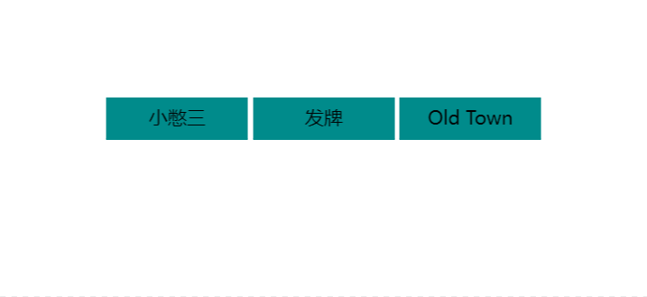 

### 源码

```html
<!DOCTYPE html>
<html lang="zh-CN">

<head>
    <meta charset="UTF-8">
    <meta http-equiv="X-UA-Compatible" content="IE=edge">
    <meta name="viewport" content="width=device-width, initial-scale=1.0">
    <title>3D导航栏</title>
    <style>
        * {
            padding: 0;
            margin: 0;
        }

        ul {
            margin: 100px 500px;
        }

        li {
            float: left;
            margin: 0 5px;
            width: 120px;
            height: 35px;
            list-style: none;
            /* 为什么写在li呢，因为不仅front，bottom要透视，box也要透视，所以给这几位的大爹填写了 */
            perspective: 400px;
        }

        .box {
            position: relative;
            width: 100%;
            height: 100%;
            transform-style: preserve-3d;
            transition: all .5s;
        }

        .box:hover {
            transform: rotateX(90deg);
        }

        .front,
        .bottom {
            position: absolute;
            top: 0;
            left: 0;
            width: 100%;
            height: 100%;
            text-align: center;
            line-height: 35px;
        }

        .front {
            background-color: darkcyan;
            z-index: 1;
            /* 这里的操作的原因需要看ping老师CSS视频的385p4:30开始的解释了，很神奇 */
            transform: translateZ(17.5px);
        }

        .bottom {
            background-color: #00a8df;
            /* 注意两点，先位移 */
            /* 旋转之后往下走高度的一半，刚好作为盒子的底部 */
            transform: translateY(17.5px) rotateX(-90deg);
        }
    </style>
</head>

<body>
    <ul>
        <li>
            <div class="box">
                <div class="front">小憋三</div>
                <div class="bottom">你拿什么打</div>
            </div>
        </li>
        <li>
            <div class="box">
                <div class="front">发牌</div>
                <div class="bottom">胜利女神在呼唤</div>
            </div>
        </li>
        <li>
            <div class="box">
                <div class="front">Old Town</div>
                <div class="bottom">Road</div>
            </div>
        </li>
    </ul>
</body>

</html>
```


## 20、旋转木马

### 样例

鼠标放上去会暂停


### 源码

```html
<!DOCTYPE html>
<html lang="zh-CN">

<head>
    <meta charset="UTF-8">
    <meta http-equiv="X-UA-Compatible" content="IE=edge">
    <meta name="viewport" content="width=device-width, initial-scale=1.0">
    <title>旋转木马</title>
    <style>
        * {
            padding: 0;
            margin: 0;
        }

        body {
            background: #f5f8f5;
            perspective: 1500px;
        }

        section {
            position: relative;
            width: 350px;
            height: 350px;
            margin: 200px auto;
            transform-style: preserve-3d;
            /* 添加动画效果 */
            animation: rotate 10s linear infinite;
            /* 在旋转图片里面放一张图片 */
            background: url(img/duola.png) no-repeat;
            background-position: center;
        }

        section:hover {
            /* 鼠标放上去暂停 */
            animation-play-state: paused;
        }

        @keyframes rotate {
            0% {
                transform: rotateY(0);
            }

            100% {
                transform: rotateY(360deg);
            }
        }

        section div {
            position: absolute;
            top: 0;
            left: 0;
            width: 100%;
            height: 100%;
            background: url(img/wlop.png) no-repeat;
            background-position: center;
        }

        section div:nth-child(1) {
            transform: translateZ(500px);
        }

        section div:nth-child(2) {
            /* 这个就是先旋转再移动了，其实好好想想不难理解的，先旋转一个角度，再平移，才能移到第一个盒子的一侧 */
            /* 可以再结合3D效果好好想想 */
            transform: rotateY(60deg) translateZ(500px);
        }

        section div:nth-child(3) {
            transform: rotateY(120deg) translateZ(500px);
        }

        section div:nth-child(4) {
            transform: rotateY(180deg) translateZ(500px);
        }

        section div:nth-child(5) {
            transform: rotateY(240deg) translateZ(500px);
        }

        section div:nth-child(6) {
            transform: rotateY(300deg) translateZ(500px);
        }
    </style>
</head>

<body>
    <section>
        <div></div>
        <div></div>
        <div></div>
        <div></div>
        <div></div>
        <div></div>
    </section>
</body>

</html>
```


