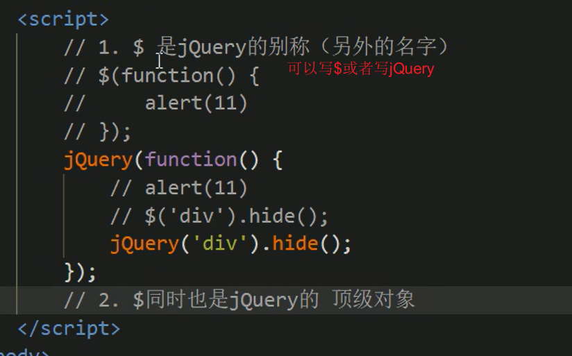
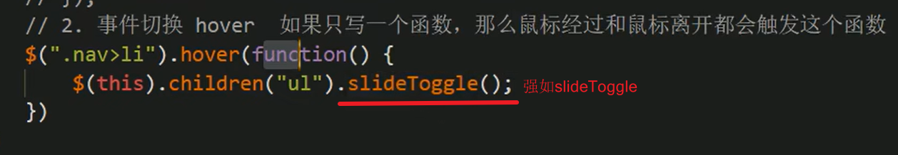
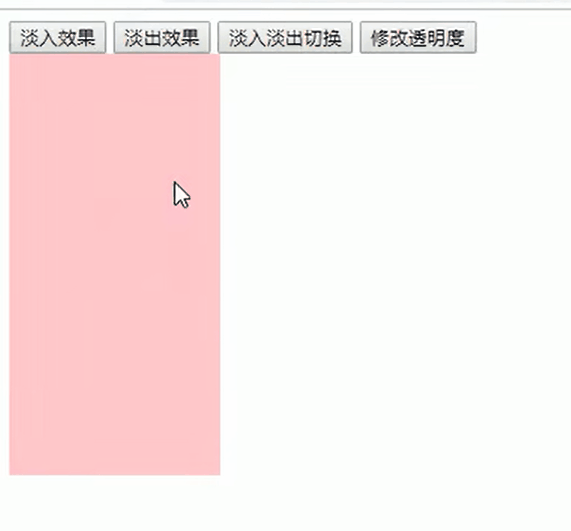
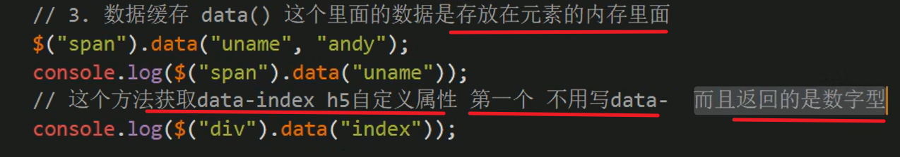

[TOC]


# 一、基础概述

## 1、JavaScript库

 

 


## 2、jQuery

 

 

 


# 二、基础使用

## 1、入口函数

 

> 示例：
>
>  


## 2、顶级对象——$

 

 


> **重要**
>
> `使用querySelector获取的是DOM对象`
>
> 而使用`$('div')，获取的是jQuery对象`，它`把DOM对象进行了包装`
>
> 所以可以写<u>$('div').hide() 因为这是jQuery的方法</u>
>
> 而如果是<u>DOM原生对象就得写，div.style.display = 'none'</u>; // 当然jQuery也无法使用原生DOM的方法
>
>  


## 3、jQuery对象和DOM对象的相互转换

 


## 4、常用API


### 4.1、隐式迭代

#### 4.1.1、概述

> 注意`隐式迭代`

 

.assets/image-20220929220154076.png)

 

#### 4.1.2、排他思想

> 利用隐式迭代的*排他思想*

 


### 4.2、链式编程

 


## 5、选择器

### 5.1、基础选择器——层级选择器——筛选选择器

 

 

 


### 5.2、筛选方法

> 注意两点
>
> 第一，这些都是方法函数，`别忘了加小括号`
>
> 第二，查找的角度是`往父子兄的角度查找的`

 

> parent()/children()/find()

 

> siblings/eq/hasClass

 


## 6、样式

### 6.1、操作CSS方法

```javascript
三种写法
$(this).css("color");
$(this).css("color", "red");
$(this).css({
	width: 400,
	hieght: 400,
	backgroundColor: "red"
});
```

 

> 示例
>
>  


### 6.2、设置类样式法

> 1、添加类
>
> addClass("current");
>
> 2、移除类
>
> removeClass("current");
>
> 3、切换类
>
> toggleClass("current");
>
> *toggleClass*()用来判断元素是否拥有此类名,有的话就删除,无的话就添加,可以达到切换的效果

 

> **下面是原生JS的className和jQuery对类操作的区别**
>
> className只能是覆盖
>
> jQuery 添加、移除、切换都可以
>
>  
>
>  

 


## 7、动画

animate都是小case了

 

### 7.1、show/hide/toggle

> 几个家伙都差不多

 


 

 

> 示例：
>
> 感觉toggle就是显示就隐藏，隐藏就显示
>
>  


### 7.2、slideDown/slideUp/slideToggle

> 示例：
>
>  
>
> 
>
>  
>
> 
>
> 但是有更好的写法，**运用事件切换**
>
> 先on后out
>
>  
>
> 
>
> 还可以更简单
>
> 利用hover只写一个函数，鼠标经过和离开都会触发的特性，结合slideToggle
>
>  


### 7.3、stop

> 由于动画一旦开始就只会执行到结束
>
> 所以可能会出现
>
>  
>
> 
>
> 这里利用**stop**，每次触发当前动画都会停止上一次动画，每次只保存当前的动画

 

> 示例：

 


### 7.4、淡入淡出

fadeIn/fadeOut/fadeTo/fadeToggle

#### ①fadeIn/fadeOutfadeToggle

 

> 效果：
>
>  


#### ②fadeTo(半透明)

  

> 示例：
>
>  
>
>   


### 7.5、自定义动画animate

 

> 示例：
>
>  
>
> ```html
> <body>
>     <button>点击</button>
>     <div>1</div>
>     <script>
>         $(function(){
>             $("button").click(function(){ 
>                 $("div").animate({
>                     left: 500,
>                     top: 100,
>                     opacity: .4,
>                     width: 300
>                 }, 500);
>             })
> 
>         })
> 
>     </script>
> </body>
> ```
>
> 


## 8、属性操作

### 8.1、获取固有属性prop()

 

> 示例：
>
>  


### 8.2、获取自定义属性attr()

 


> 示例：
>
>  
>
>  
>
>  这个data-index是H5自定义属性
>
> 


### 8.3、数据缓存data()

> 什么意思呢？
>
> 这玩意其实是把元素当做一个变量，或者说容器，`把一些字面量存在元素的身上`，`放到元素的缓存里面`
>
> 因此就可以访问放到它缓存中的值
>
> 但是**一刷新就移除**是不是多少有点

 


> 示例：
>
>  


## 9、内容文本值	

> html()、text()、val()
>
> `后两者括号为空就是获取、括号有值就是修改`

 


## 10、元素操作

### 10.1、遍历元素

> 1、**两种写法**
>
> (1) *常用于遍历DOM对象*
>
> $("div").each(funciton(index, domEle){...}); 
>
> (2) *常用于比遍历数据，类似于数组对象啊什么的，foreach*
>
> $.each(arr, function(index, ele){...}); 
>
> index 是索引号或者key
>
> domEle 是DOM对象
>
> ele 是元素或者value
>
> 
>
> (3)下面是遍历对象的示例
>
>  

 

 


### 10.2、CRUD

> `1、创建元素`
>
> $("<li>创建新结点</li>");

 牛


> `2、添加元素`

**（1）内部添加**

添加儿子

$("ul").append(li);

$("ul").prepend(li);

.assets/image-20221017232544841.png) 


**（2）外部添加**

添加兄弟

$(".test").after(div);

$(".test").**before**(div);

 


> `3、删除元素`

$("ul").remove();

$("ul").empty();

$("ul").html("");

  


### 10.3、尺寸操作

> width()/height() // 只算width/height
>
> innerWidth/innerHeight() // 包含padding
>
> outerWidth()/outerHeight() // 包含padding、border
>
> outerWidth(true)/outerHeight() // 包含padding、border、margin

 

> 示例：
>
>  


### 10.4、位置操作

offset、position、Scroll

> 1、offset()
>
> **设置和获取**

 

  


> 2、position()
>
> **只能获取不能设置**

 

 


> 3、ScrollTop()/ScrollLeft()
>

 

 


## 11、事件

### 11.1、单个事件注册

.assets/image-20221025000011385.png)


### 11.2、事件处理on()绑定事件

on()

> **有三个优势**
>
> 优势一，`可以一次绑定多个事件`

 

  

 两种写法

 

 


> 优势二，`可以实现事件委托`
>

 

 


> 优势三，`动态创建的元素绑定事件`
>

 


### 11.3、解绑off()

off()

 

 


### 11.4、自动触发事件

trigger()

 

  


### 11.5、事件对象

event

stopPropagation

 

 


### 11.6、拷贝对象

   


> 1、**浅拷贝**
>
> 浅拷贝把原来对象里面的**复杂数据类型地址**拷贝给目标对象
>
> 复杂数据类型是指 
>
> 所以`当修改了拷贝得到的数据的复杂类型的数据时，原来的本体的数据也会变`，毕竟拷贝的是地址嘛
>
>  
>
>  
>
>  这就是底层的结构
>
> 
>
> 
>
> 2、**深拷贝**
>
> 深拷贝把里面的**复杂数据类型**完全复制一份给目标对象 如果有不冲突的属性，就合并到一起
>
> `不会出现上面的修改副本，本体也改的情况`
>
>  
>
>  底层的结构
>
> 


## 12、jQuery多库共存

 

 


## 13、jQuery妙用

### 13.1、jQuery插件

  


### 13.2、图片懒加载技术/全屏滚动插件

去插件库下载就好了

  


`

`

`

`

`

`

`

`


