[TOC]

# First.Overview

## 1.Basic Sentence Structure

> - 从上文既可以得到Basic Sentence Structure
>
>   - 间宾和直宾
>
>     - 2个动作承受者
>
>       FE：
>
>       三者模型：teach->English->you。我只能teach knowledge，而knowledge的对象是你
>
>       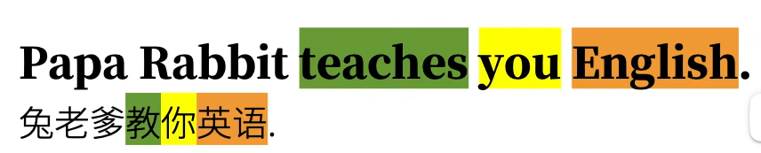

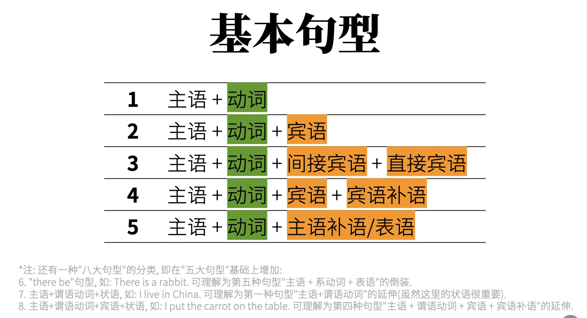

## 2.Verb

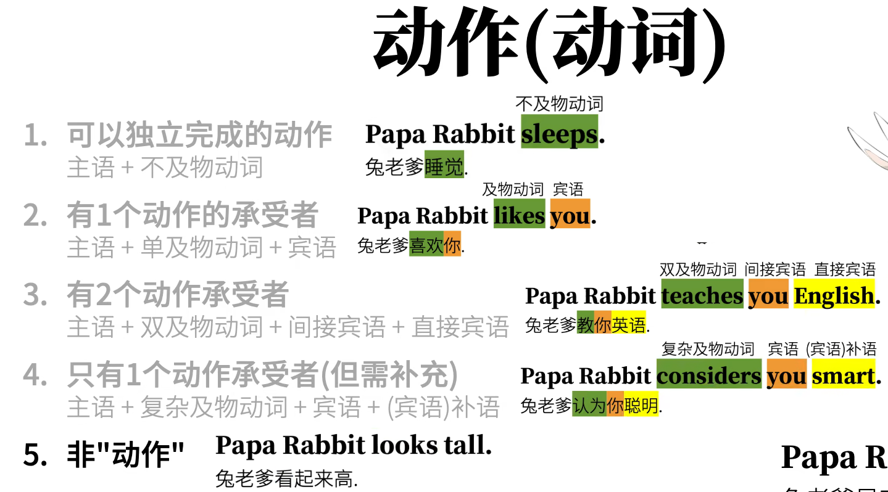

> - supplement point5:
>   - 它的verb其实是个`Linking verb`
>   - 而它后面的adjective其实是`(主语)补语/表语`

## 3.Predicate

> - 其实英语句子就这个结构：主语+谓语，在说：“什么，怎么样”
>   - 所以说除了主语就是谓语

### 3.1、Predicate Verb

> - 谓语包括Predicate verb，notwithstanding 我们一般`误认为`谓语为谓语动词了
>
>   但是实际上，谓语包括除了主语外的一切成分，而谓语动词只是那些element的一部分
>
>   - 而谓语动词分为五个级别
>     - 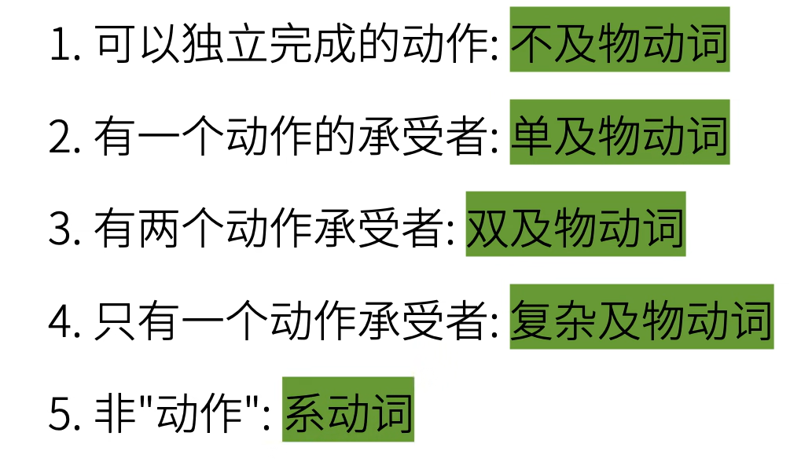

**不要小看大谓语**

> - 动作时间
> - 动作状态
> - 动作假设，情感...

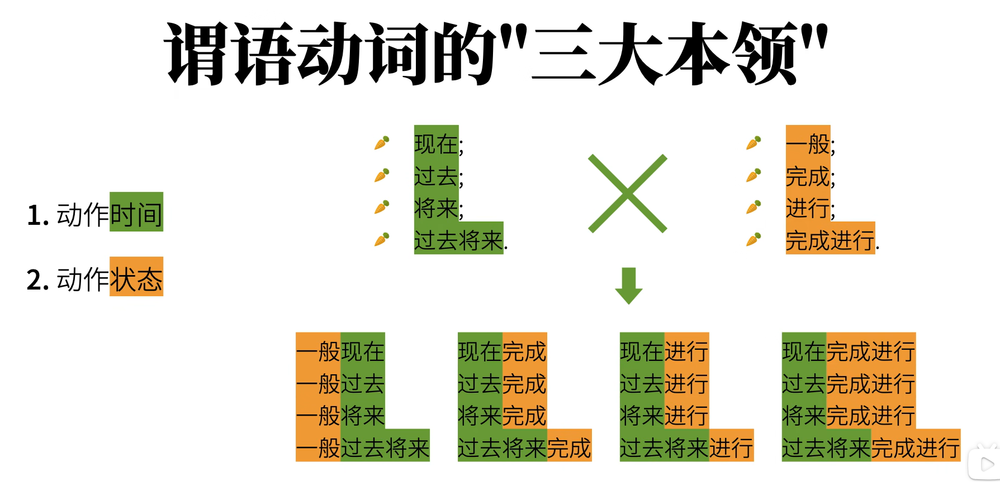

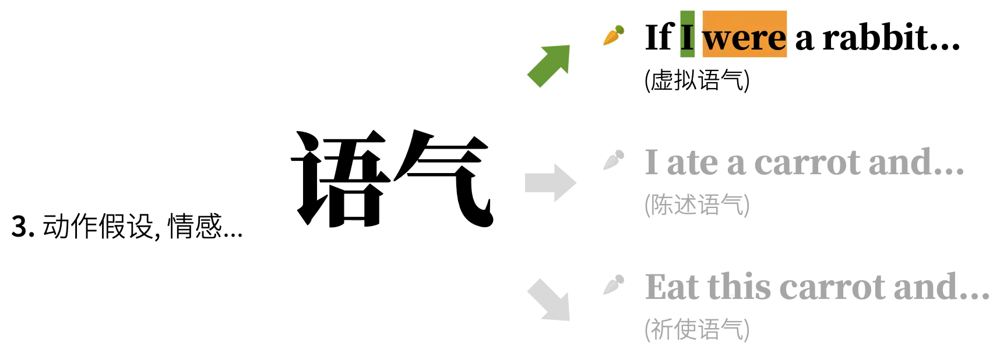

### 3.2、Auxiliary Verbs

> - 干啥的
>   - 协助动词表示进一步意思的

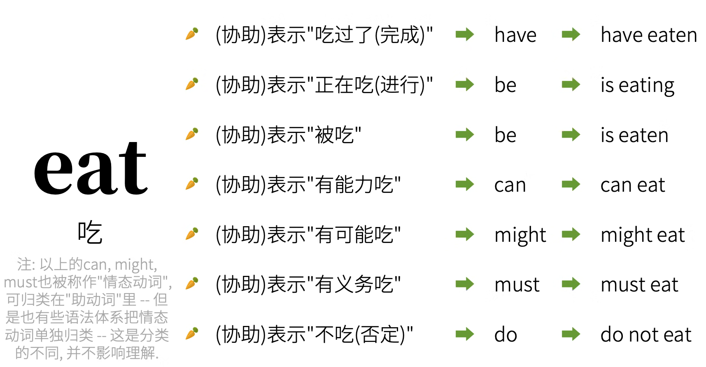

### 3.3、Non-Predicate Verb

> - 怎么理解非谓语动词？
>
>   - 其实就是verb不仅可以当谓语动词，还可以当主语balbala的
>
>     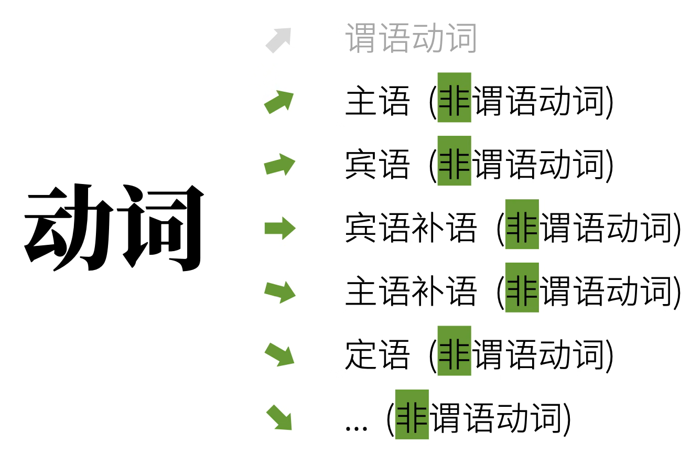

> - 非谓语动词
>   - 分为几类，但是坑爹的是有时你will be obscured，因为有时它是*谓语动词的进行时*，有时是*非谓语动词的动名词*

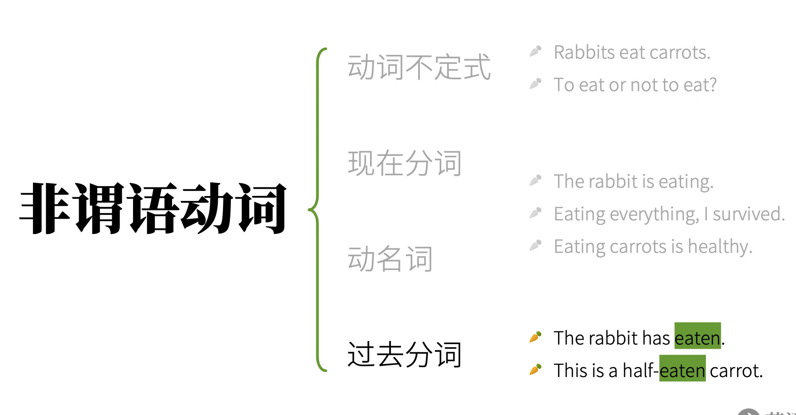

## 4、Clause Element

> - 主要提一下
>
>   - **定语**(attributive)：主要用来`修饰主语和宾语`
>
>   - **状语**(adverbial)：主要用来`修饰谓语动词`
>
>   - **同位语**(appositive)：主要用来`再把主语和谓语说一遍`
>
>     - FE.
>
>     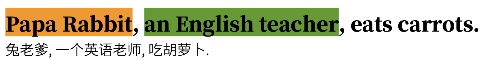

## 5、Compound/Complex Sentence

> - **Compound Sentece**：句子简单叠加，是“并列关系”。翻译为**复合句**
> - **Complex Sentence**：句子的套娃，是“从属关系”。翻译为**复杂句**

> - In the perception of sentence, 根据他们的不同feature，又称为不同从句，统称“名词性从句”

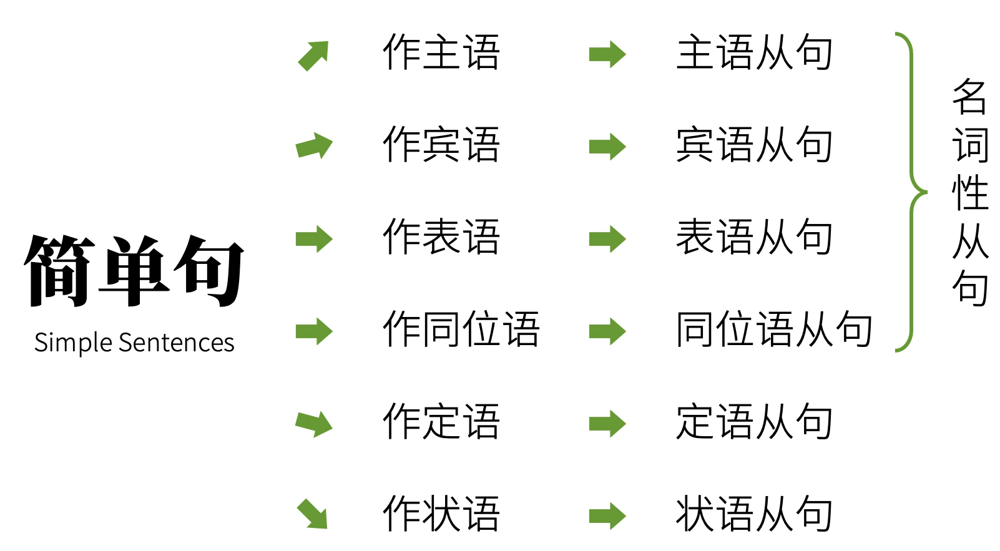

## 6、Part of speech

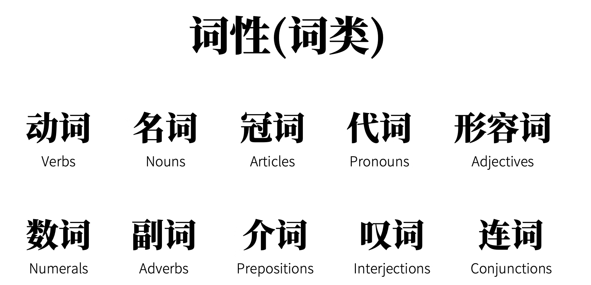

> - FE
>
>   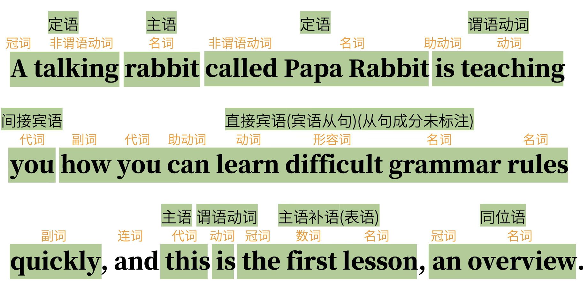

