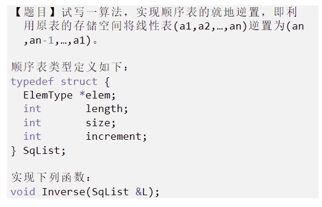

[TOC]


# 一、线性表

## 1、顺序表

### 1.1、接口

```c
#include <stdio.h>
#include <stdlib.h>

#define InitSize 10 // 默认最大长度
#define ElemType int // 数据类型
#define OVERFLOW -1
#define OK 1
#define ERROR 0
#define TRUE 2
#define FALSE -2
typedef int Status;
typedef struct {
	ElemType* elem; // 顺序表的基址
	int maxSize; // 顺序表的最大容量
	int length; // 顺序表的当前长度
} Sqlist; // Sequence List


Status InitSqlist(Sqlist& L); // 初始化
Status IncreaseSize(Sqlist& L, int len); // 扩容
Status ListInsert(Sqlist& L, int i, ElemType e); // 插入
Status ListDelete(Sqlist& L, int i, ElemType &e);  // 删除
void PrintSqlist(Sqlist L); // 打印顺序表
ElemType GetELem(Sqlist L, int i); // 按位查找(从1开始)
int LocateElem(Sqlist L, ElemType e); // 按值查找，返回位序(从1开始)


/*
顺序表
	1、初始化 
	2、扩容 
	3、插入
	4、删除
	5、打印
	6、查找
*/
int main() {
	Sqlist L;
	int result = 0;
	ElemType e = 0;
	result = InitSqlist(L);
	if (OVERFLOW == result) {
		printf("初始化错误");
		return -1;
	}
	result = 0;
	printf("%d\n", L.maxSize);
	result = ListInsert(L, 1,1);
	result = ListInsert(L, 2,2);
	result = ListInsert(L, 3,3);
	result = ListInsert(L, 4,4);
	result = ListInsert(L, 5,5);
	result = ListInsert(L, 6,6);
	result = ListInsert(L, 7,7);
	result = ListInsert(L, 8,8);
	result = ListInsert(L, 9,9);
	result = ListInsert(L, 10,10);	
	result = ListInsert(L, 11,11);
	if (ERROR == result || OVERFLOW == result) {
		printf("插入数据错误");
		return -1;
	}
	printf("%d\n", L.maxSize);
	PrintSqlist(L);
	printf("\n");
	result = ListInsert(L, 5, 12);
	result = ListInsert(L, 3, 13);
	result = ListInsert(L, 8, 14);
	result = ListInsert(L, 1, 15);
	result = ListDelete(L, 1, e);
	if (result == ERROR)return -1;
	printf("e = %d\n", e);
	PrintSqlist(L);
	printf("\n");
	for (int i = 1; i < 16; i++) {
		e = GetELem(L, i);
		if (ERROR == e) {
			printf("已经结束啦");
			// return -1;
		}
		printf("%d ", e);
	}
	printf("\n");
	for (int i = 1; i < 16; i++) {
		result = LocateElem(L, i);
		if (FALSE == result) {
			printf("查找失败");
			// return -1;
		}
		printf("%d ", result);
	}

}


/*
	初始化一个顺序表
*/
Status InitSqlist(Sqlist& L) {
	L.elem = (ElemType*)malloc(sizeof(ElemType) * InitSize);
	if (!L.elem) return OVERFLOW;
	L.maxSize = InitSize;
	L.length = 0;
	return OK;
}


/*
	增加动态数组的长度
	len 扩容长度
*/
Status IncreaseSize(Sqlist& L, int len) {
	ElemType* newbase;
	newbase = (ElemType*)realloc(L.elem, sizeof(ElemType) * (L.maxSize + len));
	if (NULL == newbase) return OVERFLOW;
	L.elem = newbase;
	L.maxSize = L.maxSize + len;
	//L.elem = (ElemType*)malloc(sizeof(ElemType) * (L.maxSize + len));
	//if (NULL == L.elem) return OVERFLOW;
	//for (int i = 0; i < L.length; i++) {
	//	*(L.elem + i) = p[i];
	//}
	//L.maxSize = L.maxSize + len;
	//free(p);// 释放空间
	return OK;
}

/*
	插入操作
	i 位置 e 插入元素
*/
Status ListInsert(Sqlist& L, int i, ElemType e) {
	Status result;
	if (i < 1 || i > L.length + 1) return ERROR; // 判断范围有效
	if (L.length > L.maxSize - 2) { // 满了扩容
		// 自动扩容
		result = IncreaseSize(L, 5);
		if (OVERFLOW == result)return OVERFLOW;	
	}
	for (int j = L.length; j >= i; j--) { // 将元素后移
		*(L.elem + j) = *(L.elem + j - 1);
	}
	*(L.elem + i - 1) = e; // 赋值
	L.length++;
	return OK;
}

/*
	删除元素
	e 被删除的元素 i 所删除元素的下标
*/
Status ListDelete(Sqlist& L, int i, ElemType &e) {
	if (i < 1 || i > L.length) {// 判断范围是否有效
		return ERROR;
	}
	e = *(L.elem + i - 1);// 赋值给e
	for (int j = i; j < L.length; j++) {// 把元素前移
		*(L.elem + j - 1) = *(L.elem + j);
	}
	L.length--;
	return OK;
}

/*
	打印全部的元素
*/
void PrintSqlist(Sqlist L) {
	for (int i = 0; i < L.length; i++) {
		printf("%d ", *(L.elem + i));
	}
}

/*
	查找元素 
	按位查找，返回元素值
*/
ElemType GetELem(Sqlist L, int i) {
	if (i > L.length)return ERROR; // 位数超过了最大值
	return *(L.elem + i - 1);
}

/*
	查找元素
	按值查找，返回其位序(从1开始)
*/
int LocateElem(Sqlist L, ElemType e) {
	for (int i = 0; i < L.length; i++) {
		if (e == *(L.elem + i)) {
			return i + 1;
		}
	}
	return FALSE; // 查找失败
}

```


### 1.2、逆序一个顺序表

 

```c
void Inverse(SqList &L) 
{ // Add your code here
  // 边界，第一种为空的，就不行
  // 跟写过的那个数组一样
  int head = 0;
  int rear = L.length - 1;
    while(head < rear){
      *(L.elem + head) = *(L.elem + head) ^ *(L.elem + rear);
      *(L.elem + rear) = *(L.elem + head) ^ *(L.elem + rear);
      *(L.elem + head) = *(L.elem + head) ^ *(L.elem + rear);
      head++;
      rear--;
    }
}
```


## 2、链表

### 单链表

#### 1.1、接口

> **链表是一种动态的进行存储分配的一种结构**

**静态链表，动态链表**

所有结点都是在程序中定义的，不是我们自己`申请的内存(由系统自动分配内存空间)`，`用完后系统自动释放`，这种链表称为静态链表。

所谓动态链表就是我们`手动开辟内存存放结点`，需要`回收时我们手动释放的链表`

```C
#include <stdio.h>
#include <stdlib.h>

#define InitSize 10 // 默认最大长度
#define ElemType int // 数据类型
#define OVERFLOW -1
#define OK 1
#define ERROR 0
#define TRUE 2
#define FALSE -2
typedef int Status;
typedef struct LNode{
	ElemType data; // 数据域
	struct LNode* next; // 指针域
}LNode, *LinkList;

Status InitList(LinkList &L); // 初始化单链表
Status Empty(LinkList L); // 判空
int Length(LinkList L); // 求长度
LinkList List_TailInsert(LinkList& L); // 尾结点插入
LinkList List_HeadInsert(LinkList& L); // 头结点插入
Status ListInsert(LinkList& L, int i, ElemType e); // 插入
Status PrintLinkedList(LinkList L); // 遍历打印
Status InsertNextNode(LNode* p, ElemType e); // 指定结点的后插操作
Status InsertPreNode(LNode* p, ElemType e); // 指定结点的前插操作
Status ListDelete(LinkList &L, int i, ElemType &e); // 按位序的删除
Status DeleteNode(LinkList &L, LNode* p); // 指定结点的删除
LNode* GetElem(LinkList L, int i); // 按位查找
LNode* LocateElem(LinkList L, ElemType e); // 按值查找


int LinkedList() {
	LinkList L;
	int result = 0;
	ElemType e = 0;
	InitList(L);
	//result = PrintLinkedList(L);
	if (FALSE == result) return -1;
	result = 0;
	result = ListInsert(L, 1, 1);
	result =  ListInsert(L, 2, 2);
	result = ListInsert(L, 3, 3);
	result = ListInsert(L, 4, 4);
	result = ListInsert(L, 5, 5);
	InsertPreNode(L->next, 10);
	InsertPreNode(L->next, 9);
	InsertPreNode(L->next, 8);
	InsertPreNode(L->next, 7);
	if (FALSE == result || OVERFLOW == result) {
		printf("插入失败\n");
		return -1;
	}
	printf("长度：%d\n", Length(L));
	PrintLinkedList(L);

	result = ListDelete(L, 9, e);
	printf("e: %d\n", e);
	e = 0;
	result = ListDelete(L, 1, e);
	printf("e: %d\n", e);
	e = 0;
	result = ListDelete(L, 3, e);
	printf("e: %d\n", e);
	e = 0;
	result = ListDelete(L, 0, e);
	printf("e: %d\n", e);
	if (FALSE == result)printf("按序删除出错\n");

	printf("长度：%d\n", Length(L));
	DeleteNode(L, L->next);
	DeleteNode(L, L->next);
	DeleteNode(L, L->next);
	LNode* xx = LocateElem(L, 4);
	printf("按值查找到的元素的data: %d\n", xx->data);
	printf("长度：%d\n", Length(L));
	PrintLinkedList(L);

	LinkList x;
	x = List_TailInsert(x);
	PrintLinkedList(x);
	x = List_HeadInsert(x);
	PrintLinkedList(x);
	return -1;
}

/*
	初始化单链表
*/
Status InitList(LinkList &L) {
	/*
	不带头结点的初始化
	L = NULL; // 初始化，防止脏数据
	return TRUE;
	*/
	// 带头结点的初始化
	L = (LNode *)malloc(sizeof(LNode) * 1); // 开辟头结点
	if (NULL == L) return OVERFLOW;
	L->next = NULL;
	return TRUE;
}


/*
	尾插法建立单链表
	正向建立
*/
LinkList List_TailInsert(LinkList &L) {
	ElemType e;
	int x = 0;
	L = (LinkList)malloc(sizeof(LNode) * 1);
	LNode* s, * r = L;
	printf("请输入结点的值：");
	scanf("%d", &x);
	printf("\n");
	while (x != 114514) {
		s = (LNode *)malloc(sizeof(LNode) * 1);
		if (NULL == s)return NULL;
		s->data = x;
		r->next = s;
		r = s;
		printf("请输入结点的值：");
		scanf("%d", &x);
		printf("\n");
	}
	r->next = NULL;
	return L;
}

/*
	头插法建立单链表
*/
LinkList List_HeadInsert(LinkList &L) {
	ElemType e;
	int x = 0;
	L = (LinkList)malloc(sizeof(LNode) * 1);
	L->next = NULL; // 清理脏数据，不让尾结点一直都是脏数据
	LNode* s;
	printf("请输入结点的值：");
	scanf("%d", &x);
	printf("\n");
	while (x != 114514) {
		s = (LNode*)malloc(sizeof(LNode) * 1);
		if (NULL == s)return NULL;
		s->data = x;
		s->next = L->next;
		L->next = s;
		printf("请输入结点的值：");
		scanf("%d", &x);
		printf("\n");
	}
	return L;
}


/*
	求链表长度
*/
int Length(LinkList L) {
	LNode* p = L;
	int len = 0;
	while (p->next != NULL) {
		len++;
		p = p->next;
	}
	return len;
}

/*
	判空
*/
Status Empty(LinkList L) {
	/*
	不带头结点	
	return (NULL == L);
	*/
	// 带头结点
	return (NULL == L->next) ? TRUE : FALSE;
}

/*
	遍历打印
*/
Status PrintLinkedList(LinkList L) {
	if(TRUE == Empty(L)){ // 判空
		printf("单链表此时为空\n");
		return FALSE;
	}
	LinkList p = L;
	p = p->next;
	while (p != NULL) {
		printf("ElemType: %d\n", p->data);
		p = p->next;
	}
}

/*
	带头结点的插入
	i 插入的位序 e 插入的元素值
*/
Status ListInsert(LinkList& L, int i, ElemType e) {
	// 找到第i个结点
	if (i < 1) return FALSE;
	/*
	不带头结点的时，需要额外添加的代码
	if(1 == i){
		LNode *s = (LNode *)malloc(sizeof(LNode) * 1);
		s->data = e;
		s->next = L;
		L = s; // 指向新的头结点
		return TRUE;
	}
	*/
	LNode* p = GetElem(L, i - 1);
	return InsertNextNode(p, e);
}

/*
	在位序的尾部插入
*/
Status InsertNextNode(LNode* p, ElemType e) {
	if (NULL == p) return FALSE; // i的值不合法
	// 插入操作
	LNode* s = (LNode*)malloc(sizeof(LNode) * 1);
	if (NULL == s) return OVERFLOW;
	s->data = e;
	s->next = p->next;
	p->next = s;
	return TRUE;
}


/*
	在指定位序的头部插入
*/
Status InsertPreNode(LNode* p, ElemType e) {
	if (NULL == p) return FALSE; // i的值不合法
	// 插入操作
	LNode* s = (LNode*)malloc(sizeof(LNode) * 1);
	if (NULL == s) return OVERFLOW;
	s->next = p->next;
	p->next = s; // 让s接在p之后
	s->data = p->data;// 把p中元素复制到s
	p->data = e;// 把e给p的结点，实现结点值互换
	return TRUE;
}


/*
	按位序的删除
*/
Status ListDelete(LinkList& L, int i, ElemType& e) {
	// 找到第i个结点
	if (i < 1) return FALSE;
	/*
	不带头结点的时，需要额外添加的代码
	if(1 == i){
		LNode *q = L;
		e = q->data;
		L = q->next;
		free(q);
	}
	*/
	LNode* p = GetElem(L, i - 1);
	if (NULL == p) return FALSE; // i的值不合法
	if (NULL == p->next) return FALSE; // 指定位序点的结点指针域为NULL
	// 删除操作
	LNode* q = p->next; // 指向被删除的结点
	e = q->data; // 被删除的元素
	p->next = q->next; // 断开
	free(q);
	return TRUE;
}

/*
	指定结点的删除
*/
Status DeleteNode(LinkList &L, LNode* p) {
	if (NULL == p) return FALSE;
	LNode* q = p->next; // 指向被删除结点的下一位
	if (NULL == p->next) { // 如果删除的尾结点，会与下面的p->next->data冲突
		p = L;
		while (p->next->next != NULL) {
			p = p->next;
		}
		q = p->next;
		p->next = NULL;
		free(q);
		return TRUE;
	}
	p->data = p->next->data; // 把它覆盖被删除的结点
	p->next = q->next; // 把此结点断开
	free(q); // 实际删除了q，逻辑上删除了p
	return TRUE;
}

/*
	按位查找
	未找到就返回NULL	
*/
LNode* GetElem(LinkList L, int i) {
	if (i < 0) return NULL;
	LNode* p = L;
	int j = 0;
	while (p != NULL && j < i) { // 此处考虑到了溢出p为NULL的情况
		p = p->next;
		j++;
	}
	return p;
}

/*
	按值查找
	e 查找的数据
*/
LNode* LocateElem(LinkList L, ElemType e) {
	LNode* p = L->next; // 从第一个结点开始
	while (p != NULL && p->data != e) {
		p = p->next;
	}
	return p;
}
```


### 双链表

#### 2.1、接口

```c
#include <stdio.h>
#include <stdlib.h>

#define InitSize 10 // 默认最大长度
#define ElemType int // 数据类型
#define OVERFLOW -1
#define OK 1
#define ERROR 0
#define TRUE 2
#define FALSE -2
typedef int Status;
typedef struct DNode {
	ElemType data; // 数据域
	struct DNode* prior, * next; // 指针域
}DNode, * DLinkList;

Status InitDLinkList(DLinkList& L); // 初始化双链表
Status Empty(DLinkList& L); // 判空
Status InsertNextDNode(DNode* p, DNode* s); // 插入
Status DestroyList(DLinkList& L); // 清空
Status DeleteNextNode(DNode* p); // 删除p结点的后继结点
void PrintDList(DLinkList L); // 遍历

int DLinkListA() {
	DLinkList L;
	Status result = 0;
	DNode* x1 = (DNode*)malloc(sizeof(DNode) * 1);
	x1->data = 1;
	DNode* x2 = (DNode*)malloc(sizeof(DNode) * 1);
	x2->data = 2;
	DNode* x3 = (DNode*)malloc(sizeof(DNode) * 1);
	x3->data = 3;
	DNode* x4 = (DNode*)malloc(sizeof(DNode) * 1);
	x4->data = 4;

	result = InitDLinkList(L);
	if (OVERFLOW == result)printf("初始化出现错误\n");

	result = Empty(L);
	if (TRUE == result)printf("双向链表为空\n");

	result = InsertNextDNode(L, x1);
	result = InsertNextDNode(L, x2);
	result = InsertNextDNode(x2, x3);
	result = InsertNextDNode(x1, x4);
	if (FALSE == result)printf("双向链表插入有误\n");
	PrintDList(L);
	result = Empty(L);
	if (TRUE == result)printf("双向链表为空\n");

	result = DeleteNextNode(L);
	result = DeleteNextNode(x3);
	if (FALSE == result)printf("删除操作失败\n");
	PrintDList(x4);

	result = DestroyList(L);
	if (FALSE == result)printf("清空操作失败");
	printf("\n清空后打印结果：\n");
	PrintDList(L);
	return -1;
}

/*
	初始化双链表
*/
Status InitDLinkList(DLinkList &L){
	L = (DLinkList)malloc(sizeof(DNode) * 1); // 创建头结点
	if (NULL == L) return OVERFLOW;
	L->prior = NULL; // 永远指向NULL
	L->next = NULL;	// 暂无后结点
	return TRUE;
}


/*
	判空
*/
Status Empty(DLinkList& L) {
	return (NULL == L->next) ? TRUE : FALSE;
}

/*
	在p结点后插入s结点
*/
Status InsertNextDNode(DNode* p, DNode* s) {
	if (NULL == p || NULL == s) return FALSE;
	s->next = p->next;
	s->prior = p;
	p->next = s;
	if (NULL == p->next) { // 最后结点的特殊处理
		p->next->prior = s;
	}
	return TRUE;
}

/*
	清空双链表
*/
Status DestroyList(DLinkList& L) {
	while (L->next != NULL) {
		DeleteNextNode(L); // 循环删除头结点之后的第一个结点
	}
	free(L); // 释放空间
	L = NULL; // 处理指针
	return TRUE;
}

/*
	删除p结点的后继结点
*/
Status DeleteNextNode(DNode* p) {
	if (NULL == p) return FALSE;
	DNode* q = p->next; // 找到后继结点
	if (NULL == q) return FALSE; // p为尾结点
	p->next = q->next;
	if (NULL != q->next) { // q不为最后的尾结点
		q->next->prior = p;
	}
	free(q); // 释放空间
	return TRUE;
}

/*
	遍历
	分为前向遍历，后向遍历，前向遍历(跳过头结点)
*/
void PrintDList(DNode *p) {
	DNode* q = p;
	if (NULL == p)return;
	// 前向遍历
	printf("----前向遍历----\n");
	while (p != NULL) {
		printf("p的data域：%d ", p->data);
		p = p->prior;
	}
	printf("\n");
	// 后向遍历
	printf("----后向遍历----\n");
	p = q;
	while (p != NULL) {
		printf("p的data域：%d ", p->data);
		p = p->next;
	}
	printf("\n");
	// 前向遍历(跳过头结点)
	printf("----前向遍历(跳过头结点)----\n");
	p = q;
	while (p->prior != NULL) {
		printf("p的data域：%d ", p->data);
		p = p->prior;
	}
	printf("\n");
}
```


#### 2.2、逆置

```c
/*  指针大法  */
void reverseDuLinkList(DuLinkList &L){
  DuLinkList p = L;
  DuLinkList front = NULL;
  DuLinkList behind = NULL;
  
  //处理空链表
  if(L == NULL)return;
  // 处理头结点和一个结点
  if(L->next->next == NULL)return;
  
  /*  大体思路：双向链表的逆置其实就是每个结点的prior和next的值互换
      并且最终把头结点放到逆置好的有效结点的前面
  */
  while(p){
    // 当前结点的前后指针
    front = p->prior;
    behind = p->next;
    
    // 交换prior和next域
    p->prior = behind;
    p->next = front;
    
    // 指针往后走，注意此时p的prior才是它实际上后面的结点
    p = p->prior;
    
    /* 当到了最后一个结点的时候，需要额外处理一下
        因为你要把它的next域执行它的实际前一个结点，并且prior执行头结点
        而且头结点也需要处理，头结点后面那家伙指向NULL，头结点prior指向NULL
    */
    if(!p->next){
      p->next = p->prior;
      p->prior = L;
      L->prior->next = NULL;
      L->next = p;
      L->prior = NULL;
      break;
    }
  }
}


/*  偷梁换柱法  */
DuLinkList goIndex(DuLinkList &L, int index);
void reverseDuLinkList(DuLinkList L)
{   // Add your code here
    // 记录链表长度
    // 设置头指针和尾指针
    // 交换两者所指的结构体的数值
    // 并且相互靠近，直到头 > 尾结束
    
    int i = 0;
    DuLinkList p = L;
    int head = 0;
    int rear = 0;
    
    while(L){
      i++;
      L = L->next;
    }
    
    L = p; // 回到头结点
    rear = i - 1; // 尾巴
    head = 1; // 跳过头结点
    
    while(head < rear){
      DuLinkList top = goIndex(L, head);
      DuLinkList end = goIndex(L, rear);
      printf("之前：%c %c", top->data, end->data);
      top->data = top->data ^ end->data;
      end->data =  top->data ^ end->data;
      top->data =  top->data ^ end->data;
      printf("之后：%c %c",  top->data, end->data);
      head++;
      rear--;
    }

}

//帮助链表去到第几个位置
DuLinkList goIndex(DuLinkList L, int index){
  for(int i = 0; i < index; i++){
    L = L->next;
  }
  return L;
}
```


### 循环链表

#### 3.1、接口

```c
#include <stdio.h>
#include <stdlib.h>

#define InitSize 10 // 默认最大长度
#define ElemType int // 数据类型
#define OVERFLOW -1
#define OK 1
#define ERROR 0
#define TRUE 2
#define FALSE -2
#define MAXSIZE 10
typedef int Status;
// 链栈
typedef struct LStack{
	ElemType data; // 数据域
	struct LStack* next; // 指针域
}LStack, * LinkStack;
// 顺序栈
typedef struct {
	ElemType data[MAXSIZE]; // 静态数组存放数据元素
	int top; // 栈顶指针
}SqStack; // Sequence Stack

Status InitStack(SqStack &S); // 初始化顺序栈
Status InitLStack(LStack& S); // 初始化链栈
Status Push(SqStack& S, ElemType x); // 顺序栈入栈
Status LPush(LStack& S, ElemType x); // 链栈入栈
Status Pop(SqStack& S, ElemType& x); // 顺序栈出栈
Status LPop(SqStack& S, ElemType& x); // 链栈出栈
Status SEmpty(SqStack S); // 判空
void SPrint(SqStack S); // 遍历

int Stack() {
	SqStack s; // 在stack中定义，即开辟了空间，不需要动态malloc
	Status result = 0;
	ElemType x = 0;
	InitStack(s);
	result = SEmpty(s);
	if (TRUE == result) printf("栈为空\n");
	result = 0;
	SPrint(s);
	Push(s, 10);
	Push(s, 9);
	Push(s, 8);
	Push(s, 7);
	Push(s, 6);
	Push(s, 5);
	Push(s, 4);
	Push(s, 3);
	Push(s, 2);
	Push(s, 1);
	result = Push(s, -1);
	if (FALSE == result)printf("无法入栈，栈已满\n");
	SPrint(s);
	result = 0;
	printf("\n");

	Pop(s, x);
	printf("出栈的元素：%d\n", x);
	Pop(s, x);
	printf("出栈的元素：%d\n", x);
	Pop(s, x);
	printf("出栈的元素：%d\n", x);
	Pop(s, x);
	printf("出栈的元素：%d\n", x);
	Pop(s, x);
	printf("出栈的元素：%d\n", x);
	Pop(s, x);
	printf("出栈的元素：%d\n", x);
	Pop(s, x);
	printf("出栈的元素：%d\n", x);
	Pop(s, x);
	printf("出栈的元素：%d\n", x);
	Pop(s, x);
	printf("出栈的元素：%d\n", x);
	Pop(s, x);
	printf("出栈的元素：%d\n", x);
	x = -1; // 还原一下x的值
	Pop(s, x);
	printf("出栈的元素：%d\n", x);
	Pop(s, x);
	result = Pop(s, x);
	if (FALSE == result)printf("无法出栈，栈已空\n");
	SPrint(s);

	return -1;
}


/*
	初始化顺序栈
	此处的top指向下一个可以插入的位置
	千万别malloc，下面的内存是在栈里面啊！！！
*/
Status InitStack(SqStack& S) {
	S.top = 0; // 执行顺序栈的起始位，即下一个元素插入的位置	
	return TRUE;
}

/*
	初始化链栈
*/
Status InitLStack(LinkStack& S) {
	/*
		不带头结点的初始化
		L = NULL; // 初始化，防止脏数据
		return TRUE;
	*/
	// 带头结点的初始化
	S = (LStack*)malloc(sizeof(LStack) * 1); // 开辟头结点
	if (NULL == S) return OVERFLOW;
	S->next = NULL;
	return TRUE;
}

/*
	顺序栈入栈
*/
Status Push(SqStack& S, ElemType x) {
	if (MAXSIZE == S.top) return FALSE;// 栈满
	S.data[S.top] = x;
	S.top++;
	return TRUE;
}

/*
	链栈入栈
	头结点后的第一个元素为栈顶
	相当于在头结点使用后插法
*/
Status LPush(LinkStack& S, ElemType x) {
	if (NULL == S) return FALSE;
	// 插入操作
	LStack* p = (LStack*)malloc(sizeof(LStack) * 1);
	if (NULL == p) return OVERFLOW;
	p->data = x;
	p->next = S->next;
	S->next = p;
	return TRUE;
}

/*
	顺序栈出栈
*/
Status Pop(SqStack& S, ElemType& x) {
	if (0 == S.top) return FALSE; // 栈空
	S.top--;
	x = S.data[S.top];
	return TRUE;
}

/*
	链栈出栈
*/
Status LPop(LinkStack& S, ElemType& x) {
	if (NULL == S) return FALSE; // i的值不合法
	if (NULL == S->next) return FALSE; // 指定位序点的结点指针域为NULL
	// 删除操作
	LStack* p = S->next; // 指向被删除的结点
	x = p->data; // 被删除的元素
	S->next = p->next; // 断开
	free(p);
	return TRUE;
}


/*
	判空
*/
Status SEmpty(SqStack S) {
	return (0 == S.top)? TRUE : FALSE;
}

/*
	遍历
*/
void SPrint(SqStack S) {
	if (TRUE == SEmpty(S)) {
		printf("打印失败，栈为空\n");
		return;
	}
	for (int i = 0; i < S.top; i++) {
		printf("第%d个元素：%d\n", i+1, S.data[i]);
	}
}
```


## 3、栈

### 3.1、接口

> 顺序实现和链式实现都有

```c
#include <stdio.h>
#include <stdlib.h>

#define InitSize 10 // 默认最大长度
#define ElemType int // 数据类型
#define OVERFLOW -1
#define OK 1
#define ERROR 0
#define TRUE 2
#define FALSE -2
#define MAXSIZE 10
typedef int Status;
// 链栈
typedef struct LStack{
	ElemType data; // 数据域
	struct LStack* next; // 指针域
}LStack, * LinkStack;
// 顺序栈
typedef struct {
	ElemType data[MAXSIZE]; // 静态数组存放数据元素
	int top; // 栈顶指针
}SqStack; // Sequence Stack

Status InitStack(SqStack &S); // 初始化顺序栈
Status InitLStack(LStack& S); // 初始化链栈
Status Push(SqStack& S, ElemType x); // 顺序栈入栈
Status LPush(LStack& S, ElemType x); // 链栈入栈
Status Pop(SqStack& S, ElemType& x); // 顺序栈出栈
Status LPop(SqStack& S, ElemType& x); // 链栈出栈
Status SEmpty(SqStack S); // 判空
void SPrint(SqStack S); // 遍历

int Stack() {
	SqStack s; // 在stack中定义，即开辟了空间，不需要动态malloc
	Status result = 0;
	ElemType x = 0;
	InitStack(s);
	result = SEmpty(s);
	if (TRUE == result) printf("栈为空\n");
	result = 0;
	SPrint(s);
	Push(s, 10);
	Push(s, 9);
	Push(s, 8);
	Push(s, 7);
	Push(s, 6);
	Push(s, 5);
	Push(s, 4);
	Push(s, 3);
	Push(s, 2);
	Push(s, 1);
	result = Push(s, -1);
	if (FALSE == result)printf("无法入栈，栈已满\n");
	SPrint(s);
	result = 0;
	printf("\n");

	Pop(s, x);
	printf("出栈的元素：%d\n", x);
	Pop(s, x);
	printf("出栈的元素：%d\n", x);
	Pop(s, x);
	printf("出栈的元素：%d\n", x);
	Pop(s, x);
	printf("出栈的元素：%d\n", x);
	Pop(s, x);
	printf("出栈的元素：%d\n", x);
	Pop(s, x);
	printf("出栈的元素：%d\n", x);
	Pop(s, x);
	printf("出栈的元素：%d\n", x);
	Pop(s, x);
	printf("出栈的元素：%d\n", x);
	Pop(s, x);
	printf("出栈的元素：%d\n", x);
	Pop(s, x);
	printf("出栈的元素：%d\n", x);
	x = -1; // 还原一下x的值
	Pop(s, x);
	printf("出栈的元素：%d\n", x);
	Pop(s, x);
	result = Pop(s, x);
	if (FALSE == result)printf("无法出栈，栈已空\n");
	SPrint(s);

	return -1;
}


/*
	初始化顺序栈
	此处的top指向下一个可以插入的位置
	千万别malloc，下面的内存是在栈里面啊！！！
*/
Status InitStack(SqStack& S) {
	S.top = 0; // 执行顺序栈的起始位，即下一个元素插入的位置	
	return TRUE;
}

/*
	初始化链栈
*/
Status InitLStack(LinkStack& S) {
	/*
		不带头结点的初始化
		L = NULL; // 初始化，防止脏数据
		return TRUE;
	*/
	// 带头结点的初始化
	S = (LStack*)malloc(sizeof(LStack) * 1); // 开辟头结点
	if (NULL == S) return OVERFLOW;
	S->next = NULL;
	return TRUE;
}

/*
	顺序栈入栈
*/
Status Push(SqStack& S, ElemType x) {
	if (MAXSIZE == S.top) return FALSE;// 栈满
	S.data[S.top] = x;
	S.top++;
	return TRUE;
}

/*
	链栈入栈
	头结点后的第一个元素为栈顶
	相当于在头结点使用后插法
*/
Status LPush(LinkStack& S, ElemType x) {
	if (NULL == S) return FALSE;
	// 插入操作
	LStack* p = (LStack*)malloc(sizeof(LStack) * 1);
	if (NULL == p) return OVERFLOW;
	p->data = x;
	p->next = S->next;
	S->next = p;
	return TRUE;
}

/*
	顺序栈出栈
*/
Status Pop(SqStack& S, ElemType& x) {
	if (0 == S.top) return FALSE; // 栈空
	S.top--;
	x = S.data[S.top];
	return TRUE;
}

/*
	链栈出栈
*/
Status LPop(LinkStack& S, ElemType& x) {
	if (NULL == S) return FALSE; // i的值不合法
	if (NULL == S->next) return FALSE; // 指定位序点的结点指针域为NULL
	// 删除操作
	LStack* p = S->next; // 指向被删除的结点
	x = p->data; // 被删除的元素
	S->next = p->next; // 断开
	free(p);
	return TRUE;
}


/*
	判空
*/
Status SEmpty(SqStack S) {
	return (0 == S.top)? TRUE : FALSE;
}

/*
	遍历
*/
void SPrint(SqStack S) {
	if (TRUE == SEmpty(S)) {
		printf("打印失败，栈为空\n");
		return;
	}
	for (int i = 0; i < S.top; i++) {
		printf("第%d个元素：%d\n", i+1, S.data[i]);
	}
}
```


## 4、队列

#### 4.1、接口


