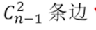
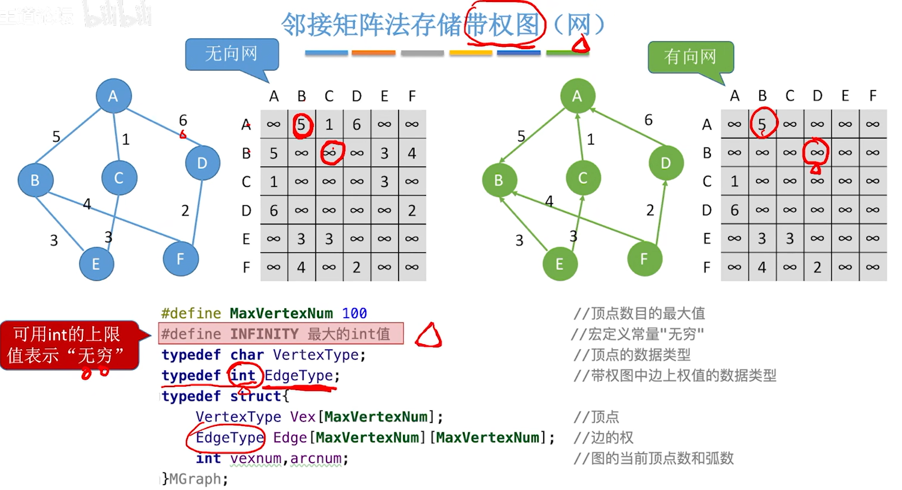
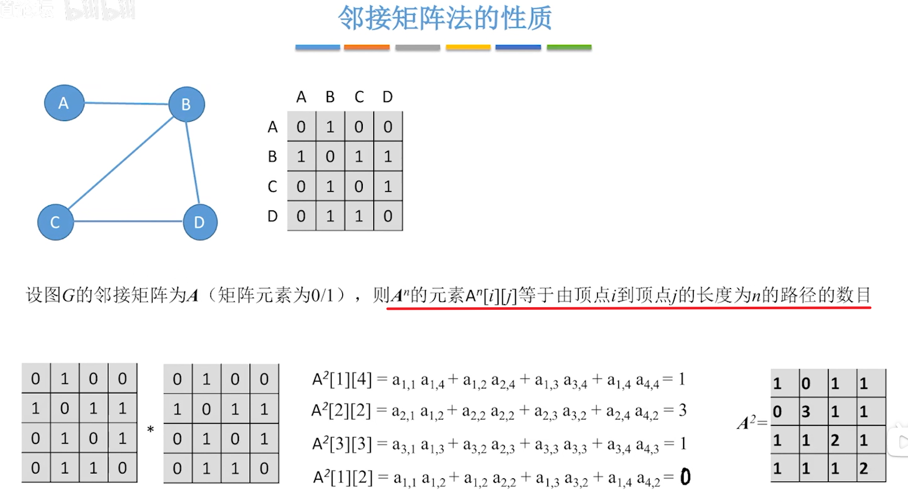
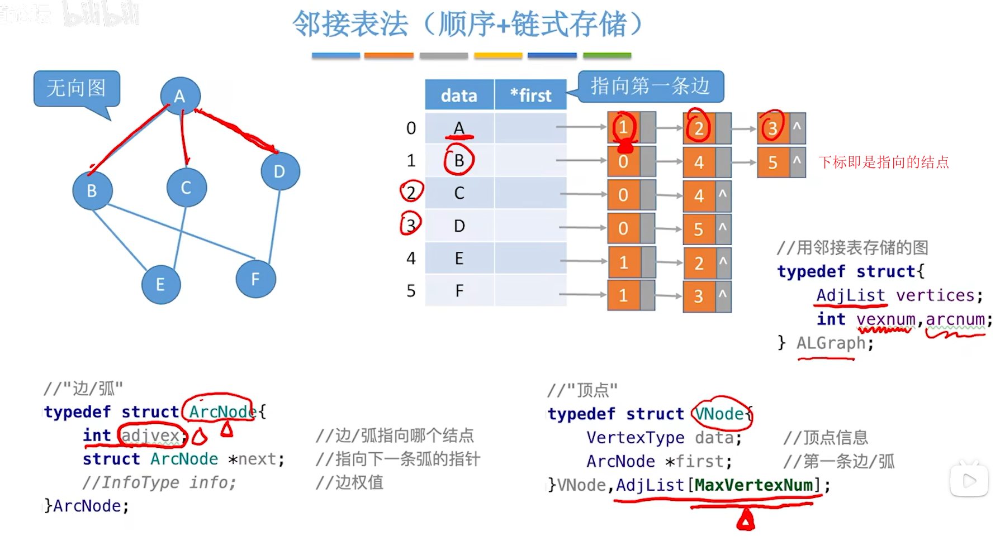
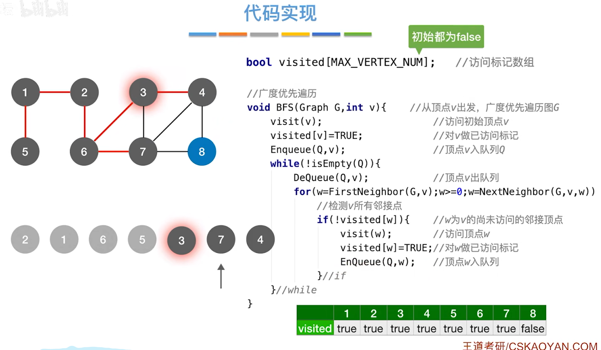

[TOC]

# 四、图

## 1、定义

 

## 2、类型

### 2.1、有向图/无向图

 

### 2.2、简单图/多重图

 

## 3、概念

### 3.1、度

 

### 3.2、顶点-顶点的关系描述

> 强调几个地方
>
> `简单路径`：指的是顶点不重复出现的路径
>
> `点到点的距离`：从顶点u出发，到顶点v的最短路径的距离，若不存在则为无穷
>
> `强连通`：在有向图中，从u到v的路径存在，从v到u的路径存在

 

### 3.3、连通图

> **连通图**：
>
> 对于n个顶点的无向图G，
>
> 若G是连通图，则最少有n-1条边
>
> 这个嘛，就拿树来联想吧，除了根节点，每个结点头上都有一条线
>
> 
>
> 若G是非连通图，则最多可能有
>
> n-1个结点，任意两两配对所形成的边数，必须除去了一个结点，防止形成连通图
>
> 
>
> **强连通图**：
>
> 若G是强连通图，则最少有n条边
>
> 结合下图理解
>
>  
>
> 

 

### 3.4、子图

> **生成子图**，包含原图的所有顶点，边集合包含于原边集合

 

### 3.5、连通分量/强连通分量

> `无向图`中的`极大连通子图`称为`连通分量`
>
> **极大连通子图**：子图必须连通，且包含尽可能多的顶点和边

 

> **强连通分量**

 

### 3.6、生成-树/森林

> `连通图`的`生成树`：包含图中`全部顶点`的一个`极小连通子图`(边尽可能地少，但要保持连通)
>
> 若连通图的定点数为n，则它的生成树含有n-1条边。对生成树而言，若砍去它的一条边，则不连通；若加上一条边则会形成回路

 

 

### 3.7、带权图

 

### 3.8、完全图

 

### 3.9、稀疏/稠密图

 

### 3.10、树

 

### 3.11、总结

.assets/image-20221113163313840.png)

## 4、邻接矩阵法

 

### 4.1、出入度

.assets/image-20221113164047751.png)

### 4.2、带权图

 

### 4.3、性能分析

 

### 4.4、性质

> A^n的元素A^n[i] [j] = 从顶点i到顶点j的长度为n的路径的数目
>
> 例：A^2[1] [4] = 把原矩阵的第一行 * 第四列，得到的值就是路径数目的个数

 

> A^3[1] [4] = 把A^2[1] [4]的第一行 * 原矩阵的第四列，得到的值就是路径数目的个数

 

### 4.5、总结

 

## 5、邻接表法

> *first指向第一条边，而链表的每一个结构体中间存储了指向的下标

 

> 如何求顶点的度？入度？出度？
>
> **无向图**：很简单，遍历得到这个结点的链表长度完事了
>
> 
>
> **有向图**：出度，遍历得到该接点的链表长度；但是入度就很麻烦，你要遍历数组全部元素的链表，求出指向指定结点的结点的个数
>
> 

 

## 6、图的基础操作

 

### 6.1、BFS(广度优先遍历)

 

> 整挺好，但是忽略了非连通图的情况

 

> 补充一下`遍历的可变性`
>
> 同一个图的`邻接矩阵`表示方式唯一，所以最后会是一个递增的结果
>
>  
>
> 
>
> 同一个图的`邻接表`表示方式不唯一，BFS得到序列不唯一
>
>  
>
>  

> 最终代码实现

 

> **性能分析**
>
> *空间复杂度*
>
> 可能辅助队列的空间复杂度量级最大为O(|V|)
>
>  
>
> 
>
> *时间复杂度*
>
> 主要来自于访问结点和访问边
>
> 

 

## 逻辑结构の总结

.assets/image-20221113180522651.png)

`

`

`

`

`

`