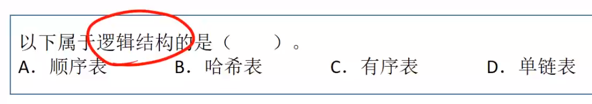
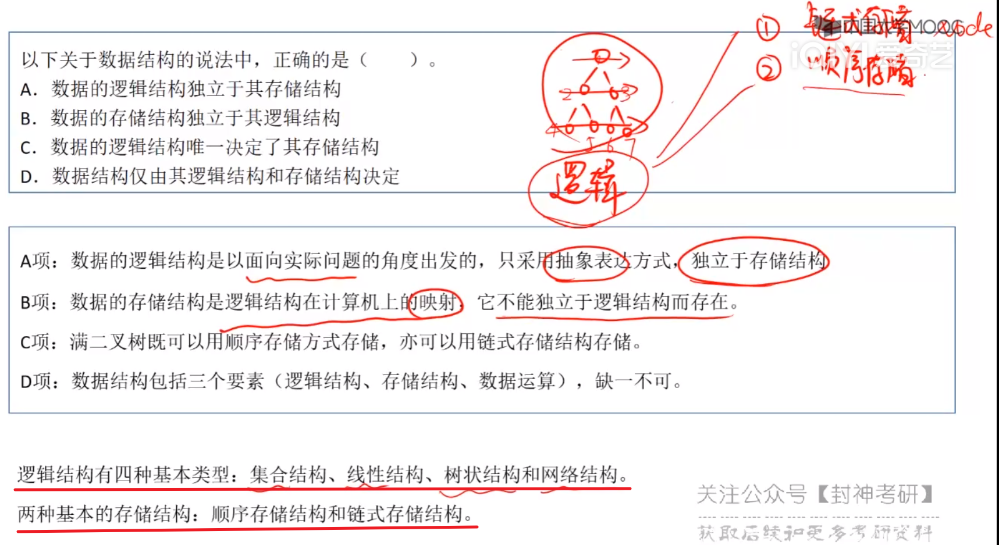

[TOC]


# 一、概念


## 0、绪论

先看下打怪世界的instruction

### 0.1、信息化世界的结构

 


### 0.2、数据

 


### 0.3、结构

 


 


  


 	


  


#### 习题

> `抽象数据类型`描述了`数据的逻辑结构`和`抽象运算`
>
>    如链表		 存储数据的逻辑方式    增删查改
>
> 
>
> 通常由[数据对象，    数据关系，     基本操作集]表示
>
> ​	   如数组    一对一(一对多)    增删查改

 


> 线性结构的特点是一对一

 


> ABD都是同时定义了逻辑结构和物理结构的，不可说它是逻辑结构了
>
> 而，有序表仅仅包含了“有序”这个逻辑，所以它属于逻辑结构

  


> 文字题罢了，问题问的是结点内的存储单元地址
>
> 结点之间的内存地址可能不连续，但是结点内部的那几个元素啊，什么ElemType和和*p，这几个玩意肯定是地址连续的啊，而且他们还要内存对齐呢

 

> 这道题的考点很明晰
>
> 带结构的，我们一下就想到存储结构和逻辑结构
>
> 依次分析，
>
> A：循环队列，用数据表(存储，因为循环表明了它存储的模型)表示的队列(逻辑，先进先出)，它是存储结构和逻辑结构的结合体，所以它与存储结构有关：
>
> B、C：链表、哈希表，都是存储结构啊
>
> D：仅仅是逻辑结构，满足先进后出的逻辑即可
>
> 选D

 

> 举个例子，我要实现二叉树，那么它有链式存储和顺序存储的两种存储结构
>
> 所以C错了
>
> D错在没有考虑到数据运算
>
> B是错的，存储结构(顺序存储和链式存储)都是依托与，我需要实现的二叉树这个逻辑结构才能出现的，也就是要先有理念，才有实物
>
> A：以面向实际问题(建立一个二叉树)触发，使用抽象的表达方式

 


> 数据其实等于数据对象和其的数据关系，如果只有对象，而没有关系，那么就是一盘散沙
>
> A：存储数据无需操作存储的方法，存储数据结构(三要素)才要
>
> B：数据元素的类型隐含于数据元素中，很简单啊，计算机底层又不会管你什么int、long，你的数据元素存储多少个字节就是什么类型，所以你的元素已经表明了
>
> 你的数据类型
>
> D：就是操作的一部分，故不需要

 


> 要知道数据结构包含了三要素：逻辑结构、存储结构和数据运算
>
> 这三者但凡有一个不同，那么就是不同的数据结构
>
> 如二叉树和二叉排序树，逻辑结构和物理结构相同
>
> 但查找结点这个数据运算不同，所以也属于不同的数据结构

 


> 很简单，栈，数组遍历和链表遍历，效率明显前者更高

 


### 0.4、算法

 


### 0.5、算法的时间复杂度

 

 常对幂指阶 


> 例题
>
>  

 


### 0.6、算法的空间复杂度

 


> 例题
>
>  
>
>   


> 递归感觉8太行
>
> 空间复杂度 = 递归调用的深度
>
>   

 

​		


## 1.交换两个变量的值

```c
//1、常规方法
void change(char* p1, char* p2)
{
	int tmp = 0;
	tmp = *p1;
	*p1 = *p2;
	*p2 = tmp;
}


//利用加法
void change(char* p1, char* p2)
{
    //牛的
	*p1 = *p1 + *p2;
	*p2 = *p1 - *p2;
	*p1 = *p1 - *p2;
}


//利用异或(^)
void change(char* p1, char* p2)
{
    
	*p1 = *p1 ^ *p2;
	*p2 = *p1 ^ *p2;
	*p1 = *p1 ^ *p2;
}

//第四个，牛逼，要底层汇编可能才能彻底看懂吧
//跟具体编译器类型有关，不一定有效。例如在VS的Windows编译器、GDB都不行。
b = (a + b) - (a = b);
```

> 1. 归零律：a⊕a=0 （每一位相加，忽略进位的结果肯定为0）
>
> 2. 恒等律：a⊕0=a  （每一位和0相加还是它本身）
>
> 3. 交换律： a⊕b=b⊕a    
>
> 4. 结合律：a⊕b⊕c=（a⊕b）⊕c=a⊕（b⊕c）
>
> 5. `自反：a⊕b⊕b=a⊕（b⊕b）=a⊕0=a（由上面推导得出）`
>
>    **第五条结论很重要，请先完全搞明白**
>
> 面试中经常问到如何不使用第三个变量交换两个数的值？
>
> 答案是
>
> a = a ^ b;
> b = a ^ b;
> a = a ^ b;
> 很多人不知道为什么   接下来就推导下
>
> 假设 刚开始 a=x  ， b=y。
>
> 第一次异或运算 `a= a^b = x^y`，b还等于y
> 第二次异或运算 b= `a^b = x^y^y = x^0 =x` ，此时b的值变为x
> 第三次异或运算 a= a^b = x^y^x = y^0 = y，此时a的值变为y
> 至此完成了交换过程。当然使用该方法进行变量交换时需要注意一点，a、b对应的内存区域一定不可以是同一块，因为如果是一块区域异或操作会把这块内存的数值改成0。（数组中的交换位置需要特别注意）


## 2、时间复杂度

当两个核心代码段都有各自的复杂度时，计算总的复杂度应该遵循以下原则

(1)如果是并行的两段代码，则取**复杂度最大**的代码段为总的复杂度

(2)如果是有for循环等循环、嵌套操作时，即采取**复杂度相乘**作为总的复杂	度	

.assets/image-20220902151646338.png) 

.assets/image-20220902152041271.png)

.assets/image-20220902154155123.png)

.assets/image-20220902154258467.png)


​	


## 3、结构体

### 3.1、结构体指针作为函数参数

结构体变量名代表的是整个集合本身，作为函数参数时**传递的整个集合**，也就是所有成员，而不是像数组一样被编译器转换成一个指针。

如果结构体成员较多，尤其是成员为数组时，传送的时间和空间开销会很大，影响程序的运行效率。

所以最好的办法就是使用结构体指针，这时由实参传向形参的只是一个地址，非常快速。


### 3.2、结构体内存对齐


### 3.3、typedef的使用

typedef可以对数组、指针、结构体、函数起别名

```c
//关于typedef我的理解就是从新名字解码(解封)，得到左边的数据类型，来判断右边新名字的含义
//当然自定义的话还是得根据需求好好想一想

//对数组起别名
//解析一下，右边ARRAY[20]等价于左边的char，就说明ARRAY这个新的数据类型 代表了一个长度为20的字符数组
//ARRAY a 等价于 char a[20];
typedef char ARRAY[20];

//给结构体起别名
//Struct Student stu 等价于 STU stu;
typedef struct Student{
  char name[20];  
}STU;

//给指针起别名
//从右边解码，由于括号，先*PTR_TO_ARR后[4]，得到左边的int
//于是看出PTR_TO_ARR这个数据类型，封装了一个指向int [4]数组的指针
//PTR_TO_ARR ptr 等价于 int (*a)[4];  
typedef int (*PTR_TO_ARR)[4];

//给函数起别名
//等价于 我们知道，单独的int (*p)(int,int)，p代表定义了一个函数指针(其返回值为int，两个int形参数)，
typedef int (*PTR_TO_FUNC)(int, int);
PTR_TO_FUNC pfunc;
```


## 4、内存结构

| 内存区域 | 内容                                                         |
| -------- | ------------------------------------------------------------ |
| 栈区     | 存放函数的参数值、局部变量等，由编译器自动分配和释放，通常在函数执行完后就释放了，其操作方式类似于数据结构中的栈 |
| 堆区     | 就是通过new、malloc、realloc分配的内存块，编译器不会负责它们的释放工作，需要用程序区释放。分配方式类似于数据结构中的链表。“内存泄漏”通常说的就是堆区。 |
| 静态区   | 全局变量和静态变量的存储是放在一块的，初始化的全局变量和静态变量在一块区域，未初始化的全局变量和未初始化的静态变量在相邻的另一块区域。程序结束后，由系统释放。 |
| 常量区   | 常量存储在这里，不允许修改。                                 |
| 代码区   | 顾名思义，存放代码                                           |

> 1.void *malloc(unsigned int size)：作用是在动态存储区中分配一个长度为size的连续空间，unsigned代表没有符号位的整形数据(非负整数)，返回所分配内存区域第一个字节的地址.分配失败返回NULL指针
>
> 2.void *calloc(unsigned n,unsigned size)：作用是在动态内存空间中分配n个长度为size的连续空间，分配失败返回NULL指针
>
> 3.void free(void *p)：释放指针变量p所指向的动态空间
>
> 4.void *realloc(void *p,unsigned int size):对已经通过malloc函数calloc函数获得了动态空间，想改变其大小，用此函数重新分配

> 注意：**void\*类型的指针表示指向空类型或者不指向确定的类型的数据**
>
> 以上函数得使用`#include<stdlib.h>`


