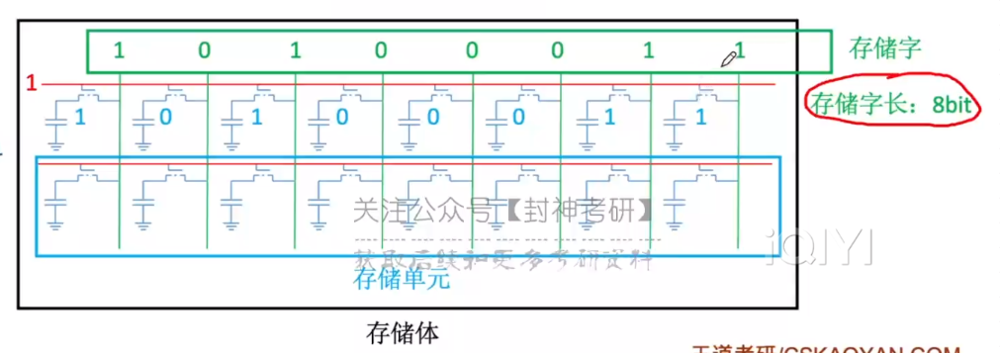

[TOC]

# 三、存储系统

## 1、基本概念

 

### 1.1、存储器的层次结构

> **1.先介绍金字塔**
>
> `CPU <—— 寄存器 <—— Cache <——   主存 <—— 磁盘 <—— 磁带、光盘`
>
>  |		 |		 |	      |	   |          |
>
> 大哥	   二哥  `高速缓冲存储器` 内存嘛    辅存       外存
>
> (当然，*某些书把磁盘也叫做外存就是了*)
>
> `从底到头，速度最快、容量最小、价格最高`
>
> 
>
> 大多数你懂，我就拎出`Cache和寄存器`讲一下吧
>
> **寄存器嘛**：MQ，ALU这些，那么他们为什么居然在CPU大哥之下呢，因为**这二哥要存储CPU(运算器、控制器)运算时产生的数据，或者需要存一些指令地址啥的**，总之`它的速度必嘎嘎快，才能跟上大哥啊`
>
> **Cache**：这哥们学名叫做`高速缓存寄存器`，有啥用呢？因为`西皮优速度实在太快了，主存跟它数据交换的时候还是赶不上它的需求`，于是`加了个中间速度的Cache来缓冲一下`，搭了个阶梯，免得楼太高，一步摔下去了。
>
> 
>
> **2.再解释流程图**
>
> 看一遍差不多了，我补充几个点
>
> 1.`辅存中的数据要调入主存中才能被CPU访问`，*所以你打开一个软件开始卡几秒，除非是软件乐色，一般都是在辅存调到主存里面*
>
> 2.`主存-辅存`：实现了`虚拟存储系统`，可以**有效解决主存容量不够**的问题
>
> 3.`主存和辅存`的数据交换需要借助到`硬件+操作系统`
>
> 
>
> 4.`主存与Cache`的数据交互，`硬件直接完成`
>
> 5.<u>主存也可以和CPU直接交换</u>，但是一些`高频次被调度的资源`，直接`放到Cache中`，这样`CPU访问也可以更快一点`
>
> 6、什么叫高频词被调用的资源，*好比你打视频通话时，这块区域的数据高强度调用，放到Cache里面，CPU访问的内存的时候更快，就不会那么卡*
>
>  
>
> 

 

> 下面就是Cache，内存条，辅存磁盘，外存光盘
>
> 还有个三星的固态硬盘，这玩意比磁盘猛的多

 

### 1.2、存储器的分类

#### 1.2.1、存储介质

 

#### 1.2.2、存取方式

> RAM SAM DAM
>
> SAM、DAM为串型访问存储区：读写某个存储单元的时间与存储单元的物理位置有关

 

> 与上面三者都不同
>
> **相联存储器**：`按内容访问的存储器`，上面的三者都是给地址去找内容，`这哥们根据内容去遍历，直到找到需要的内容`
>
> "快表"就是相联存储器

 

#### 1.2.3、信息的可改性

ROM

 

#### 1.2.4、信息的可保存性

 

### 1.3、性能指标

> 两个注意的点：
>
> 第一，`存储字数，是以字节为最小单位的`，好比1M，是指1MB，不是1Mb
>
> 第二，`存储周期`分为`存取时间`和`恢复时间`
>
> *存取时间*：启动一次存储器操作到完成该操作作所经历的时间，分为读出时间/写入时间
>
> *恢复时间*：这哥们进行一次读取后，有点贤者时间，所以也给它算到周期去了	

  

### 1.4、总结

 

## 2、主存储器的基本组成

### 2.1、基本的半导体元件及原理

> **存储单元的组成原理**
>
> 一、认识器件
>
>   `MOS管`(Metal-Oxide-Semiconducter)
>
> ​	`输入电压达到某个值才接通`，类似于一种电控开关，所以才叫半导体啊
>
>   `电容`
>
> ​	<u>存电放电嘛</u>
>
> 二、工作原理
>
>   `读出`：*给MOS管施加电压，接通导线*，`电容存储的电荷就会沿着导线流出，形成电流`，所以当我们*检测到电流的时候就能判断存储的数据为1，否则为0*
>
>   `写入`：*给MOS管施加电压，接通导线*，`再在导线一端施加电压，给电容充电，相当于存储了一个信号
>
>  
>
>  集成了存储单元的存储体。红线控制MOS管，绿线检测/输入电流
>
> 
>
> 有两个点确实疑惑，期待你以后能给我解答
>
> 连续写入不会出事吗？好歹也得先电容存储的电荷放出来吧。。。连续读出不会有事？电容都没电了
>
> 

 

`

`

`

`

`

`

