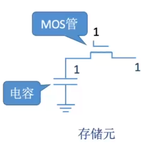
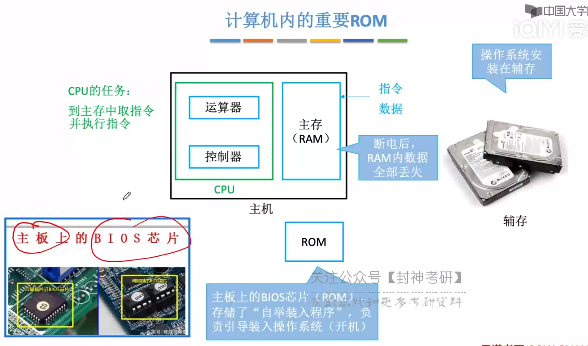
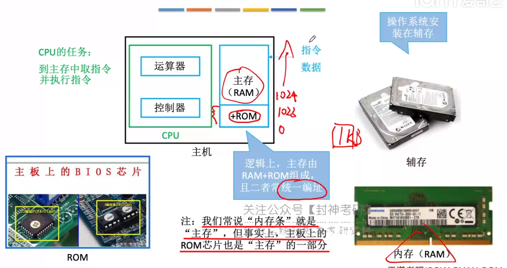

[TOC]

# 三、存储系统

## 1、基本概念

 

### 1.1、存储器的层次结构

> **1.先介绍金字塔**
>
> `CPU <—— 寄存器 <—— Cache <——   主存 <—— 磁盘 <—— 磁带、光盘`
>
>  |		 |		 |	      |	   |          |
>
> 大哥	   二哥  `高速缓冲存储器` 内存嘛    辅存       外存
>
> (当然，*某些书把磁盘也叫做外存就是了*)
>
> `从底到头，速度最快、容量最小、价格最高`
>
> 
>
> 大多数你懂，我就拎出`Cache和寄存器`讲一下吧
>
> **寄存器嘛**：MQ，ALU这些，那么他们为什么居然在CPU大哥之下呢，因为**这二哥要存储CPU(运算器、控制器)运算时产生的数据，或者需要存一些指令地址啥的**，总之`它的速度必嘎嘎快，才能跟上大哥啊`
>
> **Cache**：这哥们学名叫做`高速缓存寄存器`，有啥用呢？因为`西皮优速度实在太快了，主存跟它数据交换的时候还是赶不上它的需求`，于是`加了个中间速度的Cache来缓冲一下`，搭了个阶梯，免得楼太高，一步摔下去了。
>
> 
>
> **2.再解释流程图**
>
> 看一遍差不多了，我补充几个点
>
> 1.`辅存中的数据要调入主存中才能被CPU访问`，*所以你打开一个软件开始卡几秒，除非是软件乐色，一般都是在辅存调到主存里面*
>
> 2.`主存-辅存`：实现了`虚拟存储系统`，可以**有效解决主存容量不够**的问题
>
> 3.`主存和辅存`的数据交换需要借助到`硬件+操作系统`
>
> 
>
> 4.`主存与Cache`的数据交互，`硬件直接完成`
>
> 5.<u>主存也可以和CPU直接交换</u>，但是一些`高频次被调度的资源`，直接`放到Cache中`，这样`CPU访问也可以更快一点`
>
> 6、什么叫高频词被调用的资源，*好比你打视频通话时，这块区域的数据高强度调用，放到Cache里面，CPU访问的内存的时候更快，就不会那么卡*
>
>  
>
> 

 

> 下面就是Cache，内存条，辅存磁盘，外存光盘
>
> 还有个三星的固态硬盘，这玩意比磁盘猛的多

 

### 1.2、存储器的分类

#### 1.2.1、存储介质

 

#### 1.2.2、存取方式

> RAM SAM DAM
>
> SAM、DAM为串型访问存储区：读写某个存储单元的时间与存储单元的物理位置有关

 

> 与上面三者都不同
>
> **相联存储器**：`按内容访问的存储器`，上面的三者都是给地址去找内容，`这哥们根据内容去遍历，直到找到需要的内容`
>
> "快表"就是相联存储器

 

#### 1.2.3、信息的可改性

ROM

 

#### 1.2.4、信息的可保存性

 

### 1.3、性能指标

> 两个注意的点：
>
> 第一，`存储字数，是以字节为最小单位的`，好比1M，是指1MB，不是1Mb
>
> 第二，`存储周期`分为`存取时间`和`恢复时间`
>
> *存取时间*：启动一次存储器操作到完成该操作作所经历的时间，分为读出时间/写入时间
>
> *恢复时间*：这哥们进行一次读取后，有点贤者时间，所以也给它算到周期去了	

  

### 1.4、总结

 

## 2、主存储器的基本组成

### 2.1、基本的半导体元件及原理

> **存储单元的组成原理**
>
> 一、认识器件
>
>   `MOS管`(Metal-Oxide-Semiconducter)
>
> ​	`输入电压达到某个值才接通`，类似于一种电控开关，所以才叫半导体啊
>
>   `电容`
>
> ​	<u>存电放电嘛</u>
>
> 二、工作原理
>
>   `读出`：*给MOS管施加电压，接通导线*，`电容存储的电荷就会沿着导线流出，形成电流`，所以当我们*检测到电流的时候就能判断存储的数据为1，否则为0*
>
>   `写入`：*给MOS管施加电压，接通导线*，`再在导线一端施加电压，给电容充电，相当于存储了一个信号
>
>  
>
>  集成了存储单元的存储体。`红线控制MOS管，绿线检测/输入电流`
>
> 
>
> 有两个点确实疑惑，期待你以后能给我解答
>
> 连续写入不会出事吗？好歹也得先电容存储的电荷放出来吧。。。连续读出不会有事？电容都没电了
>
> ​	宝，后面有

 

### 2.2、存储芯片的基本原理

> **原理来咯**
>
> `译码器`这哥们`通过MAR给的地址`，`选中指定的字选线(红线)`，然后字选线上面不是有电压电流吗
>
> `此时MOS就会接通，然后就可以读写了`
>
> **读**：*电容接通数据线(绿线)*，`数据根据是否有电流，判断出0/1，然后传导到MDR中`，这样就相当于把数据读取出来了
>
> **写**：*电容接通数据线(绿线)*，`MDR中有电压的话，就会通过导线传到电容去`，好像就把0/1传导过去一样

 

> 带有**控制电路**的MSI芯片
>
> 1、**控制电路**
>
> *片选线*：<u>非CS或者非CE</u>，其实就是*低电平有效的使能端*
>
> ——> 采用两根读写线
>
> *读控制线*：控制读取数据，<u>非OE，允许读</u>
>
> *写控制线*：控制写入数据，非WE，允许写
>
> ——> 采用一根读写线
>
> *读/写控制线*：<u>非WE，低电平写，高电平读</u>
>
> 
>
> 2、作用：
>
> 当MAR工作的时候，可能电信号不稳，控制电路控制`只有当它稳定的时候才会打开译码器接受地址信号`
>
> 当MDR读取读入数据时，可能电信号不稳，控制电路控制`当它稳定的时候才能继续工作`

 

> `控制电路，译码器，存储器等等电路封装好了的存储芯片`		         		`内存条，内存条上的黑色部分就是存储芯片`

 

> `所谓存储容量，就是存储单元个数 x 存储字长` 		  `一条线对应一个金属引脚`

 

### 2.3、寻址

> *按字节寻址就简简单单嘛*，`看蓝色图标，存储单元对应的下标就是字节对应的地址啦`
>
> *但是按字寻址呢？*
>
> 当我`访问下标为1的`字的时候，实际上是`去访问整个第二行`，`利用一维数组的思想(头地址代表整个数组的地址)，访问的地址其实就是下标为4的字节`
>
> 由于**一个字等于四个字节**，那就把`字的地址算术左移两位(乘以4)`，就可以得到对应的字节位置了

 

### 2.4、总结

 

## 3、SRAM和DRAM

> | 存储器                                     | 区别                       |
> | ------------------------------------------ | -------------------------- |
> | SRAM: Static Random Access Memory（静态）  | 使用“双稳态触发器”存储信息 |
> | DRAM: Dynamic Random Access Memory（动态） | 使用“栅极电容”存储信息     |
>
> 

  

### 3.1、SRAM VS DRAM

> 双稳态触发器：通过读取BL和BLX的电平，判断读取的0/1
>
> ​			BL为低电平，读0；BLX为低电平，读1
>
> 写入也是如此，给BL低电平，BLX高电平，则写入0；
>
> ​			给BL高电平，BLX低电平，写入1

  

 集成度低的DRAM肯定功耗、成本都比SRAM小一点啦

 DRAM还要刷新啊，感觉好拉

> SRAM常用作Cache
>
> DRAM常用作主存

  

### 3.2、DRAM的刷新

> 1、**多久刷新一次**？
>
> ​	`刷新周期：一般为2ms`
>
> 2、**每次刷新多少存储单元**？
>
> ​	`以行为单位，每次刷新一行存储单元(下面有解析)`
>
> 3、 **如何刷新**？
>
> ​	有硬件的支持，`读出一行的信息再将其重新写入`，<u>占用1个读/写周期</u>
>
> 3、**在何时刷新**？
>
> 有三种选择
>
> | 刷新选择 | 操作                                                       | 缺点                                                         |
> | -------- | ---------------------------------------------------------- | ------------------------------------------------------------ |
> | 分散刷新 | 每次读/写之后都找个行刷新得了                              | 太耗时了，本来正常读/写都占1个读写周期了，再搞个刷新，又占1个读写周期，相当于读写时间翻倍了 |
> | 集中刷新 | 在2ms之后集中安排某个时间全部刷新了                        | 你刷新的那段时间，存储器啥都不能干，也不能访问，变成“死区”   |
> | 异步刷新 | 将集中刷新的时间分散，求出要刷新的次数，每隔多少秒刷新一次 | goodJobMAN                                                   |
>
> 

  

> 2、**每次刷新多少存储单元**？
>
> `以行为单位，每次刷新一行存储单元`
>
> 什么叫以行为单位？那就是`存储单元被排列成2^(n/2) X 2^(n/2)的矩阵`，`拆分为行列地址`
>
> 如下图，本来是0-2^(n)-1个存储单元，*即2^(n)个存储单元*
>
> **被分成了行2^(n/2)、列2^(n/2)的矩阵了**
>
>  
>
> 
>
> **为什么要分成行列地址**？
>
> 如果不分开，假设寻址0000 0000
>
> `八位需要2^8条选通线`					如果分开0000 0000，*前4位为行地址，后4位为列地址*，`需要选通线(2^4+2^4)条`		
>
>   

 

### 3.3、DRAM的地址复用技术

> 此技术具体体现在*送行列地址的方式*，`SRAM同时送，DRAM分两次送`
>
>  
>
> 
>
> 1、**地址复用技术**
>
> ​	很简单，看下图，`共用相同的地址线`，先把`行地址信息`送到`行地址缓冲器`，再把`列地址信息`送到`列地址缓冲器`
>
> 2、**为什么需要这个技术**？
>
> ​	假设我们有32位地址，如果我们需要32条地址线，前16条传送行，后16条传送列，同时工作。
>
> ​	但是如果我们如果复用相同的地址线呢，即只有16条，`先传行，再传列`，如此，金属引脚也会少很多，喵哉
>
> 3、**为什么SRAM同时送行列地址**？
>
> ​	因为这哥们集成度低，存放的数据少，相应的，地址线也会少一点

  

↑
|
|
|

 

|
|
|
↓

## 4、只读存储器ROM

### 4.1、多种ROM

> **MROM**：Mask Read-Only Memory --掩模式只读存储器
>
> ​	厂家根据用户的需求`直接在存储器写入信息，`之后不可写，只能读`
>
> **PROM**：Programmable Read-Only Memory --可编程只读存储器
>
> ​	`用户自己写`，但是`写完之后，只可读了`
>
> **EPROM**：Erasable Programmable Read-Only Memory --可擦除可编程只读存储器
>
> ​	允许`用户自己写入`，并且之后`可以擦除数据，进行重写`
>
> ​	*UVEPROM：利用紫外线擦除所有信息*
>
> ​	*EEPOROM：利用“电擦除”，擦除特定的字*
>
> **Flash Memory**：--闪存
>
> ​	断点后也能保存信息，可`以进行多次快速擦除重写`，我记得好像是把电信号存到一个晶体里面了
>
> ​	*数据要先擦除才能写入，所以写入的速度慢于读入的速度*
>
> **SSD**：Solid State Drives --固态硬盘
>
> ​	由`控制单元+存储单元(闪存)构成`，因此可多次进行擦除重写

 

### 4.2、BIOS芯片

> 计算机`操作系统的信息安装在辅存中`
>
> 当开机的时候，`CPU就调用BIOS芯片(ROM)存储的“自举装入程序”`，将操作系统的文件加载到电脑去

 

> 理论上，“主存”本来应该只包含RAM
>
> 但是，缺少了存储系统文件的BIOS芯片(ROM)的调味，主存味同嚼蜡(bushi
>
> 因此，`逻辑上，我们把BIOS芯片(ROM)和RAM结合，组成“主存”`
>
> ​	这块ROM芯片地位有多高呢？为了它，`RAM需要与其统一编址`
>
> ​	好比前1024位留给ROM，那么RAM得到1025才能起头
>
>  

 

### 4.3、总结

 

## 5、主存储器和CPU的连接

### 5.1.单块存储芯片与CPU的连接

 

> 字扩展和位扩展

 

>  MDR和MAR润到CPU了

`

`

`

`

`

`

