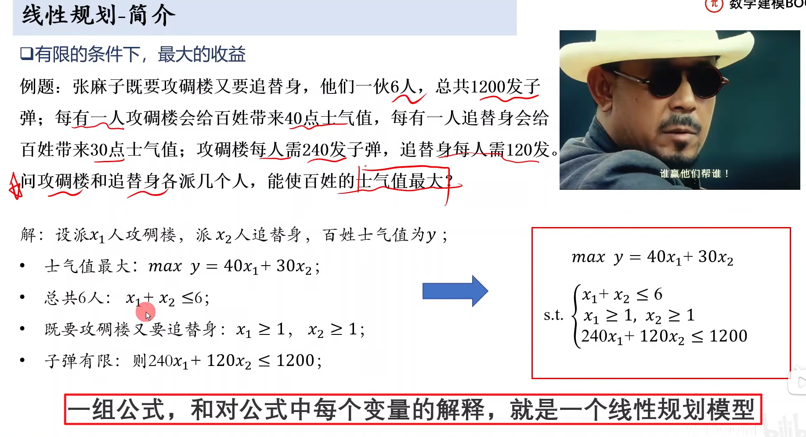
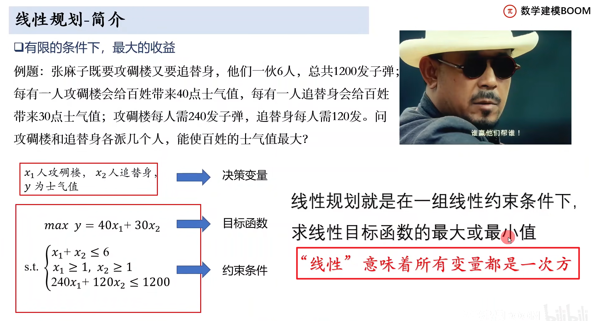

[TOC]


# 一、线性规划

## 1、入个门先

> - 喵的记成了DP了
> - 什么是线性规划模型？
>   - 一组公式，对公式中每个变量的解释

 


> - 认识决策变量，目标函数，约束条件

 


## 2、适用题目

> - 注意：总收益最大适合，但是`总收益率最大不适合`
>   - 因为率等于一个x/y，x为收益，y为总支出；这不属于线性范畴了

  


## 3、代码实现

> - 最大值不能直接求得
>   - 由于matlab只能求函数的最小值，所以需要准换一下
>   - 求x_max = (-x)_min
>   - 于是可以看到`下图求最大转换为了求最小`
> - `目标函数`只能用`列向量表示`，合理`利用矩阵的转置`来表示就OK了

 

```matlab
f = [-40;-30]; % 目标函数中变量的系数矩阵
a = [1,1;-1,0;0,-1;240,120]; % 小于等于的约束条件的常数矩阵
b = [6;-1;-1;1200]; % 小于等于的约束条件的常数矩阵

% 标准形式：[x, fval] = linprog (f,A,b,aeq,beq,lb)
% 从某个变量开始后面全没有的话，后面的都不用写
% 没有等式约束条件、但有上下界约束的时候，用[]代替函数的参数
[x,y] = linprog(f,a,b)
y = -y % 记得取反，因为求的是负数

```

  


`

`

`

`

`