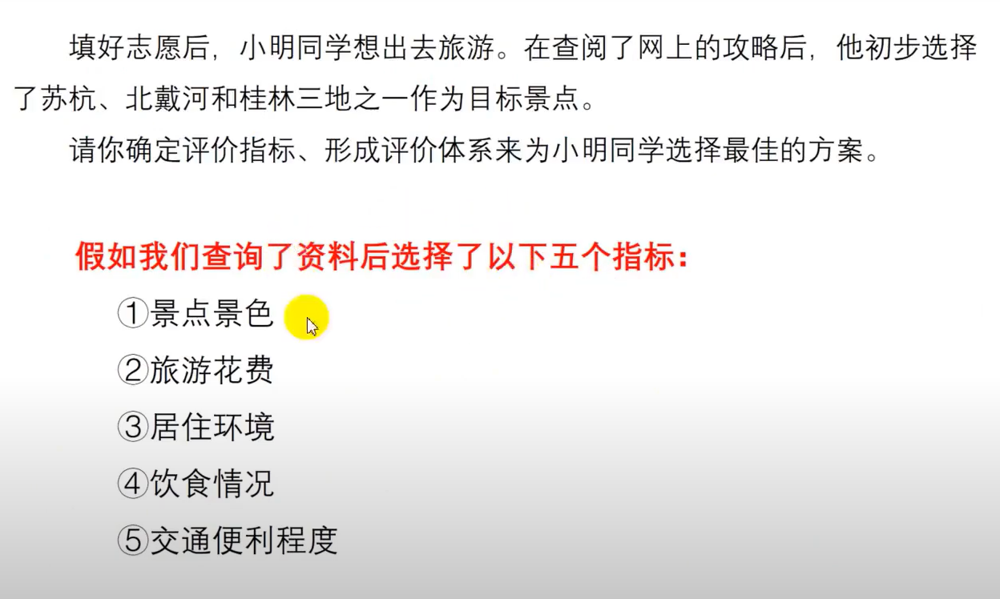
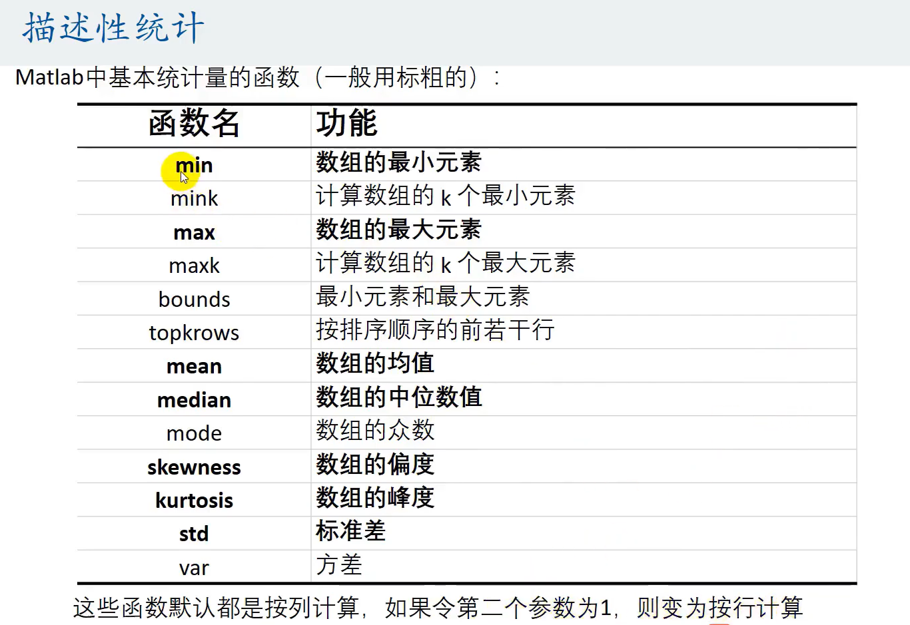
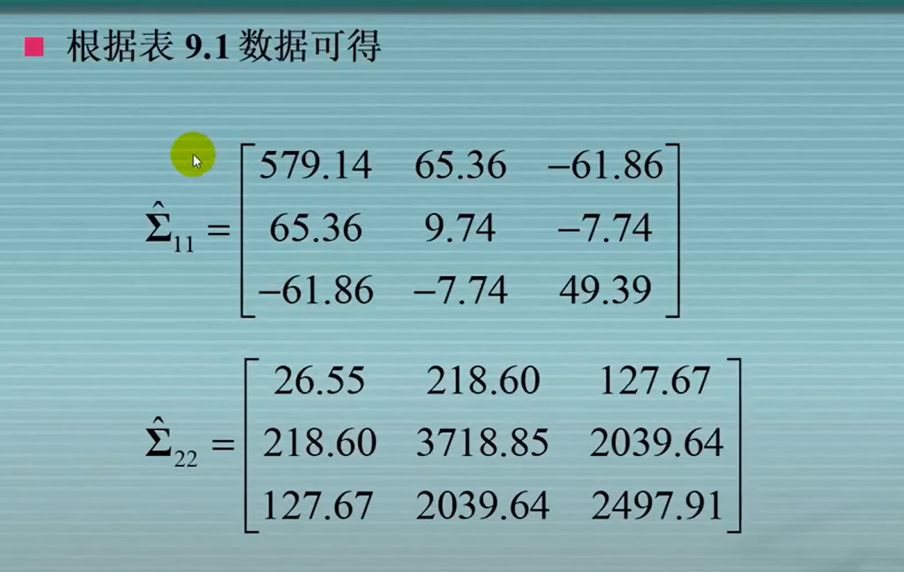
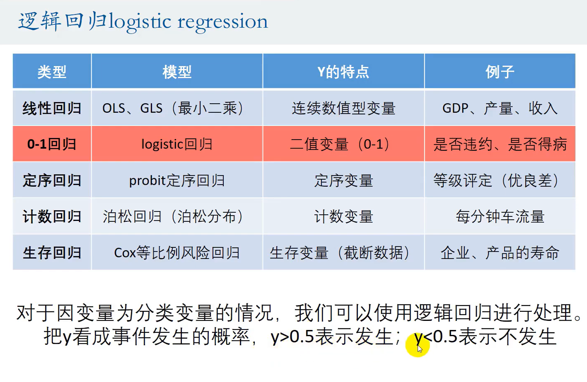
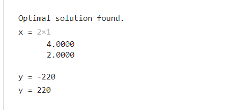
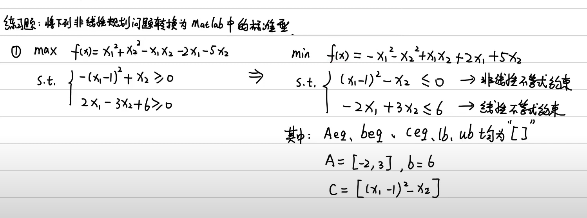

[TOC]


> - 创建算法D

 

 


> - 图表

 


> - 度
>   - 理解模型逻辑，明确模型应用场景，了解模型优缺点
>   - 对可能的各类问题和对应的主要解决方法做一个总结，做到在看见赛题时大致知道这是哪类问题，该用什么方法。除了常用方法，还应该积累一些不太常见，看着“高深”的方法。


 

# ----评价类模型----

# 一、层次分析法

## 1、入个门先

 

 

> - 步骤

> - 第一步，`一定要画图`

 


> - 第二步，自己填就好了，有理可据就行

 


> - 第三步，一致性检验
>   - 三种都得用

 

 

 


> - 第四步

 


> - 局限性

 


> - 结合示例理解

> - `1.找出评价指标`
>   - 查找文献，小组讨论

 


> - `2.确定指标的权重`
>   - 分治法，先考虑局部的比较

 


> - `3、设置重要程度标准表`
>   - 这玩意先看看题目能不能找出程度表，找不出自己给就好了，偷偷地给，打枪滴不要

 


> - `4、列出判断矩阵`
>   - 只用填对角线一半的，剩余一半自动取倒数

 

> - 层次分析法中的判断矩阵：正互反矩阵

 


> - 得到地区的判断矩阵

 


> - `5、解决矛盾`
>   - 可能出现某个元素的权重既大于另一个元素又小于另一个元素
>   - 在使用判断矩阵求权重之前，要先进行**一致性检验**
>   - 一致矩阵：各行各列为倍数关系的正互反矩阵

 


> - 一致性检验原理：

 

 


> - 一致性检验的步骤

 

 


> - `6、得到多个判断矩阵的权重`

> - 如果是一致矩阵的话，如下计算
>   - 计算一列即可，因为其他列成比例

 


> - 不是一致矩阵的话，如下处理

> - 算术平均法求权重
>   - 将三列都用起来

 

> - 为什么要相加除以3？
>   - 扩展样本空间，将三列数据放到其中计算权重

 


> - 特征值法求权重
>   - 把特征值对应的特征向量归一化后拿来做权重，因为特征向量刚好是第一列的值的等比例放缩

 


> - **计算另一个判断矩阵的权重**

 


> - 总结
>   - 算术平均法求权重

 

> - 还有个几何平均法求权重
>   - 跟算术平均没什么区别

 


> - `7、汇总结果得到权重矩阵`

 


> - `8、计算得分`

 


## 2、适用题目

> - 确定评价指标、形成评价体系

  

> - 确认指标

  

 


# 二、优劣解距离法Topsis

## 1、入个门先

> - 为什么要用 ？
>
>   - 拿考试成绩举例，如果仅仅用排名代表评分
>
>     如下，会发现渐即便成绩变化了，但是排名没变，即评分不会发生变化
>
>     因此，`此时的评分并不能反映出成绩的变化，即不能身负“权重”的职责`
>
>      

 

 


> - **步骤**

> - `第一步`
>   - 将原始矩阵正向化：即把所有的指标类型`统一为极大型指标`

 


> - 下面是几种指标正向化的例子

 

  

 


> - `第二步`
>   - 消除不同量纲的影响：抹除它们的一部分属性，保留我们需要的属性

 


> - `第三步`
>   - 计算得分并归一化，得出结论

 


> - **结合示例**

 


> - 新增指标个数
>   - 效益型指标和成本型指标

 


> - 为方便计算，统一指标类型
>   - 此处将所有指标转换为极大型称为指标正向化
>   - `论文中记得指出`

 


> - 标准化处理
>   - 消去不同指标量纲的影响

 

 


> - 计算得分

 

 


## 2、适用题目

 

 


## 3、基于熵权法的模型修正

 


 


 


> - **原理**

 


> - **步骤**

 

 

 


#  .

# ----插值与拟合模型----

# 一、插值算法


 

 


> - **原理**

 

 

 

## 1、拉格朗日插值法

 

 


> - 龙格现象

 

 


## 2、牛顿插值

 


 


> - 牛顿插值和拉格朗日插值的对比

 


## 3、分段插值

### 3.1、分段三次Hermite插值

> - 满足互异和可导即可使用

 

 


### 3.2、三次样条插值

 


# 二、拟合算法

## 1、入门

 


> - **最小二乘法**

 

 


> - **评价拟合的好坏**
> - R^2只能适用于线性函数，其他函数直接看SSE

 


> - 如何界定线性函数
>   - 线性是指参数为线性，就是下图的a或者b什么的

 


#  .

# ----相关性模型----

# 一、概述

 


# 二、皮尔逊相关系数

## 1、入门

> - Person相关系数
>   - 在总体协方差的基础上消去了量纲

 

 

 

 


> - 一些相关误区

  

> - 只有线性相关才能使用皮尔逊相关系数

 


> - 容易忽视的点

 


> - 总结
>   - 如果是线性关系，那么Period越大越相关
>   - 如果不确定关系，这玩意没毛用，所以`先画出散点图看看`

 


## 2、相关系数的假设检验

 


> - 使用条件

 


 


 

 

 

 

> - p值判断法，改进第五步
>   - 其实差不多，p值判断就是比较概率

 


## 3、正态分布检验

> - 第一个方法：Jarque-Bera test

 

> - 正态分布的偏度为0，峰度为3

 


# 三、斯皮尔曼相关系数

## 1、入门

> - 第一种

 

 


> - 第二种
>   - 就是求等级之间的皮尔逊相关系数，不是求原数据的皮尔逊相关系数

 


## 2、假设检验

> - 小样本的情况

 

> - 大样本情况

 


# 四、PEARSON VS SPEARMAN

> - 定序数据使用sperman相关系数

  


# 五、典型相关分析

## 1、入门

> - 举个例子

 

 

 

 


 

 


 

> - 为什么两个典型变量的方差都要为1？
>
>   - 首先，我们需要保证相关系数是唯一的，不能几组实验的相关系数一样
>
>     相关系数是忽略了量纲的，也就是说，A * aX^(1) 和 B * bX^(2)的相关系数 `=` aX^(1) 和 bX^(2)的相关系数
>
>     而如果设置了方差为1就是让X的波动较小，尽量靠近X，不会出现2X这种情况

 


> - 下面的约束条件貌似不是做题时需要的步骤，而是推导时的前件
>
>   不用在意

 


## 2、样本分析

> - 相关系数 = 非零的特征根开根号

> - 进行典型相关分析前，先对两组变量进行相关性检验
>
>   - 一定要假设样本服从正态分布
>
>   - 这里是变量之间是否无关的检验，有一个似然比统计量，你憋问这是干嘛的
>
>     总之这个像A的东西会得到一个Q，我们用这个Q值去进行检验。类似于标准化嘛

 

 

​	

 

> - 典型相关系数检验是否显著
>
>   - 这里是相关系数是否显著的检验，有一个似然比统计量，你憋问这是干嘛的
>
>     总之这个像A的东西会得到一个Q，我们用这个Q值去进行检验。类似于标准化嘛

   


> - 典型相关变量 = 两组变量方差都为1，且能使它们相关系数最大(用数学方法计算)
> - 典型相关系数 = 典型相关变量的相关系数

> - 例题
>   - 求和符号是什么、求和带负号是什么、A是什么
>   
>      
>   
>      
>   
>      
>   
>     
>   
>   - 特征向量干嘛的？Q是什么？什么时候进行显著性检验？第二组不行就不测试第三组了吗
>   
>     - 典型相关系数最大值 = Lambda最大值 = 矩阵A/B的特征根
>     - 典型变量的系数 = 最大特征根Lambda的特征向量
>   
>     - 矩阵的秩 = 非零特征根数 = 进行几组测试
>   
>        
>   
>     - 关于第二组不行第三组不检验的原因
>   
>       定义，直到某个不显著，后面的就不检测了
>   
>       `但是如果存在显著的Lambda至少表明相关系数是显著的`
>   
>        

 

  

 

 


> - 典型相关系数显著性检验

 


> - 强行修改α位点，让显著性出现
> - 继续检测第二对

 


 


## 3、相关矩阵出发

 


> - 示例
> - 干嘛的？怎么干？
>   - 就是把数据标准化了，怎么标准化的？鼠鼠不知道捏

 

 

 


# . 

# ----回归模型----

# 概述

> - 回归的类型

 


> - 主要是研究X和Y的相关性，尝试去解释Y的形成机制，从而通过x去预测y的值
>   - 相关性 ≠ 因果性

 

 

 


> - 回归分析的作用
>   - 找出需要的变量x
>   - 找到x与y的相关性为正/负
>   - 找到x的系数

 


## 1、n元线性回归

> - 数据分类

 


> - 一元线性函数拟合和一元线性回归本质是一样的
>   - 底层思想都是用了最小二乘法，使得残差最小

 


### 1.1、解释系数

> - `回归系数的解释`
>   - 小心内生性
>     - 解决方案就是把扰动项放到自变量去

 

 

> - 由于外生性的要求太高，实际做题时会引入核心解释变量和控制变量
>   - 核心解释变量：在诸多解释变量中我最关注的那个
>   - 控制变量：不太感兴趣，但是为了不让扰动项和核心解释变量相关，我可以把对应的扰动项放入控制变量

 


### 1.2、取对数

> - 何时取对数？好处？

 

> - 如果我取了对数，即让回归函数趋于线性，那又该怎么解释系数呢？
>   - 其实就是从一个单位转换到了一个百分比

 

> - 示例

 

 


### 1.3、定性变量

> - 实例
>   - 类似于true/false

 

> - 那么如何解释回归系数呢?
>   - 

 


### 1.4、扰动项

> - 怎么理解球形扰动项？
>   - 即满足了“同方差”和“无自相关”两个条件
>     - “同方差”：每个扰动项的方差都是相同的；“无自相关”：误差项之间没有相关性

 


> - 存在异方差咋办？
>   - 

 

 


### 1.5、示例

> - STEP
>
>   - 使用regress，得到的结果怎么看？
>
>     - 
>
>     - 关注假设是否成立，原假设为看Prob，大于0.05代表原假设成立，即这个回归是个答辩
>
>       
>
>     - 再看每个系数β的假设检验，检查是否显著。原假设是每个评价都等于零
>
>       
>
>     - 

> - 对应SSR、SSE、SST。还有个自由度df，用来调增拟合优度R^2用的


> - 解释型回归只解释关系，对R^2的关注度不如预测型回归高

 


## 2、逐步回归


# . 

# ----分类模型----

# 概述

 


 

​	

## 1、线性概率模型

### 1.1、概述

> - 有两个问题：内生性和不符合实际值的问题

 


> - 解决了预测值超出[0,1]的情况
>   - 因为将beta和x作为函数F的自变量，而F的值域位于[0,1]之间，就不会出现异常情况了
>   - 其实就是函数的函数，只是把参数函数的映射范围缩小了
> - 为什么F得到是概率但是却能表示期望呢，见下面的那段话，求下期望就知道了

 


### 1.2、Logistic回归

> - 如何选取F呢？
>   - 

  

 

> - 知道了F就是求beta了，怎么求呢？
>   - `由于使用了Logistic回归`，已经是非线性模型了，所以利用极大似然估计beta

 

> - 总结步骤

 


## 2、Fisher线性判别分析

 


# . 

# ----聚类模型----

# 概述

 


## 1、K-means聚类算法

> - 下面的步骤用流程图画出来，不要用文字描述，为什么降低查重和使目标更清晰

 

> - 下面为图解

 

 

> - 算法优缺点

 


## 2、K-means++聚类算法

> - 为了解决K-means的孤立点敏感、初始点瞎吉尔乱选而诞生
>   - 主要是体现在选取初始聚类中心的规则上
>     - 底层思想就是让距离较远的点自成一类，不会划分到本类去

 


## 3、系统聚类

### 3.1、概述

> - 为什么不用决定分多少类？
>   - 其实不然，它是给你分成了1......n类，你自己选择要分成几个类

 

 


> - 分类的准则

 

> - 计算样本与样本的距离
>   - 绝对值距离：计算网状道路的题型时会用到
>   - 欧氏距离：`最为常见`

 

> - 使用示例

 


> - 那么如何计算指标与指标的距离呢？
>   - 了解一下即可

 


> - 如何计算类与类之间的距离的呢？

 

> - 组间平均连接法、组内平均连接法、重心法

 

 

 


> - 过程流程图

 


### 3.2、示例

 

> - 如果不是已经存在的类，就新建类
>   - 就是在放入已有类和新建类做选择

 

 

 


> - 目的就是得到一个谱系图
>   - 有点决策树的感觉

 

### 3.3、注意事项

 

### 3.4、选择聚类个数

 

 

### 3.5、方差检验和L-W检验


### 3.6、合理性检验

> - 利用轮廓系数
>   - 


> - 聚类噪声指标


> - 噪声和离群点


## 4、DBSCAN算法

### 4.1、概述

 


> - 基本的算法

 


> - 如果只有两个指标，并且散点图很“DBSCAN”，就是说分布呈现出一个形状，就用“DBSCAN”，否则就用系统聚类

 


# . 

# ----规划类模型----

# 概述

> - 喵的记成了DP了
> - 什么是线性规划模型？
>   - 一组公式，对公式中每个变量的解释
>   - 求解约束条件下目标函数的极值

 


> - 数学示例

 


## 1、线性规划

### 1.1、概述

> - 目标函数和约束条件都必须是`线性表达式`

 


> - 下面讲了如何在MATLAB实现线性规划
>   - 三个示例

 

 

> - 线性规划的命令
>   - 别忘了求解最大值的话要给fval加个负号

 


> - 下面是示例

 


> - 认识决策变量，目标函数，约束条件

 


### 1.2、适用题目

> - 注意：总收益最大适合，但是`总收益率最大不适合`
>   - 因为率等于一个x/y，x为收益，y为总支出；这不属于线性范畴了

  


### 1.3、例题

> - 投料问题

 


### 1.3、代码相关

> - 最大值不能直接求得
>   - 由于matlab只能求函数的最小值，所以需要准换一下
>   - 求x_max = (-x)_min
>   - 于是可以看到`下图求最大转换为了求最小`
> - `目标函数`只能用`列向量表示`，合理`利用矩阵的转置`来表示就OK了

 

```matlab
f = [-40;-30]; % 目标函数中变量的系数矩阵
a = [1,1;-1,0;0,-1;240,120]; % 小于等于的约束条件的常数矩阵
b = [6;-1;-1;1200]; % 小于等于的约束条件的常数矩阵

% 标准形式：[x, fval] = linprog (f,A,b,aeq,beq,lb)
% 从某个变量开始后面全没有的话，后面的都不用写
% 没有等式约束条件、但有上下界约束的时候，用[]代替函数的参数
[x,y] = linprog(f,a,b)
y = -y % 记得取反，因为求的是负数

```

  


## 2、非线性规划

 

 

> - 三个练习题

 

 

 


> - 求解全局最优解的时候，可以先用蒙特卡洛模拟
> - option一般都是选择内点法

  

 

 


### 2.1、适用题目

> - 角度

 


## 3、整数/0-1规划

 

  

 


## 4、最大最小化模型

### 4.1、入门

> - 求最大值的最小化问题

 


## 5、多目标规划

### 5.1、入门

 


### 5.2、适用题目

  

 


# .

# ----预测模型----


# 一、灰色预测

## 1、PRINCIPLE


 

> - OLS原理介绍


> - 将基本形式灰色微分方程(离散微分方程)化为白化方程(连续微分方程)


> - 


> - 本质就是一条指数拟合曲线，但是需要满足条件`指数规律，即求出合理的α、β`


> - 如何检测是否满足`指数规律`呢？
>   - 总结，只要ρ(k)∈(0, 0.5)的占比越高越说明符合准指数规律


> - EVALUATION OF MODEL

> - 经典残差
>   - 


## 2、应用场景


## 3、CODE


# .

# ----时间序列----

# 概述

# 一、尝鬼操作

> - 时间序列：同一对象，不同时间

 

> - 时期时间序列和时点时间序列的区别？
>   - 可加性

 

## 1、时间序列分解

> - 长期、季节、周期、不规则
>   - 季节和周期去主要区别是时间：周期的是很久的才循环，季节的一般季、月、周
> - 注意：`只有周期性的数据才能分解`

 

 


 

### 1.1、叠加和乘积

> - 选叠加还是乘积？
>   - 看序列的季节波动，如果一直平稳，就不会受到其他变动影响；如果呈现波动，就表明会受到影响

 


## 2、处理数据

### 2.1、缺失值

> - 只可删除头和尾，中间用其他办法替换


 

## 3、分析步骤

### 3.1、定义时间变量

 

### 3.2、画出序列图

 

### 3.3、季节性分解

 

> - 结果含义如下

   

> - 画出时序图
>
> - 那么问题来了，这玩意有什么用呢？
>
>   - 看到了T+C+I吗，近似为直线，可以进行拟合，再加上S即可得到最终的值
>
>     所以就可以通过时间预测当前的数据值了

 

> - SUMMARY

 


## 4、这下想不专家都不行啦

 

### 4.1、指数平滑模型

 

#### 4.1.1、SIMPLE模型

> - 底层思想：预测数据 = 以往数据加权求和，离得越近的数据权重越大

 

#### 4.1.2、线性趋势模型

> - 主要关注α和β，因为有了他们后面的东西都可以求出来了

 


#### 4.1.3、阻尼趋势模型

> - 其实GDP也是这样，先直线上升然后趋于平缓

 

#### 4.1.4、简单季节性

 

#### 4.1.5、温特加/乘法模型


## 5、例题


> - 有些其他步骤见视频吧


> - 论文如何写？
>
>   - 见25分钟
>
>     [数学建模]: https://www.youtube.com/watch?v=wPwGkKOEZiM&amp;list=PLvce_oy4ggsHzrmgBz8vwQqRmezDOzo1N	"11-04 实例1销量数据预测和实例2人口数据预测"


# .

# ----降维----

# 概述

## 1、主成分分析


### 1.1、STEP


> - 样本相关系数矩阵 = 样本标准化后的协防差矩阵


## 2、因子分析


### 2.1、PRINCIPLE


### 2.2、STEP


> - 为什么要接近0/1？
>   - 为了消除一些系数和保留一些系数，equals筛选


## 3、EXAMPLE


> - 要通过检验啊魂淡！


> - 碎石图确认因子数目


> - 对结果进行分析


> - 得到因子得分？
>   - 1
> - 有什么用？


# .

# ----图论----


# . 

# ----机器学习模型----

# ----模型选择----


 


## 1、SVM向量机应用

### 1.1、入门

> - 线性支持向量机

  

 

 


> - 非线性支持向量机

 

 

 

 


## 2、集成学习

 想·

 


## 3、KNN最近邻算法

 

 


## 4、决策树

> - GOAL
>   - 构建最佳的决策树ID3的话就是每次熵降最多
>   - 防止过拟合


> - 下图为CART决策树


 

## 5、随机森林

> - 不需单独设置测试，袋外数据即为测试集


 

 


> - 啥是bootstrap抽样

 


### 5.1、得到指标重要性

> - 分类变量需要更改决策树设置
>   - 见视频65


## 6、BP神经网络

> - 

 

## 7、交叉验证

> - 随机数种子
>   - 固定交叉验证的随机性


### 7.1、F1分数

> - 计算F1分数
>   - 利用混淆矩阵


> - 多分类问题的F1分数


### 7.2、ROC曲线和AUC


## 8、调参怪


### 8.1、具体方法

#### 8.1.1、网格搜索


> - 多个参数调参


#### 8.1.2、随机搜索


#### 8.1.3、贝叶斯调参

 


## 9、特征选择


> - 降维和特征选择有什么区别
>   - 前者是删除特征，后者是选择一部分特征
>   - 依靠主成分分析进行降维


`

`

`

`

`