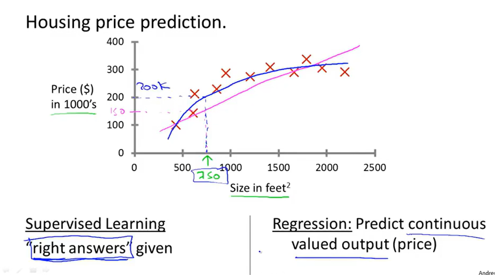
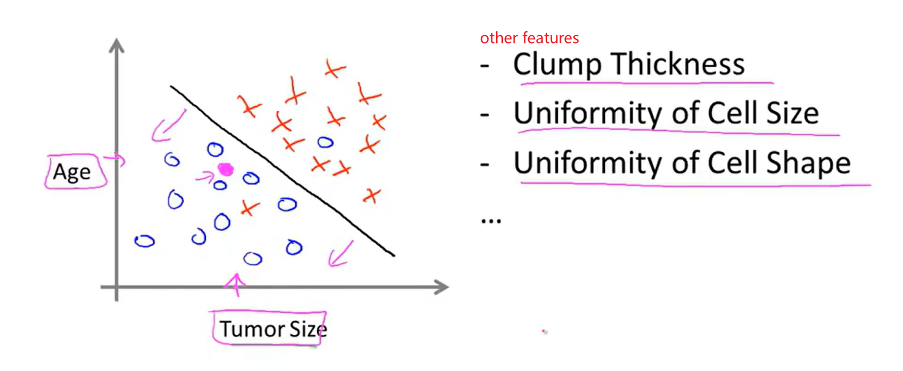
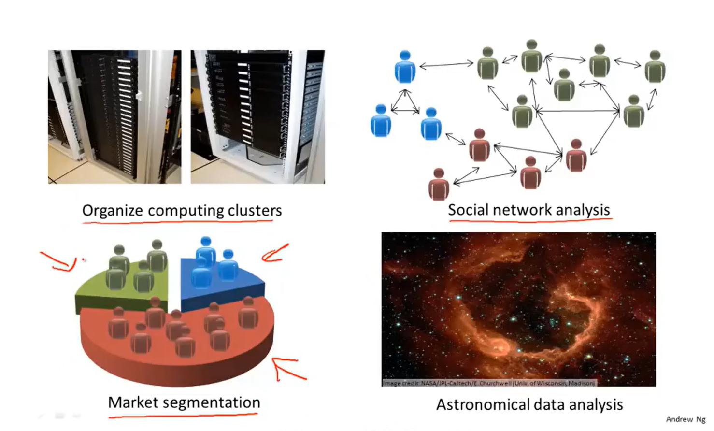

[TOC]

# Ⅰ.Overview

## 1 what

enheng

### 1.1 Supervised Learning

> - There is an `"Regression Problem"` for understanding
>
>   - `Supervised Learing`:
>
>     we gave the algorithm a `datas set` which contains "right answers"(here is a house price
>
>     data set).
>
>     The task of the algorithm `is to give more "right answers",` in other words, we give the 
>
>     coordinate x, and then we get coordinate y.
>
>   - `what is regression?`
>
>     we try to predict a sort of `continuous values attribute`.

 

> - An `”Classification problem“` contains `more than one feature, more than one attribute`.
>   - The result was determined by `Age and Tumore Size`.
> - What is Classificaiton problem?
>   - The outcome is yes or no.

 

### 2.2 Unsuperviesd Learing

> - `Clustering Algorithm`
>   - Let computer `automatically extract features` for `classificaiton`.

Application

 s

`

`

`

`

`