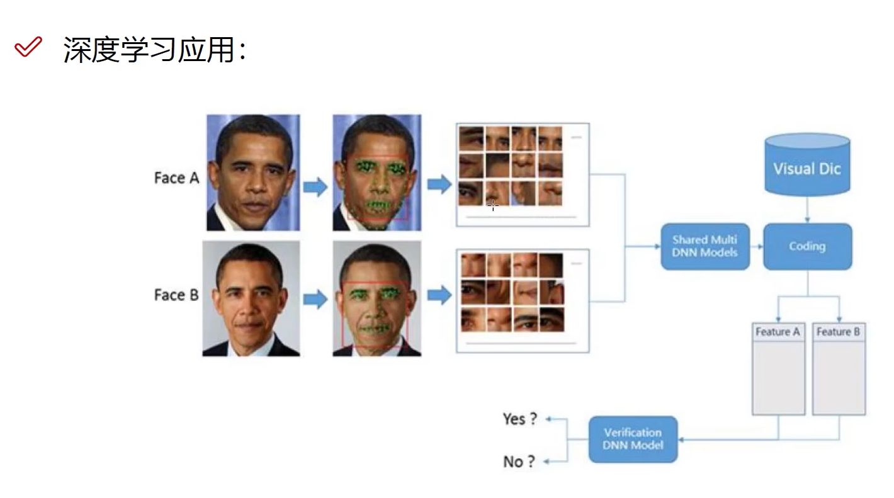
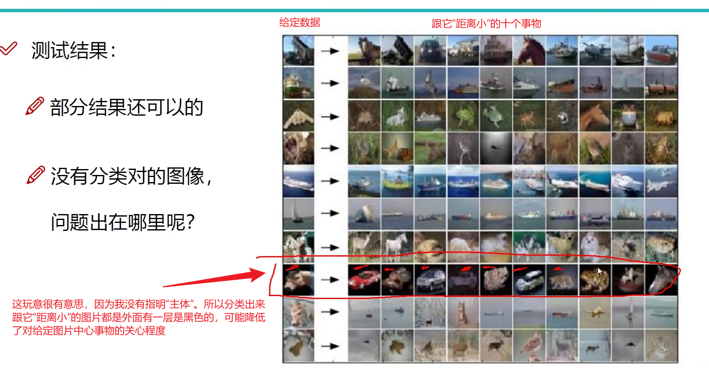
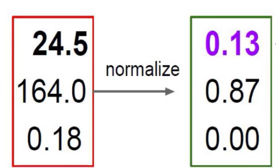
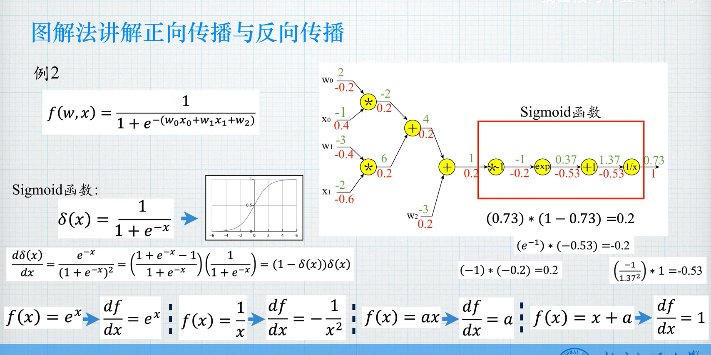

[TOC]

# 一、ATTENTION IS ALL U NEED

## 1、ML和DL的区别

> - 神经网络是一个算法，也是一个`提取特征的手段`
>
> - 机器学习和深度学习的区别
>
>   - **特征工程**：
>
>     - 机器学习：需要`人工`地选择数据和提取特征、`人工`地选择一个算法、`人工`地得出结果（歪歪斜斜的每页上都写着“智能”几个字，我横竖睡不着，仔细看了半夜，才从字缝里看出来，满本上都写着两个字“人工"！）
>
>       有种感觉——整个学习过程 = 实现了一个数学公式
>
>     - 深度学习：去除ML的人工步骤，让机器去提取和选择特征，真正实现智能
>
>   - 

 

## 2、特征工程的作用

> - 特征工程
>
>   - `数据的特征决定了模型的上限`，因此对吧`，预处理和特征的提取`是最core的
>
>     我们的`算法和参数选择`就是为了*逼近这个上限*
>
>   - 所以这玩意挺重要的，上限很重要嘛

 

## 3、应用

> - CV、自动驾驶、人脸识别、NLP、换脸

 

> - 带你走一次图像分类

 

 

CV中的挑战

 

 

## 4、K近邻算法

> - `K近邻算法`
>   - 什么玩意？
>     - 这个算法的说法就是：判断一个未知的事物的时候，通过`“离它近”`的已知事物推算它的性质

> - 下面的K=3和K=5什么意思？
>   - K=3就是那个实线圈，里面有两个triangle和一个square，所以结果为绿色的圈圈为triangle
>   - 时K=5就是那个虚线圈，里面有两个triangle和三个square，所以结果为绿色的圈圈为square

 

**4.1、算法流程**

> - 就是把离当前点近的k个点选出来
>
>   找出这k个点中出现频率最高的类别(如triangle出现最高)
>
>   那么这个点就是此类别(triangle)

 

**4.2、性能分析**

 

**4.3、实例**

> - 计算距离的差值，得到矩阵

 

 

**4.4、缺点**

> - 在picture classification时，K近邻算法`无法做到关注主体部分`，洒洒水啦

 

# 二、前向-后向传播神经网络

## 1、得分函数

> - 解释一下得分函数?
>   $$
>   f(x,W,b) = Wx+b\\
>   x:image，即原图片\\
>   W:parameter，权重\\
>   b:threshold，偏置\\
>   (这玩意就是判别x在不同类别的得分，以求得x所属的类别)\\
>   $$
>
> - 亮个相吧，x、W、b
>
>   - `x`用矩阵表示，32×32×3的图片，可以`用3072×1的矩阵表示`，`每个元素即为一个像素点`
>
>   - `W`用矩阵表示，32×32×3的图片，`每个像素点都有不同的权重，可以用1×3072的矩阵表示`
>
>   - `b`用矩阵表示，图片要判别在十个类别的得分，`每个类别有一个阈值，所以b用10×1的矩阵表示`
>
>     (上面的可以结合下面的图片看得清楚一点)
>
> - 为什么要有权重？
>
>   - 因为如何你想测试这个图片是不是猫猫，那么就`需要特点关注猫的特征(如眼睛、耳朵等)`
>
>     所以这张图片*有些像素是没有意义的，有一些像素是很重要的*。因此需要权重来区分
>
> - 为什么要有偏置？
>
>   - 希腊奶哦，后面来补

 

> - 实例

 

## 2、激活函数

> - Sigmoid求梯度不行啊
>   $$
>   \frac{\partial L}{\partial \sigma}\\
>   \sigma太大了，最后式子结果就为0了，就无限实现BP梯度了
>   $$
>
> - Relu挺好的，梯度为1，不会出现这种情况

 

## 3、损失函数

> - 啥啥啥啊这儿是？
>   - 衡量`得到的结果`与`正确分类`的`差值`

 

### 3.1、实例

> - 损失函数
>   $$
>   L_{i}=\sum_{j \neq y_{i}} \max \left(0, s_{j}-s_{y_{i}}+1\right)\\
>   $$
>
> - 为什么要用 ？什么max？什么减减加加？
>
>   -   ：除了目的类别外，对于每一个类别的得分与目的类别得分之差(为正数即有问题)求和，把全部的情况求和
>
>     ​	    的含义`判断当前是否存在有没分类好的情况，即出现正数`；*如果求和结果为0，那么最高分为目的类别，分类成功*
>
>   -  ：`离达到目标类别的差值`
>
>      ：分类中的最高分
>
>      ：目标分类的得分
>
>      即为离目标的差值
>
>   - `max(0,difference)：`
>
>     如果目标分类不是最高分，那么difference就是正数，
>
>     与0求max后，最终的结果为difference，表明仍有差值；
>
>     只有`当目标类别得分为最高时，difference为0，最终结果为0`，表明没有差值
>
> - **为什么要+1？**
>
>   - 因为当略小于 ：目标分类的得分时，difference也为负(如3.15-3.20)，但是`两者差别不大，说明这次分类其实没那么灵，还是没能完全区分开其他类别`
>
>     加上1以后，表明只有当 < 0时才分类成功
>
>     此时 ，即目的类别和其他类别`区分度足够大`才算没有损失

 

### 3.2、正则化惩罚项

> - 权值矩阵也是影响模型的关键

 

> - 正则化惩罚项干嘛的？
>
>   - 正则化通过在模型的损失函数中`引入一个额外的针对参数的惩罚项`，来`防止模型过拟合训练数据`。
>   - 前者为数据所产生的损失
>   - 后者为参数所带来的损失
>     - 与数据没有关系，只考虑到权重参数
>
> - 解释一下该公式
>
>   -  
>
>     就是把全部参数矩阵的元素平方求和
>
> - 解释一下这个λ
>
>   -  
>
>     **惩罚系数**：控制正则化的强度的超参数。它`决定了正则化项在整个损失函数中的权重`。
>
>     `较大的 λ 值`会增加正则化项的影响，`使模型更加趋向于简单的解决方案`，也就是一些`大一点的权重或者参数会被惩罚为0(记得训练猫猫图片的时候，出现的某个分布十分不均匀的权重矩阵嘛(就在上图)，这就是过拟合，只是在当前data set某个权重突出好一点，换一个data set这个权重突出就起反作用了说不定)`，小一点的就会留下，对于整个模型来说那些突出的尖尖被抹去，更加往下压成一团，更加平滑了。
>
>     `较小的 λ 值`则允许模型`更自由地拟合训练数据，但可能会导致过拟合`。
>
>     
>
> - 通常情况下，`模型不要太复杂，不然容易出现过拟合`
>
>   - 学的太强也不是一件好事

 

## 4、迭代法

> - 如图咯，`往y最小`来`从候选值中`选择x的值

   

> - 步长变为0.5
> - 步长为0.7的时候，会出现震荡现象

 

 

> - 为解决震荡现象
>   - 我们让斜率越大时步长越大，斜率越小时步长越小
> - Loss为什么等于那个呢？
>   - 晓不得

  

## 5、前向传播

> - 介里我粗略说一下前向传播的流程~
>
>   - f = wx + b，求出得分函数
>
>   - 根据得分函数，求出hinge loss的值
>
>     - 这个hinge loss是指，
>       $$
>       \frac{1}{N}\sum_{i=1}^N 第i个测试用例的损失函数值
>       $$
>       
>
>   - 还不够，损失函数L = hinge loss + 正则化惩罚项 

 

### 5.1、Softmax分类器

> - 这玩意什么时候用？
>
>   - 在`得到最后的不同分类的得分值的时候用` 啊西八brother
>
> - 这个SIGMOID函数干嘛的？
>
>   - 因为我们刚才干的是`图片分类`的问题
>
>     所以我们最需要的是`当前图片属于某一类的概率大小`
>
>   - sigmod函数就是把(-∞，+∞)的数，转换为0~1的数，即概率嘛

 

> - 讲一下Softmax分类器的流程
>
>   主要是求损失函数不一样
>
>   - (1)已知各得分函数
>
>   - (2)利用指数函数放大
>
>   - (3)求出`不同得分函数的占比`
>
>      
>
>   - (4)利用**log函数**`计算目的类别的损失值`
>
>        为什么要用log函数呢，因为求出目的类别的占比都是0~1的，而占比越小说明误差越大，
>
>        刚好可以用对数函数位于0~1的区间来表示
>
>     -  

 

### 5.2、细节

> - 理解了前面的process，let's think about the details
>
> - x、w怎么表示？
>
>   - 矩阵，以下图为例
>
>     `x_{1,3}`: `1个样本，三个特征`
>
>     `w_{3,4}`: 权重矩阵，第一行就是x[0\][0]，对于hidden layer的四个权重
>
>     `wx_{1,4}`: 1个样本，四个特征。经过求权后，特征变成了四个
>
> - 什么是非线性？
>
>   - 就是每次`求完wx后`，要把结果`经过激活函数变为一个0~1的值(等同于概率)`
>
>     <u>这个概率值再用作下一次的输入</u>

 

> - 其实训练过程可以等同于下图公式

  

### 5.3、神经元个数的影响

> - 多一点分类效果好一点，但是太多也可能过拟合
> - 那么神经元个数怎么对输出产生影响呢？
>   - 

## 6、反向传播方法

 

> - 这玩意干嘛的？
>   - 更新模型，更新权重矩阵嘛，即Back Propagation

### 6.1、梯度下降/局部梯度

> - cy

 

  

**局部梯度**

> - ∂z/∂x就是局部梯度

 

### 6.2、简单实例

> - 此处求偏导是为什么？
>   - 分别求出x、y、z对输出的影响

 

> - 什么叫一步一步传?
>
>   - $$
>     [(x*w_1)*w_2]*w_3=f\\
>     需要先求出w_3，再求出w_2，再求出w_1\\
>     不能跳过w_3直接求出w_1\\
>     其实就是求偏导的链式法则
>     $$

 

### 6.3、复杂实例

> - 我现在已经理解了，但我怕你忘了，所以这里补充几个理解的要点
>
>   -  ——`前缀表达式(1/x即取导数)`——  
>
>   - `梯度 = 上游梯度 * 局部梯度`
>
>     - `-0.2其实是∂f/∂x`，即∂f/∂z * ∂z/∂x
>
>       ∂f/∂z = -0.53 ——> 用z做输入时求得
>
>       ∂z/∂x = e^(x)，x=-1  ——> 把x当做输入，f=exp
>
>       最终∂f/∂x = -0.53 * e^(-1)
>
>        *举个例子*
>
> - 好的，你目前已经理解了具体过程
>
>   此处我再补充两个地方
>
>   - **Sigmoid函数：**
>
>     - 这个函数有个优点：它的导数为：`(1-原函数)*原函数`
>
>     - 下图的0.2可以直接由0.73求出
>
>        
>
>   - **关于求出梯度干嘛，我目前也不理解**
>
>     - 我逐渐理解一切
>
>       `参数和偏执收到梯度后就可以更新了`
>
>       举例：w_new = w_old - 学习率 * 梯度
>
>     - `为什么要减去梯度呢？`
>
>       我认为有两点，(1)梯度的方向是目标函数增加最快的方向，`注意这是一个矢量的空间`，减去梯度(向量)，即实现了在下降最快的方向下降
>
>       (2)为了解决震荡现象，效率越小，步长越小
>
>       ↓↓↓
>
>       

 

## 7、前向和反向传播的特殊运算结构

> 因为X<Y，所以max=Y，所以max对X的偏导为0，对Y的偏导为1，分别乘上上游梯度0.2，可以得到0和0.2-

 

> - 如果输入为矩阵呢，你将如何应对呢？
>
> - f是矩阵的`每个元素的平方和`
>
> - 讲一下输出层∂f(q_i)/∂q_i，其中q_i=(wx)_i
>
>   - ∂f(q_i)/∂q_i = 1 * 2q_i
>
>      
>
> - 如何看出梯度是否有错呢？
>
>   - 我没有说正确，是因为此处我做的是验假
>
>     那就是：`梯度矩阵的行列长度` = `输入矩阵的行列长度`

 

## 8、权重的更新迭代

> - 权重更新公式
>   $$
>   w_{(t+1)}=w_{(t)}-\eta\frac{\partial Los}{\partial w}+ \alpha \left[ w_{(t)}-w_{(t-1)}\right]\\
>   \alpha \left[ w_{(t)}-w_{(t-1)}\right]:平滑项，具体不知道什么意思
>   $$
>   

 

## 9、预防过拟合

### 9.1、数据预处理

> - 需要两步
>   - 中心化
>   - 对各个维度进行放缩或者扩充

 

### 9.2、参数初始化

 

### 9.3、DROP-OUT

> - 有这玩意干嘛？
>
>   - 神经元太多，任意过拟合
>
> - 啥啥啥啊这是？
>
>   - 就是每一次训练时，都会把某些隐含层的神经元屏蔽不用
>
>     注意，*只是屏蔽，下次训练可能就会用到了*
>
>     `这样也能训练到全部特征`

 

# 三、卷积神经网络

1、

`

`

`

`

`

