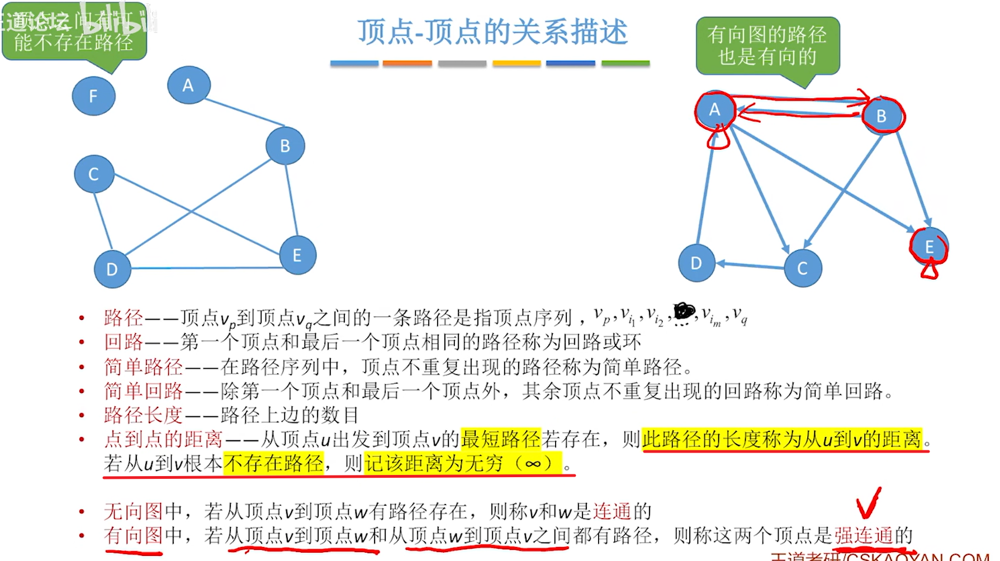
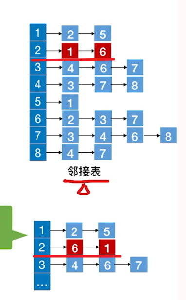

[TOC]

# 四、图

## 1、定义

 

## 2、类型

### 2.1、有向图/无向图

 

### 2.2、简单图/多重图

 

## 3、概念

### 3.1、度

 

### 3.2、顶点-顶点的关系描述

> 强调几个地方
>
> `简单路径`：指的是顶点不重复出现的路径
>
> `点到点的距离`：从顶点u出发，到顶点v的最短路径的距离，若不存在则为无穷
>
> `强连通`：在有向图中，从u到v的路径存在，从v到u的路径存在

 

### 3.3、连通图

> **连通图**：
>
> 对于n个顶点的无向图G，
>
> 若G是连通图，则最少有n-1条边
>
> 这个嘛，就拿树来联想吧，除了根节点，每个结点头上都有一条线
>
> 
>
> 若G是非连通图，则最多可能有
>
> n-1个结点，任意两两配对所形成的边数，能产生的最多的边数，必须除去了一个结点，防止形成连通图
>
> 
>
> **强连通图**：
>
> 若G是强连通图，则最少有n条边
>
> 结合下图理解
>
>  
>
> 

 

### 3.4、子图

> **生成子图**，包含原图的所有顶点，边集合包含于原边集合

 

### 3.5、连通分量/强连通分量

> `无向图`中的`极大连通子图`称为`连通分量`
>
> **极大连通子图**：子图必须连通，且包含尽可能多的顶点和边

 

> **强连通分量**

 

### 3.6、生成-树/森林

> `连通图`的`生成树`：包含图中`全部顶点`的一个`极小连通子图`(边尽可能地少，但要保持连通)
>
> 若连通图的定点数为n，则它的生成树含有n-1条边。对生成树而言，若砍去它的一条边，则不连通；若加上一条边则会形成一个回路

 

 

### 3.7、带权图

 

### 3.8、完全图

 

### 3.9、稀疏/稠密图

 

### 3.10、树

 

### 3.11、总结

.assets/image-20221113163313840.png)

## 4、邻接矩阵法

 

### 4.1、出入度

.assets/image-20221113164047751.png)

### 4.2、带权图

 

### 4.3、性能分析

 

### 4.4、性质

> A^n的元素A^n[i] [j] = 从顶点i到顶点j的长度为n的路径的数目
>
> 例：A^2[1] [4] = 把原矩阵的第一行 * 第四列，得到的值就是第1个顶级到第4个顶点的路径数目的个数

 

> A^3[1] [4] = 把A^2[1] [4]的第一行 * 原矩阵的第四列，得到的值就是路径数目的个数	

 

### 4.5、总结

 

## 5、邻接表法

> *first指向第一条边，而链表的每一个结构体中间存储了指向的下标

 

> 如何求顶点的度？入度？出度？
>
> **无向图**：很简单，遍历得到这个结点的链表长度完事了
>
> 
>
> **有向图**：出度，遍历得到该接点的链表长度；但是入度就很麻烦，你要遍历数组全部元素的链表，求出指向指定结点的结点的个数
>
> 

 

## 逻辑结构の总结

.assets/image-20221113180522651.png)

## 6、图的基础操作

 

### 6.1、BFS(广度优先遍历)

#### 6.1.1、代码实现

层次遍历既视感

 

> 整挺好，但是忽略了非连通图的情况

 

> 补充一下`遍历的可变性`
>
> 同一个图的`邻接矩阵`表示方式唯一，所以最后会是一个递增的结果
>
>  
>
> 
>
> 同一个图的`邻接表`表示方式不唯一，BFS得到序列不唯一
>
>  
>
>  

> 最终代码实现

 

#### 6.1.2、复杂度分析

> **性能分析**
>
> *空间复杂度*
>
> 可能辅助队列的空间复杂度量级最大为O(|V|)
>
>  
>
> 
>
> *时间复杂度*
>
> 主要来自于访问结点和访问边
>
>  

 

#### 6.1.3、广度优先生成树

> 说变了就是依靠BFS得到的序列其实是一棵树

 

#### 6.1.4、总结

.assets/image-20221114160159985.png)

### 6.2、DFS(深度优先遍历)

#### 6.2.1、代码实现

类似于先序遍历

 

#### 6.2.2、复杂度分析

 

  

> 邻接矩阵表示方式唯一，但是邻接表的表示方式不唯一

 

#### 6.2.3、深度优先生成树

> 深度遍历得到的序列其实就是一棵树

 

  不同的邻接表，不同的树

> 非连通图的生成森林

 

 

> 注意：`调用BFS/DFS的次数 = 连通分量数`

 

#### 6.2.4、总结

.assets/image-20221114162945521.png)

## 7、图的应用

### 7.1、最小生成树

> 最小生成树的研究对象是：`带权的连通无向图`

  

 

### 7.2、Prim算法/Kruskal算法

 

 

> 两者的比较
>
>  

 

 

### 7.3、最短路径问题

 

#### 7.3.1、BSF算法(无权图) 

> **实现代码**
>
> 核心在于`广度优先遍历`

 

 

#### 7.3.2、Dijkstra(迪杰斯特拉)算法

> 够复杂的

 

 

 

> 坑
>
> 迪杰斯特拉算法`不适合带负权值`的图
>
> 下面的例子照这个算法 V0-V2 优于 V0-V1-V2
>
> 但实际上`最好的路径应该是后者`

 

#### 7.3.3、Floyd(弗洛伊德)算法

> 动态规划，把问题的求解分为多个阶段

 

> 示例：

 

 

> **核心代码**

  

> maybe你会问这个时间复杂度O(|V|^3)、空间复杂度O(|V|^2)-二维数组的玩意好像没啥用
>
> 处理个三个结点的，有手就行

> 那么你就错了，请看下面的例子
>
>  
>
> 
>
> 当我允许V1中转的时候，发现了A^(0)[2]-[3] = 2（最短路径）、A^(1)[2]-[4] = 6（最短路径）
>
>  A^(1)变成右图所示
>
> *下面就是妙处*
>
>  
>
> 如果允许V2中转的时候，出现了3个最短路径
>
>  
>
> 但是你发现A^(1)[2]-[3]明明不存在，但实际上由于你的上一步操作，使得A^(1)[2]-[3] = 2了
>
> 相当于V2-V1-V3已经保存下来了，所以后面我们直接利用创造好的条件，V0-V2-(V2-V1-V3) = V0-V3 = 3
>
> 喵哉 
>
>  

> 下面是路径问题

 

#### 7.3.4、总结

Floyd算法虽然解决了带负权的有向图的问题，但是带负权回路的图会使其陷入噩梦轮回(bushi

 

### 7.4、有向无环图描述表达式

后面再来喵喵喵

  

> 下面这玩意可以优化到下一个图
>
>  
>
>   
>
>  
>
> 

 

### 7.5、拓扑排序

> 文字一点的定义
>
> 注意，若原图有环，非DAG图的话，是不存在拓扑排序的序列的

  

> 下面的伪代码，方便理解
>
> ①从AOV网中选择一个`没有前驱(入度为0)`的顶点并输出
>
> ②从AOV网中`删除该顶点和所有以它为起点的有向边`
>
> ③重复①和②直到`当前AOV网为空`或者当前网中不存在无前驱的顶点为止

 

> **代码实现**
>
> 竟恐怖如斯

.assets/image-20221114214251082.png)

 

**逆拓扑排序**

> 整挺好，出度为0的先输出

 

 

> 利用DFS逆拓扑排序的实现

 

### 7.6、总结

 

`

`

`

`

`

`