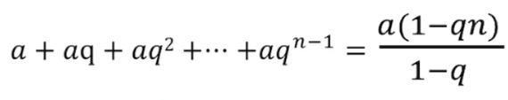
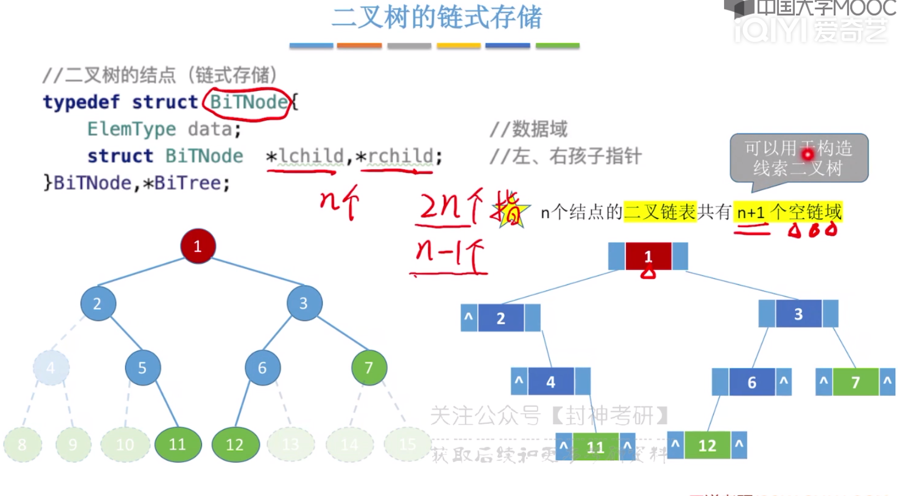
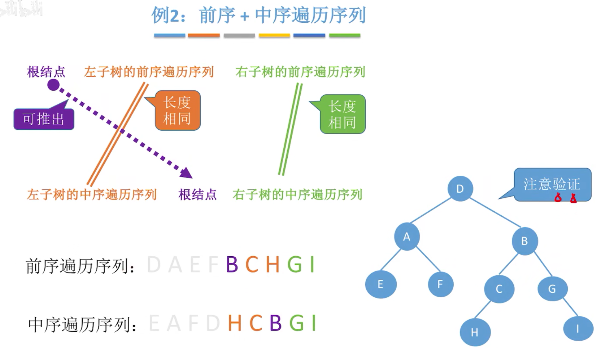
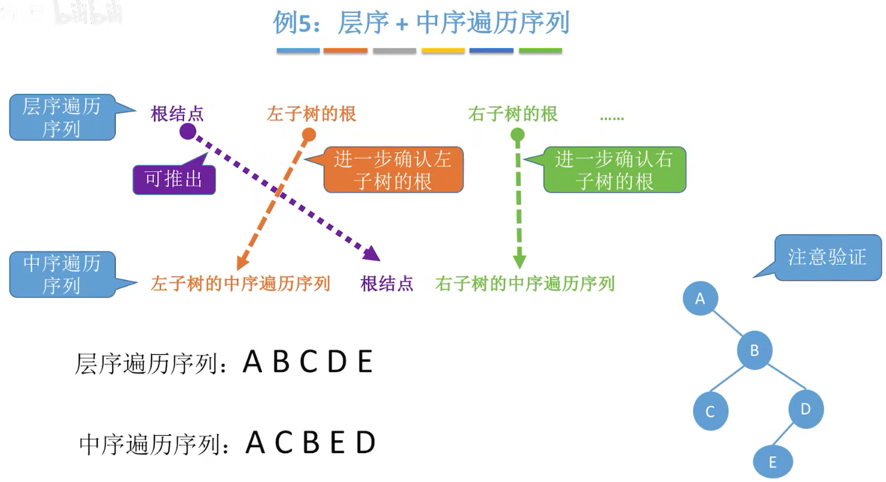
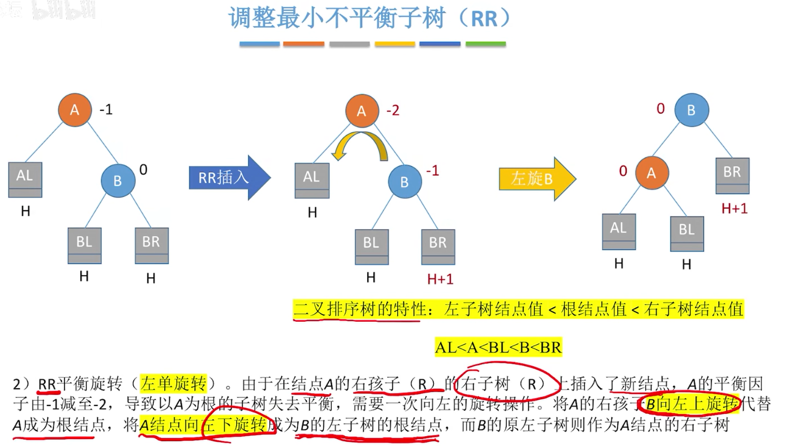
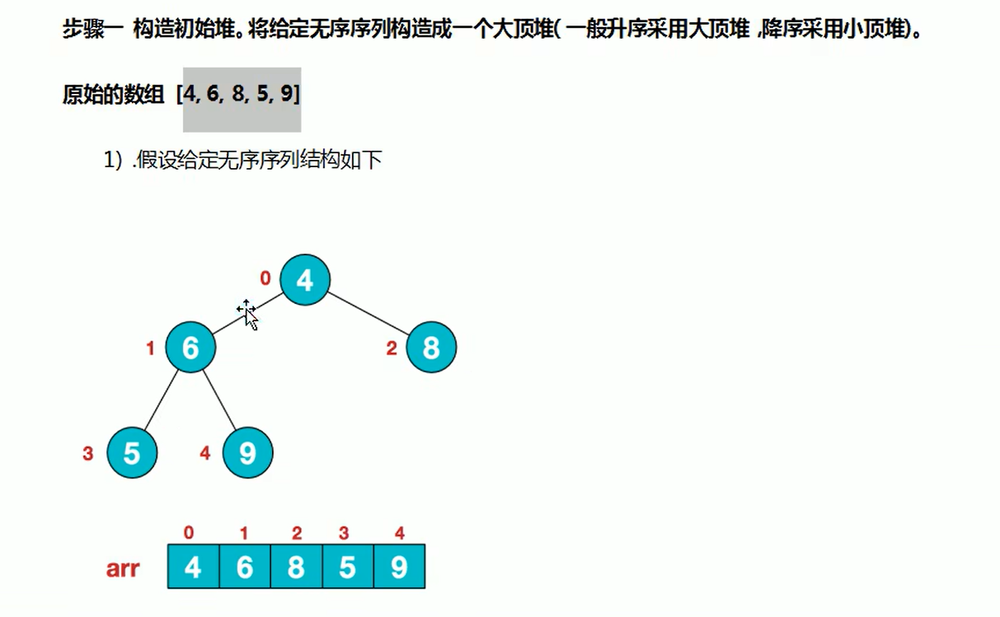

[TOC]

# 三、树

## 1、概述

 

 

> 概念

 

> **结点的关系术语**

 

> **属性描述**
>
> 结点的层次默认从1开始，但也可能从0开始，注意分辨

 

> **有序无序树**

 

> **森林**

 

> **总结**

.assets/image-20221104095719946.png)

# -----二叉树-----

## 1、二叉树

### 1.1、概述

> 二叉树是n(n>=0)个结点的有限集合
>
> (1)空二叉树，n=0
>
> (2)由`一个根节`点和`两个`互不相交的被称为根的`左子树和右子树`组成。左子树和右子树分别是一颗二叉树。
>
> 特点：①每个结点最多只有`两颗子树`。②左右子树不能颠倒(二叉树是有序树)
>
> 

 

> 二叉树的五种状态

 

 

### 1.2、特殊的二叉树

> **满二叉树**
>
> (1)除了叶子结点，`全部都是开叉`的。
>
> (2)不存在度为1的点
>
> (3)按层序从1开始编号，结点i的左孩子为2i，右孩子为2i+1，结点i的父节点为[i/2]
>
> 
>
> **完全二叉树**
>
> (1)当前仅当其每个结点都与高度为h的满二叉树中编号为1~n的结点一一对应时，称为完全二叉树
>
> —— 即把完全二叉树`贴`在满二叉树上时，结点依次一个一个对应(`从左到右，不会跳结点`)的时候，即是符合格式的
>
> (2)最多只有一个度为1的结点
>
> (3)只有最后两层有叶子结点，言下之意，最后一层叶子结点至少有个最左边的“8”
>
> (4)i <= [n/2]的时候为分支节点，i > [n/2]的时候为叶子结点
>    很好理解，当i = n/2出现的时候，`i就为最靠右的父节点了`，比它大的就为下一层的叶子结点了
>
> 

> **二叉有序树**
>
> 一颗二叉树
>
> `左`子树上所有的结点的关键字均`小`于根节点关键字
>
> `右`子树上所有的结点的关键字均`大`于根节点关键字
>
> 

 

> **平衡二叉树**
>
> 树上任一结点的`左子树`和`右子树`的`深度之差不超过1`
>
>  这就是最坏的情况了

 

### 1.2、总结

 

## 2、性质篇

### 2.1、二叉树

> 结论：`叶子结点 = 度为2的结点 + 1`
>
> 证明：假设非空二叉树的度为0、1和2的结点个数分别为n0、n1和n2
>
> (1)n = n0 + n1 + n2	——> ①
>
> (2)n = n1 + 2n2 + 1	——> ②
>
> 解释一下(2):`树的结点 = 总的度数 + 1`	—— —— ——|
>
> *理解了上面的公式，继续往下求*				     |
>
> 总的度数 = 不同度数结点的度数之和			     |
>
> |	n0个度为1的结点 = n0度				    |
>
> |	n1个度为2的结点 = 2n2度                   |
>
> *因此便求出了公式②*							  ↓
>
>  头结点没有“天线”，可以这样理解 总的度数 = 总节点数 - 1
>
> ② - ①得到
>
> (3)n0 = n2 + 1
>
> ​	EQD.
>
> 

 

> 结论：`m叉树的第i层至多有m^(i-1)个结点`
>
> 因为可能叶子结点不是完全的，好推不证

 

> 结论：`高度为h的二叉树至多有(2^h-1)个结点`
>
> 利用等比数列求和公式： a = 1，q = m，n = h
>
> 便有如下结论：
>
>  

 

### 2.2、完全二叉树

> 结论：具有n个结点的完全二叉树的高度h为 注意`前者`是`向上取整`，后者是向下取整
>
> 已知：
>
>  上面的关于高度和结点数的结论
>
> 这里高度h的至多至少要看懂，至少是此高度只有一个结点，至多是此高度满结点
>
> 
>
> **第一，如何推导出**
>
> 下面便是推导的公式，此处只讲两点
>
> 1、第一行n左右符号，左<，右<= 注意，`左边不取等`
>
> 2、要向上取整啊，因为它所在的区间是(h-1,h]，`向上取整就得到了h`
>
>  
>
> 
>
> 第二，如何推导出
>
>  下面便是推导的公式，此处只讲两点
>
> 1、第一行n左右符号，左<=，右< 注意，`右边不取等`
>
> 2、要向下取整再+1，因为它所在的区间是[h-1,h)，`向下取整就得到了h-1，再+1就得到了h`
>
>  
>
> 

 

> 结论：`对于完全二叉树，可以由结点数n推出度为0、1和2的结点个数为n0、n1和n2 —— 直白点，我知道n就可以推出不同度的结点数`
>
> 因为完全二叉树最多只有一个度为1的结点，即
>
> (1)n1 = 0或1
>
> (2)n0 = n2 + 1（上面的结论）
>
> (3)n0 + n2 = n2 + n2 + 1 = 2n2 + 1（带入结论）
>
> `不难看出(n0 + n2)一定是奇数`
>
> |	当完全二叉树有2k个结点的时候，n1 = 1(n0 + n2为奇数)
>
> ​	 n0 + n2 = 2k-1，结合n0 = n2 + 1
>
> ​	 不难看出n0 = k， n2 = k - 1	 
>
> |	当完全二叉树有2k-1个结点时，同理可得，n1=0，n2=k，n2=k-1
>
>  

 

## 3、存储结构篇

### 3.1、顺序存储

> 顺序存储，即存在连续的内部空间
>
> `注意，下面的算法都是针对 完全二叉树 的`
>
>  

  

> 但是很容易出现一个问题——`对于普通二叉树来说，根本不满足上面的算法`
>
>   
>
> 
>
> 为了解决这个问题，我们不得不使得`普通二叉树的编号与完全二叉树对应`
>
> 表现：顺序建立完全二叉树，没有的结点在那个位置上标记为空（空间存在，逻辑为空）
>
>  
>
> 
>
> 但缺点明显，会`浪费许多的空间`
>
>  半透明的都是浪费的空间
>
> 
>
> 综上，链式存储更适合树
>
> 

  

 

### 3.2、链式存储

> 经典左指针右指针域
>
> 结论：`n个结点的二叉链表具有n+1个空链域，可以利用其构造线索二叉树`
>
> 证明：n个结点具有2n个指针，n-1个结点头上有指针，相当于有2n-(n-1)个空指针
>
> 

 

> **三叉链表**
>
> 带父指针，实现回溯查到指针结点的父结点

 

#### ①初始化/插入

.assets/image-20221107105934460.png)

## 4、遍历篇

 

### 4.1、先中后序遍历

 

> **分支结点逐层展开法**

 

> 前缀/中缀/后缀表达式

.assets/image-20221107111850158.png)

#### ①遍历

 

### 4.2、层次遍历

> 核心：
>
> (1)初始化一个辅助 队列
>
> (2)根节点入队
>
> (3)若队列为空，则队头结点出队，访问该结点，把其左右子结点插入队尾(如果存在)
>
> (4)重复(3)直达队列为空

 

> **代码**
>
>  

### 4.3、总结

 

### 4.4、由遍历序列构造二叉树

> 由BDCAE构造二叉树，会出现一个问题
>
> 那就是可以`构造多个不同的二叉树`，如下图
>
> 先序，中序，后序，层次遍历都面临这种问题

 

> **利用两种遍历序列构造二叉树**

 

**前序+中序的遍历**

> **举例1**
>
> 判断根结点，根据左子树右子树的长度相等判断，哪一坨是左子树，哪一坨是右子树
>
> 再往下递归，判断结果
>
>   
>
>   
>
> 

> **举例2**
>
>  
>
> 
>
>  
>
> 
>
>   

**后序+中序的遍历**

 

> **举例**
>
>  

**层序+中序遍历构造序列**

 

> **举例**
>
>  
>
> 
>
> **举例2**
>
>  
>
> 

## 5、线索二叉树

> **线索二叉树诞生的原因？**
>
> *请问如何找到指定结点p在中序遍历序列中的前驱和后继*？
>
> 从根节点出发，开始一次中序遍历，指针q记录当前被访问的结点，`pre记录它的前驱结点`(上一个被访问的结点)
>
> 当q == p的时候，pre就是p的前驱结点了
>
> 后继结点呢？再往后走一步，当pre == p的时候，q就是p的后继结点了
>
> 缺点很明显：`要找到前驱后继，都要从头开始遍历`
>
> 那我们何不搞个指针域专门指向前驱后继呢？于是，诞生了线索二叉树
>
> 

 

### 5.1、使用

**中序线索二叉树**

> 前面讲过，`n个结点的二叉树，具有n+1个空链域`，那么这个链域就能`拿来存储前驱、后继的信息`
>
> 为了区别于单纯的指向子结点的指针，我们把`指向前驱、后继的指针`称为`“线索”`
>
> 分别叫做`前驱线索`和`后继线索`
>
> 

 

  

**先序线索二叉树**

> 自己推一哈咯

 

  

**后序线索二叉树**

> 自己推一下咯

 

 

### 5.2、存储结构

> 利用tag域区分指针是指向孩子还是“线索”的
>
> 分为ltag和rtag，分别对应左右指针
>
>  tag=1，指针为“线索”

 

 

### 5.3、总结

 

### 5.4、找到前驱后继

**中序前驱的老方法**

下面的方法不需要全部线索化

 

#### ①线索化

**中序线索化**

> 三个注意点
>
> 1、`pre`是作为`全局变量`，指向当前访问结点的`前驱`
>
> 
>
> 2、其实本质上就是pre和q的交互
>
> |	如果`q的左结点为空`，就把`pre的值赋给左结点`；
>
> |	如果`pre的右结点为空`，就把`q的值赋给右结点`
>
> 感觉好像跟q的右结点和pre的左结点没关系啊
>
> 
>
> 3、关于最后的结点需要处理的问题
>
> 遍历的话总归要到最后的结点的，即q指向最后的结点，但是visit(q)是不会对它的右结点处理的，`即便它的右结点为NULL，我也不会将其线索化为tag=1`
>
> 于是`pre最后指向q后`，代码结束。
>
> 所以最后，我们要单独地对最后的结点的右子树进行线索化，利用`全局变量pre检查其rchild的值，并决定赋tag值为1/0`
>
>  
>
>  代码实现

 

> **完整代码**

.assets/image-20221107180122222.png)

**先序线索化**

> 除了中序线索化需要注意的三个点之外
>
> 补充一个点：
>
> **需要处理无限转圈问题**
>
> 如下图
>
> visit(D)
>
> PreThread(D->lchild); // 由于线索，此时D的左指针已经为B了
>
> ----递归进入下一层----
>
> visit(B);
>
> PreThread(B->lchild); // B的左结点为D
>
> ----递归进入下一层----
>
> visit(D)
>
> PreThread(D->lchild); // 由于线索，此时D的左指针已经为B了
>
> ......
>
> 如此便无限循环了
>
>  
>
> 
>
> **如何处理**？
>
> 那就是访问左子树的时候，判断是否为线索，若为则不访问
>
>  这里右子树好像也要判断，待我后期写了代码再来看

  

  

**后序线索化**

> 不会出现前序的转圈问题，因为它的左子树已经处理过了
>
> —— 不会出现访问根节点，左结点变化；遍历左子树时，左结点变回来

  

**总结**

 

#### ②开找!

##### 中序

这玩意比较惨，左右孩子为前驱后继的可能性太小了，递归哈人

> **找中序后继**

 

> **找中序前驱**

##### 先序

找后继

> 这玩意的左右孩子之一为后继

 

找前驱

> 然并卵，这玩意的左右子结点只能是后继，前驱的话要遍历一遍，土办法

 

> 当然，话又说回来
>
> *如果我加了个parent指针域呢*？
>
> 可以解决啦
>
> —— 我只分析下面的第三的if，其他的不难理解
>
> —— 当p为右孩子，其左兄弟非空，那么，p的前驱为 左兄弟子树中最后一个被先序遍历的结点(`注意！！！不是最右边的结点，因为可能出现下图`)
>
>  `注意！！！不是最右边的结点，先序遍历不同于中序遍历`
>
>   

##### 后序

后序前驱

> 怼着左右孩子找就完事了

 

找后继

> 然并卵，这玩意的后继需要利用parent域

> 于是，**parent来啦**
>
> 四种情况我只讲第三种，当p为左孩子，其右兄弟为空的时候，p的后继为右子树中第一个被后继遍历的结点(`注意！！！不是最左边的结点`)
>
>  `注意！！！不是最左边的结点，后序遍历不同于中序遍历`
>
>  

### 5.5、总结

 

 

## 6、二叉排序树

 

### 6.1、查找

 

> 一个遍历法和一个递归方法

 

### 6.2、插入	

 

### 6.3、构造

 

> 注意，不同的关键字序列可能得到的BST相同，也可能不同

  

### 6.4、删除

> 利用z的直接后继替代z，然后从二叉排序树中删去这个直接后继，再把63接到66上去(儿子直接接到爹)
>
> 注意此题的遍历顺序，`z的右子树中最左下结点为直接后继`

 

 

 

> 利用z的直接前驱替代z，然后删除这个直接前驱，再让30的儿子接到爹，如果没有就直接删完事了
>
> z的前驱：`z的左子树最右下的结点`

 

 

### 6.5、查找效率的分析

通过分析我们发现，还是胖胖的二叉树最讨喜，于是出现了平衡二叉树

> **查找成功的平均查找长度**
>
> 平均每个结点查找的次数
>
> 3*4，查找三次的结点有4个：21/30/60/70
>
>  
>
> 
>
> 平均查找次数贼多
>
>  
>
> 

 

> **查找失败的平均查找长度**
>
> 其实就是查找到最后一个结点也不是就算做查找失败，例如，查找到21了，用了3次，再往下如果没有的话就算失败了，NULL的这次不算查找次数，看代码实现了
>
> 3*7：查找3次发现失败的有7个；因为要和它的左右结点对比啊，就所以有7个
>
>  
>
> 

  

### 6.6、总结

 

## 7、平衡二叉树

### 7.1、定义

.assets/image-20221109134146423.png)

### 7.2、插入

**插入**

> 当插入新结点的时候，为了保持平衡
>
> 我们需要从插入点往回找到第一个不平衡的结点，调整以该结点为根的子树
>
> 

 

> 所以，当我们找到最小不平衡子树，按照一定规则调整，就可以使整个树恢复平衡
>
> 局部，整体思想

 

**调整**

 

> **LL**
>
> 右旋
>
> 只有当BL、BR、AR的高度均为H的时候，才能使得插入操作后，A变为了最小不平衡子树
>
> 因为假设AR为H-1，A左子树B的高度本身为H+1	H+1-(H-1)=2，初始就不为平衡子树了
>
> 假设AR为H+1，B插入之后高度变为H+2，H+2-(H+1)=1，仍然为平衡子树
>
> 所以为了插入一个就让A变为最小不平衡子树 我们需要使得B的子树高度为H，AR的高度为H
>
> 
>
> 
>
> *码码来啰*
>
> 注意先后顺序，防止丢弃了BR结点
>
>  

> **RR**
>
> 左旋
>
> 
>
> 
>
> *码码来啰*
>
>   

> **LR**
>
> 先左旋，再右旋
>
>  
>
> 
>
> **左旋C，再右旋C**
>
>    
>
>  
>
> 

> **RL**
>
> 先右旋，再左旋		
>
> 
>
>  
>
>  

> **总结**
>
>  

> **练习1**
>
> 注意谁是最小不平衡二叉树的根节点，通过平衡因子来判断
>
> 
>
>  
>
> 

> **练习2**
>
> 
>
>  
>
> 

### 7.3、查找效率分析

> 不讲解，体会(huaji)
>
> 

  

### 7.4、总结

 

# -----堆-----

## 1、堆

 

 

## 2、堆排序

 

> **示例**：
>
> 图文并茂
>

 

 

 

 

 

 

 

 

 

 

> **思路总结**：
>
>  

## 3、码

# -----树和森林-----

## 1、树的存储结构

### 1.1、逻辑结构

  

### 1.2、物理结构

> `双亲表示法`（顺序存储）
>
> 就是要一个内存房间，存放双亲位置域
>
> 讲一下CRUD：
>
> 增加：放数组的最后一个位置就可以了，不必讲究什么层次上的先后，只要双亲结点是它爹的index就完事了
>
> 删除：这玩意比较坑，假设，删除下图的index为8的I(叶子结点)，此时*可以*把index为10的K(最后的元素)补上来；
>
> 但如果删除的是index为3的D呢(根节点)，把最后的元素补上来，然后需要遍历数组，发现父结点为D的一带删除了	——不难看出，每次删除都需要遍历

 

> `孩子表示法`（顺序+链式存储）
>
> 顺序结构存放`元素+指针`，`链式结构`存放子结点的`下标`
>
> 并且firstchild是指针域，指向第一个孩子(最靠左的孩子)
>
>  

 

> `孩子兄弟表示法`（链式存储）
>
> fistchild指针：指向最左边的孩子
>
> nextsiblings指针：指向同层的最接近它的兄弟

 

> **树和二叉树的转换**
>
> 把握住firstchild和nextsibling，合理转换
>
>  
>
> 
>
> **森林和二叉树的转换**
>
> 没啥特殊的，无非就是全部的根节点变成了兄弟结点罢了，`当发现没有单独的根节点的时候，就往森林这方面想`
>
> .assets/image-20221108152610387.png)
>
> 
>
> 
>
> 

### 1.3、总结	

 

## 2、树和森林的遍历

### 2.1、树

先根遍历和后根遍历又叫做`深度优先遍历`

貌似没有中序遍历这种操作

> **先根遍历**
>
> 先根遍历。若树为空，先访问根结点，再依次(左->右)对每颗子树进行先根遍历
>
> **方法一**，代码国人看...while代表了把子树遍历完
>
> **方法二**，将树转换为二叉树(孩子兄弟表示法)，然后`“二叉树的先序遍历”的序列 = ”树的先根遍历”得到的序列`
>
> 

   

> **后根遍历**
>
> 若树非空，先依次对每颗子树进行后根遍历(左->右)，最后再访问根结点
>
> 方法一，see Code
>
> 方法二，将树转换为二叉树，此`“二叉树的中序遍历”的序列 = “树的后根遍历“序列`
>
> 

 

> **层次遍历**
>
> dddd，不过没码码不好说

 

### 2.2、森林

**先序遍历**

> 递归归归归...
>
> 粗略讲一下路思
>
> —— 访问森林的第一棵树的根节点		 ①读取完B后，进入下一步，③读取E，进入下一步，⑤读取K，进入下一步...
>
> —— 先序遍历第一棵树根节点的子树森林	②森林为EKL和F，从左至右依次遍历子树森林，先遍历EKL，因此回到上一步，④依次读取KL，结束EKL子树森林的读取
>
> —— 先序遍历除去第一棵树之后的剩余的树构成的森林

 

> *何不化为二叉树呢*？
>
> 如下图，把几个树按照孩子兄弟的规则连接起来
>
> 此 二叉树的先根遍历 = 森林的先根遍历
>
> 

 

**中序遍历**

> —— 中序遍历森林中第一棵树的根节点的子树森林	一直往下递归，直到到了结点K，然后读取K，再读取L
>
> —— 访问第一棵树的根节点					 读取E，再往回收网，即以E的双亲结点为根节点的情况...
>
> —— 中序遍历除去第一棵树之后剩余的树构成的森林
>
> `”森林的中序遍历“效果等同于“依次对每个树进行后序遍历”`

 

> *何不转换为二叉树呢*？
>
> 每个树按照孩子兄弟表示法连接起来构成二叉树
>
> 此 二叉树的中序遍历序列 = 森林的中序遍历序列
>
> 不难理解，森林的中序遍历 = 依次每棵树的后序遍历 = 对应每棵二叉树的中序遍历

 

### 2.3、总结

 

# -----并查集-----

## 1、定义

**逻辑结构**

> 所谓“并查集”
>
> 并：将两个集合并起来
>
> 查：查到元素属于哪一个集合
>
> —— 而森林恰好就是几棵树的集合

 

 

 

## 2、存储结构

> 双亲表示法：
>
> 留一个域存放父亲的下标(位置)
>
> 结论：`双亲表示法最适合并查集`
>
> 并：直接把`一棵树父亲域的索引`设置另外一棵树的根节点
>
> 查：数组啊，遍历啥的嘎嘎快

 

## 3、基础操作

> Find()查是往回迭代，直到到了该x的根节点位置

 

> **关于时间复杂度**
>
> 由于Find()往回找，万一它的父元素多，找的时间就慢一点
>
>  左：J往回找1次，O(1)；右往回找n次，O(n)

 

> 优化了并的操作，具体分析见下面的优化思路

  

 

> **优化思路：尽量不让树长高**
>
> ①让小树合并到大树

 

> ②用根节点的绝对值表示树的结点总数

 

## 4、总结

 

`

`

`

`

`

`

