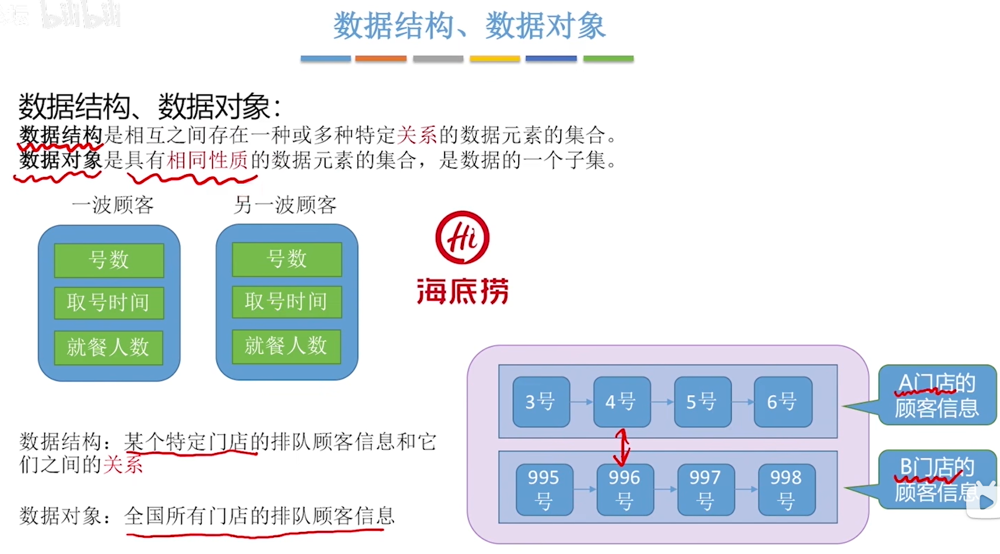
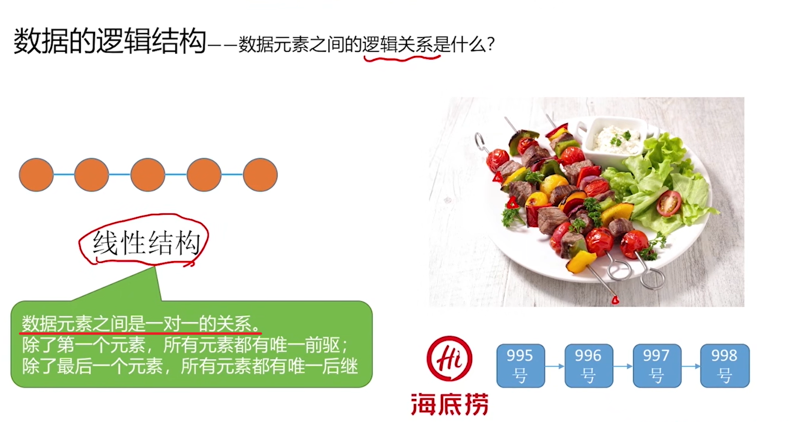
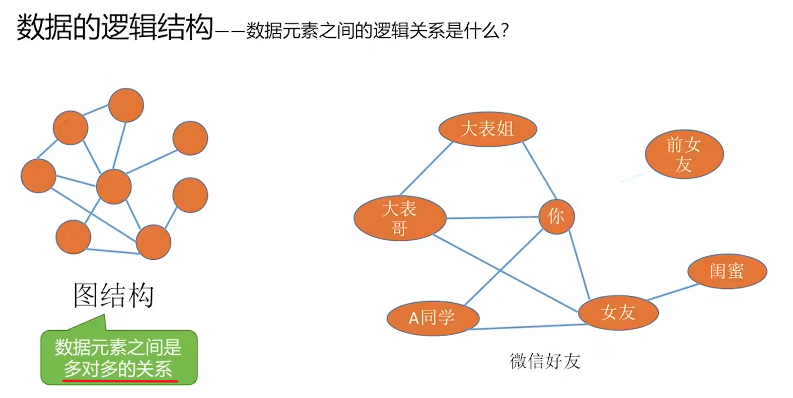
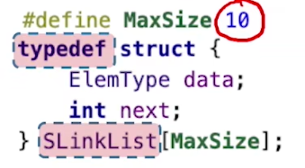
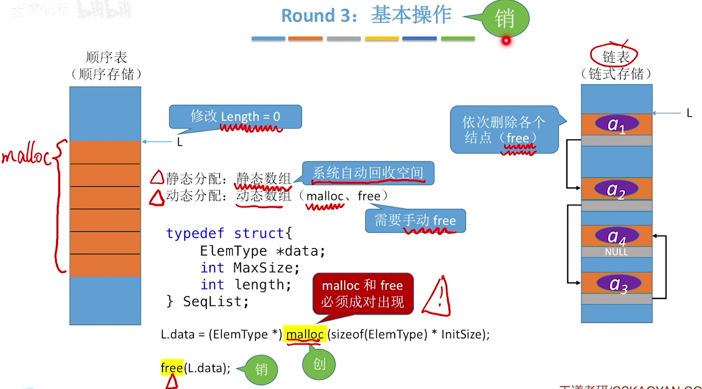
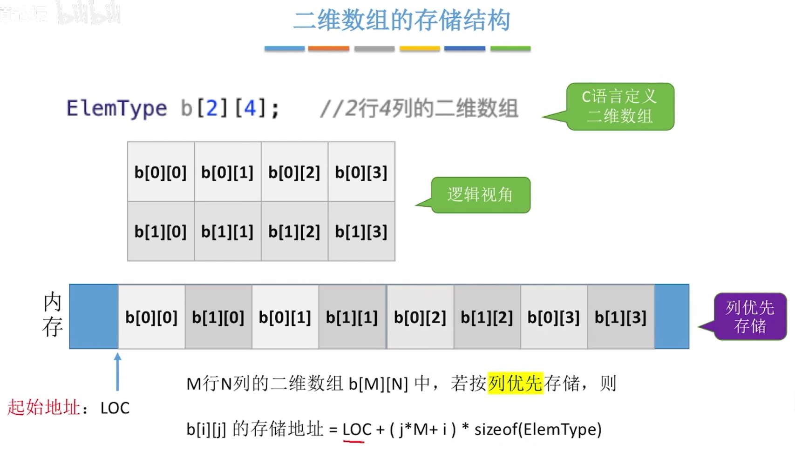
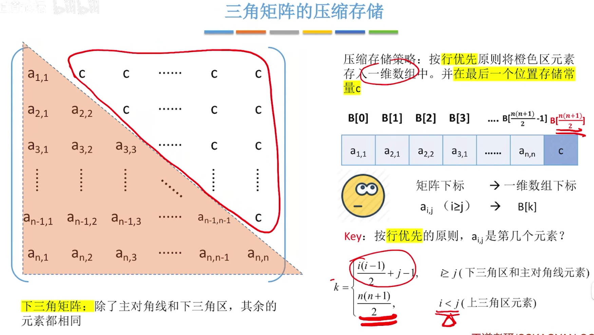

[TOC]


# 一、概念


## 0、绪论

先看下打怪世界的instruction

### 0.1、信息化世界的结构

 


### 0.2、数据

 


### 0.3、结构

 


 


  


 	


  


#### 习题

> `抽象数据类型`描述了`数据的逻辑结构`和`抽象运算`
>
>    如链表		 存储数据的逻辑方式    增删查改
>
> 
>
> 通常由[数据对象，    数据关系，     基本操作集]表示
>
> ​	   如数组    一对一(一对多)    增删查改

 


> 线性结构的特点是一对一

 


> ABD都是同时定义了逻辑结构和物理结构的，不可说它是逻辑结构了
>
> 而，有序表仅仅包含了“有序”这个逻辑，所以它属于逻辑结构

  


> 文字题罢了，问题问的是结点内的存储单元地址
>
> 结点之间的内存地址可能不连续，但是结点内部的那几个元素啊，什么ElemType和和*p，这几个玩意肯定是地址连续的啊，而且他们还要内存对齐呢

 

> 这道题的考点很明晰
>
> 带结构的，我们一下就想到存储结构和逻辑结构
>
> 依次分析，
>
> A：循环队列，用数据表(存储，因为循环表明了它存储的模型)表示的队列(逻辑，先进先出)，它是存储结构和逻辑结构的结合体，所以它与存储结构有关：
>
> B、C：链表、哈希表，都是存储结构啊
>
> D：仅仅是逻辑结构，满足先进后出的逻辑即可
>
> 选D

 

> 举个例子，我要实现二叉树，那么它有链式存储和顺序存储的两种存储结构
>
> 所以C错了
>
> D错在没有考虑到数据运算
>
> B是错的，存储结构(顺序存储和链式存储)都是依托与，我需要实现的二叉树这个逻辑结构才能出现的，也就是要先有理念，才有实物
>
> A：以面向实际问题(建立一个二叉树)触发，使用抽象的表达方式

 


> 数据其实等于数据对象和其的数据关系，如果只有对象，而没有关系，那么就是一盘散沙
>
> A：存储数据无需操作存储的方法，存储数据结构(三要素)才要
>
> B：数据元素的类型隐含于数据元素中，很简单啊，计算机底层又不会管你什么int、long，你的数据元素存储多少个字节就是什么类型，所以你的元素已经表明了
>
> 你的数据类型
>
> D：就是操作的一部分，故不需要

 


> 要知道数据结构包含了三要素：逻辑结构、存储结构和数据运算
>
> 这三者但凡有一个不同，那么就是不同的数据结构
>
> 如二叉树和二叉排序树，逻辑结构和物理结构相同
>
> 但查找结点这个数据运算不同，所以也属于不同的数据结构

 


> 很简单，栈，数组遍历和链表遍历，效率明显前者更高

 


### 0.4、算法

 


### 0.5、算法的时间复杂度

 

 常对幂指阶 


> 例题
>
>  

 


### 0.6、算法的空间复杂度

 


> 例题
>
>  
>
>   


> 递归感觉8太行
>
> 空间复杂度 = 递归调用的深度
>
>   

 

​		


## 1.交换两个变量的值

```c
//1、常规方法
void change(char* p1, char* p2)
{
	int tmp = 0;
	tmp = *p1;
	*p1 = *p2;
	*p2 = tmp;
}


//利用加法
void change(char* p1, char* p2)
{
    //牛的
	*p1 = *p1 + *p2;
	*p2 = *p1 - *p2;
	*p1 = *p1 - *p2;
}


//利用异或(^)
void change(char* p1, char* p2)
{
    
	*p1 = *p1 ^ *p2;
	*p2 = *p1 ^ *p2;
	*p1 = *p1 ^ *p2;
}

//第四个，牛逼，要底层汇编可能才能彻底看懂吧
//跟具体编译器类型有关，不一定有效。例如在VS的Windows编译器、GDB都不行。
b = (a + b) - (a = b);
```

> 1. 归零律：a⊕a=0 （每一位相加，忽略进位的结果肯定为0）
>
> 2. 恒等律：a⊕0=a  （每一位和0相加还是它本身）
>
> 3. 交换律： a⊕b=b⊕a    
>
> 4. 结合律：a⊕b⊕c=（a⊕b）⊕c=a⊕（b⊕c）
>
> 5. `自反：a⊕b⊕b=a⊕（b⊕b）=a⊕0=a（由上面推导得出）`
>
>    **第五条结论很重要，请先完全搞明白**
>
> 面试中经常问到如何不使用第三个变量交换两个数的值？
>
> 答案是
>
> a = a ^ b;
> b = a ^ b;
> a = a ^ b;
> 很多人不知道为什么   接下来就推导下
>
> 假设 刚开始 a=x  ， b=y。
>
> 第一次异或运算 `a= a^b = x^y`，b还等于y
> 第二次异或运算 b= `a^b = x^y^y = x^0 =x` ，此时b的值变为x
> 第三次异或运算 a= a^b = x^y^x = y^0 = y，此时a的值变为y
> 至此完成了交换过程。当然使用该方法进行变量交换时需要注意一点，a、b对应的内存区域一定不可以是同一块，因为如果是一块区域异或操作会把这块内存的数值改成0。（数组中的交换位置需要特别注意）


## 2、时间复杂度

当两个核心代码段都有各自的复杂度时，计算总的复杂度应该遵循以下原则

(1)如果是并行的两段代码，则取**复杂度最大**的代码段为总的复杂度

(2)如果是有for循环等循环、嵌套操作时，即采取**复杂度相乘**作为总的复杂	度	

.assets/image-20220902151646338.png) 

.assets/image-20220902152041271.png)

.assets/image-20220902154155123.png)

.assets/image-20220902154258467.png)


​	


## 3、结构体

### 3.1、结构体指针作为函数参数

结构体变量名代表的是整个集合本身，作为函数参数时**传递的整个集合**，也就是所有成员，而不是像数组一样被编译器转换成一个指针。

如果结构体成员较多，尤其是成员为数组时，传送的时间和空间开销会很大，影响程序的运行效率。

所以最好的办法就是使用结构体指针，这时由实参传向形参的只是一个地址，非常快速。


### 3.2、结构体内存对齐


### 3.3、typedef的使用

typedef可以对数组、指针、结构体、函数起别名

```c
//关于typedef我的理解就是从新名字解码(解封)，得到左边的数据类型，来判断右边新名字的含义
//当然自定义的话还是得根据需求好好想一想

//对数组起别名
//解析一下，右边ARRAY[20]等价于左边的char，就说明ARRAY这个新的数据类型 代表了一个长度为20的字符数组
//ARRAY a 等价于 char a[20];
typedef char ARRAY[20];

//给结构体起别名
//Struct Student stu 等价于 STU stu;
typedef struct Student{
  char name[20];  
}STU;

//给指针起别名
//从右边解码，由于括号，先*PTR_TO_ARR后[4]，得到左边的int
//于是看出PTR_TO_ARR这个数据类型，封装了一个指向int [4]数组的指针
//PTR_TO_ARR ptr 等价于 int (*a)[4];  
typedef int (*PTR_TO_ARR)[4];

//给函数起别名
//等价于 我们知道，单独的int (*p)(int,int)，p代表定义了一个函数指针(其返回值为int，两个int形参数)，
typedef int (*PTR_TO_FUNC)(int, int);
PTR_TO_FUNC pfunc;
```


## 4、内存结构

| 内存区域 | 内容                                                         |
| -------- | ------------------------------------------------------------ |
| 栈区     | 存放函数的参数值、局部变量等，由编译器自动分配和释放，通常在函数执行完后就释放了，其操作方式类似于数据结构中的栈 |
| 堆区     | 就是通过new、malloc、realloc分配的内存块，编译器不会负责它们的释放工作，需要用程序区释放。分配方式类似于数据结构中的链表。“内存泄漏”通常说的就是堆区。 |
| 静态区   | 全局变量和静态变量的存储是放在一块的，初始化的全局变量和静态变量在一块区域，未初始化的全局变量和未初始化的静态变量在相邻的另一块区域。程序结束后，由系统释放。 |
| 常量区   | 常量存储在这里，不允许修改。                                 |
| 代码区   | 顾名思义，存放代码                                           |

> 1.void *malloc(unsigned int size)：作用是在动态存储区中分配一个长度为size的连续空间，unsigned代表没有符号位的整形数据(非负整数)，返回所分配内存区域第一个字节的地址.分配失败返回NULL指针
>
> 2.void *calloc(unsigned n,unsigned size)：作用是在动态内存空间中分配n个长度为size的连续空间，分配失败返回NULL指针
>
> 3.void free(void *p)：释放指针变量p所指向的动态空间
>
> 4.void *realloc(void *p,unsigned int size):对已经通过malloc函数calloc函数获得了动态空间，想改变其大小，用此函数重新分配

> 注意：**void\*类型的指针表示指向空类型或者不指向确定的类型的数据**
>
> 以上函数得使用`#include<stdlib.h>`


# 二、线性表

## 1、定义

 

  

  

 

> 总结
>
>  
>
>  


## 2、顺序表(顺序存储)

> 顺序表：`逻辑上相邻`的元素存储在`物理位置也相邻`

 

 


### 2.1、静态/动态分配

> 可能出现内存浪费

  

> 大小可变的顺序表	

 

 

 


### 2.2、特点

 


### 2.3、插入/删除/查找

  

  


> 按位查找

 


> 按值查找

 


### 2.4、总结


 


## 3、链表(链式存储)

> 逻辑上相邻，但物理位置不相邻

 


### 单链表

### 3.1、初始化/判空/创建

> 不带头结点

 

> 带头结点

 


> 尾插法建立单链表

 

> 头插法建立单链表

  


### 3.2、插入/删除

> 按位序插入，带头结点

 	 

> 不带头结点插入

.assets/image-20221030005407899.png)

> 指定结点的前插

 

> 尾插法

 


> 删除，不带头结点

 

> 指定节点的删除 

 


 


### 3.3、查找

> 按位查找

 

> 按值查找

 	

 

> 求长度

 


### 双链表

### 3.1、初始化/判空

 


### 3.2、插入/删除

> 插入

 


> 删除

 


### 3.3、遍历	

 


### 循环链表

3.1、初始化/判空/判尾

> 就普通的单链表特殊处理一下尾结点就好了

 

> 循环双链表

 

 

 


### 静态链表

用数组的方式实现链表

> 分配了`一整片连续`的内存空间，各个结点集中安置
>
> 每个`数据元素4个字节`，`游标4个字节`(结点共8个字节)
>
> `数据元素`存放`不同的结点`，`游标`存放它的`下一个结点所在的下标`
>
> addr为头结点的地址，通过游标好似把结点用指针连接起来一样

> 注意：
>
>  这个typedef的用法就相当于封装了SLinkList为一个**长度为10**，**元素类型为当前结构体**的数据类型

 


 

  


## 4、顺序表和链表的区别

> 存储结构上的区别

 

 


 


 


 


 


## 5、栈

### 5.1、定义

> 其实也是线性表的一对一
>
> 但是插入操作有限制：`只能在一端插入和删除，不能在中间插入删除`

  

> 栈顶：允许插入删除的一端
>
> 栈底：不允许的一端

 


### 5.2、顺序/链栈操作

 


#### 5.2.1、初始化

 


> 链栈的初始化就是建立一个普通的链表

 


#### 5.2.3、入栈/出栈

> 顺序栈

 

 

> 上面的栈顶指针top是指向当前元素
>
> 下面的top是指向下一个可以插入的位置
>
> 需要注意的是，当top = MAXSIZE的时候，就已经栈满了，数组起始位下标为0，不能插入到MAXSIZE的位置

 


> 链栈的入栈、出栈
>
> 入栈就是使用头插法，插入结点，出栈就是把头插法反过来，删除元素

 

 


#### 5.2.4、总结

> 注意：销毁顺序栈会自动进行，函数运行结束系统就会自动回收内存

 


### 5.3、栈的应用

#### 5.3.1、括号匹配问题

 


#### 5.3.2、递归

斐波拉契是也


## 6、队列

### 6.1、定义

FIFO

 


### 6.2、顺序实现

#### 6.2.1、初始化

 

 


#### 6.2.2、入队/出队

 


> 循环队列
>
> 最关键的地方在于 Q.rear = (Q.rear + 1) % MAXSIZE
>
> 使其逻辑上成为了一个闭环队列

 

> 出队和查找

 

 


#### 6.2.3、判空/判满/获取元素个数

**获取元素个数**

> `获取队列中元素的个数，判断是否达到最大值` ——> 此处最大值可能是MAXSIZE或者MAXSIZE-1，看rear指向元素不
>
> `元素个数：(rear + MAXSIZE-front) % MAXSIZE`
>
> 解释：
>
> ①当rear在front后面的时候，就相当于rear-front了，把MAXSIZE模运算掉了
>
> ②当rear在front前面的时候，其实%MAXSIZE没啥用了，
>
> rear代表在它前面的元素个数
>
> MAXSIZE-front，相当于减去了为空的元素个数，即在front后面的那些元素的个数
>
>  


**判空判满的3个方案**

> 方案一：`若队尾指针的下一个结点是队头指针，则为满；若队尾指针等于队头指针，则为空`	——> 牺牲一个存储单元
>
> (Q.rear+1)%MAXSIZE == Q.front; // 满
>
> Q.front == Q.rear; // 空

 

> 方案二：`加一个size域，当入队就加1，出队就减1`
>
> 通过最后的size大小判断已满/已空
>
> size域的存在可以不浪费那个存储空间

 

> 方案三：`加一个tag域，当删除成功，令tag=0；当插入成功，令tag=1`
>
> 队满的时候，必然发生了插入，则tag=1	——> (front == rear) && tag == 1
>
> 队空的时候，必然发生了删除或者初始化为空，此时tag=0	——> (front == rear) && tag == 0
>
> **注意**：tag域的存在，可以不浪费那个存储空间

 


#### 6.2.4、rear指向队尾元素

> 问题不大
>
> 入队的时候，先让rear后移一位，再让元素插入
>
> 出队的时候，先让元素出队，再把front后移一位

 

> `初始化方式`
>
> rear初始的时候要指向数组末尾
>
> 这样才能让rear+1，使得第0号元素被赋值，成为队尾元素
>
>  
>
> `判空`：即当上图的情形出现即为空，（rear+1%MAXSIZE == front的时候即为空
>
> 
>
> `判满`：
>
> 由于防止与判空矛盾(当rear在front前面一个位置的时候，即为空)，那么当rear在front`前两个位置`的时候，即为满	——> 牺牲一个存储单元
>
> 也可以采用另外两种方案	 

 


#### 6.2.5、总结

 


### 6.3、链式存储

#### 6.3.1、初始化

 

> 初始化

 

 


#### 6.3.2、入队/出队


 

 


> 出队

 

 


#### 6.3.3、判满

> 链式队列一般不会满的

 


#### 6.3.4、总结

 


### 6.4、双端队列

 

 


> **输出受限的双端队列**
>
> 有一个小技巧，假设你看到了3输出，那么必然输入了1,2
>
> 此时你根据后面1,2先后，判断1,2分别在那端插入
>
> 3,1,2	——> 左插入1，右插入2
>
> 3,2,1	——> 左边插入1，左插入2

 

> **输入受限的双端队列**
>
> 

 


### 6.5、队列的应用

#### 6.5.1、树的层次遍历

> *此处只有概念*
>
> 开始从根结点处理
>
> 1	有左右孩子	入队变为1 -> 2 ——> 3	1处理完出队
>
> 2 ——> 3	2有左右孩子 入队2 ——> 3 ——> 4 ——> 5	2处理完出队
>
> 3 ——> 4 ——> 5 ...

 


#### 6.5.2、图的广度优先遍历

> 1	1相邻结点为2、3	入队1-2-3	1处理完出队
>
> 2-3	2相邻结点4	入队2-3-4	2处理完出队
>
> 3-4	...

 


#### 6.5.3、先来先服务

 


## 7、矩阵

### 7.1、概述

 


> **行优先**
>
> 在二维数组b[M] [N]中
>
> ```c
> b[i][j] = LOC + (i * N + j) * sizeof(ElemType);
> ```
>
> 

 

> **列优先存储**
>
> 在二维数组b[M] [N]中
>
> ```c
> b[i][j] = LOC + (j * M + i) * sizeof(ElemType);
> ```
>
> 注意看下面的存储顺序，淦，真的怪
>
> 

 

 	


### 7.2、对称矩阵

> 这里突出如何压缩存储这大家伙

 

> **如果取下三角区**
>
>  
>
> 
>
> `a[i] [j]是第几个元素呢？`
>
>  a(3,2) 其实是前面个元素个数加列数
>
> 前面的元素 = (i-1)*i/2
>
> 列数 = j（但实际上要减1）
>
> 那么 `要减1，因为在数组里面`

> `如果求整个矩阵呢？`
>
>  众所周知，`i >= j时`，矩阵是`下半区`
>
> ​		 i < j时，矩阵是上半区
>
> ​		 a(i, j) = a(j, i)
>
> 假设上半区的求元素公式：f(x, y)
>
> 
>
> *当我求a(i, j)(此时i<j，即位于上半区)时*
>
> ∵ a(i, j) = a(j, i)
>
> ∴ 取个反，变成求a(j, i)
>
> 这样就可以带入求上半区的公式：f(j, i)
>
>  
>
> 

 

> **列优先压缩存储**

 


### 7.3、上/下三角矩阵

> 举例，上三角矩阵指除了上三角和对角线外，其他元素都相同，假设为c
>
> 那么就把c的值存储到n(n+1)/2

 

 


### 7.4、三对角矩阵

 

> 这里的 i>= [(k+2)/3]，理解为刚好取整，得到那一行

 


### 7.5、稀疏矩阵

> 稀疏矩阵：非零元素的个数远远少于矩阵元素个数

 

> 上面是第一种压缩方法，下面是第二种

 


### 7.6、总结

 

 


## 8、广义表

### 8.1、概述

 

 


> 示例：
>
>  


### 8.2、性质 

 

 


> 广义表可以看成线性表的推广
>
> ​	二维数组每行或每列可以看做子表处理，二维数组就是一个广义表

 


### 8.3、运算

 


`

`

`

`


