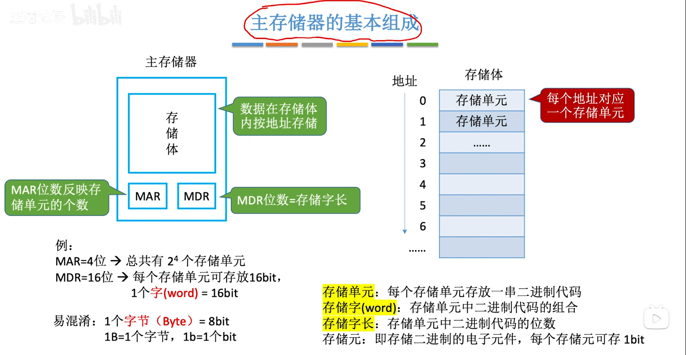
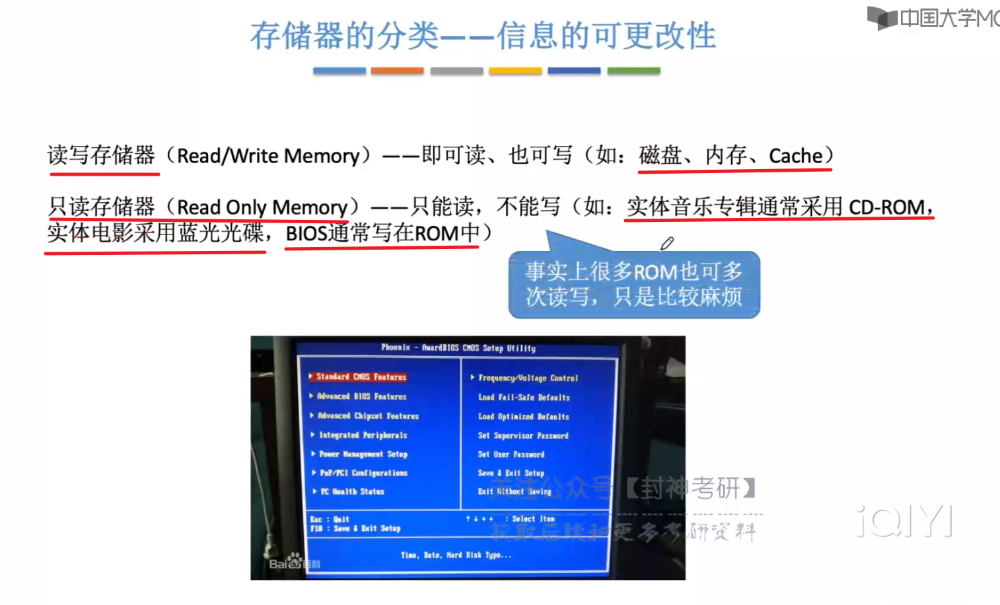
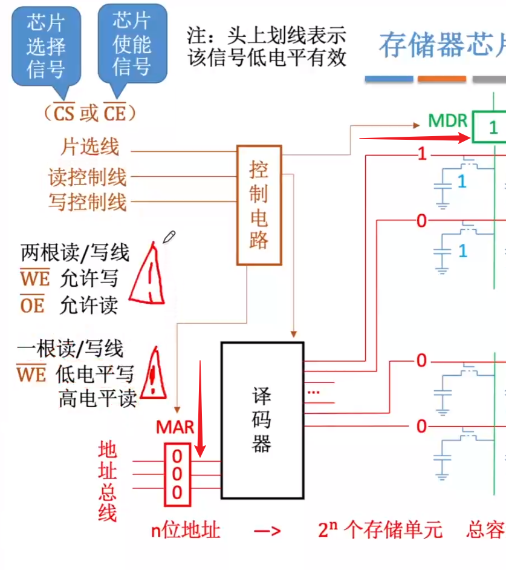
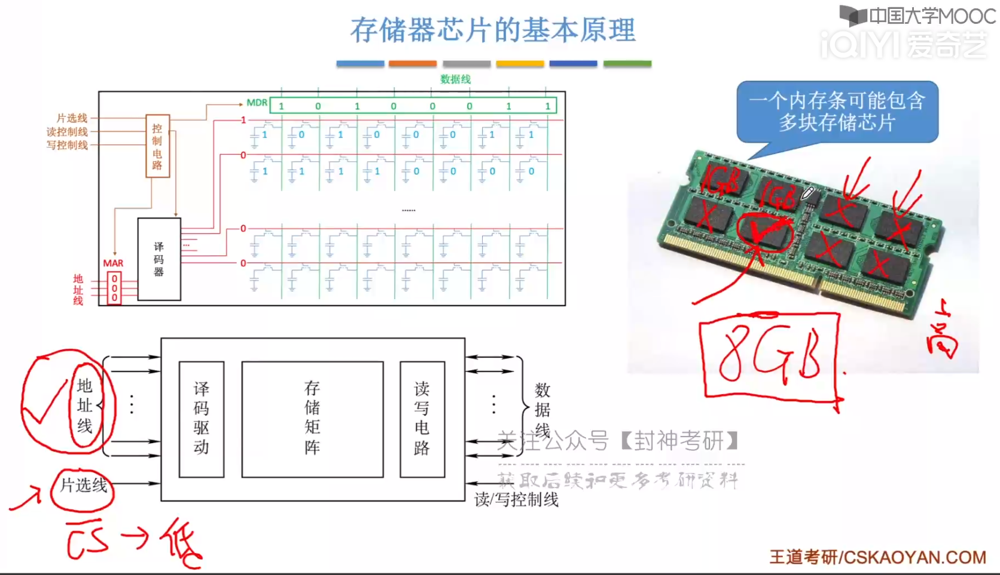
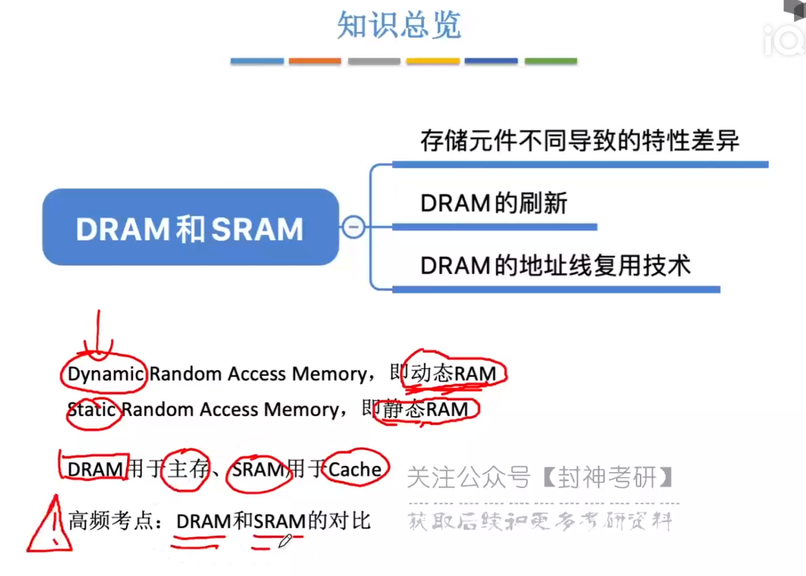
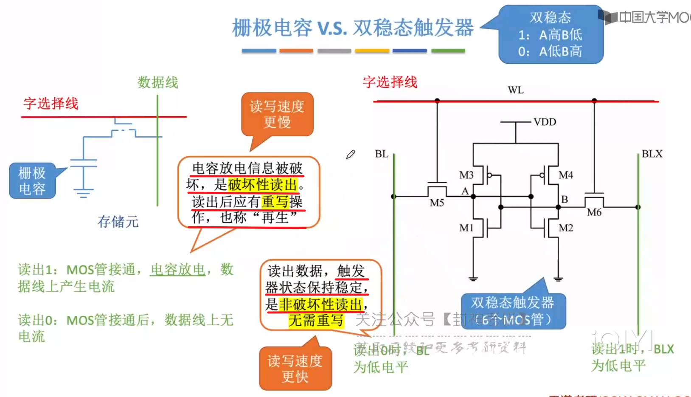
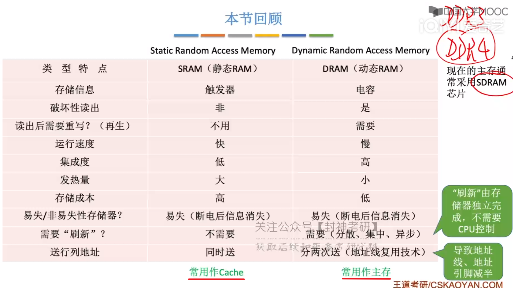
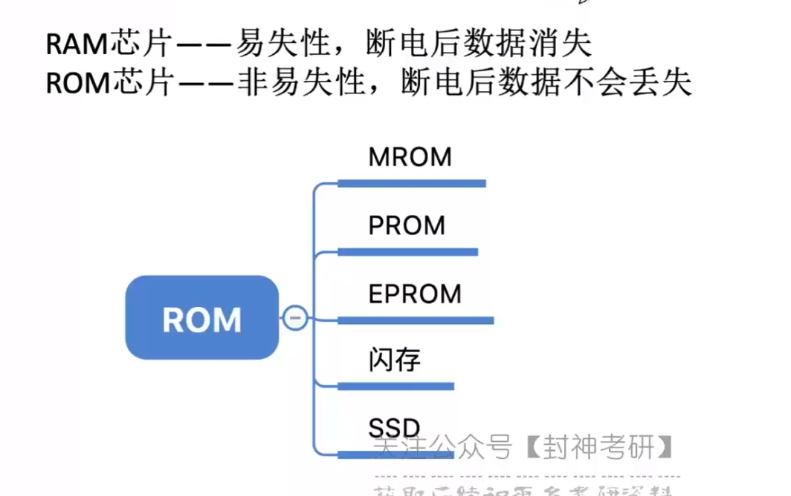
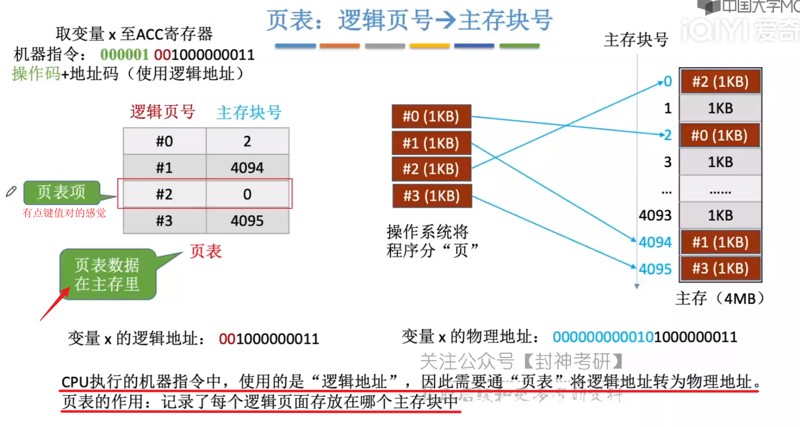

[TOC]

​	

# 三、存储系统

## 1、基本概念

 

### 1.1、存储器的层次结构

> **1.先介绍金字塔**
>
> `CPU <—— 寄存器 <—— Cache <——   主存 <—— 磁盘 <—— 磁带、光盘`
>
>  |		 |		 |	      |	   |          |
>
> 大哥	   二哥  `高速缓冲存储器` 内存嘛    辅存       外存
>
> (当然，*某些书把磁盘也叫做外存就是了*)
>
> `从底到头，速度最快、容量最小、价格最高`
>
> 
>
> 大多数你懂，我就拎出`Cache和寄存器`讲一下吧
>
> **寄存器嘛**：MQ，ALU这些，那么他们为什么居然在CPU大哥之下呢，因为**这二哥要存储CPU(运算器、控制器)运算时产生的数据，或者需要存一些指令地址啥的**，总之`它的速度必嘎嘎快，才能跟上大哥啊`
>
> **Cache**：这哥们学名叫做`高速缓存寄存器`，有啥用呢？因为`西皮优速度实在太快了，主存跟它数据交换的时候还是赶不上它的需求`，于是`加了个中间速度的Cache来缓冲一下`，搭了个阶梯，免得楼太高，一步摔下去了。
>
> 
>
> **2.再解释流程图**
>
> 看一遍差不多了，我补充几个点
>
> 1.`辅存中的数据要调入主存中才能被CPU访问`，*所以你打开一个软件开始卡几秒，除非是软件乐色，一般都是在辅存调到主存里面*
>
> 2.`主存-辅存`：实现了`虚拟存储系统`，可以**有效解决主存容量不够**的问题
>
> 3.`主存和辅存`的数据交换需要借助到`硬件+操作系统`
>
> 
>
> 4.`主存与Cache`的数据交互，`硬件直接完成`
>
> 5.<u>主存也可以和CPU直接交换</u>，但是一些`高频次被调度的资源`，直接`放到Cache中`，这样`CPU访问也可以更快一点`
>
> 6、什么叫高频词被调用的资源，*好比你打视频通话时，这块区域的数据高强度调用，放到Cache里面，CPU访问的内存的时候更快，就不会那么卡*
>
>  
>
> 

 

> 下面就是Cache，内存条，辅存磁盘，外存光盘
>
> 还有个三星的固态硬盘，这玩意比磁盘猛的多

 

### 1.2、存储器的分类

#### 1.2.1、存储介质

 

#### 1.2.2、存取方式

> RAM SAM DAM
>
> SAM、DAM为串型访问存储区：读写某个存储单元的时间与存储单元的物理位置有关

 

> 与上面三者都不同
>
> **相联存储器**：`按内容访问的存储器`，上面的三者都是给地址去找内容，`这哥们根据内容去遍历，直到找到需要的内容`
>
> "快表"就是相联存储器

 

#### 1.2.3、信息的可改性

ROM

 

#### 1.2.4、信息的可保存性

 

### 1.3、性能指标

> 两个注意的点：
>
> 第一，`存储字数，是以字节为最小单位的`，好比1M，是指1MB，不是1Mb
>
> 第二，`存储周期`分为`存取时间`和`恢复时间`
>
> *存取时间*：启动一次存储器操作到完成该操作作所经历的时间，分为读出时间/写入时间
>
> *恢复时间*：这哥们进行一次读取后，有点贤者时间，所以也给它算到周期去了	

  

### 1.4、总结

 

## 2、主存储器的基本组成

### 2.1、基本的半导体元件及原理

> **存储单元的组成原理**
>
> 一、认识器件
>
>   `MOS管`(Metal-Oxide-Semiconducter)
>
> ​	`输入电压达到某个值才接通`，类似于一种电控开关，所以才叫半导体啊
>
>   `电容`
>
> ​	<u>存电放电嘛</u>
>
> 二、工作原理
>
>   `读出`：*给MOS管施加电压，接通导线*，`电容存储的电荷就会沿着导线流出，形成电流`，所以当我们*检测到电流的时候就能判断存储的数据为1，否则为0*
>
>   `写入`：*给MOS管施加电压，接通导线*，`再在导线一端施加电压，给电容充电，相当于存储了一个信号
>
>  
>
>  集成了存储单元的存储体。`红线控制MOS管，绿线检测/输入电流`
>
> 
>
> 有两个点确实疑惑，期待你以后能给我解答
>
> 连续写入不会出事吗？好歹也得先电容存储的电荷放出来吧。。。连续读出不会有事？电容都没电了
>
> ​	宝，后面有

 

### 2.2、存储芯片的基本原理

> **原理来咯**
>
> `译码器`这哥们`通过MAR给的地址`，`选中指定的字选线(红线)`，然后字选线上面不是有电压电流吗
>
> `此时MOS就会接通，然后就可以读写了`
>
> **读**：*电容接通数据线(绿线)*，`数据根据是否有电流，判断出0/1，然后传导到MDR中`，这样就相当于把数据读取出来了
>
> **写**：*电容接通数据线(绿线)*，`MDR中有电压的话，就会通过导线传到电容去`，好像就把0/1传导过去一样

 

> 带有**控制电路**的MSI芯片
>
> 1、**控制电路**
>
> *片选线*：<u>非CS或者非CE</u>，其实就是*低电平有效的使能端*
>
> ——> 采用两根读写线
>
> *读控制线*：控制读取数据，<u>非OE，允许读</u>
>
> *写控制线*：控制写入数据，非WE，允许写
>
> ——> 采用一根读写线
>
> *读/写控制线*：<u>非WE，低电平写，高电平读</u>
>
> 
>
> 2、作用：
>
> 当MAR工作的时候，可能电信号不稳，控制电路控制`只有当它稳定的时候才会打开译码器接受地址信号`
>
> 当MDR读取读入数据时，可能电信号不稳，控制电路控制`当它稳定的时候才能继续工作`

 

> `控制电路，译码器，存储器等等电路封装好了的存储芯片`		         		`内存条，内存条上的黑色部分就是存储芯片`

 

> `所谓存储容量，就是存储单元个数 x 存储字长` 		  `一条线对应一个金属引脚`

 

### 2.3、寻址

> *按字节寻址就简简单单嘛*，`看蓝色图标，存储单元对应的下标就是字节对应的地址啦`
>
> *但是按字寻址呢？*
>
> 当我`访问下标为1的`字的时候，实际上是`去访问整个第二行`，`利用一维数组的思想(头地址代表整个数组的地址)，访问的地址其实就是下标为4的字节`
>
> 由于**一个字等于四个字节**，那就把`字的地址算术左移两位(乘以4)`，就可以得到对应的字节位置了

 

### 2.4、总结

 

## 3、SRAM和DRAM

> | 存储器                                     | 区别                       |
> | ------------------------------------------ | -------------------------- |
> | SRAM: Static Random Access Memory（静态）  | 使用“双稳态触发器”存储信息 |
> | DRAM: Dynamic Random Access Memory（动态） | 使用“栅极电容”存储信息     |
>
> 

  

### 3.1、SRAM VS DRAM

> 双稳态触发器：通过读取BL和BLX的电平，判断读取的0/1
>
> ​			BL为低电平，读0；BLX为低电平，读1
>
> 写入也是如此，给BL低电平，BLX高电平，则写入0；
>
> ​			给BL高电平，BLX低电平，写入1

  

 集成度低的DRAM肯定功耗、成本都比SRAM小一点啦

 DRAM还要刷新啊，感觉好拉

> **SRAM常用作Cache**
>
> **DRAM常用作主存**

  

### 3.2、DRAM的刷新

> 1、**多久刷新一次**？
>
> ​	`刷新周期：一般为2ms`
>
> 2、**每次刷新多少存储单元**？
>
> ​	`以行为单位，每次刷新一行存储单元(下面有解析)`
>
> 3、 **如何刷新**？
>
> ​	有硬件的支持，`读出一行的信息再将其重新写入`，<u>占用1个读/写周期</u>
>
> 3、**在何时刷新**？
>
> 有三种选择
>
> | 刷新选择 | 操作                                                       | 缺点                                                         |
> | -------- | ---------------------------------------------------------- | ------------------------------------------------------------ |
> | 分散刷新 | 每次读/写之后都找个行刷新得了                              | 太耗时了，本来正常读/写都占1个读写周期了，再搞个刷新，又占1个读写周期，相当于读写时间翻倍了 |
> | 集中刷新 | 在2ms之后集中安排某个时间全部刷新了                        | 你刷新的那段时间，存储器啥都不能干，也不能访问，变成“死区”   |
> | 异步刷新 | 将集中刷新的时间分散，求出要刷新的次数，每隔多少秒刷新一次 | goodJobMAN                                                   |
>
> 

  

> 2、**每次刷新多少存储单元**？
>
> `以行为单位，每次刷新一行存储单元`
>
> 什么叫以行为单位？那就是`存储单元被排列成2^(n/2) X 2^(n/2)的矩阵`，`拆分为行列地址`
>
> 如下图，本来是0-2^(n)-1个存储单元，*即2^(n)个存储单元*
>
> **被分成了行2^(n/2)、列2^(n/2)的矩阵了**
>
>  
>
> 
>
> **为什么要分成行列地址**？
>
> 如果不分开，假设寻址0000 0000
>
> `八位需要2^8条选通线`					如果分开0000 0000，*前4位为行地址，后4位为列地址*，`需要选通线(2^4+2^4)条`		
>
>   

 

### 3.3、DRAM的地址复用技术

> 此技术具体体现在*送行列地址的方式*，`SRAM同时送，DRAM分两次送`
>
>  
>
> 
>
> 1、**地址复用技术**
>
> ​	很简单，看下图，`共用相同的地址线`，先把`行地址信息`送到`行地址缓冲器`，再把`列地址信息`送到`列地址缓冲器`
>
> 2、**为什么需要这个技术**？
>
> ​	假设我们有32位地址，如果我们需要32条地址线，前16条传送行，后16条传送列，同时工作。
>
> ​	但是如果我们如果复用相同的地址线呢，即只有16条，`先传行，再传列`，如此，金属引脚也会少很多，喵哉
>
> 3、**为什么SRAM同时送行列地址**？
>
> ​	因为这哥们集成度低，存放的数据少，相应的，地址线也会少一点，行列地址线不多

  

↑
|
|
|

 

|
|
|
↓

## 4、只读存储器ROM

### 4.1、多种ROM

> **MROM**：Mask Read-Only Memory --掩模式只读存储器
>
> ​	厂家根据用户的需求`直接在存储器写入信息，`之后不可写，只能读`
>
> **PROM**：Programmable Read-Only Memory --可编程只读存储器
>
> ​	`用户自己写`，但是`写完之后，只可读了`
>
> **EPROM**：Erasable Programmable Read-Only Memory --可擦除可编程只读存储器
>
> ​	允许`用户自己写入`，并且之后`可以擦除数据，进行重写`
>
> ​	*UVEPROM：利用紫外线擦除所有信息*
>
> ​	*EEPOROM：利用“电擦除”，擦除特定的字*
>
> **Flash Memory**：--闪存
>
> ​	断点后也能保存信息，可`以进行多次快速擦除重写`，我记得好像是把电信号存到一个晶体里面了
>
> ​	*数据要先擦除才能写入，所以写入的速度慢于读入的速度*
>
> **SSD**：Solid State Drives --固态硬盘
>
> ​	由`控制单元+存储单元(闪存)构成`，因此可多次进行擦除重写

 

### 4.2、BIOS芯片

Basic Input Output System

> 计算机`操作系统的信息安装在辅存中`
>
> 当开机的时候，`CPU就调用BIOS芯片(ROM)存储的“自举装入程序”`，将操作系统的文件加载到电脑去

 

> 理论上，“主存”本来应该只包含RAM
>
> 但是，缺少了存储系统文件的BIOS芯片(ROM)的调味，主存味同嚼蜡(bushi
>
> 因此，`逻辑上，我们把BIOS芯片(ROM)和RAM结合，组成“主存”`
>
> ​	这块ROM芯片地位有多高呢？为了它，`RAM需要与其统一编址`
>
> ​	好比前1024位留给ROM，那么RAM得到1025才能起头
>
>  

 

### 4.3、总结

 

## 5、主存储器和CPU的连接

### 5.1.单块存储芯片与CPU的连接

 

> 字扩展和位扩展

 

>  `MDR和MAR润到CPU了`

### 5.2、位扩展

> 就是`复用地址线`，然后把数据存放到数据总线的不同位置
>
> 这样存储芯片存储的位数就增加了，相当于扩充了存储器的总容量

.assets/image-20221017171328926.png)

> 扩展就成8bit的存储字长了

 

### 5.3、字扩展

> A还没有充分利用，利用它做译码器，可以`增强CPU的寻址能力，扩展连接的存储芯片数量`，相当于从总字数(芯片多，字数多)的层面扩大存储器的总容量

  

### 5.4、字位同时扩展

> 两块芯片重在一起，各占4位，而且又16K个地址(字节)，对应的2^14次方
>
> 四大块所以采用2-4译码器，控制一次只有一个能工作
>
> 并且合在一起就是64K x 8位了

 	

### 5.5、总结

 

## 6、双口RAM和多模块存储器

 

> **存取周期**

 

### 6.1、双端口RAM

> `可以同时读`，`不可以同时写和一读一写`

.assets/image-20221017210823611.png)

### 6.2、多体并行存储器

> **多体存储器**
>
> 1、**高位交叉编址的多体存储器**
>
>   (1)*什么叫高位交叉编址呢？*
>
> ​	先阐述`如何编址`，即将`某一存储单元的地址分为 体号 + 体内地址`，`体号`对应这哪块`存储芯片`，而`体内地址`对应这个`存储单元位于存储体的哪个位置`
>
> ​	话又说回来，`高位就是指 体号位于体内地址的前面`
>
>  *蓝色的就是体号*，*黑色就是体内地址*
>
>   (2)*为什么这个高位交叉编址就是逊呢？*
>
> ​	如下图6.2.1，*每个存储体存取周期为T，存储时间为r，假设T=4r，则有3r花在了恢复期(充电)*
>
> ​    于是我`按着 00000 ~ 00100的地址去访问右图`的时候**总要花时间等存储体恢复**   最终就花了<u>五个周期T</u>
>
> ​	 
>
> ​	图6.2.1
>
> 
>
> *为了解决恢复期等待时间的问题*，*出现了低位交叉编址的方法*
>
> 
>
> 2、**低位交叉编址的多体存储器**
>
>   (1)*什么叫低位交叉编址呢？*
>
> ​	说白了就是按照 体内位置 + 体号进行编址
>
>  *蓝色为体号，黑色为体内地址*
>
> 
>
>   (2)*为什么它妙呢？*
>
> ​	当你连续访问的是 00000 ~ 00100 的时候
>
> ​	 *红色的箭头就是你实际访问的方向，即并行访问*
>
> ​	这样做的好处很明显：你`访问了00000后不必等待存储体即M0恢复再去访问它的00100`，你`直接访问没有在恢复期的M1`，然后`依次类推，访问M2、M3`
>
> ​	而当`你访问完M3时`，如下图，<u>M0**刚好**恢复好了，你直接访问它的00100就完事了</u>
>
>  实际的时间示意图
>
> ​	这样的访问叫做`流水线式`存取，**看似并行，实际仍然是串行**，巧妙地避开了存储体的恢复期
>
> ​	当然，这样做，存储数据的时候应该也会有相应调整
>
> 

 

> 此时就会遇到一个问题，*我们一次取多少“体”，即访问多少个存储体合适呢？*
>
> 如下图，m个内存条即m“体”，存取时间为r，存取周期为T。T/r=4
>
> 当**m < T/r时**，假设m=3，即3个内存条，此时当M2读完后，回到M0，`M0仍需要r时间的恢复期`，所以，此时仍需要等待(时间就是金钱)
>
> 当m > T/r时，假设m=5,即5个内存条，当M4读完，回到M0，`此时M0已经待机了r时间`，所以，此时出现了闲置(浪费金钱就是浪费生命)
>
> 当**m = T/r时**，爽

 

### 6.3、多模块存储器

> **多体并行存储器**
>
> 请看上文
>
> **单体多字存储器**，拉出来遛遛
>
> 每次取m个字，拿下面举例，`一次读出一行这种`
>
> 缺点：不能单独取其中的某个字，所以指令和数据在主存中必须是连续存放，即这样我才可以连续取出，不然可能就要多读一次
>
> 
>
> 注意：这玩意的存取时间其实和多体并行存储器差不多，因为我一次读取4个字的内容，相当于平均没读一个字，读取r的时间

 

### 6.4、总结

 

## 7、外存储器——机械硬盘

### 7.1、磁表面存储器的原理

> `计算机的外存储器`又称为`辅助存储器`，现在主要使用的是`磁表面存储器`
>
> `磁盘存储器`、`磁带存储器`和`磁鼓存储器`都属于磁表面存储器
>
> 
>
> **原理**：此处我粗讲一下，这样就很好理解*它的优点和缺点*了
>
> 写：当“写线圈”通电的时候，铁芯会产生磁场，然后让磁层上出现S-N或者N-S的变化，我们此处假设S-N为0，N-S为1，这样就好似写入了数据
>
> 读：磁层上的N-S会产生磁感应线，然后带动读线圈产生电流，根据电流高低电平，模拟读出0/1
>
> 

 

### 7.2、磁盘存储器

> **硬件**
>
> 下边为`驱动器`，用来就是`控制磁盘转动，和磁头的移动	`	 下边为`控制器`，即为`硬盘存储器和主机带动接口`
>
> 当然还有个`盘片`

 

> 概念嘎嘎多
>
> 1、**磁盘的组成**
>
> 一块`硬盘` ——> 若干个`记录面` ——> 每个记录面划分为若干条`磁道` ——> 每个磁道划分为若干个`扇区` ——> 扇区(块)为磁盘读写最小单位
>
> 
>
> 2、**磁头数、柱面数、扇区数**
>
> **磁头数**(head)：记录面数，表示硬盘共有多少个磁头
>
> 一般一个磁头负责一个记录面，当然也有例外
>
>  这哥们盘片的上面里面都是记录面，磁头可以两头同时读
>
> 
>
> **柱面数**(Cylinders)：每个记录面相同编号的磁道组成的柱面，其实等价于磁道的数目
>
> 
>
> **扇区数**(Sectors)：每一条磁道上有多少个扇区
>
> 

 

### 7.3、磁盘的性能指标

#### 7.3.1、磁盘的容量

> 有`非格式化容量`和`格式化容量`之分
>
> **非格式化容量**：磁盘表面可以利用的`磁化单元总数`
>
> **格式化容量**：`按照某种特定的记录格式`所能存储的信息的总量
>
> 说人话就是，格式化容量，举个例子理解，厂家设置了一块区域B作为备用容量，而你平常只能使用区域A进行存储，但是当你区域A出问题了，就可以使用区域B备用了，而格式化容量就是指的区域A的容量，而实现A为主用、B作为备用的方式就叫做某种特定的记录格式

 

#### 7.3.2、记录密度

> 分为三个密度，道密度，位密度，面密度
>
> **道密度**：`沿磁盘半径方向上`单位长度的磁道数
>
> **位密度**：`磁道单位长度`上能存储的二进制代码数
>
> 注意，*磁盘上每个磁道记录的信息量一定是相等的*，`并不是圆越大信息越多，所以每条磁道的位密度都不同嗷`
>
> **面密度**：道密度 * 位密度，其实就是单位长度x * 单位长度y = 单位面积

 

#### 7.3.3、平均存取时间

> 存储时间分为：
>
> **寻道时间**：*磁头移动到磁道*
>
> **旋转延迟时间**：*磁头定位到所在扇区*
>
> 一般根据数学期望都默认需要的时间，为盘片移动半周的的时间，因为扇区的位置随机，可能要转一下就到磁头，可能要转完整的一圈才到磁头
>
> **传输时间**：*传输数据的时间*
>
> 有时还会包括，*磁盘控制器延迟*(信号发送到控制器需要的时间)

    

#### 7.3.4、数据传输率

> 磁盘存储器在单位时间内向主机传送数据的`字节数`
>
> 磁盘转速r(转/秒)，每条磁道容量N个字节，数据传输率为r*N

 

### 7.4、硬盘地址

> *磁盘地址的作用*？
>
> `为了访问到指定的扇区，故设立地址，方便磁盘控制器寻址`
>
> 
>
> *地址分为以下四个部分*
>
> **驱动器号**：一个电脑多个硬盘，就需要设立编号访问不同的
>
> **柱面(磁道)号**：磁头臂进行寻道
>
> **盘面号**：激活某个磁头
>
> **扇区号**：通过旋转将指定扇区特定划过磁头下方
>
> 

 

### 7.5、磁盘工作过程

> **硬盘的主要操作**就是`寻址、读盘、写盘`。`每个操作都对应着一个控制字`
>
> 故硬盘工作的时候，`第一步是获取控制字，第二步就是执行控制字`
>
> 
>
> 硬盘属于机械式部件，其`读写操作都是串行`的，即不`能同时读或者写`
>
> 所以当总线的并行数据传过来时需要转换为串行数据，防止同时接受到读写信号；而读出数据时也是一个一个二进制地读出，所以需要将此串行数据转换了并行数据送往总线

 

### 7.6、磁盘阵列

> RAID，将多个独立的物理磁盘组成一个统一的逻辑盘，数据在多个物理磁盘上分割交叉存储、并行访问
>
> 具有更好的存储性能，可靠性和安全性
>
> *越往下越安全*

 

#### 7.6.1、RAID1~RAID5

> **RAID0：无冗余和无校验的磁盘阵列**
>
> *无冗余*：
>
> 这玩意的读取逻辑跟那个”低位交叉编址的多体存储器“一样
>
>  虽然有两个盘，但是A1，A2逻辑上相邻，所以我会并行的先读A1，再读A2，再读A3...
>
> 所以，不存在恢复时间的冗余时间了
>
> 
>
> *无校验*：
>
> 即没有容错能力
>
> 那就是这个RAID0如果有一块区域，如A1崩溃了，无法继续工作，并且如果它数据出现了突变，也是无法校验出来的

  逻辑上相邻的条带(数据块)，分到不同的物理盘去

> **RAID1：镜像磁盘阵列**
>
> 牺牲一半容量换取容错能力
>
> 说白了就是两份一样的数据，但是我读取的时候是读一次0盘，读一次1盘
>
> 并且有一份出事了也不怕，毕竟有一个镜像备份

 跟着箭头方向实现交替读取

> **RAID2：采用纠错的海明码的磁盘阵列**
>
> 具体来说就是利用Ap1、Ap2、Ap3存放海明校验码，实现了对数据的校验和纠错
>
> 其实下面这个刚好是2^3 = 3 + 4 + 1的情况

 A1、A2、A3、A4位数据位

#### 7.6.2、总结

 

## 8、外存储器——固态硬盘

.assets/image-20221020173815453.png)

### 8.1、原理

> 我记得好像是`集成了闪存(Flash Memory)单元和控制单元`
>
> 可以实现`多次擦除重写`

 

### 8.2、组成

 

> 下面就是固态硬盘的结构
>
> **闪存翻译层**：
>
> `I/O总线`会把数据，即`系统要读/写的逻辑块号`，传送到`闪存翻译层`，然后这玩意会进行翻译
>
> `使得逻辑块号映射到其对应的物理地址上面`
>
> 
>
> **存储介质**：
>
> *多个闪存芯片(Flash Chip)*——> *每个芯片包含多个块(block)* ——> *每个块包含多个页(page)*
>
> 
>
> 注意点：
>
> 第一，**每个逻辑块号对应的一个页(page)**，而不是一个块(block)
>
> 第二，你可以把块理解为磁道，页理解为扇区
>
> 

 

​	

### 8.3、读写功能特性

 

> 1、`擦除`时以`块`为单位，一次擦干净一行的那种，之后上面的页可以写入一次
>
> 2、`支持随机访问`，随机给定逻辑地址，闪存翻译器都可以映射到其对应的物理地址
>
> 3、`读快，写慢`。
>
> 4、当要写入的页有数据的时候，处理冲突。
>
> *把原有的块类其他页全部复制到一个新的、擦除过的块里面，并且让系统的逻辑块号和物理地址的映射关系发生改变*
>
> **再写入新的页**
>
> (解释一下映射关改变，就好比<u>原来逻辑块号11</u>，<u>物理地址是闪存芯片1，块1</u>，然后<u>现在的物理地址变为闪存芯片2，块1了</u>)
>
> 

 

### 8.4、与机械硬盘相比的特点

> 除了贵，SSD全是优点
>
> 注意，`SSD的一个“块”被擦除次数过多的话（重复利用一个块的话），可能会坏掉`，但是机械硬盘的扇区不会ε=(´ο｀*)))

 

### 8.5、磨损均衡技术

  

> 出现背景：为了缓解SSD擦除存在磨损的情况，*我们可以将擦除平均分布在各个块上，可以提高使用寿命*，出现了两个技术
>
> ”动态磨损均衡“和”静态磨损均衡“
>
> **动态磨损均衡**：
>
> 写入数据时，优先选择累计擦除次数少的新内存块
>
> 
>
> **静态磨损均衡**：
>
> SSD自动检测，让老旧的内部块承担“以读为主”的存储任务(一步电影)，让较新的内存块承担更多的写任务
>
> 

> 例题
>
>  

## 9、Cache

 

### 9.1、基本概念和原理

> Cache的出现是为了`缓和CPU和内存数据交互速度差异过大`的问题
>
> PS.Cache被集成到了CPU内部，利用SRAM实现，但由于集成度低，考虑到CPU不能太大，所以Cache的内存也不会太大
>
> 

 

#### 9.1.1、局部性原理

> *1、解释什么是局部性原理*：
>
> **空间局部性**：
>
> 在最近的未来要用到的信息(指令和数据)，很可能与现在正在使用的信息在`存储空间上是邻近的`
>
> (好比程序A里面for循环的二维数组)
>
>  从0x400依次向下访问，而对于0x400来说，它后面的数据就是满足邻近的
>
> **时间局部性**：
>
> 在最近的未来要用到的信息，很可能是现在正使用的信息，即`重复利用的信息`
>
> (好比for循环内的的指令代码，你现在在进行加法，循环一次后，还是要调用加法指令)
>
>   
>
> 
>
> *2、这玩意有啥用呢*？
>
> 就是这个`空间和时间的局部性强的，就会放到Cache去`，这样CPU访问的效率就更高一点
>
> 
>
> *3、解释下面的程序A和程序B*
>
> 程序A**以行为主**，即访问的信息从0x400依次往后访问，由于满足空间局部性，会放到Cache中，加快其响应速度
>
>  
>
> 程序B**以列为主**，即每次访问一列，第一个访问0x400，第二个访问0x410，空间变化太大，局部性差，不会放到Cache中，运算效率就慢一点
>
>  

  

#### 9.1.2、判断空间的局部性

> 解决了如何判断“周围”这一概念
>
> 那就是把主存的存储空间“分块”

  

### 9.2、性能分析

> *先补充一个概念——命中率和缺失率*
>
> 命中率H：CPU欲访问的信息已在Cache中的比率
>
> 缺失率M = 1 - H
>
> 
>
> 那么Cache-主存系统的平均访问时间为多少？
>
> (1)先访问Cache，如果Cache没有的话再访问主存
>
>  是当Cache未命中再访问主存，所以失败的时间需要加上tc
>
> 
>
> (2)同时访问Cache和主存
>
>  
>
> 

.assets/image-20221020210951396.png)

> 例题：
>
>  

#### 9.2.1、2和3总结

 

### 9.3、主存和Cache的映射关系

> 1.***有三种映射关系***
>
> (1)**全相连映射**
>
> 每个主存块可以放到Cache的任意位置去
>
> (2)**直接映射**
>
> 每个主存块只能放到Cache的指定位置去	Cache块号 = 主存块号 % Cache总块数
>
> (3)**组相联映射**
>
> Cache块分为若干组，每个主存块可放到特定分组的任意一个位置
>
> 所属的组号 = 主存块号 % 分组数
>
> 
>
> 2.***怎么知道Cache中存放的是第几块主存呢***？
>
> 那就利用`标记`，在Cache中`设置一个标记存放主存的块号`
>
> 如果没有存放主存的话，标记应该为0 但是可能误以为存放的是0号主存块
>
> 所以还应该加个`有效位`，但有效位为1的时候就代表存放了主存
>
> 

   

#### 9.3.1、全相联映射

> 假设主存256MB，按字节编址，其数据Cache有8个Cache行，行长为64B，与主存块大小相等
>
> 256MB，那么地址一共28位，其中22位为主存块号，6位为块内地址
>
> 
>
>  每个主存块的地址范围
>
> 
>
> *如何形成映射关系*？
>
> 将主存块复制到随机的一个Cache中，有效位变为1，`标记为主存块的主存块号`
>
>  
>
> 
>
> *CPU如何访问Cache和主存*？
>
> 假设访问主存地址为1...1101**00110**
>
> (1)`主存地址的前22位，对比Cache的所有块标记`
>
> (2)如果标记匹配并且有效位为1，那么Cache命中，访问块内地址为00110的单元
>
> (3)如果未命中或者有效位为0，则正常访问内存
>
> 

 

#### 9.3.2、直接映射

> 1、*直接映射的规则*
>
>  
>
> 假设Cache总块数为8，即2^3，那么我们可以利用`此规则提高访问内存的速度`
>
> 因为`主存块号%2^3之后`，最终得到的结果其实就是`主存块号的后3位`
>
>  橙色的部分          那么主存块号的规则就可以修改如左图
>
> 
>
> 
>
> 2、*如何形成映射关系*？
>
> 将主存块复制到随机的一个Cache中，有效位变为1，`标记为主存块的前19位`
>
>   
>
>  
>
>  
>
> 3、*CPU如何访问Cache和主存*？
>
> 假设访问主存地址为1...1101**00110**
>
> (1)`先根据主存地址的后3位，即110，确定Cache的行`
>
> (2)若主存块的前19位与Cache的标记匹配的话
>
>    并且有效位为1，那么Cache命中，访问块内地址为00110的单元
>
> (3)如果未命中或者有效位为0，则正常访问内存
>
> 

 

#### 9.3.3、组相联映射

> *组相联映射的规则*
>
>  
>
> 假设Cache总块数为8，被分为了4组，即分组数为2^2，那么我们可以利用`此规则提高访问内存的速度`
>
> 因为`主存块号%2^2之后`，最终得到的结果其实就是`主存块号的后2位`
>
>  橙色的部分         那么主存块号的规则就可以修改如左图
>
> 
>
> 
>
> *如何形成映射关系*？
>
> 将主存块复制到随机的一个Cache中，有效位变为1，`标记为主存块的前20位`
>
>    
>
>  
>
>  
>
> *CPU如何访问Cache和主存*？
>
> 假设访问主存地址为1...1101**00110**
>
> (1)`先根据主存地址的后2位，即10，确定在Cache中所属的分组号`
>
> (2)若主存块的前20与位于Cache的标记匹配的话
>
>    并且有效位为1，那么Cache命中，访问块内地址为00110的单元
>
> (3)如果未命中或者有效位为0，则正常访问内存

 

#### 9.3.4、总结

 

### 9.4、替换算法

> 背景：*当Cache满了的时候或者分组满了还有新的内存块来了的时候，需要考虑到替换问题*

 

#### 9.4.1、随机替换(RAND)

> 未命中的话随机替换一个
>
> 但实际效果不稳定

 

#### 9.4.2、先进先出算法(FIFO)

> 1、*算法的实现*
>
> 每次访问主存块的时候如果命中了或者Cache还没满，那没事了
>
>  不发生替换
>
> 
>
> 如果Cache已满的话，则替换最先被调入Cache的块
>
> 如下，5替换了最先被调入的1，1替换了第二个被调入的2...
>
>  发生了替换
>
> 
>
> 2、*算法的缺陷*
>
> (1)没有考虑到时间局部性，`最先被调入Cache的块可能后面会被频繁访问`
>
> (2)**抖动现象**：频繁地换入换出现象（刚被替换的块很快又被调入了）
>
>  1才被替换为5，马上又被调入；2才被替换为1，马上又被调入
>
> 

 

#### 9.4.3、近期最少使用算法(LRU)

> 1、*算法实现*
>
> 为每一个Cache设置一个“计数器”，用于记录每个Cache块多久没用被访问了。当Cache满后替换“计数器”最大的。
>
> ①`未命中且还有空闲行`的时候，新装入的行的计数器为0；其余分空闲行全加1
>
> ②`未命中且无空闲行`的时候，计数器最大的行的信息块被淘汰；新装入的行的计数器置为0，其余加1
>
> ③`命中`时，所命中的行的计数器清零，`比其低的计数器+1`，其余不变
>
> 比其低才加1这个点很有意思，假设当前行的计数器为3，比其低的就是2,1，比其高的至少都是4
>
> 那么哪怕2,1加上了1，最大值为3，是不是也是比4小，那么`最后的大小顺序其实不会变化`
>
> 而我设置计数器就是为了能替换最大的，既然顺序没变，那么我何必浪费电路去 比其高的计数器加1呢
>
> 
>
> 2、*关于计数器*
>
> (1)计数器的位数不难算出，当Cache有2^n时，计数器的位数为n
>
> ​	因为当Cache有2^n个时，计数器最大值是2^n - 1次，要能表示这么多，位数至少为n啊（2^4 - 1 = 1111 = 4位）
>
> (2)而且当Cache装满后，计数器一定是不重复的
>
> 

 

> 1、**考虑到了时间局部性**
>
> 近期被访问过的主存块，在不久的将来仍可能被访问，`表明它不容易成为最久没被访问过的块`，而我们每次都是替换最久没被访问过的块
>
> 
>
> 2、**但仍有可能发生“抖动”现象**
> `当被频繁访问的主存数量 > Cache行的数量的时候，有可能发生抖动`
>
> 按照12345 12345...访问主存块的顺序，访问四个Cache
>
> 结合下面蓝色的图，最终发现很奇葩的事，当你第2次访问1的时候，1的位置才被5替换掉，而2345也是如此；当你第三次访问1的时候，也是才被5替换掉
>
> 命中少，替换多
>
>  
>
>  

  

#### 9.4.4、最不经常使用算法(LFU)

> 就是为每一个Cache设置一个“计数器”，用于记录每个Cache块被访问过几次
>
> 当Cache满后替换“计数器”最小的
>
> 
>
> 缺陷：好比你微信聊天，聊一次访问Cache所在的行计数器贼大，之后你又不聊了，它占据的Cache行很多，
>
> 但是Cache的计数器很大，又很难替换掉，最终白白浪费了Cache为数不多的容量
>
> 

 

#### 9.4.5、总结

 

### 9.5、Cache的写策略

 

 

#### 9.5.1、写命中

##### ①写回法/全写法

> **写回法**(write-back)：
>
> 当CPU对Cache写命中的时候，只修改Cache的内容，当Cache的那一行被替换的时候才会同步到主存中去
>
> 当然，我怎么知道Cache修改过呢，那就是利用脏位，脏位为1表明修改过，为0表明没有
>
> **优劣**：减少了访存的次数，但存在数据不一致的隐患

  

> **全写法**(write-through)：
>
> 当CPU对Cache写命中时，必须把数据同时写入Cache和主存中，一般使用<u>写缓冲</u>(write buffer)
>
> 具体实现：写缓冲是利用SRAM实现的FIFO队列(SRAM不存电放电，读写速度快)，当CPU在写的时候，就把修改了的数据放到写缓冲去，
>
> 然后当CPU不再写的时候，就在专门的控制电路逐一写回，根据Cache的标记嘛
>
>  
>
> **优劣**：使用写缓冲的时候，CPU写的速度很快，如果写操作不频繁，效果会很好；如果写操作很频繁，*可能会因为写缓冲的饱和发生阻塞*
>
> 

  

#### 9.5.2、写不命中

##### ①写分配法/非写分配法

> **写分配法**(write-allocate)：
>
> 当CPU对Cache写不命中的时候，就赶紧把写的主存块调入Cache，然后在Cache中修改，类似于读不命中一样
>
> 通常搭配`写回法`使用
>
> 

.assets/image-20221024193823567.png)

> **非写分配法**(not-write-allocate)：
>
> 当CPU对Cache写不命中的时候，只写入主存，不写入Cache，相当于只有在读的时候，才会有调入Cache的操作
>
> 通常搭配`全写法`使用
>
> 

 

#### 9.5.3、多级Cache

 

#### 9.5.4、总结

 

## 10、虚拟存储系统

### 10.1、页式存储器

> **页式存储系统**：一个程序(进程)在逻辑上被划分为若干个大小相等的“页面”
>
> `“页面”大小与“块”的大小相同`。每个页面可以离散地放到不同的主存块中
>

 

#### 10.1.1、虚地址和实地址

> `逻辑地址(虚地址)`：程序员视角看到的地址，printf数组地址那种
>
> `物理地址(实地址)`：实际在主存中的地址1
>
> 
>
> **假设我们操作变量x**
>
> （1）如图，下面的是x，y的逻辑地址 ——> 逻辑页号+页内地址
>
> 00(红色)则是第0页，11则是第3页
>
>  
>
> 
>
> （2）如下，操作变量x的时候，使用的地址码是逻辑地址
>
>  
>
> 
>
> （3）按照操作系统对程序的分“页”，以一定规则映射到主存中
>
>   
>
> 
>
> （4）如图，下面的是x，y的物理地址	——> 主存块号 + 块内地址
>
>  
>
> `主存块号由逻辑页号转换而来`
>
> `块内地址就是页内地址`
>
> 

 

#### 10.1.2、页表

> 将`逻辑页号`转换为`对应的主存块号`的时候需要`页表`
>
> 
>
>  有点键值对的感觉，注意页表的数据存在主存里，需要访问一次主存
>
> 
>
> CPU执行的机器指令中，使用的是“逻辑地址”，因此需要“页表”把逻辑地址转换为物理地址
>
> 页表的作用：记录了每个逻辑页面存放在哪个主存块中
>
> 

 

#### 10.1.3、地址变换过程

> **页表基址寄存器**：`存放了页表的基地址`，类似于elem*，表明了页表在主存中的存放地址
>
> 假设其为1024(即其在主存中存储的位置)，一行页表为4个字节，那么1024-1028就是第一行页表数据。1028-1032就是第二行页表数据
>
> 
>
> **地址交换过程**：首先，拆分其地址码(逻辑地址)，分为逻辑页号+页内地址
>
> `逻辑页号*一行页表大小+基地址 = 指定的页表行`
>
> 然后读出其主存块号，与页内地址拼接最后得到了最终的物理地址
>
> 之后拿到此地址去到Cache寻找(对标主存块号和标记位)，若没找到再去主存寻找

 

> *地址变换过程的优化*
>
> 我们可知程序具有`局部性原理`，所以当前访问的页表的一行，很可能在不久的将来也被访问
>
> 那么我们何不`把近期访问的页表项放入更高速的存储器呢，依次提高地址变化的速度`
>
> 于是，一种类似于Cache的存储结构产生，叫做`快表(TLB)`
>
>  类似Cache
>
> 
>
> *快表的具体过程*
>
> 已知，`快表是一种“相联存储器”，可以实现按内容访问`
>
>  
>
> 1、解析指令，获取逻辑页号
>
> 2、在快表中检查是否命中
>
> 3、若命中，则直接把其对应的主存块号放到物理地址去；若未命中，则再去主存里面结合页表基地址查询慢表，把主存块号放到物理地址去
>
> 
>
> 注意快表和Cache的区别：`快表中存储的是页表项的副本；Cache中存储的是主存块的副本`

   

#### 10.2.4、总结

  

### 10.2、虚拟存储器

> **何为虚拟**？
>
> 因为你的内存就4GB，但是你却能同时运行超过4G的软件，看起来好像有一部分虚拟的空间一样
>
> 实际上是因为你只是运行了这些软件的其中一部分功能而已
>
> 

 

#### 10.2.1、页式虚拟存储器

> **页式虚拟存储器**
>
> 操作系统将主程序分“页”
>
> 并且页表如下
>
> 解释一下：每一行则是复制得到的1KB的程序
>
> **主存块号**，对应它在主存中的位置；
>
> **外存块号**，对应它在外存中的位置；
>
> **有效位**，为1的话表明它已经放到了主存中去
>
> **访问位**，被访问的次数，为了替换算法做准备
>
> **脏位**，主存中的内容是否被修改，若被修改则在主存中内容被替换的时候，同步到外存中去
>
>  
>
> 具体的调用就是，`当我们需要哪个逻辑页号时，则根据页表找到它的外存块号，然后把数据从外存调到主存中去`
>
> 

 

#### 10.2.2、段式虚拟存储器

> 按照功能模块拆分

 

​	 

#### 10.2.3、段页式虚拟存储器

> 按照功能模块分段，再把每个段分页

 

#### 10.2.4、总结

 

`

`

`

`

`

`

