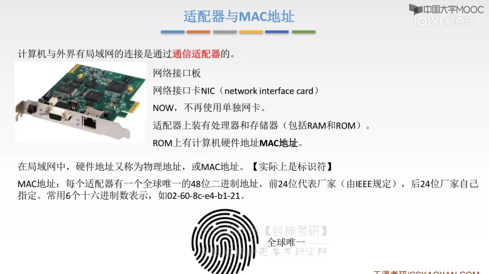

[TOC]

# 一、数据链路层功能

 

## 1、基本概念

 

## 2、功能概述

> - 什么是逻辑上无差错的数据链路？
>
>   - 说白了就是看起来没错误，可能物理上有错误
>
>   - 对于网络层表现为一条无差错的链路，说白了网络层被数据链路层屏蔽了信息，它只管发送信息
>
>     但不管差错，直接认为是没错的

   

# 二、封装成帧和透明传输

## 1、封装成帧

 

## 2、透明传输

> - 啥玩意？
>   - 就是数据链路层看不见自己往同一数据层传输的是啥

 

### 2.1、字符计数法

> 缺点：一个计数字段炸了，后面都炸了

 

### 2.2、字符填充法

> 升个级，把中间的EOT变成透明的

 

> - 实现透明传输
>   - 在EOT前面打个“ESC”转义符
>   - 读数据的时候再把“ESC”转义符去了

### 2.3、零比特填充法

> - 还是有点小东西在的
>   - 标志字段为 0111 1110
>   - 那么我为了让内容中不会出现0111 1110，就不能连续出现6个1啊
>   - 发送的时候，连续五个的1填充一个0
>   - 接收的时候，连续读到5个1的时候，就把后面的0删除

 

### 2.4、纠错编码

 

# 三、差错检测

## 1、检错编码

 

> - 物理层的编码调制与数据层的编码调制不同
> - 冗余就是在原先的编码上加上一些用以检错的位

 

### 1.1、奇偶校验码

> 奇校验就是让当前的编码的“1”的个数为奇数

 

### 1.2、CRC循环冗余码

> - 操作步骤见下
>
> - 原理见下，这里面有很深的门道，此处我将抽象几个要点，并且`借助询问的方式从单独的切面`解释其中奥妙	 
>
>   - **加上r位0的操作是为什么？**
>
>     - 其实你可以理解为`一个数x变为了x 0000`(有种科学计数法扩大了位数的感觉)，被y除后余1111，`因此把此数变为x 1111`，它再除以y就可以整除了
>
>       我们的`根本目的就是校验`，所以这样设置使得`接收端能合理校验即可`
>
>   - **为什么是r位呢？**
>
>       - 因为生成多项式为r+1位，我们补上了r位0加上原始数据>=1位，则使得`合成的数据位数>=生成多项式的位数`
>
>         此时产生的余数才合理且合适
>
>         (不加上)10 / 110 余 10，合成为10 10，但接收方用110无法整除(余10)
>
>         (加上)10 00(补位) / 110 余 10，合成为10 10，接收方,110可以整除
>
>   - **如果余数不为r位怎么办呢？**
>
>       - 不为r位，要么小于r要么大于r
>
>         小于r：假设余10(r为3)，则`补零为0 10`咯
>
>         大于r：可能吗，大于r位的话，不就跟除数一个位数的了吗，此时`还可以再做一次除法运算`啊
>
>   - **关于除法得到的余数，有时需要被除数减去余数才可整除除数，有时需要加上余数才可整除除数，为什么此处都是加余数？**
>
>     - 这个就是生成多项式的选取了，所以要用一个合适的生成多项式呢

 

 

> 缺点：不能纠错

 

## 2、纠错编码

### 2.1、海明码

 

 

 

 

 

## 总结

# 四、流量控制与可靠传输机制

## 1、数据链路层的流量控制

 

 

 

 

## 2、停止-等待协议

 

### 2.1、无差错/有差错情况

> 无差错

 

> **有差错的情况**

> **第一种**：检测到数据帧丢失或者检测到帧出错

 

> **第二种**：ACK(确认帧)丢失
>
> 发送方没得到确认帧，再重传
>
> 接收方丢弃重复的1帧，再返还确认帧

 

> **第三种**-ACK迟到
>
> 对于迟到的确认帧，丢弃就完事了
>
> 对于重复的确认帧，丢弃那个晚来的就完事了

 

### 2.2、性能分析

 

> 信道利用率、信道吞吐率

 

## 总结

 

> 为了提高信道利用率采用了流水线技术，一次多发几帧

 

## 3、后退N帧协议

> - 大概实现细节
>
>   - **发送窗口**：里面有一组连续的帧的序号；**接收窗口**：个数为1
>   - 发送窗口发送第一个帧后，得到了接收方的对应ACK，就把整个窗口往后移动一帧，以此类推
>
> - 特殊在哪？
>
>   - 相对传统的停止-等待协议，发送窗口可以`连续发送多个帧(好比连续发送0,1,2三帧)`
>
>     接收方收到三个连续的帧后，`把接收到的最后一个帧(帧2)的ACK，返回给发送方`(只有依次收到了才会移动窗口到最后的帧)
>
>     发送方发现自己`收到了最后一个帧的ACK，就直接移动3个帧，发送第四个帧`
>
>     *一个确认帧，接收一组帧，大大减少了等待确认的时间*

 

### 3.1、GBN发送/接收方任务

> - GBN的发送方需要的三件事
>
>   - 上层调用，如下
>
>   - 收到了一个ACK，即累计确认，如下
>
>     累计确认是指接收方在收到多个数据包时，不必每收到一个数据包就立即确认，而是等到收到一定数量的数据包后，一起发送一个确认消息，以减少确认消息的发送数量。这样可以提高网络效率和吞吐量。
>
>     举个例子，假设发送方需要向接收方发送100个数据包，每次发送一个数据包后都需要等待接收方的确认消息才能发送下一个数据包，那么总共需要等待100次确认消息。但如果采用累计确认，接收方可以每收到10个数据包就一起发送一个确认消息，这样就只需要等待10次确认消息，大大减少了通信的延迟和开销。
>
>   - 超时事件，跟停止-等待协议一样
>
> - **超时计时器解决了什么**？
>
>   - 解决了“死锁”，接受方有自己的expectedseqnum，非这个帧不要，他需要等待发送方发送
>
>     发送方也在等待着，这个帧的ACK帧到来，才能往后移动窗口
>
>     定时器就解决了此功能，发送方等不到确认帧，就重新发送

> - GBN接收方有一个expectedsqenum，标志着下一个按序接收的序列号

 

### 3.2、运行过程

> - 当我发送2帧出现丢失后 接收方就会反复发送前一个帧的ACK
>
>   当发送方收到重复收到的ACK，就知道了发生了错误，可以直接重传
>
> -   

 

### 3.3、滑动窗口长度

> - 长度应该是多少
>
>   - 若有n位比特对帧编号，则发送窗口的尺寸W_T应满足
>     $$
>     1 <= W_T <= 2^n -1
>     $$
>     说白了就是要小于一整轮编号的长度
>
> - 为什么不能无限长？
>
>   - 如下画的接收窗口
>
>     如果0123的ACK都被截掉了(接收方接收了)，滑动窗口在下一个0那里了
>
>     那么发送方接收不到ACK，超时了再发送一组0123，就可能发送到接收方的下一组0123了

 

> 习题
>
>  
>
> 
>
>  

## 总结

 

 

## 4、选择重传协议(SR)

> 为了解决接收方的丢弃帧和出错只重传错误的帧

 

 

### 4.1、发送方/接收方的任务

> 反正窗口的下界右边的元素就是序号最小的那个

 

 

### 4.2、运行过程

> - 关键之处
>
>   - 接收方不会说只有一个expectedseqnum
>
>     它有一个窗口，如果收到了小于窗口下界的就返回ACK，如果大于上界的就丢弃
>
>     所以丢弃的帧还是很少的，一定程度上节约了资源

 

### 4.3、窗口长度

> 不知道为啥，有点小复杂

 

> 习题
>
>  

## 总结

  

 

# 五、介质访问控制

## 1、传输数据使用两种链路

> `为了让两个节点通信不会互相干扰`，于是出现了`介质访问控制`

 

## 2、分类

 

## 3、信道划分介质访问控制

> 属于静态划分信道

 

### 3.1、频分多路复用FDM

 

### 3.2、时分复用TDM

 

> 当只有D需要传输数据的时候，它需要等待ABC的时间过了才能得到时间片，相当于浪费了
>
> 于是出现了`统计时分复用STDM`
>
> - 实现原理？
>
>   - 说白了就是搞了一个**集中器**，把同一个周期内所有用户发送的数据放到缓存里面(可能AB发送了，CD没发送)
>
>     然后再读到STDM帧中，一个STDM帧满了就发送
>
>     并且加上了一个条件，`每一个STDM帧的时隙数小于连接在集中器上的用户数`，说明了什么？
>
>     我收集此时周期内的所有数据，并且不需要收集全部用户的数据就可以发送了，即不需要等待4个周期就可以发送

 

### 3.3、波分多路复用WDM

 

### 3.4、码分多路复用CDM

 

## 总结

  

## 4、随机访问介质访问控制

> **动态分配信道**
>
> 用户的时间片都是任意的，没有固定分配时间片

### 4.1、ALOHA协议

#### 4.1.1、纯ALOHA协议

> 啥啊这是，就冲突了就算了呗，检测到就重发

 

#### 4.1.2、时隙ALOHA协议

> - 为什么可以避免冲突？
>   - 说人话就是冲突之后，会把冲突的数据放到一个指定时间片去，A与B与C冲突，A在1时间片，B在2时间片了，C在3时间片了
>   - 假设有多个节点在同一时刻想要发送数据，由于时隙ALOHA协议规定每个节点只能在特定的时隙内发送数据，因此节点会等待下一个时隙，只在自己所属的时隙内发送数据。这样就避免了节点之间在同一时刻发送数据的情况，减少了碰撞的概率，从而提高了通信的成功率。因此，时隙ALOHA协议相对于普通的ALOHA协议，可以更有效地减少冲突率，提高通信的成功率。——《ChatGPT》

 

### 总结

 

 

# 六、CSMA协议

> 核心思想：`发送帧之前，监听信道`

 

## 1、三种CSMA

### 1.1、坚持CMSA

 

### 1.2、非坚持CSMA

> - 等待一个随机的时间，因为大家可能时间不一样嘛，所以再次冲突可能性小

 

### 1.3、p-坚持CSMA

> - 这哥们干啥的？
>   - 这哥们就纯量子力学，空闲也是随机发送
>   - 忙则持续监听，直到空闲再随机发送
> - 结合了什么优势？
>   - 空闲随机发送，有效减小冲突，因为同时发不就污染信道了嘛
>   - 持续监听神中神，不至于信道空闲我还晓不得
>   - 概率p发送其实等同于随机时间嘛

 

## 总结

 

## 2、CSMA/CD协议

> - 为什么明明有carrier sense了，在multiple access的状况下，还是需要collision detection？
>
>   - 因为电磁波传播有距离啊，万一现在我虽然没检查到有数据，但这哥们其实在路上呢，等他到了不就冲突了？
>
> - 如何理解“边监听边发送”？
>
>   - 在 CSMA/CD 中，发送方发送数据时需要边发送边监听，一旦发送的数据与其他数据碰撞，则会停止发送，等待一段时间后重新发送。
>
>     具体来说，在发送数据时，发送方需要边发送数据边检测信道是否发生碰撞。如果在发送完一个比特后，发送方检测到信道上有其他信号，说明有其他节点在同一时刻也在发送数据，就会停止发送数据，并且发送一个干扰信号，表示发生了碰撞。此时，发送方会等待一个随机的时间后再次发送数据。

 

### 2.1、冲突处理

> - 通过以下分析，得到一个结论
>   - 只要经过2τ时间还没检测到碰撞，就肯定没有发生碰撞鸭

 

> - 为什么发生碰撞之后不能马上重传？
>   - 废话，再同时重传不还是会同时到一个地方，再次碰撞吗
>   - 所以需要重新确定碰撞时机
> - 截断二进制指数规避算法：操作如下

 

 

### 2.2、最小帧长

> - 因为如果帧很小，那么在我检测到碰撞(收到对面的信号的时候)，我已经把帧发送了，根本做不到停止发送鸭
> - 所以对帧的长度一定要有限制
>   - 这样才能实现我检测到碰撞的时候，没有憨憨地把所有数据发出去

  

## 3、CSMA/CA协议

有人不是重点，我不说是谁

> - CA：collision avoidance
> - 为什么要有CSMA/CA协议？
>   - 因为检测碰撞不扯淡吗，哪那么好检测到碰撞啊

 

 

> - CSMA/CD和CSMA/CA的比较

 

## 总结

 

## 4、轮训访问介质控制

> - 轮询访问MAC协议/轮流协议/轮转访问MAC协议 为什么产生？
>   - 既能`不产生冲突`，又要`发送时占全部带宽`(共享信道效率高)

 

### 4.1、轮询协议

> - 什么玩意？
>
>   - 就是一台主结点向从属结点发送数据帧，询问是否发送数据
>
>     若发送，则它独占信道，其他结点不能发送

 

### 4.2、令牌传递协议

> - 什么b动静？
>
>   - 就是有一个令牌在几个主机之间来回移动嘛
>
>     如果有个主机要发送数据，那么先修改它状态字，不让这玩意走了
>
>     然后让它携带上数据帧，通过在“令牌环”循环的方式找到目的主机，传递数据
>
> - 一个主机拥有令牌的时间是无限的吗？
>
>   - 不是，当主机占有令牌时间较长的时候，尽管此时数据没传输完，也会放走令牌
>
> - 令牌传输方式适用的网络是怎么样的？为什么？
>
>   - 负载较重的、通信量较大的啊
>
>     因为如果令牌不接收数据的话，就这么傻傻地在主机之间移动，也挺浪费的

 

# 总结

# 七、局域网

## 1、基本概念和体系结构

### 1.1、基本概念、拓扑结构

> 如下，总线型拓扑牛逼

 

### 1.2、介质访问控制

 

### 1.3、分类

> - 无线局域网(Wireless Local Area Network)：顾名思义，就是`无线的传输介质为空气`
>   - WIFI就是WLAN的一种，地理位置讲比局域网更局域

 

> - 关于IEEE 802标准
>   - 需要记忆的有：
>     - IEEE 802.3：以太网有关
>     - IEEE 802.5：令牌环网有关
>     - IEEE 802.8：光纤有关
>     - IEEE 802.11：无线局域网

 

### 1.4、MAC子层和LLC子层

> - `LLC子层`向上衔接`网络层`
> - `MAC子层`向下衔接`物理层 

 

## 总结

 

## 2、以太网

### 2.1、概述

> - 使用CSMA/CD协议
> - 使用最为广泛

 

> - `无连接`，`不可靠`
> - 只能实现无差错接受，不能实现可靠传输(可靠传输：要对帧丢失重复这些进行解决)
> - 以太网负责`物理层和数据链路层`，因为可靠传输由高层解决

 

> 以太网拓扑：`逻辑上总线型`，`物理上星型`

### 2.2、10BASE-T以太网

> - 采用`曼切斯特编码`
> - 传送`“基带信号”`
> - 采用`“无屏蔽双绞线”`

 

### 2.3、适配器和MAC地址

> - 什么是适配器？
>   - `计算机和外界局域网的连接`是通过这家伙的
> - 什么是MAC地址？
>   - `MAC`，`硬件地址又称为物理地址`。就是这个硬件独一无二的`标识符`

 

### 2.4、以太网MAC帧

> - 最常用的MAC帧是`以太网V2的格式`（第一个标准下的格式）
>
> - **细说过程**
>
>   - ​		   				   IP数据报		----IP层
>
>     ​		   				   ↓     ↓ 46B~1500B
>
>     ​	   目的地址 | 源地址 | 类型 |  数据  | FCS  ----MAC层
>
>     ↓    ↓
>
>     前导码 | 以太网MAC帧					       ----物理层
>
>   - **解释一下几点**
>
>     - *数据的长度为什么最小为46B？*
>
>       46B = 64B(最小帧长度) - 6 - 6 - 2 - 4(见下图)
>
>     - *FCS是什么？*
>
>       加上的`冗余码`，说变了就是个余数
>
>     - *前导码是什么？*
>
>       分为`前同步码`和`帧开始定界符`，注意：不属于MAC帧的一部分
>
>       前同步码：实现发送方和接受方时钟的同步
>
>       帧开始定界符：告诉接收方可以开始接受MAC帧了
>
>     - *有帧开始定界符，为什么没有结束定界符？*
>     
>       以太网使用的曼切斯特编码，曼切斯特编码牛逼的地方在于字节的传输伴随着电压变化，`不发生变化就没有传输数据咯`
>     
>       
>

  

### 2.5、高速以太网

 

## 总结

## 3、无线局域网

 

### 3.1、MAC帧头格式

>   A    ->   Ap_1   ——>   Ap_2   ——>  B
>
> 源地址SA    发送端TA      接收端RA   目的地址DA

 

> BSSID：*站点的 MAC 地址*

### 3.2、分类

 

>  

 

> 蛮腻害的

 

## 4、VLAN

### 4.1、VLAN的基本原理和基本概念

> - 解决了局域网缺点

 

> - 什么叫virtual？
>   - 物理位置上不相邻的主机，逻辑上可以为一组

 

### 4.2、VLAN实现

#### 4.2.1、基于接口

> - 处于不同VLAN的主机如何实现通信？
>
>   - 借助路由器和三层交换机
>
> - 如何隔离同一物理位置的主机/如何实现同一个VLAN下通信？
>
>   - 上面两个问题本质是一样的
>
>   - 当A想与B通信时，先看下转发表，B端口为2
>
>     然后再去VLAN表，看到端口2的VLAN ID
>
>     --若与自己所处的VLAN的ID一样，进行转发
>
>     --若不一样，则不会发送转发

 

#### 4.2.2、基于MAC地址

> - 端口换成了MAC地址，每个MAC地址对应它的主机

#### 4.2.3、交换机之间通信

> - 怎么实现的？
>
>   - A发了一个MAC数据帧到交换机1
>
>     交换机1给`帧加了个标签`，然后发给了交换机2
>
>     交换机2收到以后砍掉这个标签得到了MAC帧
>
>     再把这个MAC帧送给目的主机
>
>     注意：`此时要满足VLAN对VLAN`

 

**关于贴标签**

> - 贴的什么标签？
>
>   - 对VLAN的标记
>
>     占4个字节，具体内容见下图
>
> - 主机和交换机之前只交换普通的MAC帧

 

> 练习
>
>  

# 八、广域网

## 1、广域网及相关协议

> - 广域网更注重于资源的共享；局域网更注重于“数据传输”

## 2、PPP协议

> - 只支持全双工链路

 

### 2.1、满足/不满足的要求

好多字，看麻了

 

 

### 2.2、三个组成部分

> - LCP相当于数据链路层在实现了一个`物理上的连接`
> - NCP实现了一个对于网络层`逻辑上的连接`

 

### 2.3、状态图

 

### 2.4、帧格式

> - 转移字符
>   - 为了防止数据报里面有跟标志字段一样的数据被误解为传输结束了
>   - 在定界符一样的字段前面加上 7D: 0111 1101

 

## 3、HDLC协议

 

### 3.1、站

 

### 3.2、帧格式

 

## 4、PPP协议&HDLC协议

 

## 总结

  

 

# 九、数据链路层设备

## 1、物理层扩展以太网

> - 冲突域：在此域如果有多台主机同时占用信道，就会发生冲突
>
> - 主干集线器：连接了下面几个集线器，使得不同集线器下的主机能同时通信
>
>   ​		  同时也扩大了冲突域

 

## 2、链路层扩展以太网

### 2.1、网桥

> - 网段：见下
>
> - 过滤了通信量和增大吞吐量？
>
>   - 过滤通信量：利用网桥将主机分成了多个冲突域
>
>   - 吞吐量：理论上来说，在总线结构，一次只能有一台主机通信，但在网桥架构下
>
>     ​      同一时间，某一网段下的主机之间互相通信，另一个网段下的主机之间也可以相互通信
>
> - 提高了可靠性？
>
>   - 一个冲突域的问题不会影响到另一个冲突域

 

> **透明网桥**
>
> - 对通过网桥的帧进行记录，记录它们的：源地址，接口
>
>   以此实现确定每一个主机对应它们所在的接口位置
>
>   每次有数据经过网桥就可以通过源地址判断它们所在的接口，加快传输

 

> **源路由网桥**
>
> - 源站以广播方式想目的站发送一个“发现帧”
>
>   然后就可以发现多种路径，可以根据目的选取路径(路由最少/时间最短)
>
>   把信息放到帧的首部

 

### 2.2、多接口网桥——以太网交换机

> - 优势：独占媒体带宽

 

**两种交换方式**

#### 2.2.1、直通式交换机

#### 2.2.2、存储转发式交换机

 

#### 2.2.3、自主学习功能

> - 如何理解自主学习？
>   - 看图就可以明白了，与网桥一样，每次访问会记录源地址和接口，并且找它目标地址所在的接口

 

## 3、冲突域和广播域

> - 表格为重

 

> 例题
>
> - 整体构成一个广播域
> - 集线器是一个冲突域，以太网交换机每一个端口是一个冲突域。故4个
>
>  

## trail

`

`

 `

`

`
