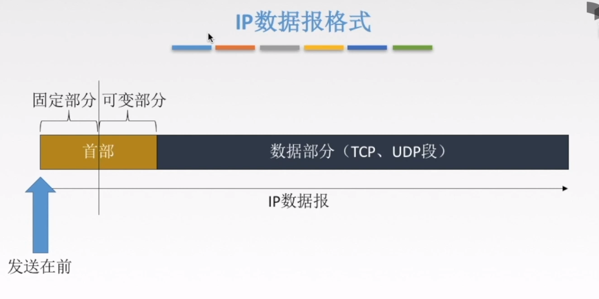
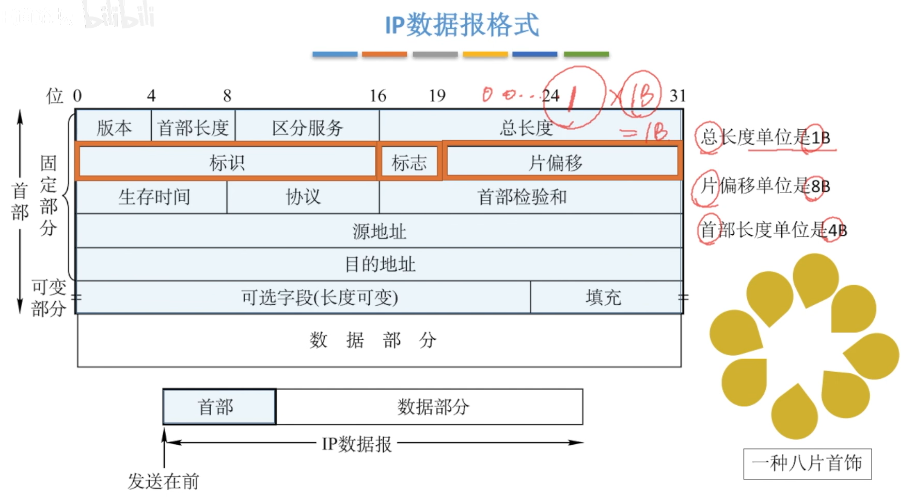

[TOC]

 

# 一、网络层功能概述

> - 记住功能就完事了

 

 

# 二、路由算法及概述

## 1、路由算法

> - 计网中的较为合理，大多指的是“路径最短”

 

### 1.1、分类

> - 如何理解`负荷稳定、拓扑变化不大`？
>   - 那就是主机不会突然退出网络，即路由表/转发表不容易发生变化
> - 如何理解`全局性`和`分散性`？
>   - 全局性：路由器是站住全局角度的，知道全部网络拓扑和链路费用信息
>   - 分散性：路由器只保存相邻路由器的信息，感觉有点贪婪的感觉啊

  

### 1.2、分层次的路由选择协议

> - 为什么因特网规模很大会成为原因？
>   - 因为一个路由器的路由表不可能存下所有的路由信息啊
> - 如何理解“自治系统AS”？
>   - 说白了就是把偌大的局域网分成了多个“逻辑分区”
>   - 每个自治系统都有自己的`内部网关协议`和与其他自治系统交流的`外部网关协议`

  

 

# 三、IP数据报

> - TCP/IP协议栈

 

## 1、格式

> - 分成了首部、数据部分
> - 首部分成了固定部分和可变部分
>   - 固定部分就是基础信息吧大概

 

> - 首部长度
>
>   - 单位为4B
>   - `最小值应为0101`：因为首部有固定长度为20B，单位为4B，那么应该有5个单位(长度)
>
> - 填充
>
>   - 因为我们可以看到通过 首部长度*4 计算得出的首部长度应该是4的倍数个B
>
>     那么当首部大小不为4的整数倍时，就`填充字节，使其为4的倍数`
>
> - 总长度
>
>   - 最大长度为2^16-1=65535B，为什么-1呢，因为00...0那个不算长度
>
> - 生存时间
>
>   - 防止数据报在几个路由器之间死循环，浪费资源
>
> - 协议
>
>   - TCP：`字段为6`，面向连接
>   - UDP：`字段为17`，不是面向连接，遇到错误帧丢弃
>
>    
>
> - 首部检验和
>
>   - 利用加和的方式，检测经过路由器的数据报的`生存时间、片偏移`

 

## 2、数据报分片

> - MTU(可封装数据上限)是1500字节
>   - 若传送的数据报长度超过链路的MTU值，则需要将数据报分片

 

### 2.1、格式

> - 注意，片偏移是以8B为单位的

 

> 例题
>
> - 注意，每个数据报的首部占20B
> - 数据部分：0B~3799B(称第一个部分为0字节，离谱)

 

## 总结

 

# 四、IPv4地址

## 1、IP编址的历史阶段

  

### 1.1、IP地址

> - IP地址有什么用？
>   - 标识了路由器主机的接口
>   - 记录了主机的网络号、主机号

 

### 1.2、示例

> - 绿色的是一种特殊的网络
>   - 称作无编号，或者无名网络
>   - 由一段连线构成
> - 故此图有六个逻辑上的网络

 

## 2、分类的IP地址

> - 你分类干嘛~哎呦
>
>   - P地址分类是指将32位的IP地址分为不同的类别，以便更好地管理和分配IP地址。IP地址分类是在IPv4时代引入的，因为IPv4地址空间有限，需要更有效地分配IP地址。
>
>   - A类地址用于较大规模的网络
>
>     B类地址用于中等规模的网络
>
>     C类地址用于小规模的网络
>
>     D类地址用于多播
>
>     E类地址保留
>
>     每个类别的地址范围都是预先定义好的。
>
> - `1B`指的是`阴影部分的长度`
>
> - A类
>   - 最大可用网络数：2^7-2
>     - 7是因为8减去了第一位
>     - 减2，一个是0000 000，指的是`本网络`；一个1111 111(127)，用于本地软件测试
>   - 每个网络中最大的主机数：2^24-2
>     - 24位咯
>     - 减去一个全0的，因为它代表本网的网络；减去一个全1的，用于广播地址，这个当然不算一个主机数啊
>
> - B类
>   - 最大可用网络数2^14-1
>     - 16减去了2位的占用
>     - 减去的是全0的情况
>   - 每个网络中最大的主机数：2^16-2
>     - 跟A类一样
>
> - C类
>
>   - 最大可用网络数2^21-1
>     - 24位减去三位
>
>   - 每个网络中最大的主机数：2^8-2
>     - 跟A类一样

  

### 2.1、特殊IP地址

> - 127.0.0.1
>   - 会发送到本主机去
>   - 作用就是`测试软件的网络层生效与否`
>   - 测试站点能否正确地发送和接受数据

  

### 2.2、私有IP地址

> - what
>   - 只可以在单位、学校机房使用

 

# 五、专用网络转换NAT

> - 

   

### 1、网络地址转换NAT

> - 啥啥啥？
>
>   - `NAT路由器`是`专用网`和`因特网`的一个连接枢纽
>
>   - 它有一个有效的外部全部IP地址（相对于私有IP地址）
>
>   - 它存放了一张转换表
>
>     - 格式如下
>
>     - 作用：内部信息传达外部，就会把`IP端口号`对应转换为一个`新的全球IP地址`，就可以实现广域网传输了
>
>       ​     外部到内部也是如此，`外部全球IP地址`转换为`本地的私有IP地址`

# 六、子网划分和子网掩码

## 1、子网划分

> - 分类IP地址的`弱点`
>   - IP地址空间的`利用率有时很低`
>     - 举个栗子，A类IP地址，主机号很多，但是它那个网络根本就抗不下那么多主机，所以很多主机号都不能用
>   - 两级IP地址`不够灵活`
>     - 我想要个新网络号，但是申请又很麻烦，有什么办法能直接整个新的呢？

 

 

> - 有个问题嗷，到达145.13.0.0的分组到达了路由器之后、怎么送到子网去呢？
>   - 子网掩码来啰

 

## 2、子网掩码

> - 网络号、子网号对应的8B为全1
>
>   主机号的8B对应全0
>
> - 干啥的？
>
>   - 让上面的路由器找到子网
>   - 用`子网掩码`与路由器收到的`IP地址相与`，得到的结果就是`子网的网络地址`

  

> 习题1
>
>   

> 习题2
>
>  

## 3、使用子网时分组的转发

> - 1.什么叫直接交付？如何判断？
>   - 把目的IP地址与当前所在的网络的子网掩码相与，如果发现目的主机`在当前子网`，则`不经过路由器，直接转发`
> - 2.特定主机路由
>   - 它是`一种路由表项`，不必关注于具体结构，它的作用就是将数据包直接路由到`一个具体的IP地址`，而非一个IP段(子网吧感觉)
> - 3.检测路由表中有无路径
>   - 与路由表的全部子网掩码相与，发现目的主机不在当前子网，则`转发到对应的路由器`去
> - 4.默认路由0.0.0.0
>   - 就是不知道应该转给哪个路由器了，`直接给个默认的`，当然也不可能那个子网里面没有默认的
> - 5.丢弃，报告转发分组出错
>   - 如果转来转去`超过了TTL时间，则报错`

 

# 七、无分类编址CIDR

> - 无分类域间路由选择（Classless Inter-Domain Routing）
> - 打破了传统的分类概念，改为了网络前缀
> - 融合了子网地址和子网掩码
>   - 说白了就是子网换了个叫法，“CIDR地址块”，“/20地址块”

 

## 1、构成超网

> - 什么玩意？为什么？
>
>   - 就是把多个子网聚成一个较大的子网咯，就是超网，又叫做路由聚合
>
>   - 因为很可能`多个子网都是共用的一个接口`，`路由表条目就会重复`，如下图。
>
>     所以把他们合并后就可以减少路由表的条目
>
> - 怎么合成
>
>   - 就是把网络前缀相同的部分提取出来，就是一个大的网络了(哇这个CIDR真的6)
>
>     **例**：206.1.0.0/17和206.1.128.0/17合并的部分为206.1
>
>        因此合并后的网络就为206.1.0.0/16

 

> 例题
>
>  不差

 

## 2、最长前缀匹配

> - 当遇上了多个子网掩码匹配的都得到了子网，选择那个前缀最长的
>
>   因为前缀越长，地址块越小，路由越具体

 

> 例题，不差

 

# 八、三大协议

## 1、ARP协议

> Address Resolution Protocol
>
> 地址解析协议

### 1.1、发送数据的过程

> **在同一局域网内的数据发送过程**
>
> - **应用层**：pdf
>
> - **传输层**：如`太大`就把要传输的数据`分段`
>
> - **网络层**：在数据报文尾部加上IP地址->源主机IP地址，目的主机IP地址
>
> - **数据链路层**：
>
>   - 根据`ARP高速缓存`得到的<u>IP地址-MAC地址的映射</u>，把MAC地址加入，进入数据链路层
>
>     - 存储的是`局域网内部的映射`
>
>     - 若没发现映射，应该怎么办呢？
>
>       ​	发送`广播ARP请求分组`，只有对应目的地址IP的主机才会响应
>
>       ​	然后返回一个`包含MAC地址`<u>单播ARP响应分组</u>
>
> - **物理层**：转化为数字信号或者模拟信号放到传输介质去

 

> **在不同局域网发送数据**
>
> *只有数据链路层与上述不一样*
>
> - 发送`广播ARP请求分组`，`IP为默认网关地址`
>
>   - 响应返回<u>网关的MAC地址</u>
>   - 把物理接口地址MAC6加入数据链路层
>
> - 发送到路由器1后，`路由器解封到网络层`（路由器是三层设备，最高解封装到网络层）
>
> - 路由器1*又通过MAC7接口送出去，目的MAC地址为MAC8*（MAC8其实可以全为1的，因为PPP协议点对点，目的都是默认的，不需要指定）
>
>   - *但注意，如果不是PPP协议(即一个路由器对应多个路由器，此时需要使用ARP协议)*
>
> - 路由器2又*从MAC9发送到交换机*
>
>   - 交换机没有MAC地址，不关心如何发送的细节
>
> - 交换机根据`请求表`**找到对应接口即MAC5**，然后数据链路层把MAC5封装到目的MAC地址
>
>    
>
> - 最终发送达到主机5

  

> 习题
>
>  

### 1.2、意义

 

## 2、DHCP协议

> - 分配IP地址的方式？
>   - 静态配置，就机房那边，一台主机锁死一个IP
>   - 用于动态配置IP地址
>     - 利用`DHCP服务器分配IP地址`
> - DHCP协议如何分配IP的呢？
>   - 见下吧，文字挺形象的

 

## 3、ICMP协议

> - Internet控制报文协议（Internet Control Message Protocol）
> - 作用
>   - 更加有效地转发数据报和提高交互成功的机会
>   - 发送`差错报文`，即特定的ICMP报文
> - 结构
>   - 装在IP数据报的数据部分
>   - 0~31bit，4B
>   - 而后的4B取决于类型，数据部分的长度也是取决于类型

 

### 3.1、分类

#### 3.1.1、ICMP差错报告报文

 

**数据字段**

> - 构成如下

  

**不发送ICMP差错报文的情况**

> - 1.当主机收到的ICMP差错报告报文出错了，不会返回一个ICMP了
> - 2.针对一组数据报分片时，只对第一个分片返回一个ICMP差错报告报文
> - 3.组播地址，是指发送到特定的主机群

 

#### 3.1.2、ICMP询问报文

> - 主机与主机、主机与路由器的在网络层的交流

 

### 3.2、应用

> - Traceroute有点强的，遇到了再彻底搞懂吧

 

# 九、IPv6

> - 直接把地址位数增长

  

## 1、数据报格式

  

> - 流标签
>
>   - 流是具有`相同源地址、目的地址`和其他相关属性的数据包集合，例如音频或视频流。
>
>   - 流标签的目的是支持IPv6中的流级别服务（Quality of Service，QoS）
>
>     以便在网络中对不同类型的流提供不同的服务质量
>
>     例如，对于要求低延迟的实时音视频流，可以提供更高的带宽和较低的延迟，而对于传输大量数据的批处理流，可以提供较低的带宽和较高的延迟容忍度。
>
> - 下一个首部
>
>   - 基本首都的下一个首部`指向下一个扩展首部`，依次类推
>   - 最后一个扩展首部指向数据

 

## 2、IPv4 VS IPv6

> - 标红字是重要的nie

 

## 3、地址表示形式

> - 两种压缩方式
>   - 如下图

 

## 4、基本地址类型

> - 怎么理解可做**目的地址**？
>   - 就是多播类型的IPv6地址可以放到数据报`首部目的地址`的位置

  

## 5、IPv6向IPv4过渡策略

> - 什么意思？
>   - 有的网络使用的IPv4地址，有的是IPv6地址，为了让他们交流制定了一系列策略
> - 什么是隧道技术？
>   - 就是把`传输的IPv6`作为`数据部分封装进IPv4`，然后再解封装得到IPv6

  

## 总结

 

# 十、三大路由选择协议

  

## 1、RIP协议

RIP是一种基于距离向量算法的路由协议，全称为Routing Information Protocol（路由信息协议）

> - 适合体量小的网络
> - 路由表记录了个啥？
>   - 目的网络 - 到达目的网络的距离 - 下一条路由器(把信息跳到哪一个路由器)

 

### 1.1、路由器交换信息

> - 蛮厉害的，我愿称之为“自碰撞算法”
>
> - RIP协议中
>
>   - `相邻`路由器会`交换路由表信息`（朝相邻路由器发RIP报文），然后路由器就会根据收到信息对自己的表项做出更新
>
>     举例：A-B-C，B与C交换信息，C知道了A与B相邻，那么C就会多这么一项: A-2-B
>
>   - `每三十秒交换一次(更新)`，如果180s没收到，就判定邻居没了，更新路由表

 

### 1.2、距离向量算法

> - 细节没什么难得
>
> - 注意两点
>
>   - 收到RIP报文的路由器会`先把里面的项目都进行修改`：把“下一跳”字段中的地址改为x，并把所有的“距离”字段+1
>
>      `然后才会进行筛选、覆盖和修改`
>
>   - 如果更新的信息跟已有的信息一模一样（目的-下一跳），则用其覆盖旧的

 

> 例题1
>
>   

> 例题2
>
> 挺有意思的，如果看不懂就看视频吧
>
>  

### 1.3、报文格式

> - 重点
>   - `RIP是应用层协议`，`使用UDP传输协议`
>   - 一个RIP报文最多包括25个路由，如超过，必须再用一个RIP报文发送

 

### 1.4、特点

> - 怎么理解呢？
>
>   - 网1出现故障了，那么`R_1的路由表更新`：网1 : 16
>
>   - *但在R_1把出错信息发送给R_2前，它收到了R_2发送来的RIP报文*
>
>     内容是：网1 : 2 : R_1
>
>   - `根据上面的距离向量算法`，R_1把信息修改为：网1 : 3 : R_2  -----> 出事儿
>
>   - 隔一会R_1又`跟相邻的R_2发送更新信息`了，R_2修改为：网1 : 4 : R_1
>
>   - 双方就这样你来我往，<u>直到距离为16</u>，发现这个数据网络是个不可达网络
>
> - 但是转念一想：这特喵不是算法设计的问题吗，如果R_1收到的RIP数据报中的下一条地址是R_1的话，不接受不就没这么多事了吗？？？

  

 

 

 

## 总结

 

## 2、OSPF协议

Open Shortest Path First（开放式最短路径优先协议）

### 2.1、“洪泛法”交换信息

> - **洪泛法**：A向B发送信息，B又把信息发给C...就这样“丢手绢”给全部路由器
> - RIP协议的`距离向量就是跳数`的意思，*这里是指度量和代价(路径的花费这些)*
> - 洪泛后，每个路由器都知道到其他路由器的代价和路径了

 

### 2.2、链路状态路由算法

 

### 2.3、OSPF的区域

> - 分为了主干区域、区域
>   - 主干区域：连通其他下层的“区域”
> - 搞这么复杂干嘛？
>   - 适用于体量大、复杂的网络了
> - 路由器
>   - 区域边界路由器：连接两个区域边界的路由器
>   - 自治系统边界路由器：连接其他Autonomous System
>   - 区域内部路由器：区域内部的咯
>   - 主干路由器：主干区域内部的

 

### 2.4、OSPF分组

 

### 2.5、特点

 

## 3、BGP协议

Border Gateway Protocol（边界网关协议）

 

### 3.1、交换信息的过程

> - 交换啥啊？
>   - 各BGP发言人互相交换`到达某一个网络要经过的AS路径`
> - 有啥用？
>   - BGP发言人整合收到的信息，`找到到达AS的较好路由`啊

 

**具体过程**

 

### 3.2、报文格式

> - 两个BGP发言人交换路由信息的时候：需要`先建立TCP连接`

 

### 3.3、特点

> - 这个路由表增加了个要经过的AS系列啊

 

### 3.4、四种报文

 

# 总结和比较

 

 

# 十一、IP组播

## 1、三种传输方式

> - 组播干啥的？比起单播、广播来说如何？
>   - 就是`给有需求的主机发送数据`，而**广播**是给全部的主机发送信息
>   - **单播**：*有多少主机需要资源，就把数据包复制多少份*；**组播**：只发送一次数据包，分散或者要到的时候再复制转发
> - 优势在哪？
>   - 只给有需求的，节约了资源
>   - 发送者`只发送一次数据`，一直送到目的主机所在局域网的`路由器上`，`才开始复制和分组转发`

 

**单播**

 

**组播**

 

## 2、IP组播地址

> - IP组播地址就是D类地址
>   - 一个D类地址表示一个组播组
>   - `只能用于分组的目的地址`。源地址都是单播地址
> - `非`可靠交付，应用于UDP
> - `不`产生ICMP差错报文（询问报文会产生？）
> - `不是`所有的D类地址都可以作为组播地址

 

## 3、硬件组播

> - 组播的MAC地址以`十六进制01-00-5E打头`，余下地址由IP组播地址最后的23位转换而成
>   - 具体结构如下图
> - 由于`D类IP地址前5-8位是不使用的`，*所以可能有不同的IP地址(仅仅这几位不一样)，但是映射的MAC地址一样*
>   - 为了防止识别出错，需要`在IP层利用软件进行过滤`，对不是本主机要接收的数据报进行丢弃
> - 考点
>   - D类组播地址到以太网地址的映射，其实就是把`D类IP地址前9位替换为01-00-5E`，后面照着写下来就行了

 

## 4、IGMP协议与组播路由选择

> - 干啥的？
>   - IGMP协议就是`让路由器知道本局域网是否有主机or主机的进程参加或者退出了某个组播组`
>   - 配合图示理解更好

 

### 4.1、IGMP的两个round

> - 加入组播组
>   - 其实就是利用本地组播路由器，`利用组播转发树把IGMP报文，转发到每个组播成员`
> - 本地组播路由器周期性探寻本地局域网上的主机，确定主机是否为组播组的成员
>   - *如果没有主机响应，就不把成员关系发送给其他组播路由器*
> - 什么叫**成员关系**？
>   - 就是本局域网是否有组播组的成员

 

### 4.2、组播路由选择

> - 什么是**组播转发树**？
>   - 以`发送主机为根节点`，构造出`到达各组播成员的的路径`
> - 什么叫**不同的源点有不同的多播转发树**？
>   - 好比主机2要到主机6，就需要经过R_2-R_4-R_6

 

**组播路由选择协议的算法**

 

## 总结

 

 

## trail

`

`

`

`

`