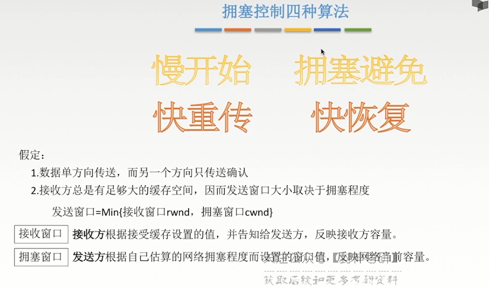

[TOC]

# 一、概述

 

## 1、传输层

> - 传输层指的是：`进程与进程之间`的逻辑通信
> - 网络层：提供`主机之间`的逻辑通信

 

## 2、两个协议

> - TCP：面向连接、可靠
> - UDP：不面向连接、不可靠

 

## 3、端口

> - 端口号 = 网络层的IP = 数据链路层的MAC地址

 

> - 常见应用程序-端口号

> - 套接字(Socket)
>   - 相当于（主机IP地址，端口号），对应于某台主机的某个进程

 

# 二、UDP

## 1、概述

> - `不会改变或者切片`应用层发下来的协议
> - 无拥塞控制
>   - 为啥？EX.当A举行视频会议时，即便网络有点卡，也不会停止(控制)A的讲话，保证了A的输入行为

 

## 2、首部格式

> - 分用时找不到，就会发送ICMP报文

 

## 3、UDP校验

> - 什么是伪首部？
>   - 模仿的IP首部
>   - 在计算校验和的时候才出现，为了校验UDP数据报而生，仅仅存在于传输层

 

**校验过程**

> - 怎么求和的？
>   - 先把每行取反码，求和，得到结果
>   - 然后再把结果求反码，放入检验和字段，去掉首部后发送

 

# 三、TCP

## 1、TCP协议特点

> - 什么是“虚连接”？
>
>   - 建立的连接不是物理上的连接，而是`逻辑上的连接`——好像两个主机下
>
>     的进程没有通过物理层-数据链路层-网络层`直接建立`了一个“传输层”通道来通信
>
> - 缓存干嘛的？
>
>   - 为了实现全双工通信，分为发送缓存和接收缓存
>   - **发送缓存**：准备发送的数据&`已发送当没有收到确认帧的数据`
>   - **接收缓存**：按序到达当没有被接收方读取的数据&`未按序到达的数据`
>
> - 什么事面向字节？
>
>   - 一般二进制是面向位模式，这个`TCP协议是面向字节的`

 

> - 面向字节流

 

## 2、TCP报文首部格式

> - 什么是序号？
>
>   - 就是本报文段`传送的字节流`中`第一个字节的序号`
>
>      
>
> - 什么是确认号？
>
>   - 这玩意作用：接收方返还给发送方的报文段中，告诉`发送方`我`下一个要收到的字节的序号为N`(表明前N-1个都收到了)
>
> - 数据偏移干嘛的？
>
>   - 就是数据部分在TCP报文段偏移多少字节，`相当于首部长度`
>
>     如果首部长度一样话，为什么还要特意指明偏移字节呢？那是因为*首部长度长度是可变的啊哈啤*
>
>   - `单位为4B`，即数据偏移为3(decimal)，那么数据部分在偏移3*4=12B才开始

 

**六个控制位**

> - URG和PSH干嘛的？有什么区别？
>
>   - 表明当前TCP报文段的重要性
>   - `URG`针对发送方的，让发送方发快点
>   - `PSH`是针对接收方，让接收方快点读取
>
> - 同步位SYN是什么？
>
>   - 当SYN为1的时候，表明这个TCP报文的作用是确认连接的，类似于ICMP确认报文
>
>     `发送方`发的`连接请求报文`，`接收方`发的`连接接受报文`

 

**其他玩意**

> - 窗口干嘛的？
>
>   - 接收方检查收到的报文段，发现`发送方指明了等会给他发送的数据大小`，
>
>     于是接收方就会开辟相应的发送缓存，*这样就知道发送多少了嘛，就不会发送多了*

 

## 3、TCP连接管理

> - three-way handshake

 

> - 三次握手过程
>
>   - 第一次：**Client**(1)发送一个SYN标志字段为1的`连接请求报文`，其中是`没有应用层数据`的，相当于没有数据部分
>
>     ​	  (2)还有一个seq字段，此字段的值为`随机得到的一个数`，意义为表示`当前连接请求报文段第一个字节的序号`
>
>   - 第二次：**Server**(1)`先为此时的TCP连接分配缓存和变量`
>
>     ​	  (2)并且返回一个SYN=1的确认报文段，`表示允许连接，其中也没有应用层的数据`
>
>     ​	  (3)标志字段ACK=1，因为连接建立了，*所有的报文段这个字段都要为1*
>
>     ​	  (4)seq=y字段表示`这个报文第一个字节的序号为y`
>
>     ​	  (5)ack=x+1表明`需要Client下次发送第一个字节号为x+1的数据`
>
>   - 第三次：**Client**(1)`也为此次TCP连接分类缓存和变量`
>
>     ​	  (2)Client向Server发送一个“确认的确认”，`此时是可以携带数据的`，不然感觉有点哈啤，搁这反复反复确认
>
>     ​	  (3)SYN=0，此报文不是用于请求和确认的；ACK=1表示建立连接了
>
>     ​	  (4)seq=x+1表明此报文序号为x+1；ack=y+1表明希望`Server下次发送的数据的第一个字节号为y+1`

 

## 4、SYN洪泛攻击

> - 什么是SYN洪泛攻击？
>
>   - 就是跟服务器进行“第一次握手”，服务器会返回一个ACK，但是请求方不确认。`此时的TCP就处于挂起状态`
>
>     而且服务器收不到“第三次握手”的“再确认”的话，就会`重复发送ACK`，又会浪费服务器的资源
>
>     如果发送大量的TCP连接而不确认的话，服务器端就会浪费大量资源
>
> - 怎么解决？
>
>   - 用一个SYN Cookie

 

## 5、TCP的连接释放

四次挥手

 

> - ROUND1：
>
>   - Client发送一个连接释放报文，表示：`停止发送数据，主动关闭TCP连接`
>   - FIN=1表明释放连接；seq=u表明`该报文的第一个字节的序号为u`
>
> - ROUND2：
>
>   - 什么叫`半关闭状态`？
>
>     - 客户到服务器的连接释放了，但是服务器到客户端的还没有，所以只关闭了一半
>
>   - Server返回一个确认报文段，表示：`客户端到服务器的连接莫得了`
>
>   - ACK=1表明现在仍然是建立连接的状态；seq=v则是`前面发送的数据有v-1`，到现在发送的就是v了
>
>     ack=u+1表明需要客户端发送第一个字节为u+1的数据
>
> - ROUND3：
>
>   - 服务器端发送数据，就发送连接释放报文段，表示：`服务器到客户端的连接释放了`
>
>   - FIN=1表明当前报文的目的是释放连接；ACK=1表示还是没释放连接；seq=w则是前面发送的数据有w-1，到现在发送的就是w了
>
>     `ack=u+1是因为客户端还没跟服务器发送数据呢`
>
> - ROUND4：
>
>   - 为什么`客户端要等待一个时间，连接才彻底关闭`？
>
>     - 假设`客户端发送的“第四次挥手”报文丢失了`，`服务器端`由于收不到确认，于是`重发“第三次挥手”报文`，
>
>       此时连接还没关闭，`客户端可以收到`，然后再重发
>
>       如果关闭了，`客户端就收不到了`，服务器也因为收不到“确认”`无法正确关闭`

 

## 6、TCP可靠传输

 

### 6.1、机制

 

**1、序号**

 

**2、确认**

> - 确认干嘛的？
>
>   - 就是当接收方收到了某个序号的报文段的时候，发个确认给发送方，`发送方就把缓存中对应的报文删了`
>
> - 怎么发确认？
>
>   两种方式
>
>   - 第一种：发送`确认报文`，`报文段的首部确认号字段为4，但却是表明序号为1的报文段收到了`，即让发送方后面把序号为n的字段发送
>   - 第二种：`捎带确认`，即发送`数据报文`的时候，`顺带一个确认信号`

 

> - 累计确认是什么？
>
>   - 针对`序号最小的缺失报文`，发送确认报文/捎带确认
>
>     如下图，就是首部确认号字段为4的确认报文
>
> - 为什么456没到，78到了？
>
>   - 因为`接收方同时发送了两个确认报文`，发送方就发送了两个不同序号的报文咯

 

**3、重传**

> - 重传的规定时间也有要求？
>
>   - 当然啦，时间太短，可能还在发送呢，就重传。时间太长，发送方需要等待很久的时间才能重传
>
>     此时就会多出很多的空闲时间
>
> - 那么重传时间多少好呢？（认真脸）
>
>   - 第三个RTTs由第一个、第二个和第三个的RTT算出来

 

> - 冗余ACK干啥的？
>
>   - 为了实现一个目的：`在重传时间到之前，就知道需要重传了`，这样我就立即重传，不用傻傻地等待超时
>
>     如下图，我`反复的发送给1的确认`(实际是要求确认号为2的报文段)
>
>     `收到的报文段越多，我就立即重传`

 

## 7、TCP流量控制

> - 滑动窗口...嘿嘿...我的滑动窗口
>
> - 就是接收方的`确认报文段中有一个窗口字段`，告诉发送方下次发送的数据能有多大
>
>   这样就实现了控制发送窗口咯
>
>   为0就是告诉发送方先别发了

 

### 7.1、实例

> - 这个例子告诉你`怎么进行流量控制`的
>
> - 有几个要点
>
>   - 第一，TCP协议不是平等的协议，**不是**传第一个报文段，收到确认再传下一个
>
>     **而是**一口气传几个报文段，B返回的报文也是直接表明前几个报文收到了，发送下一个报文
>
>   - 第二，`确认报文的rwnd字段实现了流量控制`
>
>     如下图，B返回的确认报文直接说了要发300，A就开辟个300字节的滑动窗口
>
> - 有一个`死锁问题`，假设B结束通话后，又想给A发消息，B返回的确认报文丢失了，
>
>   A就会傻傻等待，B也会傻傻等待A发送，怎么解决呢？
>
>   - TCP中为每一个连接设`有一个持续计时器`
>
>     - 只要某一方收到了零窗口通知，就启动持续计时器
>
>       到了时间就发送个探测报文，接收方就会给出窗口值
>
>       如果还是0的话，发送方就重置计时器
>
>   - 计时器：两方傻傻等待可以，但有一方想通信的时候就不能傻愣着了

 

## 8、TCP拥塞控制

> - 什么是拥塞？
>   - 许多资源都表现出供应不足，无法满足需求，网络吞吐量就会下降
> - 拥塞控制和流量控制的区别是什么？
>   - **拥塞控制**：具有`全局性`，主要是`控制“多少”`
>   - **流量控制**：`点对点`，主要是`控制“快慢”`

 

### 8.1、四种算法

> - 首先要满足这些假定

**1、慢开始和拥塞避免**

> - 讲解一下这个图表，以横坐标
>
>   - **0~4**: `慢开始阶段`，因为起始的时候比较慢所以叫慢开始
>
>     在这个阶段每完成一个传输轮次都会`让cwnd指数型增长`，即2^(传输轮次) = cwnd
>
>   - **4~12**：`拥塞避免阶段`，当cwnd`到了ssthresh(门限)的值`的时候，由于cwnd有点大了，
>
>     为了避免拥塞，不用指数了，`采用“加法增大”cwnd`
>
>   - **12~17**：在12的时候`检测到了“丢包”现象`，然后直接`把cwnd打成1`
>
>     然后再开启“指数型增长”
>
>   - **17~22**: 拥塞避免阶段，此时的`ssthresh的值 = 出现拥塞时的cwnd/2`(即24/2) = 12
>
>     cwnd到了ssthresh的值后，变为“加法增大”

 

**2、快重传和快恢复**

> - 什么时候执行快重传？
>
>   - 就是在`收到了三个重复的确认`，即发现出现了丢包现象
>
> - 什么叫快恢复？
>
>   - 就是不从cwnd=1开始，从`新的ssthresh值开始“加法增大”`
>
>     此所谓TCP Reno版本

 

`

`

`

`

`

