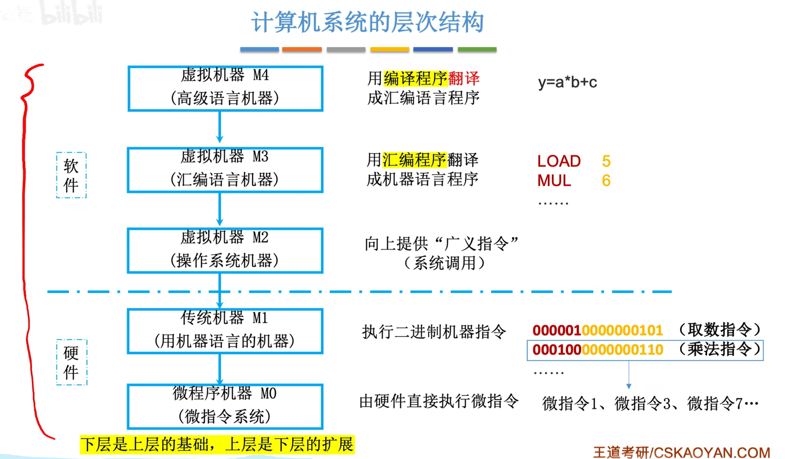
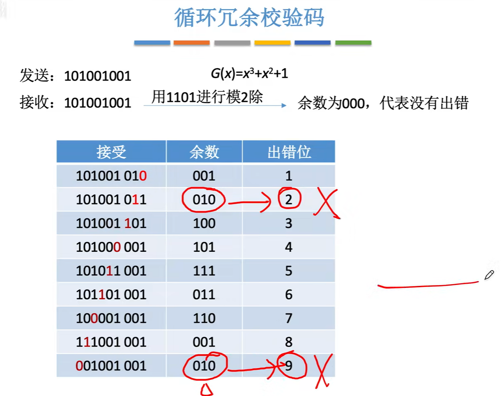
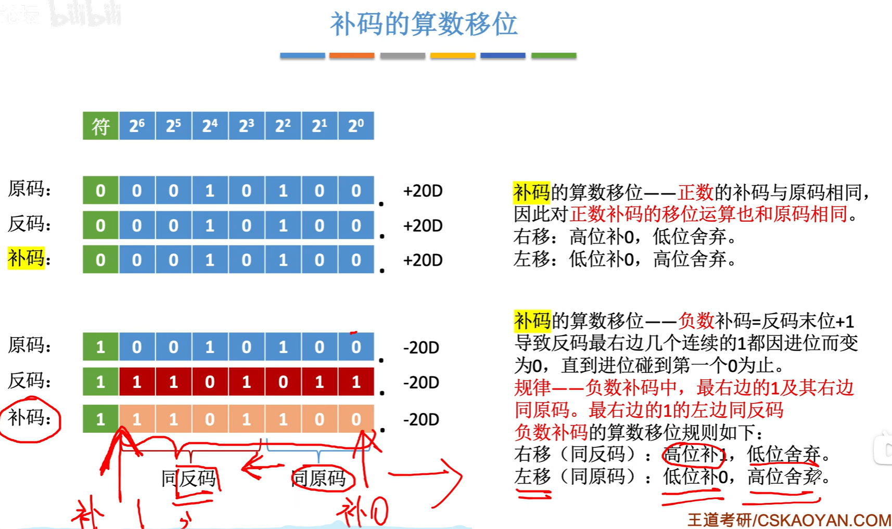
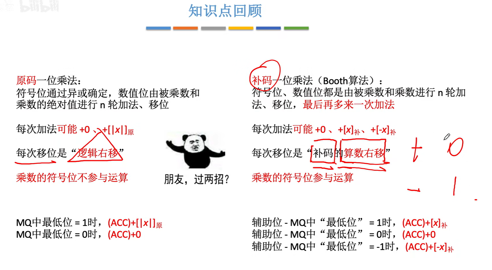

[TOC]

# 一、计算机概述

## 1.1、计算机基础结构

 

 

## 1.2、硬件发展

.assets/image-20220908180816781.png)

.assets/image-20220908180931433.png)

## 1.3、早期冯诺依曼机的结构

.assets/image-20220908233857790.png)

> 强调一下早期冯诺依曼机的特点
>
> 1、存储器以同等地位存储`指令和数据`，可以实现按地址寻访
>
> 2、指令和存储都是以二进制表示的
>
> 3、`指令`由`操作码`和`地址码`组成
>
> 4、操作码：`进行加减` 地址码：`程序存储的位置`
>
> 5、存储程序：早期是人们利用接线一条一条的输入指令，存储是指提前把`所有指令和数据一次性放到计算机存储`，然后就可以让计算机一次性执行所有指令了
>
> 补充：好比你要实现加法，你以前是每次都从头开始一条条的接线输入指令，而当我存储了程序之后，我每次要实现加法只需要调用地址(存在计算机里面已经输入好的指令)就行了，不需要从头开始接线
>
> 6、`以运算器为中心，冯诺依曼机的特点，输入设备的数据先输入到运算器，再到存储器存储`

.assets/image-20220908234011909.png)

*<u>下面帮助理解</u>*

.assets/image-20220908234645686.png)

## 1.4、现代计算机

> `贼有意思`
>
> 1、先讲一下`主存储器`和`运算器`和`控制器`的关系
>
> `控制器`通过`控制线`告诉`运算器`接下来应该执行`加减乘除`哪个操作
>
> `控制器`也会控制`主存储器的读写`
>
> `控制器`控制`输入输出设备`的`启动停止`
>
> 2、`主存储器`和`CPU`之间会进行`数据的交换`
> 第一种就是需要`参与运算的数据`，比如`abc变量`
> 另外一种就是`指令`，把指令放到`控制器`当中，由`控制器`来`解析`指令的含义，依次发出`相应的控制信号`
>
> 3、`输入输出设备(IO设备)`会直接和`主存储器`之间进行`数据的交换`
>
> 4、`主存储器`和`CPU`统称为`主机`，当然这只是计组里面的定义，*`生活中还有些啥风扇、硬盘`*
>
> 5、分去除主存和辅存，主存就是`主存储器(内存)，辅存就是辅助存储器`，硬盘啥的，注意是`IO设备`
>
> 注意：手机的运行内存8GB就是主存，辅存就是128GB之类，当程序运行就会把`辅存存储的数据调用到运行内存里面`

.assets/image-20220908234956669.png) 

# 二、走进科学

## 1、认识各个硬件

### 1.1、主存储器

> 讲一下具体过程
>
> 读数据：CPU将想要读的数据`放到MAR(存储地址寄存器)`，存储体`根据MAR去找到相应的数据`，`放到MDR去`，然后CPU再拿走这个MDR的数据
>
> 写数据：CPU指明写入的数据的`地址到MAR去`，然后把`数据放到MDR去`，存储体再根据地址把这个数据存储了

.assets/image-20220909155855407.png) 

> 补充个几个点：
>
> 1、`存储字(word)`是指 `存储单元中二进制代码的组合`，类似于0000 0001 就是一个存储字，一个word
>
> 2、`存储字长`就是 存储单元二进制代码的`位数`
>
> 3、`存储元`负责 存储二进制，`一个存储元 存储一个bit`，这个电子元件 利用了`电容的基本原理(触发器?)`，`结合电路 构成了存储单元`
>
> 4、`MAR的位数`反映了 `存储单元的位数`，如果它4位，那么存储单元从0000开始，理论上能到1111，构成 一个一个地址连续的存储单元，`个数为2^4个`
>
> 5、`MDR的位数` 等于 `存储字长`，就是`存储字(word)的长度`，位数为16位，那word 就可以16位长
>
> 
>
> ps:一个很有意思的事情，运营商总是吹逼百兆宽带100Mb啥的，但是其实这个100Mb具体是100M(百兆) b(位) ps(每秒)，也就是说真正的速度是(100Mb)100兆个bit位，而不是100MB(100兆个字节)，因为我们知道，网速再慢也是100B啥的，这个B是字节(byte)，而不是位(bit)，而1个byte = 8个bit，因此真正的网速应该是100/8 MB，也就是常见的10MB/s左右，只能说求放过

.assets/image-20220909161320518.png) 

 对上面的补充

### 1.2、运算器

 

### 1.3、控制器

.assets/image-20220909164532040.png)

### 1.4、计算机的工作进程

#### 1.4.1、取值

过程有点小复杂

注意第一步，是因为`PC给的地址为0`，MAR才去找到主存地址为0的指令，所以`放到MDR的也是那条地址为0的指令`

第六步，IR发送指令的`地址码到MAR`，MAR分析0101得到的是5，也就是`主存地址中的5`，然后就回去把`主存地址的5的指令放到MDR去`

.assets/image-20220909170713613.png)

#### 1.4.2、相乘

.assets/image-20220909170928814.png)

#### 1.4.3、加法

.assets/image-20220909171517836.png)

#### 1.4.4、存值

.assets/image-20220909172508001.png)

#### 1.4.5、停机

.assets/image-20220909172601298.png)

#### 1.4.6、总结

CPU区分指令和数据的依据：指令周期的不同阶段

*解析一下这句话：*操作数据之前，你总要取出指令才知道怎么操作啊
所以第一阶段，取出指令，第二阶段，分析指令，第三阶段，就是执行指令(操作数据)了
所以毫无疑问，`经过了分析指令(第二阶段)以后，从MDR取出来的就是“数据”了`

.assets/image-20220909172856995.png)

### 1.5、硬件总结

注意一点

现在的MAR和MDR存储在CPU中间

.assets/image-20220909173030142.png)

### 1.6、计算机系统的层次结构

#### 1.6.1、三种级别的语言

.assets/image-20220913093724781.png)

### 1.7、计算机的性能指标

#### 1.7.1、存储器的性能指标

.assets/image-20220913093647780.png)

#### 1.7.2、CPU的性能指标	

这个震荡我们就称之为1吧，过程1-0-1又叫做时钟周期,这个振动频率其实是CPU按照一定节奏控制着指令的执行，毕竟不可能一下执行完嘛，就按照一定的频率，到1了就执行一下

  

解释一下

> IPS = 主频/平均CPI
>
> 主频(频率)，指一秒钟能发生多少次震荡，也可以理解为一秒钟多少个时钟周期数
>
> 平均CPI不就是执行一条指令需要的时间周期数吗？
>
> 那么IPS(每秒执行指令数)，就相当于总的时间周期数/单位时间周期数

> 注意
>
> 描写`内存`时，`单位进制是1024`，即1K = 1024B
>
> 而描写`CPU的速率、频率、执行次数`等，`单位进制是1000`，即1K = 1000次

 

**例题时间：**

 

#### 1.7.3、系统整体的性能指标

.assets/image-20220913100624071.png)

 `基准程序`，偶的超人~

#### 1.7.4、三个注意点

解释一下第三点，如果你测试的是着重于测试显卡的基准程序的话，你显卡垃圾，但是CPU牛逼，怎么算性能不好呢

.assets/image-20220913100918624.png)

#### 1.7.5、总结

 

## 2、码？码！

### 2.1、进位计数制

#### 2.1.1、r进制计数法

.assets/image-20220913233312733.png)

.assets/image-20220913233836439.png)

#### 2.1.2、进制转换

.assets/image-20220913234047220.png)

.assets/image-20220913234249522.png)

#### 2.1.3、进制的书写方式

.assets/image-20220913234325873.png)

#### 2.1.3、十进制转其他进制(重要)

**整数**

很强，下面画横线的式子，**解释了“除基取余”的由来，也解释了为什么要从“下往上读”取**

.assets/image-20220913234652181.png)

**小数**

解释一下，”乘基取整“法

每次乘以r的时候，k的第一位都会变为整数，具体表现就是出现在x.y的x就是k的位权上的值，所以这也是为什么我们要从上往下读

再解释一下为什么小数部分为0的时候就结束了，因为为0的话，就代表全部的小数都没了啊，也就是K(-m)，都已经变到整数那边了

> 注意，有时候出现无法精确表示，0.3怎么表示为那个二进制嘛

.assets/image-20220913235105927.png)

#### 2.1.4、总结

.assets/image-20220913235342516.png)

### 2.2、码码

#### 2.2.1、BCD码

.assets/image-20220914111744558.png)

.assets/image-20220914111959287.png)

.assets/image-20220914112042312.png)

#### 2.2.2、字符和字符串

##### ①ASCII码

.assets/image-20220915213708876.png)

> 控制很好理解，就del啊啥的，关于通信的可以看看`6号ACK`，`计算机网络通信`的时候，*一台计算机收到了另一台计算机发来的报文*，需要跟它`回复一个ACK信号`

.assets/image-20220915213746640.png)

> 挺有意思的，之前好奇为什么A or a的ASCII码要这样存放，为什么A的ASCII码后面不直接着写小写字母a的ASCII
>
> 看下面的红字，`大写字母`010 00001~010 11010，不看010，右边的五位刚好`从0到26`
>
> `小写字母`也是这样 011 00001~011 11010 也是`从0~26`
>
> 所以是为了`保持0~26，不得不010换成了011吧`
>
> `数字`也是哦0010 0000~0011 1001，只看右边，也是`从0~9`

.assets/image-20220915214213763.png)

##### ②汉字的编码和表示

> 汉字的编码利用`区位码`
>
> ①区位码分为`94个区，每个区94的位置`，直观理解为二维数组大方块，行94，高94
>
> 举个例子：啊 区位码为 1601，即区16，位置01
>
> ②为了`防止信息交换与“控制/通信字符”发生冲突`，加上了20H(32)，避开了ASCII的控制/通信字符，`国标码`产生
>
> 发生冲突的原因：区位码先输入区再输入位置，如果你先输入区，而区恰好又是一个通信字符的ASCII码，这个时候计算机无法识别是区位码还是通信信号
>
> ③*为了与ASCII码兼容*，再在国标码的基础上加上了80H，这样就保证了不会阻碍ASCII码的输入了，`汉字内码`产生
>
> 加上80H的原因：因为80H = 1000 0000, 而ASCII码最高位就是0111 1111(有说过补充了最高位为0)，最高位1的汉字内码一眼跟最高位0的ASCII码不是一个级别了
>
> ④*关于输入编码*
>
> 举个例子理解吧，你输入一个字的拼音，ha2(不要纠结为什么有2，俺不懂)，这玩意就转换为国标码，再转换为汉字内码存储到计算机里面
>
> ⑤*关于汉字字形码(输出)*
>
> 举个例子，下面图片的“你”，就是汉字在屏幕上真实的样子，通过位代码的1和0，在1处填充白色方块，最终构成了如下的图形
>
> ⑥补充：一个汉字两个字节，而其中每个字节都大于127(ASCII码最大值)

.assets/image-20220915215756038.png)

##### ③字符串

.assets/image-20220917173103600.png)

> 存放汉字
>
> .assets/image-20220917173157357.png)

##### ④总结

.assets/image-20220917173246054.png)

#### 2.2.3、校验码

##### ①奇偶校验码

> 当码距为2的时候，保证各编码之间有`两个位置不同`，而你传输其中一个编码的时候，码字的一个位置发生变化
> 注意，只变了一个，那肯定会被判断为不合理的啊，因为你需要`两个位置变化才能变化到合法的码字`

.assets/image-20220918230246929.png)

> 奇偶校验码的一个好处就是，这玩意偶数个1，如果一个1突变为了0，本来的`偶数/奇数不就变为相反的奇数/偶数`了吗，这样数一下1的个数就看出来是不是变化了

.assets/image-20220918230535115.png)

> 此处单独提出来如何计算**偶校验位**，和**分辨偶校验位**
>
> (1)对所有的信息位进行异或，即可得到偶校验位的值
>
> (2)对包含校验位和信息位的全部二进制进行异或，若**结果为0，即为偶校验码**

.assets/image-20220918231812266.png)

##### ②海明校验码

.assets/image-20220918232912766.png)

> 2^k种状态，而n+k位，代表了n+k个可能出错的，再加上一个正确状态
>
> 故前者要涵盖后者

.assets/image-20220918233341429.png)

.assets/image-20220920093935093.png)

> 下面是每个校验位所包含的位置，即对全部的`信息位`按照位置的分组
>
> 第一个小组，包含第1,3,5,7,9,11...位
>
> 第二个小组包含，第2,3,6,7,10,11，...位
>
> ...
>
> 妙的是每组只包含`一个检验位`，毕竟检验位在2,4,8,16...（规定在2^(i-1)的位置上）
>
> 
>
> 好，现在解答两个疑惑
>
> *每组为什么要包含那些指定的位置呢*？
>
> 你仔细观察第一组，就会发现，这些位置的二进制末位都是1，即`xxxx1`；第二组，二进制都是`xxx1x`；第三组是`xxx1xx`
>
> 所以具体的位置其实是根据二进制编码上的规律得出的，第一个小组，二进制编码`从右往左第一位为1`的全部二进制，`数转换为十进制，就是其位置`，以此类推
>
> 
>
> *校验的原理是什么？*
>
> 请看下图，首先你需要具有**四**个知识点：
>
> (1)当一组`(全部信息位和一个校验位)`进行半加操作的时候，得到的结果如果`为 0` ，那么`偶校验就是没有错`的；
>
> (2)海明校验码只能校验`一个出错`了的位置，即有一个位置的1突变为了0，我就可以检测出来是哪个位置，但是两个位置的1突变为了0，就无法使用；
>
> (3)我们现在的目的就是确定 `校验码为1或者0` 怎么确定呢？我们先按照规则把指定位置的 信息码 划分到校验码的小组，然后让`全部信息码半加`
> 得到了校验码的值为1/0，为什么我们要这么做呢？那是因为这样得到的校验码的值可以保证，`校验码再和全部的信息码半加肯定 为0`， 而如果那个值`突变`了，全部半加得到的值就`为 1`了，即我们一眼就看出来这个`小组的某个元素`出了点问题
>
> (4)我们设立 海明校验码的`目的`就是为了 当远处来了一段二进制码，我们通过`校验位的规则进行校验`，即分小组，每个小组内部进行半加，最终结果为 0，就没错，为1，就去为1的小组里面，找到那个公共的问题元素。校验码是在基础数据位的基础上加的，也就是传输数据之前加的。
>
> 
>
> P1(第一个小组)，包含的位置是 1 3 5 7， P2(第二个小组)包含的位置是 2 3 6 7， P4(第三个小组)包含的位置是 4 5 6 7
>
> 最终，发现P2和P4小组 半加的结果为 1， 那么他们这个小组必然有`某个公共的元素出错`了，根据右边的韦恩图，我们发现
>
> 第二个小组P2和第三个小组P4只有6 7位置是重合的，那么说明错误出现在这两个位置上
>
> 但是P1小组发现了，7是没有出问题的，那么最终我们得到了出问题的位置 在6!!!
>
>   
>
> 延伸一下：如果是只一个小组最终半加结果为1呢，那么根据韦恩图 它跟其他小组相交的没问题 那就证明它自己有了问题，即校验位出了问题
>
> 
>
> 几个疑惑的点
>
> **为什么求校验位个数的时候要满足2^k >= n + k + 1？**
>
> n+k+1：n+k种错误的状态加上一种正确的状态
>
> 2^k：总状态数，k个校验位分成k个小组，p1~pk整合能表示的二进制数的个数就是总的状态数
>
> ​	*状态指的就是*：
>
> ​	pk分为有错无错(1/0)...p2分为有错无错(1/0)，p1分为有错无错(1/0)
> ​	当pk...p2p1 = 1...01时，好，那么pk有错...p2无错，p1有错就是一种状态
>
> 
>
> **为什么偶校验位为1就没错?**
>
> ​	搞懂规则就好了
>
> > **为什么要根据xx1 xxx1x来划分位置？**
> >
> > 因为P1是包含了第三位为1的数(包含后面得到的)，P2包含了第二位为1的数，P3包含了第一位为1的数
> >
> > 当P1出问题了，那么出问题的数必然在P1里面，说明了此数的第三位必定为1
> >
> > 以此类推...
> >
> > 最终将得到的结果整合，假设结果为P3 = 1 P2 = 1 P1 = 1，那么表明这个数的第一位为1，第二位为1，第三位为1，即最后为第7个位置的数
> >
> > 而且同时也校验了校验位，假设结果为P3 = 0 P2 = 0 P1 = 1，那么表明此数为001，即第1个位置的数，同时它也是校验位
>
>  这个操作就是分为三组 每组位置的二进制满足 xxx1 xx1x x1xx
>
> 
>
> **为什么从下往上读，刚好转换的十进制就是位置呢？**
>
> 玄学罢了，不过就拿着7举例子，p1为1，表明他的其中一个元素有问题，p2、p3也是如此，最后，发现每个小组的其中一个元素都有问题，由于只能出现一个位置错误，那就是它们公共的元素，刚好111，对应着7
>
> 看上面划分位置的规则就明白了
>
> 

> 不懂再看
>
> https://www.bilibili.com/video/BV1WW411Q7PF?p=38&spm_id_from=pageDriver&vd_source=fa6237a8a5bce00232e38ebaf2cd8745&t=430.0

.assets/image-20220920123216530.png)

##### ③循环冗余校验码

> 基本思想高度概括来说就是：规定一个“除数”，你有一个被除数给它，相除后余数为0，那么就校验过关了

 

> 1、确定K、R以及生成多项式对应的二进制码(见下面，很清晰了)
>
> 2、移位，将信息码左移R位，并且低位补0
>
> 3、相除，对移位后的信息码，用生成多项式进行模2除法，产生余数

 

> 补充一个关于模2除、模2减的解释
>
> **模2除**：规定当 你每次进行除法操作时，被除数的首位如果是0，那就直接商0；如果首位为1，那就商1
> 见下图第二次除，因为"1110"首位为1，所以商1，而第三次，"0111"，首位为0，所以直接商0，但是记得*下一步就变成了0111/0000 = 1110哦*
>
> 
>
> **模2减**：就是模2加，即异或操作。每次相除在满足了模2除的条件下，进行模2减
> 见下图，第二次除，1110/1101，即每位进行异或操作，得到0011，抹掉首位的0(十进制也不会写09、08啊，肯定默认抹去了)，得到011，再从被除数掉一个1下来，变成0111，依次进入下一次相除
>
> 
>
> 一直相除，知道下一步就是小数位时停止，此时的结果就是 余数

 

 不可保证通过余数得到出错的位置

> 一般是用来“检错”，很少进行纠错
>
> 如下，只要多项式选择得当，且2^R >= K + R + 1，就可以通过余数知道出错位在哪
>
> 并且，生成多选式如果确定的话，哪怕每次信息位不同，出错位和余数仍是相对应的

 

##### ④总结

.assets/image-20220918231831184.png)

.assets/image-20220920154912795.png)

.assets/image-20220920164758511.png)

## 3、数！数？

### 3.1、定点数

#### 3.1.1、无符号数的表示

> 无符号数通常只用来`表示整数，非小数`

.assets/image-20220918234646718.png)

#### 3.1.2、有符号数的定点表示

.assets/image-20220918234846193.png)

#### 3.1.3、亖の码

.assets/image-20220919000512600.png)

##### ①原码

.assets/image-20220918234942414.png)

.assets/image-20220918235244748.png)

##### ②反码

.assets/image-20220918235442250.png)

​	

##### ③补码

.assets/image-20220919000115326.png)

##### ④移码

.assets/image-20220919000334263.png)

##### ⑤总结

.assets/image-20220919000619544.png)

.assets/image-20220919000643918.png)

#### 3.1.4、移位运算

 

##### ①原码移位

> 右移除2，左移乘2
>
> 注意：右移时，高位补0，低位舍弃了，此时就会`丢失精度`，看下面的101.0(-5) 右移 10.1(-2，小数位后舍弃)， -5本应得到-2.5，但因为丢弃了.1，所以变成了-2

 

> 关于左移
>
> 低位补0，高位舍弃
>
> 注意：如果高位是1的话，就会抹掉脑袋，出现`严重的误差`！！！

 

##### ②反码移位

> <u>正数的移位其实是和原码其实一样的</u>
>
> 负数的话：`高位和低位都是补的1`，然后根据左移舍弃高位，低位补1 右移舍弃低位，高位补1
>
> 为什么补1呢？因为反码是和原码相反的，原码补0，我反码肯定补1啊

 

##### ③补码移位

> 嘞是一条神奇的天路哎喂~
>
> <u>正数补码的移位跟原码一样的</u>
>
> 负数补码的移位很神奇：
> `左`移时，`低`位补`0`,高位舍弃；
> `右`移时，`高`位补`1`，低位舍弃；
>
> 诀窍：看补的位置在哪，在`反码区补`就只能`补1`，在`原码区补`就`补0`
>
> 其实原理很简单(个鬼)，补码不是反码+1得到的吗，那么尾数加1就会进位，从而带动`尾数之前的连续的1一同进位`，直到遇到0，进一位，使其得到1
>
> `进位其实就是在取反`，所以它的一部分就变回了原码，而靠左的一部分又`没有进位`到那里去，所以它仍保持着反码的编码
>
> 看下图标注的“同反码”“同补码”，不难看出，补码其实是又`左边的反码`和`右边的原码`构成的，所以他们也遵循着`各自`的移位补1/0的规则
>
> 反正脑海里大概记住 左边是

 

 死模板，记住完事了(๑′ᴗ‵๑)

##### ④循环移位

> 普通的循环移位很好理解
>
> 就`高位移到低位、低位移到高位`嘛
>
> 
>
> 讲一下这个`带进位位`是什么意思
>
> 当你1 + 1 = 10的时候，如果我只能存储`一个`位模式，那么相加得到的结果为0，但这显然坑爹，于是我们便多`搞一个空间`来存放那个进位的1
>
> 因此，10这个位串里面的1便是`带进位位`
>
> 当然循环移位时，你得`把进位位算进来`，你`左移`的时候，`进位位也得左移`，就这么简单
>
> 
>
> 补充一个循环移位的应用：以前有一个存储汉字的编码，如果是*大端(高->低)，想转换为小端(低->高)*，就`循环移位`咯，让低位在高位的前面
>
> 

 

##### ⑤总结

 

### 3.2、加减运算

#### 3.2.1、原码加减

> 要考虑到符号位，麻烦

 

#### 3.2.2、补码加减

> 符号位参与运算，偶滴超人
>
> <u>负的补码</u> = <u>补码</u> `连同符号位取反+1`
>
> 如果你想搞复杂一点，其实也行，先通过当前`补码得到原码`，再在`符号位取反`，`判读正负`，<u>正数补码就是本身，负数补码取反+1</u>
>
> 溢出了就搞个2^(n-1)的模运算

  

### 3.3、溢出判断

#### 3.3.1、三种方法

 

> **第一种方法**
>
> 看下面V的式子
>
> 简单来说就是异或，当`两个正数`(符号)`相加`却为`负数`(符号)时，肯定溢出了啊，同理，`两个负数相加`为`正数`，肯定也是溢出了

 

> **第二种方法**
>
> 很好理解
>
> 首先明确溢出只考虑同符号的
>
> **上溢的时候**
>
> 符号位：0 + 0，假设`最高数值进位为1`，则这家伙变成了 0 + 0 + 1 = (0)1，而它又`不能`再 (0)1 + 1 = (1)0，所以`符号位的进位此时为0`
>
> 也就是正数加正数得到了负数，上溢。所以当*符号位进位为0，最高数值位进位为1的时候溢出了*
>
> **下溢的时候**
>
> 符号位：1 + 1，假设`最数值为进位为0`，这家伙变成了 1 + 1 + 0 = (1)0，此时`符号位的进位为1`
>
> 观察符号位，负数加负数居然等于了正数，下溢了，所以当*符号位进位为1，最高数值位进位为0的时候溢出了*
>
> 
>
> 综上，当`符号位进位`和`最高数值位进位` `异或为1`的时候出现`溢出`
>
> 2022-10-7  呵呵，你这里只是判断，我数电已经实现了判断，并且扩容了

 

> **第三种方法(重点)**
>
> 原理同*第二种方法*
>
> 这里需要注意`两个点`
>
> 第一，尽管是双符号位，但`实际存储`的时候`只存储表示正负的那个符号位`，即`一个存储空间`
>
> 第二，`双符号位`称为`模4补码`，`单符号位`称为`模2补码`
>
> 解释一下：<u>模4补码和模2补码</u>
>
> 00,1：把","解释成."，将原来的补码<u>换为小数</u>，即`00.1`，更加方便解释
>
> 将"."左侧的00位权写出来，2^1 2^0，可以看出位权最大为1次方，为什么会跟4有关系呢，那是因为，4=2^2，模4意味着把`小于4的一侧保留，其余的舍弃`
>
> 很简单的理解，**模4等于余4**，能保留的数肯定是小于4的啊，那不就是(1/0) * 2^1、(1/0) * 2^0，模2也是如此，保留小于2的一侧，即(1/0) * 2^0
>
>  

#### 3.3.2、符号扩展

> 两个注意点：
>
> **第一，添加新位的位置**
>
> 当为整数时，在`符号位`和`最高数值位` `之间`添加
>
> 当为小数时，在`最低数值位之后`添加
>
> 本质上都是为了**维护权重**
>
> **第二，添加新位的数值**
>
> 当为`正`的整数/小数时，都是<u>添加0</u>
>
> 当为`负`的整数/小数时，<u>原码添加0</u>，<u>反码/补码添加1</u>
>
> 诀窍：原码添加0，反码肯定添加*相反的1*啊，*补码只是反码加1，肯定跟反码一样添加1*

 

#### 3.2/3.3の总结

.assets/image-20220927130727687.png)

### 3.3、乘法运算

> 这就是乘法需要错位的原因

 

#### 3.3.1、原码乘法

> <u>移位</u>实现下面的那啥操作

 

> 符号位，利用两数的符号位异或得到
>
> 数值位，即取绝对值然后相乘

 

> 我粗略地讲一哈啊
>
> MQ(乘商寄存器)：把操作数，即乘数(**可以省略符号位**)的尾数给ALU看，`如果为1`，则ACC(累加器)`加上被乘数`，`如果为0`，`不加`。
>
> 得到的`乘积`，放到ACC，然后`立即右移一位`，把`乘积的低位顺着移到MQ去`，然后`MQ的尾数也顺着被挤掉`，直到MQ`尾数是符号位就不进行运算`了。
>
> 诀窍：<u>先加法，再移位，重复n次</u>。
>
> 具体见视频：
>
> https://www.bilibili.com/video/BV1BE411D7ii/?p=18&spm_id_from=pageDriver&vd_source=fa6237a8a5bce00232e38ebaf2cd8745&t=689.1

 

 

#### 3.3.2、补码乘法

> 补码和原码对照着理解
>
> 每次加的数：<u>原码：+0、+被加数</u> <u>补码：+0、+补码本身、+补码相反数</u>（与辅助位相关）
>
> 移位：<u>原码：逻辑右移</u> <u>补码：算数右移</u>
>
> <u>原码</u>符号位<u>不参与</u>运算，<u>补码</u>符号位<u>参与</u>运算

 

> 关于辅助位
>
> (1)辅助位放在`MQ最后一位`，`初始为0`，`每次右移`使得`MQ的最低位`顶替原本的`辅助位`
>
> (2)由于辅助位使得MQ多了一位，ACC和X也需要多一位，这多的一位刚好可以搞个`双符号位`
>
> 但MQ由于辅助位，`还是单符号位哦`

  

> **实例**

 

#### 3.3.3、总结

 

### 3.4、除法运算

#### 3.4.1、原码除法

 

> 海星，把`位权`补上最好，就看得出来余数的小数点了
>
> 那么计算几位停止呢？取决于`机器的字长`

 

> 解析一下原码除法的过程
>
> **下面介绍的是恢复余数法的具体实现和步骤**
>
> **1.处理参与计算的被除数/除数**
>
> (2)先`处理符号位`，进行`异或`，`得到符号位`  <u>进行除法</u>的是，<u>数值位的`绝对值`</u>
>
> (3)再写出`除数的补码`(如果是正数，就是原码的值) 和 `除数负数的补码` ----> 可以利用除数补码包括符号位取反+1得到
>
> **2.具体除法过程**
>
> (1)使得`MQ数值全为0`，`末尾`为即将处理的一个quotient
>
> (2)计算机<u>无法得出商1/商0</u>，所以每一次会`默认商1`，让被除数减去除数，并且把得到的值<u>放到ACC</u>去，然后判断ACC里面`值的正负`
>
> ①如何让被除数减去除数呢？ 补充：正数的原反补码相等，`正数原码的减法也可以看做正数补码的减法`，*仍可以利用补码减法的规则*
>
> ​	[被除数]原 - [除数]原 = [[被除数]原]补 - [[除数]原]补 = <u>[^]补 + (-[^]补) = [[被除数]原]补 + [-[除数]原]补</u>
>
> 此处需要注意三点：
> 第一，计算机里面的位串都是以 `补码` 的形式进行存储，故计算`加减乘除时也是补码`	*只不过正数原码补码一样罢了*
> 第二，补码取负，可`不是直接变个符号位`哦，应该**先变回原码**，**原码取反**，**再根据正负变换，得到补码取负后的值**	PS: *补码可不是当前的数值哦，你可以把它理解为一个原码(原数值)的替代，所以取相反数，也应该是回到原码(数值)进行取反*
> 第三，<u>补码取负的**快速方法**</u>就是，`包括符号位取反+1`
>
> (3)通过判断 ACC中减法得到的余数 得出被除数大还是除数大，对应商1/0
>
> 如果余数为负值，即得出除数大的话，此时就要把`余数给恢复成被除之前的数值，让余数加上除数变回被除数`  ---------------> 恢复余数法
>
> (4)得到的商放在MQ的最低位，然后，`ACC & MQ 整体逻辑左移`，`ACC高位丢弃`，`MQ低位补0`
>
> 此处就是*模仿手算除法时的最右边补0*
>
> (5)依次重复 (1)(2)(3)(4)，直到商达到了<u>机器的字长</u>就结束
>
> 
>
> **3.处理最后得到的商和余数**
>
> (1)商就是商咯，注意小数点的位置就好
>
> (2)余数需要额外注意，在ACC得到的余数假设为0.0111 需要它再` *2^(-n)，n为数值位的长度`	`调整位权后，最终才是它正确的数值`
>
> 
>
> 注意：下面的都是`定点小数`的除法，即最终结果也应该是`小数`，那么怎么保证是`被除数小于除数`的呢？
>
> 当`第一次商` `余数为负数(商为1)`的时候，即`被除数小于除数`，<u>正确，机器能运行</u>；当`第一次商` `余数为正数(商为0)`的时候，<u>错误，机器不能运行</u>
>
> ​	

 

> **恢复余数法**
>
> 就是余数为负数的时候，商0，同时让余数加上除数，恢复余数为被除数的值
>
> 余为正数，商1，不做处理
>
>  

> **不恢复余数法**
>
> 又名加减交替法
>
> (1)操作：
>
> 当遇到了负的余数，`不恢复余数，直接商0`，同时得到 <u>下一次步的余数 = 负的余数 * 2 + 除数</u>
>
> (2)原理：
>
> 粗略讲一哈：不恢复余数指的就是`不恢复余数直接进行下一次的减法运算`
>
> <u>恢复余数的具体过程</u>其实为：发现负数->商0->恢复余数->余数左移->减去余数->得到下一次步的余数
>
> 而加减交替法就*跳过了上面的过程*，直接得到 `下一步的余数 = 负的余数 * 2 + 除数`
>
> 看下面的a、b，其实过程就`等价于`让 负的余数 * 2 + 除数 = 下一次步的余数
>
> 
>
>  
>
> 
>
> 注意最后得到的余数应该和商的符号相同
>
> 规律
>
> 
>
> 
>
> 加减法的次数比左移次数多一次
>
>  

 

 

#### 3.4.2、补码除法

> 两个不同于原码除法的点
>
> 第一，从第一次除法开始，得到的`余数判断与除数是否同号`
>
> 若`同号`，则`商1`，且下一步就是把此余数<u>左移一位</u> 并`减去除数`；
>
> 若`异号`，则`商0`，并且下一步把余数<u>左移一位</u> `加上除数`
>
> 也就是*每一次得到了余数先判断符号，来决定商0/1，然后再左移一位加/减除数*
>
> 第二，`末尾自动商1`，`不管`如果得到负数的话要搞的那个什么`恢复余数`了，毕竟误差不大的

 

#### 3.4.3、总结

 

### 3.5、强制类型转换

> `有符号转无符号`：数据内容不变，解释方式变了，`符号位有自己的位权`
>
> `长变短`：`截取多出来的高位`，保留低位
>
> `短变`长：把符号位提到首位，`正数`则在空缺的位置`补0`，`负数则补1`
>
> 原理：不论正数负数我们觉得扩容都应该填0对吧，但是存储的都是补码，所以，负数扩容(补0)的原码 转补码应该取反+1，最终得到应该填1

 

> 虽然咱`int型，表示的范围没你float大`，毕竟移不了小数点嘛
>
> 但是咱可以表示的`有效位为32位`，你float`尾数的有效位为24位(23+1)`，咱*精度肯定大一点*
>
> int——>float 可能丢失精度
>
> float——>int 可能溢出或丢失精度

  

### 3.6、数据存储和排列

#### 3.6.1、大端/小端方式

>  感觉"大端方式"很正常嘛
>
> 为什么要提"小端方式"呢?
>
> 因为计算机是`从左到右一位一位读取`的啊，如果我想算一个8位的加法操作，肯定是从低位加到高位啊，因为`高位要接受从低位传来的进位`

 

#### 3.6.2、边界对齐

> 三个点：
>
> 第一，*一个 字节 = 8bit; 一个 字 = 32bit; 一个 半字 = 16bit;*
>
> 
>
> 第二，`按字节编址，每个字节对应一个地址`
>
> 即我访问`第0个地址`，那么就对应下面`下标为0的`，访问`第4个地址`，就对应下面`下标为4的字节`，填充位访问了也没用吧
>
>  
>
> 而按半字寻址如下，访问`第0个半字`，则是圈起来的`下标为0的半字`	<u>按字寻址也就以此类推了</u>
>
>  
>
> 
>
> 第三，`边界对齐`和`边界不对齐`的方式
>
> 先假设我们存储了三个char和两个short类型，
>
> 如果<u>边界不对齐</u>的话，存储格式如下
>
> 字节1、2、3放char， 半字1-1 放第一个short的前一半、半字1-2 放第一个short的后一半， 半字2 放第二个short
>
> 假设我们要访问第一个short，由于每次访存`只能读一个字`，那我们就必须`访问两次`，第一次读取第0个字，第二次读取第1个字
>
> `把第0个字的半字1-1和第1个字的半字1-2拼接起来，才可以读取到完整的short`
>
>   
>
> 
>
> 那么如果边界不对齐的话，存储格式如下
>
> <u>有填充位浪费一定空间</u>
>
> 但是我们只需访问一次，`直接读取第1个字就可以读取到完整的short了`
>
>  
>
> 

  

### 3.8、浮点数

#### 3.8.1、基础概念

 

 

#### 3.8.2、表示

 

#### 3.8.3、尾数规格化

> 细说规格化
>
> 左规，规定了浮点数的正确表示，右规处理了浮点数运算结果溢出的情况
>
> 
>
> 左规：
>
> 你的`尾数能储存的位数是有限的`，此时若浮点数0,10;0.01001，*尾数逗号右边的0(尾数最高位)不是在浪费位置吗*，你何必不让这玩意变成0,01;0.10010
>
> 这样`尾数能表示的长度又更多一位了，精度也能更大了`
>
> 这个操作叫做`左规`，`尾数算数左移1位，阶码-1`，直到<u>尾数的最高位是有效值</u>
>
> 下面有介绍右规

 

> 右规：
>
> 当*浮点数运算结果(如加减乘除)出现溢出*的时候 此时`双符号位为(01/10)`
>
> ​	`尾数算数右移1位 阶码+1`
>
> 即<u>尾数整体右移一位</u>，此时<u>双符号位的右边的那位 移到尾数来</u>，然后在<u>双符号位的左边补上对应的0/1</u>
>
> 
>
> `双符号位的作用就很明显了，即能检查溢出，还能实现补救`

 

#### 3.8.4、补码的浮点数

> 四个点
>
> 第一，也是最容易漏的，那就是记得`真值要转换成原码`
>
> 当你用补码表示浮点数的时候，当你要`得出真值的时候，一定要先转换为原码`啊，不要这么闭着眼就读了
>
> 
>
> 第二，补码的规格化
>
> 正数的规格化当然和原码一样，但负数就需要另外考虑了
>
> `负数补码的规格化：需要让尾数数值最高位为0`
>
> (值得注意的是：补码左移低位补0， 右移高位补1)
>
> 结合下面的例题理解
>
> 0.110;1.1110100 经过规格化后为 0.011;1.0100000（尾数算数左移，补码低位补0，然后阶码-移动的位数）
>
>  
>
> 
>
> 第三，就是正/负下溢
>
> 这个地方我得细说
>
> 假设补码浮点表示为 0,11;0,1	这是个正数补码(尾数最高数值位需要为1)，它的阶码最小值其实为 1,00(-4)，这个不难理解吧
>
> 补码就是这样规定的，最小值把符号位利用起来了，所以它的浮点数最小值为 0,00001	小于这个数的就是`正下溢`了
>
> 而负下溢更简单，大于这个 1,00001就是负下溢了，也就是`绝对值相比比它还小的负数就属于负下溢`，换了个符号罢了
>
> 
>
> 第四，就是正负上溢
>
> 说白了就是`大于最大值/小于最小值`，然后，机器就会`报错中断进程`

  

#### 3.8.5、总结

 

### 3.9、IEEE 754

#### 3.9.1、移码概念

阶码利用移码表示

> 移码：在`补码`的基础上将`符号位取反`， `但是其只能表示整数`
>
> 为何如此规定呢？如下
>
> `移码 = 真值 + 偏置值`
>
> 	

#### 3.9.2、754的移码规则

> **但是IEEE 754的移码规则如下**
>
> 偏置值 = 2^(n-1) - 1
>
> 结论：`移码 = 补码符号位取反 - 1`
>
> 快速记住，IEEE 754标准下，`阶码真值为-128，移码为全1；阶码真值为-127的，移码为全0`
>
>  
>
> 
>
> **此处有个小地方需要注意**
>
> *关于*-128如何得到它的移码值
>
> -1000 0000(即1 1000 0000) + 0111 1111 = 
>
>  0111 1111
>
> -1000 0000
> ————————————
>  1111 1111	——> 为<u>正数</u>，此处明显不合理，应该得到`负数`啊
>
> 
>
> 为了处理这种情况，**不得不出动模运算了，直接利用2^n为模(256)**，`利用正数表示负数`
>
> 具体表现在<u>运算时再加上模1 0000 0000</u>
>
> 
>
> 1 0000 0000	——> 加上模
>
>  +0111 1111
> —————————————
> 1 0111 1111	——> 再做减法
>
>  -1000 0000
> —————————————
> 1111 1111	——> 舒服了，看起来结果一样，但是其实这是已经模过了的，没毛病
>
>  可以看到，的确是模2^8，模运算的话就直接 +1 0000 0000，利用`正数表示负数`的原理

#### 3.9.3、754点的浮点数表示

> 信息量爆炸
>
> 如果你能完全看懂下面的公式，那就不用往下走了
>
>  看懂s，看懂1.M,看懂2^(E-127)
>
> 
>
> 妹看懂，就看这
>
> 首先，知晓最基本的几点
>
> (1)*不同类型的浮点数编码长度不同*，记住就完事了
>
> (2)`尾数部分，用原码表示的`，记得规格化儿不咯，*小数点最右边一位应该为1*，但为了省去规格化的麻烦，
>
> 咱直接`搞一个隐藏的1在M的最高位`，也就是`.M其实本质上是1.M`，喵哉
>
> (3)`阶码的真值 = 移码 - 偏置值`	——> 为方便，全部化为十进制搞算了，`移码当做无符号数`搞就完事儿了
>
> 
>
> 最后，记得浮点数表示规则吗
>
> `ms为尾数的数符`，此处因为阶码的正负已经放到移码里面了，所以不单独拎出来占一个位置
>
> `2^(E-127)为小数点移动的位数`
>
> 所以最终得到
>
>  
>
>  

> 例题：
>
>  
>
>  最终结果

> 例题：
>
>  

#### 3.9.4、最值问题

> 下面是IEEE 754标准下，浮点数能`表示的最大值和最小值`
>
> 注意，`阶码真值的范围是-126-127`
>
> 疑惑一波？*不是能表示-128(全1)和-127(全0)吗？*
>
> 那是因为我们把这<u>两个特殊玩意用作其他的用途了，所以-126则为极限</u>
>
>  

> *那么能不能表示比绝对值最小还小的呢？*
>
> 这里就是阶码全1或者阶码全0的发挥场所了
>
> 下面是规定
>
> | 阶码E  | 尾数M      | 表示                                                         |
> | ------ | :--------- | :----------------------------------------------------------- |
> | E全为0 | M”不“全为0 |    即`隐含最高位变为0` |
> | E全为0 | M全为0     |  |
> | E全为1 | M“不”全为0 |      NaN： |
> | E全为1 | M全为0     |  |
>
>  

#### 3.9.5、总结

 

### 3.10、浮点数加减运算

`①对阶`——>`②尾数加减`——>`③规格化`——>`④舍入`——>`⑤判断溢出`

> **(1)对阶**
>
> - ​	`小阶向大阶靠齐`
>
> *为什么呢？*
>
> ​	请看下图，第一行和第二行的a、b看得懂哈，**尾数要规格化(此处按照IEEE 754来)嘛，且是定点小数，所以.左边是1**，多想一哈
>
> *重点在为什么小阶要向大阶对齐？*
>
> ​	看下面，`小阶右移`的时候，`低位的确损失掉了`，`损失低位，精度丢失小，而且还有其他办法得到丢失的低位`
>
> *但是如果大阶往左移呢？*
>
> b的权重变为2^-4的话，**就需要把1.10010001...右移，右移之后特喵的变成了1.0001，也就是右移的高位直接舍弃掉了**，这特喵移了个啥啊，误差这么大
>
> ​	那如果我移动小数点呢？且不说这`尾数是个定点小数(底层硬件默认了它小数点的位置固定在了一个有效位之后)`，如果你`强行移动小数点的话(让底层硬件默认它的小数点的位置固定在二个、三个等等有效位之后)`，*底层硬件实现也是很复杂的，不然干嘛搞个浮点数的2^n，这样来表示小数点的移动啊*
>
>  

> **(2)尾数加减**
>
> everything is fine
>
> **(3)规格化**
>
> 规格化嘛，保证<u>最高有效位只有1位</u>，如十进制里面9.1*10^1
>
> **(4)舍入**
>
> 有效尾数的个数是有限的，我们有三种舍入规则，`(1)多的直接舍弃；(2)砍掉部分非0，则进1；(3)四舍五入，看丢弃位决定进1与否`
>
> 具体见下面例题
>
> **(5)判断溢出**
>
> 要是`阶码部分`在`尾数规格化之后`溢出了就麻烦了
>
>  
>
> 
>

> **例题：**
>
>  

> **例题：有舍入**
>
> `“0”舍“1”入法：`
>
> ​	尾数右移的时候，移去的`最高数值位为0(可能一波舍去几位)`，则<u>默默舍去</u>；
>
> ​	若移去的`最高数值位为1的话，则在尾数的末位+1`
>
> ​	但这样*做可能又加到最高位去了，最后最高位的进位为1，又得开始“右规”了*
>
> ​	所以看看远方的恒置“1”法吧，家人们
>
> `	恒置“1”法：`
>
> ​	`只要有丢弃，那么强行使得末位为1`，当然尾数也面临着有大有小的可能
>
>   

#### 总结

 

## 4、电！路！

### 4.1、ALU(算术逻辑单元)

> 下面的实例，稍微解析一下吧
>
> *右侧的行S~M是来自控制单元(CU)的控制信号*
>
> **M**：负责决定是做`算术运算还是逻辑运算`，`1做逻辑，0做算术`
>
> **S**：负责决定是做`算术运算或者逻辑运算中的具体哪一种运算`，*而这里有4位，则可以做2^4种算术运算或者逻辑运算*
>
> **机器字长**的意思其实就是`能输入到ALU的位数`，毕竟你只能输入这么多位，再长了就不礼貌了
>
> 

  

### 4.2、几个电路

#### 4.2.1、门电路求奇偶校验位

> 其实只要明白了`奇偶校验的逻辑表达式`就很容易画出电路图了

 

#### 4.2.1、一位全加器

> 之前EDA只是听说过全加器的概念，没想到这里见到了本人
>
>  很简单啊，`本位确实等于三者的异或`，异或等于不进位加法嘛
>
>  这里很棒，向下一位的进位有<u>两种情况</u>，`两个本位为1`或者`本位一个为1进位为1`的时候
>
> 写出了逻辑表达式电路，不就来了，当然下面只是*其中一位*的电路图噢

 

##### ①串行全加器

> 这玩意有点cool
>
> 其实就是能`实现一串加一串`了嘛
>
> <u>数据逐位串行输入到加法器，即让Ai+Bi</u>
>
> 然后再<u>加上一位的进位C(i-1)</u>
>
> 得到了<u>当前本位Si、给下一位的进位</u>
>
> <u>下一位的进位放到保存“进位位”的进位触发器</u>用作下一次运算的进位
>
> 

 

> 这里是承上启下嗷
>
> | 加法器     | 优点                                                         | 缺点                                                         |
> | ---------- | ------------------------------------------------------------ | ------------------------------------------------------------ |
> | 串行加法器 | 器件少、成本低                                               | 运算速度慢，每次要等上一次加法完全运算完，得到进位才能进行下一步的运算 |
> | 并行加法器 | 电路简单、连接方便；每个操作数AB同时相加，不必等上一次完全运算完，只等进位穿过来得出最后的结果和向下一位的进位 | 要尽快的得到进位才能知道最终的S和传给下一位的C，如果位数太多就太慢了 |
>
> 

##### ②并行加法器

 

##### ③超前进位加法器

> 拿并行(行波)加法器举例
>
> 这玩意虽然能同时加两个操作数，但还是要等进位才能出结果
>
> 于是，出现了下面的改进玩意
>
> **超前进位加法器**
>
> 特点：来自低位的进位信号可以通过逻辑电路获得，不用等低位一个一个传过来

 

> 结合上面所说的
>
> 其实我们想得到`当前的进位`只需要知道`低位的被加数`、`加数`和`C0`就完事了
>
> 我们先令 `Ai与Bi 为 Gi`，`Ai异或Bi 为 Pi`
>
> 不难得出下面的式子
>
>  
>
> 所以其实可以看出，`只要电路设置得当，全部的进位是可以几乎同时得出的`，*就不需要等低位传过来进位了*
>
> *当然，它也有缺点，再多几层，这个逻辑函数都不知道复杂到什么地方去了*
>
> 
>
> `Gi：进位产生函数`，很好理解，它负责产生对下一位的进位0/1
>
> `Pi：进位传递函数`，根据下面的与门看出，它控制低位的进位传递给高位与否，*好比它为0的时候就把进位吞在了它的位置，让低位进位不得往上传递了*
>
> 

 

> 上面叫做`单级先行进位方式`，又叫做`组内并行、组间串行进位`方式，完成的是`4位+4位的加法`
>
> (*先行进位即高位进位和低位进位同时产生的进位*)
>
> 但是如果我们是四个四位CLA加法器呢？即扩展成完成的是`16位+16位的加法`
>
> 请看电路图，我们发现它虽然能很快的实现组内的加法，但`组间的加法仍需要等待进位`，如C4，C8，C12，C16
>
> 为解决此问题，便有了下面的操作，*自己看*
>
> 

 

> 在经过*抽象、封装*之后，便得到下面的电路，`把四个G'、四个P'用作加法器的4x2输入`，此时便可以`很快地得到组间进位C4、C8、C12、C16`
>
> 所以，这种方式叫做
>
> `多级先行进位方式`，又称`组内并行、组间并行进位`方式

 

> 下面就是优化过的ALU芯片的电路图

 

### 4.3、总结

  

> 看懂下面这个，一个一个字的看懂，加法器这边就没事了
>

 

`

`

`

`

`

`

`

`

`
