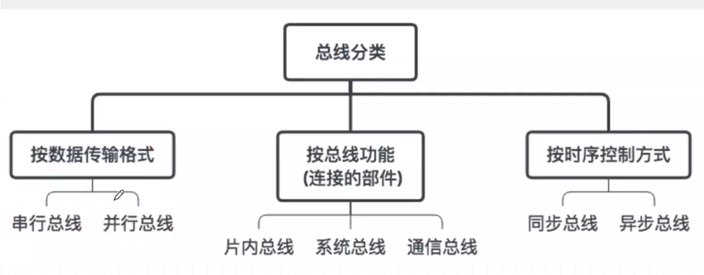
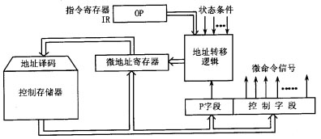
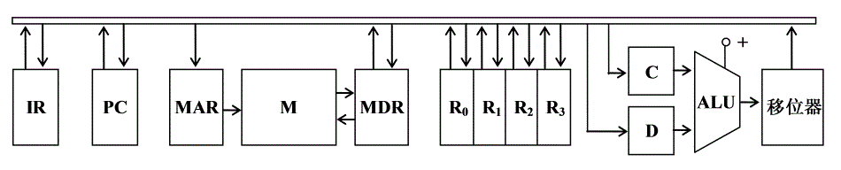
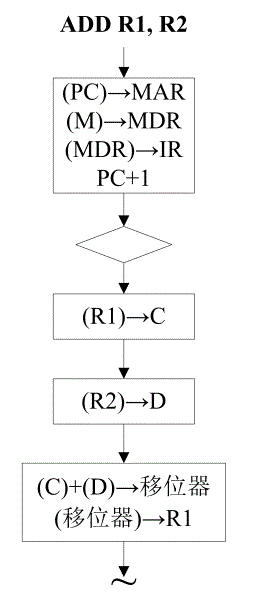
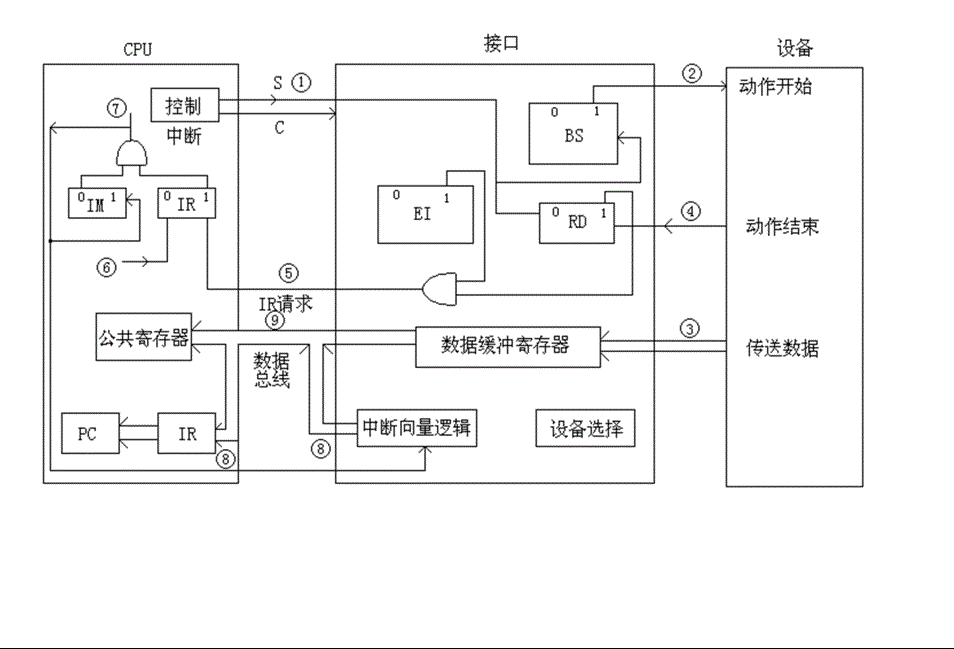
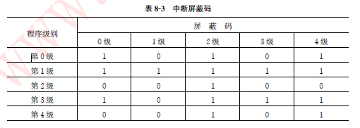
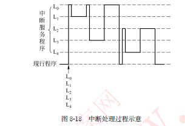

# 一、码/数

**奇偶校验**只能发现数据代码中<u>奇数位出错</u>

**浮点加减中的对阶**是：将较小的一个阶码调整到与较大的一个阶码相同

**浮点运算器**：浮点运算器可用阶码部件和尾数部件实现；阶码部件只进行阶码相加、相减和比较操作

四片74181ALU和一片74182CLA器件相配合，具有如下**进位传递**功能：组内先行进位，组间先行进位

**补码**：如果X为负数,由[X]补求[-X]补是将[X]补连同符号位一起各位变反,未位加1；如果是负数的原码，符号位就不取反

**float型数据**通常用IEEE 754单精度浮点数格式表示。若编译器将float型变量x分配在一个32位浮点寄存器FR1中,且x=-8.25,则FR1的内容是
	先将x转换成二进制为-1000.01=-1.00001×23,其次计算阶码E,根据IEEE754单精度浮点数格式,有E-127=3,故E=130,转换成二进制为1000 0010。最后,根据	IEEE754标准,最高位的“1”是被隐藏的。IEEE754单精度浮点数格式:数符(1位)+阶码(8位)十尾数(23位)。故,FR1内容为1;1000 0010;0000 10000 0000 	0000 0000 000。即,1100 0001 0000 0100 0000 0000 0000 0000=C104000H。本题易误选D,未考虑IEEE754标准隐含最高位1的情况,偏置值是128

**浮点数操作指标**：MIPS是每秒执行多少百万条指令,适用于衡量标量机的性能。CPI是平均每条指令的时钟周期数。IPC是CPI的倒数,即每个时钟周期执行的指令数。MFLOPS是每秒执行多少百万条浮点数运算,用来描述浮点数运算速度,适用于衡量向量机的性能。

 

# 二、存储系统

| **动态存储器**(DRAM)在读写的同时需要进行数据**刷新**,**静态存储器**(SRAM)则**不**存在刷新问题

| **交叉存储器**实质上是一种模块式存储器,它能并行地执行多个独立的读写操作

| **EPROM**是光擦除可编程的只读存储器的简称。

| 采用**虚拟存储器**的主要目的是扩大存储器空间，并能进行自动管理

| **随机存取方式**是指存储器的任何一个存储单元的内容都可以存取,而且存取时间与存储单元的物理位置无关。CDROM是只读的光盘存储器,采用串行存取方式而不是随机存取方式。

| **组相联映象和全相联映象**通常适合于：直接映象的地址转换速度快，但块的冲突概率较高。在大容量高速Cache系统中使用直接映象方式，即可以发挥Cache的高速度，又可以减少块的冲突概率。<u>组相联映象和全相联映象速度较低，通常适合于小容量Cache。</u>

# 三、输入输出系统

| 在常用磁盘中，**各磁道容量**一样

| 磁盘的平均存取时间是指平均寻道时间和平均等待时间之和。若**磁盘的转速提高一倍**则平均等待时间减半。磁盘平均等待时间=磁盘旋转一周所需时间/2=(1/转速)/2；故磁盘转速提高一倍，平均等待时间减半；但平均寻道时间与磁盘转速无关，这玩意是控制移到磁道的，俗话说竖着动的。

| 在微型机系统中,外围设备通过**适配器**与主板的系统总线相连接。

| 磁盘存储器的**主要指标**包括平均潜伏期，存储密度，存储容量，存取时间，数据传输率，噪音与温度等．

| **显示适配器**中的显示缓冲存储器用于存放将要显示在屏幕的信息。

| 写入硬盘时,若一个文件的长度**超过一个磁道的容量**,则继续写入同一柱面的相邻面的磁道中。(不是同面！)

| 一个**适配器必须有两个接口**: 一个是和系统总线的接口, CPU和适配器的数据交换是<u>并行</u>方式,二是和外设的接口,适配器和外设的数据交换是<u>串行或并行</u>方式

| **CRT的颜色数**为256色，则刷新存储器每个单元的字长应该为8位

| **中断屏蔽**是允许发生中断，只是暂时不响应。

| 为了便于实现多级中断,**保护现场**信息的最有效方法为采用堆栈

| 在中断发生时,由**硬件保护并更新程序计数器PC**,而不由软件完成,主要是为能进入中断处理程序并能正确返回原程序

| 中断向量就是中断服务程序的**入口地址**。

| 正在进行的低优先级中断服务，**能被高优先级中断请求所中断**

| **CPU接收**并响应一个中断后便自动**关闭中断允许**，其目的是在中断响应周期不允许其他同级的中断来打扰，以便能正确地转入相应的服务程序。

| **中断向量地址**是中断服务子程序入口地址指示器

| **中断向量**是中断服务子程序的入口地址

| 计算机与外部设备**数据交换的方式有三种**:程序控制数据传输方式、中断方式、DMA方式; 其中在程序控制数据传输方式中,又分为直接数据传输方式和程序查询数据传输方式。

| *特点*：**程序查询方式**，最简单的I／O方式，数据在CPU和外设之间的传送完全靠计算机程序控制，外设和CPU之间是串行工作，CPU效率低。

  **DMA方式**，完全由硬件执行I／O交换，其主要优点是数据传送速度很高，CPU根本不参加传送操作，而直接在内存和外设之间进行，传送速率仅受内存访问时间的限制。缺 点是需要更多的硬件。

  **中断方式**，外设主动提出数据传送要求的I／O方式，CPU在收到这个要求之前，则执行着本身的程序，突出的优点是CPU效率高。缺点是硬件结构相对复杂，服务开销时间较大。

| *特点*：**通道**是通过执行通道指令来实现输入/输出的,由通道负责对外围设备的统一管理,并组织外围设备与内存间的数据传输,大大提高了CPU的效率;：

  **DMA**是由DMA控制器在获得总线控制权后,直接在内存与外设之间实现数据传送的,传送速率只受到内存访问时间的限制,适用于高速外设与内存间进行大量的数据传输;

  **中断**是通过CPU在响应中断时,转入中断服务程序,执行输入/输出指令来完成输入/输出的,比较适合随机出现的服务。

| *详细*：**程序控制传送方式**：CPU 与外设之间的数据传送是在程序控制下完成的。
	⑴无条件传
	送方式：也称为同步传送方式，主要用于对简单外设进行操作，或者外设的定时是固定的或已知的场合。
	⑵条件传送：也称为查询式传送方式，在开始传送前，必须先查询外设已处 于准备传送数据的状态，才能进行传送。
  **中断方式**：CPU平时可以执行主程序，只有当输入设备将数据准备好了，或者输出端口的数据缓冲器已空时，才向CPU发中断请求。CPU响应中断后，暂停执行当前的   程序，转去执行管理外设的中断服务程序。在中断服务程序中，用输入或输出指令在CPU和外设之间进行一次数据交换。等输入或输出操作完成之后，CPU又回去执行原来的程序。
  **DMA方式**：也要利用系统的数据总线、地址总线和控制总线来传送数据。原先，这些总线是由CPU管理的，但当外设需要利用DMA 方式进行数据传送时，接口电路可以向CPU提出请求，要求CPU让出对总线的控制权，用DMA 控制器来取代CPU，临时接管总线，控制外设和存储器之间直接进行高速的数据传送。这种控制器能给出访问内存所需要的地址信息，并能自动修改地址指针，也能设定和修改传送的字节数，还能向存储器和外设发出相应的读/写控制信号。在DMA传送结束后，它能释放总线，把对总线的控制权又交还给CPU。

| **直接内存访问(DMA)**方式是一种完全由硬件执行I／O交换的工作方式。DMA控制器从CPU完全接管对总线的控制。数据交换不经过CPU，而直接在内存和I／O设备之间进行。 DMA控制器采用**以下三种方式**： ①停止CPU访问内存：当外设要求传送一批数据时，由DMA控制器发一个信号给CPU。DMA控制器获得总线控制权后，开始进行数据传送。一批数据传送完毕后，DMA控制器通知CPU可以使用内存，并把总线控制权交还给CPU。 ②**周期挪用**：当I／O设备没有DMA请求时，CPU按程序要求访问内存：一旦I／O设备有DMA请求，则I／O设备挪用一个或几个周期。 ③DMA与CPU交替访内：一个CPU周期可分为2个周期，一个专供DMA控制器访内，另一个专供CPU访内。不需要总线使用权的申请、建立和归还过程。)

| 在常见的微机系统中,**磁盘**常采用直接内存访问(DMA)与主存交换信息。因为磁盘很快，通道不行

| 采用DMA方式传送数据时,每传送一个数据就要用一个**存储周期**时间。

| 产生DMA请求的总线部件是**具有DMA接口的设备**

| 中断发生时，**PC保护和更新**得由硬件自动（中断隐指令，本质不是真正指令）完成且可以将其压入堆栈中或特定内存单元 （**并非CPU**）

| CPU响应DMA请求后，**CPU内部寄存器**的内容不会被破坏。

| 

| 

| 

| 

| 

# 三、总线

| **总线特性**包括总线的机械特性、电气特性、功能特性时间特性

| **波特率**是码元传输速率,每秒通过信道传输的码元数。(传的是信号)。**比特率**是信息位传输速率,每秒钟通过信道传输的有效信息量。(传的是信息)

| **总线主设备**:获得总线控制权的设备。**总线从设备**:被主设备访问的设备。

| **异步传输方式**主要用于控制两种速度有一定差别的设备的信息传送,一般用在快速CPU与慢速的外设之间进行串行通信的场合。（串行I/O总线）

| **单总线结构系统**是指：各大功能部件之间用一组总线连接。

| **串行传输**是指数据的传输在一条线路上按位进行。**并行传输**是每个数据位都需要单独一条传输线,所有的数据位同时进行传输。不同信号在同一条信号线上分时传输的方式称为**总线复用方式**。

| **同步定时**的优点是采用公共时钟,具有较高的传输频率。但由于同步总线必须按最慢的模块来设计公共时钟,当各功能模块存取时间相差很大时,会大大损失总线效率。
| **异步定时**的优点是总线周期长度可变,不把响应时间强加到功能模块上,因而允许快速和慢速的功能模块都能连接到同一总线上。但缺点是:总线复杂,成本较高。

| **HOST总线**不仅连接主存，还可以连接多个CPUB；**PCI总线**体系中有三种桥，它们都是PCI设备；**桥**的作用可使所有的存取都按CPU的需要出现在总线上

| **总线结构对计算机系统性能的影响**
	（1）最大存储容量
	单总线系统中，最大内存容量必须小于由计算机字长所决定的可能地址总线。
	双总线系统中，存储容量不会受到外围设备数量的影响
	（2）指令系统
	双总线系统，必须有专门的I/O指令系统 单总线系统，访问内存和I/O使用相同指令
	（3）吞吐量
	总线数量越多，吞吐能力越大

| 在总线上,**同一时刻只能有一个主设备**控制总线传输操作

| 数据在传送时，一般采用**同步传输方式或异步传输方式**。同步传输是指发送方和接收方的时钟是统一的，字符与字符间的传输是同步无间隔的。而异步传输方式不要求发送方和接收方的时钟完全一样，字符与字符间的传输是异步的。这两种传输方式现在都广泛应用于现代通信中，对于它们的选取与设备速度没有关系。

| 系统总线中**控制线的功能**是提供主存、I/O接口设备的控制信号和响应信号

| 在**单总线**的微型计算机中,外设可以和主存储器单元**统一编址**,因此可以不使用I/O指令.

| **一秒钟**内在通信网络上传输的**比特数**就是波特率

| “总线忙”信号由**获得总线控制权的设备**建立。 在总线控制机制中，准备使用总线的设备向总线控制器发出“总线请求”由总线控制器进行裁决。如果经裁决允许该设备使用总线，就由总线控制器向该设备发出一个“总线允许”信号。该设备接收到此信号后，发出一个“总线忙”信号用来通知其他设备总线已被占用。当该设备使用完总线时，将“总线忙”信号撤销，释放总线。因此“总线忙”信号是由获得总线控制权的设备建立的。

|   **总线分类**

| **串行总线**主要用于**连接主机与外围设备**

| 冯・诺依曼计算机工作方式的基本特点是**按地址访问并按顺序执行指令**

| **同步传输**之所以比异步传输具有较高的传输频率是因为同步传输**各部件存取时间较为接近**

# 四、指令系统

| 一个完善的**指令系统**应满足的要求为:<u>兼容性、有效性、规整性和完备性</u>

| **转移指令**执行过程中，将转移指令所指的子程序的起始地址装入PC(非任意地址)，因此转移指令执行结束后，程序计数器PC中存放的是转移的目标地址。

| 从一条指令的启动到下一条指令的启动的间隔时间称为**指令周期**

| ①基址寻址方式：基址寄存器中的内容**加上**指令中的形式地址； 

  ②变址寻址方式：变址寄存器中的内容**加上**指令中的形式地址； 

  ③基址加变址寻址方式：寄存器（一般为基址寄存器）的内容**加上**指令中的形式地址； 

  ④相对寻址方式：程序计数器的内容**加上**指令中的形式地址； 

  ⑤立即寻址方式：指令中给出的**就是操作数**，而不是地址； 

  ⑥直接寻址方式：指令中给出的就是操作数**在主存中的有效地址**； 

  ⑦间接寻址方式：指令中给出的是操作数**在寄存器中的地址**，寄存器中保存的内容才是操作数的地址； 

  ⑧寄存器寻址方式：指令中给出的是**寄存器的编号**，既不是操作数也不是操作数地址。 

| 为了缩短指令中某个地址段的位数，有效的方法是采取**寄存器寻址**

| 指令的寻址方式有顺序和跳跃两种方式，采用**跳跃寻址方式**，可以实现**程序的条件转移或无条件转移**

| 寄存器-寄存器（RR）型指令：从寄存器中取操作数，把操作结果放到另一寄存器中，不需要访问内存存储器，因此速度快；
  存储器—存储器（SS）型指令：执行此类指令，既要访问内存单元，又要访问寄存器。**时间最长**
  寄存器-存储器（RS）型指令：执行此类指令，既要访问内存单元，又要访问寄存器。

| 反映计算机基本功能的是：**指令系统**

| 指令系统中采用**不同寻址方式的目的**主要是：缩短指令长度,扩大寻址空间,提高编程灵活性

# 五、CPU

——**运算器**包含执行部件(ALU)、寄存器、控制电路等

  **运算器**的主要功能:<u>加、减、乘、除四则运算</u>,<u>与、或、非、异或等逻辑操作</u>,以及移位、比较和传送等操作

——**ALU**：一级行波（16 0） 二级行波(16 4) 三级行波(16 5)

——**串行进位加法器**的缺点是运算速度慢，优点是电路结构简单。**超前进位加法器**的优点是运算速度快，缺点是电路结构复杂

——**CPU**由哪几部分组成？它们各自的功能是什么？

​	CPU由三个方面组成：

​	①控制器：主要由程序计数器、指令寄存器、指令译码器、时序部件、操作控制部件和中断机构组成。控制器是微型计算机的指挥和控制中心。
​	②运算器：运算器也即累加器和算术/逻辑部件。CPU内部有一个ALU部件，即算术/逻辑部件。对数据的实际处理是在ALU中进行的，ALU以加法器为核心，加上输入/输	出选择逻辑，通过对输入的选择控制实现多种功能，通过输出控制逻辑可控制直接传输和移位。ALU的功能是执行算术运算和逻辑运算。由于大量的数据处理都是数值	计算和逻辑判断，所以计算机的性能在很大程度上依赖于ALU的功能。累加器也是一种专用寄存器，它用于存放供加法器使用的一个操作数或运算结果。
​	③寄存器：指令和数据在CPU内的“临时”存储部件称为寄存器，寄存器是可供编程使用的寄存器。它们包括：
​	A.数据寄存器；
​	B.地址寄存器；
​	C.计数器。

——CPU应该具有哪**四项基本功能**?

​	计算机对信息进行的处理(或计算)是通过程序的执行来实现的。CPU要控制整个程序的执行，它应具有以下基本功能：(1)**程序控制**。程序执行顺序称为程序控制。(2)	**操作控制**。(3)**时间控制**。对各种微操作实施时间上的控制称为时间控制。(4)**数据加工**。就是对数据进行算术运算和逻辑运算。除了上述4个基本功能之外，CPU还必	须能<u>控制程序的输入和运算结果的输出以及对总线的管理，甚至能处理机器运行过程中出现的异常情况和特殊请求，即应具有中断处理能力</u>。

——**CPU**主要由运算器和控制器组成

——**CPU**主要有以下寄存器:

​	(1)指令寄存器(IR):用来保存当前正在执行的一条指令。

​	(2)程序计数器(PC):用来确定下一条指令的地址。

​	(3)地址寄存器(AR):用来保存当前 CPU所访问的内存单元的地址。

​	(4)缓冲寄存器(DR):

​		(1)作为CPU和内存、外部设备之间信息传送的中转站。

​		(2)补偿CPU和内存、外围设备之间在操作速度上的差别。 

​		(3)在单累加器结构的运算器中,缓冲寄存器还可兼作为操作数寄存器。

​	(5)通用寄存器(AC):当运算器的算术逻辑单元(ALU)执行全部算术和逻辑运算时,为ALU提供一个工作区。

​	(6)状态条件寄存器:保存由算术指令和逻辑指令运行或测试的结果建立的各种条件码内容。除此之外,还保存中断和系统工作状态等信息,以便使CPU和系统能及时了	解机器运行状态和程序运行状态。

——**操作控制器**的功能是从主存取出指令，完成指令操作码译码，并产生有关的操作控制信号，以解释执行该指令

——**时序产生器**是产生**时序信号**，**微操作信号发生器**产生**控制信号**

——**指令周期**是CPU取出并执行一条指令所需的全部时间即完成一条指令的时间。
  **机器周期**是所有指令执行过程中的一个基准时间通常以存取周期作为机器周期(也就是计算机完成一个基本操作所花费的时间)。	
  **时钟周期**是机器主频的倒数也可称为节拍它是控制计算机操作的最小单位时间。

  存储器和I/O接口一般是挂接在系统总线上的，CPU对存储器和I/O接口的访问是通过总线实现的。
  通常把CPU通过总线对微处理器外部(存储器或I/O接口)进行一次访问所需时间称为一个**总线周期**。一个总线周期由几个时钟周期组成。 

——**硬连线方式**是用时序电路产生时间控制信号,用组合逻辑电路实现各种控制功能。

——采用**微程序**机器级,使CPU的硬件电路更为简单,加快了CPU的执行速度。

——在微程序控制方式中,一条机器指令用一段**微程序(若干条微指令)**解释执行。

——微指令格式由操作控制和顺序控制两部分构成。
  **操作控制部分**用来发出管理和指挥全机工作的控制信号。
  **顺序控制部分**用来决定产生下一个微指令的地址。

——**微程序控制的基本思想是**：把指令执行所需要的所有控制信号存放在控制存储器中，需要时从这个存储器中读取，即把**操作控制信号编成微指令**，**存放在控制存储器**中。一条机器指令的功能通常用许多条微指令组成的序列来实现，这个微指令序列称为微程序。**微指令在控制存储器中的存储位置称为微地址**。

——**微程序**存放在控制存储器中,是只读存储器，用户可改写的**控制存储器由(EPROM)组成**

——**微指令的周期**对应一个机器周期。

# 例题

**——假设**某系统总线在一个总线周期中并行传输 4 字节信息．一个总线周期占用 2 个时钟周期，总线时钟频率为 10MHZ ，则总线带宽是：

​	总线时钟频率为10MHz，一个总线周期占用2个时钟周期，故1s内共有5M个总线周期；每个周期并行传输4字节信息，故总线带宽为5M/s×4B=20MB/s。

​	总线带宽=(总线频率/总线周期包含的时钟周期数)×(数据量/总线周期)

**——在**下列设备中，属于图形输入设备的是 (C) 。 A．打印机 B．条形码阅读机 C．**扫描仪** D．显示器

**——已知**某机采纳微程序操纵方式,其操纵存储器容量为 512×48(位)。微程序可在整个控

制存储器中实现转移,可控制微程序转移的条件共4个,微指令采用水平型格式,后继微

指令地址采用断定方式。请问:

(1)微指令中的三个字段分别应为多少位?

(2)画出围绕这种微指令格式的微程序控制器逻辑框图。

(1)假设判别测试字段中每一位作为一个判别标志,那么由于有4个转移条件,故该字段为4位;

又因为控存容量为512单元,所以下地址字段为9位,。微命令字段则是:(48-4-9)= 35位。

(2)对应上述微指令格式的微程序操纵器逻辑框图如以下图所示。其中**微地址寄放器**对应下地址字,**P字段**即为判别测试字段,**控制字段**即为微命令字段,后两部分组成微指令寄存器。地址转移逻辑的输入是指令寄放器的OP码、各类状态条件和判别测试字段所给的判别标志(某一位为1),其输出用于控制修改微地址寄存器的适当位数,从而实现微程序的分支转移 (此例微指令的后继地址采用断定方式)。

**——某计**算机有如下部件,ALU,移位器,主存M,主存数据寄存器 MDR ,

主存地址寄存器MAR ,指令寄存器IR,通用寄存器R0 R3,暂存器C和D<

(1)请将各逻辑部件组成一个数据通路,并标明数据流动方向。

(2)画出“ADD R1 , R2”指令的指令周期流程图。

(1)设该系统为单总线结构,暂存器C和D用于ALU的输入端数据暂存,移位
器作为ALU输出端的缓冲器,可对 ALU的运算结果进行附加操作,则数据通
路可设计如下:

(2)根据上面的数据通路，可画出"ADD R1,R2"(设R1为目的寄存器)的指令周期流程图如下:

**——画出**程序中断方式基本接口示意图,简要阐明IM, IR ,EI , RD, BS五个触发器的作用。

五个触发器地作用:

中断屏蔽触发器(Im):CPU与否受理中断或批准中断的标志。Im标志为“0”时,CPU 可受理外界中断祈求。

中断祈求触发器(IR):暂存中断祈求线上由设备发出的中断祈求信号,IR标志为“1”时,表达设备发出了中断祈求。

容许中断触发器(EI):用程序指令来置位,控制与否容许某设备发出中断祈求。IE为“1”时,某设备可以向CPU发出祈求。

准备就绪的标志(RD):一旦设备做好一次数据的接受或发送,便发出一种设备动作完毕信号,使RS标志为“1”。

工作触发器(BS):设备“忙”点的标志。BS=1,表达启动设备工作。

**——设**某机有5 级中断:L0 、L1 、L2 、L3 、L4 ,其中断响应优先次序为:L0 最高、L1 次
  之、⋯⋯ 、L4 最低.现在要求将中断处理次序改为L1 → L3 → L0 → L4 → L2 ,试问:
 (1) 各级中断服务程序中的各中断屏蔽码应如何设置(设每级对应一位,当该位为“0” ,表示中断允许;当该位为“1” ,表示中断屏蔽) ?
 (2) 若这5级同时都发出中断请求,试画出进入各级中断处理过程示意图。

(1) 各级中断服务程序中的各中断屏蔽码设置如表8—3 所示

 

(3)5 级中断同时发出中断请求,各级中断处理过程示意如图8—18 所示。

 

7 16 22 2 6

