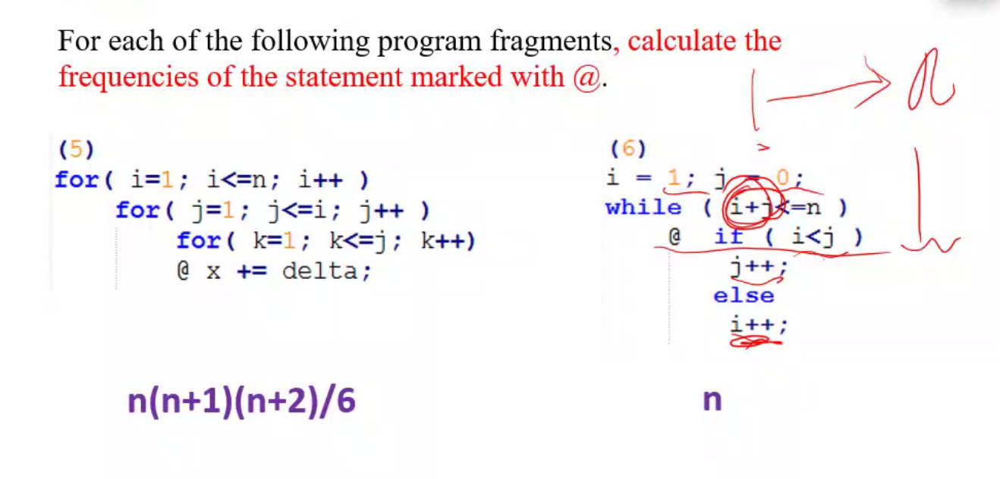
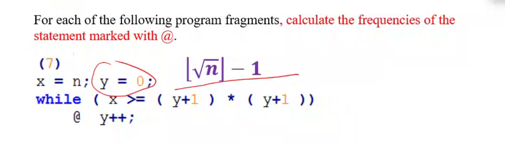
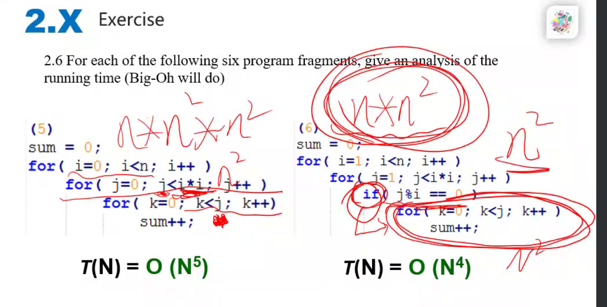
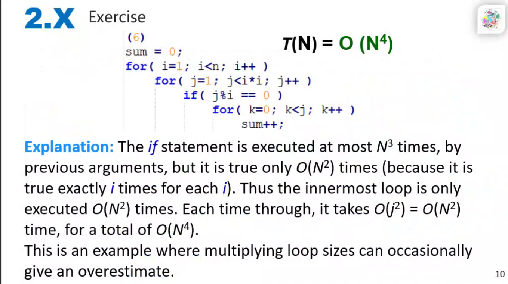
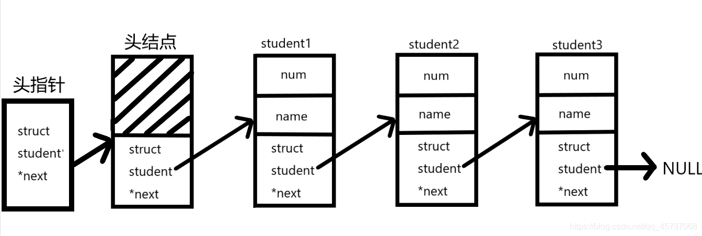
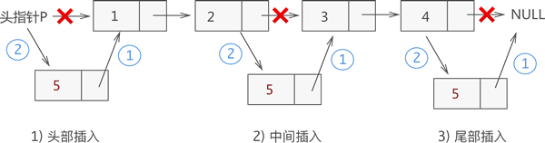

[TOC]


## 1.交换两个变量的值

```c
//1、常规方法
void change(char* p1, char* p2)
{
	int tmp = 0;
	tmp = *p1;
	*p1 = *p2;
	*p2 = tmp;
}


//利用加法
void change(char* p1, char* p2)
{
    //牛的
	*p1 = *p1 + *p2;
	*p2 = *p1 - *p2;
	*p1 = *p1 - *p2;
}


//利用异或(^)
void change(char* p1, char* p2)
{
    
	*p1 = *p1 ^ *p2;
	*p2 = *p1 ^ *p2;
	*p1 = *p1 ^ *p2;
}

//第四个，牛逼，要底层汇编可能才能彻底看懂吧
//跟具体编译器类型有关，不一定有效。例如在VS的Windows编译器、GDB都不行。
b = (a + b) - (a = b);
```


## 1、等待解答

①T(N) = O(f(N))及几个衡量时间复杂度


## 2、时间复杂度

当两个核心代码段都有各自的复杂度时，计算总的复杂度应该遵循以下原则

(1)如果是并行的两段代码，则取**复杂度最大**的代码段为总的复杂度

(2)如果是有for循环等循环、嵌套操作时，即采取**复杂度相乘**作为总的复杂	度	

 








​	


## 3、结构体

### 3.1、结构体指针作为函数参数

结构体变量名代表的是整个集合本身，作为函数参数时**传递的整个集合**，也就是所有成员，而不是像数组一样被编译器转换成一个指针。

如果结构体成员较多，尤其是成员为数组时，传送的时间和空间开销会很大，影响程序的运行效率。

所以最好的办法就是使用结构体指针，这时由实参传向形参的只是一个地址，非常快速。


### 3.2、结构体内存对齐


### 3.3、typedef的使用

typedef可以对数组、指针、结构体、函数起别名

```c
//关于typedef我的理解就是从新名字解码(解封)，得到左边的数据类型，来判断右边新名字的含义
//当然自定义的话还是得根据需求好好想一想

//对数组起别名
//解析一下，右边ARRAY[20]等价于左边的char，就说明ARRAY这个新的数据类型 代表了一个长度为20的字符数组
//ARRAY a 等价于 char a[20];
typedef char ARRAY[20];

//给结构体起别名
//Struct Student stu 等价于 STU stu;
typedef struct Student{
  char name[20];  
}STU;

//给指针起别名
//从右边解码，由于括号，先*PTR_TO_ARR后[4]，得到左边的int
//于是看出PTR_TO_ARR这个数据类型，封装了一个指向int [4]数组的指针
//PTR_TO_ARR ptr 等价于 int (*a)[4];  
typedef int (*PTR_TO_ARR)[4];

//给函数起别名
//等价于 我们知道，单独的int (*p)(int,int)，p代表定义了一个函数指针(其返回值为int，两个int形参数)，
typedef int (*PTR_TO_FUNC)(int, int);
PTR_TO_FUNC pfunc;
```


## 4、内存结构

| 内存区域 | 内容                                                         |
| -------- | ------------------------------------------------------------ |
| 栈区     | 存放函数的参数值、局部变量等，由编译器自动分配和释放，通常在函数执行完后就释放了，其操作方式类似于数据结构中的栈 |
| 堆区     | 就是通过new、malloc、realloc分配的内存块，编译器不会负责它们的释放工作，需要用程序区释放。分配方式类似于数据结构中的链表。“内存泄漏”通常说的就是堆区。 |
| 静态区   | 全局变量和静态变量的存储是放在一块的，初始化的全局变量和静态变量在一块区域，未初始化的全局变量和未初始化的静态变量在相邻的另一块区域。程序结束后，由系统释放。 |
| 常量区   | 常量存储在这里，不允许修改。                                 |
| 代码区   | 顾名思义，存放代码                                           |

> 1.void *malloc(unsigned int size)：作用是在动态存储区中分配一个长度为size的连续空间，unsigned代表没有符号位的整形数据(非负整数)，返回所分配内存区域第一个字节的地址.分配失败返回NULL指针
>
> 2.void *calloc(unsigned n,unsigned size)：作用是在动态内存空间中分配n个长度为size的连续空间，分配失败返回NULL指针
>
> 3.void free(void *p)：释放指针变量p所指向的动态空间
>
> 4.void *realloc(void *p,unsigned int size):对已经通过malloc函数calloc函数获得了动态空间，想改变其大小，用此函数重新分配

> 注意：**void\*类型的指针表示指向空类型或者不指向确定的类型的数据**
>
> 以上函数得使用`#include<stdlib.h>`


## 5、链表

> **链表是一种动态的进行存储分配的一种结构**

这种能够把数据之间进行连接的[数据结构](https://so.csdn.net/so/search?q=数据结构&spm=1001.2101.3001.7020)称为链表，链表中的每一个元素称为`结点`，每个结点中存放指针的空间称为`指针域`，存放其他信息的空间称为`数据域`。

一般的链表有`头指针`，`头结点`，尾结点指向`NULL`，如下：



> 头结点：**头结点不是链表必须的部分，有了头结点，在对`第一个结点前插入`或者`删除第一个结点`就`和其余结点统一`了**
> 头指针：**头指针是指链表指向第一个结点的指针，若链表有头结点，则是指向头结点的指针。头指针是链表的必要元素**


### 5.1、基本的连接两个结点

```c
#include <stdio.h>

struct Date {
	int year;
	int month;
	int day;
};
typedef struct Student {
	int number;//学号
	char name[20];//名字
	struct Date date;
	struct Student* next;
}S, *PTR_S;

int main() {
	PTR_S ptr_head, ptr;
	S stu1 = {1, "aaa"};
	S stu2 = {2, "bbb"};
	S stu0;
	stu0.next = &stu1;
	stu1.next = &stu2;
	stu2.next = NULL;
	ptr_head = &stu0;
	ptr = ptr_head->next;//指向第一个不为空的结点，除去头结点

	while (ptr != NULL) {
		printf("%d\n", ptr->number);
		printf("%s\n", ptr->name);
		ptr = ptr->next;
	}
}
```


### 5.2静态链表，动态链表

所有结点都是在程序中定义的，不是我们自己`申请的内存(由系统自动分配内存空间)`，`用完后系统自动释放`，这种链表称为静态链表。

所谓动态链表就是我们`手动开辟内存存放结点`，需要`回收时我们手动释放的链表`


### 5.3、创建一串链表

```c
/*
	创建一个链表
	@param length 链表长度，此处长度包含头结点
*/
PTR_S createLink(int length) {
	PTR_S p = (PTR_S)malloc(1 * sizeof(S));//创建一个头结点
	PTR_S move = p;//搞一个头指针
	PTR_S temp = NULL;

	for (int i = 1; i < length - 1; i++) {
		temp = (PTR_S)malloc(1 * sizeof(S));
		temp->number = i;
		temp->name[0] = 'A';
		
		//连接链表
		move->next = temp;
		temp->next = NULL;
		
		//让指针指向最末端，方便添加链表
		move = move->next;
	}

	return p;//返回整条链表的头结点
}
```


### 5.4、插入链表

虽然新元素的插入位置不固定，但是链表插入元素的思想是固定的，只需做以下两步操作，即可将新元素插入到指定的位置：

将新结点的 next 指针指向插入位置后的结点；
将插入位置前结点的 next 指针指向插入结点；
例如，我们在链表 {1,2,3,4} 的基础上分别实现在头部、中间部位、尾部插入新元素 5，其实现过程如图 :

 


从图中可以看出，虽然新元素的插入位置不同，但实现插入操作的方法是一致的，都是先执行步骤 1 ，再执行步骤 2。

> 注意：链表插入元素的操作一般是`先步骤 1，再步骤 2`；反之，若不嫌麻烦先执行步骤 2，除非再添加一个指针，作为插入位置后续链表的头指针，否则会导致插入位置后的这部分链表丢失，无法再实现步骤 1。
>

```c
/*
	插入新结点
	@param p 为原链表点的头结点
	@param num 为新的链表结点中的number
	@param  add为添加的位置，例，add为4时，则添加在原链表的第三个结点(包含头结点)之后
*/
PTR_S insertLink(PTR_S p, int num, int add) {
	PTR_S temp = p;//临时结点

	//找点插入的位置
	for (int i = 1; i <= add - 1 - 1; i++) {
		temp = temp->next;
		if (NULL == temp) {
			printf("插入失败");
			return;
		}
	}

	//创建新结点
	PTR_S newNode = (PTR_S)malloc(1 * sizeof(S));
	newNode->number = num;
	newNode->name[0] = 'B';

	//进行插入操作
	newNode->next = temp->next;
	temp->next = newNode;
	return p;//返回头结点
}
```


### 5.5、删除链表

```c
/*
	删除链表的元素
	@param p 操作的链表
	@param elem 删除的结点的位置，包含头结点
*/
PTR_S delNode(PTR_S p, int elem) {
	PTR_S temp = p;

	//找到删除的结点的上一个位置
	for (int i = 1; i <= elem - 1 - 1; i++) {
		temp = temp->next;
		if (NULL == temp) {
			printf("插入失败");
			return;
		}
	}

	//执行删除操作
	PTR_S del = temp->next;//保存要删除位置，以防出错找不到了
	//修改指针域，完成删除
	temp->next = temp->next->next;
	free(del);//手动释放结点，防止内存泄露
	return p;
}
```


### 5.6、查找链表

```c
/*
	查找链表的某个元素
	@param p 链表
	@param elem 指定删除的元素
*/
int queryNode(PTR_S p, int elem) {
	PTR_S temp = p;
	while (NULL != temp->next) {
		temp = temp->next;//先提前指向下一个结点，这里就是为了跳过头结点才写前面
		if (temp->number == elem) {
			printf("找到了\n");
			return 666;
		}
	}
	printf("找到了个der\n");
	return -1;
}
```


### 5.7、头/尾插

#### 5.7.1、头插法

```c
PTR_S headInsert(PTR_S p) {
	PTR_S temp = p;
	int count = 0;
	printf("请输入你要插入的元素的个数：");
	scanf("%d", &count);
	getchar();

	for (int i = 0; i < count; i++) {
		PTR_S  s = (PTR_S)malloc(1 * sizeof(S));
		s->number = i + 10;
		s->name[0] = 'B';
		s->next = temp->next;//新的结点下一个指向第二个结点
		temp->next = s;//头结点指向新的结点
	}

	return p;
}
```


#### 5.7.2、尾插法

```c
PTR_S tailInsert(PTR_S p) {
	PTR_S temp = p;
	int count = 0;
	printf("请输入你要插入的元素的个数：");
	scanf("%d", &count);
	getchar();

	//while到最后的结点去
	while (NULL != temp->next) {
		temp = temp->next;
	}

	for (int i = 0; i < count; i++) {
		PTR_S  s = (PTR_S)malloc(1 * sizeof(S));
		s->number = i + 10;
		s->name[0] = 'C';
		temp->next = s;//最后的结点指向新的结点
		s->next = NULL;//新的结点指向NULL
		temp = s;//让temp指向现在的最后的结点
	}

	return p;
}
```


### 5.8、总结

```c
#include <stdio.h>
#include <stdlib.h>

struct Date {
	int year;
	int month;
	int day;
};
typedef struct Student {
	int number;//学号
	char name[20];//名字
	struct Student* next;
}S, *PTR_S;

PTR_S createLink(int length);
PTR_S insertLink(PTR_S p, int num, int add);
PTR_S delNode(PTR_S p, int elem);
int queryNode(PTR_S p, int elem);
PTR_S headInsert(PTR_S p);
PTR_S tailInsert(PTR_S p);


int main() {
	PTR_S ptr_head, ptr;
	
	ptr_head = createLink(5);
	ptr_head = insertLink(ptr_head, 4, 3);
	ptr_head = delNode(ptr_head, 3);
	queryNode(ptr_head, 1);
	ptr_head = headInsert(ptr_head);
	ptr_head = tailInsert(ptr_head);

	PTR_S p = ptr_head->next;//跳过头结点打印
	while (p != NULL) {
		printf("%d ", p->number);
		printf("%c\n", p->name[0]);
		p = p->next;
	}
}

/*
	创建一个链表
	@param length 链表长度，此处长度包含头结点
*/
PTR_S createLink(int length) {
	PTR_S p = (PTR_S)malloc(1 * sizeof(S));//创建一个头结点
	PTR_S move = p;//搞一个头指针
	PTR_S temp = NULL;

	for (int i = 1; i < length - 1; i++) {
		temp = (PTR_S)malloc(1 * sizeof(S));
		temp->number = i;
		temp->name[0] = 'A';
		
		//连接链表
		move->next = temp;
		temp->next = NULL;
		
		//让指针指向最末端，方便添加链表
		move = move->next;
	}

	return p;//返回整条链表的头结点
}

/*
	插入新结点
	@param p 为原链表点的头结点
	@param num 为新的链表结点中的number
	@param  add为添加的位置，例，add为4时，则添加在原链表的第三个结点(包含头结点)之后
*/
PTR_S insertLink(PTR_S p, int num, int add) {
	PTR_S temp = p;//临时结点

	//找点插入的位置
	for (int i = 1; i <= add - 1 - 1; i++) {
		temp = temp->next;
		if (NULL == temp) {
			printf("插入失败");
			return;
		}
	}

	//创建新结点
	PTR_S newNode = (PTR_S)malloc(1 * sizeof(S));
	newNode->number = num;
	newNode->name[0] = 'B';

	//进行插入操作
	newNode->next = temp->next;
	temp->next = newNode;
	return p;//返回头结点
}

/*
	删除链表的元素
	@param p 操作的链表
	@param elem 删除的结点的位置，包含头结点
*/
PTR_S delNode(PTR_S p, int elem) {
	PTR_S temp = p;

	//找到删除的结点的上一个位置
	for (int i = 1; i <= elem - 1 - 1; i++) {
		temp = temp->next;
		if (NULL == temp) {
			printf("插入失败");
			return;
		}
	}

	//执行删除操作
	PTR_S del = temp->next;//保存要删除位置，以防出错找不到了
	//修改指针域，完成删除
	temp->next = temp->next->next;
	free(del);//手动释放结点，防止内存泄露
	return p;
}

/*
	查找链表的某个元素
	@param p 链表
	@param elem 指定删除的元素
*/
int queryNode(PTR_S p, int elem) {
	PTR_S temp = p;
	while (NULL != temp->next) {
		temp = temp->next;//先提前指向下一个结点，这里就是为了跳过头结点才写前面
		if (temp->number == elem) {
			printf("找到了\n");
			return 666;
		}
	}
	printf("找到了个der\n");
	return -1;
}


PTR_S headInsert(PTR_S p) {
	PTR_S temp = p;
	int count = 0;
	printf("请输入你要插入的元素的个数：");
	scanf("%d", &count);
	getchar();

	for (int i = 0; i < count; i++) {
		PTR_S  s = (PTR_S)malloc(1 * sizeof(S));
		s->number = i + 10;
		s->name[0] = 'B';
		s->next = temp->next;//新的结点下一个指向第二个结点
		temp->next = s;//头结点指向新的结点
	}

	return p;
}

PTR_S tailInsert(PTR_S p) {
	PTR_S temp = p;
	int count = 0;
	printf("请输入你要插入的元素的个数：");
	scanf("%d", &count);
	getchar();

	//while到最后的结点去
	while (NULL != temp->next) {
		temp = temp->next;
	}

	for (int i = 0; i < count; i++) {
		PTR_S  s = (PTR_S)malloc(1 * sizeof(S));
		s->number = i + 10;
		s->name[0] = 'C';
		temp->next = s;//最后的结点指向新的结点
		s->next = NULL;//新的结点指向NULL
		temp = s;//让temp指向现在的最后的结点
	}

	return p;
}
```


