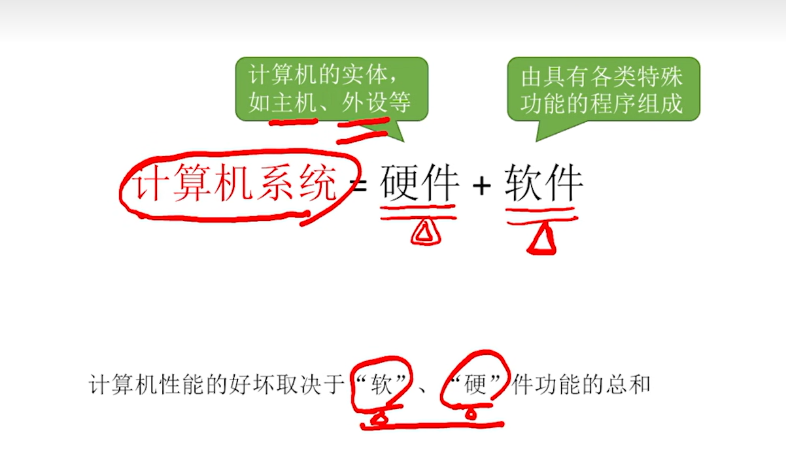
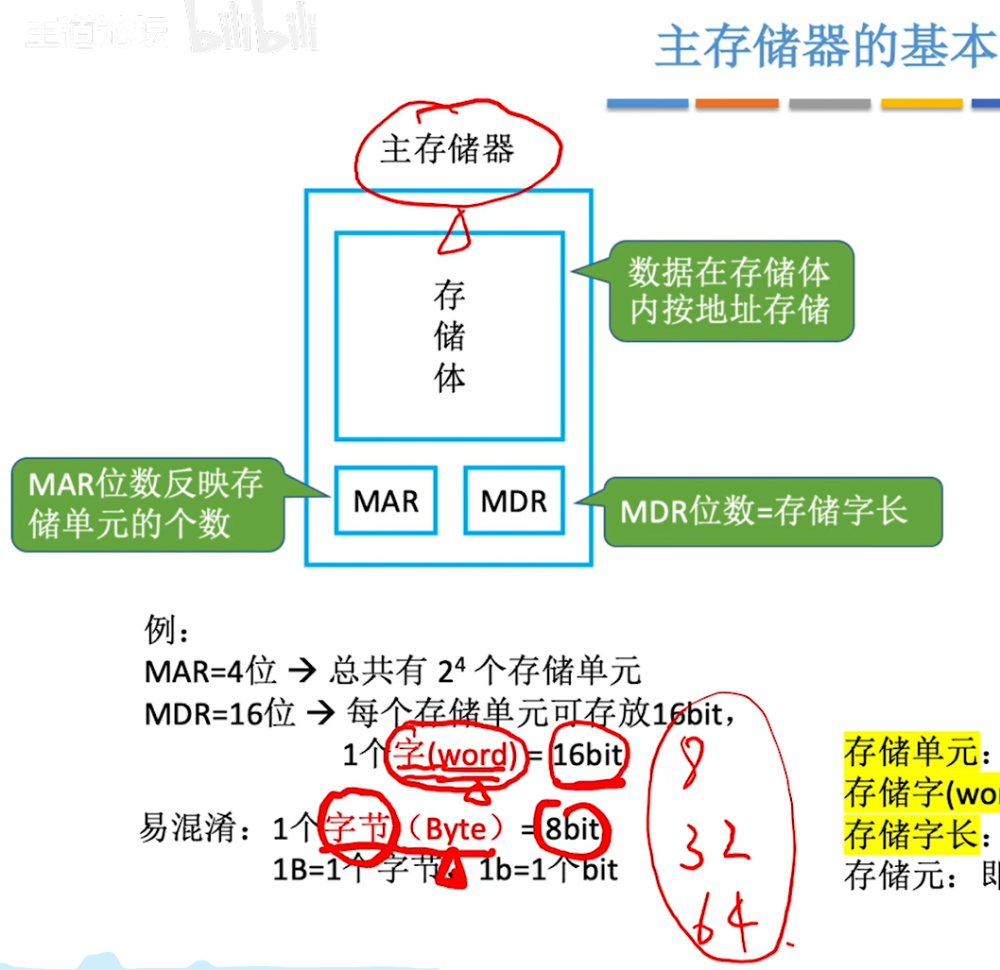

[TOC]

# 一、计算机概述

## 1.1、计算机基础结构

 

 

## 1.2、硬件发展

## 1.3、早期冯诺依曼机的结构

> 强调一下早期冯诺依曼机的特点
>
> 1、存储器以同等地位存储`指令和数据`，可以实现按地址寻访
>
> 2、指令和存储都是以二进制表示的
>
> 3、`指令`由`操作码`和`地址码`组成
>
> 4、操作码：`进行加减` 地址码：`程序存储的位置`
>
> 5、存储程序：早期是人们利用接线一条一条的输入指令，存储是指提前把`所有指令和数据一次性放到计算机存储`，然后就可以让计算机一次性执行所有指令了
>
> 6、`以运算器为中心，冯诺依曼机的特点，输入设备的数据先输入到运算器，再到存储器存储`

*<u>下面帮助理解</u>*

## 1.4、现代计算机

> `贼有意思`
>
> 1、先讲一下`主存储器`和`运算器`和`控制器`的关系
>
> `控制器`通过`控制线`告诉`运算器`接下来应该执行`加减乘除`哪个操作
>
> `控制器`也会控制`主存储器的读写`
>
> `控制器`控制`输入输出设备`的`启动停止`
>
> 2、`主存储器`和`CPU`之间会进行`数据的交换`
> 第一种就是需要`参与运算的数据`，比如`abc变量`
> 另外一种就是`指令`，把指令放到`控制器`当中，由`控制器`来`解析`指令的含义，依次发出`相应的控制信号`
>
> 3、`输入输出设备(IO设备)`会直接和`主存储器`之间进行`数据的交换`
>
> 4、`主存储器`和`CPU`统称为`主机`，当然这只是计组里面的定义，*`生活中还有些啥风扇、硬盘`*
>
> 5、分去除主存和辅存，主存就是`主存储器(内存)，辅存就是辅助存储器`，硬盘啥的，注意是`IO设备`
>
> 注意：手机的运行内存8GB就是主存，辅存就是128GB之类，当程序运行就会把`辅存存储的数据调用到运行内存里面`

 

# 二、走进科学

## 1、认识各个硬件

### 1.1、主存储器

> 讲一下具体过程
>
> 读数据：CPU将想要读的数据`放到MAR(存储地址寄存器)`，存储体`根据MAR去找到相应的数据`，`放到MDR去`，然后CPU再拿走这个MDR的数据
>
> 写数据：CPU指明写入的数据的`地址到MAR去`，然后把`数据放到MDR去`，存储体再根据地址把这个数据存储了

 

> 补充个几个点：
>
> 1、`存储字(word)`是指 `存储单元中二进制代码的组合`，类似于0000 0001 就是一个存储字，一个word
>
> 2、`存储字长`就是 存储单元二进制代码的`位数`
>
> 3、`存储元`负责 存储二进制，`一个存储元 存储一个bit`，这个电子元件 利用了`电容的基本原理(触发器?)`，`结合电路 构成了存储单元`
>
> 4、`MAR的位数`反映了 `存储单元的位数`，如果它4位，那么存储单元从0000开始，理论上能到1111，构成 一个一个地址连续的存储单元，`个数为2^4个`
>
> 5、`MDR的位数` 等于 `存储字长`，就是`存储字(word)的长度`，位数为16位，那word 就可以16位长
>
> 
>
> ps:一个很有意思的事情，运营商总是吹逼百兆宽带100Mb啥的，但是其实这个100Mb具体是100M(百兆) b(位) ps(每秒)，也就是说真正的速度是(100Mb)100兆个bit位，而不是100MB(100兆个字节)，因为我们知道，网速再慢也是100B啥的，这个B是字节(byte)，而不是位(bit)，而1个byte = 8个bit，因此真正的网速应该是100/8 MB，也就是常见的10MB/s左右，只能说求放过

 

 对上面的补充

### 1.2、运算器

 

### 1.3、控制器

### 1.4、计算机的工作进程

#### 1.4.1、取值

过程有点小复杂

注意第一步，是因为`PC给的地址为0`，MAR才去找到主存地址为0的指令，所以`放到MDR的也是那条地址为0的指令`

第六步，IR发送指令的`地址码到MAR`，MAR分析0101得到的是5，也就是`主存地址中的5`，然后就回去把`主存地址的5的指令放到MDR去`

#### 1.4.2、相乘

#### 1.4.3、加法

#### 1.4.4、存值

#### 1.4.5、停机

#### 1.4.6、总结

CPU区分指令和数据的依据：指令周期的不同阶段

*解析一下这句话：*操作数据之前，你总要取出指令才知道怎么操作啊
所以第一阶段，取出指令，第二阶段，分析指令，第三阶段，就是执行指令(操作数据)了
所以毫无疑问，`经过了分析指令(第二阶段)以后，从MDR取出来的就是“数据”了`

### 1.5、硬件总结

注意一点

现在的MAR和MDR存储在CPU中间

