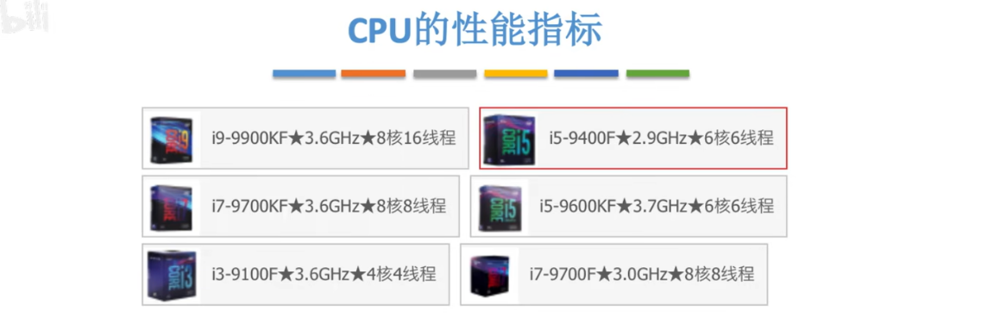
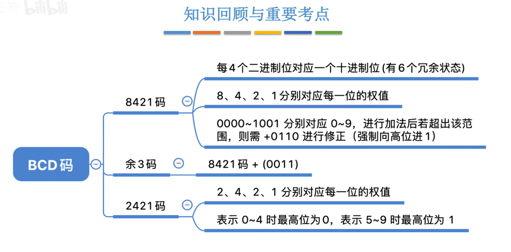
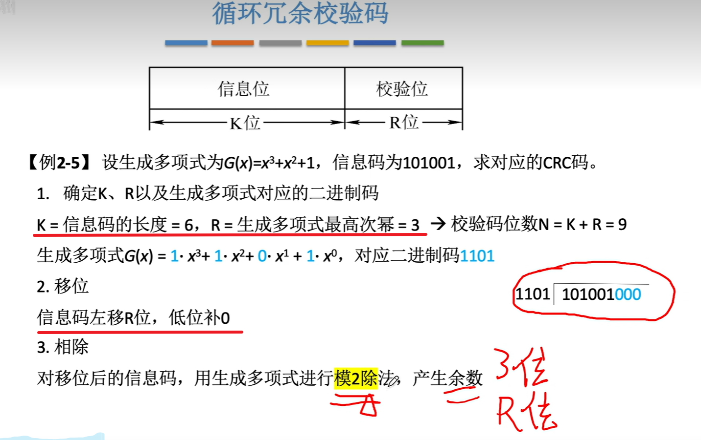
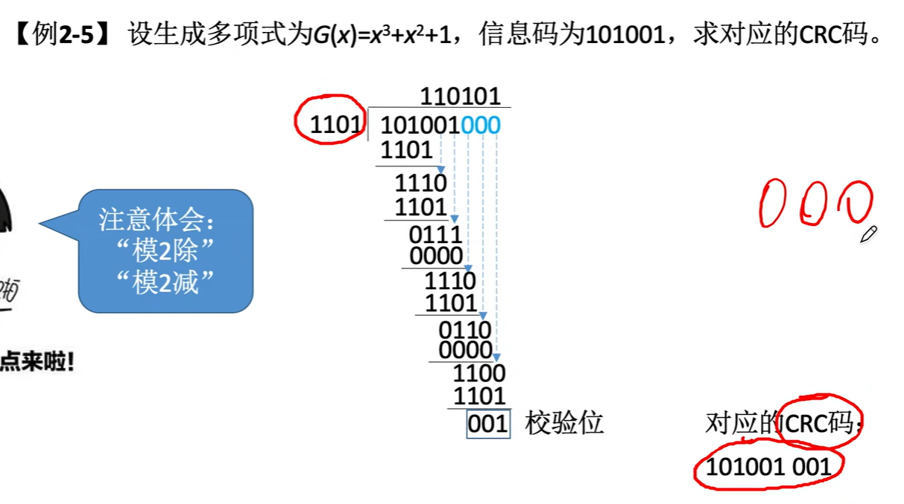
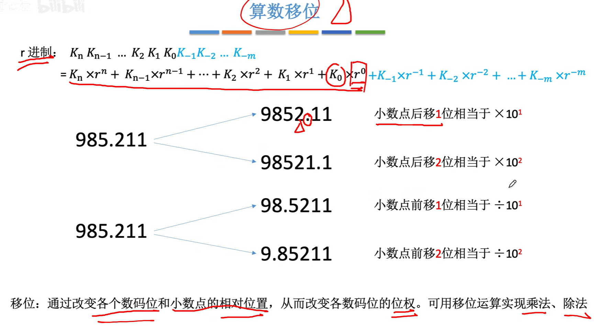
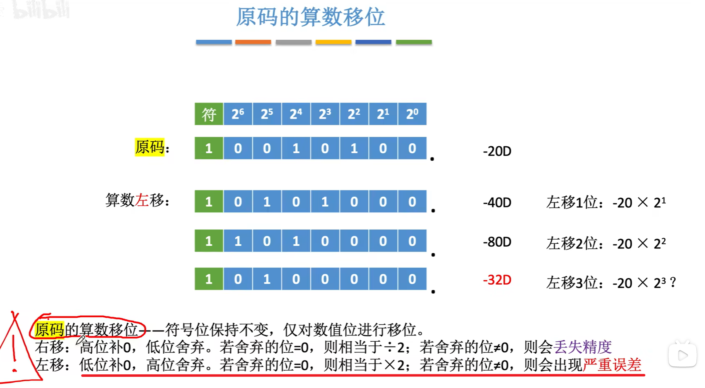

[TOC]

# 一、计算机概述

## 1.1、计算机基础结构

 

 

## 1.2、硬件发展

## 1.3、早期冯诺依曼机的结构

> 强调一下早期冯诺依曼机的特点
>
> 1、存储器以同等地位存储`指令和数据`，可以实现按地址寻访
>
> 2、指令和存储都是以二进制表示的
>
> 3、`指令`由`操作码`和`地址码`组成
>
> 4、操作码：`进行加减` 地址码：`程序存储的位置`
>
> 5、存储程序：早期是人们利用接线一条一条的输入指令，存储是指提前把`所有指令和数据一次性放到计算机存储`，然后就可以让计算机一次性执行所有指令了
>
> 6、`以运算器为中心，冯诺依曼机的特点，输入设备的数据先输入到运算器，再到存储器存储`

*<u>下面帮助理解</u>*

## 1.4、现代计算机

> `贼有意思`
>
> 1、先讲一下`主存储器`和`运算器`和`控制器`的关系
>
> `控制器`通过`控制线`告诉`运算器`接下来应该执行`加减乘除`哪个操作
>
> `控制器`也会控制`主存储器的读写`
>
> `控制器`控制`输入输出设备`的`启动停止`
>
> 2、`主存储器`和`CPU`之间会进行`数据的交换`
> 第一种就是需要`参与运算的数据`，比如`abc变量`
> 另外一种就是`指令`，把指令放到`控制器`当中，由`控制器`来`解析`指令的含义，依次发出`相应的控制信号`
>
> 3、`输入输出设备(IO设备)`会直接和`主存储器`之间进行`数据的交换`
>
> 4、`主存储器`和`CPU`统称为`主机`，当然这只是计组里面的定义，*`生活中还有些啥风扇、硬盘`*
>
> 5、分去除主存和辅存，主存就是`主存储器(内存)，辅存就是辅助存储器`，硬盘啥的，注意是`IO设备`
>
> 注意：手机的运行内存8GB就是主存，辅存就是128GB之类，当程序运行就会把`辅存存储的数据调用到运行内存里面`

 

# 二、走进科学

## 1、认识各个硬件

### 1.1、主存储器

> 讲一下具体过程
>
> 读数据：CPU将想要读的数据`放到MAR(存储地址寄存器)`，存储体`根据MAR去找到相应的数据`，`放到MDR去`，然后CPU再拿走这个MDR的数据
>
> 写数据：CPU指明写入的数据的`地址到MAR去`，然后把`数据放到MDR去`，存储体再根据地址把这个数据存储了

 

> 补充个几个点：
>
> 1、`存储字(word)`是指 `存储单元中二进制代码的组合`，类似于0000 0001 就是一个存储字，一个word
>
> 2、`存储字长`就是 存储单元二进制代码的`位数`
>
> 3、`存储元`负责 存储二进制，`一个存储元 存储一个bit`，这个电子元件 利用了`电容的基本原理(触发器?)`，`结合电路 构成了存储单元`
>
> 4、`MAR的位数`反映了 `存储单元的位数`，如果它4位，那么存储单元从0000开始，理论上能到1111，构成 一个一个地址连续的存储单元，`个数为2^4个`
>
> 5、`MDR的位数` 等于 `存储字长`，就是`存储字(word)的长度`，位数为16位，那word 就可以16位长
>
> 
>
> ps:一个很有意思的事情，运营商总是吹逼百兆宽带100Mb啥的，但是其实这个100Mb具体是100M(百兆) b(位) ps(每秒)，也就是说真正的速度是(100Mb)100兆个bit位，而不是100MB(100兆个字节)，因为我们知道，网速再慢也是100B啥的，这个B是字节(byte)，而不是位(bit)，而1个byte = 8个bit，因此真正的网速应该是100/8 MB，也就是常见的10MB/s左右，只能说求放过

 

 对上面的补充

### 1.2、运算器

 

### 1.3、控制器

### 1.4、计算机的工作进程

#### 1.4.1、取值

过程有点小复杂

注意第一步，是因为`PC给的地址为0`，MAR才去找到主存地址为0的指令，所以`放到MDR的也是那条地址为0的指令`

第六步，IR发送指令的`地址码到MAR`，MAR分析0101得到的是5，也就是`主存地址中的5`，然后就回去把`主存地址的5的指令放到MDR去`

#### 1.4.2、相乘

#### 1.4.3、加法

#### 1.4.4、存值

#### 1.4.5、停机

#### 1.4.6、总结

CPU区分指令和数据的依据：指令周期的不同阶段

*解析一下这句话：*操作数据之前，你总要取出指令才知道怎么操作啊
所以第一阶段，取出指令，第二阶段，分析指令，第三阶段，就是执行指令(操作数据)了
所以毫无疑问，`经过了分析指令(第二阶段)以后，从MDR取出来的就是“数据”了`

### 1.5、硬件总结

注意一点

现在的MAR和MDR存储在CPU中间

### 1.6、计算机系统的层次结构

#### 1.6.1、三种级别的语言

### 1.7、计算机的性能指标

#### 1.7.1、存储器的性能指标

#### 1.7.2、CPU的性能指标	

这个震荡我们就称之为1吧，过程1-0-1又叫做时钟周期,这个振动频率其实是CPU按照一定节奏控制着指令的执行，毕竟不可能一下执行完嘛，就按照一定的频率，到1了就执行一下

  

解释一下

> IPS = 主频/平均CPI
>
> 主频(频率)，指一秒钟能发生多少次震荡，也可以理解为一秒钟多少个时钟周期数
>
> 平均CPI不就是执行一条指令需要的时间周期数吗？
>
> 那么IPS(每秒执行指令数)，就相当于总的时间周期数/单位时间周期数

> 注意
>
> 描写`内存`时，`单位进制是1024`，即1K = 1024B
>
> 而描写`CPU的速率、频率、执行次数`等，`单位进制是1000`，即1K = 1000次

 

**例题时间：**

 

#### 1.7.3、系统整体的性能指标

 `基准程序`，偶的超人~

#### 1.7.4、三个注意点

解释一下第三点，如果你测试的是着重于测试显卡的基准程序的话，你显卡垃圾，但是CPU牛逼，怎么算性能不好呢

#### 1.7.5、总结

 

## 2、码？码！

### 2.1、进位计数制

#### 2.1.1、r进制计数法

#### 2.1.2、进制转换

#### 2.1.3、进制的书写方式

#### 2.1.3、十进制转其他进制(重要)

**整数**

很强，下面画横线的式子，**解释了“除基取余”的由来，也解释了为什么要从“下往上读”取**

**小数**

解释一下，”乘基取整“法

每次乘以r的时候，k的第一位都会变为整数，具体表现就是出现在x.y的x就是k的位权上的值，所以这也是为什么我们要从上往下读

再解释一下为什么小数部分为0的时候就结束了，因为为0的话，就代表全部的小数都没了啊，也就是K(-m)，都已经变到整数那边了

> 注意，有时候出现无法精确表示，0.3怎么表示为那个二进制嘛

#### 2.1.4、总结

### 2.2、码码

#### 2.2.1、BCD码

#### 2.2.2、字符和字符串

##### ①ASCII码

> 控制很好理解，就del啊啥的，关于通信的可以看看`6号ACK`，`计算机网络通信`的时候，*一台计算机收到了另一台计算机发来的报文*，需要跟它`回复一个ACK信号`

> 挺有意思的，之前好奇为什么A or a的ASCII码要这样存放，为什么A的ASCII码后面不直接着写小写字母a的ASCII
>
> 看下面的红字，`大写字母`010 00001~010 11010，不看010，右边的五位刚好`从0到26`
>
> `小写字母`也是这样 011 00001~011 11010 也是`从0~26`
>
> 所以是为了`保持0~26，不得不010换成了011吧`
>
> `数字`也是哦0010 0000~0011 1001，只看右边，也是`从0~9`

##### ②汉字的编码和表示

> 汉字的编码利用`区位码`
>
> ①区位码分为`94个区，每个区94的位置`，直观理解为二维数组大方块，行94，高94
>
> 举个例子：啊 区位码为 1601，即区16，位置01
>
> ②为了`防止信息交换与“控制/通信字符”发生冲突`，加上了20H(32)，避开了ASCII的控制/通信字符，`国标码`产生
>
> 发生冲突的原因：区位码先输入区再输入位置，如果你先输入区，而区恰好又是一个通信字符的ASCII码，这个时候计算机无法识别是区位码还是通信信号
>
> ③*为了与ASCII码兼容*，再在国标码的基础上加上了80H，这样就保证了不会阻碍ASCII码的输入了，`汉字内码`产生
>
> 加上80H的原因：因为80H = 1000 0000, 而ASCII码最高位就是0111 1111(有说过补充了最高位为0)，最高位1的汉字内码一眼跟最高位0的ASCII码不是一个级别了
>
> ④*关于输入编码*
>
> 举个例子理解吧，你输入一个字的拼音，ha2(不要纠结为什么有2，俺不懂)，这玩意就转换为国标码，再转换为汉字内码存储到计算机里面
>
> ⑤*关于汉字字形码(输出)*
>
> 举个例子，下面图片的“你”，就是汉字在屏幕上真实的样子，通过位代码的1和0，在1处填充白色方块，最终构成了如下的图形
>
> ⑥补充：一个汉字两个字节，而其中每个字节都大于127(ASCII码最大值)

##### ③字符串

> 存放汉字
>
> 

##### ④总结

#### 2.2.3、校验码

##### ①奇偶校验码

> 当码距为2的时候，保证各编码之间有`两个位置不同`，而你传输其中一个编码的时候，码字的一个位置发生变化
> 注意，只变了一个，那肯定会被判断为不合理的啊，因为你需要`两个位置变化才能变化到合法的码字`

> 奇偶校验码的一个好处就是，这玩意偶数个1，如果一个1突变为了0，本来的`偶数/奇数不就变为相反的奇数/偶数`了吗，这样数一下1的个数就看出来是不是变化了

> 此处单独提出来如何计算**偶校验位**，和**分辨偶校验位**
>
> (1)对所有的信息位进行异或，即可得到偶校验位的值
>
> (2)对包含校验位和信息位的全部二进制进行异或，若**结果为0，即为偶校验码**

##### ②海明校验码

> 2^k种状态，而n+k位，代表了n+k个可能出错的，再加上一个正确状态
>
> 故前者要涵盖后者

> 下面是每个校验位所包含的位置，即对全部的`信息位`按照位置的分组
>
> 第一个小组，包含第1,3,5,7,9,11...位
>
> 第二个包含，第2,3,6,7,10,11，...位
>
> ...
>
> 妙的是不会包含`检验位`，毕竟检验位在2,4,8,16...（规定在2^(i-1)的位置上）
>
> 
>
> 好，现在解答两个疑惑
>
> *每组为什么要包含那些指定的位置呢*？
>
> 你仔细观察第一组，就会发现，这些位置的二进制末位都是1，即`xxxx1`；第二组，二进制都是`xxx1x`；第三组是`xxx1xx`
>
> 所以具体的位置其实是根据二进制编码上的规律得出的，第一个小组，二进制编码`从右往左第一位为1`的全部二进制，`数转换为十进制，就是其位置`，以此类推
>
> 
>
> *校验的原理是什么？*
>
> 请看下图，首先你需要具有**四**个知识点：
>
> (1)当一组`(全部信息位和一个校验位)`进行半加操作的时候，得到的结果如果`为 0` ，那么`偶校验就是没有错`的；
>
> (2)海明校验码只能校验`一个出错`了的位置，即有一个位置的1突变为了0，我就可以检测出来是哪个位置，但是两个位置的1突变为了0，就无法使用；
>
> (3)我们现在的目的就是确定 `校验码为1或者0` 怎么确定呢？我们先按照规则把指定位置的 信息码 划分到校验码的小组，然后让`全部信息码半加`
> 得到了校验码的值为1/0，为什么我们要这么做呢？那是因为这样得到的校验码的值可以保证，`校验码再和全部的信息码半加肯定 为0`， 而如果那个值`突变`了，全部半加得到的值就`为 1`了，即我们一眼就看出来这个`小组的某个元素`出了点问题
>
> (4)我们设立 海明校验码的`目的`就是为了 当远处来了一段二进制码，我们通过`校验位的规则进行校验`，即分小组，每个小组内部进行半加，最终结果为 0，就没错，为1，就去为1的小组里面，找到那个公共的问题元素
>
> 
>
> P1(第一个小组)，包含的位置是 1 3 5 7， P2(第二个小组)包含的位置是 2 3 6 7， P4(第三个小组)包含的位置是 4 5 6 7
>
> 最终，发现P2和P4小组 半加的结果为 1， 那么他们这个小组必然有`某个公共的元素出错`了，根据右边的韦恩图，我们发现
>
> 第二个小组P2和第三个小组P4只有6 7位置是重合的，那么说明错误出现在这两个位置上
>
> 但是P1小组发现了，7是没有出问题的，那么最终我们得到了出问题的位置 在6!!!
>
>   
>
> 延伸一下：如果是一个小组等于1呢，那么根据韦恩图 它跟其他小组相交的没问题 那就证明它自己有了问题，即校验位出了问题
>
> 
>
> 几个疑惑的点
>
> 为什么要满足2^n >= k + n + 1    规定罢了
>
> 为什么偶校验位为1就没错	公式罢了
>
> 为什么要根据xx1 xxx1x来划分位置
>
>  这个操作就是分为三组 每组位置的二进制满足 xxx1 xx1x x1xx
>
> 
>
> 为什么从下往上读，刚好转换的十进制就是位置呢？ 玄学罢了
>
> 

> 不懂再看
>
> https://www.bilibili.com/video/BV1WW411Q7PF?p=38&spm_id_from=pageDriver&vd_source=fa6237a8a5bce00232e38ebaf2cd8745&t=430.0

##### ③循环冗余校验码

> 基本思想高度概括来说就是：规定一个“除数”，你有一个被除数给它，相除后余数为0，那么就校验过关了

 

> 1、确定K、R以及生成多项式对应的二进制码(见下面，很清晰了)
>
> 2、移位，将信息码左移R位，并且低位补0
>
> 3、相除，对移位后的信息码，用生成多项式进行模2除法，产生余数

 

> 补充一个关于模2除、模2减的解释
>
> **模2除**：规定当 你每次进行除法操作时，被除数的首位如果是0，那就直接商0；如果首位为1，那就商1
> 见下图第二次除，因为"1110"首位为1，所以商1，而第三次，"0111"，首位为0，所以直接商0，但是记得*下一步就变成了0111/0000 = 1110哦*
>
> 
>
> **模2减**：就是模2加，即异或操作。每次相除在满足了模2除的条件下，进行模2减
> 见下图，第二次除，1110/1101，即每位进行异或操作，得到0011，抹掉首位的0(十进制也不会写09、08啊，肯定默认抹去了)，得到011，再从被除数掉一个1下来，变成0111，依次进入下一次相除
>
> 
>
> 一直相除，知道下一步就是小数位时停止，此时的结果就是 余数

 

 不可保证通过余数得到出错的位置

> 一般是用来“检错”，很少进行纠错
>
> 如下，只要多项式选择得当，且2^R >= K + R + 1，就可以通过余数知道出错位在哪
>
> 并且，生成多选式如果确定的话，哪怕每次信息位不同，出错位和余数仍是相对应的

 

##### ④总结

## 3、数！数？

### 3.1、定点数

#### 3.1.1、无符号数的表示

> 无符号数通常只用来`表示整数，非小数`

#### 3.1.2、有符号数的定点表示

#### 3.1.3、亖の码

##### ①原码

##### ②反码

​	

##### ③补码

##### ④移码

##### ⑤总结

#### 3.1.4、移位运算

 

##### ①原码移位

> 右移除2，左移乘2
>
> 注意：右移时，高位补0，低位舍弃了，此时就会`丢失精度`，看下面的101.0(-5) 右移 10.1(-2，小数位后舍弃)， -5本应得到-2.5，但因为丢弃了.1，所以变成了-2

 

> 关于左移
>
> 低位补0，高位舍弃
>
> 注意：如果高位是1的话，就会抹掉脑袋，出现`严重的误差`！！！

 

##### ②反码移位

> 正数的移位其实是和原码其实一样的
>
> 负数的话：`高位和低位都是补的1`，然后根据左移舍弃高位，低位补1 右移舍弃低位，高位补1
>
> 1

 

##### ③补码移位

> 嘞是一条神奇的天路哎喂~
>
> 正数补码的移位跟原码一样的
>
> 负数补码的移位很神奇：
> `左`移时，`低`位补`0`,高位舍弃；
> `右`移时，`高`位补`1`，低位舍弃
>
> 其实原理很简单(个鬼)，补码不是反码+1得到的吗，那么尾数加1就会进位，从而带动`尾数之前的连续的1一同进位`，直到遇到0，进一位，使其得到1
>
> `进位其实就是在取反`，所以它的一部分就变回了原码，而靠左的一部分又`没有进位`到那里去，所以它仍保持着反码的编码
>
> 看下图标注的“同反码”“同补码”，不难看出，补码其实是又`左边的反码`和`右边的原码`构成的，所以他们也遵循着`各自`的移位补1/0的规则
>
> 反正脑海里大概记住 左边是

 

 死模板，记住完事了(๑′ᴗ‵๑)

##### ④循环移位

> 普通的循环移位很好理解
>
> 就`高位移到低位、低位移到高位`嘛
>
> 
>
> 讲一下这个`带进位位`是什么意思
>
> 当你1 + 1 = 10的时候，如果我只能存储`一个`位模式，那么相加得到的结果为0，但这显然坑爹，于是我们便多`搞一个空间`来存放那个进位的1
>
> 因此，10这个位串里面的1便是`带进位位`
>
> 当然循环移位时，你得`把进位位算进来`，你`左移`的时候，`进位位也得左移`，就这么简单
>
> 
>
> 补充一个循环移位的应用：以前有一个存储汉字的编码，如果是*大端(高->低)，想转换为小端(低->高)*，就`循环移位`咯，让低位在高位的前面
>
> 

 

##### ⑤总结

 

### 3.2、加减运算

#### 3.2.1、原码加减

> 要考虑到符号位，麻烦

 

#### 3.2.2、补码加减

> 符号位参与运算，偶滴超人

`

`

`

`

`

`

`

`

`

`

