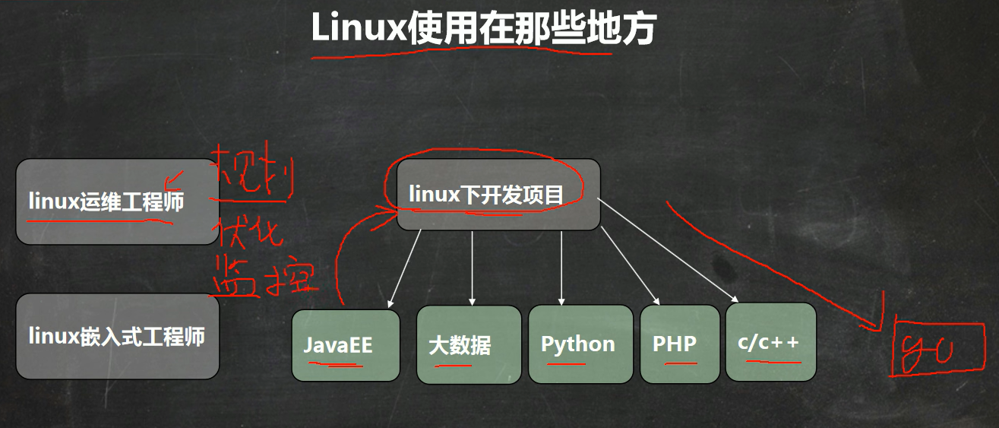
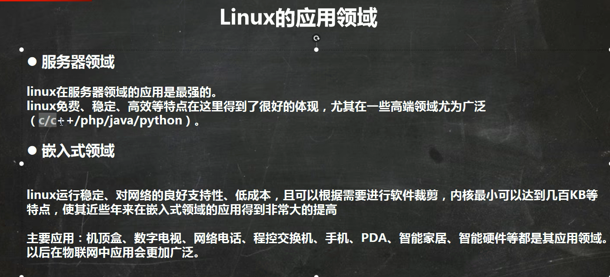

# Linux入门

## 1、linux简介

一种开源的、免费的操作系统，安装在计算机硬件上、用来管理计算机的硬件和软件资源的系统软件。
              linux注重安全性、稳定性、高并发处理能力，没有优异的可视化界面
	      windows用于个人计算机上，linux用于企业服务器上。

 

 


## 2、linux的发行版本

linus在1991年开发，linux的内核程序，后来很多软件开发组织以及软件公司在内核程序基础之上，陆续推出很多不同版本的linux操作系统：Ubuntu(乌班图)、RedHat(红帽)、CentOS

## 3、安装linux操作系统

   1)、虚拟机：可以用软件模拟出一套具有完整硬件系统功能的、运行在一个完全隔离环境中的完整计算机系统。
       安装虚拟机：
   2)、安装linux: linux的镜像
       可视化界面比较单薄，很少使用；使用linux多数都是基于终端命令使用linux指令操作计算机。

## 4、linux的目录结构

   1)、linux只有一个根目录。/
   2)、层级式的目录结构：
       bin ->usr/bin：系统的可执行文件，可以在任何目录下执行
       usr/local/bin：用户自己的可执行文件，可以在任何目录下执行
       etc:存放配置文件。配置环境变量(/etc/profile)。
       home：每一个用户的根目录，用来保存用户私人的数据，默认情况下，目录名和自己的用户名相同。
       opt：存放额外安装的软件。相当于windows系统的中Program files目录。

## 5、linux的远程操作

​    1)、Xshell：linux的终端模拟软件。
​        安装并破解：解压、破解(运行两个.bat文件)、启动(Xshell)
​	连接远程linux系统：创建会话：
​	            查看linux系统的ip地址：ifconfig
​    2)、Xftp：文件传输软件。
​        安装并破解：解压、破解(运行两个.bat文件)、启动(Xftp)
​	连接远程linux系统：创建会话：
​	            查看linux系统的ip地址：ifconfig

## 6、vi和vim

​		linux中的文本编辑器，用来在linux中创建、查看或者编辑文本文件，就好像windows中的记事本一样。
​        vim是vi的增强版本，vi的绝大多数用法在vim都适用。

```assembly
vi和vim的使用：
    一般模式：用vi或者vim命令打开文件(vim test.txt)，进入了一般模式；
              可以查看文件的内容，并且可以通过上下左右键移动光标，查看文件某一部分；
	      但是不能编辑文件内容。
        编辑模式：在一般模式下，按i键或者a键，进入编辑模式；
              可以编辑文件内容；
	      但是不能保存编辑的内容；
	      按Esc键，可以回到一般模式。
        命令行模式：在一般模式下，按shift+:，进入命令行模式；
              输入： q!-----不保存强制退出编辑器
	             wq-----保存并且退出编辑器
		     q------只是退出编辑器

vi和vim编辑器的快捷键：
   1)复制当前行：在一般模式下，按yy，把光标所在行复制到剪切板
                               按p，把剪切板中的内容粘贴到光标所在的下一行。
   2)复制当前行往下5行：在一般模式下，按5yy，把光标所在行往下5行复制到剪切板
			按p，把剪切板中的内容粘贴到光标所在的下一行。
       3)在文本文件中查找关键字：在命令行模式下，输入/关键字，回车
                        按n表示光标查找下一个关键字
       4)删除光标所在的当前行：在一般模式下，按dd，删除光标所在的当前行
   5)删除光标所在的行往下5行：在一般模式下，按5dd
   6)撤销上次编辑的内容：在一般模式下，按u
   7)显示行号：命令行模式下，设置文件的行号，取消文件的行号.[命令行下(: set nu) 和(:set nonu)]
```


## 7、linux中的用户管理

```assembly
1)、任何使用linux的系统资源的用户，必须使用一个合法的账号和密码，账号和密码一般都是向系统管理员申请。
    root是linux系统安装时默认创建的系统管理员账号，由root创建普通账号。
2)、添加用户：useradd [选项] 用户名
    useradd lisi
      |->创建一个用户lisi
	  |->在/home目录下创建用的根目录，目录名称默认跟用户名相同
	  |->在linux中任何一个用户都至少属于一个组，新建用户时如果不指定组，则会新建一个组，组名跟用户名相同，并且把该用户添加到该组中。
useradd -d /home/ww wangwu   创建用户的同时，指定用户的根目录
3)、给用户设置密码:passwd 用户名
   passwd lisi
   *密码要满足一定的复杂度
4)、删除用户：userdel 用户名
   userdel lisi
   userdel -r lisi 删除用户的同时级联删除它的主目录
5)、查看用户信息：id 用户名
   id zhangsan
6)、切换用户：su 用户名
   su zhangsan
   *从权限高的用户切换权限低的用户，不需要密码验证；
    从权限低的用户切换到权限高的用户，必须密码验证。
```
## 8、linux中的组管理

​    1)、linux中的组相当于角色的概念，可以对有共性的用户进行统一管理；
​        每一个用户至少属于一个组，不能独立于组存在，也可以属于多个组；
​	新建用户时如果不指定组，则会新建一个组，组名跟用户名相同，并且把该用户添加到该组中。
​    2)、添加组：groupadd 组名
​        groupadd dev
​    3)、删除组：groupdel 组名
​        groupdel dev
​    4)、把用户添加到组中：gpasswd -a 用户名 组名
​         gpasswd -a zhangsan dev
​    5)、把用户从组中移除：gpasswd -d 用户名 组名
​         gpasswd -d zhangsan dev
​    6)、添加用户时，指定所属的组(主组)：useradd -g 组名 用户名
​         useradd -g dev lisi

## 9、linux中的系统操作命令

​    关机：shutdown now  立即关机
​          shutdown -h xxx  定时关机
​	  shutdown -r now  立即重启
   重启：reboot  立即重启
   同步数据库：sync

## 10、linux中的帮助命令

   1)、用来查看linux系统手册上的帮助信息：man 命令
       man ls
       分屏显示、按回车翻一行、按空格翻一页、按q退出查看。
   2)、用来查看命名的内置帮助信息：help 命令
       help cd

## 11、linux中的文件和目录操作的命令

```assembly
1)、查看当前所在目录：pwd
   pwd
2)、查看指定目录下所有的子目录和文件列表：ls [选项] [指定目录]
|->绝对目录
|->相对目录
   ls /home
   ls 查看当前目录下所有的子目录和文件列表
   ls -l /home ：以列表形式显示
   ls -a /home：显示指定目录下所有的子目录和文件(包括虚拟的目录)
   ls -al /home:以列表形式显示指定目录下所有的子目录和文件(包括虚拟的目录)
3)、切换目录：cd 目录名
                    |->绝对目录：以盘符开始的目录叫绝对目录，从盘符开始查找目标目录
		             cd /opt/testDir
			     ~：当前用户的根目录。在任何目录下执行:cd ~，进入当前用户的根目录。 
		|->相对目录：以目录名开始的目录叫相对目录，从当前目录开始查找目标目录
		             cd testDir
			     ..:当前目录的上一级目录，从的当前目录开始查找它的上一级目录。 
			     .:当前目录
				        xxx.sh====>./xxx.sh
4)创建目录：mkdir [选项] 目录名
                            |->绝对目录
		        |->相对目录
	mkdir /opt/testDir/test1 //在/opt/testDir目录下创建一个目录test1(使用绝对目录)
	mkdir test2 //在/opt/testDir目录下创建一个目录test2(使用相对目录)

            mkdir -p /opt/testDir/test3/test4 //在/opt/testDir目录下创建目录test3，并且在test3下创建test4(一次创建多级目录)
	mkdir -p test5/test6
5)、删除一个空目录：rmdir 目录名
            rmdir test1
	rmdir test3
6)、创建一个或者多个空文件：touch 文件名列表(文件名之间用空格隔开)
            touch t1.txt
            touch t2.txt t3.txt t4.txt
7)、复制文件或者目录：cp [选项] source(源) dest(目标)
            cp t1.txt test2  //把t1.txt文件复制到test2目录中
	cp -r test2 test5   //把test2目录复制到test5目录中(递归地复制目录)

	cp t1.txt test2
8)、删除文件或者目录：rm 文件名或者目录名
            rm t1.txt  提示删除文件
	rm -f t2.txt  强制删除文件

	rm -r test2  提示递归删除目录
	rm -rf test5  强制递归删除目录
9)、移动目录或者文件：mv source(源) dest(目标)
            mv test.txt test1
	mv test1 test2
	mv t3.txt t3_new.txt  文件重命名
	*如果目标中已经存在该文件或者目录，则会提示是否覆盖。
10)、查看文件内容：cat 文件名
            文件内容一次性显示出来。
            cat t4.txt
	cat -n t4.txt  显示行号
11)、分页查看文件文件内容：more 文件名  一次性加载文件所有内容到内存，分页显示
            按回车翻一行、按空格翻一页
            more t4.txt
12)、分页查看文件文件内容：less 文件名 分页加载文件所有内容到内存，分页显示
            less t4.txt
	按回车翻一行、按空格翻一页，按q退出查看
13)、查看文件的头10行：head [选项] 文件名
            head t4.txt
            head -n 5 t4.txt
14)、查看文件的后10行：tail [选项] 文件名
           tail t4.txt
       tail -n 5 t4.txt
15)、echo：输出系统变量或者常量的值到命令行终端。
           echo $JAVA_HOME
	 echo $PATH
	  echo Hello World!

JAVA_HOME=D:\DPFS\Java\jdk1.8.0_101
PATH=%JAVA_HOME%\bin;.......
CLASSPATH=%JAVA_HOME%\lib;.
16)把前一个查看命令的结果输出到指定的文件中： 查看命令 > 文件名
     *如果目标文件不存在,则新建一个文件
 *如果目标文件已存在，则把文件以前的内容覆盖
    ls > ret.txt
    ls -al > ret.txt
cat ret.txt > t3_new.txt 文件内容的复制
cat t4.txt > t3_new.txt
17)把前一个查看命令的结果追加输出到指定的文件中：查看命令 >> 文件名
    *如果目标文件不存在,则新建一个文件
*如果目标文件已存在，则在文件原来内容的基础上进行追加
ls > ret.txt
ls -al >> ret.txt
cat t4.txt >> ret.txt
```


## 12、linux中关于日期和时间的操作命令

```assembly
1)、查看或者设置系统的日期或者时间：date
  date 查看系统当前的完整的日期和时间
  date +%Y  系统当前的年份
  date +%m  系统当前的月份
  date +%d  系统当前的日期
  date '+%Y-%m-%d %H:%M:%S' 按yyyy-MM-dd HH:mm:ss格式显示
  date -S '2020-10-20 10:20:30' 设置当前的系统时间
2)、查看系统日历：cal
  cal：查看当前月份的日历
  cal 2020：查看指定年份的日历
```

##  13、linux中关于搜索文件或者目录的命令:

```assembly
1)find [搜索范围][搜索标准] 关键字
            |->-name：默认按名称搜索(文件或者目录所在的路径也在搜索范围之内)
		    |->-size：按文件大小搜索
		    |->-user：按文件的所有者搜索
find *.txt  搜索当前目录下，所有的.txt文件
find *e*  搜索当前目录下，所有名称中包含e的那些文件或者目录
 find /etc *.txt  搜索/etc目录下所有.txt文件

 find /etc -size -5k  搜索/etc目录下所有小于5k的文件

 find /etc -user zhangsan  搜索/etc目录下所有的所有者是zhangsan的文件和目录

2)locate:在整棵目录树中搜索文件或者目录，都是根据名称搜索，效率高。
  updatedb
  locate 关键字

  updatedb
  locate *.txt
3)搜索过滤命令，在前一个搜索命令的结果中进行按名称进一步过滤：搜索命令 |grep [选项] 过滤条件 
                                                              查看命令 |grep [选项] 过滤条件
  find *.txt|grep new  搜索当前目录下，所有名称包含new的.txt文件
  find /etc -size -5k|grep firefox

  cat t1.txt|grep beijing
  cat t1.txt|grep -ni beijing

  ls -al|grep new
```

## 14、linux中有关压缩和解压的命令

```assembly
1)、压缩或者解压单个文件：gzip 文件名：压缩单个文件，生成一个.gz的压缩包，并且会把原来的文件删除。
                      gunzip .gz压缩包名:解压.gz压缩包，并且会把原来的.gz压缩包删除。
			  gzip ret.txt
		      gunzip ret.txt.gz
2)、压缩(打包)或者解压多个文件和目录：zip 目标压缩包名称(通常使用.zip压缩包) 文件或者目录列表：
				  unzip 压缩包名(.zip) -d 解压目录名：将指定的.zip压缩包解压到当前目录(或者指定目录)。

		                  zip test.zip ret.txt t1.txt test2 
				  unzip test.zip -d test3

				  zip mytest.zip test.zip t3_new.txt t4.txt test2
3)、压缩(打包)或者解压多个文件和目录：tar [选项] 目标压缩包名称(xxx.tar.gz) 文件或者目录列表
                                             |->c：打包或者压缩
			          tar [选项] 压缩包名(xxx.tar.gz) -C 解压目录名：将指定的.tar.gz压缩包解压到当期目录(或者指定目录)
					 |->x: 解压
			          
				  tar -zcvf xxx.tar.gz 文件或者目录列表
				  tar -zxvf xxx.tar.gz -C 解压目录名

                                      tar -zcvf mytar.tar.gz mytest.zip ret.txt t1.txt test2
				  tar -zxvf mytar.tar.gz -C /opt/testDir/test5
```

## 15、文件或者目录与组

1)文件或者目录与组基本介绍:
  在linux中,每一个用户都至少属于一个组，用户不能独立于组存在，一个用户可以属于多个组。

  在linux中，每一个文件或者目录也必须属于一个组，而且只能属于一个组，默认情况下，文件所有者所属的主组就是文件所属的组；
  文件或者目录通过组来控制哪些用户可以对它进行哪些操作，即文件或者目录的访问权限;
  在文件或者目录看来，linux系统中所有的用户分为三类：
     所有者：默认情况下，文件或者目录的所有者都是创建者，可以修改
     同组用户：跟文件或者目录属于同一个组的用户
     其它组用户：既不是文件或者目录的所有者，也不是同组用户
2)查看文件的所有者和所在的组：
  ls -l
3)、修改文件或者目录的所有者：chown 新的所有者 文件名或者目录名
                              chown 新的所有者:新的组 文件名或者目录名
   chown zhangsan t1.txt
   chown -R zhangsan test3
   chown zhangsan:dev t4.txt

   chown zhangsan:dev test2
   chown -R zhangsan:dev test2 递归修改目录的所有者和所在的组 
4)、修改文件或者目录的所在组：chgrp 新的组 文件名或者目录名
   chgrp dev t2.txt
   chgrp -R dev test3


​       

## 16、Linux中文件或者目录的权限管理

​    1)准备工作：
​      一个用户至少属于一个组，也可以属于多个组；
​      一个文件或者目录也必须属于一个，并且只能属于一个组；
​     在一个文件或者目录看来，linux系统中所有的用户可以分为三类：
​        所有者：
​	同组用户：
​	其它组用户：
​    2)、文件或者目录的三种权限：
​        在linux中，任何文件或者目录都有三种权限：读(Read)、写(Write)、执行(Execute)
​           对于文件而言:
​	       读：可以读取、查看文件的内容， 比如：cat、more、less、head、tail等。
​	       写：可以修改文件的内容，比如：vi或者vim等
​	       执行：如果该文件是可执行文件(.sh)，可以直接运行，比如：./xxx.sh。
​	   对于目录而言：
​	       读：可以读取、查看目录下边的内容，比如：ls等
​	       写：可以修改目录中的内容，创建子目录、删除子目录、创建文件、删除文件、重名文件或者目录
​	       执行：可以进入该目录， 比如：cd等。
​     3)、文件或者目录的权限控制：
​         在linux中，任何一个文件或者目录都有三部分权限：所有者权限、同组用户权限、其它组用户权限。
​	       第一部分权限：所有者权限，文件或者目录的所有者对该文件所拥有的权限，使用r、w、x分表表示读、写、执行的权限。比如：rwx：拥有读写执行的权限，r-x：拥有读和执行的权限，r--：只拥有读的权限，---：没有任何权限。
​	       第二部分权限：同组用户权限，文件或者目录的同组用户对该文件所拥有的权限，使用r、w、x分表表示读、写、执行的权限。
​	       第三部分权限：其它组用户权限，文件或者目录的其它组用户对该文件所拥有的权限，使用r、w、x分表表示读、写、执行的权限。
​     4)、查看文件或者目录的权限：
​	       ls -aul
​     5)、修改文件或者目录的权限：chmod
​               用r、w、x分辨表示读、写、执行的权限，
​	       用u、g、o、a分别表示给所有者、同组用户、其它组用户、所有用户修改权限
​	       用+、-、=分别表示给指定的用户增加、减少、设置对应的权限

​		   chmod g-w,o+w t5.txt
​	       chmod g=rwx t5.txt
   		chmod a-r t5.txt

​	 6)、使用数字的方式修改文件或者目录的权限：
​    	       每一个权限可以用一个数字来表示：
​        	     r、w、x
​		     	4、2、1
​	    	 	2^2 2^1 2^0
​	       每一个文件或者目录都有三部分权限，每一部分权限都可以用一组数据之和来表示，三部分权限就是一组三个数据序列：
​           	  rw- r-x r-x
​			     6    5   5

​			     rwx r-x -wx

​		 753： rwxrwxrwx
​    	 777:
   		chmod 777 t5.txt

​		   chmod 753 t5.txt

## 17、linux中的网络管理

​    在linux的配置文件： vi /etc/sysconfig/network-scripts/ifcfg-ens33

​	BOOTPROTO="static"
​	ONBOOT="yes"
​	IPADDR=192.168.11.128
​	GATEWAY=192.168.11.2
​	DNS=192.168.11.2

​	重启linux:  reboot

##  18、linux中的进程管理

​    线程：一个程序的线路
​    进程：一个程序的执行，一个进程占用一个端口。

​	查看正在运行的进程：ps
​	ps  //只会显示应用进程
​	ps -e  //显示所有进程
​	ps -ef //以全格式的形式显示所有进程
​           //用于查看linux系统中某一些软件或者应用是否处于启动状态

​	ps -ef|grep mysql

​	关闭进程：	
​    	使用ps命令查看进程的PID
​		使用命令kill -9 PID

## 19、linux中服务管理

​    1)、服务介绍：服务是支持Linux运行的一些必要程序，本质上也是进程，叫守护进程。
​    2)、操作服务：systemctl [start|stop|restart|reload|status|enable] 服务名称

​	systemctl status firewalld  查看防火墙运行状态
​	systemctl stop firewalld 关闭防火墙
​	systemctl start firetalld 开启防火墙
​	systemctl enable firewalld 设置防火墙开机启动

​	*老版的linux或者有些发行版本的linux，操作服务使用service命令。	

## 20、linux中软件包的管理

​	软件安装包
​    1)、RPM包管理：
​    a)RPM：一种LInux的软件包的打包和安装工具，它操作的软件包都是.rpm结尾。
​    b)使用RPM：rpm命令。

​	查看当前系统中已经安装的rpm软件包：rpm -qa|grep firefox
​	卸载rpm软件包：rpm -e firefox
​    安装rpm包：rpm -ivh xxx.rpm
​             cp firefox-45.4.0-1.el7.centos.x86_64.rpm /opt
​             rpm -ivh firefox-45.4.0-1.el7.centos.x86_64.rpm
​	2)、YUM包管理：是一种基于RPM的软件包管理工具，它能够从指定服务器上自动下载RPM包并且自动安装，可以自动处理软件包之间的依赖关系。
​    	查看当前系统中已经安装的rpm软件包：yum list installed|grep firefox
​		卸载rpm软件包：yum remove firefox.x86_64
​	    安装rpm包：yum install firefox

## 21、linux中搭建JavaEE开发环境

​    http://192.168.11.128:8080/  


# Redis入门

## 1、Redis简介

   Redis是一种数据库。能够存储数据、管理数据的一种软件。

## 2、数据库应用的发展历程

   单机数据库时代：一个应用，一个数据库实例
   缓存、水平切分时代：
   读写分离时代:
   分表分库时代(集群):

   关系型数据库：oracle、mysql、DB2、sqlserver、....

   非关系型数据库(NoSql)： 彻底改变底层存储机制。不再采用关系数据模型，而是采用聚合数据结构存储数据。
        redis、mongoDB、HBase、....
         
 3、Nosql数据模型：
   关系型数据库：表
       tbl_student                            tbl_clazz
       id    name    age    clazz_id          id       name
       1001  zhangsan 20      111             111      clazz1
       1002  lisi     21      111             222      clazz2
   非关系型数据库：聚合模型---把一组相关联的数据作为一个整体进行存储和管理。
       BSON：数据保存到键值对中、数据和数据之间用逗号隔开，{}表示对象，[]表示数组。
             {
	        id:1001,
		name:zhangsan,
		age:20,
		clazz:{
		   id:111,
		   name:clazz1
		}
	     }
	     {
	        id:1002,
		name:lisi,
		age:21,
		clazz:{
		   id:111,
		   name:clazz1
		}
	     }
     K-V键值对、列簇、图表模型等。

​	 Redis采用的是K-V模型存储数据的。

4、Redis是一个用C语言编写的、开源的、基于内存运行并支持持久化的、高性能的NoSQL数据库.也是当前热门的NoSQL数据库之一。
   Redis中的数据大部分时间都是存储内存中的，适合存储频繁访问、数据量比较小的数据。
   缓存数据库


