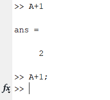
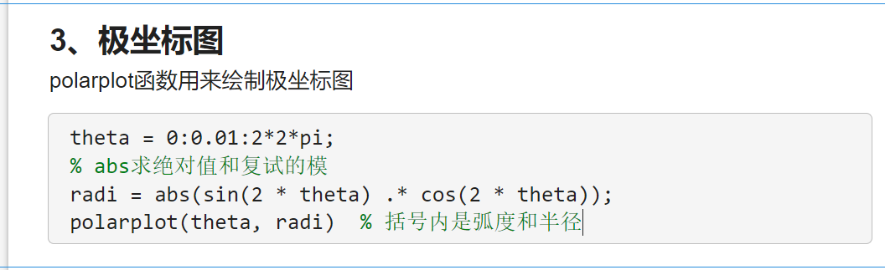

[TOC]


# 一、基础操作


 


> - 实时脚本文件

 


## 1、变量

**String**

 


**char**

 


> - 分号的作用
>   - 代表换行
>   - 如下，加一不带分号就会把结果输出，如果带了分号就不会输出结果
>     - ;相当于决定此行为输出行还是计算行

 


## 2、矩阵

### 2.1、矩阵的表示

> - 矩阵的表示

```matlab
a = [1, 2, 3];
b = [1 2 3]; % 可写逗号或者不写逗号
c = [a ; b]; % ;代表换行，可以表示列向量

disp(c) % 显示矩阵
```


### 2.2、查找元素

> - 如何提取指定的元素？
>   - 喵的结果会不会太长了

```matlab
%% matlab中提取矩阵中指定的元素
% (1)指定行和列提取元素
E = [1 1 4 1/3 3;
     1 1 4 1/3 3;
     1/4 1/4 1 1/3 1/2;
     3 3 3 1 3;
     1/3 1/3 2 1/3 1];
disp(E(2, 1))

% (2)指定某一行的全部元素(输出的是一个行向量)
disp(E(2,:))

% (3)指定某一列的全部元素(输出的是一个列向量)
disp(E(:,2))

% (4)取指定的某些行的全部元素(输出的是一个矩阵)
disp(E([2, 5],:)) % 去第二行和第五行的全部元素(一共两行)

disp(E(2:5,:)) % 取第二行到第五行的元素，其中2:5是等差数列的含义
disp(E(2:2:5,:)) % 取第二行和第四行，从2开始，每次递增2个单位，到5结束

disp(E(2:end,:)) % 取第二行到最后一行
disp(E(2:end-1,:))% 取第二行到倒数第二行

% (5)取矩阵的全部元素（将全部列拼接到第一列去）
disp(E(:))


% output
     1

    1.0000    1.0000    4.0000    0.3333    3.0000

    1.0000
    1.0000
    0.2500
    3.0000
    0.3333

    1.0000    1.0000    4.0000    0.3333    3.0000
    0.3333    0.3333    2.0000    0.3333    1.0000

    1.0000    1.0000    4.0000    0.3333    3.0000
    0.2500    0.2500    1.0000    0.3333    0.5000
    3.0000    3.0000    3.0000    1.0000    3.0000
    0.3333    0.3333    2.0000    0.3333    1.0000

    1.0000    1.0000    4.0000    0.3333    3.0000
    3.0000    3.0000    3.0000    1.0000    3.0000

    1.0000    1.0000    4.0000    0.3333    3.0000
    0.2500    0.2500    1.0000    0.3333    0.5000
    3.0000    3.0000    3.0000    1.0000    3.0000
    0.3333    0.3333    2.0000    0.3333    1.0000

    1.0000    1.0000    4.0000    0.3333    3.0000
    0.2500    0.2500    1.0000    0.3333    0.5000
    3.0000    3.0000    3.0000    1.0000    3.0000

    1.0000
    1.0000
    0.2500
    3.0000
    0.3333
    1.0000
    1.0000
    0.2500
    3.0000
    0.3333
    4.0000
    4.0000
    1.0000
    3.0000
    2.0000
    0.3333
    0.3333
    0.3333
    1.0000
    0.3333
    3.0000
    3.0000
    0.5000
    3.0000
    1.0000
```


### 2.3、矩阵运算

> - 矩阵的运算

```matlab
%% MATLAB中关于矩阵的运算
% MATLAB在组合矩阵的运算中，"*"号和"/"号代表矩阵之间的乘法与除法(A/B = A * inv(B))
A = [1, 2;
     3, 4];
B = [1, 0;
     1, 1];
disp('A * B = ')
disp(A * B)
disp('inv(B) = ')
disp(inv(B)) % 求B的逆矩阵
disp('B * inv(B) = ')
disp(B * inv(B))
disp('A * inv(A) = ')
disp(A * inv(A))
disp('A / B = ')
disp(A / B)

% 两个形状相同的矩阵对应元素之间的乘除法需要使用".*"和"./"
A = [1, 2;
     3, 4];
B = [1, 0;
     1, 1];
disp('A .* B = ')
disp(A .* B)
disp('A ./ B = ')
disp(A ./ B)
disp('A^2 = ') % 这个等价于A * A
disp(A^2)
disp('A .^ 2 = ') % 这个就是对A的每个元素进行点平方
disp(A .^ 2)


% output
A * B = 
     3     2
     7     4

inv(B) = 
     1     0
    -1     1

B * inv(B) = 
     1     0
     0     1

A * inv(A) = 
    1.0000         0
    0.0000    1.0000

A / B = 
    -1     2
    -1     4

A .* B = 
     1     0
     3     4

A ./ B = 
     1   Inf
     3     4

A^2 = 
     7    10
    15    22

A .^ 2 = 
     1     4
     9    16
```


### 2.4、特征值和特征向量

> - 求特征值和特征向量

```matlab
%% MATLAB的特征值和特征向量
% 在MATLAB中，计算矩阵A的特征值和特征向量的函数是eig(A)
A = [1, 2, 3;
     2, 2, 1;
     2, 0, 3];
% (1)E = eig(A)：求矩阵A的全部特征值，构成向量E
disp('eig(A) = ')
disp(eig(A))
% (2)[V, D] = eig(A)：求矩阵A的全部特征值，构成对角矩阵D，并求A的特征向量构成V的
% 列向量。(V的每一列都是与D中特征值对应列的特征向量)
disp('[V, D] = eig(A) = ')
[V, D] = eig(A);
disp([V, D])


% output
eig(A) = 
   -1.3166
    5.3166
    2.0000

[V, D] = eig(A) = 
    0.8364   -0.6336   -0.2408   -1.3166         0         0
   -0.3875   -0.5470   -0.8427         0    5.3166         0
   -0.3875   -0.5470    0.4815         0         0    2.0000
```


### 2.5、查找非零元素

> - find

```matlab
%% find函数查找矩阵的非零元素
% find函数，用来返回向量或者矩阵中不为0的元素的位置索引
X = [1, 0, 4, -3, 0, 1, 0];
disp('find(X) = ')
disp(find(X))
% 返回前2个不为0的元素的位置
disp('find(X, 2) = ')
disp(find(X, 2))

% 针对多维的情况
X = [1, -3, 0;
     0, 0, 8;
     4, 0, 6];
disp('find(X) = ')
disp(X) % 在存储矩阵时，是以列为单位存储的

% 输出非零元素的下标
disp('[r, c] = find(X) = ')
[r, c] = find(X);
disp([r, c])


% output
find(X) = 
     1     3     4     6

find(X, 2) = 
     1     3

find(X) = 
     1    -3     0
     0     0     8
     4     0     6

[r, c] = find(X) = 
     1     1
     3     1
     1     2
     2     3
     3     3
```


### 2.6、矩阵大小判断

```matlab
%% 矩阵与常数的大小判断运算
% 这些判断都是针对矩阵的每个元素来说的，最后会返回一个logical数组
X = [1, -3, 0
     0, 0, 8;
     4, 0, 6];
disp('X > 0: ')
disp(X > 0)
disp('X == 4: ')
disp(X == 4)


% output
X > 0: 
   1   0   0
   0   0   1
   1   0   1

X == 4: 
   0   0   0
   0   0   0
   1   0   0
```


### 2.7、矩阵行列数

> - size函数

```matlab
A = [1, 2, 3, 4, 5, 6];
B = [1, 2, 3, 4, 5, 6];
disp('A的size为：')
disp(size(A)) % 返回的是一个行向量，第一个为行数，第二个为列数
disp('B的size为：')
disp(size(B))
[r, c] = size(A); % 赋值给一个向量
disp('赋值后的矩阵[r, c]：')
disp([r, c])
r = size(A, 1); % 返回行数
c = size(A, 2); % 返回列数


% output
A的size为：
     1     6

B的size为：
     1     6

赋值后的矩阵[r, c]：
     1     6
```


### 2.8、平铺矩阵

> - repmat

```matlab
%% repmat函数
% 将矩阵复制m×n块，即把A矩阵作为一个元素，B则由m×n个A平铺而成
A = [1, 2, 3;
     4, 5, 6];
B = repmat(A, 2, 2);
disp(B)


% output
     1     2     3     1     2     3
     4     5     6     4     5     6
     1     2     3     1     2     3
     4     5     6     4     5     6
```


## 3、做图

> - **线图**

```matlab
1、线图
plot函数用来创造x和y值的简单线图
x = 0:0.05:30;  % 从0~30，每隔0.05取一次值
y = sin(x);
plot(x, y, 'LineWidth', 2)
xlabel("横轴标题")  % 若(x, y, 'LineWidth', 2)可变粗  
ylabel("纵轴标题")
grid on   % 显示网格
axis([0 20 -1.5 1.5])  % 设置横纵坐标范围

多组函数显示在一张图
y_1 = sin(x)
y_2 = cos(x)
plot(x, y_1, x, y_2)
axis([0 20 -2 2])
```

 

  


> - **条形图**

```matlab
2、条形图
bar函数创建垂直条形图
barch函数用来创建水平条形图
t = -3:0.05:3;
p = exp(-t .* t);   % e^(-t 点乘 t)
bar(t, p)
barh(t, p)
```

  


> - **极坐标图**

```matlab
3、极坐标图
polarplot函数用来绘制极坐标图
theta = 0:0.01:2*2*pi;
% abs求绝对值和复试的模
radi = abs(sin(2 * theta) .* cos(2 * theta));
polarplot(theta, radi)  % 括号内是弧度和半径
```

  


> - **散点图**

```matlab
4、散点图
scatter函数用来绘制x和y值的散点图
Height = randn(50, 1);  % randn函数的返回的随机数是符合正态分布的，样本空间为50
Weight = randn(50, 1);
scatter(Height, Weight)
xlabel('Height')
ylabel('Weight')
```

 

  


> - 三维

```matlab

1、三维曲面图
surf函数可用来做三维曲面图。一般展示函数z = z(x,y)的图像
首先需要用meshgrid创建好空间上(x,y)点
[x, y] = meshgrid(-2: 0.2 : 2);
% Z = X .^ 2 + Y .^ 2
z = x .* exp(-x.^2 - y.^2);
surf(x, y, z);  % 作图
colormap hsv    % colormap设置颜色，可以跟winter、summer搭配
colorbar    % 见图知意


```

 

  


> - 子图

 

 


## 4、导入

  

 


## 5、预处理

  

 

 


> - 原始数据 - 差值数据 - 离群数据

  

 


## 6、符号变量和简单运算

> - 方程会用到

```matlab
%% 符号变量的创建和简单运算
% 代码参考：我要自学网的龚飞老师《Matlab2016数值计算与智能算法》
clear;clc

% 简单符号变量的创建
syms x  % 观察工作区， sym是symbolic的缩写
syms a b c

% 符号方程的创建，两种方法
syms a x
y = a*x+x^2
% y = str2sym('a*x+x^2')  %Matlab 2017b 版本后推出

% 符号矩阵
syms alpha
M = [cos(alpha)  -sin(alpha);
       sin(alpha)  cos(alpha)]

%% 简单运算
syms a b c d e
y = a + b
% a + b
x = c - d
% c - d
y1 = x*y
% (a + b)*(c - d)
y2 = y1/y
% c - d
y3 = y1^3
% (a + b)^3*(c - d)^3
y4 = sqrt(y3)   
% ((a + b)^3*(c - d)^3)^(1/2)
y5 = exp(y4)
% exp(((a + b)^3*(c - d)^3)^(1/2))


%% 符号表达式的整理
clear;clc

% 化简
syms a
y=(cot(a/2)-tan(a/2))*(1+tan(a)*tan(a/2))
simplify(y)
% 2/sin(a)

%% 因式分解
factor(12) % 对常数进行因式分解 
%      2     2     3
syms m n x
y = -24*m^2*x-16*n^2*x
factor(y)
% [ -8, x, 3*m^2 + 2*n^2]
y1=m^3-n^3
factor(y1)
% [ m - n, m^2 + m*n + n^2]

%% 多项式展开
syms a x
y = a*(x^2-a)^2+(x-2)
expand(y)
% a^3 - 2*a^2*x^2 + a*x^4 + x - 2

%% 合并
syms x y
z = (x+y)^2*y+5*y*x-2*x^3
% expand(z)   - 2*x^3 + x^2*y + 2*x*y^2 + 5*x*y + y^3
collect(z,x)
% y*x^2 - 2*x^3 + (2*y^2 + 5*y)*x + y^3
collect(z,y)
% y^3 + 2*x*y^2 + (x^2 + 5*x)*y - 2*x^3

%% 计算分子与分母
% [z1,z2] = numden(2.5)  % 会报错，因为numden的输入变量不能是数值，只能是符号变量
% ans = sym(2.5);  % sym函数可以将数值2.5转换为符号
[z1,z2] = numden(sym(2.5)) % 对常数计算分子与分母
% z1 = 5
% z2 = 2
syms x y
z = 1/x*y+x/(x^2-2*y)
[z1,z2] = numden(z)  %z1分子，z2分母
% z1 = - x^2*y - x^2 + 2*y^2
% z2 = x*(- x^2 + 2*y)

%% 让结果显示的更加自然
syms x y
M = (1/x*y+x/(x^2-2*y)-x^2/(3+y)^2)^2;
expand(M)  
% y^2/x^2 + x^4/(y^4 + 12*y^3 + 54*y^2 + 108*y + 81) + (2*x^3)/(- x^2*y^2 - 6*x^2*y - 9*x^2 + 2*y^3 + 12*y^2 + 18*y) - (2*y)/(- x^2 + 2*y) + x^2/(x^4 - 4*x^2*y + 4*y^2) - (2*x*y)/(y^2 + 6*y + 9)
mupad % 未来的版本可能会移除这个工具箱，可以点击Matlab的主页，新建实时脚本
```


## 7、HOT KEY

### 7.1、清屏/清空工作区

> - clear：清除工作区的所有变量

> - clc：清除command的所有文本

> - 一般都会在代码开头加一行clear;clc
>   - 相当于初始化，清空了前面脚本的工作区，防止出现干扰


### 7.2、打印

> - disp('打印的方式')


### 7.3、拼接字符串

> - 拼接两个字符串有两种方法
>   - strcat(str1, str2, str3)
>   - [str1, str2, str3s]

```matlab
% 拼接两个字符串有两种方法
% (1)strcat(str1, str2, str3)
d = strcat('nb', '666'); % strcat('nb' '666')
disp(d)

% (2)[str1, str2, str3s]
e = ['woqu', 'niude'];
disp(e)
```


### 7.4、输入

> - input输入函数

```matlab
% input：负责接收用户输入的数、向量、矩阵和字符串等
A = input('请输入A:'); % 不带分号cmd就会把A打印出来
```


### 7.5、sum求和

> - sum求和

```matlab
% sum求和函数
% (1)如果是向量(无论列向量还是行向量)，都是直接求和
B = [1, 2, 3];
disp('行向量求和的结果')
disp(sum(B))
C = [1; 2; 3];
disp('列向量求和的结果')
disp(sum(C))

% (2)若是矩阵的话，就需要根据行和列的方向做区分
D = [1, 2;
     3, 4;
     5, 6];
disp('默认按列求和')
disp(sum(D)) % 默认按列求和
disp('设置按列求和')
disp(sum(D, 1)) % 设置按列求和
disp('设置按行求和')
disp(sum(D, 2)) % 设置按行求和
disp('对整个矩阵求和')
disp(sum(sum(D))) % 原理：先对列求和，再对得到的行求和
disp(sum(D(:))) % 语法糖：D(:)把每一列都按序放到第一列去，再按列求和


% output
行向量求和的结果
     6

列向量求和的结果
     6

默认按列求和
     9    12

设置按列求和
     9    12

设置按行求和
     3
     7
    11

行向量求和的结果
     6

列向量求和的结果
     6

默认按列求和
     9    12

设置按列求和
     9    12

设置按行求和
     3
     7
    11

对整个矩阵求和
    21

    21
```


## spur

`

`

`